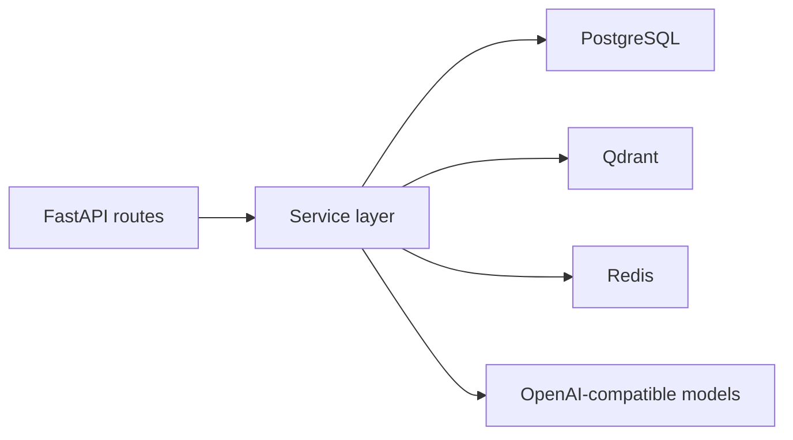

# API 使用指南

`apps/api` 是 SymboGraph 的 FastAPI 后端。它负责编排知识库、文件上传、解析、证据图、信号层、切块质量门禁、active chunks、向量索引、检索、问答、引用验证、运行时设置和维护接口。

## 运行方式

推荐通过 Docker Compose 运行完整栈：

```powershell
docker compose -f infra/docker-compose.yml up -d --build
```

API 容器名：

```text
course-kg-api
```

健康检查：

```powershell
Invoke-WebRequest -UseBasicParsing http://127.0.0.1:8000/api/health
```

## 本地开发命令

从 `apps/api` 执行：

```powershell
python -m pytest tests
python -m pytest tests/test_evidence_graph_pipeline.py tests/test_evidence_first_retrieval.py -q
```

容器内执行：

```powershell
docker exec -w /app/apps/api course-kg-api python -m pytest tests/test_evidence_graph_pipeline.py tests/test_evidence_first_retrieval.py tests/test_quality_system.py -q
```

## 配置入口速查

优先使用仓库根目录 `.env`。API 会读取：

```text
<repo>/.env
apps/api/.env
```

常用参数：

| 参数 | 说明 |
| --- | --- |
| `DATABASE_URL` | PostgreSQL 连接串 |
| `QDRANT_URL` / `QDRANT_COLLECTION` | Qdrant 地址和集合名 |
| `REDIS_URL` | Redis、Celery broker、缓存和运行时广播 |
| `OPENAI_API_KEY` / `CHAT_BASE_URL` / `CHAT_MODEL` | Chat 模型配置 |
| `EMBEDDING_API_KEY` / `EMBEDDING_BASE_URL` / `EMBEDDING_MODEL` / `EMBEDDING_DIMENSIONS` | Embedding 配置 |
| `WORKER_CONCURRENCY` / `INGESTION_FILE_CONCURRENCY` / `MODEL_REQUEST_CONCURRENCY` | 并发上限 |
| `CHUNK_TOKEN_BUDGET` | active chunk 候选预算 |
| `RERANKER_ENABLED` / `RERANKER_MODEL` / `RERANKER_DEVICE` | 可选 Cross-Encoder reranker |
| `ENABLE_MODEL_FALLBACK` / `ENABLE_DATABASE_FALLBACK` | active path 应保持 `false` |

详细环境参数和公式说明见仓库根目录 [README.md](../../README.md) 的“环境参数总表”。

Cross-Encoder reranker 默认关闭。启用时：

```env
RERANKER_ENABLED=true
RERANKER_MODEL=cross-encoder/ms-marco-MiniLM-L-6-v2
RERANKER_MAX_LENGTH=512
RERANKER_DEVICE=cpu
```

如果 `HF_HUB_OFFLINE=1`，模型必须已经缓存或 `RERANKER_MODEL` 指向本地模型路径。

## 主要模块

| 路径 | 用途 |
| --- | --- |
| `app/api.py` | REST/SSE 路由入口 |
| `app/models.py` | SQLAlchemy 数据模型 |
| `app/schemas.py` | Pydantic API 契约 |
| `app/services/evidence_graph.py` | evidence atoms、observed edges、chunk candidates、active chunks |
| `app/services/evidence_signal_projection.py` | signal candidates、signal decisions、signal nodes、projection views |
| `app/services/retrieval.py` | evidence-first search、signal expansion、trace audit |
| `app/services/agent_graph.py` | QA agent、citation grounding、verification |
| `app/services/quality/` | quality signals、policies、gate/reward/feedback |
| `app/services/runtime_settings.py` | `.env` 写入、Redis 广播、热加载 |



## Agentic QA

`app/services/agent_graph.py` 是问答 Agent 的编排入口。它不是单次 RAG prompt，而是一个 LangGraph 状态机：

```mermaid
flowchart LR
    P["Perception"] --> RP["RetrievalPlanner"]
    RP --> BR["BaseRetrieval"]
    BR --> EA["EvidenceAnchorSelector"]
    EA --> CP["EvidenceChainPlanner"]
    CP --> GE["ControlledGraphEnhancer"]
    GE --> AS["EvidenceAssembler"]
    AS --> DG["DocumentGrader"]
    DG --> EE["EvidenceEvaluator"]
    EE -->|retry| RP
    EE -->|pass| CS["ContextSynthesizer"]
    CS --> AG["AnswerGenerator"]
    AG --> CC["CitationChecker"]
    CC --> CV["CitationVerifier"]
    CV --> RF["Reflection"]
    RF --> SC["SelfCheck"]
```



开发时重点检查：

| 节点 | 关注点 |
| --- | --- |
| `Perception` | 只选择动作路径，不使用词表门禁，不写入事实 |
| `BaseRetrieval` | 返回 active chunks，并记录 retrieval trace |
| `EvidenceAnchorSelector` | 只选择可追溯到 active chunk 或 evidence atom 的锚点 |
| `ControlledGraphEnhancer` | 只沿 signal layer 和观测边补上下文，不生成本体事实 |
| `EvidenceEvaluator` | 输出证据是否充分、缺口类型和是否重试 |
| `CitationVerifier` | 将答案引用核验回 source span、document version 和 active chunk |
| `Reflection` | 只做定向修正，不能绕过证据新增事实 |

相关配置：

| 参数 | 默认值 |
| --- | --- |
| `RETRIEVAL_LAYER_ENABLED` | `true` |
| `ENABLE_AGENTIC_REFLECTION` | `true` |
| `ENABLE_POST_GENERATION_REFLECTION` | `false` |
| `CITATION_VERIFICATION_SAMPLE_MAX` | `3` |
| `REFLECTION_MAX_RETRIES` | `2` |
| `RERANKER_ENABLED` | `false` |

回归测试入口：

```powershell
python -m pytest tests/test_agent_graph.py tests/test_agent_api.py -q
```

## 开发约束

- PostgreSQL 是生命周期状态事实源；Qdrant 和 Redis 是派生或运行态存储。
- active path 禁止静默 fallback。
- 新的图基座以 evidence graph 和 signal layer 为主，不把旧 Concept/Relation GraphRAG 当作默认产品链路。
- 新增或修改 API contract 时，同步更新 Pydantic schema、前端 TypeScript 类型、测试和脚本输出。
- 涉及导入、证据图、切块、质量、检索、问答、runtime settings 的改动必须补充测试，并优先在 Docker 栈内验证。

## 常用验收

```powershell
python scripts\docker_smoke.py --base-url http://127.0.0.1:8000/api --worker-container course-kg-worker
```

smoke、benchmark 和临时报告写入仓库根目录 `output/`。
