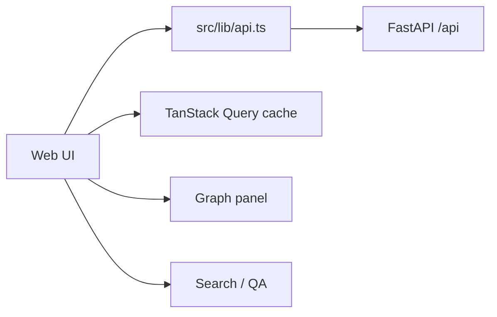

# Web 使用指南

`apps/web` 是 SymboGraph 的 Next.js 前端，用于管理本地知识库、上传资料、查看导入日志、浏览 evidence graph 与 signal projection、执行检索和引用问答、配置运行时参数。

## 技术栈

- Next.js 16.2.4
- React 19
- TypeScript
- TanStack Query
- Tailwind CSS / shadcn 风格组件
- ECharts 图谱视图

修改 Next.js 行为前，优先查看本地文档：

```text
apps/web/node_modules/next/dist/docs/
```

## 启动

推荐通过 Docker Compose 启动：

```powershell
docker compose -f infra/docker-compose.yml up -d --build web
```

访问：

```text
http://127.0.0.1:3000
```

## 常用命令

从仓库根目录执行：

```powershell
npm run typecheck --workspace web
npm run lint --workspace web
npm run test --workspace web
```

## 主要目录

| 路径 | 用途 |
| --- | --- |
| `src/app/` | Next.js App Router 页面 |
| `src/components/` | 产品视图与 UI 组件 |
| `src/lib/api.ts` | 后端 API 访问集中入口 |
| `src/lib/*.test.ts` | API 契约、trace、日志元数据测试 |
| `src/components/*.test.tsx` | 组件与交互测试 |



## 前端约束

- 服务端状态优先用 TanStack Query，mutation 后明确失效相关 query。
- API 类型和后端 Pydantic schema 保持同步。
- 图谱页展示 evidence graph、signal node、active chunk、community region、retrieval trace 或 policy diagnostics，不再暴露旧 concept projection 作为默认入口。
- 布局敏感改动需要浏览器或截图验证。
- 不把社区摘要或投影视图当作引用替代品；答案引用必须来自后端 citation metadata。
