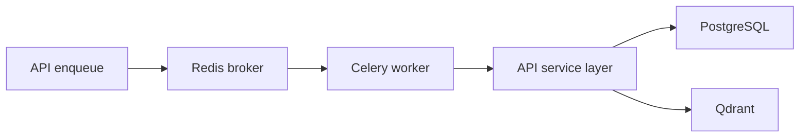

# Worker 使用指南

`apps/worker` 提供 Celery worker 与文件 watcher。Worker 只负责执行长任务，不复制后端业务逻辑；解析、证据图、信号层、切块、质量、检索和问答逻辑都复用 `apps/api` 的 service layer。

## 启动

推荐使用 Docker Compose：

```powershell
docker compose -f infra/docker-compose.yml up -d --build worker
```

容器名：

```text
course-kg-worker
```

查看状态：

```powershell
docker ps --filter "name=course-kg-worker"
docker logs --tail 100 course-kg-worker
```

## 职责



Worker 处理：

- 文件导入批次
- 文件解析
- evidence atoms / evidence graph 构建
- signal layer 与 projection 派生
- chunk candidates、quality decisions、active chunks
- embedding 与 Qdrant upsert
- 取消、补偿和重试

## 运行时设置

Worker 在任务开始前刷新共享 `.env` 与 Redis runtime settings version。长任务进入关键阶段前也应刷新设置，确保模型端点、embedding 维度、timeout、fallback、reranker、质量预算和策略参数可见。

## 验证

```powershell
docker exec -w /app/apps/api course-kg-api python -m pytest tests/test_ingestion_batches.py tests/test_evidence_graph_pipeline.py -q
python scripts\docker_smoke.py --base-url http://127.0.0.1:8000/api --worker-container course-kg-worker
```
