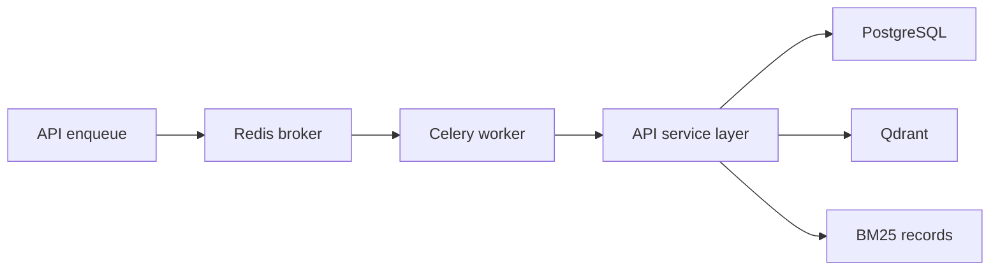

# Worker

`apps/worker` 提供 Celery worker 与文件 watcher。Worker 只执行后台任务，复用 `apps/api` 的 service 逻辑，不复制解析、切块、索引、图谱构建、检索或问答实现。

## 启动

```powershell
docker compose -f infra/docker-compose.yml up -d --build worker
```

容器名：

```text
course-kg-worker
```

查看状态：

```powershell
docker ps --filter "name=course-kg-worker"
docker logs --tail 100 course-kg-worker
```

## 职责



Worker 执行：

- 文件导入批次。
- 文件解析。
- 固定 token chunk。
- Chunk Structure Graph 和坐标映射。
- Contextual embedding 与 Qdrant upsert。
- BM25 records 写入。
- Chunk Relation Graph、Fine Clusters、RQ-KMeans、Mid/Coarse Concept Graph、Context Graph state。
- 取消边界、补偿记录和可重试失败。

## Runtime Settings

Worker 在任务开始前刷新共享 `.env` 和 Redis runtime settings version。长任务进入解析、向量写入、BM25 写入、图谱构建、模型调用和 promotion 等关键阶段前再次检查版本。

## 验证

```powershell
docker exec -w /app/apps/api course-kg-api python -m pytest tests
python scripts/docker_smoke.py --base-url http://127.0.0.1:8000/api --worker-container course-kg-worker
```
