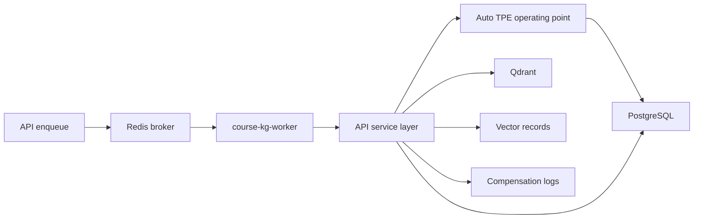

# Worker

## Worker and Beat processes

The default Compose stack runs two separate processes from this package:

- `course-kg-worker` consumes bounded ingestion and maintenance tasks.
- `course-kg-beat` publishes the durable interrupted-ingestion reconciler every
  60 seconds and has an independent command/schedule-file health check.

Run or inspect both with:

```powershell
docker compose -f infra/docker-compose.yml up -d worker beat
docker logs --tail 100 course-kg-worker
docker logs --tail 100 course-kg-beat
```

## 项目简介

`apps/worker` 提供 Celery worker 与文件 watcher。Worker 只执行后台任务，复用 `apps/api` 的 service 逻辑，不复制解析、切块、索引、图谱构建、检索或问答实现。

## 目录

| 路径 | 职责 |
| --- | --- |
| `worker_app/celery_app.py` | Celery app 配置。 |
| `worker_app/tasks.py` | 导入、解析、图谱重建和维护任务入口。 |
| `worker_app/watcher.py` | 文件 watcher 入口。 |
| `worker_app/bootstrap.py` | 将 API service layer 加入 Worker 进程 import path。 |
| `README.md` | 本说明。 |

## 产品定位

Worker 是长任务执行器，不是第二套业务实现。它从 Redis broker 取任务，在任务边界刷新 runtime settings，调用 API service layer 完成导入、索引、图谱和补偿。

## 技术栈

| 范围 | 技术 |
| --- | --- |
| 任务队列 | Celery |
| Broker | Redis |
| 服务逻辑 | 复用 `apps/api/app/services/*` |
| 运行环境 | Docker Compose service `worker` |

## 主链路



Worker 执行：

- 文件导入批次。
- 文件解析与固定 token chunk。
- Chunk Structure Graph、坐标和映射。
- Contextual embedding 和 Qdrant upsert。
- chunk 最高版本递增时的自动 TPE 底层关系图工作点选择。
- Chunk Relation Graph、RQ address/membership、RQ L3 Mid Concept Graph、RQ L2 Coarse Concept Graph、Context Graph state。
- 批次取消、补偿记录、可重试失败和 heartbeat。
- `ingestion_batch_cancel_compensation_v1` 在文件 mutation 前冻结 durable
  `v_before_batch`/active scope；每个文件原子绑定 before-image 与 committed
  parse/chunk/index/vector write-set。解析边界前取消恢复精确旧 scope，进入
  `parse_committed` 图阶段后只补偿 relation/RQ、mid/coarse/context 派生状态。
- Beat 每分钟运行 `reconcile_interrupted_ingestion_batches`：只有证明旧 worker
  task 已释放后才在同 KB fence 下重放 pending metadata/batch/Qdrant 补偿，并重试
  durable Redis/cache invalidation；不会用 `version - 1` 推断恢复目标。
- 每个任务边界读取仓库根 `.env`、校验 Redis 当前
  RuntimeSettingsVersion 与根文件 identity，再同步 model bridge。首次构图和普通重建
  共用 batch/recovery/outbox 事务与知识库级资源锁；配置或 before-image 漂移必须在模型调用和图写入前拒绝。

## 环境配置

Worker 使用同一份 `.env` 和 Docker Compose 覆盖：

```text
DATABASE_URL=postgresql+psycopg://<user>:<local-password>@postgres:5432/<database>
REDIS_URL=redis://redis:6379/0
QDRANT_URL=http://qdrant:6333
DATA_ROOT=/app/data
```

任务并发由 `WORKER_CONCURRENCY` 与 Compose 启动命令控制；运行中修改并发需要重启或重建 worker 服务。

## 快速启动

```powershell
docker compose -f infra/docker-compose.yml up -d --build worker
```

容器名：

```text
course-kg-worker
```

## 参数列表

| 分类 | 参数 |
| --- | --- |
| Celery | `INGESTION_TASK_QUEUE`, `WORKER_CONCURRENCY`, `WORKER_MAX_TASKS_PER_CHILD` |
| Runtime reload | `REDIS_URL` 和 Redis runtime settings version broadcast |
| 资源保护 | `INGESTION_MEMORY_SOFT_LIMIT_RATIO`, `INGESTION_MEMORY_HARD_LIMIT_RATIO`, `INGESTION_MEMORY_CRITICAL_LIMIT_RATIO` |
| 模型调用 | `MODEL_REQUEST_CONCURRENCY`, `MODEL_REQUEST_TIMEOUT_SECONDS` |

## 验证

```powershell
docker ps --filter "name=course-kg-worker"
docker logs --tail 100 course-kg-worker
docker exec -w /app/apps/api course-kg-api python -m pytest tests
```

## 运维测试

```powershell
python scripts/docker_smoke.py --base-url http://127.0.0.1:8000/api
python scripts/docker_smoke.py --base-url http://127.0.0.1:8000/api --execute
python scripts/check_runtime_settings_contract.py
python scripts/runtime_hot_reload_probe.py
```

第一条 smoke 命令是 GET-only 计划/预检；只有确认精确 KB、query 和两个 POST
目标后，才运行带 `--execute` 的完整 smoke。

## 文档

- [../../README.md](../../README.md)：仓库总览。
- [../../apps/api/README.md](../../apps/api/README.md)：API service layer。
- [../../infra/README.md](../../infra/README.md)：Docker Compose 环境。
- [../../scripts/README.md](../../scripts/README.md)：运维脚本。

## 边界

- Worker 不复制业务逻辑，只调用 API service。
- 任务开始前按“reload -> version/identity/source gate -> bridge sync”刷新 `.env`/Redis runtime
  settings version；长任务关键阶段再次检查版本，不能把 bridge 副作用放在门禁前。
- 外部副作用失败必须写 compensation log 并暴露可行动错误。
- 不能把跨进程正确性建立在 worker 内存状态上。
- 涉及 PostgreSQL、Qdrant、Redis 和模型接口的路径必须在 Docker 栈内验证。
