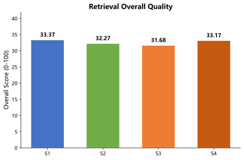
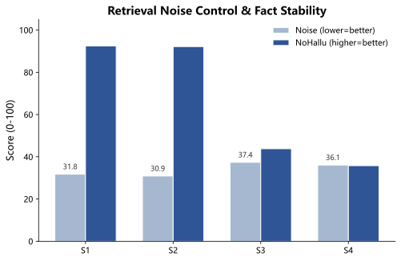
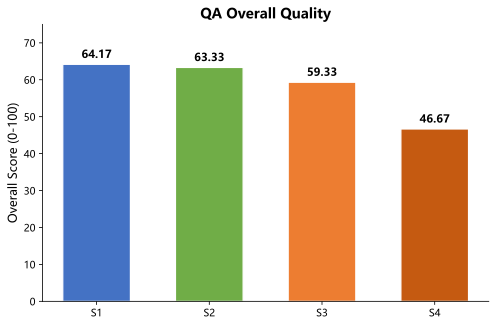
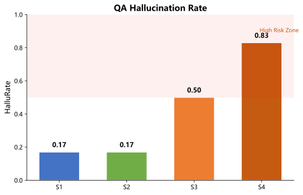
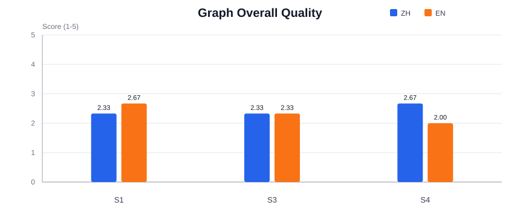
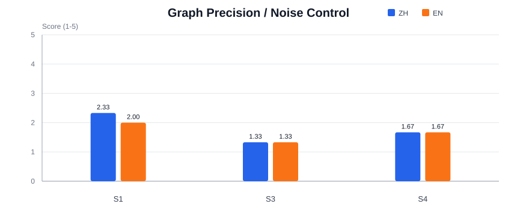

# SymboGraph 实验报告与使用建议

**更新日期**：2026-05-28  
**Run ID**：`20260528_163437`  
**Judge Model**：`qwen3.6-plus`  
**Mode**：`small`  
**Fairness Protocol**：`gold-answer-fairness-v1`

本报告记录 S1/S2/S3/S4 在统一评测口径下的检索、问答与图谱质量，并给出系统优劣势和使用建议。本次 run 不再区分中英文，所有样本在同一 judge 口径下评估。

## 1. 数据来源与口径

本报告只采用以下指定 run 作为正式数据源：

| 数据项 | 数据源 |
| --- | --- |
| S1-S4 检索 | `comparative_experiment/data/reports/20260528_163437` |
| S1-S4 QA | `comparative_experiment/data/reports/20260528_163437` |
| S1-S4 图谱 | `comparative_experiment/data/reports/20260528_163437` |

**公平性协议说明**：gold answers、gold chunks、graph concepts 和 graph relations 均只来源于课程材料。本报告不产生单一的 S1-S4 冠军，而是按任务和模态轨道呈现，使 chunk-native 系统和 synthesized-answer 系统得到公平解读。

**指标说明**（0-100 分制）：

| 缩写 | 全称 |
| --- | --- |
| Gold | gold_answer_correctness |
| Concepts | required_concept_coverage |
| Evidence | evidence_support |
| Ground | course_grounding |
| Noise | noise_control |
| NoHallu | non_hallucination |
| Reason | reasoning_quality |
| Overall | overall_task_quality |
| HalluRate | 被标记为幻觉/无支撑声明的样本比例 |
| Overall_CI | overall_task_quality 的 bootstrap 95% 置信区间 |

系统定义：

| 编号 | 系统 | 定位 |
| --- | --- | --- |
| S1 | SymboGraph-Full | 历史实验配置：混合召回、轻量候选后处理、parent context、evidence-first agent、课程图谱增强 |
| S2 | SymboGraph-NoGraph | 历史无图基线：保留 dense + lexical + QA，但不使用知识图谱 |
| S3 | LightRAG | 轻量 GraphRAG 基线 |
| S4 | MS-GraphRAG | Microsoft GraphRAG 风格基线 |

关键限制：
- S3/S4 的输出协议和 S1/S2 不完全等价，尤其 retrieval 可能更接近图摘要或 answer-like context，而不是严格 chunk list。因此 S3/S4 分数应作为系统行为参考，不宜直接解释成同构检索精度。
- Graph 评测受术语对齐、节点粒度、边定义和 evidence 约束影响。评测结果供趋势参考，不能当作严格学术结论。
- 本次 run 使用 `small` 模式，样本量：检索 N=108，QA N=6，图谱 N=3。

## 2. 检索结果

### 2.1 Overall Quality

| 系统 | N | Gold | Concepts | Evidence | Ground | Noise | NoHallu | Reason | Overall | HalluRate | Overall_CI | Latency ms |
| --- | ---: | ---: | ---: | ---: | ---: | ---: | ---: | ---: | ---: | ---: | --- | ---: |
| S1 Full | 108 | 33.68 | 34.58 | 34.06 | 47.59 | 31.76 | 92.50 | 32.59 | 33.37 | 0.05 | [27.24, 39.27] | 1329.5 |
| S2 NoGraph | 108 | 32.78 | 33.52 | 33.31 | 44.68 | 30.91 | 92.18 | 31.71 | 32.27 | 0.04 | [26.00, 38.23] | 929.3 |
| S3 LightRAG | 108 | 39.44 | 43.84 | 34.00 | 31.39 | 37.36 | 43.80 | 41.57 | 31.68 | 0.75 | [25.99, 37.18] | 1860.2 |
| S4 MS-GraphRAG | 108 | 39.31 | 43.98 | 35.54 | 33.61 | 36.09 | 35.78 | 41.89 | 33.17 | 0.81 | [27.45, 39.29] | 54264.8 |

检索结论：
- S1/S2 的 non_hallucination 分数显著高于 S3/S4（92+ vs 35-44），说明 chunk-native 检索在事实稳定性上优势明显。
- S3/S4 的 Gold、Concepts、Reason 分数更高，但 HalluRate 也更高（0.75-0.81），说明其检索摘要聚焦度高，但容易引入无支撑声明。
- S1 的 Ground（47.59）在四个系统中最高，说明课程 grounded 和 evidence coverage 是其核心优势。
- S4 的 Latency（54264.8 ms）显著高于其他系统，GraphRAG 社区摘要和图查询开销大。

### 2.2 Noise Control & Fact Stability

| 系统 | Noise | NoHallu | HalluRate | 解释 |
| --- | ---: | ---: | ---: | --- |
| S1 Full | 31.76 | 92.50 | 0.05 | 覆盖率与证据支撑稳定，候选中仍有冗余和 parent context 噪声 |
| S2 NoGraph | 30.91 | 92.18 | 0.04 | 无图结构约束，复杂问题更依赖大上下文拼接，噪声控制与 S1 接近 |
| S3 LightRAG | 37.36 | 43.80 | 0.75 | 摘要聚焦度较高，但 retrieval 输出与 chunk retrieval 不完全等价 |
| S4 MS-GraphRAG | 36.09 | 35.78 | 0.81 | retrieval summary 聚焦度高，但延迟显著更高，且后续 QA 幻觉率偏高 |

### 2.3 Chunk-Native vs Synthetic-Answer 轨道

由于 fairness protocol 要求区分输出形态，检索按两个轨道解读：

**Chunk-Native Track**（S1, S2）：

| 系统 | N | Gold | Concepts | Evidence | Ground | Noise | NoHallu | Reason | Overall | HalluRate | Latency ms |
| --- | ---: | ---: | ---: | ---: | ---: | ---: | ---: | ---: | ---: | ---: | ---: |
| S1 Full | 108 | 33.68 | 34.58 | 34.06 | 47.59 | 31.76 | 92.50 | 32.59 | 33.37 | 0.05 | 1329.5 |
| S2 NoGraph | 108 | 32.78 | 33.52 | 33.31 | 44.68 | 30.91 | 92.18 | 31.71 | 32.27 | 0.04 | 929.3 |

S1 在 Ground 和 Overall 上略高于 S2，说明图谱和 evidence-first 编排对检索质量有正向贡献；但两者差异不大，说明当时 dense + lexical 的基础检索能力已经比较稳定。该报告记录的是历史实验，不代表当前 Four-Layer Context Graph RAG 的 active path。

**Synthetic-Answer Track**（S3, S4）：

| 系统 | N | Gold | Concepts | Evidence | Ground | Noise | NoHallu | Reason | Overall | HalluRate | Latency ms |
| --- | ---: | ---: | ---: | ---: | ---: | ---: | ---: | ---: | ---: | ---: | ---: |
| S3 LightRAG | 108 | 39.44 | 43.84 | 34.00 | 31.39 | 37.36 | 43.80 | 41.57 | 31.68 | 0.75 | 1860.2 |
| S4 MS-GraphRAG | 108 | 39.31 | 43.98 | 35.54 | 33.61 | 36.09 | 35.78 | 41.89 | 33.17 | 0.81 | 54264.8 |

S4 的 Overall（33.17）略高于 S3（31.68），但 HalluRate 也更高（0.81 vs 0.75）。S4 的延迟是 S3 的约 29 倍，GraphRAG 的社区摘要和全局查询开销显著。

## 3. QA 结果

### 3.1 Overall Quality

| 系统 | N | Gold | Concepts | Evidence | Ground | Noise | NoHallu | Reason | Overall | HalluRate | Overall_CI | TTFT ms | PromptTok | CompTok | TotalTok |
| --- | ---: | ---: | ---: | ---: | ---: | ---: | ---: | ---: | ---: | ---: | --- | ---: | ---: | ---: | ---: |
| S1 Full | 6 | 64.17 | 66.67 | 64.17 | 64.17 | 89.17 | 85.00 | 64.17 | 64.17 | 0.17 | [31.67, 96.67] | 136884.7 | 76.0 | 209.0 | 284.0 |
| S2 NoGraph | 6 | 63.33 | 65.83 | 62.50 | 63.33 | 71.67 | 81.67 | 63.33 | 63.33 | 0.17 | [31.67, 95.00] | 30724.5 | 3187.0 | 1633.0 | 4820.0 |
| S3 LightRAG | 6 | 62.50 | 66.67 | 60.83 | 59.17 | 54.17 | 61.67 | 60.83 | 59.33 | 0.50 | [28.12, 91.17] | N/A | 17.0 | 443.0 | 460.0 |
| S4 MS-GraphRAG | 6 | 58.33 | 66.67 | 53.33 | 46.67 | 45.83 | 48.33 | 55.83 | 46.67 | 0.83 | [18.83, 71.51] | N/A | 17.0 | 502.0 | 520.0 |

### 3.2 Hallucination Rate

| 系统 | QA HalluRate | Retrieval HalluRate |
| --- | ---: | ---: |
| S1 Full | 0.17 | 0.05 |
| S2 NoGraph | 0.17 | 0.04 |
| S3 LightRAG | 0.50 | 0.75 |
| S4 MS-GraphRAG | 0.83 | 0.81 |

### 3.3 Pipeline 诊断

| 系统 | Recall@k | Citation | AnswerQ | PipeHealth | Failures |
| --- | ---: | ---: | ---: | ---: | --- |
| S1 | 0.45 | 0.5417 | 64.17 | 82.5 | ok:4, retrieval_miss:2 |
| S2 | 0.45 | 0.6000 | 63.33 | 85.0 | ok:4, retrieval_miss:2 |
| S3 | 0.5333 | 0.0000 | 59.33 | 80.0 | unsupported_answer:6 |
| S4 | 0.5333 | 0.0000 | 46.67 | 80.0 | unsupported_answer:6 |

QA 结论：
- S1/S2 的 QA Overall 最高（64.17 / 63.33），且 HalluRate 最低（0.17）。S1 的 Noise（89.17）显著高于 S2（71.67），说明 evidence-first agent 和 parent context 对答案纯净度有正向贡献。
- S3/S4 的 QA 明显低于 S1/S2，核心原因是它们偏 GraphRAG 摘要与图查询，弱于 evidence-first 课程问答；Citation 为 0，说明其输出形态不提供 chunk 级引用。
- S4 的 HalluRate 高达 0.83，Overall 仅 46.67，GraphRAG 全局摘要容易引入通用知识和弱证据。
- S1 的 TTFT（136884.7 ms）显著高于 S2（30724.5 ms），说明 evidence-first agent 的多轮检索和候选后处理带来较大首 token 延迟；但 S1 的 PromptTok（76.0）和 TotalTok（284.0）远低于 S2（3187.0 / 4820.0），说明 S1 的生成更精简，输入上下文更聚焦。

## 4. 图谱评测

S2 是无图基线，不参与图谱质量比较。

> [!NOTE]
> Capability = 0 表示该系统无图谱输出。LLM Aux 为辅助指标；图谱解读应综合 gates、evidence coverage、diagnostics 和下游 Retrieval/QA。

### 4.1 Graph Scale & Structure

| 系统 | N | Capability | LLM Aux | Nodes | Edges | Density | Components |
| --- | ---: | ---: | ---: | ---: | ---: | ---: | ---: |
| S1 Full | 3 | 1.00 | 43.33 | 275 | 1230 | 0.032464 | 8 |
| S3 LightRAG | 3 | 1.00 | 50.00 | 1351 | 2180 | 0.004021 | 21 |
| S4 MS-GraphRAG | 3 | 1.00 | 56.67 | 1404 | 1991 | 0.000969 | 480 |

### 4.2 Graph Evidence & Quality Gates

| 系统 | Gate | Edge Ev. | Node Ev. | Low Conf. | Single Ev. | 图谱形态 |
| --- | ---: | ---: | ---: | ---: | ---: | --- |
| S1 Full | 1.00 | 1.00 | 0.973 | 0.001 | 0.834 | 图谱较克制，但有重复节点、弱证据边和部分 hallucination/unsupported 标记 |
| S3 LightRAG | 1.00 | 1.00 | 1.00 | N/A | 0.863 | 节点规模膨胀，泛化实体和碎片化组件较多 |
| S4 MS-GraphRAG | 1.00 | 1.00 | 1.00 | N/A | 0.946 | 覆盖面较广，但边密度高，社区/摘要关系容易混入弱证据 |

图谱结论：
- 三个有图系统的 Capability 和 Gate 均为 1.00，说明图谱抽取和基本质量门禁通过。
- S1 图谱最克制（275 nodes, 1230 edges, density 0.032），组件数仅 8；S3/S4 规模更大但密度更低（0.004 / 0.001），组件数更多（21 / 480），说明 GraphRAG 的图更稀疏、更碎片化。
- S1 的 Node Ev. 为 0.973，节点级 evidence 覆盖率良好；S3/S4 的 Node Ev. 为 1.00，但 Edge Ev. 也为 1.00，可能存在过度标记。
- 当前图谱模块更适合作为检索辅助和概念导航，不适合单独作为答案事实源。

## 5. Pairwise 比较

### 5.1 检索

| System A | System B | p-value |
| --- | --- | ---: |
| S1 | S2 | 0.0632 |
| S1 | S3 | 0.3856 |
| S1 | S4 | 0.9167 |
| S2 | S3 | 0.7592 |
| S2 | S4 | 0.6540 |
| S3 | S4 | 0.2489 |

检索的 pairwise 差异均不显著（p > 0.05），说明在 small 模式下各系统的 retrieval overall 差异未达到统计显著水平。

### 5.2 QA

| System A | System B | p-value |
| --- | --- | ---: |
| S1 | S2 | 0.3632 |
| S1 | S3 | 0.2076 |
| S1 | S4 | 0.0631 |
| S2 | S3 | 0.1765 |
| S2 | S4 | 0.0718 |
| S3 | S4 | 0.1481 |

QA 的 pairwise 差异也均不显著（p > 0.05）。S1 vs S4 的 p=0.0631 最接近显著水平，但仍未过 0.05 阈值。

## 6. 架构优势与不足

### 6.1 相比主流 GraphRAG 的优势

- **课程资料约束更强**：S1 不把图谱当成事实源，而是用课程 chunk、parent context 和 citation 约束答案。
- **QA 幻觉率更低**：S1/S2 的 QA HalluRate 为 0.17，明显优于 S3/S4（0.50 / 0.83）。
- **复杂问题证据组织更稳**：S1 的检索覆盖、课程 grounded 和 QA 稳定性优于 S2，说明图谱和 agent 编排对复杂题有实际帮助。
- **工程可审计性更好**：S1/S2 能输出 chunk、parent context、model audit、stage latency 等元数据，更适合定位错误和做质量门禁。

### 6.2 当前不足

- **检索 precision 不够高**：S1 的 Noise（31.76）和 Overall（33.37）在四个系统中不突出，偏召回优先的策略会牺牲候选列表纯净度。
- **图谱精确度偏低**：S1 的 Node Ev. 为 0.973，节点级 evidence 覆盖率良好，但图谱 overall 分数和 precision 仍有提升空间。
- **S1 TTFT 过高**：136884.7 ms（约 2.3 分钟）的首 token 延迟对实际交互不友好，需要优化 agent 编排和缓存策略。

## 7. 用户使用建议

- **优先使用 S1 Full 作为课程问答主路径**：它在 QA 中最稳（Overall 64.17），幻觉率最低（0.17），适合实际用户问答。
- **S2 可作为快速无图基线**：Latency 最低（TTFT 30724.5 ms），适合验证"没有图谱时能不能答"，但复杂/开放题的证据组织能力不如 S1。
- **S3/S4 更适合全局摘要与主题探索**：不建议直接作为 evidence-first 课程问答主路径，尤其不适合要求严格引用的答案。
- **不要把图谱可视化当成事实证明**：当前 S1 的 Node Ev. 为 0.973，图谱节点 evidence 覆盖率良好，但仍需结合课程 chunk 证据查看。
- **复杂/开放题要看引用质量，不只看答案流畅度**：S3/S4 往往语言流畅但 hallucination rate 高，用户应优先检查引用是否直接支撑结论。

## 8. 后续评测改进

- 增加 QA 样本量：当前 N=6 不足以支撑稳健统计结论。
- 增加 hard-case QA：多跳、跨章节、概念比较、反例、证明依赖、公式推导。
- 增加 pairwise judge：让 judge 在 S1/S2/S3/S4 答案之间直接比较，而不是只给单答案绝对分。
- 对 graph 做实体对齐评测：中英文同义词、缩写、公式符号、重复节点合并应单独计分。
- 对 S1 TTFT 做延迟分解：定位 agent 各阶段的耗时瓶颈。
