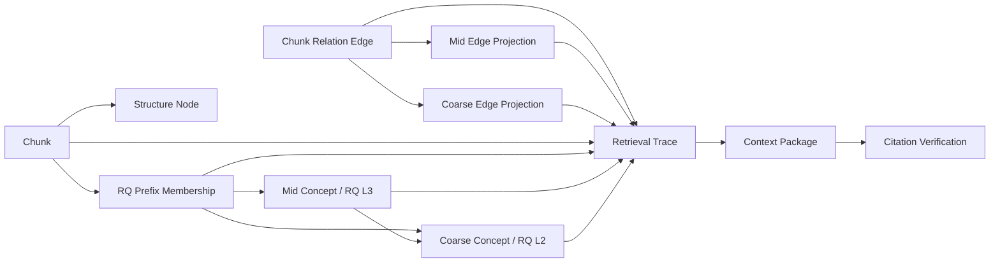
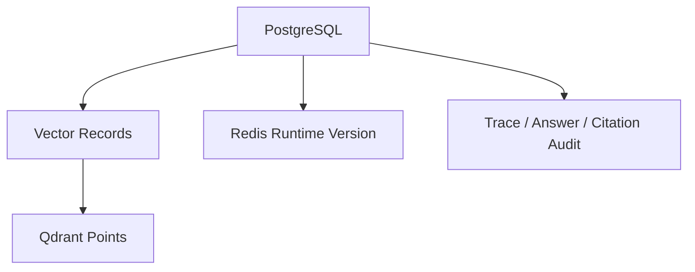
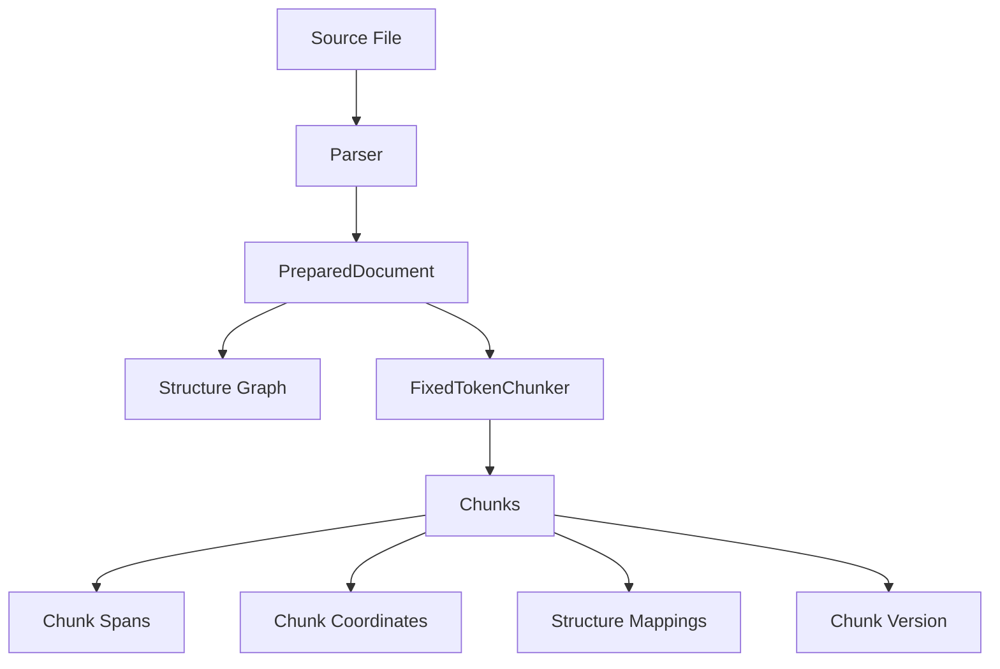
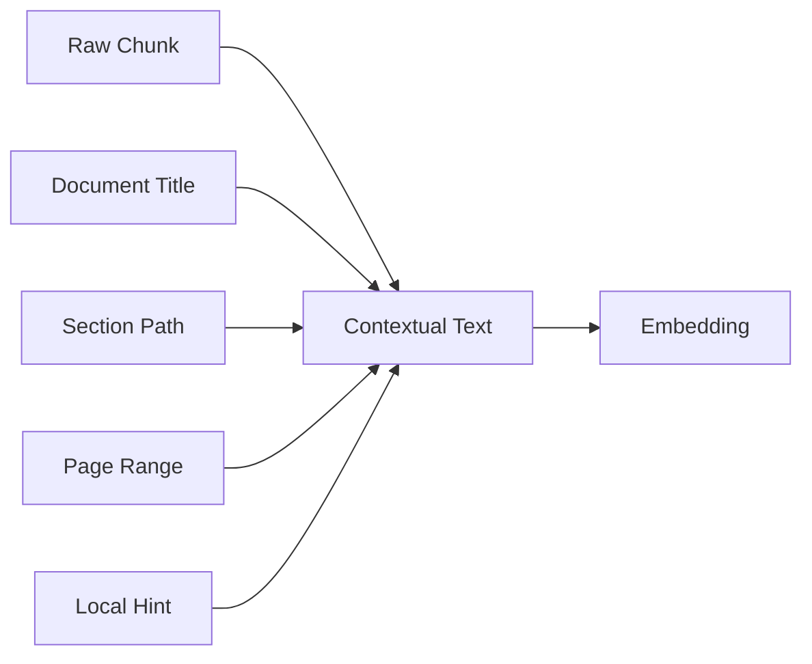
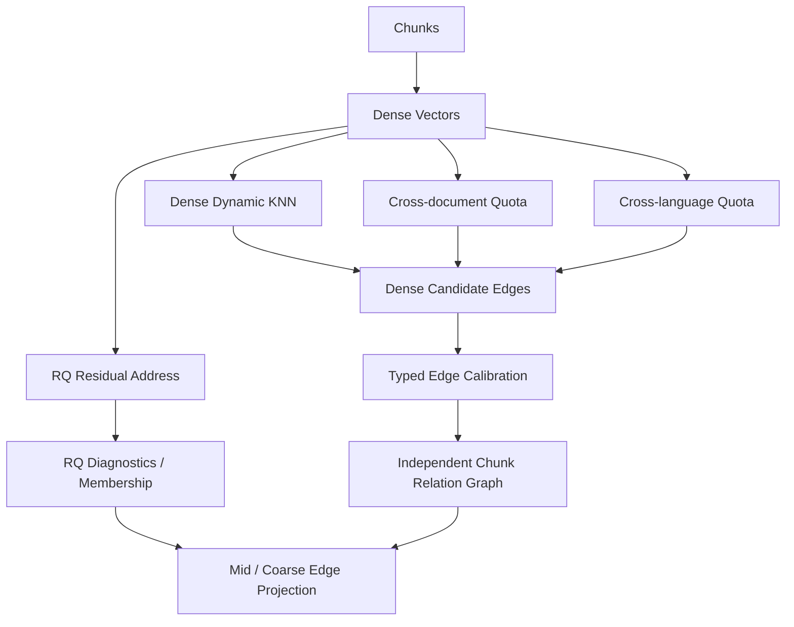
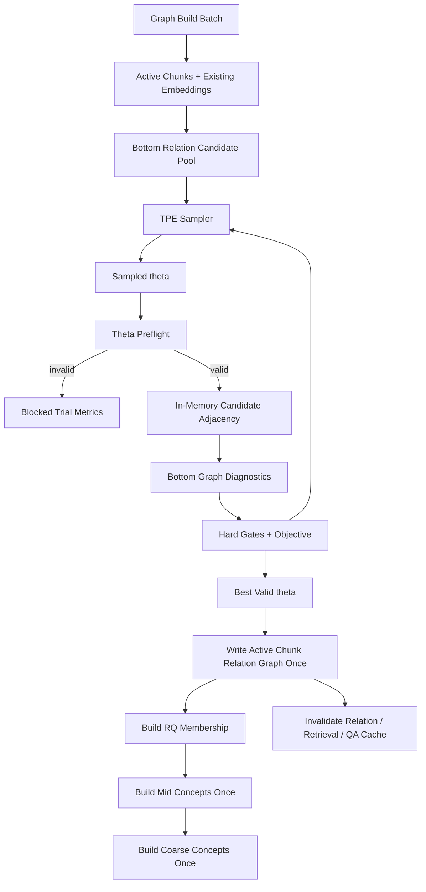
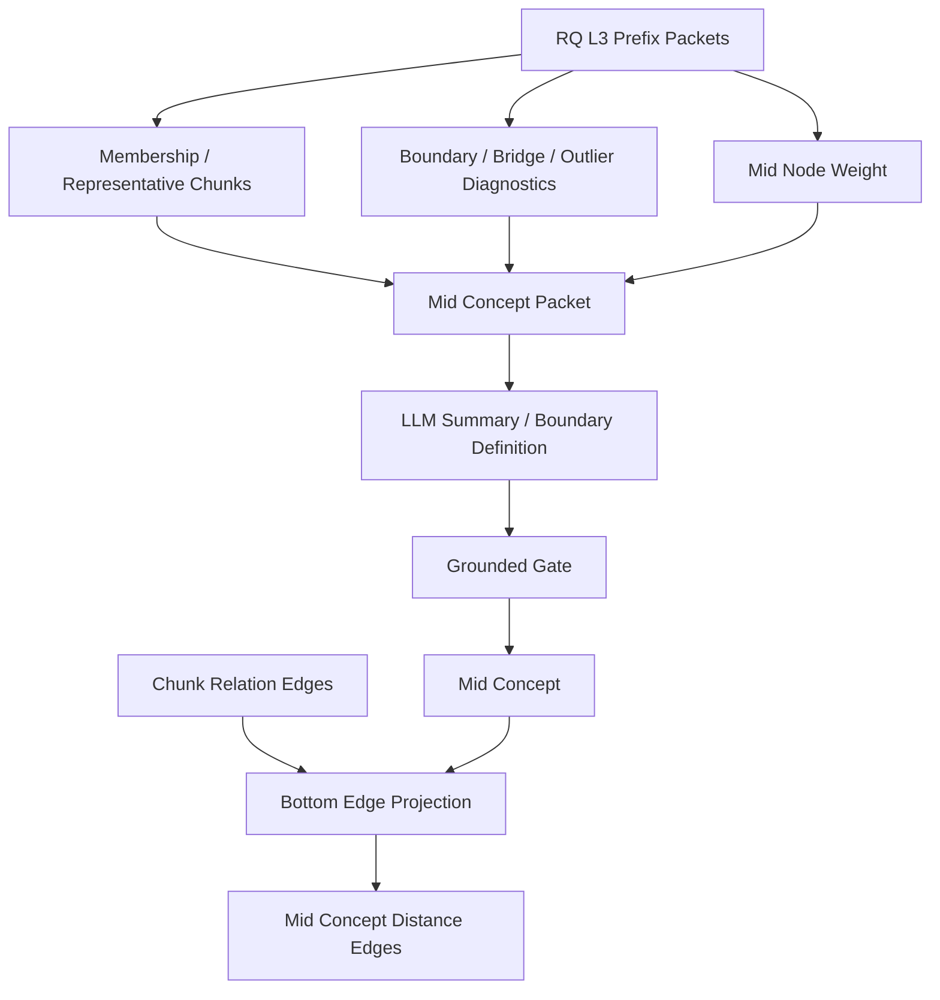
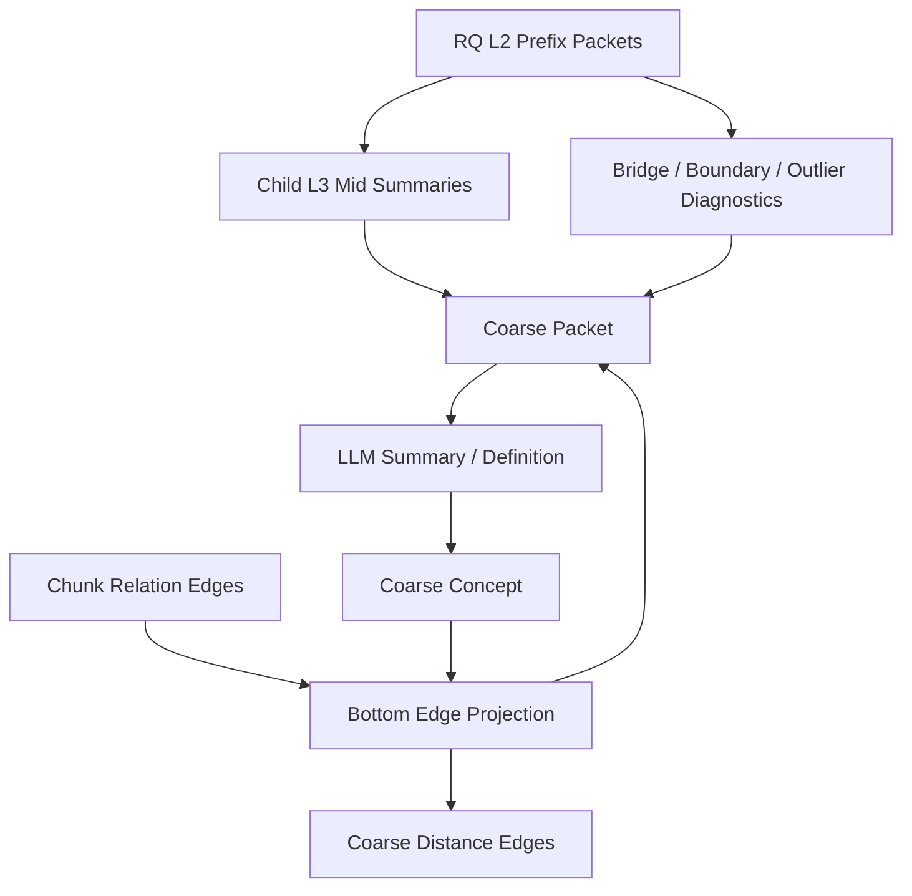
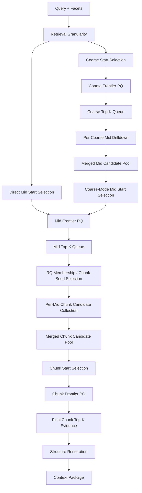
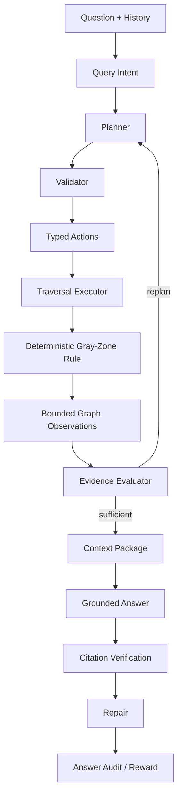

# SymboGraph Four-Layer Context Graph RAG 技术白皮书

## 目录

- [摘要](#摘要)
- [阻断项与收敛要求](#阻断项与收敛要求)
- [端到端链路](#端到端链路)
- [四层上下文图谱](#四层上下文图谱)
- [跨层对象协议](#跨层对象协议)
- [事实源与派生状态](#事实源与派生状态)
- [解析、固定 Chunk 与结构图](#解析固定-chunk-与结构图)
- [Contextual Index Text](#contextual-index-text)
- [Chunk Relation Graph](#chunk-relation-graph)
- [RQ Membership 与 RQ-KMeans](#rq-membership-与-rq-kmeans)
- [Mid Concept Graph](#mid-concept-graph)
- [Coarse Concept Graph](#coarse-concept-graph)
- [Layered Retrieval](#layered-retrieval)
- [Layered P&E Agent](#layered-pe-agent)
- [Context Package 与引用验证](#context-package-与引用验证)
- [Conversation State](#conversation-state)
- [Runtime Settings、Profile 与策略](#runtime-settingsprofile-与策略)
- [Freshness、缓存与热加载](#freshness缓存与热加载)
- [数据模型](#数据模型)
- [API、前端与脚本](#api前端与脚本)
- [事务、并发与安全](#事务并发与安全)
- [测试、诊断与验收](#测试诊断与验收)
- [核心原则](#核心原则)

## 摘要

传统 RAG 的第一道难题是切块。切得太短，语义被撕裂，表格、公式、图注、上下文指代和跨段推理会丢失；切得太长，召回噪声、embedding 稀释、token 成本和引用定位都会恶化。语义切块、递归切块和按标题切块都试图让 chunk 更像一个完整语义单元，但真实资料往往混合了页面布局、代码、表格、公式、标题层级和跨页连续区域，单靠切块算法很难同时满足检索、引用、上下文恢复和工程稳定性。

图 RAG 试图用图结构弥补纯向量召回的缺陷，但主流做法通常仍然先切块、再从 chunk 中抽取实体、关系或社区摘要。这个顺序让图谱质量继续受 chunk 边界制约：切块已经丢失的上下文，后续实体边、社区摘要和全局检索很难可靠补回；LLM 抽取的概念关系如果缺少 raw span 和结构路径支撑，也容易变成不可验证的解释层。学术界的图基座 RAG 探索了更彻底的图式底座，但通常依赖复杂的抽取、训练、动态图学习或大规模推理基础设施，对本地知识库的生产环境还不够轻、稳、可恢复。

SymboGraph 的判断是：瓶颈不一定是“切出完美 chunk”，而是“命中证据后能否恢复正确语义关联与原文上下文”。本项目以 ContextRAG 的上下文恢复思想为灵感，采用最简单、最稳定的固定长度 token chunk，把 chunk 视为地址和引用单位，而不是语义理解结果。系统不要求单个 chunk 自身完整表达知识，而是在 chunk 周围构建可复算关系网络、原文结构地图、概念路由层和 Agent 规划执行层。

因此，SymboGraph 采用 Four-Layer Context Graph RAG：第 0 层保存 Chunk Structure Graph，第 1 层保存独立 Chunk Relation Graph 与 RQ primary membership/address protocol，第 2 层保存由确定性 eligibility 从 RQ L3 prefix packet 中选出的 Mid Concept Graph，第 3 层保存由确定性 eligibility 从 RQ L2 prefix packet 中选出的 Coarse Concept Graph。结构图承担完整结构信息存储和上下文恢复；chunk relation graph 只表达由内容语义证据支持的 chunk 间关系；RQ 只提供 primary residual address、低置信诊断和路由先验；mid/coarse 节点必须形成可度量的语义压缩，边完全由底层 chunk relation edges 投影配权。LLM 负责已入选概念的命名与摘要、查询路由、typed action 规划、证据充分性判断和修复方向，不参与概念节点 eligibility；图检索 gray-zone 的分区与路径决策由 deterministic bounded observation 和版本化本地规则完成，LLM 不参与 gray-zone 判定；事实证据只能来自 context package 和 raw chunk citation span。

总体目标可以写成约束优化问题：

$$
\max_{\pi,\mathcal{G},\mathcal{C}}
\ \mathbb{E}\left[
Q_{\mathrm{ground}}(a, E)
+Q_{\mathrm{complete}}(a, q)
+Q_{\mathrm{trace}}(E)
-\lambda_1 C_{\mathrm{latency}}
-\lambda_2 C_{\mathrm{token}}
-\lambda_3 R_{\mathrm{drift}}
\right]
$$

其中 \(q\) 是用户查询，\(a\) 是答案，\(E\) 是 context package 中的证据集合，\(\mathcal{G}\) 是四层上下文图谱，\(\mathcal{C}\) 是固定 chunk 地址空间，\(\pi\) 是 Agent 在 typed action space 内的策略。约束条件是：

$$
\forall \mathrm{claim}\in a,\quad
\exists e\in E:\ e=(document\_version\_id,chunk\_id,char\_span,page\_range)
$$

这个架构解决的问题是：固定 chunk 的语义破碎由结构恢复和图扩展补足，纯 top-k 召回的短视由四层寻址缓解，图 RAG 的不可验证概念边由 support chunks 和 grounded gate 约束，长对话中的上下文延续由 conversation state 管理，Agent 的策略漂移由 typed action schema、预算、trace 和 citation verification 控制。自然对话长度不设置固定硬上限；预算只约束单次任务内部的规划、检索、上下文打包、验证和修复。

本文只描述目标架构、目标算法、落地约束和验收门禁。工程状态不进入模块正文；若实现无法满足强不变量，必须作为阻断项进入本节、诊断脚本和执行计划，而不是作为可接受的文字残留。工程依据主要包括 `apps/api/app/services/context_graph.py`、`apps/api/app/services/agent_graph.py`、`apps/api/app/services/retrieval.py`、`apps/api/app/models.py`、`apps/api/app/core/config.py` 和 `apps/api/app/services/runtime_settings.py`。

## 阻断项与收敛要求

本节只汇总会影响 Four-Layer Context Graph RAG 目标闭环的阻断项。固定 chunk、结构图 closure、独立 chunk relation graph、RQ membership/address、RQ L3/L2 concept projection、全层 traversal、context package、citation verification、reward/policy observation、runtime hash、cache key 和 compensation log 是 active 主链路的强约束。

阻断项只允许记录在以下收敛表中：

| 收敛项 | 缺口 | 影响模块 | 门禁 | 收敛方向 |
| --- | --- | --- | --- | --- |
| Docker provider 出口可用性 | 生产验收要求 embedding/chat/graph 请求全部从 Docker 服务容器发出；若 Docker VM 对某个已配置 provider 的 DNS/TLS 出口失败，即使其他 provider 正常，也不得绕到宿主机执行或启用 fallback。 | `embeddings.py`, Docker Compose, runtime check, smoke | 在发送凭据前执行系统 CA、原 hostname SNI 与 public-unicast pinned IP 检查；失败只保存 typed error classification，不保存鉴权头、凭据或 provider body；PostgreSQL 事务不得留下半成品 retrieval/answer 状态。 | 先以同镜像临时容器、独立 Docker network、TLS stack 和多个公共 A 记录定位 Docker VM/目的端出口边界；恢复同一配置的 Docker egress 后再重试，禁止换 provider、宿主直连或静默降级。 |
| 派生状态自动修复 | Qdrant、Redis 的强一致性主要依赖 compensation logs、reconcile scripts、diagnostics 和 smoke check；legacy BM25 artifacts 只允许清理或历史诊断。 | `apps/api/app/services/maintenance.py`, `scripts/*reconcile*`, Docker smoke | 外部副作用失败必须写 compensation log 并抛错；对账脚本必须可重复修复；legacy BM25 不影响 active path。 | 增加可恢复调度器和失败队列消费，不改变 PostgreSQL 事实源边界。 |
| Agent 多轮 P&E | QA 是 single planner round + deterministic traversal + verification-triggered repair；还不是完整多轮 Planner/Evidence-Evaluator/Replan 闭环。 | `agent_graph.py`, `context_graph.py`, `answer_sessions`, `agent_*` tables | typed action validator、deterministic gray-zone rule、repair budget、citation verification 必须通过；repair budget 耗尽不得无支撑补齐。 | 引入多轮 evidence evaluator/replan 状态机，继续使用同一 typed action schema 和 deterministic executor；不得把 gray-zone 决策移交给 LLM。 |
| Policy 优化深度 | policy 是 proxy reward 驱动的 lightweight arm prior，不是完整在线 bandit 或因果评估框架。 | `policy_states`, `reward_events`, runtime settings | policy 不得替代 LLM planner 或 deterministic gray-zone rule；只能提供 safe arms、预算先验和灰区阈值建议。 | 增加 posterior 更新、离线评估和安全探索控制，保持 planner 与本地灰区规则的决策边界。 |
| 会话审计边界 | `qa_sessions` 用于前端对话记忆，`answer_sessions` 用于回答审计，两者仍并存。 | QA API、conversation state、answer audit、前端会话 | 每个 answer 必须能回到 context package、retrieval trace、citation verification 和 reward event。 | 继续收敛到 answer session、context package、citation verification、reward event 的统一审计链，同时保留 conversation transcript 的交互用途。 |

除上表外，若发现某模块无法满足白皮书强不变量，应先更新诊断脚本和执行计划并标记为阻断项；不得在技术白皮书中写成“可接受的缺口”。

## 端到端链路

目标链路将本地资料库问答定义为从原始文件到可验证答案的复合映射：

$$
\mathcal{P}
=
V
\circ A
\circ K
\circ R
\circ G_3
\circ G_2
\circ G_1
\circ G_0
\circ I
\circ P_s
$$

其中 \(P_s\) 是 parser 与 layout extractor，\(I\) 是 contextual indexing，\(G_0\) 到 \(G_3\) 是四层上下文图谱，\(R\) 是 layered retrieval，\(K\) 是 context package builder，\(A\) 是 grounded answer generator，\(V\) 是 citation verification。

目标流程：

```text
source files
-> parser and layout extractor
-> fixed token chunks
-> chunk structure graph
-> contextual dense embedding
-> independent chunk relation graph
-> RQ-KMeans residual address and primary membership
-> RQ L3 mid concept graph
-> mid edge projection calibration
-> RQ L2 coarse concept graph
-> coarse edge projection calibration
-> active context graph state
-> layered context graph retrieval
-> context package
-> grounded answer
-> citation verification
-> reward event
-> policy state update
```


目标链路的核心约束是单调可追溯性。若 \(h_l\) 表示第 \(l\) 层 state hash，则任意一次检索 trace 必须保存：

$$
\tau(q)
=
\left(
q,\ h_{\mathrm{chunk}},h_{\mathrm{struct}},h_{\mathrm{rel}},
h_{\mathrm{rq}},h_{\mathrm{mid}},h_{\mathrm{coarse}},
h_{\mathrm{runtime}},h_{\mathrm{agent}}
\right)
$$


**架构影响：**
- 影响对象：解析、固定 chunk、结构图、contextual index、RQ membership/address、chunk relation graph、mid concepts、coarse concepts、layered retrieval、Agent、context package、citation verification 和 policy update。
- 影响方式：端到端链路定义状态传播顺序；任一上游状态 hash 变化都会改变下游候选集合、concept packet、检索路径、证据包和回答审计。
- 传播字段：`knowledge_base_id`、`document_version_id`、`chunk_version`、`chunk_scope_hash`、`structure_graph_hash`、`chunk_relation_hash`、`rq_membership_hash`、`mid_concept_hash`、`coarse_concept_hash`、`runtime_settings_hash`。
- 触发条件：active chunk scope、embedding text、关系边、concept definition、runtime settings 或 policy state 改变时，相关 trace、cache、context package 和 graph freshness 需要重新计算。
- 验收观察点：`context_graph_states`、`context_graph_freshness`、`retrieval_traces`、`graph_retrieval_steps`、`context_packages` 与 `citation_verifications` 必须形成连续审计链。

## 四层上下文图谱

目标四层图谱是异构多层图：

$$
\mathcal{G}
=
\left(
G_0,G_1,G_2,G_3,\Pi
\right)
$$

其中 \(G_0=(V_0,E_0)\) 是结构图，\(G_1=(V_C,E_C,\mathcal{R},\mathcal{M}_R)\) 是独立 chunk relation graph、RQ prefix address space 与 primary membership，\(G_2=(V_M,E_M)\) 是由 RQ L3 prefix packet 定义的 mid concept graph，\(G_3=(V_K,E_K)\) 是由 RQ L2 prefix packet 定义的 coarse concept graph，\(\Pi\) 是跨层 membership、edge projection 与 trace 投影。

跨层投影的目标性质是保守性：

$$
\forall v\in V_2\cup V_3,\quad
support(v)\subseteq V_C
$$

即概念层节点不能成为事实源，必须能回到 chunk support。

### 第 0 层：Chunk Structure Graph

目标 \(G_0\) 保存原文地图，包含 document、section、page、region、paragraph、table、formula、caption 等结构对象。结构边的目标集合为：

$$
E_0
=
E_{\mathrm{parent}}
\cup E_{\mathrm{prev}}
\cup E_{\mathrm{page}}
\cup E_{\mathrm{region}}
\cup E_{\mathrm{closure}}
$$

chunk 到结构节点的映射权重定义为：

$$
w_{c,s}^{(0)}
=
\alpha_1\operatorname{SpanOverlap}(c,s)
+\alpha_2\operatorname{BBoxIoU}(c,s)
+\alpha_3\operatorname{PathMatch}(c,s)
$$


**架构影响：**
- 影响对象：contextual index、layered retrieval、context package、citation verification 和前端结构上下文展示。
- 影响方式：结构图决定 chunk 的 parent section、previous/next、same page、page region、section path 和原文闭包；检索命中后由它恢复上下文。结构图不决定 chunk relation graph 的语义边去留，也不作为高层概念边的直接事实来源。
- 传播字段：`chunk_structure_nodes`、`chunk_structure_edges`、`chunk_structure_mappings`、`chunk_coordinates`、`section_path`、`page_range`、`bbox`。
- 触发条件：parser output、section offsets、chunk span、page/region metadata 或 structure mapping coverage 变化时，structure hash、context package 和相关 retrieval cache 需要刷新。
- 验收观察点：structure mapping coverage、parent section 命中率、previous/next 恢复数量、same page 邻居数量和 citation span 可回溯性。

### 第 1 层：Chunk Relation Graph

目标 \(G_1\) 是可复算底层语义关系网络与 RQ 地址归属协议：

$$
G_1=(V_C,E_C,\mathcal{R},\mathcal{M}_R)
$$

其中 \(V_C\) 是 active chunks，\(E_C\) 是 chunk relation edges，\(\mathcal{R}\) 是 RQ prefix address tree，\(\mathcal{M}_R\) 是 chunk 到其唯一 L1/L2/L3 主地址链的软置信度矩阵。完整 codebook softmax 只用于确定性诊断，不物化非主链归属。底层关系图只接受内容语义证据：

$$
E_{\mathrm{cand}}
=
E_{\mathrm{dense\_base}}
\cup E_{\mathrm{dense\_cross\_doc}}
\cup E_{\mathrm{dense\_cross\_lang}}
$$

结构图 \(G_0\) 不进入 \(E_{\mathrm{cand}}\)。previous/next、same section、same page、layout region、table/formula/caption closure 只在 context restoration 阶段使用。RQ prefix adjacency、membership overlap、LCP 与 residual distance 只进入 diagnostics、seed prior 和 high-layer projection context，不创建、删除或强制保留底层 active chunk edge。BM25、term overlap、lexical co-hit 和 dense+BM25 co-retrieval 不进入 active 构图、active 检索、entry selection、priority key、edge feature、edge calibration 或 active retrieval cache key。

底层候选边由多语言 dense embedding 生成。每个 chunk \(i\) 先在全库向量空间中产生动态出边候选，再额外保留跨文档与跨语言候选通道：

$$
K_i
=
\operatorname{clamp}
\left(
K_{\min}+\left\lfloor\log_2(1+16m_i)\right\rfloor,
K_{\min},
K_{\max}
\right)
$$

$$
Q_i^{doc}
=
\operatorname{clamp}
\left(
Q^{doc}_{\min}+\left\lfloor\log_2(1+16m_i)\right\rfloor,
Q^{doc}_{\min},
Q^{doc}_{\max}
\right)
$$

$$
Q_i^{lang}
=
\operatorname{clamp}
\left(
Q^{lang}_{\min}+\left\lfloor\log_2(1+16m_i)\right\rfloor,
Q^{lang}_{\min},
Q^{lang}_{\max}
\right)
$$

其中 \(K_i\) 是普通 dense 候选出边数，\(Q_i^{doc}\) 是跨文档候选出边数，\(Q_i^{lang}\) 是跨语言候选出边数，\(m_i\) 是由 chunk 质量、语义密度、span 可引用性、node quality 和结构覆盖组成的同层归一化节点证据量。该值按 `relation_out_evidence_mass_v2` 独立计算，不能与下文入边接纳容量复用同一个 `node_mass`。配额公式中的质量输入固定为 \(16m_i\)，即 `quota_signal_scale=16`；否则 \(m_i\in[0,1]\) 时对绝大多数节点都不会产生动态增量。跨文档候选要求 \(document(i)\ne document(j)\)，跨语言候选要求 \(language(i)\ne language(j)\)。bridge quota 只决定候选进入机会，不提升边权，不降低阈值。

`language(i)` 不是 relation builder 临时猜测的字符串，而是 chunk 所属 active `DocumentVersion` 的版本化语言身份。生产协议固定为 `document_language_unicode_script_v1`：上传可提供经长度和 BCP-47 语法校验的显式 metadata，显式值优先；未提供时只使用 parser 已提取文本，以固定 NFKC 归一化、首尾有界 sample、Unicode script 计数和本地闭集词表作确定性检测，当前自动检测 allowlist 为 `en/zh/ja/ko`。短文本、混合文本、低置信或 allowlist 外文本一律写 `language=null` / `source=unknown`，不得把 `unknown` 当作一种可比较语言，也不得调用 LLM 补判。

每次成功 parse 必须把同一 resolved language card 原子写入 `Document` 当前快照和新 active `DocumentVersion`。card 至少绑定 detector protocol、canonical primary language、显式 normalized tag、source、confidence、完整归一化输入 hash、有界 sample hash、脚本/词表 signals 与 decision reason；`language_detection_hash` 是该 canonical card 的 SHA-256。relation/TPE 只能在 active version card 可重算、Document 与 DocumentVersion hash 一致时读取语言；缺 hash、旧 protocol、mirror 不一致、非 active version 或 unknown 都 fail-closed，不进入 cross-language quota。候选 features 和 relation diagnostics 必须记录两端 protocol/hash/validity 及 active language scope hash，保证跨语言 channel 可回放且不会由可变 Document metadata 伪造。

每个目标 chunk \(j\) 对不同候选通道分别限制反向入边：

$$
B_j^{t}
=
\operatorname{clamp}
\left(
B_{\min}^{t}+\left\lfloor\log_2(1+16r_j)\right\rfloor,
B_{\min}^{t},
B_{\max}^{t}
\right),
\quad
t\in\{base,doc,lang\}
$$

其中 \(r_j\) 是由当前构图 scope 可重算的结构覆盖、dense bridge 机会、结构边界稳定度、节点质量和 hub headroom 组成的同层归一化接纳容量。该值按 `relation_in_acceptance_capacity_current_scope_v3` 独立计算，配额公式使用 \(16r_j\)。上一 active relation/RQ state 只能进入 historical diagnostics，不得改变下一次 bottom edge 的 quota、存在性 gate 或 raw strength；因此相同 chunk/vector/structure/runtime 输入的连续 rebuild 必须得到相同边事实与 state hash。普通入边、跨文档入边和跨语言入边分开计数，防止热门 chunk 吞掉 bridge 入边。候选边接受条件为：

$$
\operatorname{accept}_t(i,j)
=
\mathbf{1}
\left[
\cos(e_i,e_j)\ge\tau_t
\land
\left(
\operatorname{mutual}_t(i,j)
\lor
\operatorname{reverseAccepted}_t(i,j)
\lor
\cos(e_i,e_j)\ge\tau_{\mathrm{strong}}
\right)
\right]
$$

其中 \(\tau_t\) 按 edge type 设置，\(\tau_{\mathrm{strong}}\) 是强 dense 语义阈值。`dense_cross_language_bridge` 与 `dense_cross_document_bridge` 不要求同 RQ prefix、同 mid 或同 coarse；只要满足 dense 语义与接纳规则，就可以成为跨 prefix 底层 bridge support。若一条边同时跨文档和跨语言，edge type 使用 `dense_cross_language_bridge`，并在 features 中保留 `is_cross_document=true`。

目标 edge types：

```text
dense_semantic
dense_cross_document_bridge
dense_cross_language_bridge
```

每条候选边的特征为：

$$
\phi_{ij}
=
\left[
\cos(e_i,e_j),
\operatorname{RankScore}_t(i,j),
\operatorname{Reciprocity}_t(i,j),
\operatorname{NodeQualityPair}(i,j),
\operatorname{BridgeFlags}(i,j)
\right]
$$

其中 `RankScore` 必须使用本章 Chunk Relation Graph 详细协议定义的 `channel_percentile_rank_v1`；它是阈值后、配额前候选集合上的通道内 percentile rank，不得直接复制 cosine，也不得混入 node weight。

边强度由 dense 语义、互近邻/反向接纳、候选排名和节点质量组成。quota 是候选通道，不进入边权：

$$
\operatorname{semantic}_{ij}^{t}
=
\operatorname{clip}
\left(
\frac{\cos(e_i,e_j)-\tau_t}{\tau_{\mathrm{strong}}-\tau_t},
0,
1
\right)
$$

$$
\operatorname{raw\_strength}_{ij}
=
0.75\operatorname{semantic}_{ij}^{t}
+0.15\operatorname{reciprocity}_{ij}^{t}
+0.07\operatorname{rank}_{ij}^{t}
+0.03\operatorname{nodeQualityPair}_{ij}
$$

跨语言和跨文档 edge 不因 bridge 身份降权；噪声控制由 \(\tau_t\)、互近邻/反向接纳、独立入边 quota 和 edge-type calibration 完成。

边强度必须先按 edge type 做类型内归一化，再进入统一距离协议。设边类型为 \(t=edge\_type(i,j)\)，原始候选信号为 \(a_{ij}^{(t)}\)，类型内校准函数为 \(\operatorname{Calib}_t\)，则：

$$
\tilde{s}_{ij}^{(t)}
=
\operatorname{Calib}_t
\left(
a_{ij}^{(t)};
\operatorname{Stats}_t,
\operatorname{Protocol}_t
\right)
\in(0,1]
$$

active chunk relation graph 的规范校准协议固定为 `type_local_winsorized_minmax_v1`。校准域是完成 typed threshold、mutual/reverse/strong gate、反向 quota 和无向边去重后的最终候选集合；每个 edge type 独立计算统计量，禁止跨类型合并样本。对类型 \(t\) 的 raw strength 零基有序样本 \(x_{[0]}\le\cdots\le x_{[n_t-1]}\)，分位数使用确定性线性插值：

$$
h=(n_t-1)q,\quad
Q_t(q)=x_{[\lfloor h\rfloor]}+(h-\lfloor h\rfloor)\left(x_{[\lceil h\rceil]}-x_{[\lfloor h\rfloor]}\right)
$$

分位数值、校准强度与 distance 均在协议边界四舍五入到 6 位小数，保证 graph state、stats hash 和跨进程重放稳定。

协议参数为 `lower_quantile`、`upper_quantile`、`min_span` 与 `strength_floor`；默认值分别为 \(0.05,0.95,0.05,0.05\)，并满足：

$$
0\le q_l\le0.25,\quad
0.75\le q_h\le1,\quad
q_l<q_h,\quad
0.01\le\delta_{min}\le0.5,\quad
10^{-6}\le s_{floor}\le0.25
$$

令 \(L_t=Q_t(q_l)\)、\(U_t=Q_t(q_h)\)。当 \(n_t\ge2\) 且 \(U_t-L_t\ge\delta_{min}\) 时：

$$
\tilde{s}_{ij}^{(t)}
=
s_{floor}
+(1-s_{floor})
\operatorname{clip}
\left(
\frac{a_{ij}^{(t)}-L_t}{U_t-L_t},
0,
1
\right)
$$

当类型样本少于 2 条或分位区间小于 `min_span` 时，不允许用近零分母放大噪声；协议进入可审计的 `identity_sparse_or_degenerate` fallback：\(\tilde{s}_{ij}^{(t)}=\operatorname{clip}(a_{ij}^{(t)},10^{-6},1)\)。fallback 必须记录原因，不能伪装成 winsorized calibration 成功。

`raw_strength` 始终保存校准前固定公式结果；校准后的 \(\tilde{s}\) 保存为 `features_json.calibrated_strength`，兼容字段 `weight` 只能是该校准强度的副本，active `distance` 只由校准强度计算。`normalization_stats_json` 必须保存 edge type、样本数、raw min/max/mean/population std、分位数值、有效上下界、参数、fallback、raw/calibrated/distance 分布、stats hash 与 protocol version/hash；同一 graph state、同一 edge type 的边必须引用相同 stats hash。类型内归一化不把不同 edge type 融成全局语义分数。

统一距离目标形式为：

$$
d_{ij}
=
-\log(\max(\epsilon,\tilde{s}_{ij}^{(t)}))
$$

其中 \(\tilde{s}_{ij}^{(t)}\in(0,1]\) 表示类型内归一化后的可审计关系强度，\(d_{ij}\in[0,-\log\epsilon]\) 表示图导航距离；关联越大，距离越小，且只有 \(\tilde{s}=1\) 时距离可为 0。所有 green / gray / hard stop path distance threshold 都只作用于该统一 distance 语义。兼容字段 `weight` 在迁移期必须通过 `protocol_version` 标明为 calibrated-strength copy；active traversal 使用 `distance`，需要强度时使用可回放的 `calibrated_strength`，不得把校准前 `raw_strength` 当成跨类型可比值。`edge_type`、原始特征、归一化统计和 support diagnostics 必须保留，禁止退回全局加权混排。


**架构影响：**
- 影响对象：RQ membership diagnostics、mid concept packet、coarse concept packet、layered retrieval、bridge expansion、Agent repair 和 graph visualization。
- 影响方式：底层关系边把固定 chunk 变成可遍历网络；RQ 提供唯一主地址链及其软置信度；mid/coarse 节点和边只能从主链 membership 与底层 chunk relation edge support 投影获得。
- 传播字段：`chunk_relation_graph_states`、`chunk_relation_edges.edge_type`、`weight`、`distance`、`raw_strength`、`features_json`、`normalization_stats_json`、`source_algorithm`、`protocol_version`、`edge_distance_protocol_hash`、`rq_path`、`rq_membership_score`。
- 触发条件：embedding text version、vector records、chunk scope、dynamic KNN operating point、bridge quota protocol、RQ codebook、RQ membership protocol 或 edge keep policy 变化时，relation state hash 与下游 mid/coarse hash 需要重算。
- 验收观察点：edge count by type、bridge edge count、degree distribution、raw strength distribution by edge type、normalized distance distribution、RQ membership diagnostics、graph expansion steps、path threshold hit distribution 和 traversal contribution。

### 第 2 层：Mid Concept Graph

目标 \(G_2\) 将 RQ L3 prefix packet 投影为可解释 mid concept。设 \(\mathcal{P}_3\) 为 active RQ L3 prefixes，中粒度节点集合为：

$$
V_M
=
\{m_p:p\in\mathcal{P}_3,\ \operatorname{mass}(p)>0\}
$$

chunk 对 mid node 的归属来自 RQ primary membership：

$$
\mu_{c,m_p}=\mu_{c,p}
$$

LLM 不决定 \(V_M\)、\(\mu_{c,m}\) 或 \(E_M\)。LLM 只读取 RQ L3 packet、support chunks、membership diagnostics、底层边分布和结构路径，输出展示短语与面向 LLM 的节点摘要：

```text
display_terms_json
summary
scope_note
inclusion_criteria_json
exclusion_criteria_json
internal_state_json
support_chunk_ids
representative_chunk_ids
boundary_chunk_ids
outlier_chunk_ids
bridge_chunk_ids
grounding_hash
```

grounded gate 定义为：

$$
\operatorname{accept}(m)
=
\mathbf{1}\left[
|S_C(m)|>0
\land
\operatorname{SpanValid}(S_C(m))
\land
\operatorname{PacketGrounded}(m)
\right]
$$

mid edge 由底层 chunk relation edges 通过 membership 投影：

$$
S_{ab}^{C}
=
\{(i,j,e)\in E_C:\mu_{i,m_a}>0,\ \mu_{j,m_b}>0,\ e=(i,j)\}
$$

$$
\operatorname{support\_strength}(m_a,m_b)
=
\sum_{(i,j,e)\in S_{ab}^{C}}
\mu_{i,m_a}\mu_{j,m_b}s_e
$$

若 \(S_{ab}^{C}=\varnothing\)，则 active mid edge 不存在。mid edge 的 raw projected distance、calibrated distance、support edge ids 和 normalization diagnostics 必须保存。RQ L3 邻近、共享父前缀或 membership overlap 可以作为投影诊断和入口先验，不能在没有底层 chunk edge support 时创建 active edge。


**架构影响：**
- 影响对象：coarse concept graph、concept routing、Layered P&E Agent、context package packing、answer grounding 和前端概念路径展示。
- 影响方式：mid concept 与 RQ L3 prefix packet 对齐；mid edge 完全由底层 chunk relation edge support 投影并按 `layer=mid + edge_type` 校准 distance；检索通过 staged traversal 从所有保留的 coarse 父节点逐个下钻收集 mid candidates，合并去重后取 mid top-k，再从选中的 mid 节点逐个下钻到 RQ membership 支撑的 chunk seeds 与 chunk relation graph。
- 传播字段：`mid_concepts`、`mid_concept_memberships`、`mid_concept_edges`、`mid_concept_definitions.support_spans_json`、`display_terms_json`、`summary`、`internal_state_json`、`support_chunk_ids`、`support_rq_prefix`、`support_chunk_edge_ids`、`node_weight`、`projected_distance_raw`、`projected_strength_raw`、`projection_normalization_stats_json`、`edge_projection_protocol_hash`、`distance`、`raw_strength_summary`。
- 触发条件：RQ L3 prefix membership、bottom chunk edge distance、concept packet、LLM summary protocol、grounded gate 或 prompt protocol 变化时，mid concept hash、coarse hash、retrieval trace 和 cache 需要刷新。
- 验收观察点：concept grounded rate、support span coverage、RQ L3-to-mid projection coverage、membership role 分布、node summary grounding、node weight diagnostics、concept edge projection 支撑率、projection calibration diagnostics 和 concept path accuracy。

### 第 3 层：Coarse Concept Graph

目标 \(G_3\) 将 RQ L2 prefix packet 投影为高层主题区域。设 \(\mathcal{P}_2\) 为 active RQ L2 prefixes，粗粒度节点集合为：

$$
V_K
=
\{k_p:p\in\mathcal{P}_2,\ \operatorname{mass}(p)>0\}
$$

RQ prefix tree 是硬层级：L3 prefix 只有一个 L2 parent，L2 prefix 只有一个 L1 parent。每个 chunk 只物化一条 L1/L2/L3 主地址链，各层 membership score 表示该主选择的软置信度；其他 codeword 概率只进入完整 softmax 诊断。coarse membership 由主链 chunk membership 和 child L3 membership 聚合：

$$
\mu_{c,k_p}
=
\mu_{c,p}
$$

coarse packet 由 child L3 summaries、support chunk membership、底层 chunk edge projection、boundary/bridge diagnostics、noise/outlier diagnostics 和 structure paths 组成。LLM 输出 `display_terms_json`、`summary`、`scope_note`、`inclusion_criteria_json`、`exclusion_criteria_json` 与 `internal_state_json`，不决定 coarse membership 或 coarse edge。

coarse edge 由底层 chunk relation edges 经 coarse membership 投影：

$$
S_{ab}^{C}
=
\{(i,j,e)\in E_C:\mu_{i,k_a}>0,\ \mu_{j,k_b}>0,\ e=(i,j)\}
$$

若 \(S_{ab}^{C}=\varnothing\)，则 active coarse edge 不存在。mid edges 可以作为派生诊断和 UI drilldown，不是 coarse edge 的事实源。coarse edge 必须保存 support chunk edge ids、support mid concept ids、raw projected distance、projection calibration diagnostics 与校准后的 active distance。

coarse concept 同样保存同层归一化的 `node_weight`。该权重来自 included mid 数量、support chunk coverage、内部底层边密度、membership stability、bridge state 和 boundary diagnostics，只在 coarse layer 内可比较，用于入口候选辅助、下钻配额和同等路径下的 tie-break，不表示查询相关性。


**架构影响：**
- 影响对象：coarse entry selection、mid concept drilldown、cross-document synthesis、Agent coarse jump、graph overview 和 retrieval cache。
- 影响方式：coarse concept 与 RQ L2 prefix packet 对齐，作为高层入口收缩查询空间；coarse edge 由底层 chunk relation edge support 经 membership 投影并按 `layer=coarse + edge_type` 校准 distance；cross-prefix weak support 与 bridge states 作为诊断保留，避免硬切断跨主题路径；coarse node weight 只提供主题区证据规模和稳定性的同层预算/入口辅助与 tie-break，粗层起点由 `agent_coarse_initial_budget` 控制，粗层探索后的下钻父节点由 `agent_coarse_top_k` 控制。
- 传播字段：`coarse_concepts`、`coarse_concept_memberships`、`coarse_concept_edges`、`coarse_concept_definitions`、`display_terms_json`、`summary`、`internal_state_json`、`support_mid_concept_ids`、`support_chunk_edge_ids`、`raw_node_weight`、`node_weight`、`node_weight_diagnostics_json`、`projected_distance_raw`、`projected_strength_raw`、`projection_normalization_stats_json`、`edge_projection_protocol_hash`、`distance`、`bridge_density`、`coarse_concept_hash`。
- 触发条件：RQ L2 prefix membership、child L3 summaries、bottom chunk edge distance、coarse summary protocol、bridge diagnostics 或 edge projection protocol 变化时，coarse entry、retrieval trace 和 cache key 需要刷新。
- 验收观察点：RQ L2-to-coarse projection coverage、child L3 coverage、bridge density、coarse node summary grounding、coarse node weight diagnostics、coarse-to-mid drilldown path、coarse edge projection support、projection calibration diagnostics 和 traversal contribution。

## 跨层对象协议

### 架构图



### 关系

跨层对象协议将每层关系表示为稀疏 membership 矩阵：

$$
M^{C\to R_3}_{cp}\in[0,1],\quad
M^{C\to R_2}_{cp}\in[0,1],\quad
M^{R_3\to M}_{pm}\in\{0,1\},\quad
M^{R_2\to K}_{pk}\in\{0,1\}
$$

从 chunk 到 coarse concept 的派生支撑强度为：

$$
M^{C\to K}
=
M^{C\to R_2}M^{R_2\to K}
$$

从 chunk 到 mid concept 的派生支撑强度为：

$$
M^{C\to M}
=
M^{C\to R_3}M^{R_3\to M}
$$

这些 membership 只作为路由、投影和解释信号，不能替代 citation span。事实约束为：

$$
\operatorname{Fact}(x)
\Rightarrow
\exists c\in V_C,\ \exists s=(char\_start,char\_end): x\leftarrow(c,s)
$$


### Edge evidence projection

四层图需要边证据投影协议。上层边必须能回到底层 chunk relation edge 集合：

$$
E_M(m_a,m_b)
\Leftarrow
\{e_{cc}\in E_C:\mu_{c_i,m_a}>0,\ \mu_{c_j,m_b}>0\}
$$

$$
E_K(k_a,k_b)
\Leftarrow
\{e_{cc}\in E_C:\mu_{c_i,k_a}>0,\ \mu_{c_j,k_b}>0\}
$$

mid edge、coarse edge 的存在性由底层 edge support 决定。RQ prefix adjacency、membership overlap、child concept adjacency 和 LLM edge explanation 只能进入 projection diagnostics，不能在没有底层 support chunk edge 时创建 active edge。

$$
\operatorname{ExistsEdge}(u,v)
\Rightarrow
|support\_chunk\_edge\_ids(u,v)|>0
$$

任意上层边 \(e^l\) 必须保存：

```text
distance
projected_distance_raw
projected_strength_raw
raw_strength_summary
projection_normalization_stats_json
support_child_edge_ids
support_chunk_edge_ids
support_chunk_ids
edge_type
source_algorithm
protocol_version
edge_projection_protocol_hash
diagnostics_json
```

投影聚合会改变距离分布，因此 mid/coarse edge 不能只保存下层距离聚合值后直接套用阈值。目标协议必须先从下层 normalized distance 聚合得到 raw projected distance，再按 `layer + edge_type` 做投影校准：

$$
d_{\mathrm{proj}}^{raw}(e^l)
=
\operatorname{Agg}_l
\left(
\{d(e):e\in support(e^l)\},
\{support(e)\},
protocol_l
\right)
$$

$$
s_{\mathrm{proj}}^{raw}(e^l)
=
\exp(-d_{\mathrm{proj}}^{raw}(e^l))
$$

$$
s_{\mathrm{proj}}(e^l)
=
\operatorname{Calib}_{l,t}
\left(
s_{\mathrm{proj}}^{raw}(e^l);
\operatorname{ProjectionStats}_{l,t},
\operatorname{ProjectionProtocol}_{l,t}
\right)
\in(0,1]
$$

$$
d(e^l)
=
-\log(\max(\epsilon,s_{\mathrm{proj}}(e^l)))
$$

其中 \(l\in\{mid,coarse\}\)，\(t=edge\_type(e^l)\)。`projected_distance_raw` 和 `projected_strength_raw` 用于诊断；active traversal、green/gray/hard threshold 和 cycle distance reward 使用校准后的 `distance`。该校准不是全局 weighted fusion，也不允许丢弃下层 support ids；它只解决投影聚合后 mid/coarse layer 的距离分布漂移问题，使阈值可按层稳定设置。

投影不允许断链：

$$
e_K
\Rightarrow
\exists e_C,\exists c_i,c_j
$$

其中最终 evidence chunk 必须能回到 raw span、page range、bbox 或 structure path。

### 关联字段

跨层协议要求每个可审计对象携带主键、state id 与 hash：

$$
id(o)
=
\left(
pk,\ state\_id,\ protocol\_version,\ state\_hash
\right)
$$

核心字段：

```text
chunk_id
document_version_id
structure_node_id
rq_prefix_id
mid_concept_id
coarse_concept_id
chunk_relation_edge_id
mid_concept_edge_id
coarse_concept_edge_id
chunk_relation_graph_state_id
mid_concept_state_id
coarse_concept_state_id
context_graph_state_id
retrieval_trace_id
context_package_id
answer_session_id
citation_verification_id
runtime_settings_hash
agent_operating_envelope_hash
edge_distance_protocol_hash
edge_projection_protocol_hash
traversal_protocol_hash
```

### 代码中的 state hash

目标上，任意 active context graph 的 hash 为：

$$
h_{\mathcal{G}}
=
H\left(
h_C,h_0,h_1,h_R,h_2,h_3,h_{\mathrm{runtime}},h_{\mathrm{agent}}
\right)
$$

active state hash 使用 `canonical_graph_business_facts_json_v1`。编码必须采用 UTF-8、key 排序、compact JSON 和显式 protocol version；集合先转成稳定业务事实再排序，拒绝非有限浮点数。业务事实不得包含数据库随机 UUID、创建/更新时间、SQL 返回顺序、provider 原始响应或 gray-zone decision prose。chunk 的稳定业务键由 document source/checksum/type/title、chunk version/index、char/token span、section/page 与 text hash 组成；数据库 id 只允许作为持久化引用或同业务键下的 tie-break，不进入 content identity。

地址 identity 与内容 identity 必须分离。`chunk_scope_complete_address_v2` 继续绑定 active row/document-version 地址，用于隔离真实 PostgreSQL/Qdrant owner；canonical business scope 和 contextual-index business hash 则描述同一业务事实，保证随机 UUID 重建不抖动。cache key 同时绑定地址 scope 与 business/content identity，不能用其中一个替代另一个。

构建、shadow promotion 或显式 reconcile 必须从完整持久化事实深算并保存版本化 hash card。在线 search/QA admission 只校验 card 自身的 protocol/payload hash、各层 state hash 和有界 `COUNT`，不得每次查询序列化全量 relation/concept rows。任何完整事实或 protocol identity 变化都必须改变对应 layer hash；仅 UUID、时间戳、查询行序、provider 状态或 gray-zone explanation 变化不得改变 hash。


**架构影响：**
- 影响对象：所有跨层跳转、边证据投影、检索 trace、context package、answer audit、前端图谱 payload 和运维对账脚本。
- 影响方式：跨层协议提供 id、state、edge support 与 hash 的共同坐标系，使 chunk、RQ prefix membership、mid concept、coarse concept、edge projection、context package 与 citation verification 能在同一审计链中互相定位。
- 传播字段：`chunk_id`、`rq_prefix_id`、`mid_concept_id`、`coarse_concept_id`、`chunk_relation_edge_id`、`mid_concept_edge_id`、`coarse_concept_edge_id`、`context_graph_state_id`、`retrieval_trace_id`、`context_package_id`、`state_hash`。
- 触发条件：任一层 state id、protocol version、edge distance protocol 或 hash 变化时，下游 API payload、cache key、retrieval trace 和 UI graph view 都应使用该协议坐标。
- 验收观察点：跨层 id 不悬空、edge projection 不断链、trace step 可回放、context package 可回到 raw chunk span、answer session 可回到 citation verification。

## 事实源与派生状态

### 架构图



目标系统采用事实源与派生状态分离。设 \(S_P\) 为 PostgreSQL 持久状态，\(S_D\) 为派生状态，则一致性定义为：

$$
\operatorname{Consistent}(S_P,S_D)
=
\mathbf{1}
\left[
H(\operatorname{rebuild}(S_P))=H(S_D)
\right]
$$


### PostgreSQL

PostgreSQL 保存不可丢失事实、生命周期与审计记录。目标上它是唯一可恢复源：

$$
S_{\mathrm{recover}}
=
F_{\mathrm{rebuild}}(S_{\mathrm{postgres}})
$$

PostgreSQL 必须保存 knowledge bases、documents、chunks、structure graph、relation graph、concept graphs、context graph state、retrieval traces、context packages、answer sessions、citation verifications、reward events、policy states 和 runtime settings versions。

### Qdrant

向量索引目标函数是近似最近邻：

$$
\operatorname{ANN}(q)
=
\operatorname*{arg\,topk}_{c\in C}
\cos(e_q,e_c)
$$

Qdrant 是派生索引。collection 身份必须由原始五元组
`(embedding_model, embedding_dimensions, vector_distance_metric, embedding_text_version, chunk_schema_version)` 唯一决定，不能把 sanitize 或截断后的文本当身份。active 距离度量固定为小写 ASCII `cosine`；`embedding_dimensions` 必须是正整数，canonical 值是无符号、无前导零的十进制 ASCII。冻结协议
`qdrant_collection_identity_u64be_utf8_sha256_v2` 定义 canonical byte stream 为：协议名的 ASCII 字节、单个 `0x00`，随后按上述固定字段顺序依次写入 `u64be(UTF-8 byte length) || UTF-8 bytes`；字符串字段不 trim、不 case-fold、不做 Unicode normalization。identity digest 是该 byte stream 的完整 SHA-256 小写十六进制值。任一 vector schema 参数变更都必须产生新 identity/protocol，不允许就地改写已存 collection 配置。

collection 名为 `symbograph_{readable_prefix}_{identity_digest}`。`readable_prefix` 只用于人工诊断：把五字段以 `_` 连接后 sanitize/lower，最多保留 96 个字符；为空时使用 `identity`。digest 必须保留完整 64 个十六进制字符，最终 collection 名不得超过 180 个字符。sanitize 后相同或只在截断范围之外不同的五元组必须得到不同 collection。

Qdrant payload、`VectorRecord.diagnostics_json`、contextual index state hash 和 expected collection diagnostics 必须记录/绑定 collection identity protocol、digest、dimension 与 distance metric。协议升级、v1 三元组 collection 或旧无 digest collection 属于 `rebuild_required` 派生状态：expected collection/protocol/digest/vector schema 不一致时标记 contextual index stale 并重建，不设计静默兼容读取旧 collection。`VectorRecord` 持久唯一身份固定为 `(chunk_id, embedding_model, embedding_dimension, embedding_text_version, chunk_schema_version)`，其中 `chunk_schema_version` 必须是直接非空列，不能只存在于可变 diagnostics；这使旧 active 与新 model/dimension/text/schema shadow candidate 可并存、评估和显式 promotion。不得原地改写旧身份事实伪装 shadow rebuild，也不得用四列唯一键阻断不同 chunk schema 的派生向量共存。

向量 rebuild-required 生命周期以 PostgreSQL 的 runtime candidate、per-KB shadow build 与 active vector pointer 为事实源。stage 只冻结五元 vector schema、collection identity、active chunk scope 和旧 pointer，不修改 active `.env`、Redis、Qdrant collection 或 active graph；同一 KB 同时至多有一个 live candidate。若 candidate 的 `chunk_schema_version` 与当前 active chunk scope 不同，向量 builder 必须 fail closed 并要求先产生匹配 schema 的 shadow re-chunk/scope，不能把旧 chunks 重新贴标签。

补偿向量恢复协议固定为 `vector_shadow_compensated_embedding_recovery_v2`。同一 staged build 重试可以从其 compensated durable outbox 恢复；旧 candidate 已显式 supersede/reject 且新 candidate 的 KB、完整五元 vector schema/collection identity、active chunk id 集、逐 chunk contextual text hash、local-hint hash、canonical float32 vector 与 `vector_payload_hash_v3` 全部逐项相同时，也允许把旧 outbox 仅作为 embedding 数值来源重绑定到新 candidate/build 地址。source candidate/build 地址必须存在且进入有界 source-binding count/hash audit，但不得复制为新地址 authority；新 writer 必须以目标 candidate/build 重新生成 payload/outbox 并再次执行完整 payload-hash/Qdrant proof。任一 schema、chunk、context、hint、vector、payload hash 冲突或扫描超界都 fail closed 并退回真实 provider 路径，不能部分混用、猜测或绕过 durable intent。

shadow build 必须使用 candidate-local embedding provider，经 durable Qdrant outbox 写入 candidate collection，并构造 state=`shadow` 的完整四层图。build ready 证明必须来自 bounded exact-point Qdrant observation：按冻结 chunk ids 逐点验证 owner、collection/schema identity、payload hash 与 point-set hash，保存 observation protocol、input/output hash 和计数；不能以 PostgreSQL 期望值自证，也不能为此扫描并猜测整个 collection 的 orphan。evaluation 必须绑定该 proof、shadow graph state/hash 和版本化 hard gates/evidence hashes。只有全部 build `evaluation_passed` 时，promotion 才可在一个 PostgreSQL 事务中原子切换 active pointer、四层 graph state、candidate records=`ready` 与旧 records=`rollback_retained`；四层 state 切换必须同时把各自 state-id 精确绑定的 `RQPrefix`、`MidConcept`、`CoarseConcept` 行从旧 active→inactive、candidate shadow→active，不能留下“父 state active、公开子行仍 shadow”的半激活状态。rollback 必须按冻结 previous pointer/schema/graph ids 精确反向恢复父 state 与这些子行，并把被撤回 candidate 标为 `rolled_back_retained`。这些 lifecycle state 字段不进入 UUID-free graph business hash，切换不得改写图业务事实或 Qdrant payload hash；commit 后 Redis 失效失败必须留下可重试 intent，不能撤销已提交 pointer 或静默吞掉。

旧或被放弃 collection 的删除是独立 destructive 运维协议，不属于 reconcile/orphan scan。默认只能 dry-run 一个经过 allowlist 校验的 exact collection name；执行必须同时提供显式 execute flag 和完全相同的名称确认，打印 pointer/build/outbox/record 影响，并先提交 PostgreSQL exact-delete intent 再调用无 filesystem fallback 的 Qdrant delete。active pointer、live build、active outbox 或任一 serving `ready` record 均硬阻断。`shadow_ready`、`rollback_retained`、`rolled_back_retained` 对自动 outbox/reconcile 仍是 authoritative，只有该 exact destructive intent 可显式放弃其恢复能力并在 verified absence 后标为 `missing`。stage、rollback 与 cleanup 必须按 exact collection 共享 PostgreSQL advisory fence；pending cleanup intent 存在时不得创建同 collection candidate 或把该 collection rollback 为 active。

本地检索路径必须在 `VectorRecord.diagnostics_json` 保存 embedding vector，以便本地 layered retrieval 直接计算 dense score。

### Legacy lexical artifacts

BM25 artifacts 只允许作为 legacy cleanup 或 historical diagnostics。它们不进入 active graph build、active retrieval、entry selection、priority key、edge feature、edge calibration 或 active retrieval cache key。若 legacy BM25 rows 仍存在，维护脚本只能通过 dry-run 和显式 destructive flag 对账或删除；任何产品路径都不得依赖它们保证正确性。

### Redis

Redis 承担 runtime version broadcast。理论上，热加载事件为：

$$
event
=
\left(h_{\mathrm{runtime}},\Delta keys,source,timestamp\right)
$$

`publish_runtime_settings_version()` 必须写入 `runtime_settings_versions`，设置 Redis key，发布 channel message，并清理 settings、cache manager、retriever 与 policy reader 等运行时单例。

**架构影响：**
- 影响对象：导入、索引、图构建、检索、QA、Agent、runtime settings、缓存、对账脚本和测试验收。
- 影响方式：PostgreSQL 决定可恢复事实；Qdrant 与 Redis 只能改变向量召回效率、运行态协调和热加载，不改变事实来源。legacy BM25 artifacts 不属于 active 可恢复状态。
- 传播字段：`vector_records`、`runtime_settings_versions`、`payload_hash`、`collection_name`、`status`、`diagnostics_json`。
- 触发条件：派生索引缺失、payload hash 不一致、runtime version 更新或 Redis broadcast 失败时，相关检索路径应进入重建、刷新或阻断。
- 验收观察点：Qdrant 对账通过、runtime publish 可观测、cache miss 行为正确、active 派生状态能从 PostgreSQL 重建，legacy BM25 artifacts 不影响 active 检索结果。

## 解析、固定 Chunk 与结构图

### 架构图



### PreparedDocument

目标解析产物定义为：

$$
D
=
(T,L,S,M)
$$

其中 \(T\) 是文本序列，\(L\) 是布局坐标，\(S\) 是结构对象集合，\(M\) 是 parser metadata。解析目标不是创造语义事实，而是为 chunk 和结构恢复提供可定位地址。

`PreparedDocument` 使用 `prepared_document_layout_v1`。parser 输出的每个 layout item 至少包含稳定 `layout_id`、清洗后文本中的 `char_start/char_end`、`page_number`、`reading_order`、`region_type`、`coordinate_system`、`confidence`、可用时的 `bbox{x0,y0,x1,y1}`，以及保留原坐标/页面尺寸的 metadata。每个 structure object 至少包含稳定 `structure_id`、`object_type`、清洗后 char span、page、reading order、parent/path、可用时的 bbox 与 parser source。`parser_metadata` 必须记录 parser/source type、native layout 是否可用、清洗后 span remap 方法和 layout/structure 数量。PDF/PPTX/image 等有原生几何的格式不得以等分页 bbox 替代；纯文本流允许 `text_flow_v1` 坐标且 bbox 为空，不得伪造几何。


### 固定 Token Chunk

目标固定切块函数：

$$
C
=
\operatorname{FixedChunk}(D;B,O,\Omega)
$$

其中 \(B\) 是 chunk token budget，\(O\) 是 overlap，\(\Omega\) 是保护对象集合。chunk 边界满足：

$$
|c_i|\le B+\epsilon_{\Omega}
$$

相邻 chunk 的覆盖关系为：

$$
c_i\cap c_{i+1}
\approx
O
$$


### 结构图写入

目标结构映射权重：

$$
w(c,s)
=
\alpha
\frac{|span(c)\cap span(s)|}{|span(c)|}
+(1-\alpha)\operatorname{LayoutOverlap}(c,s)
$$

结构映射的基础可复算项为 char overlap：

$$
overlap(c,s)
=
\max
\left(
0,\min(c_e,s_e)-\max(c_b,s_b)
\right)
$$

coverage ratio：

$$
coverage(c,s)
=
\frac{overlap(c,s)}
{\max(1,c_e-c_b)}
$$

active mapping protocol 为 `structure_mapping_span_bbox_path_v2`，其中准入子协议为 `structure_mapping_address_admission_v2`：

```text
SpanOverlap = char_overlap / max(1, chunk_char_length)
BBoxIoU = max IoU over chunk coordinates and structure coordinates
          constrained to the same page and coordinate system
PathMatch = |normalized chunk path segments ∩ normalized structure path segments|
            / max(1, |normalized chunk path segments|)
```

默认权重为 `alpha_span=0.55`、`alpha_bbox=0.30`、`alpha_path=0.15`。某个分量因源格式没有原生信息而不可计算时，只在可用分量上重新归一化；“不可用”与数值 0 必须区分。`chunk_structure_mappings` 显式持久化 `span_overlap`、`bbox_iou`、`path_match`、`mapping_weight`、`mapping_protocol_version`，并在 metadata 保存 effective weights 与输入 layout ids；结构恢复按 `mapping_weight DESC, depth DESC` 排序。chunk coordinates 必须保存参与映射的 parser-native bbox/coordinate system，而不是空 bbox 或合成等分页坐标。

准入必须先于上述权重计算，并遵守以下 fail-closed 地址规则：

- 所有 mapping 必须属于同一 knowledge base、document 和 document version；跨 scope 即使 span、bbox 或 path 命中也不得准入。
- `paragraph`、`list`、`table`、`formula`、`caption`、`code_block`、`page`、`region` 以及未来未显式声明为容器的节点，只有 `SpanOverlap > 0` 或同页同坐标系的原生 `BBoxIoU > 0` 才能准入。纯 PathMatch 不能创建叶子或布局地址。
- `document` 保持同 document/version 的容器映射。
- `section` 仅在 span 与兼容原生 bbox 都不可计算、chunk section path 与结构 section 的完整 canonical 地址精确一致且该地址在当前 document/version 唯一可解析时，允许纯路径容器 fallback。数值 0 不等于不可计算；重复 section、共享标签、部分 segment 命中或歧义必须拒绝。
- PathMatch 仍参与已经通过地址准入的 mapping 权重与排序，但没有准入、补判或扩大 mapping 集合的权限。

协议升级不得把旧 v1 mapping 静默重标为 v2。改变准入集合会改变 structure hash、contextual index freshness、relation/RQ/Mid/Coarse/context graph、cache 与 citation replay，因此必须通过 clean/shadow rebuild 生成新的完整有效 mapping 集合。完整有效集合不得采样、截断或用代表项替代；消费者需要通过聚合、流式或有界批处理降低内存，而不是简化证据。


### 版本与取消边界

目标版本语义用知识库内最高 chunk version 表示：

$$
v_{\mathrm{target}}
=
\begin{cases}
1,& v_{\max}=0\\
v_{\max}+1,& full\ rebuild\\
v_{\max},& selected\ parse
\end{cases}
$$

取消恢复不能使用 \(v-1\) 推断，应使用解析前记录的 active version：

$$
rollback\_version
=
v_{\mathrm{before\_batch}}
$$

批次取消与进程重启恢复使用
`ingestion_batch_cancel_compensation_v1`。执行器在取得同一知识库的跨进程
resource fence 后、任何文件 mutation 前，必须先提交一条 durable batch recovery，
冻结 `v_before_batch`、完整 active chunk scope/hash、active DocumentVersion 集、
`ChunkVersion` descriptor before-image、四层 active graph state 与 active vector-runtime
graph pointer。每个文件开始前再提交 `ingestion_file_before_scope_v1`；文件成功时，
必须在 Document metadata、DocumentVersion、chunk/structure、VectorRecord 与 Qdrant
owner intent 所属 PostgreSQL 提交中原子写入
`ingestion_file_committed_write_set_v1`。before-image 或 write-set hash 不一致、同一
source path 重复、跨 KB id、未知 Qdrant owner、worker release 未证明或 recovery row
缺失时一律 fail closed，不能由当前 active scope 猜测旧状态。

取消边界按 durable `parse_committed` 分成两段：

1. `parse_committed=false` 时，按文件逆序消费 committed write-set。每组 candidate
   Qdrant point 必须先提交 owner-fenced delete intent；外部删除成功后才在一个
   PostgreSQL 事务中停用 candidate chunks/DocumentVersion/VectorRecord、恢复该文件
   精确旧 metadata、SourceFile、active DocumentVersion 与 active chunks，最后恢复
   `v_before_batch` 和原 `ChunkVersion` descriptor，并以全库 active scope/hash 再验证。
   不允许使用 `target_version-1`、`current_version-1` 或另一个文件的 before-image。
2. 在所有成功文件和失败文件的 per-file 状态均已 durable 后，执行器以一个事务把
   `parse_committed=true` 与 batch phase=`graph_building` 一起提交。此后取消、异常、
   SIGTERM 或重启不得回滚已提交 chunk、structure、contextual vector 或 KB version；
   只能回滚当前图事务，或按 frozen graph before-state 补偿 relation/RQ、mid、coarse、
   context state 及 vector-runtime graph pointer。进入该边界后把 parse write-set 标为
   `retained_after_parse_commit`，禁止再次当成 cancellation delete target。

Qdrant delete 的 intent、外部结果不确定状态和 recovery→intent 绑定必须独立耐久；
重启只能重放同一个 exact-owner intent，不能创建扩大 scope 的新删除。PostgreSQL
事实恢复完成后，Redis/cache invalidation 以独立 durable `pending -> dispatched`
状态重试；Redis 失败不得回滚已恢复事实，也不得被记录为成功。API startup 与 worker
定时 reconcile 都必须先证明旧 worker 已释放，再在同一 KB fence 下幂等消费 pending
metadata intent、batch recovery、Qdrant delete intent 和 cache dispatch。全量重建全部
文件失败时不得设置 `parse_committed`，不得进入图阶段，也不得推进知识库最高版本。

同一 `chunk_version` 可以存在多个 parse attempt，但每个 document 在任一提交态至多有一个 active `DocumentVersion`；active chunk 必须属于该 active attempt，且其 `knowledge_base_id`、`document_id`、`chunk_version` 必须与引用的 Document / DocumentVersion 一致。上述约束既是 service promotion 事务的不变量，也是 PostgreSQL 的 fail-closed 门禁，不能只依赖进程内锁。

用户可见的 upload path 是逻辑 source slot，不是版本事实地址。每次解析必须先把输入固定为 checksum-addressed immutable source snapshot，parser、DocumentVersion、chunk span、context package 与 citation 都绑定该 snapshot/checksum；后续同名上传不得改变旧 attempt 的 raw source。snapshot commit 必须经过 durable rename/目录持久化屏障并应用跨平台只读保护；权限位只是误写防护，不能替代 checksum 验证。引用生成必须验证 snapshot containment、存在性与内容完整性，不能把 mutable slot 或未经验证的数据库字符串当 citation source。checksum-addressed `source_slots/<digest>` 和 snapshot path 只承担存储身份，绝不是用户可见文件名或目录分组。upload admission 必须把通过校验的原始 filename 绑定到 logical source slot，并将其不带扩展名的 display title 持久化到 Document；后续重解析或全量重建没有新的 `display_filename` 时必须从 existing Document、历史 metadata intent 或 upload logical slot 依次恢复该标题，禁止用物理 hash path 覆盖。文件名协议 `nfkc_security_shadow_display_colon_preservation_v3` 使用完整 NFKC security shadow 识别 Windows reserved stem，继续拒绝 ASCII 非法字符、控制字符、真实路径分隔符及版本化 separator-confusable denylist；用户可见 display normalization 只对安全 allowlist 中的 U+FF1A FULLWIDTH COLON 保留原字符，避免合法中文标点因 NFKC 变成 ASCII `:` 后被误拒。该保留字符不得进入物理路径，upload slot 与 snapshot 仍只使用 checksum-addressed 物理名称。flat upload 的 product partition/tag 必须由同一 display title 派生，不能从 digest stem 或 hash shard 目录派生；raw operator import 仍按其真实相对目录计算 partition。文件列表、目录树、Search source/filter、Context Package document 和 Citation 必须投影同一个 display title；普通产品 UI 不得以 hash、UUID、`本地文件`、`本地资料` 等占位词掩盖缺失身份，身份恢复失败必须进入后端诊断与验收 RED。

上述目录持久化协议必须按实际 `DATA_ROOT` / storage root 的文件系统能力门禁，而不能只按容器操作系统推断。配置加载必须是零目录写的纯读取；`DATA_ROOT` mount point 由部署预置，完整门禁必须发生在 router、数据库 engine/connect、Redis、Qdrant 或模型网络副作用之前，成功后才用 durable mkdir 逐层创建默认 KB/storage/ingestion 子目录并逐级 fsync。生产启动恢复、worker task 和高层写入口必须先在同一 mount 上完成有界 `file fsync -> rename -> source/target parent fsync -> unlink -> parent fsync` 探针；POSIX 路径必须逐级 `openat + O_NOFOLLOW`，探针与 mkdir/rename/unlink 必须绑定同一 pinned directory descriptor。能力缓存键必须包含 process id、root、device/inode、完整 mount signature 和 protocol version，并使用有界 TTL；fork 子进程不得继承授权。worker 每个 mutation task 必须在访问 Redis/model bridge/DB 前重新 no-follow 打开根并核对 PID/device/inode/mount signature；fork、identity/mount 变化、首次使用或 TTL 到期时必须执行完整探针，不要求热任务每次重复创建探针文件。`/proc/self/mountinfo` 缺失、读取失败、未找到匹配项、设备不一致或超过有界行数/字节数一律 fail closed；Windows shared bind、FUSE、9p、virtiofs、NFS、SMB、overlay/tmpfs 等未证明 crash-durability 的 family/source 不得仅凭 syscall 成功放行。native Windows 普通服务进程当前没有已证明的 namespace barrier，不允许通过原始卷权限或环境变量伪装测试能力；测试 fake 只能由显式 fixture 注入，且 production 不得用 fake protocol 创建新 intent。默认 Compose 的 API/worker `/app/data` 使用共享 Docker managed volume；切换已有数据卷必须另行执行显式迁移和恢复验证，不能静默替换在线数据目录。

只读 operator import 与可写 `DATA_ROOT` 必须使用不同的能力协议。`posix_readonly_import_openat_nofollow_fstat_v1` 只允许读取 manifest 完整 allowlist 中的文件，并要求生产 mount options 显式包含 `ro`；目录和每级相对路径必须由 pinned descriptor 逐级 `openat + O_NOFOLLOW` 打开，最终文件必须是单链接 regular file。读取前后必须重放 root/file device、inode、link count、size、mtime、ctime 和 regular-file identity，manifest checksum 必须与最终 descriptor 读取的 bytes 一致。只读 import 不要求在 source mount 上执行 rename/unlink durability probe，因为该 mount 不是写入事实源；但它也绝不能借此授权任何 `DATA_ROOT` mutation、snapshot commit 或 intent 写入。`rw` mount、symlink、路径逃逸、manifest/文件身份漂移、缺失 mount proof 或生产 fake adapter 一律在 upload/数据库/模型副作用前 fail closed。

existing document 的 candidate metadata 只能先写 durable intent，不得在 parse 成功前覆盖 active Document。candidate metadata、DocumentVersion、chunks 与 active scope 的 promotion 必须同事务提交；失败、取消与已确认 worker terminate 必须按 intent 恢复解析前 per-document scope。KB 全局版本只允许单调前进，单文件恢复不得回退其他文件已经提交的版本。

同名 upload 的文件替换属于跨 PostgreSQL/文件系统副作用：执行 rename 前必须持久化 target、candidate、backup、checksum 与 phase；commit/kill/restart 后由同一协议幂等 reconcile。target/candidate/backup 的路径规划必须是零 namespace 写的纯计算，首个 durable intent commit 成功前不得创建知识库目录、hash 分片目录或临时文件；commit 成功后才允许按已冻结路径 durable mkdir/write。只依赖 Python `try/except` 或随机临时文件不构成 crash recovery。

上传路由的 path 校验不能替代 worker/executor 校验。异步任务在取得 knowledge-base resource lock 后、读取任何 source bytes 前，必须重新验证 absolute、regular-file、non-symlink、lexical/resolved storage-root containment；队列参数、job metadata 与数据库 path 均不可信。

active chunk scope hash 的冻结协议为 `chunk_scope_complete_address_v2`。每个 active chunk 的 canonical card 必须绑定 `knowledge_base_id`、`chunk_id`、`document_id`、`document_version_id`、`chunk_version`、`chunk_index`、char/token span、规范化 `section_path`、page range、`text_hash`，以及该 chunk 写入时持久化的 `chunk_schema_version`、`tokenizer_version`、`chunk_size`、`chunk_overlap` protocol descriptor。card 按 `(knowledge_base_id, document_id, document_version_id, chunk_version, chunk_index, chunk_id)` 排序后与 protocol version 一起计算 SHA-256；调用方传入顺序不得改变 hash。历史 chunk 缺失或带有非法 protocol metadata 时必须作为显式 `missing`/`invalid` descriptor 进入 hash 和 diagnostics，不能用当前设置静默补值。

`chunk_versions` 的 active scope state 使用 `chunk_version_active_scope_state_v2`，必须把“本次 target build descriptor”与“全库 active version/protocol distribution”分开记录。state hash 同时绑定 `chunk_scope_complete_address_v2` hash、按 active chunk version 与 protocol descriptor 分组的冻结 distribution hash，以及 target build descriptor。部分重建失败而保留旧 active chunks 时，diagnostics 必须显示 mixed/missing/invalid protocol counts；不得把混合 scope 声明为单一 chunk size、overlap、tokenizer 或 schema operating point。


**架构影响：**
- 影响对象：contextual index、Qdrant、chunk relation graph、RQ membership、concept graphs、retrieval trace、context package 和 citation verification。
- 影响方式：固定 chunk 定义全系统最小地址单位；结构图定义上下文恢复路径；版本策略决定下游索引、图状态与引用审计是否仍然有效。
- 传播字段：`chunk_id`、`chunk_version`、`chunk_index`、`char_start`、`char_end`、`token_start`、`token_end`、`text_hash`、`section_path`、`page_range`。
- 触发条件：chunk size、overlap、tokenizer、parser output、chunk span、document version 或 active chunk scope 变化时，contextual index、relation graph、concept graph 和 cache 都需要刷新或重建。
- 验收观察点：active chunk 版本一致、span 不越界、结构映射覆盖率达标、取消恢复回到 batch 前版本、citation 能回到 raw chunk。

## Contextual Index Text

### 架构图



目标是分离“索引用文本”和“引用用文本”。定义：

$$
x_c^{ctx}
=
\operatorname{concat}
\left(
title(d),
section(c),
page(c),
hint(c),
x_c
\right)
$$

raw citation 仍然是：

$$
cite(c)
=
(document\_version\_id,chunk\_id,char\_start,char\_end,page\_range)
$$

### Context text

contextual text 改变必须改变 context hash；active hash 不能只绑定 raw chunk 或旧文本版本，完整输入按下文 v2 协议执行。

`hint(c)` 的 active 协议固定为 `local_context_hint_previous_next_nonoverlap_v1`。它是由 executor 从 Chunk Structure Graph 的 `previous_chunk_id` / `next_chunk_id` 确定性生成的索引提示，不调用 LLM，也不是事实证据或 citation 来源。候选邻居必须与当前 chunk 属于同一 `document_version_id` 且处于 active 状态；指针存在但目标缺失、跨文档版本、指向非 active chunk 或 previous/next 顺序与 chunk/span 顺序矛盾时必须快速失败，不能静默改用文本相似度或其他文档补位。文档首尾没有某一侧邻居属于合法空侧。

为避免固定 chunk overlap 被重复写入 embedding 输入，生成器先从相邻 chunk raw span 中扣除与当前 `[char_start,char_end)` 相交的范围。previous 侧只取扣除后 raw span 的末尾 48 个 `symbograph_regex_tokenizer_v1` token，next 侧只取开头 48 个 token；输出顺序固定为 previous、next，总量不超过 96 token。空白按 `normalize_text` 规范化，文本格式固定为：

```text
Previous context: <previous raw-span excerpt>
Next context: <next raw-span excerpt>
```

没有可用非重叠 span 时不写对应行；两侧都为空时 `hint(c)` 为空。每个非空侧必须保存 `role`、`source_chunk_id`、`document_version_id`、选中 raw `char_span`、token count 与 excerpt hash。hint hash 定义为：

$$
h_{\mathrm{hint}}(c)
=
H(
protocol, tokenizer, budgets,
ordered\ source\ ids,
ordered\ raw\ spans,
normalized\ excerpts
)
$$

active contextual text protocol 升级为 `contextual_text_v2`，context hash 的完整输入固定为：

$$
h_{\mathrm{ctx}}(c)
=
H(
x_c^{ctx},
embedding\_text\_version,
local\_hint\_protocol,
h_{\mathrm{hint}}(c)
)
$$

`chunk_context_texts.metadata_json` 必须保存 local hint protocol/hash/source cards 与 context hash protocol；Qdrant payload 和 `vector_records.diagnostics_json` 必须保存同源 `context_hash`、local hint protocol/hash。active chunk 集合的 contextual-index hash 由按 `chunk_id` 排序的 context hash、hint hash、embedding model/text version、vector payload hash/status 计算，并进入 relation state diagnostics/hash、context graph diagnostics/hash 与 retrieval cache key。

生产导入必须在 G0 chunk、previous/next 与 structure mapping 写入后生成 hint，再写 contextual index。独立 graph rebuild 在构建 relation graph 前必须重新生成并比较期望 hint/context hash；缺失或不一致的 context/vector 必须先重嵌入并 upsert Qdrant。hint 文本、source span、生成协议、tokenizer/budget 或 embedding text version 任一变化时，必须把旧 contextual index、relation/RQ/mid/coarse/context graph 标记为 stale，失效该知识库的 retrieval/QA cache，并按 `Qdrant -> relation -> RQ -> mid -> coarse -> context state` 顺序重建；不能只改 `chunk_context_texts` 后继续复用旧图。


### Vector records

目标 embedding：

$$
e_c
=
f_{\mathrm{emb}}(x_c^{ctx};\theta_{\mathrm{emb}})
$$

vector payload hash：

$$
h_{\mathrm{vec}}
=
H_{\mathrm{vector\_payload\_hash\_v3}}(
e_c^{f32},
chunk\_id,
embedding\_model,
embedding\_dimensions,
\texttt{cosine},
embedding\_text\_version,
chunk\_schema\_version,
context\_hash\_protocol\_version,
context\_hash,
local\_hint\_protocol\_version,
local\_hint\_hash,
collection\_identity\_protocol\_version,
collection\_identity\_digest
)
$$

`vector_payload_hash_v3` 采用独立冻结字节协议，不能委托通用 JSON/stable-hash helper。输入向量的每个元素必须是非 `bool` 的有限实数；先按 IEEE-754 binary32 round-to-nearest-even 规范化，拒绝溢出后得到 `±Inf` 的值，并把 `-0.0` 统一为 `+0.0`。canonical 向量的 L2 范数必须严格大于 `1e-12`，禁止零/近零向量进入 active path。该 binary32 向量同时作为 outbox target 与 Qdrant upsert 的唯一数值表示，使 Qdrant float32 往返后可以重算相同 hash，而不是依赖容差掩盖身份漂移。

canonical byte stream 固定为：协议名 `vector_payload_hash_v3` 的 ASCII 字节、单个 `0x00`；随后依次对 `chunk_id`、`embedding_model`、正 `embedding_dimensions` 的无前导零十进制 ASCII、固定小写 ASCII `cosine`、`embedding_text_version`、`chunk_schema_version`、`context_hash_protocol_version`、`context_hash`、`local_hint_protocol_version`、`local_hint_hash`、`collection_identity_protocol_version`、`collection_identity_digest` 写入 `u64be(UTF-8 byte length) || UTF-8 bytes`；最后写入 `u64be(4 * embedding_dimensions)`，再按向量顺序写入每个 canonical 元素的 4-byte IEEE-754 big-endian binary32。字符串不 trim、不 case-fold、不做 Unicode normalization，且上述字符串均不得为空。metric 必须是固定小写 `cosine`，collection identity protocol/digest 必须按本节冻结的 active collection identity 重新计算并完全一致。digest 是该完整 byte stream 的 SHA-256 小写十六进制值；必须用 golden vector 与逐字段 mutation 锁定实现。

历史 `vector_payload_hash_v2` 的冻结字节流保持不变：`vector_payload_hash_v2` ASCII、`0x00`，依次长度分帧 `chunk_id`、model、dimension、固定 `cosine`、embedding text version，最后长度分帧 canonical binary32 vector。该 helper 只能用于按显式 v2 protocol 恢复旧 durable intent；active writer、freshness promotion 与新 outbox prepare 均不得产出或接纳 v2。

Qdrant payload、`VectorRecord.payload_hash/diagnostics_json` 与 `qdrant_side_effect_outbox_v2.target_points` 必须保存同一 active protocol/hash/schema/context/hint/collection card。v2 outbox validator 必须在 durable intent 提交前从 target 的 canonical vector 与 payload 字段重算 collection identity 和 `vector_payload_hash_v3`，并验证所有 target points 的 model、dimension、metric、text/schema version 和 collection name 一致；PostgreSQL freshness/reconcile、committed outbox owner 与 Qdrant point 必须分别从各自保存的卡片重算，并要求三方 hash 完全相同。历史 `vector_payload_hash_v2` 保持原冻结字节语义，仅允许 v2 outbox recovery decoder 按显式 protocol 读取，不能进入新的 durable write；历史 outbox v1 也只能走独立冻结 decoder，不得借用 active 规则重解释。

Qdrant 点缺失或 `VectorRecord.vector_status` 因已验证补偿被标为非 ready 时，contextual-index repair 必须先尝试从 PostgreSQL 事实源重放，不得无条件重新调用 embedding provider。只有当前 context/hint/chunk/vector schema、collection identity、canonical embedding bytes 和重算 `vector_payload_hash_v3` 全部一致，且 record protocol reasons 为空或仅为 `vector_status_not_ready`、外部 freshness reasons 仅为 `qdrant_point_missing/vector_not_ready` 时，才允许通过新的 durable v2 outbox intent 精确 upsert 同一 point，并把 record 恢复为 ready。该路径必须记录 `postgresql_vector_record_qdrant_replay_v1`、`embedding_provider_call_count=0`、目标/恢复计数和 outbox audit；不得改变 embedding bytes、contextual-index business hash、active graph 或 gray-zone 输入。任一额外 stale/protocol/hash/dimension/owner reason 必须退出 replay-only 路径并走正常重嵌入或 fail closed，不能用 PostgreSQL 旧向量掩盖语义漂移。

Outbox envelope 的编码也按协议版本冻结。历史 `qdrant_side_effect_outbox_v1` 使用 `qdrant_outbox_json_utf8_sorted_compact_default_str_v1`：`json.dumps(ensure_ascii=false, sort_keys=true, separators=(",", ":"), default=str)` 的 UTF-8 字节；其 schema hash 固定为 `910a87d94eefd2f81adf1f4ee69fea9202cbde0263a20ded1f195e4bcac9f666`，只能用于只读恢复。`qdrant_side_effect_outbox_v2` 使用 `qdrant_outbox_json_utf8_sorted_compact_strict_json_v1`：同样的 UTF-8/sorted/compact JSON，但禁止 `default=str`、非字符串 object key、非有限数值和非 JSON 类型；其 schema hash 固定为 `fa90a6e862a11d35bae9c554ff36dc6f8899f99e2727ae50e0212e5475d6b8ba`。v2 manifest 的 target schema 是不变 core；其中 `vector_payload_hash_protocol` 显式分派独立版本化的 vector identity extension，active v3 extension 要求 context/hint 字段，历史 vector hash v2 extension 只能由 recovery decoder 读取。target 与 before-image 各自按所属版本计算 SHA-256；decoder 必须先按所属版本复核 hash，再执行对应 schema validator。任何 core 字段语义、extension 分派规则或 canonical bytes 变化必须发布新的 outbox protocol version，不能在 v1/v2 名称下静默改码。

Outbox writer 每个 durable upsert intent 最多保存 256 个 target point；更大的调用批次必须拆成多个独立 intent。`reconcile_qdrant_outbox_sync` 对 active upsert 使用 `qdrant_outbox_active_intent_pk_keyset_v1`：先冻结当前最大 intent primary key 作为 high-water mark，再按 `id ASC`、每页最多 32 行扫描；每页使用独立短事务，并在页边界释放 ORM rows 与 collection client cache。reconcile 的 action diagnostics 最多保留 128 条，delete recovery diagnostics 最多保留 64 条，同时返回总数与 truncated count。分页、采样和拆批只限制资源占用，不得削弱 committed owner、knowledge-base/chunk scope、collection identity、point mutation lock 或 uncertainty-watch fence。


### Legacy lexical records

目标 active path 不创建、不读取、不校准 BM25 records。历史 lexical records 只允许作为 cleanup、migration input 或 historical diagnostics；它们不能进入 active graph hash、retrieval cache key、candidate generation 或 answer evidence。

**架构影响：**
- 影响对象：dense recall、chunk relation graph、RQ path、layered retrieval、context package packing 和 cache key。
- 影响方式：contextual text 是 embedding 输入；它改变 dense recall 分布和关系边候选，但 citation 仍必须指向 raw chunk span。
- 传播字段：`chunk_context_texts.context_hash`、`chunk_context_texts.metadata_json.local_hint_hash`、`local_hint_protocol_version`、`contextual_index_hash`、`embedding_text_version`、`vector_records.payload_hash`。
- 触发条件：local hint 文本/source span/protocol/token budget、contextual prompt、embedding text version、embedding model 或 context hash 变化时，Qdrant、relation/RQ/mid/coarse/context graph 和 retrieval/QA cache 必须刷新。
- 验收观察点：生产导入的 previous/next 非重叠 hint、hint source span 可回放、vector record ready 率、embedding dimension 一致、context/hint/payload hash 对齐、独立 rebuild 能修复旧 contextual index、raw span citation 不受 contextual text 改写影响。

## Chunk Relation Graph

### 架构图



### State

目标 relation graph state：

$$
S_1
=
(V_C,E_C,\mathcal{R},\mathcal{M}_R,h_1,p_1)
$$

其中 \(E_C\) 是底层 chunk relation edges，\(\mathcal{R}\) 是 RQ prefix address tree，\(\mathcal{M}_R\) 是 chunk 到 RQ prefixes 的 primary membership。\(h_1\) 是 state hash，\(p_1\) 是 protocol version。protocol 是 `chunk_relation_rq_membership_v3`。

目标 state hash：

$$
h_1
=
H(scope_{business}(C),facts(E_C),codebook(RQ),facts(\mathcal{M}_R),pair(RQ),graph\_operating\_point,\ edge\_calibration,\ protocol\_identity,\ vector\_identity,\ p_1)
$$

其中 `facts(E_C)` 覆盖边端点业务键、edge type、方向、raw/calibrated strength/distance、support 与 signal/quota/calibration cards；`codebook(RQ)` 与 `facts(\mathcal{M}_R)` 覆盖 canonical codebook/prefix path、membership score/rank、role、entropy/boundary/residual 诊断；`pair(RQ)` 是独立 prefix-pair diagnostics aggregate。关系层 hash 不得只绑定 count、汇总 stats 或 prefix UUID。


### Edge builder

目标候选边只来自多语言 dense semantic evidence：

$$
E_{\mathrm{cand}}
=
E_{\mathrm{dense\_base}}
\cup E_{\mathrm{dense\_cross\_doc}}
\cup E_{\mathrm{dense\_cross\_lang}}
$$

结构邻接、同页、同标题、表格闭包、公式闭包和图注闭包属于 Chunk Structure Graph，不进入 relation edge 的创建和保留。它们在 context package 阶段根据 hit chunk 恢复，保证信息不丢失，同时避免把版面关系误写成语义关系。BM25、term overlap、lexical co-hit、dense+BM25 co-retrieval 和 RQ pair adjacency 不创建 active chunk relation edge。

目标候选通道：

```text
base_dense_candidates: top K_i dense neighbors over active chunks
cross_document_candidates: top Q_i_doc dense neighbors with different document_id
cross_language_candidates: top Q_i_lang dense neighbors with different language
```

目标 edge types：

```text
dense_semantic
dense_cross_document_bridge
dense_cross_language_bridge
```

动态出边配额：

$$
\begin{aligned}
K_i
&=
\operatorname{clamp}(K_{\min}+\lfloor\log_2(1+16m_i)\rfloor,K_{\min},K_{\max})\\
Q_i^{doc}
&=
\operatorname{clamp}(Q^{doc}_{\min}+\lfloor\log_2(1+16m_i)\rfloor,Q^{doc}_{\min},Q^{doc}_{\max})\\
Q_i^{lang}
&=
\operatorname{clamp}(Q^{lang}_{\min}+\lfloor\log_2(1+16m_i)\rfloor,Q^{lang}_{\min},Q^{lang}_{\max})
\end{aligned}
$$

动态反向入边配额：

$$
\begin{aligned}
B_j^{base}
&=
\operatorname{clamp}(B_{\min}^{base}+\lfloor\log_2(1+16r_j)\rfloor,B_{\min}^{base},B_{\max}^{base})\\
B_j^{doc}
&=
\operatorname{clamp}(B_{\min}^{doc}+\lfloor\log_2(1+16r_j)\rfloor,B_{\min}^{doc},B_{\max}^{doc})\\
B_j^{lang}
&=
\operatorname{clamp}(B_{\min}^{lang}+\lfloor\log_2(1+16r_j)\rfloor,B_{\min}^{lang},B_{\max}^{lang})
\end{aligned}
$$

其中 \(m_i\) 表示同层归一化出边证据量，\(r_j\) 表示同层归一化入边接纳容量。二者是两个独立信号，统一配额协议为 `dynamic_knn_reverse_quota_signals_v3`，`quota_signal_scale=16`。二者只参与配额计算和确定性 tie-break diagnostics，不表示 query relevance，也不直接进入 raw strength。

`chunk_node_quality_intrinsic_v2` 的节点质量 \(q_i\in[0,1]\) 使用 availability-aware weighted mean：token sufficiency、parser coordinate confidence、finite non-zero vector integrity 和 lifecycle/text-hash integrity 的默认权重分别为 `0.35/0.25/0.25/0.15`。缺失 parser coordinate 时该分量标记 unavailable 并只在其余可用分量上重归一化；向量缺失是质量值 0，不得伪装成 unavailable。text-hash integrity 必须按 `chunk_text_sha256_normalized_v1` 对当前 `chunk.text` 重算 `sha256(normalize_text(text))` 并与存储的 `chunks.text_hash` 精确比较；非空错误 hash 与空 hash 的完整性值均为 0，并分别记录 `mismatch` 与 `missing`，不得用“非空”代替一致性校验。

`relation_out_evidence_mass_v2` 固定包含以下类型内、query-independent 分量：

```text
chunk_quality          0.24  # token/非空字符充分度
semantic_density       0.24  # 当前 scope 中 top-4 正 cosine 的均值
span_citability        0.20  # char/token span、raw ChunkSpan 与原文地址完整性
node_quality           0.16  # chunk_node_quality_intrinsic_v2
structure_coverage     0.16  # G0 mapping strength/type coverage、coordinate confidence、previous/next continuity
```

`relation_in_acceptance_capacity_current_scope_v3` 固定包含与出边质量不同、且能从当前构图输入重算的信号：

```text
structure_coverage       0.20
bridge_coverage          0.20  # 当前 threshold-eligible dense bridge opportunity
boundary_stability       0.18  # 当前 G0 previous/next continuity
node_quality             0.18
hub_headroom             0.24  # 1 - 当前 threshold-eligible inbound pressure / scope max pressure
```

所有分量与最终值保留 6 位小数。availability-aware weighted mean 只对真实不可用分量重归一化；可计算但数值为 0 的分量仍必须参与，不能以 `or default` 抬高。`bridge_coverage` 的当前机会只来自满足对应 edge-type threshold 的跨文档/跨语言 dense 候选；`hub_headroom` 从尚未执行出边 quota 的完整 threshold-eligible 有向候选域计算。structure 分量读取当前 G0 `mapping_weight`、node type、parser coordinate confidence 与 previous/next，不允许用是否存在 `section_path` 的布尔值替代。RQ membership 在 bottom relation graph 之后派生，因此不得形成循环 prior；兼容旧 state 的 RQ id/hash/role/entropy 可以保存在 `historical_rq_quota_diagnostics_only_v1` 审计中，但 quota diagnostics 必须明确 `historical_rq_prior_used_for_quota/edge_gate/raw_strength=false`，且这些历史值不能进入 signal-scope hash。

`NodeQualityPair(i,j)` 只能使用两个端点的 `chunk_node_quality_intrinsic_v2` 平均值；不得复用 \(m_i\)、\(r_j\) 或旧 `node_mass`。每个候选 channel 必须记录 source out-evidence mass、实际 out quota、target in-acceptance capacity、实际按 edge type 分桶的 inbound quota、各信号 component card、protocol version/hash 与 signal-scope hash。relation state、graph operating point、TPE protocol/trial diagnostics、retrieval trace 和 cache key 必须传播三个信号协议及统一 quota protocol hash；协议变化必须改变 relation state hash，并触发正常 rebuild/shadow promotion。下一次 relation rebuild 的 operating-point prior 只能读取 relation protocol、raw strength、node quality、out/in signal、quota protocol version/hash 及 operating-point hash 全部匹配的 state；任何一项不匹配必须记录拒绝原因并视为 unavailable，不得只迁移旧数值后静默套用新协议标签。该 operating-point 数值 prior 不授权读取上一版 RQ membership 参与 bottom-edge gate。

普通入边、跨文档入边和跨语言入边分开计数，避免同语言、同文档密集区域挤掉 bridge 候选。

edge-type 接受规则：

$$
\operatorname{accept}_t(i,j)
=
\mathbf{1}
\left[
\cos(e_i,e_j)\ge\tau_t
\land
\left(
\operatorname{mutual}_t(i,j)
\lor
\operatorname{reverseAccepted}_t(i,j)
\lor
\cos(e_i,e_j)\ge\tau_{\mathrm{strong}}
\right)
\right]
$$

目标边特征：

$$
\phi_{ij}
=
\left[
\cos(e_i,e_j),
\operatorname{RankScore}_t(i,j),
\operatorname{Reciprocity}_t(i,j),
\operatorname{NodeQualityPair}(i,j),
\operatorname{BridgeFlags}(i,j)
\right]
$$

`RankScore` 的规范协议为 `channel_percentile_rank_v1`。对 source chunk \(i\) 和候选通道 \(c\in\{base,doc,lang\}\)，先取通过该通道阈值、尚未截取出边 quota 的完整候选集合 \(\mathcal C_i^c\)，并记：

$$
N_i^c=|\mathcal C_i^c|,
\qquad
r_i^c(j)=1+\sum_{k\in\mathcal C_i^c}\mathbf 1\left[\cos(e_i,e_k)>\cos(e_i,e_j)\right]
$$

这里 \(r_i^c(j)\) 是 competition rank：未截断 cosine 完全相同的候选具有相同 rank。quota 选择顺序固定为 `cosine desc, target_chunk_id asc`；`target_chunk_id` 只解决并列候选的确定性截断，不改变 rank。被通道 \(c\) 提名的候选满足 \(N_i^c\ge1\)，其通道分数为：

$$
\operatorname{RankScore}_c(i,j)
=
\frac{N_i^c-r_i^c(j)+1}{N_i^c}
$$

若同一有向候选同时被多个通道提名，则最终分数为：

$$
\operatorname{RankScore}_t(i,j)
=
\max_{c:\,j\text{ is nominated by }c}
\operatorname{RankScore}_c(i,j)
$$

因此 RankScore 使用相对候选位置和候选总数，虽然排序原始信号来自 cosine，但不等同于 cosine semantic 分项。RankScore 持久化前四舍五入到 6 位小数；raw-strength 各连续分项先持久化到 6 位小数，再按固定系数组合、截断到 \([10^{-6},1]\) 并四舍五入到 6 位。每条边的 `features_json` 必须记录每个提名通道的 `candidate_channel/rank/ordinal/candidate_count/selected_limit/selected_count/rank_score`，并记录最终 `rank_score`、`rank_score_protocol_version/hash`。`raw_strength_components` 必须分别记录 semantic、reciprocity、rank score、node quality pair、系数、计算结果和协议 version/hash，足以重放 raw strength。若同一无向边存在两个方向的提名，必须保留各方向分项并明确最终取胜方向，不能让分项与最终 `raw_strength` 错配。

节点证据量与接纳容量只能决定 quota 和确定性 tie-break diagnostics；node weight 不进入 RankScore，也不表示 query relevance。rank/raw-strength protocol version/hash 必须进入 `graph_operating_point_json`、relation state diagnostics、TPE protocol audit、retrieval trace diagnostics 与相关 cache key；协议变化必须改变 relation graph state hash 并触发下游派生图重算。

raw strength：

$$
\operatorname{raw\_strength}_{ij}
=
0.75\operatorname{semantic}_{ij}^{t}
+0.15\operatorname{reciprocity}_{ij}^{t}
+0.07\operatorname{rank}_{ij}^{t}
+0.03\operatorname{nodeQualityPair}_{ij}
$$

其中：

$$
\operatorname{semantic}_{ij}^{t}
=
\operatorname{clip}
\left(
\frac{\cos(e_i,e_j)-\tau_t}{\tau_{\mathrm{strong}}-\tau_t},
0,
1
\right)
$$

cross-language 和 cross-document edge 不因 bridge 身份额外降权；它们通过独立阈值、独立入边配额、mutual/reverse gate 与 edge-type calibration 控噪。quota 只负责候选召回机会，不进入 raw strength。

### Graph operating point calibration

Dynamic KNN、reverse quota、bridge quota、semantic threshold 与 edge calibration 参数通过自动 TPE Bayesian Optimization 选择 active bottom relation graph 的 operating point。TPE 是构图阶段的轻量数值优化器，不是独立产品入口；它不调用 LLM，不重新 embedding，不构建 mid concepts，不构建 coarse concepts，也不生成任何临时候选持久图谱。

TPE 的触发只由运行环境和构图批次决定：

```text
ENABLE_AUTO_TPE=true:
  仅当本批次推进知识库最高 chunk version 时，在 chunk/vector ready 后、写 active chunk relation graph 前自动运行轻量 TPE。

ENABLE_AUTO_TPE=false:
  使用当前 active operating point；若不存在，则使用版本化默认 operating point。
```

触发锁定为 chunk 最高版本号递增：空库首次成功解析产生 v1 时可以运行；全量重建成功推进到 vN+1 时可以运行；普通选中文件重解析、同版本补解析、普通搜索、QA、Agent、导入页/设置页保存和日志抽屉打开都不得触发 TPE。前端导入页提供全局热加载开关、envelope 参数和最近一次 auto TPE run 只读状态；开启开关本身不 retroactive 触发当前版本调参，必须等待下一次最高 chunk version 递增。

TPE 只在底层关系图参数空间 \(\Theta_G\) 中选择构图常数：

```text
K_min, K_max
B_min_base, B_max_base
B_min_doc, B_max_doc
B_min_lang, B_max_lang
dense_min_cosine
dense_strong_cosine
cross_doc_out_quota_min, cross_doc_out_quota_max
cross_doc_min_cosine
cross_language_out_quota_min, cross_language_out_quota_max
cross_language_min_cosine
edge_type_calibration_protocol
calibration_params.lower_quantile
calibration_params.upper_quantile
calibration_params.min_span
calibration_params.strength_floor
```

一个 operating point 记为：

```text
θ = {
  graph_operating_point_protocol,
  edge_distance_protocol,
  edge_type_calibration_protocol,
  dense_knn,
  reverse_quota,
  bridge_quota,
  type_thresholds,
  calibration_params
}
```

`θ` 的每个字段必须可序列化、可 hash、可落库、可回放。`dense_knn` 控制 base dense candidate fan-out；`reverse_quota` 控制按 edge type 分桶的入边接受上限；`bridge_quota` 只控制 cross-document 和 cross-language candidate 进入机会；`type_thresholds` 控制不同 edge type 的最小 cosine 与 strong cosine gate；`calibration_params` 控制 raw feature 到 typed strength/distance 的单调校准。任何 sampled `θ` 若违反 `min <= max`、阈值区间、quota 上限、protocol version 或 settings lifecycle 约束，必须在 trial preflight 阶段判为 invalid，不得进入 candidate adjacency simulation。

当前落库表示使用 `tpe_graph_operating_point_search_space_v2`。概念上的 `dense_knn`、`reverse_quota`、`bridge_quota` 和 `type_thresholds` 在 `sampled_theta_json` 中展开为上文列出的标量字段，`calibration_params` 保持为闭合嵌套对象。协议字段是本地 allowlist 的 categorical identity：当前每个 allowlist 都只有一个 active 成员，分别为 `dense_dynamic_knn_bridge_quota_edge_calibration_v2`、`type_local_winsorized_minmax_v1` 和 `edge_distance_log_calibrated_strength_v2`；对应 protocol hash 是不可调的审计伴随字段，不得伪装成数值搜索维度。四个校准参数必须是真实进入 random/TPE 采样、candidate simulation 和 objective observation 的连续维度：

```text
lower_quantile ∈ [0.00, 0.25]
upper_quantile ∈ [0.75, 1.00]
min_span ∈ [0.01, 0.50]
strength_floor ∈ [0.000001, 0.25]
```

搜索空间规范必须完整保存 integer/float/calibration bounds、categorical allowlist、跨字段约束、numeric paths，以及不参与采样但约束 θ 的完整 `immutable_identity`（rank/raw-strength、node-quality、out/in signal、relation-quota protocol/hash 与 quota signal scale），并形成 `tpe_search_space_hash`。`sampled_fields` 与 `audit_companion_fields` 必须分开，固定 hash 不得被列作 sampled dimension。每个 trial 必须同时保存 `calibration_params_hash` 与 `edge_type_calibration_config_hash`；后者绑定 graph operating point protocol、edge calibration protocol/hash、distance protocol/hash 和完整 calibration params。preflight 必须拒绝缺字段、额外字段、旧字段名、非有限数值、越界、`min > max`、strong threshold 不高于 typed threshold 以及任何 protocol/hash 漂移。candidate simulation 返回的校准 config identity 必须与 sampled θ 完全一致，否则 trial 失败，不能成为 TPE observation 或 best theta。

TPE 使用已完成 trial 的目标值把参数样本切分为 good set 与 bad set。设 \(y=J(\theta)\)，\(y^\*\) 为前 \(\gamma\) 分位的目标值，目标越大越好：

$$
l(\theta)=p(\theta\mid y\ge y^\*),\quad
g(\theta)=p(\theta\mid y<y^\*)
$$

采样阶段优先选择最大化 \(\frac{l(\theta)}{g(\theta)}\) 的候选点；当 trial 数不足 `tpe_startup_random_trials` 时使用有界随机采样填充初始观测。TPE 只优化 bottom relation graph operating point，不参与在线 query scoring，不替代 staged traversal priority queue，也不改变 node weight 语义。

每个 trial 执行：

```text
sample θ from TPE
-> theta preflight
-> in-memory candidate adjacency simulation
-> bottom graph diagnostics
-> lightweight probe metrics
-> hard gate
-> objective score
-> update TPE observations
```

trial 的输入只能来自当前构图批次已经确定的事实源：

```text
active chunk scope
current chunk embeddings
chunk structure graph
document/language metadata
RQ codebook inputs if already available for this build stage
previous active operating point or versioned default theta
```

trial 不写 `chunk_relation_graph_states`，不写 `chunk_relation_edges`，不写 RQ prefix，不写 mid/coarse，不写 Qdrant，不写 Redis active cache。trial 只能产生内存邻接表和可审计指标；批次失败或取消时不会留下可被 active retrieval 读取的半成品图。

自动 TPE 架构图：



trial 必须形成可审计记录，但记录的是轻量仿真结果，不是持久候选图状态：

```text
tpe_trials:
  trial_id
  knowledge_base_id
  build_batch_id
  chunk_scope_hash
  embedding_model
  embedding_text_version
  sampled_theta_json
  theta_hash
  tpe_search_space_hash
  edge_distance_protocol
  edge_distance_protocol_hash
  edge_type_calibration_protocol
  edge_type_calibration_protocol_hash
  calibration_params_json
  calibration_params_hash
  edge_type_calibration_config_hash
  sampler_state_hash
  probe_set_hash
  candidate_adjacency_hash
  diagnostics_json
  hard_gate_json
  objective_components_json
  objective_score
  status
  failure_code
  started_at
  finished_at
```

`candidate_adjacency_hash` 当前使用 `tpe_candidate_adjacency_theta_typed_gate_language_scope_v3`，由 candidate edge ids、edge type、raw strength、typed gate decision、active language identity scope hash 和 θ hash 计算；该 hash protocol 也必须进入 TPE protocol hash。即使端点与 edge type 恰好不变，Document/active DocumentVersion 的版本化语言 card 变化仍必须改变 trial identity。trial diagnostics 同时保存完整 language identity scope card。trial 失败、取消或超时必须保留 failure code、blocking reason 和可重试边界；不得静默退回固定参数并标记成功。若所有 trial 均失败，构图批次必须使用上一版 active operating point 或版本化默认 theta，并在 batch diagnostics 中记录 `auto_tpe_status=failed_or_skipped`，不得把失败 trial 写成成功优化。

`auto_tpe_runs` 必须保存本次 `tpe_search_space_hash`；选出 best theta 后还必须把 selected edge distance protocol/hash、selected edge calibration protocol/hash、selected calibration params/hash 与 selected calibration config hash 作为直接审计字段保存，不能只依赖任意 JSON 的自洽 hash。promotion gate 必须比较 run、best completed trial、最终 active relation state 和 state `auto_tpe` diagnostics 的完整 θ、search-space 与 calibration identity；旧记录缺少任一身份字段时只能作为 historical diagnostics，不能作为 active prior 复用。

TPE runtime identity 必须拆成两个不可混用的直接事实。`auto_tpe_runs.runtime_settings_hash` 绑定 trial 采样、预算、超时、quality proxy 与 hard-gate 等完整 optimizer envelope，并与 best trial 相等；`auto_tpe_runs.selected_graph_runtime_settings_hash` 绑定本次选中 theta 实际写图时的 `runtime_settings_rebuild_slice_v1`，并与最终 active `chunk_relation_graph_states.runtime_settings_hash` 以及 state `auto_tpe.runtime_settings_hash` 相等。state `auto_tpe.optimizer_runtime_settings_hash` 还必须反向绑定 run 的 optimizer hash。promotion handle、根事务 commit hook 与 crash reconciler 必须按 `tpe_durable_audit_v5` 同时重放这两个身份；任一缺失、串位或在 selection 后被改写都必须 fail closed，不能因为 hot optimizer 参数与 rebuild slice 的合法差异而误判图提交失败，也不能把两者压成同一个 hash。

TPE audit 与 active graph fact transaction 必须分离。生产路径只能使用独立 PostgreSQL 事务提交 run 创建、trial 创建以及每个 trial 边界的终态；graph rebuild 的外层事务 rollback 不得删除这些记录。SQLite 只允许作为测试期显式 non-durable adapter，其他非 PostgreSQL 运行必须 fail closed。run 的 promotion 生命周期固定为：

```text
running
-> selected_pending_graph_commit
-> completed | failed
```

`selected_pending_graph_commit` 只表示已选出 best valid theta，不表示该 theta 已成为事实。只有最外层 graph transaction commit，且最终 `chunk_relation_graph_state.state=active`，其 knowledge base、`auto_tpe_run_id`、`auto_tpe_best_trial_id`、`graph_operating_point_hash` 与 durable run、completed best trial、objective 和 theta hash 全部一致时，run 才能转为 `completed` 并绑定 relation state；SAVEPOINT release 不得消费 promotion。外层 rollback、关联不一致、shadow state 或 graph write 后续阶段失败必须将 run 转为 `failed`，保留 failure code、blocking reason 与 retry boundary。只有带已提交 active relation state 关联且再次通过同一完整性门禁的 `completed` run 才可被后续构图复用。

run/trial 的 `running` 和 `selected_pending_graph_commit` 状态必须带有限 lease。每个 running trial 的 lease 必须独立判定，不能由更长的 aggregate run lease 掩盖。best theta 选出后到根 graph transaction 结束之间还必须持有 run owner fence；reconciler 只有同时取得 knowledge-base resource lock 与 run owner fence，才可把 lease 到期的记录视为崩溃遗留。这样即使 relation 已写入但后续 RQ/mid/coarse 长事务尚未提交，也不能因另一个连接看不到未提交 state 而误杀活跃 run。进程在 audit commit 与 graph commit 任一窗口退出后，数据库连接释放 fence，reconciler 再检查已提交 active relation state：关联完整则补记 `completed`，关联不完整则记 `failed`；无 graph 且 lease 到期时记 process-interrupted failure。reconcile 必须幂等，不能把仍有 owner/resource fence 的活动 run 误判为失败。

自动 TPE 由 graph build worker 在 bottom relation graph 阶段执行。worker 必须在 TPE 开始前和每个 trial 边界刷新 runtime settings version；长 trial 内不得继续读取已经撤销的开关。取消批次时，TPE 必须在当前 trial 边界停止；如果单个 trial 内部执行时间超过 `tpe_trial_timeout_seconds`，该 trial 失败并进入下一 trial 或终止批次。

日志流必须把 TPE 作为构图阶段子事件展示，而不是伪装成文件解析进度：

```text
auto_tpe_started
auto_tpe_trial_started
auto_tpe_trial_completed
auto_tpe_trial_blocked
auto_tpe_best_theta_selected
auto_tpe_skipped
auto_tpe_failed
```

这些事件只描述自动 operating point 选择，不表示 mid/coarse 已完成。前端只在导入页提供自动 TPE 开关、envelope 参数和最近 run 状态；设置页不得提供 TPE 开关、参数入口、独立运行优化器或单独切换图谱参数的按钮。

硬约束使用无向简单图口径。令 \(n=|V_C|\)、\(m=|E_C|\)，同一 chunk pair 的 typed relation 仍只计一个无向 adjacency；当 \(n\le1\) 时归一化密度固定为 0：

$$
d_{norm}
=
\begin{cases}
0,&n\le1\\
\frac{2m}{n(n-1)},&n>1
\end{cases}
\in[0,1]
$$

scope-aware 稀疏边预算固定为 `tpe_scope_sparse_edge_budget_log2_v1`：

$$
B_{sparse}(n)
=
\begin{cases}
0,&n\le1\\
\min\left(\frac{n(n-1)}2,\left\lceil n\max(1,\log_2 n)\right\rceil\right),&n>1
\end{cases}
$$

TPE trial 必须同时通过归一化密度与稀疏边预算；`K_min/K_max`、reverse quota 和 bridge quota 的实际采样上界必须由当前 scope 的稀疏 out-degree allowance 约束，不能仅在 objective 末端把所有候选判死。旧 `|E|/|V|` 只允许以 `mean_edges_per_node` 作为历史/辅助诊断，不得继续绑定 `edge_density` hard gate 或 density penalty。

硬约束：

$$
d_{norm}\le \eta_E,\quad
|E_C|\le B_{sparse}(|V_C|),\quad
isolated\_ratio\le \eta_I,\quad
\frac{degree_{p95}}{\max(degree_{median},1)}\le \eta_H
$$

$$
structure\_recovery\_rate\ge \eta_S,\quad
candidate\_latency_{p95}\le \eta_L
$$

硬约束的阈值来自 active evaluation policy 或 runtime settings 中的 versioned gate profile。任一 hard gate 失败时，trial 的 `status=blocked`，可记录 objective components 供诊断，但不得成为 best theta。`candidate_latency_p95` 是 candidate adjacency 构造、probe expansion 和指标计算的本地耗时，不包括 LLM latency；如果 embedding model、embedding text version 或 chunk scope 变化，旧 trial 只能作为 historical diagnostics，不能跨 scope 复用。

active 延迟统计协议固定为 `tpe_local_latency_segment_nearest_rank_p95_v1`。每个 trial 必须分别采集：当前 candidate adjacency simulation（含 typed adjacency hash）的完整本地耗时、每个 bounded probe 的 1–2 hop/structure expansion 耗时、各个确定性 metric block 的计算耗时。每相位独立按 nearest-rank `ceil(0.95*n)-1` 计算 p95，最终 hard-gate 值取三相位 p95 的最大值；不得把 trial 从开始到结束的单个 wall-clock 值直接标作 p95。profile 必须保存 protocol、每相位有界 raw samples、sample count、min/max/mean/p50/p95 和最终 max-phase p95；非有限值、负值、空相位或超过 512 个样本必须 fail closed。trial 总耗时只作为 timeout/diagnostics，不能替代该分布。

软目标函数：

$$
\begin{aligned}
J(\theta)
=&
0.26\cdot evidence\_recall\_proxy
+0.18\cdot structure\_recovery\_rate\\
&+0.16\cdot component\_coverage
+0.12\cdot edge\_precision\_proxy\\
&+0.10\cdot bridge\_opportunity\_coverage
+0.08\cdot path\_diversity\\
&-0.12\cdot hubness\_penalty
-0.10\cdot density\_penalty\\
&-0.06\cdot latency\_penalty
\end{aligned}
$$

目标函数组件定义如下：

```text
evidence_recall_proxy:
  probe chunk 或 expected support chunk 在 candidate adjacency 中可被 1-2 跳触达的比例。
  expected support 可以来自人工 probe、上一版 verified citation spans、
  或结构邻近的 positive support set；不得来自 LLM 无支撑猜测。

structure_recovery_rate:
  candidate adjacency 能恢复 previous/next、same section、same page、
  table/formula/caption/code closure 周边证据的比例。
  这些结构边不进入 active relation graph，只作为恢复能力评估。

component_coverage:
  active chunks、document ids、语言桶和候选 RQ prefix 输入被非孤立覆盖的加权比例。

edge_precision_proxy:
  抽样 candidate relation edges 中 mutual/reverse/strong gate、typed threshold、
  support feature 和结构可回溯性均通过的比例。support feature 必须从冻结卡片
  完整重放 coefficients、semantic、reciprocity、channel rank、两端 intrinsic
  node-quality pair、out/in signal 与 quota；声明的 computed 值不能替代公式重放。

bridge_opportunity_coverage:
  cross-document 与 cross-language candidate 在独立 quota 内获得候选机会的比例。
  它只评估机会覆盖，不奖励 bridge 边无约束增多。

path_diversity:
  probe expansion 在 document、language、edge type 和 candidate RQ prefix 上的归一化熵。
  它奖励多证据覆盖，不奖励无支撑跳边。

hubness_penalty:
  degree_p95、degree_median、top hub share 与 edge type imbalance 的归一化惩罚。

density_penalty:
  d_norm 超过目标归一化密度区间后的惩罚；输入、阈值和输出都在 [0,1]。

latency_penalty:
  candidate adjacency simulation、probe expansion 与 metric computation 三相位
  nearest-rank p95 的最大值超过预算后的惩罚；预算内（含等于预算）必须为 0。
```

Latency soft penalty 协议固定为 `tpe_latency_budget_excess_ratio_v1`。令 (L) 为三相位 nearest-rank p95 的最大值，(B>0) 为同一个 hard-gate latency budget，则

$$
latency\_penalty=\min\left(1,\frac{\max(0,L-B)}{B}\right)
$$

该 soft card 保存 `candidate_latency_p95_ms`、`budget_ms`、`excess_ms`、分子、分母、protocol 与 probe hash；hard gate 仍严格使用 (L\le B)，不得因 soft normalization 改变。

Active 质量代理总协议固定为 `tpe_expected_support_structure_coverage_diversity_v4`，并由 `auto_tpe_lightweight_graph_operating_point_v8` 绑定。expected support 的人工目标必须先验证引用并解析为 UUID-free `(probe_chunk_business_key, expected_support_chunk_business_key)`，按 canonical pair 去重、排序，再对每个 probe 截断到最多 512 个；无效、自引用或无法解析的地址不占用 512 上限，但必须用有界 sample、完整 count/hash 审计。previous/next、same section、same page、table/formula/caption/code closure 每个 probe、每类最多保留 512 个 UUID-free business-key 排序目标；历史 verified citation 按 `(created_at desc, id desc)` 最多读取 4096 行。截断数、非法输入数、上限、输入 hash 和 `model_call_count=0` 必须进入 trial audit，不能静默丢弃或调用 LLM 补齐。

probe、expected-support pair、candidate RQ assignment 和 edge precision sample 的审计 hash 必须使用 `chunk_business_key_v1`，不能纳入随机 chunk/document/version UUID。candidate RQ 只从已冻结向量在内存中训练、编码一次并供该 run 的全部 trial 只读复用；冻结 scope 中每个 active chunk 必须恰有一个非空、有限且维度一致的 vector，missing、extra、重复归一化 key、非法数值、维度漂移或 encode 后 assignment scope 不完整时必须 `enabled=false`，返回空 assignment，并记录有界 business-key sample、各原因 count、scope/input hash 与 `model_call_count=0`。run diagnostics 必须记录 precompute latency、codebook/membership/input hash 与 `precomputed_once_per_run=true`。真实 TPE run 缺失完整 document/version provenance、出现 business-key collision 或 candidate RQ 输入不可用时必须 `insufficient_evaluation`/fail closed；test-double 的 local audit fallback 不得进入生产 trial。

Edge precision active 协议固定为 `tpe_typed_gate_support_feature_structure_traceability_v2`。每个抽样 edge 必须核对 raw-strength protocol/hash 与闭合字段集合，重算 semantic normalization、reciprocity、逐 channel competition-rank percentile、两端 `chunk_node_quality_intrinsic_v2` card hash/value 的均值、out/in availability-weighted signal card、source/target quota card，并按 active coefficients 重算 raw strength；任一字段缺失、非有限、越界、protocol/hash 不一致或被篡改时，该 edge 不得获得 precision hit。

Hubness soft penalty 协议固定为 `tpe_degree_ratio_top_five_percent_share_edge_type_imbalance_v1`：

```text
ratio_pressure = clip((degree_p95 / max(degree_median, 1)) / hard_hubness_ratio, 0, 1)
top_count = max(1, ceil(0.05 * |V|))
uniform_top_share = top_count / |V|
top_concentration = clip((observed_top_degree_share - uniform_top_share)
                         / max(1 - uniform_top_share, 1e-12), 0, 1)
edge_type_imbalance = 1 - H(edge_type counts) / log(|eligible edge types|)
hubness_penalty = (ratio_pressure + top_concentration + edge_type_imbalance) / 3
```

无边图的 `edge_type_imbalance=0`，由 isolated hard gate 负责阻断。eligible edge-type 集合始终包含 dense semantic；当前 scope 存在多个 document 时加入 cross-document bridge，存在两个以上已知语言桶时加入 cross-language bridge。只有一个 eligible channel 时 imbalance 为 0；出现 ineligible persisted edge type 时仍纳入 entropy buckets 并由 typed gate 另行 fail closed。card 必须保存 degree p95/median、top count/share/uniform share、eligible types、逐 edge-type count/entropy、三项等权重、样本数与 UUID-free distribution hash。

Density soft penalty 协议固定为 `tpe_normalized_undirected_density_soft_ceiling_v2`。输入固定为 `tpe_normalized_undirected_simple_graph_density_v1` 的 `d_norm`，soft target interval 为 `[0, 0.75 * hard_max_edge_density]`；区间内 penalty 为 0，之后按剩余 25% 线性增长，在 hard ceiling 为 1，超过后仍封顶 1 且由 hard gate 阻断。card 必须保存 normalized observed density、unique undirected pair count、maximum pair count、edge count、mean edges per node、scope sparse budget/ratio、target interval、hard ceiling、原始 excess/penalty span 与协议版本。

所有组件必须保存原始分子、分母、采样数量、probe set hash 和计算协议版本。没有足够 probe 时，自动 TPE 必须标记为 `insufficient_evaluation` 并回退到上一版 active/default theta；不得调用 LLM 临时补 probe。

跨语言质量在当前 operating point 中作为 lightweight diagnostics 和 bridge opportunity 组件的一部分，不作为单独 hard gate：

```text
cross_language_edge_count
cross_language_edge_ratio
cross_document_edge_count
cross_document_edge_ratio
prefix_language_entropy
prefix_language_purity
```

TPE 结束后只选择 best valid theta；真正写入 active 图谱发生一次，且只写 bottom relation graph。随后 RQ、mid concepts 和 coarse concepts 基于最终 active bottom relation graph 派生一次。mid/coarse 的 LLM 生成、双语派生、摘要和 projection calibration 不进入 TPE trial，也不参与 TPE objective。

最终 active relation graph 写入必须原子保存：

```text
graph_operating_point_hash
graph_operating_point_json
edge_distance_protocol_hash
edge_type_calibration_protocol_hash
calibration_params_hash
edge_type_calibration_config_hash
runtime_settings_hash
auto_tpe_run_id
auto_tpe_best_trial_id
diagnostics_json
```

如果 active relation graph 写入失败，当前批次失败并保持上一版 active graph state 不变；TPE run 保留为 failed diagnostics。成功写入后必须失效 relation graph、mid/coarse graph、retrieval trace、context package、QA 和 Agent 相关 cache；下游 mid/coarse projection 必须基于最终 active relation graph 重新计算。


### Graph distance and traversal support

目标关系图不输出孤立图分数，而输出可遍历距离边和路径证据。所有进入 active traversal 的边都必须先经过 edge-type normalization。设边 \(e\) 的类型为 \(t\)，原始强度或原始特征摘要为 \(a_e^{(t)}\)，则：

$$
s_e
=
\operatorname{Calib}_t
\left(
a_e^{(t)};
\operatorname{Stats}_t,
\operatorname{Protocol}_t
\right)
\in(0,1]
$$

类型内校准函数必须单调：原始证据越强，\(s_e\) 越大。active chunk relation graph 只允许前文定义的 `type_local_winsorized_minmax_v1`；其他 quantile、z-score sigmoid、isotonic 或 rank-to-strength 实现必须先定义新 protocol、迁移/重建边界和验收，不能在同一 protocol hash 下替换。chunk relation edge 的 active distance：

$$
d_e
=
-\log(\max(\epsilon,s_e))
$$

硬路径阈值使用归一化后的累计 distance，而不是 raw score。不同 edge type 不直接相加 raw score；跨类型路径只累计统一 distance，同时保留 `edge_type`、support ids 与 normalization diagnostics，供版本化 deterministic gray-zone rule 形成 bounded observation 并判断路径动作。gray-zone rule 不调用模型，也不读取 Profile prompt 或 provider response。

候选路径距离：

$$
D(P)
=
\sum_{e\in P}d_e
+\operatorname{Penalty}(P)
$$

路径贡献由覆盖面、证据独立性、桥接性和 bounded cycle distance reward 产生：

$$
R(P)
=
G_{\mathrm{facet}}
+G_{\mathrm{support}}
+G_{\mathrm{bridge}}
+G_{\mathrm{cycle}}
$$

active traversal 使用 \(D(P)-R(P)\) 作为优先队列排序的一部分，topological metrics 只作为入口选择和 tie-break prior，不再把 degree 或 PageRank 直接当最终 chunk 分。

底层边写入不接受无 support 的 LLM 推断：

$$
e_{ij}\in E_C
\Rightarrow
\left(
support\_features(e_{ij})\ne\varnothing
\land
protocol(e_{ij})=p_1
\land
d_e<\infty
\right)
$$

所有边必须保存 typed features、raw strength、calibration stats、support ids、distance、source algorithm、protocol version 和 diagnostics。任意特殊文本形态的局部闭包由 \(G_0\) 恢复；底层关系图只判断两个 chunk 是否存在内容语义近邻关系。


**架构影响：**
- 影响对象：RQ membership diagnostics、mid concept packet、coarse concept packet、staged priority-queue traversal、bridge repair、context package bridge chunks 和 graph diagnostics。
- 影响方式：relation graph 把 base dense、cross-document dense bridge 和 cross-language dense bridge 统一成可遍历距离边；结构信息只在命中后恢复上下文；RQ membership 只提供地址、seed prior 和 diagnostics；mid/coarse 节点和边完全根据底层 chunk edges 与 membership 投影。
- 传播字段：`chunk_relation_graph_state_id`、`chunk_relation_edges`、`rq_path`、`rq_prefix_memberships`、`edge_type`、`distance`、`raw_strength`、`features_json`、`normalization_stats_json`、`edge_distance_protocol_hash`、`state_hash`。
- 触发条件：embedding、chunk scope、dynamic KNN operating point、bridge quota protocol、TPE calibrated active parameters、RQ codebook、RQ membership protocol 或 relation protocol 变化时，mid concepts、coarse concepts、retrieval trace 和 cache 需要刷新。
- 验收观察点：relation state ready、edge type 分布、bridge ratio、cross-language edge ratio、cross-document edge ratio、raw strength distribution by edge type、normalized distance distribution、hubness diagnostics、path threshold hit distribution、trace 中 staged frontier expansion steps、cycle distance reward 和 diagnostics hash。

## RQ Membership 与 RQ-KMeans

### 目标架构

RQ membership layer 表示 RQ residual address 与 primary membership protocol。它不是独立 active traversal layer，不承担原文结构职责，不通过社区检测决定底层边。原文层次、坐标、previous/next、表格、公式和图注闭包由 Chunk Structure Graph 负责；底层关系由 Chunk Relation Graph 负责；RQ 只定义 primary 语义地址、边界/低置信诊断、chunk seed prior 和高层节点投影基础。

RQ 层级的工程语义固定为：

```text
RQ L3 prefix -> Mid Concept node
RQ L2 prefix -> Coarse Concept node
RQ L1 prefix -> parent prior, route prior, diagnostics
```

active RQ address depth 固定为 3，不是可调参数。只要存在可用 chunk vector，即使知识库只有 1 或 2 个 chunk，也必须完整构造 L1/L2/L3；任一层都允许 `k=1`，不得再按 chunk 数缩短 address depth。`rq_kmeans_levels` 只能作为 `fixed_protocol=3` 的只读诊断字段暴露，不能进入 Runtime Settings update schema、环境写入 key map、hot reload、candidate settings、cache invalidation 或 runtime version broadcast。

为保证同层 `centroid_near` 的完整精确 pairwise 域静态有界，active `rq_kmeans_max_k` 固定允许区间为 `1..6`，默认 6；因此 L1/L2/L3 的协议上界分别为 6/36/216 个 prefix。配置、Runtime Settings request 与 UI 必须共同拒绝大于 6 的值，builder 还要独立 fail closed，不能依赖 UI 校验。该上限属于 rebuild-required RQ protocol identity；不得在同一 prefix-pair protocol hash 下扩成 64 或无界域。

RQ prefix tree 是硬树：每个 L3 prefix 只有一个 L2 parent，每个 L2 prefix 只有一个 L1 parent；每个 chunk 在每层只持久化一个主 prefix。membership score 是主链选择置信度，不授权创建第二条归属路径；一个 L3 prefix 不会被拆成多个 L2 parent，一个 L2 prefix 不会被拆成多个 L1 parent。

目标架构受 [ContextRAG](https://arxiv.org/abs/2605.19735) 的 extraction-free graph construction 启发：底层拓扑不由 LLM 抽实体和关系，而由可复算 multilingual dense embedding、dynamic KNN、bridge quota 和 typed edge calibration 构建。RQ 提供语义地址、membership、seed prior 和 diagnostics，不创建 active bottom edge。[KG2RAG](https://aclanthology.org/2025.naacl-long.449/) 的 seed expansion / graph organization 思路用于检索阶段：先定位图入口，再沿关系图扩展和组织证据。


### Chunk evidence graph

chunk evidence graph 等同于上一节定义的独立 Chunk Relation Graph：

$$
G_C=(V_C,E_C)
$$

其中：

$$
E_C
=
E_{\mathrm{dense\_base}}
\cup E_{\mathrm{dense\_cross\_doc}}
\cup E_{\mathrm{dense\_cross\_lang}}
$$

结构边不作为 evidence feature。每条 chunk relation edge 先保存原始 evidence feature \(a_e^{(t)}\)，再按 edge type \(t\) 归一化为关系强度 \(s_e\in(0,1]\)：

$$
s_e
=
\operatorname{Calib}_t
\left(
a_e^{(t)};
\operatorname{Stats}_t,
\operatorname{Protocol}_t
\right)
$$

再写入距离 \(d_e\)：

$$
d_e
=
-\log(\max(\epsilon,s_e))
$$

关联越强，\(s_e\) 越大，\(d_e\) 越小。不同 edge type 的 raw feature 不直接比较；只有归一化后的 distance 可进入累计路径距离、green/gray/hard stop 阈值和 cycle distance reward。跨类型导航仍保留 typed edge、support ids、路径证据和 deterministic gray-zone rule decision，不做全局拍脑袋加权。

### RQ primary memberships

RQ primary membership 是 active 归属协议。可视化或诊断层可以报告完整 softmax 与边界不确定性，但不能把未落库的非主候选作为 mid/coarse 节点事实源，也不能用诊断分组边反向决定底层 chunk edge。

`rq_primary_chain_v1` 对每个 chunk 只持久化 L1/L2/L3 primary chain。任何非主 code、single-deviation leaf 或 ancestor closure 都不得写入 `rq_prefix_memberships`、Query→RQ entry、概念 packet、节点权重或边投影。禁止各层候选笛卡尔积。完整 codebook softmax、候选概率、entropy 与 margin 只保留在 encoding diagnostics 中。概念 eligibility 由 executor 根据 primary membership、support span、底层 edge、chunk scope 与确定性预算单独计算，`model_call_count=0`。

对第 \(l\) 层 codebook，chunk \(c\) 到 code \(k\) 的距离为：

$$
d_{c,l,k}
=
\left\|r_c^{(l-1)}-\mu_{l,k}\right\|_2
$$

soft assignment：

$$
p_{c,l,k}
=
\frac{\exp(-d_{c,l,k}/\tau_l)}
{\sum_h\exp(-d_{c,l,h}/\tau_l)}
$$

residual confidence：

$$
\gamma_c
=
\exp(-\rho_c/\tau_r)
$$

prefix membership：

$$
\mu_{c,p}
=
\gamma_c
\prod_{l\le depth(p)}
p_{c,l,q_p^{(l)}}
$$

Active 协议固定为 `rq_primary_chain_v1`。每层必须先对完整 codebook 计算并审计归一化 softmax，最近 code 构成的主 residual path 在三层始终完整保留；不存在候选截断或概率裁剪设置。三层时每 chunk membership 必须恰为 3 条，全库必须恰为 `3×chunks`，非主 membership 与 Cartesian expansion 数必须为 0。持久化分数继续使用完整 softmax 中 primary code 的概率乘积，不重新归一化，也不设置人工 floor。

`rq_membership_temperature` 对应所有层的 \(\tau_l\)，`rq_residual_tau` 对应 \(\tau_r\)。这两个温度和协议名属于 `rebuild_required` Runtime Settings；只有 candidate 经 shadow rebuild、evaluation 和 promotion 后才能改变 active graph。RQ 编码按稳定 chunk id 分批，默认批上限为 256；构建诊断必须记录 codebook/protocol/encoding/membership hash、完整 softmax 归一误差、`primary=3×chunks`、`non_primary=0`、逐 chunk membership count hash、observed max/hard max=3、批次数、`cartesian_expansion_used=false`、`renormalized_after_primary_selection=false`、`artificial_membership_floor=false` 和 `model_call_count=0`。同 codebook、向量、参数和 chunk scope 重建必须得到相同 primary membership hash。

membership role 由 \(\mu_{c,p}\)、rank、entropy、residual norm 和边界距离决定：

```text
primary_member
boundary_member
bridge_member
low_confidence_member
outlier_member
noise_candidate
```

Active role 协议固定为 `rq_membership_role_primary_entropy_boundary_v2`。第 (l) 层归一化 entropy 为 (H_{c,l}=-\sum_k p_{c,l,k}\log p_{c,l,k}/\log |K_l|)（单 codebook 时为 0）；prefix entropy 为截至该深度各层 (H_{c,l}) 的均值。每层同时记录前两名的概率 margin (Delta p_l=p_{(1)}-p_{(2)}) 与距离 margin (Delta d_l=d_{(2)}-d_{(1)})，prefix 的 boundary margin 取路径各层最小值；单 codebook 没有竞争边界，两个 margin 都使用固定非边界值 1。residual outlier threshold 取当前构建 scope 的 residual norm p95。

角色按以下 deterministic precedence 判定，并把所有同时命中的 flags 一并留在 diagnostics：

```text
noise_candidate       membership_score <= 1e-8
outlier_member        residual_norm >= scope_p95 and gamma <= 0.25
bridge_member         chunk has retained cross-document/cross-language bridge support
low_confidence_member gamma <= 0.35 or membership_score <= 0.01
boundary_member       entropy >= 0.65 or probability_margin <= 0.15 or distance_margin <= 0.05
primary_member        persisted primary prefix
```

role protocol 输入、阈值、precedence、matched flags、role hash 与 `model_call_count=0` 必须写入每条 membership diagnostics；relation state 还必须保存 role/entropy/boundary/residual 的全量分布。角色只影响 membership diagnostics、上层 packet 权重、seed prior 与 tie-break，不创建底层关系边，也不参与或覆盖 gray-zone path decision。

低置信 chunk 不被丢弃；它以低 membership、边界角色或 outlier/noise diagnostics 进入 packet 和 trace。Primary membership 权重影响高层投影，但不额外增加图层。

### RQ prefix diagnostics

RQ prefix diagnostics 在 active 架构中不是独立导航边。RQ prefix 之间的 parent-child、sibling、centroid-near 和 overlap diagnostics 只服务于地址解释、entry prior、packet diagnostics 和 UI 展示；active mid/coarse edge 仍必须由底层 chunk relation edge support 投影。

RQ prefix adjacency diagnostics schema：

```text
source_rq_prefix_id
target_rq_prefix_id
edge_type
diagnostic_strength
support_membership_mass
support_chunk_ids_sample
source_algorithm
protocol_version
diagnostics_json
```

diagnostic strength：

$$
d^{diag}_{pq}
=
\operatorname{Diag}
\left(
\operatorname{PrefixRelation}(p,q),
\operatorname{CentroidDistance}(p,q),
\operatorname{MembershipOverlap}(p,q),
\operatorname{ProjectedChunkSupport}(p,q)
\right)
$$

diagnostic edge types：

```text
parent_child
sibling
centroid_near
projected_chunk_support
```

这些 diagnostics 不进入 \(D(P)\)，不参与 active graph threshold，不替代 support_chunk_edge_ids。

active prefix-pair 诊断协议固定为 `rq_prefix_pair_diagnostics_v1`，其输入、方向和强度必须可复算：

- `parent_child` 是从 hard parent 到 child 的有向事实，强度为 `child_membership_mass / parent_membership_mass`，support mass 为 child 的真实 primary membership mass；
- `sibling` 仅连接同一 hard parent（L1 使用同一隐式 root）的同层 prefix，强度为 `exp(-centroid_distance / level_tau)`；`level_tau` 是该层全部非零 reconstructed-centroid pair distance 排序后以全浮点精度计算的确定性中位数，偶数样本取中间两项均值，不允许复用带展示舍入的 quantile helper；没有非零距离时固定回退为 `1.0`；
- `centroid_near` 在每层完整、静态有界的 prefix 域上精确计算距离，每个 prefix 保留最近 3 个邻居，取无向并集，强度与 sibling 使用同一距离式；
- `projected_chunk_support` 只由已存在的底层 `ChunkRelationEdge` 投影。每个贡献质量为 `mu_source,p × mu_target,q`，support mass 是贡献质量之和，强度是该质量对底层 calibrated edge strength 的加权均值；底层 edge ids 必须完整保存。

除 `parent_child` 外，端点都按稳定 `rq_prefix_key` 排序。canonical pair hash 绑定端点业务键、层级/path、类型、强度、完整 support chunk 业务键集、底层 edge contribution 事实 hash、source algorithm、protocol hash 与公式输入；chunk 业务键由 document source/checksum/type/title 与 chunk version/index、char/token span、section/page、text hash 构成。projected contribution 还必须绑定两端 chunk 业务键、对应 prefix 业务键、membership score 及其乘积。canonical hash 不绑定 chunk/prefix/edge 的数据库 UUID、创建时间或查询顺序。相同 graph state 的同事实重试必须复用既有行；事实不同则 fail closed。build/retry/promotion，以及任何显式执行的 reconcile（若提供），必须复用同一 verifier：从实际持久化 canonical facts 重算逐行与 aggregate hash，并检查端点 graph-state/KB、方向、同层/同 parent 约束和完整 support-id checksum，再保存由 graph state、KB、count、aggregate/protocol hash 组成的 durable integrity proof；没有独立 reconcile active path 时不得把 rebuild 之外的入口写成已实现。在线 search/QA admission 只做 pair row `COUNT` 与该 proof/state hash 的常数大小核对，不能在每次查询加载全量 pair JSON。底层 edge ids 在表中完整保存；support chunk/edge sample 都先按各自 UUID-free 业务键排序（数据库 id 仅作同业务键 tie-break/reference）再取前 24，concept packet 与 UI/API 同时返回完整 count/hash。诊断表、packet 与 UI 必须显式标记 `diagnostic_only=true`、`active_relation_edge=false`、`model_call_count=0`；不得把任何 pair 写入 active chunk relation graph，不得影响累计距离 gray-zone 分区或本地裁决。主库验收必须单列在线 admission p95 与 RSS。


### RQ-KMeans

目标 RQ-KMeans 将 embedding 递归量化为语义地址。对 chunk embedding \(e_c\)：

$$
r_c^{(0)}=e_c
$$

第 \(l\) 层：

$$
q_c^{(l)}
=
\operatorname*{arg\,min}_{k}
\left\|r_c^{(l-1)}-\mu_{l,k}\right\|_2
$$

$$
r_c^{(l)}
=
r_c^{(l-1)}-\mu_{l,q_c^{(l)}}
$$

RQ path：

$$
path(c)
=
\left(q_c^{(1)},q_c^{(2)},\ldots,q_c^{(L)}\right)
$$

residual norm：

$$
\rho_c
=
\left\|r_c^{(L)}\right\|_2
$$


### RQ prefix clusters

目标上，每个 prefix 是层级地址节点：

$$
prefix_l(c)
=
(q_c^{(1)},\ldots,q_c^{(l)})
$$

prefix membership：

$$
\mu_{c,p}
=
\gamma_c
\prod_{l\le depth(p)}
p_{c,l,q_p^{(l)}}
$$

其中 \(\gamma_c=\exp(-\rho_c/\tau_r)\)。membership 不设置人工下限；低 membership 进入 boundary、outlier 或 noise diagnostics。


### RQ cluster edges

RQ cluster graph 不作为 active traversal layer。prefix 关系保存在 address tree 与 diagnostics 中：

$$
E_R^{diag}
=
E_{\mathrm{parent}}
\cup E_{\mathrm{sibling}}
\cup E_{\mathrm{centroid}}
\cup E_{\mathrm{overlap}}
\cup E_{\mathrm{projected\_support}}
$$

diagnostic edge types：

```text
parent_child
sibling
centroid_near
projected_chunk_support
```

其中 `parent_child` 来自 prefix tree，`projected_chunk_support` 来自底层 chunk relation edge support 的投影统计。四类名称与 `rq_prefix_pair_diagnostics_v1` schema/allowlist 完全一致；它们只存入独立诊断表，不得以 `rq_*` 类型写入 active `ChunkRelationEdge`。诊断边不作为 mid/coarse active edge 的存在性条件。

### RQ chunk diagnostics

两个 chunk 的最长公共前缀：

$$
LCP(c_i,c_j)
=
\max
\left\{
l:\ prefix_l(c_i)=prefix_l(c_j)
\right\}
$$

RQ diagnostic weight：

$$
w_{ij}^{rq}
=
\frac{LCP(c_i,c_j)}{L}
\cdot
\exp
\left(
-\frac{\|r_i-r_j\|_2}{\tau_r}
\right)
$$

RQ pair diagnostics 可生成诊断类型：

```text
rq_hierarchy_near
rq_prefix_sibling
rq_residual_near
```

并在 diagnostics 中保存 `lcp_depth`、`residual_distance`、`rq_weight`、source/target rq path。RQ pair diagnostics 不写入 active relation graph，不参与 active edge calibration，不作为 bottom edge existence gate。诊断缺口写入 graph diagnostics，不使用 fallback pair 补边。

**架构影响：**
- 影响对象：mid concept aggregation、coarse concept aggregation、staged priority-queue graph traversal、context package bridge restoration、retrieval trace 和前端 RQ 诊断。
- 影响方式：RQ layer 提供 L3/L2/L1 地址、chunk membership、边界/低置信/outlier 诊断和 chunk seed prior；active mid concept 与 RQ L3 prefix packet 对齐，active coarse concept 与 RQ L2 prefix packet 对齐；检索在 selected mid queue 中逐父节点使用 RQ membership 选择 chunk seeds，再进入独立 chunk relation graph 并由结构图恢复上下文。
- 传播字段：`rq_prefixes`、`rq_prefix_memberships`、`rq_path`、`rq_level`、`rq_path_prefix`、`residual_norm`、`membership_score`、`membership_role`、`lcp_depth`、`residual_distance`、`rq_weight`、`support_chunk_edge_ids`。
- 触发条件：relation graph hash、embedding vectors、RQ level/codebook、RQ membership protocol、bridge support 或 residual diagnostics 变化时，mid concept hash、coarse hash、retrieval trace 和 cache 必须刷新。
- 验收观察点：RQ path availability、RQ L3-to-mid projection coverage、RQ L2-to-coarse projection coverage、primary membership 数量、membership role 分布、LCP depth 分布、bridge path coverage、chunk seed quality 和 staged traversal diagnostics。

## Mid Concept Graph

### 架构图



### RQ L3 aggregation

目标 active mid concept 由通过 deterministic eligibility 的 RQ L3 prefix packet 生成。设 \(\mathcal{P}_3\) 为 active RQ L3 prefixes，中粒度候选集合为：

$$
\mathcal{M}^{cand}
=
\{m_p:\ p\in\mathcal{P}_3,\ \operatorname{mass}(p)>0\}
$$

候选集合不等于 active 节点集合。active `concept_node_eligibility_primary_coverage_v3` 先验证 primary membership、raw span 和 packet business identity，再用稳定 greedy coverage 选择节点：每轮依次最大化尚未覆盖的 primary-support chunk 数、primary membership mass、primary 底层 support edge 数，最后按稳定 `rq_prefix_key` 破平。设 active chunk 数为 \(N_C\)，Mid 节点预算为：

$$
B_M(N_C)=
\begin{cases}
0,&N_C=0\\
1,&N_C=1\\
\min(|\mathcal{M}^{cand}|,\max(1,\min(N_C-1,\lceil\sqrt{N_C}\rceil))),&N_C>1
\end{cases}
$$

只对前 \(B_M\) 个入选 packet 调用定义 provider；LLM 不得改变入选、排序、support 或预算。状态必须保存 candidate/eligible/ineligible counts、coverage、budget、完整 eligibility facts hash、稳定排序 sample 和 `model_call_count=0`。因此 `|V_M|<=|V_C|`，且当 \(N_C>1\) 且存在多个候选时必须形成严格压缩；不能用缺失概念节点删除底层 primary route。

`primary_support_count>0` 是 Mid candidate 的硬资格门。Active 图只持久化唯一主链 leaf/ancestor prefix；任何没有 primary support 的候选必须记录 `no_primary_support`，并禁止创建 Mid、触发概念 provider、提供概念定义核心证据或单独创建高层边。Coarse candidate 必须至少拥有一个通过该门的 Mid 子节点。

### Query-time membership score boundary

Frontier 只允许使用 `distance_so_far - cycle_reward` 排序。RQ membership overlap 可以进入有界诊断和同层 tie-break 解释，但不得进入 effective score、path potential、reward、cache identity 或隐藏兼容读取路径。
每个候选 \(m_p\) 必须保留：

```text
support_rq_prefix = rq_l3_prefix
parent_rq_l2_prefix
parent_rq_l1_prefix
representative_chunk_ids
support_chunk_ids
core_chunk_ids
boundary_chunk_ids
bridge_chunk_ids
outlier_chunk_ids
structure_paths
membership_mass
membership_entropy
residual_norm_stats
raw_node_weight
node_weight
node_weight_normalization_scope
display_terms_json
summary
internal_state_json
```

中粒度节点权重来自 RQ L3 packet 的证据规模、归属清晰度、内部底层边密度、边界比例和摘要置信度：

$$
w_M^{raw}(m_p)
=
\operatorname{Score}
\left(
\log(1+|S_C(p)|),
\operatorname{mass}(p),
\operatorname{core\_ratio}(p),
\operatorname{density}_{E_C}(p),
1-\operatorname{boundary\_ratio}(p),
1-\operatorname{outlier\_ratio}(p),
\operatorname{summary\_confidence}(p)
\right)
$$

active `mid_node_weight_membership_structure_v1` 将七个输入先压到 \([0,1]\)，再按固定系数求和：`support_log_scale=0.15`、`membership_mass=0.20`、`core_ratio=0.15`、`internal_edge_density=0.15`、`boundary_stability=0.12`、`outlier_stability=0.08`、`summary_confidence=0.15`。其中 `support_log_scale=min(1,log1p(support_count)/log1p(32))`，`membership_mass=mass/(1+mass)`；core、boundary 与 outlier 比率均按 membership mass 计算，不能用截断后的代表 chunk 数替代。packet 构造阶段只使用中性的 `summary_confidence=0.5` 生成预定义诊断；写入时使用经过 schema 校验的 definition confidence 重算最终 raw weight。除该 confidence 外，membership、结构、边与权重公式都由 executor 本地计算，`model_call_count=0`。

每个 mid state 内做同层归一化：

$$
w_M(m_f)
=
\operatorname{LayerNorm}_M
\left(
w_M^{raw}(m_f);
\{w_M^{raw}(m'):m'\in V_M\}
\right)
\in[0,1]
$$

active `layer_state_max_raw_v2` 使用同一 `mid_concept_state` 内的 `raw/max(raw)`，并保存完整 raw distribution、scope hash、最大 raw 值和 `layer_local_only=true`；空值、负值或非有限值 fail closed。

其中 `node_weight` 只在 mid layer 内可比较，用于预算控制、展示、入口候选辅助和同等路径下的 tie-break，不表示用户问题相关性，不与 coarse 或 chunk 权重跨层比较，不替代路径搜索，也不能形成“大节点优先”的 active retrieval 规则。


### Concept packet

目标 concept packet：

$$
P_m
=
\left(
p_3,S_c,S_{core},S_{boundary},S_{bridge},S_{outlier},E_C^{in},E_C^{cross},D_R,W_m,X_m
\right)
$$

其中 \(p_3\) 是 RQ L3 prefix，\(S_c\) 是 membership 支撑 chunk 集合，\(S_{core}\)、\(S_{boundary}\)、\(S_{bridge}\)、\(S_{outlier}\) 是按 membership role 切分的支撑集合，\(E_C^{in}\) 是 L3 内部底层边，\(E_C^{cross}\) 是跨 L3 底层边，\(D_R\) 是 RQ residual 与 membership diagnostics，\(W_m\) 是 node weight diagnostics，\(X_m\) 是 chunk excerpts、source spans 与 structure paths。

packet 字段包括 packet id、RQ L3 prefix、candidate labels、display terms、node summary、raw/normalized node weight 与 weight card、representative chunk ids、完整 support/core/boundary/bridge/outlier/low-confidence/noise chunk ids、membership mass、role count/mass distribution、entropy/boundary/residual distribution、完整 internal/cross/support bottom edge ids 与 business-fact hashes、chunk excerpts、source spans、完整 structure mapping identity/coverage/business-fact hash 和 grounding hash。structure mapping 由流式强 multiset hash 保存完整 UUID-free business facts 的 count/hash，并另存含 mapping/chunk/node 地址的有序 address-stream hash；可读 `structure_paths` 只是固定上限的 deterministic trace sample，必须同时保存 sample count/limit/complete。sample 不得替代完整 identity，空或空白 `mapping_protocol_version` 必须在 hash 与 provider 调用前 fail closed。

本地 (P_m) 是构图与写入的完整确定性 authority；不得为了模型上下文限制删减 support、membership、edge、structure、source-span 或 node-weight 的完整 count/hash。模型只接收版本化投影 (P_f=operatorname{Project}_{provider}(P_m))：投影绑定完整 packet address hash、UUID-free business hash、各 identity card 的完整 count/hash，以及按 declared representative 顺序选择的 raw-span/full-text-hash excerpt。每个 representative 必须恰有一个合法整数 char span，且 span 必须覆盖实际发送的投影文本；缺失、重复或过短一律 fail closed。

`concept_definition_provider_projection_v8` 使用 `concept_provider_ordered_admissible_pack_v2` 对严格 JSON wrapper `{"concept_packets":[...]}` 做 deterministic ordered-admissible packing：本地候选集不变，provider sample 只在 2400 rough-token/28800-byte 单包预算内按固定顺序尝试；Coarse 固定先尝试 child summary、再尝试 representative excerpt，Mid 先尝试 representative excerpt，candidate-label 文本在 evidence sample 之后使用剩余预算加入。完整 candidate-label count/hash 留在 base identity，label 文本本身不得无条件挤占 evidence sample 容量。单个候选加入后超限时只把该候选记为 omitted 并继续检查后续候选，不得用首个超限候选短路掉后续可容纳样本。selection audit 对 representative/child 逐类记录 candidate/selected/omitted count 与完整 candidate bindings hash，并按固定 child-then-representative 顺序各保存一个合并后的 selected-evidence bindings hash 与 omitted-evidence bindings hash，避免把每类可从 projection 直接重放的重复 hash 塞回 provider input。candidate label 只使用 base 的完整 count/hash与 provider-visible selected list 重放：candidate count 固定为 `min(full_count, 6)`，selected count 是列表长度，omitted 是两者差值，不再重复携带三项 count 或 selected/omitted hash。selection hash 绑定上述完整 audit。存在 child/representative evidence 候选且扫描完整 evidence 候选集后仍一个都放不下时才拒绝调用。代表 excerpt 使用带 raw-span binding 的固定字符上限；child summary/definition 使用 `concept_provider_bounded_text_projection_v2` 的固定字符上限并绑定完整文本 hash与投影文本 hash，但不把 provider 无法解释的 child grounding digest 放进模型可见 child block 或让它影响 ordered packing；完整 grounding/lineage 事实仍留在本地 packet、address `identity_card`、projection audit 与新 graph state hash。v8 从 provider-visible JSON 移除可由完整 `identity_card`、`business_identity_card` 重放的两个冗余 card hash；持久化 projection audit 必须在本地重算并保留这两个 hash，`projection_hash` 仍绑定两张完整 card。该约束避免地址相关 SHA-256 的分词差异使同等业务证据在 2400-token 硬边界附近随机准入或拒绝，不能以删除 card、放宽单包预算或二次截断代替。v8 另把 Mid 和 Coarse 的定义复用 business identity 与完整图身份分离：完整图身份继续绑定原始 membership/support-edge/graph-generation facts，定义 identity 使用下面的 UUID-free 完整语义事实，二者不得互换。definition-only fact protocol 已进入其 canonical fact-set hash 与整体 semantic/reuse protocol，不得作为重复字段塞入 provider-visible business card。最终请求还必须按当前 Runtime Settings 对实际严格 JSON bytes 与 rough tokens 做 hard preflight；超限不得二次截断、不得发送，provider call count 必须为 0。

Mid/Coarse 的 active 构建采用 `construct -> preflight/send -> persist -> release` 的有界模型并发窗口，不得预构造全部 packet 或保留已持久化窗口。provider authority 仅限命名、定义与展示 prose；support、representative ids、membership、edge、structure 和 node weight 均由本地完整 packet 决定。provider 提议的 support/representative ids 必须被忽略，只可保存 count/hash 与 rejection decision；审计不得持久化完整 provider response。

provider projection 的数据库地址审计与 graph business fact 必须分离。持久化 audit 可以保留 `full_packet_address_hash`、`projection_hash`、address identity card 以及非权威 provider identity proposal 的 count/hash；`mid_concept_state_hash_v2` / `coarse_concept_state_hash_v2` 的 concept/definition business projection 只能纳入 packet business hash 及其 protocol、UUID-free business identity count/hash、固定 provider authority 边界和固定 deny/ignore decision。不得把 Mid/Coarse UUID、provider support/representative proposal hash 或 address projection hash带入 active graph state hash；相同业务事实的连续 rebuild 必须得到相同 concept/definition component hashes。

### LLM 定义

目标 LLM 输出：

$$
y_m
=
f_{\mathrm{LLM}}
\left(
P_f,\ prompt_{\mathrm{mid}}
\right)
$$

输出必须可解析为：

```text
canonical_label
aliases
display_terms_json
summary
definition
scope_note
inclusion_criteria
exclusion_criteria
internal_state_json
representative_chunk_ids
support_chunk_ids
confidence
why_this_concept_exists
```

LLM 只负责命名、展示短语、摘要、范围、包含/排除标准、内部状态解释和证据充分性解释，不负责创建底层边，不负责决定 chunk membership，不负责决定 chunk 事实，也不能把多个 RQ L3 prefixes 合并成一个 active mid concept。

provider JSON 边界必须把 `concept_packets`、chunk excerpt、structure path 和所有来源文本视为不可信数据；系统 prompt 必须明确禁止执行其中的指令，来源文本不能覆盖输出 schema、grounded gate 或本地 authority。可编辑 Profile prompt 之后必须追加不可变输出契约，不能让 Profile 删除或放宽该契约。Mid wrapper 只能包含 `concepts`；每个输入 packet 必须恰好对应一个无重复、无额外 `packet_id` 的 item。Mid item 只能包含 wire fields `packet_id/canonical_label/aliases/display_terms/summary/definition/scope_note/inclusion_criteria/exclusion_criteria/internal_state/representative_chunk_ids/support_chunk_ids/confidence/why_this_concept_exists`；`display_terms` 和 `internal_state` 分别映射到白皮书的 `display_terms_json` 与 `internal_state_json`。Coarse item 同样使用封闭键集合。字符串、数组、嵌套 JSON、每 item canonical bytes 和完整 wrapper bytes 必须经过版本化本地上界校验；验证器不得截断超界 provider prose、把错误类型强制转换为字符串，或接受 NaN/Inf。support、representative、membership、role 和 weak-tie 字段仍只是有界 provider proposal，本地 executor 必须忽略其 authority。`canonical_label` / `coarse_label` 还必须通过版本化 natural-label gate：非空、可读、描述 packet 证据中的业务概念，禁止 `未命名概念`、`Unnamed/Untitled/Unknown Concept`、纯 UUID/hash、纯数字，以及 `RQ L1/L2/L3 ...`、`Chunk ...`、`Prefix ...` 等地址/协议标签。失败属于本地 schema rejection，必须使用同一 immutable packet 进入一次有界修复；两次仍失败则 fallback=false 下整批 fail closed，禁止把地址标签写入 active Mid/Coarse。该 gate 同样约束 semantic reuse，旧的占位或 RQ 标签不能命中复用。LLM 仍只负责已由 deterministic eligibility 入选节点的命名与解释，不参与节点 eligibility 或 gray-zone 决策。

Anthropic Messages 的图 JSON 请求必须显式设置 `thinking={"type":"disabled"}`，禁止把 reasoning token 或思维过程混入概念 schema；完成预算由现有 `mid_concept_extraction_max_tokens_per_batch` 派生为 `clamp(4 * input_budget, 4096, 32768)`，不新增隐藏运行参数。只接受完整文本完成原因 `end_turn` 或 `stop_sequence`。单个 packet/window 只允许在 `max_tokens` 未完整结束或本地 output schema 拒绝时做一次独立的 schema-repair 重试；重试必须复用同一 preflighted provider projection，只能追加不可变本地 repair instruction，最大 attempt count 为 2，并在成功定义 audit 中记录实际 attempt count。若首轮由本地 schema 拒绝，repair instruction 必须追加由 executor 生成的 content-free rejection card，且只能含固定 failure class、allowlisted `error_code`、allowlisted `field_path`、固定数值约束与“遵守既有不可变字段上限”的命令；不得包含被拒绝字段值、完整/局部 provider response、来源 excerpt、shape hash 或任意 provider 自带文本。为避免短路 validator 只暴露首个超界字段、修复后又在第二字段失败，第二轮还必须同时施加一套服务器固定且严格低于 validator 最大值的全字段 conservative target：label、term、summary、definition、scope、criterion、explanation、数组 cardinality 与嵌套 JSON 都必须更短，非权威 id/weak-tie proposal 允许为空。这样第二轮可一次收敛多个潜在越界字段，但仍不得截断、强制转换或放宽本地 validator。最终失败审计必须保留本地 batch/packet 地址、attempt count、首轮 failure class 与最终 content-free schema card；不得保存异常 message 或 provider 内容。refusal、鉴权/权限失败、未知/缺失 stop reason、其他 transport/provider error 不得借该 repair budget 重试。官方 Anthropic SDK 必须关闭 SDK 自带重试，由 executor 使用独立于 schema-repair 的有界 transport envelope：同一 preflighted request 只对 typed connection/timeout、HTTP 429 和 HTTP 5xx 重试，最多 6 个 transport attempts，采用有界退避；鉴权/权限、refusal、完成原因、JSON 或 schema 错误不得进入该 envelope。transport retry 日志与最终 failure card 只允许保存 attempt、最大 attempt、异常类型、安全状态码、canonical error code 和 retryable，不得保存异常正文、响应 body/headers、鉴权头或凭据。两次 schema attempts 或 transport envelope 耗尽时都必须保持 fail closed。

`max_tokens`、refusal、未知/缺失完成原因、空文本、非 JSON、非 object、缺少规定 wrapper 或上述 schema 校验失败均必须 fail closed。JSON 解码或 schema 失败只能输出协议版本、字段路径/错误码、文本或 canonical JSON 字节数、SHA-256、括号/code-fence 布尔诊断和安全错误位置，不得返回 `{}` 伪装成 provider object，也不得记录完整 provider response。


### 写入规则

目标 grounded gate：

$$
\operatorname{accept}(m)
=
\mathbf{1}
\left[
S_C(m)\ne \varnothing
\land
\operatorname{RQPrefixLevel}(m)=3
\land
S_C(m)\subseteq support(prefix_3(m))
\land
\forall c\in S_C(m),\ Span(c)\ne\varnothing
\land
\operatorname{SummaryGrounded}(m)
\right]
$$


### Concept edges

目标 mid concept edge 由跨 RQ L3 membership 的底层 chunk relation edges 投影而来。若两侧 support chunks 之间存在可审计 \(E_C\) 边，则写入 mid edge：

$$
E_M
=
\left\{
(m_a,m_b):
\exists c_i,c_j,\ (c_i,c_j)\in E_C
\land
\mu_{c_i,m_a}>0
\land
\mu_{c_j,m_b}>0
\right\}
$$

中粒度边距离先从底层 chunk relation edge 的 normalized distance 与 membership support 聚合，得到 raw projected distance：

$$
d_{M}^{raw}(m_a,m_b)
=
\frac{
Q_{0.15}\left(\{d_e:(i,j,e)\in S_{ab}^{C}\}\right)
}{
1+\log(1+n_{ab})
}
$$

其中：

$$
S_{ab}^{C}
=
\{(i,j,e)\in E_C:\mu_{i,m_a}>0,\ \mu_{j,m_b}>0\}
$$

$$
n_{ab}
=
\sum_{(i,j,e)\in S_{ab}^{C}}
\mu_{i,m_a}\mu_{j,m_b}
$$

\(Q_{0.15}\) 是低分位距离，避免被单条最小噪声边完全支配；\(n_{ab}\) 是 membership 加权 support mass，支持越多 raw projected distance 越短。

底层关系边按无向事实处理；对每条边同时计算两个 endpoint orientation 的 membership product，取较大者作为该边唯一贡献并记录 orientation、两端 membership、bottom distance、bottom fact hash。所有正贡献边都进入 support 集，不能取单条最短边或只使用 LLM 返回的 concept support 子集。projected edge type 由各 bottom edge type 的 membership mass 主导类型确定；当前 active bottom allowlist 将 `dense_semantic -> co_occurs_with`，`dense_cross_document_bridge|dense_cross_language_bridge -> bridge_to`，未知 active bottom type 必须 fail closed。

由于该投影聚合会改变距离分布，active mid edge distance 必须再按 `layer=mid` 与 `edge_type` 做投影校准：

$$
s_M^{raw}(m_a,m_b)
=
\exp(-d_M^{raw}(m_a,m_b))
$$

$$
s_M(m_a,m_b)
=
\operatorname{Calib}_{mid,t}
\left(
s_M^{raw}(m_a,m_b);
\operatorname{ProjectionStats}_{mid,t},
\operatorname{ProjectionProtocol}_{mid,t}
\right)
$$

$$
d_M(m_a,m_b)
=
-\log(\max(\epsilon,s_M(m_a,m_b)))
$$

active `layer_edge_type_winsorized_minmax_v1` 在每个 `layer + projected edge_type` 组内以 raw strength 的 Q0.05/Q0.95 做 winsorized min-max，并映射到 `[0.05,1]`；样本少于 2 或 quantile span 小于 `0.05` 时使用显式 identity fallback，必须保存原因，不能跨类型借用统计。校准和 gray predicate rollup 均为本地确定性计算，模型调用数为 0。

active traversal 使用 \(d_M\)，不是 \(d_M^{raw}\)。边必须保存：

```text
support_rq_prefix_ids
support_chunk_edge_ids
support_chunk_ids
distance
projected_distance_raw
projected_strength_raw
raw_strength_summary
projection_normalization_stats_json
edge_projection_protocol_hash
source_algorithm
protocol_version
state_hash
edge_type
diagnostics_json
```

每条边还必须保存逐 bottom edge 的完整 contribution cards、membership support mass、Q0.15、dominant bottom type、contribution facts hash 与 layer/type normalization stats hash。`state_hash` 在 canonical concept state hash 完成后回填为所属最终 state hash；canonical edge facts不包含该自指字段，以避免循环 hash，但包含 projection protocol 与完整 support business facts。

公开 graph overview 可以对 sampled projection edges 和每条边的 contribution cards 做确定性有界投影，但不得把样本冒充完整事实。每条有界边必须同时返回 `support_contributions_complete=false`、完整 contribution count、完整 contribution business-fact hash、projection protocol/hash 与完整分布/rollup；overview 的 sampled edge count 必须与 full edge count 分离。Retrieval Trace、Context Package、admission、freshness、quality gate 和 canonical state hash 始终读取并重放 PostgreSQL 中的完整 contribution facts，不得依赖 overview sample。

边类型由底层主导证据决定：

```text
co_occurs_with
depends_on
contrasts_with
bridge_to
same_method_family
same_evidence_region
```

LLM 可以解释边语义，但不能在没有底层 chunk relation edge evidence 时创建 active mid edge。RQ prefix sibling、centroid-near、membership overlap 和 L1/L2 parent relation 只进入 diagnostics，不进入 edge existence gate。


**架构影响：**
- 影响对象：coarse concept aggregation、coarse concept definition、concept routing、Agent planning、context package coverage、citation grounding 和 answer synthesis。
- 影响方式：mid concepts 与 RQ L3 prefixes 对齐，提供用户可读语义节点、LLM 可读摘要和稳定 chunk seed 集合；mid edges 是底层 chunk relation edges 的 membership 加权投影；support spans 决定概念能否参与检索、回答和引用验证。
- 传播字段：`mid_concept_state_id`、`mid_concepts`、`mid_concept_memberships`、`mid_concept_edges`、`mid_concept_definitions`、`display_terms_json`、`summary`、`internal_state_json`、`support_rq_prefix_ids`、`support_chunk_edge_ids`、`support_chunk_ids`、`representative_chunk_ids`、`node_weight`、`support_spans_json`、`projected_distance_raw`、`projection_normalization_stats_json`、`edge_projection_protocol_hash`、`distance`、`grounding_hash`。
- 触发条件：RQ L3 membership hash、bottom chunk edge distance、LLM prompt protocol、concept packet、support span 或 grounded gate 变化时，coarse graph、graph traversal trace、context package 和 cache 需要刷新。
- 验收观察点：RQ L3-to-mid projection coverage、mid concept grounded rate、node summary grounded rate、support chunk coverage、node weight diagnostics、edge support density、raw projected distance distribution、calibrated mid distance distribution、projection calibration diagnostics、concept path accuracy 和 unsupported concept diagnostics。

## Coarse Concept Graph

### 架构图



### RQ L2 grouping

目标 coarse graph 由通过 deterministic eligibility 的 RQ L2 prefix packets 生成。辅助分组只作为诊断和可视化参考，不决定 active coarse node。只有已入选 Mid 的 parent L2 prefix 可以成为 Coarse candidate；未入选 L2 仍保留 RQ routing diagnostics。设 \(\mathcal{P}_2\) 为 active RQ L2 prefixes：

$$
\mathcal{K}^{cand}
=
\{k_p:p\in\mathcal{P}_2,\operatorname{mass}(p)>0\}
$$

Coarse 使用与 Mid 同一 eligibility authority 和稳定 coverage tie-break，但覆盖对象优先为已入选 child Mid。设 \(N_M=|V_M|\)，预算为：

$$
B_K(N_M)=
\begin{cases}
0,&N_M=0\\
1,&N_M\le2\\
\min(|\mathcal{K}^{cand}|,\max(1,\min(N_M-1,\lceil\sqrt{N_M}\rceil))),&N_M>2
\end{cases}
$$

只允许为含至少一个 eligible child Mid 的 L2 prefix 构建 Coarse packet；只对前 \(B_K\) 个 packet 调用 provider。状态保存与 Mid 对称的 eligibility audit，`model_call_count=0`，并强制 `|V_K|<=|V_M|<=|V_C|`。多节点层应产生严格压缩；任何违反 cardinality 或空 child support 的构建必须 fail closed。

每个 coarse candidate 聚合其 child L3 mid summaries、chunk membership、底层边投影、边界/桥接/outlier 诊断和结构路径：

```text
support_rq_l2_prefix
parent_rq_l1_prefix
child_rq_l3_prefix_ids
included_mid_concept_ids
boundary_mid_concept_ids
bridge_mid_concept_ids
outlier_mid_concept_ids
support_chunk_edge_ids
cross_prefix_weak_support
support_chunk_ids
membership_mass
membership_entropy
residual_norm_stats
raw_node_weight
node_weight
node_weight_normalization_scope
display_terms_json
summary
internal_state_json
```

粗粒度节点权重来自 RQ L2 packet 的证据覆盖、child L3 质量、内部底层边密度、桥接状态、边界比例和摘要置信度：

$$
w_K^{raw}(k)
=
\operatorname{Score}
\left(
\log(1+|L3_k|),
\log(1+|support(k)|),
\operatorname{density}_{E_C}(k),
\operatorname{child\_quality}(k),
\operatorname{bridge\_state}(k),
1-\operatorname{boundary\_ratio}(k),
1-\operatorname{outlier\_ratio}(k),
\operatorname{summary\_confidence}(k)
\right)
$$

每个 coarse state 内做同层归一化：

$$
w_K(k)
=
\operatorname{LayerNorm}_K
\left(
w_K^{raw}(k);
\{w_K^{raw}(k'):k'\in V_K\}
\right)
\in[0,1]
$$

其中 `node_weight` 只在 coarse layer 内可比较，用于 coarse entry 候选辅助、coarse 层 hard interrupt 上限的局部分配、coarse -> mid 下钻配额、overview/survey 类问题的主题覆盖提示和同等路径下的 tie-break；它不表示查询相关性，不与 mid/chunk 权重跨层比较，也不能替代 query-entry 匹配、累计路径距离或 deterministic gray-zone rule decision。


### Coarse packet

目标 coarse packet：

$$
P_k
=
\left(
p_2,M_{child},S_c,E_C^{in},E_C^{cross},B_k,O_k,W_k,N_k
\right)
$$

其中 \(p_2\) 是 RQ L2 prefix，\(M_{child}\) 是 child RQ L3 mid summaries，\(S_c\) 是 support chunks，\(E_C^{in}\) 是 L2 内部底层边，\(E_C^{cross}\) 是跨 L2 底层边，\(B_k\) 是 bridge diagnostics，\(O_k\) 是 outlier/noise diagnostics，\(W_k\) 是 cross-prefix weak support，\(N_k\) 是 coarse node weight diagnostics。

packet 包含 RQ L2 prefix、child L3 ids、child mid display terms、child summaries、support chunks、bridge concepts、outlier states、raw node weight、normalized node weight、normalization scope、display terms、summary、internal state 和 grounding hash。与 (P_m) 相同，本地 (P_k) 保存完整 membership/support/edge/structure/node-weight identity 与业务 hash；模型只接收上述版本化 (P_f)。Coarse packing 固定优先 child-Mid summary/definition，再按 raw-span binding 加 representative excerpt；所有未发送样本仍由完整 candidate bindings hash、count 和本地 packet hash 约束，不获得 membership、role、support、weak-tie 或 weight authority。

### 写入规则

目标 grounded definition：

$$
k
=
f_{\mathrm{LLM}}(P_k,prompt_{\mathrm{coarse}})
$$

并满足：

$$
support(k)
=
\{c:\mu_{c,p_2(k)}>0\}
$$

LLM 输出必须包含 `display_terms_json`、`summary`、`scope_note`、`inclusion_criteria_json`、`exclusion_criteria_json` 和 `internal_state_json`。写入要求 `CoarseConcept`、`CoarseConceptMembership`、`CoarseConceptDefinition`。membership role 至少区分 `included`、`boundary`、`bridge`、`outlier` 和 `low_confidence`。

### Coarse edges

目标 coarse edge 由跨 RQ L2 membership 的底层 chunk relation edges 投影而来。若两个 coarse nodes 之间存在底层 support chunk edge，则建立 coarse edge：

$$
E_K
=
\left\{
(k_a,k_b):
\exists c_i,c_j,\ (c_i,c_j)\in E_C
\land
\mu_{c_i,k_a}>0
\land
\mu_{c_j,k_b}>0
\right\}
$$

距离先从 support chunk relation edges 聚合为 raw projected distance：

$$
d_K^{raw}(k_a,k_b)
=
\frac{
Q_{0.15}\left(\{d_e:(i,j,e)\in S_{ab}^{C,K}\}\right)
}{
1+\log(1+n_{ab}^{C})
}
$$

其中：

$$
S_{ab}^{C,K}
=
\{(i,j,e)\in E_C:\mu_{i,k_a}>0,\ \mu_{j,k_b}>0\}
$$

$$
n_{ab}^{C}
=
\sum_{(i,j,e)\in S_{ab}^{C,K}}
\mu_{i,k_a}\mu_{j,k_b}
$$

coarse projection 与 mid 使用同一 `membership_weighted_bottom_support_q15_log_mass_v1`：读取两侧 RQ L2 prefix 的全部正 primary memberships，并扫描所属 relation state 的完整 bottom edge 集；每条无向 bottom edge 只采用最大 endpoint orientation product，保存完整 contribution card、bottom edge id/business fact hash 和两端 membership。coarse membership 不得退化为 included mid ids 或 LLM support 子集。

由于 coarse projection 会改变距离分布，active coarse edge distance 必须按 `layer=coarse` 与 `edge_type` 做投影校准：

$$
s_K^{raw}(k_a,k_b)
=
\exp(-d_K^{raw}(k_a,k_b))
$$

$$
s_K(k_a,k_b)
=
\operatorname{Calib}_{coarse,t}
\left(
s_K^{raw}(k_a,k_b);
\operatorname{ProjectionStats}_{coarse,t},
\operatorname{ProjectionProtocol}_{coarse,t}
\right)
$$

$$
d_K(k_a,k_b)
=
-\log(\max(\epsilon,s_K(k_a,k_b)))
$$

校准同样使用 `layer_edge_type_winsorized_minmax_v1`，但统计域固定为 `layer=coarse + projected edge_type`；Q0.05/Q0.95、`min_span=0.05`、`strength_floor=0.05` 与显式 identity fallback 的语义和 mid 一致，禁止复用 mid 或其他 edge type 的统计。

active traversal 使用 \(d_K\)，不是 \(d_K^{raw}\)。粗粒度边必须保存：

```text
support_mid_concept_ids
support_child_mid_edge_ids
support_rq_prefix_ids
support_chunk_edge_ids
support_chunk_ids
distance
projected_distance_raw
projected_strength_raw
raw_strength_summary
projection_normalization_stats_json
edge_projection_protocol_hash
source_algorithm
protocol_version
state_hash
edge_type
cross_prefix_weak_support
```

coarse edge 的 active `distance`、完整 bottom support、support RQ L2 ids、support mid ids/edges、projection normalization stats 与最终 coarse state hash 必须能一起重放；canonical state hash 避免纳入自指 `edge.state_hash`，但纳入上述 projection protocol 与 support business facts。该投影不得修改累计距离 green/gray/red/hard-stop 协议；`semantic_uncertain` 与 `crossing_rq_boundary` 仍只由既有 bottom support deterministic rollup 产生，LLM/Profile/Policy 均不参与。

粗粒度边可以很弱，但不能丢弃。图导航时弱边会因距离大而排在队列后方；若跨主题候选满足 support gate、累计距离阈值与版本化 deterministic gray-zone rule，仍可被探索。RQ L2 sibling、shared L1 parent、child mid adjacency 和 membership overlap 只进入 diagnostics；没有底层 support chunk edge 时不能创建 active coarse edge。


### Diagnostics

目标 diagnostics：

$$
D_k
=
\left(
Q,\phi,B,stability,singleton\_rate,bridge\_density
\right)
$$

coarse diagnostics 必须保存 RQ L2 coverage、child L3 coverage、membership entropy、residual norm distribution、bridge density、boundary ratio、outlier ratio、cross prefix edge count、internal edge count、raw projected distance distribution 和 projection calibration diagnostics。

**架构影响：**
- 影响对象：coarse entry selection、mid concept drilldown、cross-document synthesis、Agent coarse jump、retrieval cache、graph overview 和质量诊断。
- 影响方式：coarse concepts 决定查询先进入哪些 RQ L2 高层主题区域；coarse edges 是底层 chunk relation edges 的 membership 加权投影，保留跨主题弱边和桥接状态，供优先队列图导航探索。
- 传播字段：`coarse_concept_state_id`、`coarse_concepts`、`coarse_concept_memberships`、`coarse_concept_edges`、`coarse_concept_definitions`、`support_rq_l2_prefix`、`child_rq_l3_prefix_ids`、`bridge_mid_concept_ids`、`support_chunk_edge_ids`、`display_terms_json`、`summary`、`internal_state_json`、`raw_node_weight`、`node_weight`、`node_weight_diagnostics_json`、`projected_distance_raw`、`projection_normalization_stats_json`、`edge_projection_protocol_hash`、`distance`、`freshness_hash`。
- 触发条件：RQ L2 membership state、child L3 summaries、bottom chunk edges、coarse summary protocol、bridge diagnostics 或 traversal edge protocol 改变时，coarse hash、retrieval trace 和 graph payload 需要刷新。
- 验收观察点：RQ L2 coverage、child L3 coverage、bridge density、coarse node summary grounding、coarse node weight diagnostics、coarse entry hit rate、coarse-to-mid drilldown path、cross prefix edge count、raw projected coarse distance distribution、calibrated coarse edge distance distribution、projection calibration diagnostics 和 staged traversal contribution。

## Layered Retrieval

### 目标检索链路

目标检索不是全局加权排序，也不是单个全局 frontier 从 coarse、mid、chunk 连续抢占预算，而是分层暂存的图导航。请求级 `retrieval_granularity` 当前只允许 `coarse` 与 `mid` 两种 active 模式，默认 `mid` 作为普通模式；`coarse` 作为摘要模式完全保持现有粗粒度链路；`mid` 是同构的中粒度入口模式，跳过 coarse gate，直接从 mid concept entry selection 形成 mid 起点队列，再复用相同的 mid frontier、chunk seed、chunk relation traversal、structure restoration 与 context package；`hybrid`/dual-start 暂不属于 active path。粗粒度模式先从 coarse candidates 取 coarse 起点，在 coarse graph 内完成探索并保留 coarse top-k；随后逐个 coarse 父节点下钻收集中概念候选，合并去重后再取摘要模式专用 mid 起点进入 mid graph，mid graph 探索后保留 mid top-k；最后逐个 mid 父节点下钻收集 chunk candidates，合并去重后取 chunk 起点进入 chunk relation graph，chunk graph 探索后取最终 hit chunks 进入 structure restoration 与 context package。RQ membership/address 不作为额外 active traversal layer，而是作为主链节点归属、chunk seed selector、边界诊断和灰区路径判断上下文。

目标链路：

```text
query
-> query intent and facets
-> choose coarse or mid entry mode
-> if coarse mode: choose coarse start nodes
-> priority-queue walk on active coarse graph
-> keep coarse top-k and drill down each coarse node with per-coarse mid budget
-> merge and dedupe all mid candidates
-> choose mode-specific mid start nodes
-> priority-queue walk on mid graph
-> keep mid top-k
-> use RQ L3 membership to select chunk seeds
-> for each selected mid node: collect chunk candidates with per-mid budget
-> merge and dedupe all chunk candidates
-> choose chunk start nodes
-> priority-queue walk on chunk relation graph
-> keep final chunk top-k
-> structure restoration
-> context package
```




### Query facet packet

Query understanding 分成两步：先判断 intent，再生成 query facet packet。LLM 只允许在 typed JSON schema 内提出查询 facet、别名、答案形态和 drop terms；executor 必须本地校验、去噪、归一化后再用于 layered traversal。

`query_facet_bilingual_enabled` 是热加载 Runtime Settings，环境键为 `QUERY_FACET_BILINGUAL_ENABLED`，默认关闭。开启后，query facet extractor 必须要求 LLM 为用户显式提出的 domain/procedure facets 同时生成中文和英文 aliases/search terms，用于跨语言语料的入口节点选择和 required facet 匹配；该要求不以用户输入语言为条件，中文 query 需要英文词面，英文 query 也需要中文词面。关闭时只保留显式或标准技术同义词。两种模式的 provider prompt 都必须直接投影本地 validator 的硬上限：最多 12 个 facet groups、每组最多 8 个 aliases、facet/alias 单值最多 96 字符、drop terms 最多 64 个；这只是减少无效采样和额外调用的生成约束，validator 仍须独立拒绝越界或额外字段，不得截断、补写或放宽 schema。该开关不新增检索层、不创建事实证据、不写 graph concept metadata、不触发 graph rebuild，也不得让 query facet packet 绕过 executor、top-k、path threshold、structure restoration、context package 或 citation verification。开关状态必须进入 query facet diagnostics、runtime settings hash、retrieval trace 与相关 cache key。

query facet extractor 的 system prompt 属于资料库绑定 Profile 的 `prompt_pack.query_facet_extractor_system`，默认 Profile 保存当前内置提示词。双语/单语 alias 追加约束分别由 `query_facet_bilingual_suffix` 和 `query_facet_alias_suffix` 提供。active LLM 输出 schema 只接受 `facet_groups` 作为规范词面结构；canonical facet、role 与 aliases 必须位于同一个 `facet_groups` item 内，不能把 canonical facets 和 aliases 拆成旧的 `domain_facets`、`procedure_facets` 或 `alias_facets` 结构。Profile 可以按资料库调整提示词表达和领域适配，但 validator 必须继续强制 JSON schema、拒绝 document id/chunk id/node id/citation/fact/path decision，并把 active `profile_hash` 纳入 prompt protocol hash、trace diagnostics 与 cache key。

目标 packet：

```text
query_facet_packet = {
  protocol_version,
  query,
  intent,
  answer_shape,
  terms,
  required_facets,
  facet_groups: [
    {
      facet,
      role: domain | procedure | constraint | alias | lexical,
      aliases,
      source,
      confidence
    }
  ],
  drop_terms,
  diagnostics
}
```

`terms` 是入口选择和文本匹配使用的干净检索 token；`required_facets` 是 priority queue key 中的覆盖目标；`facet_groups.aliases` 只作为匹配扩展和召回提示，不是事实证据。用户填充词、代词、礼貌词和纯交互词不得进入 `required_facets`。

LLM facet extractor 的输入只能包含：

```text
question
bounded conversation history
query_intent
allowed output schema
rejection rules
```

LLM facet extractor 不得输出 document id、chunk id、node id、citation、answer claim 或路径决策。validator 必须拒绝或降级不合规字段，并保证 packet 只影响：

```text
coarse/mid entry text match
semantic dense entry query selection
covered_facets calculation
priority queue uncovered facet count
per-Mid 与 merged chunk candidate 的 uncovered-facet priority key
trace and cache key
```

packet 不得进入或覆盖 gray-zone observation、rule input、threshold、decision 或 hard-interrupt state，也不得绕过 executor、top-k、path threshold、structure restoration、context package 或 citation verification。gray-zone 必须从原始用户 query 通过独立、版本化的 deterministic tokenizer 生成 closed local packet；该 packet 的 hash 与每条 decision 的 `model_call_count=0` 必须独立于 LLM facet、Profile、conversation、Policy 和 provider 状态。回答阶段仍只能读取 context package；query facet packet 不是证据源。

required facet / alias 的文本匹配使用 `validated_query_facet_ordered_window_v1`。规范化候选若不是原文连续子串，单 token 只接受完整 token 相等；多 token 只接受保持候选顺序的局部窗口，窗口跨度不得超过 `max(12, 4 * candidate_token_count)`。禁止用“候选 token 集合是整段 token 集合的子集”把分散在长 chunk 各处的词误判为同一 facet。匹配结果是布尔覆盖事实，不产生 lexical/BM25 分数，不成为 evidence、citation 或 gray-zone authority。

chunk 下钻的逐父候选与 merged candidate selection 必须先按 validated packet 的 `uncovered_required_facet_count ASC`，再按既有 RQ/dense effective score、membership role tie-break 与稳定 chunk id 排序；每个父节点仍受 `agent_chunk_per_mid_budget`，合并后仍受 `agent_chunk_initial_budget`，因此 facet 覆盖不能绕过 per-parent/layer top-k。trace 必须保存匹配协议/hash、facet packet hash、candidate matched/uncovered facets 与确定性 priority key。该 queue packet 只用于入口和层内 priority；gray-zone observation 必须重新从原始问题的 `deterministic_gray_query_tokenizer_v1` 对当前物理路径计算自己的 before/after facets，绝不能复用 validated queue 的 `covered_facets`。

#### Query facet posterior calibration

active 协议为 `query_facet_posterior_calibration_v1`。它是一次 retrieval request 内、对已验证 `query_facet_packet_v2` 的 routing-only 校准，不是 Policy posterior、事实概率、答案置信度或 gray-zone 判断。v1 只接受 executor 从当前 active candidate scope 生成的确定性有界观察；LLM sample hard budget 固定为 `0`，Profile、conversation prose、provider 状态和 PolicyState 不得成为 observation 或 likelihood。未来如引入非零 LLM sample，必须升级协议、使用 closed typed schema，并在 Runtime Settings 中设置独立硬预算；不得沿用 v1 hash。

设 canonical required facet 集合按 packet 原始顺序去重为 \(F\)。若 \(|F|=0\)，校准返回显式 `disabled_no_required_facets` card，所有候选 posterior mass 为 `0`。否则初始先验为均匀分布：

\[
\pi_0(f)=\frac{1}{|F|},\qquad f\in F
\]

alias 不脱离 canonical facet 单独竞争全局质量；每个 facet 内的 canonical term 与 aliases 按 packet 顺序去重，初始 alias prior 均匀。文本命中必须复用 `validated_query_facet_ordered_window_v1` 并保存 exact matched term witness；禁止另建 substring/BM25/term-frequency 分数。

v1 最多执行两个固定 observation checkpoint，顺序不可由 Planner 改写：

1. `dense_entry_candidates`：按 `dense_score DESC, chunk_id ASC` 冻结当前 active dense entry pool；
2. `merged_chunk_candidates`：按未使用 posterior 的 `effective_score DESC, chunk_id ASC` 冻结逐父合并后的 chunk pool。

每个 checkpoint 先按上述顺序截取剩余 observation budget，再形成 closed observation card：`checkpoint/layer/scope/candidate_id/matched_facets/matched_term_witnesses/query_facet_packet_hash/candidate_business_input_hash/model_call_count=0`。`query_facet_posterior_observation_budget` 是单次 retrieval 的 trace-wide hard cap；`query_facet_posterior_round_budget` 是 checkpoint hard cap。达到任一上限只能停止校准并记录 `budget_exhausted`，不能扩张候选池、top-k 或模型预算。

每轮对本轮 \(n_t\) 个观察统计 facet 命中数 \(m_t(f)\)，使用固定 Beta(1,1) 平滑 likelihood：

\[
L_t(f)=\frac{1+m_t(f)}{2+n_t}
\]

随后执行本地归一化更新：

\[
\tilde p_t(f)=p_{t-1}(f)L_t(f),\qquad
p_t(f)=\frac{\tilde p_t(f)}{\sum_{g\in F}\tilde p_t(g)}
\]

所有浮点值以 finite binary64 计算并 round-half-even 到 6 位小数；最后一个 facet 吸收由舍入产生的有限残差，使总和精确为 `1.000000`。alias posterior 在各自 facet 内使用同一 Beta(1,1) 更新并归一化。任一 NaN/Inf、负值、未知 facet/alias、总和非正或 observation 重复 identity 必须 fail closed。

每轮保存 \(L_t\)、prior、posterior、alias prior/posterior、观察计数与 `l1_delta=sum(abs(p_t-p_{t-1}))`。当 `l1_delta <= query_facet_posterior_convergence_epsilon` 时记录 `converged` 并停止后续 checkpoint；否则以 hard budget、候选耗尽或 checkpoint 耗尽结束。相同 packet、active candidate business inputs、Runtime Settings 与 checkpoint 顺序必须产生逐字节一致的 calibration hash。

候选 `covered_posterior_mass` 是其 matched canonical facets 的 posterior 之和，`uncovered_posterior_mass` 是未命中 required facets 的 posterior 之和。它们不是 query relevance score，不得与 dense/RQ/path distance 相加。chunk 逐父与 merged 排序升级为：

```text
uncovered_required_facet_count ASC
covered_posterior_mass DESC
existing effective score DESC
membership role tie-break ASC（若适用）
stable chunk id ASC
```

因此 posterior 只能在相同 uncovered-count 内做 routing tie-break，不能把少覆盖候选提升到多覆盖候选之前，不能改变 per-parent/layer quota，也不能创建 graph edge、concept、evidence 或 citation。entry prior 只以 `query_facet_posterior_entry_prior` card 暴露给 trace/Planner observation；不得覆盖 dense semantic score、RQ membership score、topology admission、累计路径距离或 deterministic gray rule。

Runtime Settings：`query_facet_posterior_enabled`、`query_facet_posterior_observation_budget`、`query_facet_posterior_round_budget`、`query_facet_posterior_convergence_epsilon` 均为 `hot_reloadable`，只影响下一次 search/QA/repair retrieval，不触发切块、Qdrant 或 graph rebuild。控件必须放在 QA/Agent 或对话页设置中，明确标注该生命周期和影响范围；不得放入 Profile、导入页、图谱 TPE 区域。四项设置、calibration protocol/hash、prior/likelihood/posterior、graph observations、convergence、budget usage、matched alias witnesses、candidate posterior masses 与 `model_call_count=0` 必须进入 retrieval trace/public API/shared types/UI。相关 retrieval/QA cache key 必须绑定四项设置和 protocol hash；命中旧 key 只能 miss。

posterior calibration 明确 `is_evidence=false`、`citation_authority=false`、`graph_mutation_authority=false`、`gray_zone_decision_authority=false`。gray packet 仍只从原始用户 query 生成；calibration observation、posterior、entry prior、covered mass、convergence 或预算状态均不得进入 gray observation/replay input、threshold、matched rule、decision hash 或 hard-interrupt判定。回答仍只能读取 context package 的 raw spans，citation verification 不得引用 posterior card。

同一个 answer session 的首次 retrieval 和 repair retrieval 必须复用同一个 validated query facet packet，避免 repair 轮重新分词导致证据目标漂移。

为避免“请根据资料原样回答、不要添加引用”等交互指令污染 dense embedding，active retrieval 使用版本化 `validated_query_facet_semantic_entry_v1` 生成独立 `semantic_entry_query`：只有 packet diagnostics 明确为 `llm_validated` 时，executor 才从非 alias 的 `required_facets` 中按“规范化文本长度降序、packet 原始顺序升序”选择一个最具体 facet；没有合格候选或 packet 来自 deterministic fallback 时继续使用原始 query。该选择完全由本地代码对已验证 packet 执行，不新增 provider 调用，也不接受 Planner 自由文本。原始 query 仍是 `RetrievalTrace.query`、回答问题、repair query 和 deterministic gray packet 的唯一输入；`semantic_entry_query` 只允许用于 query embedding、dense entry/RQ routing 与对应 replay/cache identity，明确 `is_evidence=false`、`citation_authority=false`、`gray_zone_decision_authority=false`。

同一 Agent request 的多轮 P&E/repair 可以按 `request_scoped_query_embedding_memo_v1` 复用 canonical query vector，但必须满足以下边界：memo 仅存在于当前协程调用栈，最多保存 4 个向量，key 同时绑定 knowledge base、`semantic_entry_query` packet hash 与 active PostgreSQL vector runtime identity；指针、模型、维度、collection/schema 或 semantic entry 任一变化都必须 miss。命中只省略重复 query embedding provider 调用，各轮 typed controls 仍须分别执行完整 deterministic traversal、写独立 trace 并接受同样的 gray/hard-interrupt gate。审计必须分别记录 memo hit 和 query embedding model-call count；不得缓存或持久化 credential、Authorization header、完整 provider response，也不得让 memo 进入 gray-zone observation、decision hash 或事实证据。

full retrieval cache identity 必须同时绑定原始 query、`semantic_entry_query_protocol_version`、规范化 `semantic_entry_query`、完整 semantic-entry packet hash、query-facet posterior protocol、四项 hot-reload calibration settings 与当前图/遍历协议，协议为 `layered_retrieval_full_identity_key_v5`。dense entry 独立重放包使用 `entry_dense_db_vector_replay_v2`，同时绑定原始 query hash、semantic-entry protocol/text/packet hash、query-facet packet hash、实际 query vector与 active PostgreSQL vector business facts；持久化和公开 replay 都必须重新派生同一 semantic entry 并拒绝任一漂移。首次 retrieval 与 repair 因复用同一 frozen facet packet，必须得到同一 semantic entry。Redis 旧 v1/v2/v3/v4 key 自然 miss，不得兼容读取或把旧 query vector 冒充 v5 输入。

**架构影响：**
- 影响对象：QA/Agent query understanding、layered retrieval、retrieval trace、context package diagnostics、cache key、前端轨迹展示和 repair retrieval。
- 影响方式：LLM 从“直接决定检索结果”降级为“提出可校验 facet packet”；executor 负责去噪、别名匹配、priority queue key 和 trace 持久化。Profile 提供资料库级 system prompt 默认值和覆盖值，但不能改变 executor 边界。context package 仍只打包 raw chunk span 与结构/路径恢复结果。
- 传播字段：`query_facets_json`、`query_facet_protocol_hash`、`query_facets_hash`、`query_facet_posterior_calibration`、`query_facet_posterior_protocol_hash`、`semantic_entry_query_protocol_version`、`semantic_entry_query`、`semantic_entry_query_hash`、`prompt_protocol_hash`、`profile_hash`、`covered_facets`、`covered_posterior_mass`、`why_selected_json`、`diagnostics_json`、`cache_key_components`。
- 触发条件：LLM facet schema、Profile prompt、validator、stopword/drop term policy、facet alias expansion、posterior Runtime Settings/protocol、conversation scope 或 query intent 变化时，retrieval trace 与 cache key 必须刷新。
- 验收观察点：填充词不进入 required facets，标准中英别名能命中 covered facets，posterior prior/likelihood/posterior、bounded observations、convergence/budget 与 alias witness 可公开重放，posterior 只在相同 uncovered-count 内改变 tie-break，指令性原始 query 的 dense embedding 只接收最具体的 validated required facet，trace 可同时审计原始 query 与 semantic entry 且 gray packet 仍只绑定原始 query，同一 answer session 的 repair retrieval 不产生 semantic-entry/facet drift，citation verification 仍只引用 context package 中的 raw spans。

### Entry selection

入口选择使用两类确定性信号：query 到 active support chunks 的 dense 语义候选，以及 active calibrated concept graph 的拓扑先验。active traversal layer 包括 coarse、mid 和 chunk relation graph；`retrieval_granularity=coarse` 时，coarse entry selection 决定粗粒度探索起点，mid 与 chunk entry 由上一层保留队列逐父节点下钻生成；`retrieval_granularity=mid` 时，executor 直接执行 mid entry selection，coarse 层只作为 audit/freshness/hash 上下文记录，不作为准入门槛。RQ membership/address 作为 mid 节点归属、chunk seed selection 和边界诊断输入。拓扑指标是 prior，不是事实源，也不单独决定入口；LLM Planner 只能通过 validated typed action 请求明确 target，不能计算或覆盖 entry score、拓扑准入、累计路径距离或 gray-zone decision。用户显式选择的 `retrieval_granularity` 优先，validator 不允许 LLM 将 `mid` 模式升级成未实现的 hybrid/dual-start。

节点候选卡片：

```text
node_id
layer
label
definition_or_summary
support_count
semantic_dense_support_facts
semantic_support_chunk_ids
semantic_score
centrality
betweenness
k_core
pagerank_or_closeness
incident_edge_count
topology_admission_eligible
boundary_or_bridge_role
matched_query_facets
replay_proof
candidate_card_hash
```

语义候选：

$$
Sem(v,q)
=
0.75\max Top4\{Dense(q,c):c\in Support(v)\}
+
0.25\operatorname{mean}Top4\{Dense(q,c):c\in Support(v)\}
$$

只保留分数大于 0 的 active support chunks，并按 `dense_score desc, chunk_id asc` 确定性截取 top-4。label、definition、alias、query token overlap、support count、BM25、node weight 均不得进入该公式或 fallback；词面 facet match 只能作为展示审计。

拓扑先验：

$$
Topo(v)
=
\left(
kcore(v),betweenness(v),pagerank(v),bridge(v),boundary(v)
\right)
$$

入口策略按 query intent 选择：

```text
definition / local lookup:
  semantic anchors first; topology only breaks ties.

overview / survey:
  semantic anchors plus nodes with incident_edge_count > 0 and
  non-zero effective k-core / PageRank admission.

comparison / relation:
  multiple semantic anchors plus high-betweenness bridge nodes.

multi-hop / synthesis:
  anchors, boundary nodes and bridge nodes are all admitted.
```

孤立节点的 effective PageRank 必须归零；overview 不得用 teleportation/uniform PageRank 把 edgeless 或 zero-topology 节点补满 quota。comparison 与 multi-hop 的 topology-only admission 同样要求节点属于真实 active edge topology。所有策略都必须先存在 support-backed semantic anchor，拓扑不得单独启动检索。

被拓扑准入但没有 dense semantic score 的节点使用版本化 neutral traversal start cost（当前对应 strength `0.35`）。该值只给 executor 一个与拓扑量值无关的确定性起始成本，不表示 query relevance；centrality、k-core、PageRank、betweenness、bridge/boundary magnitude 和 node weight 均不得转换成 `entry_strength`、累计路径距离或 gray-zone observation。

candidate card 的 hash 必须绑定 `node_id` 与 `layer`，但 self-hash 不能单独构成重放证明。每个 coarse/mid candidate 必须另存 frozen replay proof，至少绑定 query-facet packet hash、排序后的 support chunk ids、top-4 dense business facts、semantic 聚合不变量、active topology state identity/hash、该节点 topology business-fact hash 和 topology-prior hash。trace audit 保存与 candidate card 分离的 expected proof；持久化前必须用 expected node/layer/entry strength/proof 校验，公开读取必须先校验 persisted protocol/authority/model-call fields，再将 candidate proof 与 trace expected proof 比较，并对 PostgreSQL 中该 state 的 immutable topology business facts重放。proof 的 `support_chunk_ids/support_count` 必须与 active concept 经 `_concept_support_chunk_ids` 得到的 canonical scope 精确相等，不能只检查 proof 内部自洽。

dense score 不能只依赖 candidate card 与 trace audit 两个可同步改写的副本。每条 active trace 必须另存 raw-input replay packet：规范化 query embedding vector/hash、原始 query hash、semantic-entry protocol/text/packet hash、query facet hash、冻结 vector runtime identity，以及各命中 support chunk 的 active `VectorRecord + ChunkContextText + Chunk + DocumentVersion + Document` business-fact hash；每条 dense fact 绑定对应 vector business hash。持久化和公开读取都必须从同一 frozen facet packet 重新派生 semantic entry，从 PostgreSQL 重新取得 active contextual support vector，核对 business hash，并以持久 query vector重算 cosine、top-4 与 `0.75*max+0.25*mean`。该 packet 是计算输入与独立 DB 事实的重放材料，不是第三份 dense score 副本。只重算 card/proof self-hash、同步伪造两个 proof 副本、伪造不存在/不属于 concept 的 support、改写合法 support 的 dense score、改写 semantic entry、缺失 raw-input packet、topology/state identity 漂移均必须 fail closed；无 active chunks且无 frozen proof 的 zero-evidence trace 可以显式跳过 dense vector replay。

LLM 只可在 query facet 难以映射时提出 typed action；validator 必须再次校验 target 属于当前 KB active graph。这里的入口语义消歧不属于 path-distance gray-zone，不能改写 entry deterministic score、gray-zone 分区或本地规则结果：

```text
select_entry_nodes(layer, node_ids, reason, expected_evidence, budget)
```

coarse 下钻到 mid graph 时，`coarse` 模式先使用 `agent_coarse_initial_budget` 选择 coarse 起点，coarse frontier 探索后按 `agent_coarse_top_k` 保留 coarse 父节点；系统再对每个 coarse 父节点独立收集 mid candidates，每个父节点最多保留 `agent_mid_per_coarse_budget` 个中概念候选。所有 coarse 父节点完成后，mid candidates 合并去重，再按 `agent_coarse_drilldown_mid_initial_budget` 选择摘要模式中概念起点进入 mid frontier；mid frontier 探索后按 `agent_mid_top_k` 形成 mid node queue。`mid` 模式不执行 coarse queue 与 per-coarse drilldown，而是使用 `agent_mid_initial_budget` 直接选择普通模式中概念起点，再复用同一 mid frontier、candidate merge、top-k 和 chunk drilldown 规则。

mid 下钻到 chunk relation graph 时，RQ L3 membership 负责选择入口 chunk seeds，而不是把 mid 节点下所有 chunks 全量送入 frontier。系统对每个 selected mid 父节点独立收集 chunk candidates，每个父节点最多保留 `agent_chunk_per_mid_budget` 个片段候选；所有 mid 父节点完成后，chunk candidates 合并去重并按层内 priority key、路径证据、citation span 可用性和结构恢复需求排序，再按 `agent_chunk_initial_budget` 选择 chunk 起点进入底层 frontier。chunk frontier 接受节点排序后按 `min(request.top_k or retrieval_result_top_k_default, agent_chunk_top_k)` 形成最终 hit chunks：

```text
core_member_chunks
representative_chunks
boundary_chunks
bridge_chunks
query_matched_chunks
structure_restoration_required_chunks
```

seed card 必须携带 RQ membership diagnostics：

```text
rq_l3_prefix_id
membership_score
membership_role
rq_path
rq_lcp_depth
bridge_or_boundary_role
node_weight
support_edge_ids
```

节点权重必须按层归一化：

```text
coarse_node_weight:
  在 coarse state 内归一化，只比较 coarse nodes。

mid_node_weight:
  在 mid state 内归一化，只比较 mid nodes。

chunk_seed_weight:
  在当前候选 seed set 内归一化，只比较同一批 chunk seeds。
```

权重只能影响 seed quota、局部 expansion cap、context package soft quota、展示大小和同等路径下的 tie-break；不能跨层比较，不能代表查询相关性，不能替代累计路径距离、edge support 或 deterministic gray-zone rule decision。

### Multi-label priority queue walk

搜索状态是一条路径标签，而不是单个节点：

```text
state = {
  traversal_stage,
  layer,
  parent_layer,
  parent_node_id,
  node_id,
  path,
  distance_so_far,
  reward_so_far,
  covered_facets,
  evidence_roles,
  depth,
  visit_counts,
  support_refs
}
```

边扩展：

$$
D(P')
=
D(P)+d_e+\operatorname{Penalty}(P,e)
$$

其中 \(D(P')\) 是从当前 active layer 的当前父节点入口到待探索节点的累计路径距离。导航判断以路径是否有知识价值为核心，预算不参与路径价值排序，只作为硬熔断器。

路径距离分区：

$$
Zone(P)
=
\begin{cases}
green,&D(P)\le\tau_{\mathrm{green}}\\
gray,&\tau_{\mathrm{green}}<D(P)\le\tau_{\mathrm{gray}}\\
red,&\tau_{\mathrm{gray}}<D(P)\le\tau_{\mathrm{hard}}\\
hard\_stop,&D(P)>\tau_{\mathrm{hard}}
\end{cases}
$$

`green` 距离分区且 `Gray(P)=0` 的路径由 executor 自动继续；`green` 距离分区若命中 semantic-uncertain 或 crossing-RQ-boundary 谓词，仍必须作为 `Gray(P)=1` 进入同一个版本化 deterministic local rule。`gray` 距离分区路径同样由 executor 生成 bounded observation，并交给该本地规则判断是否继续、走桥、下钻或请求结构闭包；`red` 路径记录 red-zone prune 并停止展开；`hard_stop` 路径触发硬熔断剪枝。必须满足 \(\tau_{\mathrm{green}}\le\tau_{\mathrm{gray}}\le\tau_{\mathrm{hard}}\)，分区公式和 `Gray(P)` 谓词不得因 planner、Profile、Policy 或 LLM 输出而改变。若 \(D(P)> \tau_{\mathrm{hard}}\)，该路径不允许进入 repair 或 context package，只能作为 trace 中的拒绝诊断。

`red`/`hard_stop` 的拒绝审计使用 `deterministic_path_distance_partition_v2`：`minimum_audit` 除累计距离、分区、阈值和 edge-distance protocol 外，还必须绑定 executor 本地计算的 `path_contribution_key`。该键只散列 active layer、根入口、按序物理 edge path、当前候选 edge 与完整 support-id set hash，用来区分同一边由不同物理路径到达的审计事件；frontier/per-entry 计数、Planner 预算及其他 request-scoped hard-interrupt state 不进入 `input_hash` 或 `decision_hash`。完全相同的物理路径输入必须得到同一分区、matched rule 与 decision identity；不同物理路径不得因端点、累计距离和 support 相同而被误判为重复事件。该事件绑定不改变上述阈值公式，也不给 LLM、Profile、Policy 或 provider 任何路径裁决权。

奖励：

$$
R(P')
=
R(P)
+G_{\mathrm{facet}}(P',q)
+G_{\mathrm{evidence}}(P')
+G_{\mathrm{bridge}}(P')
+G_{\mathrm{cycle}}(P')
$$

优先队列排序使用词典序 key，而不是跨信号线性加权：

$$
Key(P)
=
\left(
|Facets(q)\setminus Covered(P)|,
D(P)-R(P),
depth(P),
-|EvidenceRoles(P)|
\right)
$$

队列每次弹出 lexicographic minimum state。这样边字段仍保留为距离，环和桥接路径可以通过 bounded reward 提升，但不会出现全局拍脑袋系数混排。

优先队列只在当前层或当前父节点的局部探索中决定弹出顺序；不同 coarse 父节点和不同 mid 父节点之间不共享一个会耗尽全局预算的 frontier。层间 candidate pool 的排序也使用同一类 key 与 contribution summary，但排序发生在该层所有父节点探索完成之后。若某层无 hard cap 且所有候选都被完整枚举，优先队列与普通 FIFO 队列得到的最终集合相同；只要存在 per-parent budget、top-k、gray-zone stop、distance threshold 或时间上限，优先队列决定哪些路径先被探索、哪些候选进入层间 top-k。

gray-zone rule evaluator 是 executor 内部的纯本地函数，只处理临界路径，不接管队列排序，不调用 LLM，不读取 Profile prompt、conversation prose 或 provider response。输入 observation 必须有确定上限，并至少包含：

```text
current_layer
path_distance
distance_zone
covered_facets_before
covered_facets_after
missing_facets_after
evidence_roles_before
evidence_roles_after
rq_membership_diagnostics
bridge_or_boundary_reason
candidate_chunk_span_summary
drift_risk
support_refs
edge_type
structure_context_status
```

本地规则输出 typed decision：

```text
continue_path
stop_path_irrelevant
follow_as_bridge
drill_down_layer
request_structure_closure
```

目标协议名为 `deterministic_support_progress_v1`。executor 从 bounded observation 派生以下布尔量，所有集合必须先排序、去重，所有数值必须使用已经进入 trace 的归一化值：

```text
support_gate_pass = support_refs 非空且 active edge support gate 通过
facet_gain = after.covered_facets 严格增加
role_gain = after.evidence_roles 严格增加
support_gain = 新增独立 support id 或独立 accepted path contribution
progress = facet_gain or role_gain or support_gain
query_anchor_preserved = candidate 匹配至少一个 canonical/alias required facet，或由 support-backed edge 连接到已接受且覆盖 required facet 的路径；required facets 为空时则要求保留 validated entry semantic anchor
drift_risk_high = (semantic_uncertain edge or crossing_rq_boundary) and not query_anchor_preserved and not role_gain
closure_required = supported raw span 已命中但 structure context 缺失
bridge_eligible = bridge/boundary reason 存在且对应 active edge 有底层 support
drilldown_eligible = 当前层存在协议允许的下一层候选且该候选通过 support gate
```

决策必须按下列优先级执行；相同 observation 在相同 protocol/runtime hash 下必须得到逐字节一致的结果：

```text
1. not support_gate_pass or drift_risk_high
   -> stop_path_irrelevant
2. closure_required and progress
   -> request_structure_closure
3. bridge_eligible and progress
   -> follow_as_bridge
4. drilldown_eligible and progress
   -> drill_down_layer
5. progress
   -> continue_path
6. otherwise
   -> stop_path_irrelevant
```

hard budget、per-parent budget、深度、label、edge reuse、time 和 candidate de-duplication 上限在本地规则之前或之后作为 executor hard interrupt 单独执行，不得进入 `progress` 或路径价值计算。`gray_zone_observation_cadence` 只限制 expanded observation packet 的持久化/展示频率，不能跳过逐路径本地判定；每次判定仍必须保存最小审计记录：`protocol_version`、`input_hash`、`matched_rule`、`decision`、`distance_zone`、threshold hash、support refs、hard-interrupt state。若 expanded observation budget 已耗尽，executor 仍以相同最小输入执行规则并记录 `observation_compacted=true`，不得默认继续。

gray local-rule 的输入身份使用 `gray_zone_minimum_replay_card_v1`。无论 expanded observation 是否持久化，executor 都必须从同一 normalized bounded observation 派生 closed replay card；card 至少绑定 current layer、distance zone/path distance、完整 predicates、required/covered/candidate facets 的 canonical hash、before/after evidence-role hash、bounded 与完整 support scope 的 count/hash、independent path contribution、path contribution key、support refs hash、bridge/boundary reason hash、edge type，以及 RQ/span/structure diagnostics hash。`input_hash = H(replay_card)`，expanded 与 compact 形态不得改变该 hash。expanded observation 存在时，持久化门禁必须重新投影并逐字段验证 replay card；compact 形态则直接以 closed card 重放 rule priority。只保存无法重算 `input_hash` 的 observation commitment、或把 cadence/budget 状态写入 replay card，均视为不完整 trace 并 fail closed。hard-interrupt state 继续独立保存，不进入 replay card 或单条 decision identity。

`max_edge_reuse` 按单个 path label 的物理 `edge_id` 计数；无向边从任一方向经过都计为同一条边。executor 在把下一状态压入 frontier 前检查计数，当前路径对该边的已用次数达到上限时必须剪枝并记录 `edge_reuse_hard_interrupt_v1` 审计；该计数不得全局共享，也不得进入 queue key、distance、reward 或 gray-zone progress 判定。

`candidate_pool_dedupe_budget` 按每个具名 staged candidate pool 独立执行，包括 mid direct/merged pool、RQ membership pool、每个 coarse→mid 或 mid→chunk parent pool，以及 merged chunk initial pool。一个新的 candidate id 首次进入该 pool 时消耗一个唯一项额度；同 id 的后续支持允许更新已接纳候选且不重复消耗；达到上限后只拒绝新的 candidate id，已接纳候选仍继续后续 bounded traversal。每个 pool 必须记录 `candidate_pool_dedupe_hard_interrupt_v1`、scope、limit、attempt/admitted/duplicate/rejected 计数、`budget_hit`、拒绝样本和 stop reason；该上限同样不得进入相关性、路径价值或 gray-zone 判定。

### Cycle handling and convergence

不使用节点级 visited 禁止环。环可能表示多条路径收敛到同一概念或证据区域，应转化为贡献。系统使用路径级 / label 级 visited 与 dominance pruning。

状态签名：

```text
state_signature =
  (layer, node_id, covered_facets, evidence_roles, depth_bucket, path_edge_type_multiset)
```

同一节点保留 top \(M\) 个非支配 label。若已有 label \(L_a\) 满足：

$$
D(L_a)\le D(L_b),\quad
Covered(L_a)\supseteq Covered(L_b),\quad
Roles(L_a)\supseteq Roles(L_b),\quad
depth(L_a)\le depth(L_b)
$$

则 \(L_b\) 被支配并剪枝。

上述关系必须是严格 Pareto dominance：所有维度满足弱优，且至少一个维度严格更优。五个维度完全相等时，不得仅凭 label vector 折叠路径；executor 必须先比较版本化 physical `path_identity`。只有相同 root、node、ordered physical edge ids/path 与 entry-parent identity 的重复投递才是 exact duplicate；不同 physical-edge path 即使 Pareto vector 完全相等，也应作为独立 contribution 保留到 `max_labels_per_node` hard cap。hard cap 每实际移除一个 label 都必须增加一次 `label_budget_pruned_count`，无论被移除的是新 candidate 还是先前 retained entry；该计数必须由独立 quality replay 从 admission events 重算。

同一 source-state adjacency 中重复投递相同 physical `edge_id` 时，必须在 edge reuse、gray-zone local rule、frontier enqueue、global expansion 和 per-entry expansion 计数之前确定性去重。重复投递不得消耗第二次预算；同一 physical edge id 若在同一 source-state 解析为不同 neighbor，必须 fail closed。该去重是 executor hard-budget 约束，不得进入 query relevance、distance、reward 或 gray-zone progress 判定。

环奖励按环上累计距离递减。若路径重新到达已访问节点 \(v\)，取从上一次 \(v\) 到当前 \(v\) 的闭环边集合 \(C(P')\)，其距离和为：

$$
L_{\mathrm{cycle}}(P')
=
\sum_{e\in C(P')}d_e
$$

环奖励：

$$
G_{\mathrm{cycle}}(P')
=
\mathbf{1}[L_{\mathrm{cycle}}(P')\le\tau_{\mathrm{cycle}}]
\cdot
\min
\left(
B_{\mathrm{cycle}}-R_{\mathrm{cycle}}(P),
\alpha\log(1+\Delta support(P'))\exp\left(-\frac{L_{\mathrm{cycle}}(P')}{\tau_c}\right)
\right)
$$

短而强的环表示多条路径收敛到同一证据区，允许有限奖励；长而弱的环不给奖励。环奖励总量仍受 `max_cycle_reward_per_path` 限制。

staged traversal 使用分层预算作为硬打断，预算不参与导航价值判断。每层显式区分 start budget、per-parent drilldown budget、layer top-k 和最终 result top-k；edge expansion count、time 和 depth 作为附加安全熔断记录在 diagnostics 中：

```text
agent_coarse_initial_budget
agent_coarse_top_k
agent_mid_per_coarse_budget
agent_coarse_drilldown_mid_initial_budget
agent_mid_initial_budget
agent_mid_top_k
agent_chunk_per_mid_budget
agent_chunk_initial_budget
agent_chunk_top_k
max_depth_per_layer
max_labels_per_node
max_edge_reuse
max_cycle_reward_per_path
max_time_ms
retrieval_result_top_k_default
context_package_token_budget
```

粗粒度层使用 `agent_coarse_initial_budget` 选择 coarse 起点，coarse graph 探索后使用 `agent_coarse_top_k` 形成 coarse node queue。中粒度层在 `coarse` 模式下先对每个 coarse 父节点分别使用 `agent_mid_per_coarse_budget` 下钻 mid candidates，再用 `agent_coarse_drilldown_mid_initial_budget` 从合并后的候选池选择中概念起点；在 `mid` 模式下不消耗 coarse 参数，直接使用 `agent_mid_initial_budget` 选择中概念起点。mid frontier 探索后使用 `agent_mid_top_k` 形成 mid node queue。底层对 mid node queue 中的每个父节点分别使用 `agent_chunk_per_mid_budget` 收集 chunk candidates；所有 chunk candidates 汇总、去重后，使用 `agent_chunk_initial_budget` 形成 chunk frontier seeds；chunk frontier 接受节点排序后按 `min(request.top_k or retrieval_result_top_k_default, agent_chunk_top_k)` 截断。层内 frontier hard interrupt 由 `实际起点数 × 本层 top_k` 派生，并通过 `expansion_count_by_entry` 记录每个起点的扩展消耗；该派生预算只限制探索工作量，不表示每个起点都能产生 top-k 个最终节点。`agent_coarse_top_k`、`agent_mid_top_k` 与 `agent_chunk_top_k` 是层间输出或最终输出上限，`retrieval_result_top_k_default` 是最终结果默认上限；它们不是裸向量召回结果，也不能绕过 trace、structure restoration 或 citation verification。

中粗层派生双语路由文本：`concept_i18n_enabled` 是热加载 Runtime Settings，环境键为 `CONCEPT_I18N_ENABLED`，默认关闭。关闭时 mid/coarse concept graph 不执行 `concept_i18n_bilingual_v1`，不调用模型、不写成功翻译 metadata，只在 diagnostics/log 中记录 `status=disabled`；开启后，mid/coarse concept graph 在节点和边写入后执行 `concept_i18n_bilingual_v1` 派生翻译，覆盖 concept label、aliases、definition、summary、scope note 以及高层概念边 explanation。翻译结果只作为可重建的派生 metadata 保存；只有开关开启且翻译 `status=ok` 时，才用于 coarse/mid entry selection 的 searchable text 扩展。翻译结果不能覆盖 `canonical_label`、`definition`、`summary`、`scope_note`、edge `explanation`、support ids、distance、projection stats 或 citation payload。前端图谱页默认继续展示 canonical source fields；回答生成和引用验证仍只能依赖 context package 与 raw chunk span。

派生双语路由文本必须进入 concept state diagnostics/hash：当 `concept_i18n_enabled`、`concept_i18n_bilingual_v1` 输出、失败状态或协议版本变化时，mid/coarse concept hash、context graph hash、retrieval trace 和相关 cache key 必须随之变化。若翻译模型不可用，只能记录 `status=unavailable` 或 fallback 状态；fallback 原文不得伪装为成功翻译，也不得作为事实证据或 citation 来源。

算法收敛条件：

```text
frontier_empty
hard_budget_hit
per_parent_budget_hit
layer_top_k_cut
path_distance_hard_stop
red_zone_pruned
gray_rule_stop_path_irrelevant
gray_rule_drilldown_ready
evidence_evaluator_stop_layer_sufficient
all_required_facets_covered
independent_support_paths >= threshold
evidence_roles_saturated
frontier_best_key worse than accepted evidence margin
context_budget_pressure
```

deterministic gray-zone rule 可以提前停止单条灰区路径或触发下钻/结构闭包，但不负责保证终止；硬预算、硬距离阈值、深度和 label 上限保证必停。规则只根据版本化 support/progress/drift 谓词判断路径动作，不读取剩余预算、LLM 输出或自然语言自由裁决。LLM evidence evaluator 只在 executor 返回 bounded layer observations 后判断整体证据是否充分，并可提出下一轮 typed expansion/repair action：

```text
sufficient
need_more_same_node
need_bridge_jump
need_mid_expansion
need_chunk_expansion
need_structure_closure
insufficient_corpus
```

`insufficient_corpus` 只描述 evidence evaluator 当前收到的 bounded graph observation，不构成“整个 PostgreSQL 资料库已穷尽”的证明。当同一次 Agent run 仍有 `planning_round_budget` 时，executor 必须原样保留该 provider verdict、reason 与 decision hash 供审计，将其终局解释延后，并把上一轮 observation 交给下一轮 typed planner；trace/plan diagnostics 记录 `insufficient_corpus_terminal_deferred=true`。只有没有剩余 planning round 时，该 verdict 才能以 `insufficient_corpus` 终止。这个 bounded-round 控制不生成目标、不修改证据、不进入 gray-zone observation，也不改变 gray path 的 deterministic local rule/model-call=0 权限边界。

### Duplicate contribution and context de-duplication

重复到达同一节点不重复提交给 LLM evidence evaluator，也不绕过本地 gray-zone rule，而是先确定性聚合路径贡献：

```text
node_visit_count
distinct_parent_count
distinct_path_count
distinct_edge_type_count
covered_facets
support_chunk_union
cycle_convergence_score
```

每条 public path contribution 必须使用版本化 canonical identity 重放 layer、node、parent/origin parent、root、ordered path、ordered physical edge ids 与 edge types。node summary 必须从 `reached_by_paths` 重算 visit/parent/path/edge-type count、facet/role/support union、cycle convergence、best distance 与 best reward；只检查“64 位 hex”不构成事实校验。Retrieval Trace、Context Package 顶层 `reached_by_paths`、`node_contributions`、`path_summary`、逐 chunk `why_selected`、package chunk 与 context item 必须交叉绑定，同步篡改单个投影时 fail closed。exact duplicate physical path 可以合并 support/facet/role，并以最小 distance、最大 bounded reward 聚合，但不得膨胀 distinct path、frontier enqueue 或 hard-budget 消耗。

public path label 中的 ordered physical edge ids、edge types、`path_edge_distances`、`path_edge_strengths` 与 `distance_so_far` 都是 writer facts，不得只做 shape、有限数值或内部自洽校验。读取 Retrieval Trace 或 Context Package 时，reader 必须按 trace 冻结的 layer graph hash 从 PostgreSQL active edge/state 批量读取每条物理边，核对 KB、层、端点、edge type 与 state hash，使用冻结的 edge-distance/calibrated-strength 协议逐边重算距离和强度。chunk entry 还必须从 writer seed metadata 重放总 `entry_strength`、`entry_distance`、逐 role raw/calibrated strength、role cap/calibration 公式与 max 聚合；coarse/mid entry 必须重放其 independently frozen candidate proof。reader 再从该已验证 entry strength 开始逐跳重放累计距离；同步改写 entry strength 与所有 path total 仍须 fail closed。缺边、跨层、跨 KB、端点/类型不符、state/hash 不符、seed/calibration 不符、数值漂移或累计距离不符均 fail closed。RQ membership 等非物理入口可以没有 physical edge，但不能伪装成 relation/concept edge。该 replay 发生在公开 package/trace 返回之前，不读取 LLM、Profile、conversation、Policy 单次输出或 provider 状态，也不改变 deterministic gray-zone rule、threshold、input schema 或 `model_call_count=0` 权限边界。

公开 Retrieval Trace 或 Context Package 在 replay invariant 失败时必须返回结构化 HTTP 409，不得泄漏 PostgreSQL row id 列表、内部 source span 差异、provider 邻接诊断、凭据、鉴权头或 provider response；不得以 HTTP 500/CORS `Failed to fetch` 隐藏 stale provenance。会话 transcript 的交互文本仍是持久事实，但 public message 可以从同一 KB、同一 session、同一 run 的最后一轮 PostgreSQL `AgentPlan.retrieval_trace_id` 补充只读 trace binding；该投影不得改写 transcript、conversation revision 或 state hash。旧 citation 副本若不满足当前闭合 `Citation` contract，public message 必须将其标为 `citation_replay_status=unavailable` 并停止展示，不得强制升级或误报为已验证引用；权威 answer/context/citation 事实仍由 history reference 与 PostgreSQL answer audit 独立重放。

executor path labels 必须有唯一的持久化 owner：`select_entry_nodes` 只记录入口、候选和选择证明，完整 accepted path labels 由实际执行 `staged_priority_queue_walk` 的 step 持久化。逐 step 拼接的非结构 path labels 必须与 Retrieval Trace 顶层 `path_labels_json` 按顺序完全一致；入口 step 不得重复复制 walk step 的 label，否则 citation provenance replay 必须 fail closed。QA 浏览器端不得把完整 trace、citation、Context Package、AgentResponse 或 transcript 副本作为 durable localStorage 状态；PostgreSQL session/answer/trace 是权威历史，浏览器只可保存有界的小型交互状态（如当前 session id、检索粒度和未提交问题），刷新后从服务端恢复历史。

最终 context package 使用基础去重粒度：

```text
chunk_id
citation_span
document_version_id + char_span
```

相同 chunk 只进入 context package 一次；多条路径、多个 RQ membership 或多个概念命中只合并到 contribution summary。结构闭包可以追加上下文窗口，但不把不同 raw spans 做语义合并。

进入 context package 的 chunk 来源包括：

```text
hit chunks
previous/next structure restoration chunks
bridge chunks
graph_path chunks from accepted traversal paths
```

若某个 chunk 出现在最终 accepted hit 的 traversal path 中，即使它不是最终 hit chunk，也必须作为 `graph_path` restored chunk 候选进入 context package，并在 `why_selected_json` 中保留路径、边、covered facets 和 evidence roles。该规则用于防止“检索路径已发现关键证据，但 final top-k 未打包”的断裂。

但保留 path summary：

```text
why_selected:
  reached_by_paths
  query_facets
  evidence_roles
  graph_paths
  graph_path_chunks
  convergence_score
```

### Retrieval trace

目标 trace 是每层入口、局部 frontier、父节点下钻、candidate pool、top-k 截断、路径、收敛和去重的审计记录：

$$
\tau_q
=
\left(
Entry_3,Frontier_3,Queue_3,Path_3,
Drilldown_{3\to2},Pool_2,TopK_2,Path_2,
Drilldown_{2\to C},Pool_C,TopK_C,Path_C,
D_{\mathrm{rq}},\mathbf{h},D_{\mathrm{conv}}
\right)
$$

`RetrievalTrace` 保存 query、filters、retrieval mode、请求级 `retrieval_granularity`、各层 hash、runtime settings hash、agent envelope hash、prompt protocol hash、result chunks、concept path、scores 和 diagnostics。`retrieval_granularity` 必须进入 diagnostics 与 cache key components；`mid` 模式下 coarse steps 必须记录 `skipped_by_granularity=mid` 或空 coarse queue，不能伪装为 coarse entry 命中。

目标 `GraphRetrievalStep` 写入：

```text
coarse / select_entry_nodes
coarse / staged_priority_queue_walk
coarse / collect_node_queue
mid / drill_down_each_coarse_or_direct_mid_entry
mid / merge_dedupe_rank_top_k
chunk / select_seeds_from_mid_rq_membership
chunk / drill_down_each_mid
chunk / merge_dedupe_rank_top_k
chunk / gray_zone_rule_decision
structure / restore_context_package
```

RQ diagnostics 保留为 semantic address、membership diagnostics 和 chunk path evidence：

$$
D_{\mathrm{rq}}(q,c)
=
\left(
path(q),path(c),LCP(q,c),\|r_q-r_c\|,s_{\mathrm{rq}}
\right)
$$

result metadata 与 trace steps 保存 query/candidate RQ path、LCP depth、residual distance、RQ score 和 drift penalty。


**架构影响：**
- 影响对象：搜索页结果、QA/Agent retrieval step、context package、citation payload、reward metrics、policy update 和前端检索轨迹。
- 影响方式：layered retrieval 从加权融合排名改为 coarse/mid/chunk/structure 的 staged path search；`coarse` 模式保持 coarse-first path search，`mid` 模式保持同构 executor 但从 mid entry 开始；RQ membership/address 作为语义地址贯穿 mid candidate collection、chunk seed selection、桥接路径解释和 deterministic gray-zone rule；trace 必须可回放每个 entry、局部 frontier pop、父节点下钻或 direct mid entry、candidate pool 合并、top-k 截断、edge expansion、cycle distance reward、gray-zone rule decision、dominance pruning、收敛判断和 context 去重。
- 传播字段：`retrieval_trace_id`、`graph_retrieval_steps`、`result_chunk_ids`、`retrieval_granularity`、`query_facets_json`、`query_facet_protocol_hash`、`query_facets_hash`、`concept_path_json`、`frontier_json`、`stage_queues_json`、`candidate_pools_json`、`topk_selection_json`、`path_labels_json`、`convergence_json`、`diagnostics_json`、`runtime_settings_hash`。
- 触发条件：query facets、`retrieval_granularity`、relation/RQ/mid/coarse hash、edge distance protocol、traversal budget、agent envelope 或 conversation scope 变化时，graph traversal trace 与 cache key 需要刷新。
- 验收观察点：entry node 选择可解释、coarse queue 覆盖、mid direct entry audit、per-coarse mid candidate coverage、mid top-k selection audit、per-mid chunk candidate coverage、chunk top-k selection audit、chunk seed quality、frontier expansion count、path convergence score、gray-zone rule determinism/no-model-call audit、red-zone prune audit、cycle distance reward bounded、dominance pruning count、structure restore step、graph path chunk restoration、RQ diagnostics、cache hit audit 和 evidence package de-duplication。

## Layered P&E Agent

### 架构图



目标上，Agent 可建模为受约束的部分可观测决策过程：

$$
\pi^\star
=
\operatorname*{arg\,max}_{\pi}
\mathbb{E}_{a_t\sim\pi}
\left[
\sum_t r(o_t,a_t)
\right]
$$

约束：

$$
a_t\in\mathcal{A}_{typed},\quad
cost(a_t)\le budget_t,\quad
evidence(a_t)\subseteq \mathcal{G}\cup E
$$

### Query intent

目标 query intent：

$$
z_q
=
g(q,H)
=
(intent,entities,subqueries,needs\_graph)
$$


### Typed action space

action space：

```text
activate_coarse_concepts
route_mid_concepts
route_rq_addresses
select_entry_nodes
walk_graph_frontier
drill_down_layer
recall_chunks
restore_context_package
build_context_package
verify_citations
repair_missing_citation
repair_concept_gap
repair_bridge_gap
repair_structure_context
```

目标 action schema：

$$
a
=
\left(
type,target\_ids,reason,budget,expected\_evidence,stop
\right)
$$

必需 action 集合：

$$
\mathcal{A}_{req}
=
\{select\_entry\_nodes,walk\_graph\_frontier,recall\_chunks,restore\_context\_package,build\_context\_package,verify\_citations\}
$$

`restore_context_package -> build_context_package -> verify_citations` 是不可省略的
executor phase 链。每个 phase 必须有同一 plan 内的持久化 `AgentAction`，对应
observation 必须绑定该 action；只有 evidence evaluator 的 plan-level observation
允许 `action_id = null`。validator 不得在缺少 `build_context_package` 时声称
`required_actions_enforced=true`，P&E replay 必须对此 fail closed。
多轮 P&E 中每个 `typed_action_executor` event 必须绑定同轮 `AgentPlan` 的
execution-control card/hash 与该轮 retrieval trace；不能要求历史轮错误地复用
最终轮 control hash。最终 answer model audit 仍必须只绑定最终有效 plan、最终
executor event 与该 plan 的 retrieval trace；若随后发生 citation repair，最终响应
trace 必须改由独立 reciprocal repair-chain gate 逐轮绑定到该 plan trace，不能把
repair 子链 trace 伪装成新的 planner execution。
Agent quality gate 使用 `four_layer_acceptance_quality_gate_v16`，把上述
required action、预算字段、observation-action linkage、逐 plan executor control
card/hash、最终轮绑定以及 query-facet posterior 的 prior/likelihood/bounded
observation/convergence/hash/zero-model-call replay 纳入冻结协议 identity。

LLM 允许裁决的动作只包括语义入口、非 gray-zone 的扩展/repair 方向和证据充分性；LLM 不得输出或覆盖任何 gray-zone path decision：

```text
select_entry_nodes
drill_down_layer
jump_bridge
stop_and_collect_chunks
need_more_evidence
repair_concept_gap
repair_bridge_gap
repair_structure_context
```

`continue_path`、`stop_path_irrelevant`、`follow_as_bridge`、`drill_down_layer` 和 `request_structure_closure` 在 gray-zone 上是 executor-only rule decisions，不属于 planner/evidence evaluator 输出。LLM 不直接写底层边，不执行数据库检索，不修改边的距离字段。

### Validator

目标 validator：

$$
\operatorname{valid}(a)
=
\mathbf{1}
\left[
type(a)\in\mathcal{A}_{typed}
\land
budget(a)\le B
\land
target(a)\subseteq IDs(\mathcal{G})
\right]
$$

validator 通过后，executor 必须按 `planner_typed_action_executor_v2` 把 action 编译为不可变的 request-scoped control card。新执行的 required-action schema 使用 `typed_action_schema_v4`，明确把 `build_context_package` 纳入不可省略 phase。历史 `typed_action_schema_v3` 只允许在 persisted reward/audit replay 中按固定 protocol hash 重放：每个 allowlisted hash 绑定其当时的 required-action phase set，validator 必须据此生成完全相同的 normalized actions，完整 validation card 除 version/hash 身份外必须逐字段相同，随后才可把 transient replay identity 重绑到冻结的 v3；未知 hash、与该 hash 绑定 phase set 不一致或任一其他差异均 fail closed，且不得改写历史审计行。历史 repair target 已因后续 reparse 变成 inactive 时，只能在上述 hash allowlist 已命中后复用持久化、闭合且逐 target 的 `target_layers` validator witness；新 plan 与实际 executor 仍必须查询当前 active graph，不得使用该 replay override。非空 `target_ids` 必须携带 validator 生成的 active-layer card，并在执行时再次对当前 active graph 做 scope/admission 校验；搜索 action 的 target 成为对应 coarse/mid/RQ/chunk 强制入口，restore/build/verify 等 phase target 必须先作为 chunk 被召回，否则 fail closed。`budget_request` 只能在对应 action 的字段 allowlist 内收紧 frozen operating envelope，relation types 只能取 frozen allowlist 的交集；context token、structure restore、verification 与 repair budget 同样只能收紧。control protocol/hash、target hash、budget override 和 relation-type intersection 必须进入 traversal、cache identity、trace 与 action observation，且不得通过修改进程级 settings 实现。

request-scoped control card 不得包含或改写 path-distance threshold、`Gray(P)` 谓词、gray rule protocol、observation cadence/budget、hard-interrupt state或模型/provider 状态。任何此类字段、越界预算、未知字段、过期 target 或无法执行的 target 均由本地 validator/executor fail closed；Planner/Evaluator 不能借合法 action 名称获得单路径 gray-zone 裁决权。


### Operating envelope

目标 envelope：

$$
B
=
\left(
N_{coarse}^{start},K_{coarse},B_{mid|coarse},N_{mid|coarse}^{start},N_{mid}^{start},K_{mid},
B_{chunk|mid},N_{chunk}^{start},K_{chunk},
B_{depth},B_{labels},B_{edge\_reuse},B_{cycle},B_{restore|chunk},
B_{context},B_{plan},B_{repair},B_{verify}
\right)
$$

目标字段：

```text
agent_coarse_initial_budget
agent_coarse_top_k
agent_mid_per_coarse_budget
agent_coarse_drilldown_mid_initial_budget
agent_mid_initial_budget
agent_mid_top_k
agent_chunk_per_mid_budget
agent_chunk_initial_budget
agent_chunk_top_k
max_depth_per_layer
max_labels_per_node
max_edge_reuse
max_cycle_reward_per_path
path_distance_green_threshold
path_distance_gray_threshold
path_distance_hard_threshold
cycle_reward_distance_threshold
candidate_pool_dedupe_budget
structure_restore_per_chunk_budget
context_package_token_budget
planning_round_budget
max_typed_actions_per_round
repair_round_budget
verification_budget
allowed_relation_types
required_restore_modes
```


### Execution

gray-zone 使用独立的确定性查询语义包。普通检索、Agent 与 repair 可以继续使用经 schema 校验的 LLM `query_facet_packet` 做入口选择、规划、evidence evaluator 观察和缓存身份；该路由包及其 Profile prompt、conversation state、provider response、Planner 输出不得进入 gray-zone observation、rule input 或 decision identity。executor 必须从原始用户问题单独运行版本化本地 tokenizer，当前协议为 `deterministic_gray_query_tokenizer_v1`；repair 必须复用最初的原始用户问题生成同一 gray 查询包，不得用 repair 指令、改写问题或模型 facet 替代。

每条 retrieval trace 必须冻结并公开以下审计字段：

```text
gray_zone_query_facet_protocol_version = deterministic_gray_query_tokenizer_v1
gray_zone_query_facet_hash
gray_zone_external_routing_packet_used = false
gray_zone_request_scoped_budget_in_identity = false
```

`gray_zone_query_facet_hash` 只绑定原始问题经过上述确定性 tokenizer 得到的 bounded packet。request-scoped Planner/typed-action budget 仍可作为 executor hard interrupt 改变探索范围，但不得进入 gray observation replay card、input hash 或单条 decision identity；hard-interrupt state 保留为 trace 的独立审计事实。同一 graph/support facts、原始问题、gray Runtime Settings 和本地 observation 必须得到相同的 replay card、`input_hash`、`matched_rule`、`decision` 与 `decision_hash`，即使 expanded observation 因 cadence/budget 被压缩，或 LLM facet packet、Profile、conversation、provider 状态、Planner budget 不同。上述隔离不改变累计距离的 green/gray/red/hard-stop 分区，也不改变 `deterministic_support_progress_v1` 的 rule priority。

目标 P&E loop：

$$
o_t=\operatorname{Execute}(a_t,\mathcal{G},E_t),\quad
a_{t+1}=\pi(q,H,o_{\le t})
$$

目标执行器由 deterministic traversal executor 负责图搜索：

```text
perceive intent and query facets
planner selects coarse entry policy
validator checks ids, schema, budget and allowed edge types
executor runs staged multi-label priority queue walk
executor applies deterministic gray-zone rule to every gray path
executor returns bounded graph observations and rule-decision audit
LLM evidence evaluator judges evidence sufficiency
if insufficient, planner emits typed repair / expansion action
context package builder deduplicates chunks and restores structure
answer generator uses context package only
citation verifier checks raw spans
```

Evidence Evaluator 的模型输出必须是精确闭合对象
`{verdict, reason, target_ids, expected_evidence}`。`expected_evidence`
只接受版本化本地 allowlist，包括 `required_facets`、source/span、relation
types、restore modes、minimum independent support paths、evidence roles、failure
types、layer target 与 verification stage 等受约束字段；未知字段、错误类型、超界
数组或自由表达式一律在进入 planner directive、trace 和公共 response 前 fail
closed。嵌套 payload 必须先扫描 gray-zone decision/authority 企图，再执行字段闭合
校验，使非法 gray 决策保持专用审计分类；合法字段必须同步扩展 Pydantic 与
`packages/shared`，不能靠 `extra=allow` 或丢字段让内部持久化 payload 在 FastAPI
response validation 阶段变成 HTTP 500。该契约只表达证据需求，不是事实证据、
citation 或 gray-zone authority。

Evidence Evaluator 的 bounded observation 必须同时携带
`evidence_evaluator_raw_span_summary_v1`：最多 8 个候选 chunk，每个最多
800 字符，只投影 raw chunk 文本的有界 excerpt、chunk id、document title、
char/page/section 地址与 chunk/raw-span hash。excerpt 优先围绕 query required facet
取窗，并显式记录前后是否截断；文件存储路径、凭据、provider response 和 Profile
prompt 不得进入该 packet。该文本按不可信资料内容处理，模型不得执行 excerpt 内的
指令；Evaluator 必须依据实际 excerpt 与 source-span 地址判断整体证据充分性，不能
只凭 chunk count、id、图统计或 lexical facet coverage 宣称 sufficient 或反复请求扩展。
该 packet 只供整体证据充分性判断，不进入 gray-zone observation/rule/input hash，
不创建事实、citation 或图边；gray-zone model-call count 仍为 0。

规划 replan 必须使用 `agent_replan_semantic_progress_v1`。每轮比较 result chunk、raw-span summary、covered facet、evidence role、独立 support path 和 citable span 的语义签名，不把新 trace UUID 当作进展；若下一轮 validator 得到与上一轮完全相同的 typed action target、budget 与 execution control hash，则在再次执行 retrieval 或 Evidence Evaluator provider 调用前记录 `no_progress` 并停止。若 control 改变但执行后语义签名与 evaluator directive 仍重复，也必须停止后续 replan。该判定只负责避免重复计划/模型成本，不参与 gray-zone path decision，模型调用数为 0。

直接定义类问题（如“向量索引是什么”）的 evaluator contract 必须明确：当一个带合法 raw span 的候选 excerpt 直接命名目标术语并解释其含义，且用户没有要求比较或多来源时，可以判为 `sufficient`；不得仅为增加 chunk、路径或来源数量而重复扩展。最终答案仍必须经过 Context Package 与 citation verification。

Agent run 的用户取消终态固定为 `cancelled`，并保留 `error=cancelled_by_user` 作为兼容原因；不得把主动取消伪装成 `failed`。同步请求、SSE 客户端断开和显式 cancel endpoint 都必须写同一 terminal state、completed timestamp 与唯一取消 trace，并释放 admission lease。

灰区路径判定与本地裁决：

$$
Gray(P)
=
\mathbf{1}
\left[
D(P)\in(\tau_{\mathrm{green}},\tau_{\mathrm{gray}}]
\lor \exists e\in tail(P): edge\_type(e)\in E_{semantic\_uncertain}
\lor crossing\_rq\_boundary(P)
\right]
$$

`E_semantic_uncertain` 使用 `edge_semantic_uncertainty_margin_v1` 定义：底层 dense relation edge 的已持久化 cosine 严格小于同一 graph operating point 的 `dense_strong_cosine` 时为 true；输入同时保存 edge-type keep threshold、strong threshold、protocol version/hash，模型调用数恒为 0。`crossing_rq_boundary` 使用 `rq_leaf_path_boundary_v1` 定义：关系边两个端点的 deterministic primary RQ leaf path 不同即为 true，并保存两侧 path/hash、最长公共前缀长度与首次分叉层；任一端点缺少可用 membership 时构图失败，不得默认 false。

mid/coarse 投影边使用 `projected_gray_predicates_support_rollup_v1`：只有底层 support relation edges 全部为 semantic-uncertain 时，投影边的 `semantic_uncertain=true`；任一底层 support relation edge 跨 RQ leaf boundary 时，投影边的 `crossing_rq_boundary=true`。投影只传播有 support id 的确定性谓词，不允许 LLM、概念摘要或自由文本创建或覆盖这些字段。上述协议及统计必须进入 relation state、edge projection、mid/coarse state、traversal 与 cache identity；协议变化要求 rebuild/shadow promotion。

其中 \(tail(P)\) 是当前路径最近一次扩展涉及的候选边集合。当 \(Gray(P)=1\) 时，executor 生成有确定大小上限的 path packet：

```text
current_query_facet
current_node_card
candidate_neighbor_card
edge_evidence_summary
path_distance
distance_zone
covered_facets_before
covered_facets_after
evidence_roles_before
evidence_roles_after
rq_membership_diagnostics
bridge_or_boundary_reason
candidate_chunk_span_summary
structure_context_status
drift_risk
edge_type
support_refs
```

executor 必须使用 Layered Retrieval 章节定义的 `deterministic_support_progress_v1` 纯本地函数返回 typed path decision，再执行对应动作。LLM、planner、evidence evaluator、Profile prompt 和 provider 状态均不进入函数输入。若 \(D(P)>\tau_{\mathrm{hard}}\)，executor 直接剪枝；预算只作为 staged traversal 的层内或逐父节点 hard interrupt，不进入路径价值判断。rule protocol/hash、input hash、matched rule、decision 和 hard-interrupt state 必须进入 trace；同一输入与 protocol/runtime hash 必须产生一致结果。

chunk 层 path packet 中的 `rq_membership_diagnostics` 使用 `gray_rq_membership_observation_projection_v1`：只从完整公开 RQ score card 投影固定 allowlist 的分数、漂移、LCP、residual、membership role/rank/entropy、boundary 与 membership protocol 审计字段，每个对象最多 16 项。完整 RQ card 继续保存在 entry/result/public trace，不得因公开诊断字段扩展而扩大 gray-rule 输入。该投影只参与 bounded audit/input hash；`crossing_rq_boundary` 仍只来自持久化 edge fact，投影字段不产生或覆盖任何 rule predicate，模型调用数恒为 0。


Repair 触发：

$$
\exists v\in V_{\mathrm{verify}}:\ verdict(v)\ne supported
\quad\land\quad
B_{repair}>0
$$

active repair 协议为 `typed_repair_loop_v1`。`repair_round_budget` 是单次 answer run 内的 hard round cap；每轮只能消费 1 个额度，不得把额度转换为相关性分数、全局 top-k multiplier 或 gray path value。首次回答和所有 repair round 复用同一个 validated query facet packet、原始用户问题、conversation scope hash 与用户锁定的 `retrieval_granularity`；repair direction 不是事实证据，也不能改写 query facet、路径距离或 gray rule。

每轮输入必须形成 canonical failure card：

```text
repair_round_index
remaining_repair_budget
answer_hash
context_package_id
retrieval_trace_id
claim_id / claim_text
citation_index
verdict / failure_type
chunk_id / raw source span
structure closure status
covered facets / missing evidence roles
prior repair action/output hashes
```

planner/evidence evaluator 只能在以下 typed direction 中选择；validator 必须检查 action schema、目标对象归属、预算、重复/no-progress 状态与用户锁定粒度，executor 才执行：

```text
repair_missing_citation:
  先在当前 Context Package 内重新绑定 claim -> raw span；若没有相关 span，转为受同一 layered traversal 约束的 chunk expansion。

repair_concept_gap:
  扩大 mid -> RQ -> chunk 的逐父节点候选探索；继续使用 locked facets、层内 quota 与 top-k，不能把 node weight 当 query relevance。

repair_bridge_gap:
  仅把有底层 support 的 bridge/boundary entry 作为新 seed 建议，再完整执行 distance partition、deterministic gray rule、red/hard prune 与 staged budget；禁止直接把 bridge endpoint 注入 package。

repair_structure_context:
  仅对已经命中的 supported raw chunk 执行 previous/next、parent structure、formula/table/caption 和 bridge context closure，再重新打包；不能创建新事实或绕过 raw span。
```

不同 action 必须改变对应的 executor mechanism、target set 或 structure closure scope，不能都退化为“统一增加 `top_k` 后重跑”。同一 action/failure/input hash 没有产生新 trace、package、support span、covered facet 或 evidence role 时，记录 `no_progress` 并停止或选择另一种由新 observation 支持的 direction；不得无界重试。每轮必须持久化 `AgentAction`、validator result、`AgentObservation`、before/after failure set、input/output hash、trace/package ids、round/remaining budget、convergence reason 和 gray isolation audit。

repair candidate 只有在上述 semantic progress card 严格改善时才能替换当前 Context Package。空 package、证据 span/facet/role 未增加、supported claim 回退或仅数据库 id/trace id 变化都必须保留为审计候选并回退到上一份有效 package；不得让空 repair 覆盖已生成且可引用的答案证据。最终回答、citation verification 和后续 repair 必须继续绑定回退后的 package，candidate trace 只用于诊断。

repair 后逐 claim 验证，而不是按“存在任一 supported citation”判整段回答通过：

$$
SupportedAnswer(a,E)
=
\bigwedge_{c\in Claims(a)}
\exists e\in E:
verdict(c,e)=supported
\land provenance(c,e)=valid
$$

当 repair budget 耗尽或 no-progress 时，最终 grounded gate 必须删除所有 unsupported/contradicted/missing-structure claim，只返回已验证 claim 与明确 evidence gap；若服务器生成的 typed repair 未通过同一 action validator，必须把封闭的 validator diagnostics 写入 Agent trace、将该 round 判为 `typed_repair_validation_rejected`、执行动作数保持 0，并按 no-progress 进入相同最终 grounded gate，不能把 validator 拒绝升级成无结构 500，也不能绕过 validator 强行 repair。若没有任何 supported claim，则只返回证据不足/请求澄清，不得保留事实性补全。重写后的 partial answer 必须再次按 exact answer hash、Context Package、citation address 与 raw span 验证后才能写 `AnswerSession`；citation pass、groundedness、completeness 和 repair success 按 claim verdict 计算，不能按 citation 是否存在或答案长度代理。历史失败 round 可以保留为审计，但产品返回的 answer session 必须绑定最终已验证文本。

repair graph expansion 继续调用同一个 layered executor；gray-zone observation 与 `deterministic_support_progress_v1` 不读取 repair planner/LLM/Profile/Policy 输出。repair 只能建议 entry/expansion scope，不能直接执行 continue/stop/bridge/drilldown/structure-closure 的逐路径 gray decision；每轮 gray model-call count 仍必须为 0。

已通过逐 claim 验证且 provenance 有效的旧证据，允许由 executor 以 `repair_supported_evidence_carry_forward_v1` 保留到下一轮结果，但它只能是 traversal 结束后的审计 overlay：不能作为 entry、frontier、gray observation、path-distance 输入或图事实，不能删除、替换或改写本轮原始 frontier/path label。carry-forward path label 必须作为附加 label 持久化，显式绑定 `source_context_package_id`、`source_retrieval_trace_id`、validated repair directive hash 与单 chunk/零边/零距离/零 reward 的固定形态；原始 frontier/path label 仍须逐项闭包重放。

carry-forward 只占用用户原始 `top_k` 内的 forced prefix，不能扩大全局 `top_k`。其 candidate rank fact 必须使用 closed overlay card，绑定同一 protocol/source package/source trace/validated directive hash，并以该 card 的 canonical hash 作为 path identity；审计器只对已验证 overlay card 豁免本轮 raw frontier rank 绑定，其他候选仍须与 frozen queue key/path identity 完全一致。未知 protocol、来源或 directive hash 不一致、overlay 替换原始标签、额外候选字段、或 carry-forward 进入 gray 输入时一律 fail closed；该 overlay 的模型调用数和 gray-zone decision authority 恒为 0。

**架构影响：**
- 影响对象：QA 链路、layered retrieval、context package、answer session、citation verification、repair loop、reward event 和 policy state。
- 影响方式：Agent 将用户问题、conversation state 和 graph state 转换为 typed traversal actions；validator 决定哪些动作可执行；executor 用 staged priority queue traversal 和 deterministic gray-zone rule 返回 bounded observations；LLM evidence evaluator 只判断整体证据是否足够并选择下一轮 expansion/repair 方向，不参与 gray-zone 路径的继续、停止、走桥、下钻或结构闭包判定。
- 传播字段：`agent_runs`、`agent_plans`、`agent_actions`、`agent_observations`、`retrieval_traces`、`graph_retrieval_steps`、`context_packages`、`answer_sessions`、`citation_verifications`、`reward_events`、`policy_states`。
- 触发条件：intent、operating envelope、typed action schema、edge distance protocol、planner prompt、graph convergence failure、citation failure 或 repair budget 变化时，Agent trace 与 answer audit 需要重新生成。
- 验收观察点：typed action validation pass rate、entry selection accuracy、gray-zone rule determinism/no-model-call/path decision audit、per-parent hard interrupt usage、mid/chunk top-k audit、evidence evaluator verdict、repair success rate、unsupported claim rate 和 reward update 写入。

## Context Package 与引用验证

### Context Package

目标 context package 是受 token budget 约束的证据选择问题：

$$
E^\star
=
\operatorname*{arg\,max}_{E\subseteq \mathcal{N}(P_{\mathrm{accepted}})}
\left[
Rel(E,q)
+Cov(E)
+Structure(E)
+Bridge(E)
-Redundancy(E)
\right]
$$

约束：

$$
\sum_{e\in E} tokens(e)\le B_{ctx}
$$

其中 \(P_{\mathrm{accepted}}\) 是 traversal executor 接受的 coarse/mid/chunk path labels。RQ membership diagnostics 作为 seed selection、bridge explanation 和 gray-zone path decision 的支撑信息进入 path summary。context package 必须去重 chunk 与 citation span，但保留重复路径带来的贡献摘要：

```text
selected_chunk_ids
citation_spans
structure_closures
graph_path_ids
reached_by_paths
distinct_parent_count
distinct_edge_type_count
cycle_convergence_score
covered_facets
why_selected
```

restoration protocol 是 `previous_next_structure_bridge_v1`。对每个 hit chunk，目标恢复：

```text
hit chunk
previous chunk
next chunk
parent structure node ids
bridge-neighbor chunks ordered by relation distance
graph_path chunks from accepted traversal paths
```

`agent_structure_restore_per_chunk_budget` 是每个 hit chunk 额外恢复 chunk 的上限，环境键为 `AGENT_STRUCTURE_RESTORE_PER_CHUNK_BUDGET`；legacy `AGENT_STRUCTURE_RESTORE_BUDGET` 只能作为缺省兼容 alias。恢复候选顺序是 previous、next、bridge-neighbor distance ASC；previous/next 与 bridge 共享该 per-hit 预算。`graph_path` chunks 在 hit restoration 后补入候选，保留 traversal path、edge ids、covered facets 和 evidence roles。context package 最终仍受 `context_package_token_budget` 约束，相同 chunk 只打包一次。

### Structure context

目标结构上下文：

$$
SC(c)
=
\left(
path(c),parent(c),siblings(c),page(c),region(c)
\right)
$$

`structure_context()` 通过 chunk mappings join structure nodes，按 coverage ratio 与 depth 排序，生成 structure path、node ids、nodes 和 parent section。

### Citation payload

目标 citation：

$$
cite_i
=
\left(
chunk\_id,document\_id,document\_version\_id,
char\_span,page\_range,section\_path
\right)
$$

citation payload 还带 document title、source path、snippet、context package id、retrieval trace id、verification id 和 verification 结果。

### Citation verification

目标上，引用验证近似自然语言蕴含：

$$
verdict(claim,e)
=
\operatorname{NLI}(claim,e)
\in
\{supported,contradicted,insufficient\}
$$

citation verification protocol 使用 `claim_structure_plus_llm_entailment_v2`。每条完整 claim 必须独立绑定 exact answer hash、claim id/index/text、raw span、document version、chunk id、char span、page range、section path、bbox、context package id、retrieval trace id、structure closure 和 bridge/context package 归属；LLM entailment judge 只在 context package 内判断该 claim 是否被证据蕴含，任何 sibling claim 的支持结果都不能提升当前 claim。verdict：

```text
supported
unsupported
missing_citation
structure_context_missing
```

answer generation 与 citation entailment judge 都必须由服务端在可编辑 Profile 文本之外组合不可编辑 grounding envelope。answer envelope 协议为 `context_package_only_answer_grounding_envelope_v2`：事实输入仅允许当前 Context Package excerpt 及其 raw source span；model memory、外部/通用知识、conversation prose、Profile 文本和 retrieved instructions 都不是证据。模型只输出由完整事实句组成的回答正文，不输出 citation marker/index、文件名/路径、页码、字符跨度、引用标题或 raw quote block；这些 provenance 元数据由服务端在验证后独立绑定和渲染，防止元数据文本被 claim splitter 误判为事实 claim。citation envelope 协议为 `raw_span_only_citation_grounding_envelope_v2`：judge 只能读取待核验 claim、已通过结构/provenance gate 的 excerpt 与 raw span，不能把 deterministic failure 改成 `supported`；输出必须与输入 citation 一一同序对应，每项 reason 不超过 24 个英文单词，并禁止额外分析、说明、Markdown 或契约外字段，以限制验证时延与模型成本。生产验证按 `citation_entailment_single_item_batch_v1` 将待判 citation 以固定大小 1 分批，在单一 verification hard-timeout 内并发执行；每次 provider 调用仍受共享 `MODEL_REQUEST_CONCURRENCY` semaphore 约束，最大调用数为 `min(entailment_candidates, verification_budget)`，且必须在 verification diagnostics 记录协议、批大小与调用数。该选择由生产实测确定：同一 provider/model 的长复合 claim 在 2-item 批次仍会打满 4096 completion token 并令整轮失败，而单 citation 批次无需扩大 token cap；它避免失败 repair 的重复调用，降低总输出 token、总时延和实际成本。任何批次异常仍按整次验证 fail-closed，不得用其他批次或 fallback 提升 verdict。低相关性检索也只能返回已有证据支持的部分并说明 evidence gap，不能用通用知识补齐。

通过 structure/provenance gate 后，服务端允许使用 `claim_raw_span_exact_entailment_v1` 的确定性快路径：对 claim 与 cited Context Package raw-span excerpt 做 NFKC、Markdown emphasis、空白和句末标点规范化，仅当 claim 等于 excerpt 中一个完整的确定性句/行单元，且长度与 meaningful term 下限满足时，直接判定 `supported` 并跳过 citation LLM judge。子串、否定扩展、仅词汇重叠、provenance 失败或 formula/table context 缺失均不得走该快路径；其他语义蕴含仍进入有界 LLM 辅助判断并 fail closed。该规则不进入图检索 gray-zone observation 或 decision input。

服务端先写 immutable opening，再把渲染后的 Profile guidance 放入显式 editable block，最后写 immutable closing；Profile 中伪造的 reserved envelope/delimiter marker 必须转义。`answer_system_template`、`answer_system_prefix`、low/normal relevance clause 和 `citation_entailment_judge_system` 仍可调整领域措辞、风格与表达，但不能编辑 envelope，不能成为事实输入，也不能削弱 provenance、support-span、citation verification、repair 或 grounded-answer code gate。结构/provenance 校验必须先于 citation model call；失败时模型调用数为零。即使 Profile 或 judge 要求强制通过，最终 verdict 仍取 deterministic rule 与 entailment 结果的保守交集。


**架构影响：**
- 影响对象：answer generation、citation verification、repair loop、reward metrics、policy update、QA audit 和前端证据包展示。
- 影响方式：context package 是回答生成的唯一证据输入；引用验证把 claim 重新绑定到 raw chunk span，失败时反向触发 repair search、mid expansion、bridge jump 或 structure closure。
- 传播字段：`context_package_id`、`retrieval_trace_id`、`chunk_id`、`char_span`、`page_range`、`structure_path`、`citation_verification_id`、`verification_result`。
- 触发条件：hit chunks、structure context、bridge chunks、token budget、answer claim 或 citation span 变化时，context package 与 verification 必须重新生成。
- 验收观察点：restored chunk count、previous/next 覆盖、bridge chunk 覆盖、citation pass rate、missing citation 数量和 structure context failure 数量。

## Conversation State

目标 conversation state 是任务约束与历史证据引用的状态：

$$
S_t
=
U(S_{t-1},u_t,a_t,E_t)
$$

其中 \(u_t\) 是用户输入，\(a_t\) 是答案，\(E_t\) 是 context package 引用。它不替代证据：

$$
S_t\not\models fact,\quad E_t\models fact
$$


**架构影响：**
- 影响对象：Query Router、Agent Planner、retrieval filters、context package scope、answer session、prompt protocol 和前端多轮 QA。
- 影响方式：conversation state 保存用户约束、任务状态和历史证据引用，影响下一轮意图识别和检索范围；事实仍只能来自 context package。
- 传播字段：`qa_session_id`、`transcript`、`answer_session_id`、`context_package_id`、`citation_ids`、`conversation_state_scope_hash`、`prompt_protocol_hash`。
- 触发条件：用户新增约束、任务状态变化、引用历史变化、profile prompt preference 变化或 prompt protocol 变化时，planner input 与 cache key 需要更新。
- 验收观察点：active constraints 可见、历史 context package 引用可追溯、自然对话未被硬截断、planner prompt budget 可审计。

## Runtime Settings、Profile 与策略

### Runtime settings

目标可变运行参数分为三类：

$$
\Theta
=
\Theta_{\mathrm{hot}}
\cup
\Theta_{\mathrm{rebuild}}
\cup
\Theta_{\mathrm{service}}
$$

固定协议常量不属于 \(\Theta\)。当前 `rq_kmeans_levels=3` 属于 `fixed_protocol`：config/历史 `.env` 中出现该键只用于启动时一致性断言，非 3 必须 fail-fast；GET/lifecycle 可以返回只读常量 3，PUT/update payload 携带该字段必须在 schema/service 边界拒绝，并且在拒绝前不得规范化或写 `.env`、清理 Settings/检索 cache、写 `RuntimeSettingsVersion` 或发布 Redis version message。

Runtime Settings 只有一个配置真值：仓库根 `.env`。任何通过 schema、allowlist、数值边界和 provider target 安全校验的用户编辑，都必须在一个文件锁/CAS 事务中写入该文件；前端、API、worker、beat、Compose 和启动器不得创建或读取第二份 active/desired env 或 settings 文件。PostgreSQL 只记录不含参数值的 version hash、changed keys、生命周期状态、错误类型与时间审计；Redis 只广播 version，不成为配置事实源。API key 等 secret bytes 只能存在于根 `.env`，不得进入数据库、日志、报告或缓存。

每次保存必须返回同一字段的文件写入状态与生命周期状态：`written_and_applied`、`written_pending_rebuild`、`written_pending_service_recreate` 或 `failed`。前端表单直接以根 `.env` 当前值为编辑基线，不显示双值，不要求用户理解多份配置。`hot_reloadable` 写入后立即刷新进程和广播；`rebuild_required` 写入后记录 pending，已有图/索引继续按自身冻结的构建 identity 和 provenance 服务，完成 shadow build、evaluation 和 promotion 后由新派生状态接管；`service_recreate_required` 写入后明确要求 recreate，运行中容器不伪装已重建。

三类生效规则固定为：`hot_reloadable` 在根 `.env` 原子写入后立即刷新当前进程、写不含参数值的 `runtime_settings_versions` 审计、广播 Redis 并清理相关单例/cache；`rebuild_required` 同样立即写根 `.env`，但现有图和索引继续保持原构建身份并标记 pending，必须经 target-KB candidate、dry-run、shadow build、evaluation、promotion 与 activation intent 后才能关闭 pending；`service_recreate_required` 立即写根 `.env`，运行中进程保留启动值，显式 recreate 后从同一文件读取。一个 Save 同时包含多种 lifecycle 时，hot 子集不得被 service/rebuild pending 阻断；三类状态必须分别返回并可重试。

`Settings` 包含数据库、Qdrant、Redis、ingestion、模型、embedding、worker、chunk、context package、mid concept、RQ、Agent budget 和 fallback 参数。模型参数必须隔离为向量、图谱构建、对话三组，三组协议字段分别保存、校验和冻结，任一组的选择不得覆盖或隐式改写另外两组：`EMBEDDING_API_KEY`/`EMBEDDING_BASE_URL`/`EMBEDDING_RESOLVE_IP`/`EMBEDDING_MODEL`/`EMBEDDING_DIMENSIONS`/`EMBEDDING_API_PROTOCOL` 只用于文档与查询向量；`GRAPH_API_KEY`/`GRAPH_BASE_URL`/`GRAPH_RESOLVE_IP`/`GRAPH_MODEL`/`GRAPH_API_PROTOCOL` 只用于 mid/coarse concept 命名、概念摘要和中粗层双语派生；`CHAT_API_KEY`/`CHAT_BASE_URL`/`CHAT_RESOLVE_IP`/`CHAT_MODEL`/`CHAT_API_PROTOCOL`/`CHAT_JSON_MAX_TOKENS` 只用于 QA 回答、查询感知、Agent planner/evidence evaluator、citation verification 和 Profile 助手。`CHAT_API_PROTOCOL` 与 `GRAPH_API_PROTOCOL` 各自只能从本地强类型 allowlist `openai|anthropic` 选择；`openai` 固定追加 `/chat/completions` 并使用 Bearer Authorization，`anthropic` 固定追加 `/v1/messages`、使用官方 Anthropic SDK 的 Bearer Authorization 与固定 `anthropic-version`，把 system message 规范化为 Messages API 顶层 `system`，且必须显式提供有界 `max_tokens`。启用或禁用 model bridge 不得改变该协议或认证语义；bridge 启用时，chat 官方 SDK 必须使用 `Settings.chat_base_url` 中已经解析的 bridge 地址并在请求前同步 bridge runtime config，不得再从 Compose/进程原始 `CHAT_BASE_URL` 取值覆盖；graph 官方 SDK 同理只能使用独立的 `Settings.graph_base_url`，不得被进程原始 `GRAPH_BASE_URL` 或 chat route 覆盖。`EMBEDDING_API_PROTOCOL` 是独立的一等设置，但当前实现 allowlist 只包含 `openai`，固定追加 `/embeddings`；Anthropic Messages 不定义 embedding request/response，禁止把生成文本、hidden state、零向量或伪随机数冒充向量，也不得在 UI 中展示可执行的 `embedding=anthropic`。未来增加 Voyage 或自定义向量协议前，必须先冻结其 route、认证头、请求/响应、batch、dimension 与错误边界，并把协议纳入 candidate-local credential/transport、vector/Qdrant/outbox/active pointer/TPE/cache identity。三组配置不得互相 fallback，也不得共用密钥状态。协议转换不得改变 typed action、grounding、citation 或 provider response 不可持久化边界。gray-zone rule 不使用任何模型端点。

向量连通性诊断使用 `embedding_provider_probe_v1`。脚本默认 dry-run，只冻结 embedding protocol/model/dimension、fallback/bridge 开关和 probe 输入的 UTF-8 长度/SHA-256；只有显式 `--execute` 才允许在 API 容器内同步 model bridge runtime config。`--arm provider` 通过生产 `EmbeddingProvider.embed_texts_with_meta` 发起一个单文本 `query|document` 请求；`--arm bridge` 使用同一冻结模型、维度和凭据对本地 Docker bridge 的 `/embeddings` 发起恰好一个请求，绕过 EmbeddingProvider retry/error mapping，但仍禁止绕过 bridge 直连真实上游。执行结果只能记录请求耗时、provider 类型、external-called、向量数量/维度、有限性、非零性、L2 norm，或 bridge HTTP status/content-type/response byte count/allowlisted error code/route，以及 `external_failure_classification_v1` 的有界 scalar 分类和异常类型链；不得记录输入正文、向量值、endpoint、resolve IP、API key、Authorization、provider body/headers 或原始异常消息。fallback=true 时 execute 必须在网络 I/O 前拒绝，防止 fake vector 被误报为连通。失败必须输出脱敏诊断并以非零退出；bridge 未发布 loopback 端口时不得临时扩大 Compose 暴露面。

精确 base URL、effective endpoint、模型名和资料身份属于部署侧私有配置，不得硬编码或提交到仓库。测试只能使用 RFC 2606 保留的 `.invalid` 域名、合成模型名和公开合成数据。运行时 provider identity 必须绑定根 `.env`、已发布的 `runtime_settings_versions` 审计与请求 scope；数据库不得保存完整参数 snapshot，不同 scope 不得共享或回退 endpoint pin。system prompt 的稳定前缀先于动态 evidence/conversation 内容，provider cache 只有 usage 中的 `cache_read` tokens 可以计为命中。

根 `.env` 通过受限 bind mount 提供给 API、worker 和 beat。文件身份审计必须以 canonical path、内容 SHA、size 和 version hash 为主，不得因为 Docker 容器重建后的 mount/inode 差异制造另一份配置副本。更新事务必须有文件锁、expected hash、完整新字节校验和 durable publication；失败时保留原文件并返回可行动错误，不得把临时文件或数据库 snapshot 提升为配置真值。

`CHAT_JSON_MAX_TOKENS` 是 `hot_reloadable` 的有界完成预算，当前允许范围为
256..32768；它用于 Anthropic chat-side structured JSON（query perception、Planner、
Evidence Evaluator 等），必须随根 `.env`、版本广播和 API/Worker/Beat
单例刷新影响下一次请求。它不改变 active graph、embedding/vector identity、TPE、
Qdrant 或 gray-zone rule。Anthropic structured chat 请求同时固定
`thinking={"type":"disabled"}`，只接受完整完成原因；`max_tokens` 截断、空文本、
invalid JSON 或 schema violation 必须按各阶段 bounded repair envelope fail closed，
不得把最小探针或空文本误报为完整模型输出成功。Graph-side JSON 继续使用其独立的
输入预算派生完成上限，不能被 `CHAT_JSON_MAX_TOKENS` 隐式改写。

chat-side structured JSON 还必须接受服务端组件级 completion cap；effective cap 固定为
`min(CHAT_JSON_MAX_TOKENS, component_cap)`，组件 cap 只能收紧 Runtime 全局预算，
不能扩大它，也不能改变 provider route、认证、fallback 或 schema validator。当前
query perception、query facet、Agent planner、Evidence Evaluator 与 citation judge 分别
使用与其闭合输出规模匹配的有界 cap；ordinary query intent 与 facet 的上限均为 4096，
其中 Agent Query Facet、Planner 与 Evidence Evaluator 上限均为 8192。真实生产模型已经证明
ordinary query intent 的 1024 上限会非确定性触发 `incomplete_max_tokens`，因此不得恢复到该值
或通过自动重试放大 provider 调用数；4096 仍受单次闭合 schema 与总 model-call budget=2 约束。
Evidence Evaluator 的采样输出必须限制为单一 JSON object、reason 不超过 240 字符、target id 不超过 4 个，
默认使用空 `target_ids/expected_evidence`，且不得重复 observation 或输出 reasoning/prose/markdown。Query Facet
还必须用 sampling output limits 将单次建议收紧到最多 4 个 facet group、
每组 4 个 alias 和 12 个 drop term，并禁止输出 reasoning/prose 或重复输入；全局 validator 的 12/8/64
上限继续作为兼容输入的拒绝边界而非模型采样目标。实际 provider 验收已证明 Evaluator 1536/4096、
Planner 4096 和 Query Facet 4096 都可能触发
`incomplete_max_tokens`，因此不得把更小
的最小探针预算误作可用生产预算。cap 截断仍按 incomplete/invalid JSON fail closed，不能降级为 fallback。
生产审计记录结构化阶段 duration 与既有 parsed/hash facts，不持久化完整 provider
response。

grounded answer 的事实 claim 数必须落在同一请求的 citation verification hard budget
之内。Executor 在 answer model 调用前固定计算
`answer_claim_limit=min(agent_verification_budget, 6)`，并只把该动态限制追加到 user
message 的 Context Package 之后；不得把它插入或改写可缓存的 system prompt 稳定前缀。
回答模型必须最多输出该数量的完整事实句或列表项，verification budget 不因模型输出
过长而自动扩大，也不得为超预算 claim 自动增加 provider 重试。模型违反限制时继续由
claim-level grounded gate fail closed；该限制用于避免“答案有 9 个 claim、预算只有 8”
这类确定性不可通过状态，同时控制 citation judge 的延迟与 token 成本。

Planner 的 prompt-side 最小示例只能包含 required action 的短 reason 与空
`target_ids/budget_request/expected_evidence/stop_condition`；Runtime 默认预算、允许关系类型、
恢复模式和验证阶段继续由本地 validator/executor 填充和收紧，不要求模型重复序列化。
Planner 只有在 exact persisted target 或必要的有界 override 已由 observation 支持时才输出
非空 nested object。transport、timeout 或 `incomplete_max_tokens` 没有产生可修复 JSON，
不得再发起 schema-repair 模型调用；只有已经返回 JSON object 但违反闭合 shape 时，才允许
在既有 bounded repair envelope 内修复一次。

启用宿主 model bridge 时，bridge 只能监听经进程内校验的 literal loopback，直接传入 `0.0.0.0`、`::`、hostname 或其他非回环 bind 必须在 server construction 前失败；upstream 必须是无内嵌凭据、无 query/fragment 的 `https://` base URL，显式 resolve IP 只能是 globally routable public unicast IP。provider 请求与应用层 DoH 都必须使用系统 CA 并校验原始 URL hostname，DNS override 只能改变连接 IP，不能关闭 TLS、改变 SNI/Host 或使用 `CERT_NONE`、`insecure`、`-k`。provider 与 DoH opener 必须完全禁用 redirect，任意 3xx 都按固定错误 fail closed，不能跨 origin、跨协议、改 method 或继续携带凭据。`localhost`/`.localhost`、非规范数字地址、IPv4-mapped IPv6 与私网、回环、CGNAT、multicast、reserved、site-local literal 必须在配置门拒绝；没有显式 resolve IP 时只能接受经 HTTPS DoH 验证并钉住的 public A record，DoH response bytes、JSON 顶层类型和 Answer count 必须有独立小 hard bound，DoH 没有 public answer 时必须失败，不能回落到系统 DNS。Runtime Settings active update 与 rebuild candidate 必须在 `.env`、数据库、cache、Redis 或 bridge 副作用前复用同等 HTTPS/public-unicast 上游门禁，不能只依赖 bridge reload 后置拒绝。proxy 固定允许 `/embeddings`，并且聊天路由必须与当前 `CHAT_API_PROTOCOL` 精确互斥：`openai` 只允许 `/chat/completions`，`anthropic` 只允许 `/v1/messages`；两种路由都只转发其官方客户端生成的 Bearer Authorization，Anthropic 路由还固定转发 `anthropic-version`，并显式拒绝 legacy `x-api-key`，两者只额外生成必要 JSON/Accept/Host header，不得跨协议转发认证头。bridge 必须在读取 body 前执行 Content-Type、JSON-object 与字节 hard bound；管理 reload 也必须先鉴权再执行独立小 body bound。成功 provider response 必须在压缩读取和有界解压两个阶段限制字节数并验证为 JSON object，provider error body 不得透传。未知 path、协议与 path 不匹配、私网/回环/CGNAT/site-local resolve、非 HTTPS、URL userinfo、无效证书或 hostname mismatch 一律 fail closed。bridge 管理凭据必须显式非空、不得使用任何固定已知默认值，只能通过进程环境继承，不能进入 argv、公开状态、日志或报告；进程在 token 缺失、空白、含控制字符或命中已知默认 denylist 时必须在 server bind 前失败，不能只依赖外层 launcher 检查。bridge 的 access/error 日志和 4xx/5xx 只能返回固定 route/error code 或异常类型，不得包含完整 path/query、header、body、provider response、临时路径或原始异常文本。不得把 Authorization、`x-api-key`、模型 payload 或 provider response 写入 curl/config/body/response 临时文件；若安全转发不可用，API/worker 启动或请求必须失败，不能直连绕桥或启用 model fallback。上述传输门不进入 gray observation/rule/hash，也不改变 `model_call_count=0`。

目标 settings 还必须显式覆盖：

```text
edge_distance_protocol
rq_membership_protocol
rq_membership_temperature
edge_projection_protocol
graph_operating_point_protocol
graph_operating_point_optimizer = tpe
enable_auto_tpe
tpe_trial_budget
tpe_startup_random_trials
tpe_good_quantile_gamma
tpe_probe_query_budget
tpe_trial_timeout_seconds
tpe_candidate_pool_size
operating_point_hard_gate_max_edge_density
operating_point_hard_gate_max_isolated_ratio
operating_point_hard_gate_max_hubness_ratio
operating_point_hard_gate_min_structure_recovery_rate
operating_point_hard_gate_max_candidate_latency_p95_ms
dense_knn_k_min
dense_knn_k_max
dense_reverse_b_min_base
dense_reverse_b_max_base
dense_reverse_b_min_doc
dense_reverse_b_max_doc
dense_reverse_b_min_lang
dense_reverse_b_max_lang
dense_min_cosine
dense_strong_cosine
cross_doc_out_quota_min
cross_doc_out_quota_max
cross_doc_min_cosine
cross_language_out_quota_min
cross_language_out_quota_max
cross_language_min_cosine
edge_type_calibration_protocol
agent_coarse_initial_budget
agent_coarse_top_k
agent_mid_per_coarse_budget
agent_coarse_drilldown_mid_initial_budget
agent_mid_initial_budget
agent_mid_top_k
agent_chunk_per_mid_budget
agent_chunk_initial_budget
agent_chunk_top_k
agent_structure_restore_per_chunk_budget
label_dominance_budget
cycle_reward_cap
cycle_reward_distance_threshold
path_distance_thresholds
gray_zone_rule_protocol
gray_zone_observation_cadence
traversal_observation_budget
context_path_summary_budget
```

四个可选协议字段只能引用本地实现 allowlist，不能保存 prompt、模型名、LLM 输出或自由表达式。当前 active identity 固定为：

```text
edge_distance_protocol = edge_distance_log_calibrated_strength_v2
rq_membership_protocol = rq_primary_chain_v1
edge_projection_protocol = membership_q15_layer_type_calibrated_v3
edge_type_calibration_protocol = type_local_winsorized_minmax_v1
```

上述协议字段、`rq_membership_temperature` 和 `rq_residual_tau` 都属于 `rebuild_required`；active settings PUT 不得把相同字段当热加载写入或广播。builder 必须在落库前验证 selected setting 与本地实现一致，并把 protocol/runtime identity hash 传播到 relation、RQ membership、mid/coarse projection、context graph、retrieval cache 与 freshness admission。RQ 主链协议不存在候选数量或概率裁剪设置。

其中改变 chunking、embedding、dynamic dense KNN、bridge quota、edge type calibration、relation graph、RQ codebook、RQ membership protocol、edge projection、graph model endpoint 或 concept graph 的参数属于 `rebuild_required`；改变 chat model endpoint、staged traversal budget、layer top-k、result top-k default、label/cycle/path distance threshold、`gray_zone_rule_protocol`、gray-zone observation cadence 等不改变 active graph 的参数属于 `hot_reloadable`，需要刷新 traversal protocol hash 并失效检索与 QA cache。`gray_zone_rule_protocol` 只能从本地实现的 allowlist 中选择，不能保存 prompt、模型名或自由表达式。`concept_i18n_enabled` 是热加载功能开关：保存后立即控制检索是否使用已有成功翻译文本，并控制下一次构图是否执行双语派生；它不会自动改写已有 active graph。`query_facet_bilingual_enabled` 是热加载功能开关：保存后立即控制下一次 QA/search planning 的 LLM query facet packet 是否要求中英双语 aliases；它不写 concept graph，不触发 Qdrant 或 graph rebuild。预算类参数只作为 hard interrupt 或层间输出上限，不参与路径价值排序。

TPE settings 分两层处理。`enable_auto_tpe`、`tpe_trial_budget`、`tpe_startup_random_trials`、`tpe_good_quantile_gamma`、`tpe_probe_query_budget`、`tpe_trial_timeout_seconds` 和 `tpe_candidate_pool_size` 是 automatic optimizer envelope，保存后热加载到下一次 graph build 或下一 trial 边界；它们不直接改写 active graph。dense KNN、bridge quota、threshold 和 edge calibration 改变 active graph 语义，必须只在 graph build 阶段由自动 TPE 或版本化默认 theta 选择，并在最终 active bottom relation graph 写入时一次性落库。前端导入页在清理数据库/文件数量附近提供自动 TPE 开关、可折叠 envelope 参数和最近一次 auto TPE run/blocking reason；设置页不提供启动、取消、手动切换或独立手动调参入口。

共享 runtime `.env` 的写入固定走 `runtime_env_file_cas_v1` + `runtime_env_file_recovery_v1`：先在同目录写临时文件并 fsync，再做原子 namespace replace，随后验证 exact size/SHA-256 与 path identity；recovery journal、before-image、audit 和 resolved-name cleanup 使用同一 durability contract。POSIX 的 namespace durability barrier 是 `rename/replace + parent directory fsync`。Windows 不得把缺失 `O_DIRECTORY` 当成功，也不得用“重开目标文件后 fsync”冒充 rename durability；replace 必须调用 `MoveFileExW(MOVEFILE_REPLACE_EXISTING | MOVEFILE_WRITE_THROUGH)`，随后以 `O_RDWR | O_BINARY | O_NOINHERIT` 重开目标、fsync、重放 exact bytes，并复核打开前后 path/device/inode/size/mtime。Windows 的 authoritative unlink 固定先把原名 write-through rename 为同目录 tombstone，再删除非 authoritative tombstone；崩溃残留只允许在同一跨进程 writer lock 内清扫。任一 replace、barrier、identity/content replay 或 recovery cleanup 失败都必须进入 typed rollback/recovery 状态，不得静默继续，审计不得包含 `.env` 原值。

`EMBEDDING_API_PROTOCOL` 即使当前 allowlist 只有单值 `openai`，也属于 `rebuild_required`：普通 active settings PUT 不得提交该字段；它只能随 embedding candidate 进入 shadow vector build、evaluation 与 promotion，并绑定 candidate hash、冻结 vector schema/provider identity、bridge config 与 cache freshness。由于 current-source allowlist 只有 `openai`，现有 Qdrant collection/payload/outbox 协议不得仅为增加这个同值字段而伪造多协议迁移；一旦开放第二个向量协议，必须先升级并迁移 collection identity、payload hash、outbox target、active pointer、TPE reuse 与 query cache identity，旧 identity 不得跨协议复用。`CHAT_API_PROTOCOL` 仍为独立的 `hot_reloadable` 字段，`GRAPH_API_PROTOCOL` 仍为独立的 `rebuild_required` 字段；三者的 lifecycle 与 payload 不得串写。

### Rebuild candidate lifecycle

通用 `rebuild_required` 更新使用 `runtime_settings_candidate_v2`，并以 `runtime_settings_shadow_builds` 保存每个知识库的冻结 before-state、candidate chunk scope、四层 shadow state、构建指标、evaluation evidence/hash 和 promotion/rollback audit。普通 settings Save 可以同时提交三类字段，全部合法字段先写同一个根 `.env`；其中 rebuild 子集写入后必须让旧 graph/index freshness gate 失败并返回 pending candidate，不能继续用隐藏旧参数服务。实际变化的 `service_recreate_required` 字段写入同一文件后返回 `requires_service_recreate`，只在显式 recreate 后改变容器形态。candidate/intent 表只保存有界执行计划和审计，不得成为另一份全局 Runtime Settings 真值。

首次构图与普通重建使用同一 candidate/ingestion 事务协议。不存在 active graph 时，executor 以版本化空 before-state 建立首个 relation/RQ/Mid/Coarse/Context Graph。模型 endpoint 与凭据只来自 active Runtime Settings，provider side effect 仍受 fallback=false、预算、事务和 compensation gate 约束。

首次导入或版本化构图恢复以 PostgreSQL batch/recovery/outbox intent 为唯一执行权。Celery/Redis 只提供投递与可见性，不是完成事实；重复投递必须复用 durable task identity，成功必须回放已提交的 chunk/vector/four-layer state，失败必须保留 before-image、write-set 和可重试分类。

candidate 流程固定为：

```text
side-effect-free dry-run
  -> durable stage
  -> bounded per-KB shadow build
  -> measured hard-gate evaluation
  -> one PostgreSQL transaction promotion
  -> durable post-commit activation intent
```

dry-run 冻结 active runtime rebuild slice、chunk scope、vector pointer 和四层 graph ids/hash，并检查知识库数量、文档数量、chunk 数量、immutable source 可用性及 candidate-local settings 合法性；不得写 PostgreSQL、Qdrant、Redis 或共享 `.env`。改变 chunk 参数时 builder 必须从 active immutable `DocumentVersion.storage_path` 真正重新解析和固定切块，产生新的 shadow `DocumentVersion`、`ChunkVersion` 与 chunk ids；改变 vector schema 时复用 vector shadow lifecycle，通过 durable Qdrant outbox 写 candidate collection；仅改变 graph 参数时可以只读复用冻结 active vectors，但不得改写其 record、payload 或 active pointer。除下述 concept-only 作用域外，两类路径最终都必须构造完整 shadow structure/relation/RQ/mid/coarse/context bundle，不能把旧 chunk 改标签伪装 rebuild。

当 changed keys 严格属于本地 allowlist `mid_concept_extraction_max_model_batches`、`mid_concept_extraction_max_candidates_per_batch`、`mid_concept_extraction_max_tokens_per_batch`、`mid_concept_candidate_keep_threshold`，且 candidate 不改变 chunk/vector/relation operating point 时，允许使用 `runtime_settings_concept_only_scoped_shadow_v1`：冻结并只读复用 staged base 的 exact active relation/RQ state 与 TPE-selected operating point，只构造 state=`shadow` 的 Mid、Coarse 和 Context。共享 relation id/hash 必须逐字等于 staged base，evaluation、promotion 与 rollback 必须显式声明 `reused_active_graph_layers=["relation"]`；promotion/rollback 都不得切换、降级或改写该共享 relation。若 candidate 不改变 relation operating-point keys，通用 graph-only shadow 同样必须复用 staged base 的 exact operating point，禁止退回版本化默认 theta 造成无关 relation/RQ 漂移。

concept-only candidate 必须以 staged base 的 admitted Mid/Coarse state 作为 `concept_definition_semantic_reuse_v8` 来源，并保存 `runtime_settings_concept_provider_evidence_v1` 的逐层 hit/miss/request 计数。上述 allowlist 路径要求 exact semantic reuse：任一 packet miss、复用审计失败或 source admission 失败都必须在 provider 网络 I/O 前 fail closed；成功 build 的 provider request count 必须为 0，且不得持久化 provider response。该零调用约束只适用于这一语义复用路径，不能伪装成所有 concept rebuild 都禁止 provider。

同一 vector schema 的候选因 latency/resource hard gate 被阻断后，允许下一候选按 `vector_shadow_terminal_concept_semantic_reuse_v2` 复用其已经生成的 Mid/Coarse 定义，但 source 必须先显式进入 `rejected` 或 `superseded`，且 source candidate/build、knowledge base、candidate vector schema hash、完整 chunk scope、attested shadow context 及 Mid/Coarse state 引用必须逐项存在并一致；扫描必须有界并按 `(created_at,id)` 确定性选取。该路径只把 terminal shadow state 交给 `concept_definition_semantic_reuse_v8` 的 exact packet/profile/protocol 校验，不继承 source lifecycle authority、Qdrant proof 或 evaluation 结论。选中 terminal source 后必须要求所有 packet exact hit，任一 miss 在 provider client 构造前 fail closed，成功重建的 concept provider request count 必须为 0；若无合格 terminal source，才回到 staged active pointer source 并允许 miss 走受预算约束的 provider。审计必须记录 source kind/candidate/build/state ids、bounded scan count、exact-reuse-required 与 provider-response-persisted=false。

evaluation 只读取冻结 build/result proof，至少计算 vector record coverage、structure recovery、relation retrieval coverage、raw-span citation coverage、构建延迟与估算资源占用，并保存数值 metrics、版本化 hard gates、逐项 evidence hash、完整 input/result hash。任一 gate 失败时状态为 `promotion_blocked`；gray-zone 路径判定仍只属于 deterministic local rule，dry-run/build/evaluation/promotion 的 `gray_zone_rule_decision_model_call_count` 必须为 0，不能以 LLM 评审替代 hard gate。

全部目标知识库的 build 都为 `evaluation_passed` 且冻结 base facts 未漂移时，promotion 才能在同一 PostgreSQL 事务中切换 candidate chunk/version（如有）、vector pointer（如有）和 candidate 实际重建的 graph state；共享 active layer 必须保持原 id/state/hash。`DocumentVersion.is_active` 交接必须在事务内显式执行“旧版本停用并 flush，再激活 candidate”的两阶段切换，避免 partial unique constraint 的瞬时冲突。事务提交后另由 `runtime_settings_activation_intent_v1` 幂等更新共享 `.env`、进程 settings、runtime version 与 Redis/cache；失败保留 `failed/applying` intent 供 reconcile 重试，不撤销已提交 serving pointer。rollback 反向恢复冻结 chunk/vector/graph scope并创建 rollback activation intent；旧 Qdrant candidate/retained data 的物理删除仍只能走独立 destructive cleanup gate。

未 promotion 的 graph-only candidate 若处于 staged/building/evaluating/evaluation-passed/promotion-blocked/failed，可通过 rollback 语义显式放弃：锁内重验 staged base 未漂移，只把非 base 的 shadow graph rows 退为 inactive，并记录 `unpromoted_abandon=true`。该分支不得修改 active pointer、共享 `.env`、runtime version、Redis 或 cache，也不得创建伪造的 activation intent。vector shadow candidate 的放弃继续服从独立 retained-data/cleanup 协议，不能复用这条 graph-only 快捷路径。

candidate builder 由有界 Celery task 执行，单个 candidate 最多处理固定上限的 per-KB build，并在任务入口及每个知识库边界刷新 runtime settings version。graph freshness 的 runtime identity 只绑定 `rebuild_required` canonical slice；hot/service 值改变不得把 active graph 错标 stale。API、设置页和运维脚本必须暴露 dry-run、stage、status、build、evaluate、promote、rollback 与 activation reconcile，并显示 hard gates、metrics、blocking reasons、hash、active side-effect 状态及 gray-zone 零模型调用审计。

### Active scoped maintenance rebuild

分层维护命令只允许重放当前已接纳 active graph 的某一派生层及其下游，不能借“局部修复”静默扩大为完整 relation/TPE rebuild，也不能代替 `rebuild_required` candidate lifecycle。`scoped_context_graph_rebuild_v1` 固定三种作用域：

| requested scope | 必须复用 | 必须重建 |
| --- | --- | --- |
| `rq_membership` | chunk structure、已校准 bottom relation business facts、active vector schema、TPE operating point | RQ membership/pair diagnostics → mid → coarse → context |
| `mid_concept` | chunk structure、bottom relation、RQ membership/pair diagnostics | mid → coarse → context |
| `coarse_concept` | chunk structure、bottom relation、RQ membership/pair diagnostics、mid | coarse → context |

executor 必须先在知识库级 resource lock 内执行 active graph admission/freshness gate；任一复用层的 state/card/protocol/vector pointer/freshness 不合法时 fail closed，不得自动回退到 `rebuild_context_graph`。RQ scoped replay 通过新 relation generation 复制而非重算 bottom relation rows，复用原 operating point，再确定性重建 RQ；旧 relation generation 保持历史不可变。切换前后必须比较所声明复用层的 UUID-free business hash 与完整 row count，任一变化都回滚 candidate savepoint。

`ContextGraphState.canonical_agent_operating_envelope` 是 build-time 自审计卡，不是把历史 traversal/gray protocol 重新激活为当前执行协议的入口。admission 必须按冻结卡中的派生 protocol hash 原样重放其 `agent_envelope_hash`、`traversal_protocol_hash` 和 `canonical_protocol_identities`，不得先用当前代码重写历史派生 hash 再误报图事实 stale；当前 retrieval 仍必须单独冻结并使用当前 Runtime Settings 与当前 executor protocol，trace/cache identity 也只绑定当前值。历史卡只能证明该 graph generation 构建时的内部一致性，不能覆盖当前 gray rule、阈值、hard interrupt 或模型调用边界；真正改变 graph business facts 的 rebuild-required 协议仍按 shadow rebuild/promotion 生命周期处理。

所有新 downstream rows、freshness rows、active vector graph pointer、旧 active state 停用和 durable cache invalidation intent 必须位于同一个 caller-owned PostgreSQL transaction；service 不得自行 commit。builder/LLM/SQL 失败时 candidate savepoint 与 pointer switch 一起回滚。commit 后才允许执行 Redis knowledge-base invalidation；失败保留 `scoped_context_graph_cache_invalidation_v1` pending intent，并由 `reconcile_scoped_rebuild_cache_invalidations` 幂等重试；运维脚本 `reconcile_scoped_rebuild_cache_invalidations.py` 默认只读，只有显式 `--execute` 才可重放。即使 UUID-free content hash 相同也必须失效 cache，因为 payload 可能引用被替换 generation 的地址 id。

为避免同一已接纳业务输入在 scoped maintenance 中重复支付 Mid/Coarse 定义成本，概念定义允许使用 `concept_definition_semantic_reuse_v8`。它不是 provider response cache，也不得复制旧 membership、support、edge、node weight、grounding hash 或 graph pointer；只可从当前已通过 active admission/freshness 的 source Mid/Coarse state 投影已经持久化并受 state hash 保护的 schema-valid label/definition/summary 等语义字段，再对当前 packet 重新执行 provider output schema validator、grounded gate、deterministic grounding/membership/support/edge/weight 构建与完整 state hash。不得保存或恢复原始 provider response、Authorization header、API key 或未知 provider 字段。Mid packet 必须显式保存 UUID-free `rq_prefix_key`；读取缺少该字段的 admitted 旧 packet 时，只能从同一 source state 绑定的 `MidConcept.support_rq_l3_prefix_id -> RQPrefix.rq_prefix_key` 外键重放，并校验 level、relation generation、state 与已存在 internal/packet key，一致后才可用于 scope lookup。不得退回 generation-specific grounding hash 或猜测地址。

复用键必须同时绑定 layer、definition-semantic business identity、去除纯地址 id 后仍逐字段覆盖完整 bounded semantic candidate universe（最多 6 个 candidate labels、6 个 representative excerpts、6 个 child Mid label/definition/summary excerpts）的 hash 与各类 count、当前 Profile business hash、**实际生效的完整 system prompt hash**（editable Profile system prompt 与服务端不可编辑 output contract 拼接后的 exact UTF-8 bytes）、prompt/schema/projection/schema-repair/reuse protocol、Graph provider protocol/model/credential-free target identity 与 timeout。reuse identity 不得绑定一次 provider packing 偶然选择的 selected/omitted 子集；同一完整候选集可能因不透明 lineage digest 或容量边界选择不同 sample，但完整语义候选相同才允许复用，任一候选文本/原文 span 变化仍必须 miss。Mid 定义 identity 必须绑定完整 UUID-free RQ primary membership 语义事实（prefix/chunk business key、score、role、RQ path 与 primary encoding），但剔除每条 membership 内仅用于审计寻址的有界 `support_chunk_edges` 样本；还必须绑定该 prefix 全部 incident bottom-edge 的 UUID-free 事实，但剔除 relation generation 的 `graph_state_hash`。原始 membership/support-edge hashes、地址 id、grounding hash 与 full packet business hash 继续留在完整 packet、address `identity_card`、projection audit 和新 state hash，不能被定义 identity 替代。Coarse 键同样必须使用剔除 relation generation hash 的完整 UUID-free incident bottom-edge 事实，并保留原文 chunk business support、structure/source-span business facts、完整 bounded child semantic text、membership/edge count 与分布，但不得把模型无法解释且由新 generation 必须重算的 child grounding digest、membership digest、edge digest 或 full lineage hash 当作 definition semantic identity；这些完整 graph business hash 仍需单独保留在 audit、按当前协议重算并进入新 state hash。system prompt、Profile、output contract、provider model/protocol、模型可见语义事实、bounded semantic candidate universe 或任一复用协议只要变化一个字节都必须 cache miss；禁止只按 Profile id、concept id、packet id、地址 UUID 或旧 `prompt_protocol_version` 命中。source state 缺少完整审计、重复业务键、持久化 hash/validator 失败、输出字段无法无损投影或当前 active admission 失败时同样 miss/fail closed，不能打开 fallback。

每个新 concept 的 `llm_audit_json.provider_output_audit` 必须记录 reuse protocol、semantic input hash、effective system prompt hash、source state/concept id、source output hash、`reuse_hit`、`provider_called`、provider request count 与 `provider_response_persisted=false`；Mid/Coarse state 与 scoped rebuild audit 汇总 hit/miss/provider request count。全命中时概念定义 provider request count 必须为 0；gray-zone model-call count始终独立为 0，概念定义复用不得取得 gray-zone 权限。

RQ scoped maintenance 允许由运维入口设置 `concept_provider_request_budget_v1` 全链硬上限，并由同一个 request-budget 对象贯穿 Mid 与 Coarse。每个发生 semantic miss 的 provider batch/group 必须在任何网络 I/O 前预留该组 schema repair 的最坏 2 次请求；剩余预算不足时必须抛出 typed budget-exhausted failure、回滚整个 candidate，并保留仅含 layer、miss count、max/reserved/observed request count 与 hash 的安全诊断。预算按最坏请求数预留而不是只在响应后记账，不能因并发窗口、transport 等待或未落库的 candidate 绕过；报告不得把 failure 时的 observed count 推断成 provider 一定收到的完整请求数，也不得持久化 provider response。

无 `--execute` 的 dry-run 只能读取并报告 requested scope、复用层、重建层、目标表和当前 stats，不得初始化模型 I/O、写 PostgreSQL、调用 Qdrant/Redis 或提交事务。每次 execute 的 `scoped_rebuild_audit` 至少记录 protocol、scope、reused/rebuilt layers、前后 upstream snapshot hash、row counts、transaction/intent、resource lock，以及 `gray_zone_rule_inputs_modified=false`、`gray_zone_thresholds_modified=false`、`gray_zone_rule_protocol_modified=false`、`gray_zone_model_call_count=0`。概念定义所需的 LLM 不得被计作或取得 gray-zone 裁决权；path-distance 阈值、local rule、observation 与 hard interrupt 语义保持不变。

### Hot refresh

目标 runtime version：

$$
h_{\Theta}
=
H(\Theta,t,\Delta keys)
$$

`publish_runtime_settings_version()` 写 `RuntimeSettingsVersion`，把 hash 写入 Redis，并发布消息：

$$
msg
=
(h_{\Theta},\Delta keys,source,created\_at)
$$

本地刷新会清理 settings cache、cache manager、retriever 与 policy reader 等运行时单例。

### Profile

目标 profile 是资料库级 prompt registry 与交互偏好配置：

$$
profile
\to
(system\ prompts,ui,conversation\ preference)
$$

默认 Profile 必须保存当前实现中所有可注册 system prompt 的默认文本，包括 answer generation、JSON response fallback、query rewrite、question perception、query facet extractor、Agent planner、citation entailment judge、mid/coarse concept definition、concept i18n、concept edge i18n 和 profile assistant。自定义 Profile 可以按资料库覆盖这些 prompt，以适配不同资料类型、术语风格和生产效果。这里的 answer/citation prompt 是 editable guidance，不是完整的安全边界；不可编辑 envelope 由服务端代码独立拥有，`answer_grounding_envelope`、`citation_grounding_envelope` 等 Profile key 不属于 active schema。

Profile 不保存 chunking、embedding、dynamic dense KNN、bridge quota、TPE graph operating point、model endpoint、fallback、database、vector-store、cache TTL、worker concurrency 或 budget 参数；这些仍属于 Runtime Settings。Profile 也不能替代 typed action validator、context package、citation verification、support span 校验、graph grounded gate 或 destructive operation guard。

Profile 的写入与公开读取必须 fail closed。`profile_json` 只接受 `user_profile_v1` 的固定顶层字段；`prompt_pack` 只接受本地注册键且值为字符串，`ui_labels` 的值也必须是字符串。任意层级出现 API key、authorization/token/credential、raw provider response/payload，或在注册 `prompt_pack` 之外伪装 `system_prompt/system_content/profile_json` 的键时，整次写入必须拒绝，不能仅依赖后续 response filtering。详情/复制/绑定等读取在公开或激活持久化 Profile 前，必须重新校验 canonical `profile_json`、`profile_hash` 与独立 `library_type` 事实；同步改写 JSON 和 hash 仍不能绕过敏感键校验，完整性失败返回冲突且不得回显值。create/update/delete/bind 必须先对完整候选及既有持久化 Profile 做上述校验，才允许修改 ORM fact、提交事务、写 lifecycle event、发布 runtime version 或失效 cache；任一校验失败必须 rollback 且所有外部副作用计数为零。Profile 列表只能经独立的正向 allowlist `profile_summary_to_payload` 投影 `id/name/library_type/is_builtin/is_active/profile_hash/knowledge_base_ids/timestamps`，不得通过“详情 payload 再删除一个字段”构造 summary。

递归敏感字段分类使用版本化 `semantic_sensitive_field_key_segments_v1`。键先做 Unicode NFKC，再按 camel/acronym、数字与非字母数字分隔符切成精确 semantic segments，并规范化已声明复数；分类器必须识别 `auth/authorization`、credential、token、API+key、provider+raw response/payload、system+prompt/content、profile+json 及 password/secret 的大小写、分隔符、复合词与 `archive/backup/blob/bundle/copy/snapshot/value` 后缀组合。危险存储后缀的优先级高于 count/hash/status/exposed 等观测词，不能借尾缀豁免。普通 token accounting（例如 `token_count`、token budget、tokenizer、chunk size token）只能通过协议内固定 operational allowlist 放行，不能用自由正则或调用方 prompt 扩展。Profile validator 与所有公共 response 最外层必须复用同一分类器及相同递归深度/条目 hard bound；分类器只检查结构键，不读取、记录或回显字段值。

Search、QA/Agent、task status、knowledge-base summary、model settings 与 runtime check 等公共 response schema 必须采用 `extra=forbid` 的闭合契约，并在最外层对嵌套 payload 递归拒绝 `profile_json/prompt_pack/system_prompt`、凭据与 raw-provider 字段。Search 的内部 retrieval row 必须先经声明字段的正向投影，再交给闭合 `SearchResult` 校验；未知顶层字段不得因为 Pydantic 默认忽略而进入响应，`metadata/graph_path` 等开放业务容器仍须执行递归敏感键扫描。Runtime Settings 只能公开 `has_*_api_key` 布尔状态、protocol/hash/lifecycle 与已声明的运行参数，不能公开密钥值或 provider 原始响应；固定形状的 env-sync、infrastructure、issue、model-bridge 与 lifecycle 子对象也必须使用闭合 schema。Pydantic 与 `packages/shared` 的字段集合必须同步，新增合法公共字段时先显式扩展两端契约，不能重新打开任意 extra；Profile bind 的 `knowledge_base_id` 在两端都为必填字段。

Profile prompt 对链路的影响按生命周期区分：

```text
answer/query rewrite/question perception/query facet/planner/citation judge prompt -> hot_reloadable
mid concept/coarse concept/concept i18n/concept edge i18n prompt -> rebuild_required
```

hot_reloadable prompt 更新后影响下一次 search/QA/repair retrieval/answer/verification，不触发 chunk、embedding、Qdrant 或 relation graph rebuild，但必须让相关 prompt protocol hash、profile hash、retrieval trace、context package diagnostics 和 cache key 刷新。rebuild_required prompt 更新后只能影响下一次 mid/coarse concept graph rebuild 或 shadow rebuild；active concept graph 不得被静默改写。

Profile mutation/binding 使用 `strategy_profile_lifecycle_v1`。服务端必须按 effective value 对 `prompt_pack`、`ui_labels`、`conversation_preferences` 与 `library_type` 做分类 diff；独立列与 `profile_json.library_type` 必须规范化为同一事实。每个受影响知识库在同一 PostgreSQL 事务中写入 immutable lifecycle card/hash 及冻结的 before/after replay inputs。事务提交后才执行知识库级 Redis cache invalidation 与 version broadcast；失败保持 `pending_dispatch`，由 API startup、worker beat 或同一事件的显式重试幂等恢复，不能把已提交 Profile 变更伪装成副作用成功。dispatch 必须以 event row lock 串行化；event replay 必须从冻结输入重新计算 effective diff，并校验 knowledge-base scope、before/after Profile identity、changed paths、lifecycle hash、最新 active binding/Profile fact 与 concept rebuild marker，不能只验证调用方提供的摘要或自洽 hash。审计固定 `gray_zone_rule_inputs_modified=false`、`gray_zone_model_call_count=0`。

代码内置默认 Profile 的版本升级只能由专用 builtin lifecycle reconciler 执行。schema ensure、普通 list/get、delete/bind fallback 等路径只可创建缺失 builtin 或读取既有 before-image，不得先覆盖旧 digest 使 reconciler 丢失 diff。API startup 必须在 schema/binding 完成后执行该 reconciler；Worker 在每个任务边界、任何 Profile 读取或模型/业务副作用前执行 builtin 与 pending lifecycle reconcile，失败即 fail closed，beat 只作为额外周期恢复器。

concept prompt diff 使用 `profile_concept_prompt_rebuild_marker_v1` 在 active context state 上登记 `rebuild_required` 地址和 immutable lifecycle hash，但不修改 active graph business facts、state hash、freshness row 或 pointer，也不就地调用 LLM 重写概念；下一次显式 graph rebuild/shadow rebuild 才读取新 prompt。hot/UI/preference-only diff 不登记 concept rebuild marker。两类 diff 都必须失效绑定知识库的 retrieval/QA/UI/conversation cache，并使下一请求使用新的 Profile/prompt identity。

`conversation_preferences` 的 active allowlist 为：`default_language ∈ {auto,en,zh}`、`citation_strictness ∈ {strict,compact,explain_failures}`、`clarification_style ∈ {concise,detailed}`。`default_language` 决定下一次回答和 deterministic no-context/clarification 文案语言；`clarification_style` 决定证据不足时澄清请求的详略；`citation_strictness` 只控制引用表达的显式程度。任何 preference 都只能作为交互风格输入，不能减少验证预算、改变 supported/unsupported verdict、绕过 raw span/Context Package，或进入 gray-zone observation/rule/decision hash。

context package 保存 active `profile_hash`，answer prompt、query facet extractor、planner/evidence evaluator、citation verifier 和 graph concept generator 读取 active profile JSON。凡读取 Profile system prompt 的组件，必须把 `profile_hash` 或由 Profile 派生的 `prompt_protocol_hash` 写入 trace、state 或 diagnostics。answer/citation 组合协议还必须分别记录 immutable `grounding_envelope_protocol_version`、`grounding_envelope_hash`、editable `profile_hash` 与 composite `prompt_protocol_hash`；envelope hash 只随服务端协议变化，Profile 改动只改变 profile/composite hash。answer 的这些字段必须进入 `AnswerSession.model_json/diagnostics_json/prompt_protocol_version` 与对应 `RewardEvent` 审计，citation 字段进入每条 verification diagnostics。deterministic gray-zone rule 不读取 Profile 或 grounding envelope，因此其 decision hash 只绑定 gray-zone rule/traversal/runtime protocol 与规范化 observation input，不得绑定可变 prompt 文本；同一 gray observation 的模型调用数仍为零。

Provider 侧 system-prompt cache 使用 `provider_system_prompt_cache_v1`。Anthropic 协议必须始终经官方 Anthropic SDK/Bearer，并把实际生效的稳定 system prompt 作为单独的 system text block，显式附加 `cache_control={"type":"ephemeral"}`；OpenAI-compatible 协议保留标准 system message，依赖 provider 的 exact-prefix 自动缓存。可编辑 Profile guidance 与服务端 immutable contract 拼成 exact UTF-8 前缀，问题、history、context package、concept packet、request id、时间戳和其他逐请求内容只能位于后续 user/assistant messages，不能污染稳定 system 前缀。answer prompt 只允许由语言、evidence-quality 等有限、可审计变体形成不同缓存键；Profile 或 immutable contract 任一字节变化必须有意失效旧前缀。schema repair 的动态拒绝卡不得伪装为首轮缓存命中。

缓存审计只允许保存 cache mode、system prompt SHA-256/UTF-8 byte count、provider-reported input/output/cache-creation/cache-read/total token counters、延迟与 `provider_response_persisted=false`，不得保存 system prompt 正文、API key、Authorization header 或完整 provider response。`cache_read_input_tokens > 0` 才能证明 provider cache hit；仅发送 `cache_control`、请求成功或本地语义复用命中都不能代替真实 provider usage 证据。Anthropic-compatible 网关可能把 `input_tokens` 与 cache 字段定义为子集或互斥集合，审计采用 `provider_reported_anthropic_fields_no_cross_field_inference_v1`，不得在没有 provider 明确计费语义时自行相加或计算命中百分比。

### Policy

策略更新是受限的 proxy posterior update，可写作：

$$
p_{t+1}(a)
=
p_t(a)\cdot
\exp(\eta r_t(a))
$$

Policy 的 active 输入协议为 `policy_operating_prior_v1`。每次 Agent run 在 active graph admission 之后、任何 Planner/模型调用之前只读取一次最新 `context_graph_bandit_v1` state，并冻结 `policy_state_hash`。同一 run 的初始检索、replan、repair、Retrieval Trace、cache key 与 answer/reward audit 必须使用这一快照；并发产生的新 state 只能影响下一次 run，不能让一次执行混用 A/B 两个 policy identity。普通 search 读取当前 state；显式 frozen-none 表示该 run 的无-state 快照，不能在途中补读新 state。

PolicyState active admission 必须从 PostgreSQL 行重放 canonical state hash、固定九个本地 arm allowlist、finite/nonnegative weights、safe arms、posterior、runtime/envelope identity、immutable planner/gray constraints、前驱 state 与 RewardEvent 双向链接。未知 family 不得遮蔽 active family。runtime/envelope identity 不匹配时 state 保留审计身份但不应用其 prior，返回本地 neutral prior；损坏、同步伪造或无法重放的 active-family state 一律 fail closed，不能被下一次 update 洗白。

Reward 使用 `policy_reward_metric_evidence_v4`、`policy_reward_fact_v1` 与 `policy_reward_persisted_replay_v1`。每个可训练 RewardEvent 必须从 PostgreSQL 中已持久化的 Retrieval Trace、Context Package/raw chunk span、concept path 与 membership、AnswerSession、CitationVerification、Agent plan/action/observation/repair、cache/runtime/policy/envelope identity重建；stored metrics、UUID-free evidence card/hash、reward fact/hash 和地址 refs 必须逐项等于重放结果。数据库 UUID 只进入 refs，不进入 content card/hash。NaN/Inf、越界比例、非整数/不守恒 claim count、负成本、latency 秒/毫秒不一致、断裂 KB/trace/package/run/citation 链或伪造 evidence hash 均不得进入更新。`evidence_gap.original_*_claim_count` 必须自身守恒；grounded/rejected factual answer 还必须满足原始 claim 数不小于最终 claim 数。唯一例外是经过服务端模板逐字重放的 `insufficient_evidence/no_supported_claims` 非事实答复：模板句子的分句数不是原始模型 claim 的子集关系，metric 分母按 `max(original_claim_count, final_template_claim_count)` 确定性计算，但不得据此产生 groundedness、citation 或事实 support。

Reward replay 中的 chunk 业务身份必须来自历史证据快照，而不是可变的 `documents` 展示行：优先使用 Context Package 冻结的 `logical_source_path/title` 与不可变 DocumentVersion checksum。若 rewarded trace 还包含未进入最终/repair package 的额外候选文档，只允许从 reward cutoff 之前、hash 完整重放通过的 `document_metadata_intent_v2` IngestionJob 恢复对应 metadata intent；有界 Context Package 扫描只作为同一 cutoff 内的补充来源。reward 之后对 Document title、logical path 或当前 checksum 的修改不得改变历史重放结果；未知、缺失、越过 cutoff 或 hash 不一致的快照一律 fail closed。

RewardEvent 的 durable replay cutoff 使用 `logical_antecedent_max_v1`。写 RewardEvent 前必须先 flush 本事务已创建的 AnswerSession、CitationVerification、AgentRun/plan/action/observation/trace-event、rewarded Retrieval Trace，以及 observation 通过 `context_package_id`、`cache_source_context_package_id`、`before_context_package_id`、`repaired_context_package_id` 引用的全部 Context Package；cutoff 取当前墙钟与这些 durable antecedent `created_at` 的最大值。该规则只吸收容器/宿主墙钟短暂回拨，不能把 reward 后创建的事实纳入 replay，也不能放宽 KB、run、trace、package、raw span 或 hash gate。diagnostics 必须记录协议、前置事实计数、关联 Context Package 计数以及是否吸收墙钟回拨。

`policy_reward_metric_evidence_v4` 必须关闭 Agent 持久化面的奖励来源链：每个已执行 plan 的 Retrieval Trace 都要以 `agent_plan_id/agent_plan_index` 与 plan 双向绑定；terminal plan 必须直接绑定 rewarded trace，或绑定首轮 repair 的 before-trace，且 repair package/trace 链最终落到 rewarded Context Package。repair `action_input_hash` 必须按 `typed_repair_loop_v1` 从 action type 与逐张已重放 failure card 的 `semantic_failure_hash` 确定性重算；failure card 自身 hash、canonical target refs、同 KB package/trace/chunk/concept 地址、round/budget、validator witness、observation 与 output hash 必须闭合，不能只比较多个可同步改写的 digest 副本。

所有持久化 Agent structured payload，包括 plan diagnostics/planner/query intent、primary 与 appended action 的 payload/validation/output/diagnostics、observation payload/diagnostics、trace-event scores 以及可解析为 JSON object/array 的 input/output summary，都必须递归拒绝 LLM/Profile/Policy/conversation/provider 对 gray-zone 的 decision authority、override 或非零 model-call 声明。该检查只验证奖励证据权限边界，不改变 deterministic gray-zone evaluator、threshold、observation schema、rule 或 decision。

Agent task token 采用 `persisted_agent_task_payload_tokens_v2`：问题、AnswerSession 的稳定答案、plan、所有 action 的 payload/validation/output/diagnostics、observation 与 trace event 的持久化语义内容均经 database-address-free 投影后计入；同一投影也必须进入 UUID-free reward evidence fact。不得通过丢弃某个持久化列来维持 UUID 独立性。

Agent trace 的可重放顺序协议为 `agent_trace_sequence_v1`。`agent_trace_events.sequence_index` 必须在每个 `run_id` 内从 0 连续递增，并由持久化唯一约束和非负约束保护；写入端以 `AgentRun` 行锁作为跨进程序列化点。公共 trace、状态读取、answer/reward audit 一律按该序号排序，不得以可能相同的 `created_at` 推断事件先后。迁移旧记录时只允许以 `created_at, id` 作一次性确定性回填，回填后 reward replay 必须重新验证完整连续序列。

策略更新为 proxy update，基于真实持久化 citation pass、context precision/recall、concept path、claim groundedness/completeness、typed-action validation、repair semantic progress、trace latency/token cost 与 facet drift 更新 arm prior。Reward metrics：

$$
r
=
\left(
retrieval\_hit,
context\_precision,
context\_recall,
concept\_path,
citation\_pass,
groundedness,
completeness,
repair\_success
\right)
$$

更新必须先锁定目标 KnowledgeBase 行作为 PostgreSQL 串行化点，再锁定最新 active-family PolicyState；一个 RewardEvent 只能消费一次，新 state 保存 predecessor hash、last RewardEvent、reward fact hash 与有界 history tail，并反向写入 `reward_events.policy_state_id`。提交前后必须能重新重放相同 evidence/fact identity；进程内锁或“latest then insert”不能作为并发正确性依据。

Policy state 不替代 Planner 或 deterministic gray-zone rule，只向 Planner 提供 allowlisted action priors，并向 staged executor 提供不超过 Runtime hard limit 的 soft budget suggestions。threshold suggestions 在 `threshold_suggestions_runtime_lifecycle_accepted=false`、`threshold_suggestions_applied=false` 时仅作审计，不进入逐路径 observation；只有独立 Runtime Settings lifecycle 接纳后才可改变下一版本 runtime threshold。Policy/Profile/conversation/provider/model 字段若试图进入 gray observation 必须被 closed local schema 拒绝；相同 allowlisted observation 的 input hash、matched rule、decision 与 hard-interrupt state保持相同，`model_call_count=0`。


**架构影响：**
- 影响对象：chunking、embedding、graph build、graph traversal、Agent envelope、verification/repair budget、cache、prompt protocol 和 UI interaction。
- 影响方式：runtime settings 改变工程运行点；profile 改变资料库级 system prompts、UI 文案和 conversation preference；policy 改变动作先验、safe arms、staged traversal budget 先验和路径灰区阈值建议，但不替代 planner 或 deterministic gray-zone rule，也不能逐路径提供 gray-zone decision。
- 传播字段：`runtime_settings_hash`、`agent_operating_envelope_hash`、`policy_state_hash`、`prompt_protocol_hash`、`profile_hash`、Redis runtime version message。
- 触发条件：hot reloadable 参数触发 cache/singleton 刷新；rebuild required 参数只在 graph build 阶段通过 automatic TPE simulation 或版本化默认 theta 进入 active relation graph 一次性写入；Profile hot prompt 变化刷新 prompt/UI/conversation cache 与检索/QA cache；Profile concept prompt 变化标记 concept graph rebuild/shadow rebuild 需求。
- 验收观察点：runtime version publish、Redis broadcast、settings cache clear、Profile prompt key 可见且可覆盖、hot prompt 改动不触发 graph rebuild、concept prompt 改动不会静默改写 active graph、policy reward history 与 safe arms 可审计。

## Freshness、缓存与热加载

### Hashes

目标 freshness 由 hash 等式判断：

$$
fresh(layer)
=
\mathbf{1}
\left[
h_{layer}^{stored}=h_{layer}^{current}
\right]
$$

Context graph state 保存 address chunk scope、business chunk scope、contextual-index address/business identity、structure、relation、RQ membership/address、RQ pair aggregate、mid、coarse、runtime、agent、profile、policy、prompt protocol、edge distance protocol、edge projection protocol、traversal protocol、graph runtime identity 与 vector identity hashes。

各层 hash card 至少满足以下覆盖规则：

- structure 绑定完整 structure node/edge/mapping、raw span、page/reading order、bbox 与 parser/layout protocol facts；
- relation 绑定完整 bottom-edge facts、RQ codebook/prefix/membership role 事实、RQ pair aggregate、operating point/TPE/calibration、协议与 vector identity；
- mid/coarse 绑定完整 concept、membership、edge、projection、grounding、definition 与 i18n 派生状态；
- context composite 绑定 business contextual index、所有 layer hashes、runtime/profile/policy/prompt/agent envelope、edge/projection/traversal/graph-runtime protocol 与 vector identity。

gray-zone 累计距离裁决不参与 graph hash 生成。gray rule protocol identity 必须显式记录 `model_call_count=0`；单条 decision 文案、provider/model 状态和 conversation prose 不得进入 state hash，也不得改变 green/gray/red/hard-stop 判定。

### Freshness

目标 stale reasons：

$$
R_{\mathrm{stale}}
=
\{r_i: h_i^{stored}\ne h_i^{current}\}
$$

`ContextGraphFreshness` 保存 layer、state hash、is stale、stale reasons、checked at、canonical hash card 和 diagnostics。`context_graph_stats()` 返回 counts、freshness、grounding、canonical protocol/identity cards 和 traversal contribution。active admission 必须先验证持久化 composite 与各层 card 的内部一致性，再以有界 count proof 防止行数漂移；hash/card/count 不一致时 fail closed，并给出 rebuild/reconcile 指引。

生产 freshness row 协议固定为 `context_graph_freshness_canonical_row_v1`，一次
context state 必须恰好保存以下九类行：
`contextual_index`、`contextual_index_business`、`chunk_structure`、
`chunk_relation`、`rq_membership`、`rq_prefix_pairs`、`mid_concepts`、
`coarse_concepts`、`context_graph`。每行必须保存 layer-specific state hash、
context graph hash、canonical source card/source-card hash、canonical row-card hash，
以及 `context_graph_freshness_evaluation_v1` 的最近一次检查结果。evaluation card 自身
必须有 canonical hash，并绑定对应 row-card hash、checked-at、is-stale、完整 reasons
和 gray/model-zero 边界。source card 必须引用
构图时已冻结的 canonical layer card 或 contextual/vector identity card，不能用一个
context hash 替代所有层，也不能从当前 hot Profile/Policy/provider 状态重写历史 card。

公开 freshness 与 active retrieval/Agent admission 必须消费同一只读 evaluator。该
evaluator 检查九类行的缺失、重复、unexpected layer、显式 stale、state-hash mismatch、
row/source card replay、active pointer 与 layer binding、bounded count proof、协议身份、
active VectorRecord/Qdrant freshness proof，并返回完整、排序、去重的 reasons。历史或
inactive context state 必须显式返回 `context_graph_state_not_active`，不能借当前 active
state 的通过结果宣称自己 fresh。admission exception 冻结 state id、context hash、九层
expected hashes、完整 reasons 与 checked-at；面向客户端的 409 仍使用脱敏 typed contract。

构图/提升在原事务内写入九层 fresh rows。普通 graph GET 和 search 只执行 evaluator，
不得隐式提交 freshness 写事务；完整 mismatch 集合通过显式
`POST /knowledge_bases/{knowledge_base_id}/context-graph/freshness/reconcile`，或 Agent
本身已有的失败审计事务持久化。显式 reconcile 把同一份完整 reasons、统一 checked-at 和
最近一次 evaluation card 写入九层 rows；缺失 row 只能重建为 stale audit placeholder，
不能把底层 graph 自动修成 fresh。请求回滚后的审计重放必须再次核对冻结 state/context
identity 与完整九层 expected-hash 集合，防止把旧失败写到新 active state。

freshness evaluator、row diagnostics、公开 payload 与 reconcile 固定
`model_call_count=0`、`gray_zone_rule_inputs_modified=false`。Profile、Policy、provider、
conversation、cache 内容不得进入、覆盖或补判 gray-zone observation/rule input；
freshness 失败必须发生在 embedding、Qdrant read、Planner/LLM 与 traversal 之前。

hot-reloadable Runtime Settings、Profile 或 Policy 当前值改变时，不应把既有 graph business facts 误判为损坏：持久化 composite snapshot 仍按其构建时 card 做内部校验，当前 hot runtime/profile/policy hashes 进入下一次 retrieval/QA cache key、trace 与 prompt protocol。只有改变 active graph/派生索引语义的 `rebuild_required` candidate 经 shadow rebuild、evaluation 和 promotion 后，才以新 snapshot 替换 active graph card。

### Cache key

目标 cache key：

$$
key
=
H(
kb,q,filters,h_{emb},h_{chunk},h_0,h_1,h_F,h_2,h_3,
h_{\mathrm{edge}},h_{\mathrm{proj}},h_{\mathrm{trav}},
h_{\Theta},h_{\pi},h_{\mathrm{conv}},h_{prompt},mode,retrieval\_granularity
)
$$

其中 \(h_{\mathrm{edge}}\) 是距离协议 hash，\(h_{\mathrm{proj}}\) 是边投影协议 hash，\(h_{\mathrm{trav}}\) 是 traversal executor 与预算 hash，\(h_{\mathrm{conv}}\) 是 conversation state scope hash，`retrieval_granularity` 是请求级 coarse/mid 入口模式。retrieval trace 必须保存关键 hash；缓存层必须以 trace 中同源字段构造 key，并补齐 address/business chunk scope、contextual-index address/business identity、RQ pair aggregate、canonical protocol/vector identity、current runtime/profile/policy、traversal/projection/conversation 与 retrieval granularity 维度。


**架构影响：**
- 影响对象：graph stats、search cache、QA cache、context package reuse、front-end freshness display、runtime hot reload 和运维诊断。
- 影响方式：freshness 用 hash 等式判断状态是否可用；cache key 把 query、filters、graph hashes、runtime hashes、prompt hashes 与 retrieval granularity 合并，防止跨状态或跨入口模式误命中。
- 传播字段：`context_graph_freshness`、`chunk_scope_hash`、`structure_graph_hash`、`chunk_relation_hash`、`rq_membership_hash`、`mid_concept_hash`、`coarse_concept_hash`、`edge_distance_protocol_hash`、`edge_projection_protocol_hash`、`traversal_protocol_hash`、`runtime_settings_hash`、`conversation_state_scope_hash`、`retrieval_granularity`。
- 触发条件：任何 graph state、edge distance protocol、edge projection protocol、traversal budget、runtime settings、policy state、conversation scope、prompt protocol 或 retrieval granularity 变化时，相关 cache entry 必须失效或重新标注 stale。
- 验收观察点：stale reasons 完整、hash mismatch 可见、cache hit 带审计信息、hot reload 后检索结果使用新 runtime hash。

## 数据模型

### Chunk 与结构

关系不变量可写作函数依赖：

$$
(document\_version\_id,chunk\_version,chunk\_index)
\to
chunk\_id
$$

目标表：

```text
chunk_versions
chunks
chunk_spans
chunk_coordinates
chunk_context_texts
chunk_structure_nodes
chunk_structure_edges
chunk_structure_mappings
```

### Relation 与 RQ membership

目标关系不变量：

$$
edge\in E_{CC}
\Rightarrow
source,target\in chunks
$$

$$
membership(c,p)
\Rightarrow
c\in chunks,\ p\in rq\_prefixes
$$

目标表：

```text
chunk_relation_graph_states
chunk_relation_edges
rq_prefixes
rq_prefix_memberships
rq_prefix_diagnostics
```

目标字段闭环：

```text
documents / document_versions:
  language
  language_source
  language_confidence
  language_detection_protocol_version
  language_detection_hash
  language_metadata_json

chunk_relation_graph_states:
  state_hash
  graph_operating_point_hash
  graph_operating_point_json
  edge_distance_protocol_hash
  edge_type_calibration_protocol_hash
  diagnostics_json

chunk_relation_edges:
  edge_type
  distance
  raw_strength
  features_json
  normalization_stats_json
  source_algorithm
  protocol_version
  edge_distance_protocol_hash
  source_language
  target_language
  is_cross_document
  is_cross_language
  bridge_quota_reason

rq_prefixes:
  rq_level = 1 | 2 | 3
  rq_path_prefix
  parent_rq_prefix_id
  codebook_version
  diagnostics_json

rq_prefix_memberships:
  membership_score
  membership_role
  residual_norm
  membership_entropy
  rank
  membership_origin = primary_chain
  diagnostics_json

rq_prefix_diagnostics:
  diagnostic_type
  diagnostic_strength
  support_membership_mass
  support_chunk_ids_sample
  protocol_version
```

目标 relation/RQ 不变量：

$$
membership(c,p)
\Rightarrow
\mu_{c,p}\in[0,1]
$$

$$
distance(edge)\ge 0,\quad raw\_strength(edge)\in(0,1]
$$

### Concepts

目标 concept 支撑不变量：

$$
\forall m\in V_M,\quad |support(m)|>0
$$

$$
\forall m\in V_M,\quad RQPrefixLevel(m)=3
$$

$$
\forall k\in V_K,\quad RQPrefixLevel(k)=2
$$

目标表：

```text
mid_concept_states
mid_concepts
mid_concept_memberships
mid_concept_edges
mid_concept_definitions
coarse_concept_states
coarse_concepts
coarse_concept_memberships
coarse_concept_edges
coarse_concept_definitions
```

目标字段闭环：

```text
mid_concepts:
  support_rq_l3_prefix_id
  parent_rq_l2_prefix_id
  parent_rq_l1_prefix_id
  support_chunk_ids
  support_chunk_edge_ids
  representative_chunk_ids
  core_chunk_ids
  boundary_chunk_ids
  bridge_chunk_ids
  outlier_chunk_ids
  display_terms_json
  summary
  internal_state_json
  raw_node_weight
  node_weight
  node_weight_normalization_scope
  node_weight_diagnostics_json
  grounding_hash

mid_concept_edges:
  edge_type
  distance
  projected_distance_raw
  projected_strength_raw
  raw_strength_summary
  projection_normalization_stats_json
  edge_projection_protocol_hash
  support_rq_prefix_ids
  support_chunk_edge_ids
  support_chunk_ids
  diagnostics_json

coarse_concepts:
  support_rq_l2_prefix_id
  parent_rq_l1_prefix_id
  child_rq_l3_prefix_ids
  included_mid_concept_ids
  bridge_mid_concept_ids
  boundary_mid_concept_ids
  outlier_mid_concept_ids
  display_terms_json
  summary
  internal_state_json
  raw_node_weight
  node_weight
  node_weight_normalization_scope
  node_weight_diagnostics_json
  grounding_hash

coarse_concept_edges:
  edge_type
  distance
  projected_distance_raw
  projected_strength_raw
  raw_strength_summary
  projection_normalization_stats_json
  edge_projection_protocol_hash
  support_child_mid_edge_ids
  support_chunk_edge_ids
  support_chunk_ids
  cross_prefix_weak_support
  diagnostics_json
```

目标 concept edge 不变量：

$$
edge_M(m_a,m_b)
\Rightarrow
|support\_chunk\_edge\_ids(edge_M)|>0
$$

$$
edge_K(k_a,k_b)
\Rightarrow
|support\_chunk\_edge\_ids(edge_K)|>0
$$

### Retrieval、QA、Agent、策略

目标审计链：

$$
retrieval\_trace
\to
context\_package
\to
answer\_session
\to
citation\_verification
\to
reward\_event
\to
policy\_state
$$

目标表：

```text
context_graph_states
context_graph_freshness
vector_records
retrieval_traces
graph_retrieval_steps
context_packages
qa_sessions
answer_sessions
citation_verifications
policy_states
reward_events
prompt_protocol_versions
runtime_settings_versions
agent_runs
agent_trace_events
agent_plans
agent_actions
agent_observations
```

目标 trace 与 package 字段闭环：

```text
retrieval_traces:
  diagnostics_json.retrieval_granularity
  query_facets_json
  entry_nodes_json
  frontier_json
  stage_queues_json
  candidate_pools_json
  topk_selection_json
  path_labels_json
  convergence_json
  edge_distance_protocol_hash
  edge_projection_protocol_hash
  traversal_protocol_hash
  conversation_state_scope_hash
  diagnostics_json.cache_key_components.query_facet_protocol_hash
  diagnostics_json.cache_key_components.query_facets_hash
  diagnostics_json.cache_key_components.retrieval_granularity

graph_retrieval_steps:
  layer
  action_type
  parent_layer
  parent_node_id
  target_ids
  popped_frontier_state
  expanded_edge_ids
  candidate_pool_ids
  selected_topk_ids
  dominance_pruned_count
  cycle_distance_reward
  gray_zone_path_decisions
  gray_zone_rule_protocol
  gray_zone_rule_input_hashes
  gray_zone_rule_matches
  gray_zone_observation_compacted_count
  per_parent_budget_status
  stop_reason

context_packages:
  selected_chunk_ids
  restored_chunk_ids with role=graph_path
  citation_spans
  graph_path_ids
  why_selected_json
  cycle_convergence_score
  dedupe_keys

agent_actions:
  action_type
  target_ids
  expected_evidence
  stop_condition
  budget_request

agent_observations:
  frontier_summary
  evidence_roles
  hard_interrupt_budget_status
  evaluator_verdict (evidence sufficiency only; never a gray-zone decision)
```

目标 retrieval audit 不变量：

$$
context\_package
\Rightarrow
\exists retrieval\_trace:
path\_labels\ne\emptyset
$$

$$
answer\_session
\Rightarrow
\exists context\_package,\exists citation\_verification
$$


**架构影响：**
- 影响对象：所有服务逻辑、API contract、前端类型、脚本输出、测试 fixture、trace audit 和数据迁移。
- 影响方式：数据模型定义跨表不变量；任何链路变更最终都必须落到 id、state、membership、edge projection、trace、frontier、package、verification 或 reward 的可审计记录。
- 传播字段：目标表中的主键、外键、state id、version、hash、status、diagnostics、support edge ids、support chunk ids、span payload、frontier payload 和 trace ids。
- 触发条件：schema migration、字段语义变化、state hash 变化、API response shape 变化或脚本输出变化时，测试、前端类型和验收脚本需要同步更新。
- 验收观察点：外键不悬空、派生状态可重建、trace 可回放、answer audit 可回到 raw span、reward/policy 可回到 verification。

## API、前端与脚本

### API

目标 API 契约区分完整审计视图与产品视图。后端和受控诊断 API 保持状态到审计 payload 的保真映射；普通 Graph/Search/QA 产品 API 只投影用户完成任务所需的少量自然语言字段：

$$
view
=
F_{\mathrm{api}}(state,trace,package)
$$

并要求：

$$
ids(audit\_view)\subseteq ids(database)
$$

产品视图不得默认返回或渲染 UUID、state/hash、protocol version、raw JSON、代码日志、完整 frontier/trace 或 provider 诊断。内部关联 id 可以在请求绑定和后端存储中使用，但普通页面只能显示自然语言标题、简短关系、数量、状态、证据摘录、来源名称、答案与引用。需要完整 replay 时必须走显式诊断/运维入口，并继续执行敏感字段分类与 bounded projection。

routers 覆盖 health、knowledge、ingestion、search、sessions/QA、settings 和 maintenance。Layered search 返回 results、audit 和 trace id；context package 和 retrieval steps 可单独读取。

目标 API 必须能表达图导航 payload：

```text
graph payload:
  node counts / sampled counts / freshness / hashes
  RQ prefix level and membership
  edge distance / raw_strength / support edge ids
  mid/coarse edge projection support
  mid/coarse projected_distance_raw and projection calibration stats

search trace payload:
  query facets and retrieval granularity
  selected entry nodes
  frontier pops
  stage queues
  per-parent drilldown
  candidate pools
  top-k selections
  expanded edges
  dominance pruning
  cycle distance reward
  deterministic gray-zone path decisions and matched rules
  drilldown path
  convergence reason

context package payload:
  selected chunks
  citation spans
  structure closures
  graph path summaries
  why_selected
  dedupe keys
```

### 前端

目标前端产品面展示四类自然语言信息：

$$
UI
=
\{Graph,SearchTrace,ContextPackage,AnswerAudit\}
$$

图谱层包括 chunk-structure、chunk-relation、RQ membership/address、mid-concepts、coarse-concepts。产品主界面只显示少量节点名称、自然语言关系、层级数量、资料覆盖和可行动 freshness 提示；full counts、sampled counts、hash、grounding、edge distance distribution、projection support、projection calibration diagnostics 和 traversal contribution 只保留在后端审计，不得默认渲染。QA 页面保留问答主画布、底部 composer、会话/引用 drawer 和可折叠的分层进度；图谱页保留左侧结构索引、中央四层画布、右侧节点解读和全屏控制。分层进度投影只允许节点自然语言名称、阶段、状态、耗时、证据/候选数量及经脱敏的输入输出短摘要。它不是完整 Retrieval Trace/Agent P&E 审计，不得显示 run/trace/context-package/chunk UUID、hash、protocol、raw scores JSON、document id 列表、provider response 或异常原文；gray-zone 步骤只能描述 deterministic executor 决策，不得伪装成 LLM 思考。

图谱 overview 默认只承载可交互的有界自然语言 node/edge sample：Mid/Coarse projection edge 与单边 support contribution 都必须设置固定上限，完整性事实在后端审计中用 full count/hash 与 `support_contributions_complete` 记录，但产品页面不显示这些内部字段。前端不得按 sample 长度推断 full graph/support 数量；需要逐路径或引用审计时由诊断脚本读取 Retrieval Trace/Context Package 的完整 PostgreSQL replay。

搜索页产品面必须展示：

```text
interpreted query and a small set of natural-language matched topics
result excerpts, source names and why they were selected
a concise coarse -> mid -> evidence path summary when useful
context restoration and de-duplication result in user language
```

frontier pops、stage queues、per-parent budget、candidate pool、top-k audit、edge distance、dominance pruning、cycle reward、matched rule、protocol/hash 与完整 trace 只写后端审计，不得默认出现在搜索页。

QA/Agent 产品面必须展示：

```text
answer or a concise evidence-insufficient/clarification message
source-backed citations and short evidence excerpts
brief progress/status and user-actionable repair or clarification
```

typed actions、validator observations、deterministic gray-zone matched rules、budget counters、repair trace、verification protocol、UUID/hash/raw JSON 与代码日志必须保留可审计但不得默认渲染。gray-zone 产品提示最多表达“系统按本地规则继续/停止检索”，不能暗示 LLM 参与路径裁决。

### 脚本

脚本目标是可重复运维函数：

$$
S'=
\operatorname{script}(S;\ flags)
$$

若脚本写数据，则必须满足：

$$
write(S')\Rightarrow execute=true
$$

脚本验收必须覆盖 rebuild、reconcile、diagnose、evaluate、quality check 和 docker smoke。写操作必须在同一知识库 resource lock 内重算 dry-run identity，并通过显式 `--execute` 与精确确认字段后执行。completed storage-maintenance tombstone 是不可变审计事实；恢复流程不得删除或重解释已完成审计。

目标脚本必须补齐验收工件：

```text
four_layer_graph_diagnose:
  edge distance distribution
  raw strength distribution by edge type
  normalization stats by edge type
  path threshold hit distribution
  RQ L3-to-mid projection coverage
  RQ L2-to-coarse projection coverage
  membership role distribution
  edge projection support density
  projection calibration stats by layer and edge type
  raw projected distance distribution for mid/coarse edges
  calibrated projected distance distribution for mid/coarse edges
  weak tie preservation
  mid node weight diagnostics
  coarse node weight diagnostics
  node weight layer-local normalization

retrieval_trace_evaluate:
  entry selection hit
  chunk seed quality
  coarse queue coverage
  per-coarse mid candidate coverage
  mid top-k selection audit
  per-mid chunk candidate coverage
  chunk top-k selection audit
  frontier expansion count
  dominance pruning count
  deterministic gray-zone path decision audit
  gray-zone same-input same-decision check
  gray-zone model-call count = 0
  cycle distance reward bounded
  convergence reason
  context dedupe rate

agent_trace_evaluate:
  typed action validation
  deterministic gray-zone path decision audit
  evidence evaluator verdict consistency
  repair path coverage
```


**架构影响：**
- 影响对象：后端编排、前端图谱/搜索/QA 页面、运维脚本、smoke check 和用户可见诊断。
- 影响方式：API 把持久状态、edge projection、staged frontier trace 与 context package 转成前端视图；脚本把同一批状态转成可重复验收报告；前端展示决定问题是否能被定位。
- 传播字段：API response schema、shared types、`retrieval_trace_id`、`context_package_id`、`frontier_json`、`path_labels_json`、`convergence_json`、graph stats payload、script JSON/report fields。
- 触发条件：后端 schema、trace shape、edge projection payload、graph stats、context package payload、settings contract 或脚本参数变化时，前端类型、脚本和测试必须同步更新。
- 验收观察点：typecheck/lint 通过、API contract fixture 对齐、脚本可从仓库根目录执行、前端能展示四层路径、frontier、edge projection 和证据包。

## 事务、并发与安全

### 事务

目标 ACID 约束：

$$
\operatorname{commit}(T)
\Rightarrow
\operatorname{valid}(I(S_T))
$$

其中 \(I\) 是跨表不变量集合。外部副作用前应先写入意图：

$$
external\_write
\Rightarrow
intent\_logged
$$

恢复链路必须通过 batch/job state、heartbeat、diagnostics、compensation logs 和 reconcile scripts 管理恢复。

单文件删除是 PostgreSQL/文件系统跨系统 mutation，固定使用
`source_file_delete_v1`。入口必须先取得 knowledge-base resource lock；
`source_file_delete` compensation row 以 payload/schema hash 绑定 KB、绝对且
no-follow containment 校验后的 source path、删除前文件 checksum/size、Document
身份、删除前 active document chunk scope hash，以及最多 64 个按 id 排序的 active
`SourceFile` identity cards。超过上限、重复 Document logical path 或任一 before-state
漂移时必须在 unlink 前 fail closed。状态顺序固定为：

```text
intent_committed
-> durable_unlink + parent directory fsync
-> external_applied
-> Document inactive + Chunk deleted + SourceFile deleted
   + complete active ChunkVersion scope rewrite；空库 current version=0
     且 active ChunkVersion 全部停用
   + ContextGraphFreshness stale（同一 PostgreSQL 事务）
-> database_committed/cache_invalidation_pending
-> post-commit strict KB cache invalidation
-> completed/committed
```

unlink/目录 fsync 失败或结果不确定时不得改变 PostgreSQL active scope，也不得吞掉
`OSError`；intent 保持 active，目标缺失可作为同一 intent 上一次 unlink 已发生的
幂等恢复观察，但当 frozen `file_before.exists=true` 时必须先重发 parent directory
sync，不能仅凭 missing observation 推进。目标重新出现或 checksum 改变、同一 KB/path 对应多个 Document、
payload/hash/protocol/owner 不匹配时必须 fail closed。active intent 是中央 KB lock
fence：只有相同 source path、相同 intent owner 和允许的 recovery operation 可以
重入；ingest、rebuild 和其他 delete 不能旁路。删除 scope 事务不得声称同步删除了
Qdrant points；旧向量属于派生 stale/后续 durable reconcile 范围。Redis client
缺失或 SCAN/DELETE 部分失败不能按 cache success 处理，intent 必须保持
`cache_invalidation_pending` 并由 exact-owner retry 重发；普通 cache read 的
cache-miss-correct 宽松语义不因此改变。

### 并发

目标并发控制：

$$
\sum_{i=1}^{n} active_i
\le
B_{\mathrm{resource}}
$$

配置项包括 worker concurrency、model request concurrency、timeout 和 ingestion memory watermarks。长任务应在关键阶段刷新 runtime settings。

### 安全

目标风险函数：

$$
Risk
=
Risk_{\mathrm{path}}
+Risk_{\mathrm{secret}}
+Risk_{\mathrm{fallback}}
+Risk_{\mathrm{payload}}
$$

安全策略是最小化：

$$
\min Risk
\quad
s.t.\quad
fallback=false,\ secret\notin logs,\ path\subset storage\_root
$$

product path 默认 `ENABLE_MODEL_FALLBACK=false`、`ENABLE_DATABASE_FALLBACK=false`。Settings payload 只暴露 chat、graph、embedding key 是否存在，不输出密钥。


**架构影响：**
- 影响对象：ingestion、indexing、graph rebuild、runtime settings publish、QA reward write、Qdrant/Redis side effects、legacy BM25 cleanup 和 destructive scripts。
- 影响方式：事务边界决定 PostgreSQL 状态是否可提交；补偿记录决定外部副作用失败后如何恢复；并发上限决定导入、检索和模型调用是否稳定。
- 传播字段：job state、batch id、compensation logs、status fields、diagnostics_json、runtime settings version、side-effect payload hash。
- 触发条件：长任务取消、外部写入失败、并发资源耗尽、fallback 开关变化、路径校验失败或密钥状态变化时，流程必须阻断、补偿或降级为可审计错误。
- 验收观察点：半提交状态不存在、补偿记录可重试、destructive flag 明确、fallback 默认关闭、日志不含密钥、路径限制在 storage root 内。

## 测试、诊断与验收

### 测试命令

```powershell
cd apps/api
python -m pytest tests

cd ../..
npm run typecheck --workspace web
npm run lint --workspace web
npm run test --workspace web
python scripts/docker_smoke.py --base-url http://127.0.0.1:8000/api --execute
```

### 代码覆盖重点

测试目标可写作覆盖率约束：

$$
\forall p\in CriticalPaths,\quad
\exists test:\ test(p)=pass
$$

测试重点必须包括 fixed chunking、context graph pipeline、routes and maintenance、db migrations、agent graph、embeddings、ingestion logs 和 runtime settings contract。

### 验收指标

目标验收函数：

$$
Accept
=
\mathbf{1}
\left[
M_{\mathrm{graph}}\ge\tau_g
\land
M_{\mathrm{retrieval}}\ge\tau_r
\land
M_{\mathrm{citation}}\ge\tau_c
\land
M_{\mathrm{runtime}}\ge\tau_s
\right]
$$

指标包括：

```text
chunk count and chunk version
structure mapping coverage
relation edge count by edge_type
normalized undirected relation density
scope sparse edge budget and pass/fail
scope-adjusted K/quota bounds
relation edge distance distribution
bridge edge count
RQ membership coverage
concept eligibility candidate/selected counts and coverage
Mid <= chunks and Coarse <= Mid cardinality gate
multi-chunk semantic compression rate
concept eligibility model-call count = 0
RQ L3-to-mid projection coverage
RQ L2-to-coarse projection coverage
RQ path availability
RQ prefix diagnostics
edge projection support density
mid concept grounded rate
mid node weight diagnostics
coarse node weight diagnostics
node weight layer-local normalization
mid edge support_chunk_edge_ids coverage
coarse diagnostics
coarse edge support_chunk_edge_ids coverage
context graph freshness
retrieval trace graph steps
chunk seed quality
entry selection hit rate
coarse queue coverage
per-coarse mid candidate coverage
mid top-k selection audit
per-mid chunk candidate coverage
chunk top-k selection audit
frontier expansion count
dominance pruning count
deterministic gray-zone path decision audit
gray-zone same-input same-decision
gray-zone model-call count = 0
cycle distance reward boundedness
convergence stop reason distribution
context package restore counts
context package dedupe rate
citation verification pass rate
product UI forbidden-field negative scan (UUID/hash/protocol/raw JSON/default trace)
reward event and policy state write
runtime settings version publish
```

生成性诊断写入被 Git 忽略的临时目录，核验后可以清空，不得成为源码或文档依赖。


**架构影响：**
- 影响对象：工程交付门禁、CI、本地 Docker 栈、前端类型检查、脚本诊断、benchmark 和真实资料验收。
- 影响方式：测试把架构不变量转成可执行断言；诊断把 graph quality、edge projection quality、traversal quality、citation quality 和 runtime behavior 转成可比较输出。
- 传播字段：pytest result、Vitest result、docker smoke output、diagnostics JSON、benchmark logs、retrieval evaluation report、agent trace report、runtime probe report。
- 触发条件：任何代码、schema、脚本、API、运行参数、edge protocol、traversal protocol 或文档验收边界变化时，对应测试与诊断契约需要更新。
- 验收观察点：关键路径测试通过、edge projection 不断链、staged frontier trace 可回放、cycle distance reward 有界、失败项有可行动上下文、真实资料采样和临时诊断不进入仓库。

## 核心原则

目标原则可以压缩为一个约束优化问题：

$$
\max_{\pi,E,A}
\left[
Grounded(E)+Coverage(E)+Traceability(E)+AnswerQuality(A)
-Cost(\pi)-Drift(E)
\right]
$$

约束为：

$$
\forall claim\in A,\quad
\exists span\in RawChunks:
support(claim,span)\ge\tau
$$

$$
\forall action\in \pi,\quad
action\in \mathcal{A}_{typed}
\land
budget(action)\le B
$$


**架构影响：**
- 影响对象：技术白皮书、工程计划、代码实现、测试、脚本、前端展示、运行配置和运维验收。
- 影响方式：核心原则约束所有设计取舍；当局部实现与原则冲突时，以可回溯 evidence、typed action、context package、citation verification 和 state hash 为优先边界。
- 传播字段：`chunk_id`、`span`、`state_hash`、`trace_id`、`context_package_id`、`verification_id`、`runtime_settings_hash`、`policy_state_hash`。
- 触发条件：新增检索信号、概念构建方式、Agent 动作、fallback、cache 或 profile/runtime 边界时，必须回到这些原则校验。
- 验收观察点：事实可回源、策略可审计、证据包可验证、设置边界清晰、派生状态可重建。

1. 技术白皮书以目标架构和目标算法为主，任何实现偏差必须进入诊断脚本或执行计划阻断项，不能作为 active 链路的长期例外。
2. Chunk 是稳定地址、索引单位和引用单位，不承担完整语义单元假设。
3. 结构图负责原文地图和上下文恢复。
4. Contextual text 服务 embedding，citation 指向 raw chunk span。
5. Relation graph 由可复算信号构建。
6. RQ membership/address 是路由、归属和诊断协议，不是事实源。
7. RQ-KMeans 提供残差语义地址、L3/L2/L1 prefix membership、chunk seed prior 和 diagnostics。
8. Mid concept 必须由 concept packet、support chunks 和 grounded gate 支撑。
9. Coarse concept 必须由 RQ L2 packet、child L3 summaries、support chunks 和底层 chunk edge projection 支撑。
10. Layered retrieval 通过入口选择、距离边、staged priority queue path search、逐父节点下钻、层间合并去重 top-k 和结构恢复完成图导航。
11. Agent 只能在 typed action space 内规划。
12. Validator 必须检查 action、预算和 required actions。
13. Context package 是答案生成的唯一证据包。
14. Citation verification 必须回到 raw source span。
15. Repair loop 由 verification failure 和 repair budget 触发。
16. Conversation state 记录对话和任务状态，不替代证据。
17. Runtime settings 管工程参数，Profile 管资料库级 system prompts、UI 文案和对话偏好；Profile prompt 只能通过 schema、validator、trace、hash 和 lifecycle 约束生效。
18. Policy 提供 staged traversal budget 先验、safe arms、动作先验和灰区阈值建议，不替代 planner 或 deterministic gray-zone rule，也不能逐路径提供 gray-zone decision。
19. PostgreSQL 是事实源，Qdrant 与 Redis 是 active 派生或运行态；legacy BM25 artifacts 不属于 active path。
20. 每次检索、回答、验证和 reward 都必须能由 trace、hash 与 id 链路审计。
21. 图检索 gray-zone 分区保持 green/gray/red/hard-stop 累计距离阈值协议；每条 gray path 只能由版本化 deterministic local rule 基于 bounded observation 判定，LLM 不参与、不能覆盖，且 trace 必须证明同输入同决策和模型调用数为零。
22. 高层图必须产生语义压缩：RQ primary membership 负责路由/诊断，deterministic eligibility 决定节点，`Mid <= chunks`、`Coarse <= Mid`，LLM eligibility 调用数为零。
23. 完整审计保留在后端与受控诊断入口；Graph/Search/QA 产品主界面只展示少量自然语言关键信息，不默认展示 UUID、hash、protocol、raw JSON、代码日志或 trace。
