# SymboGraph Four-Layer Context Graph RAG 技术白皮书

## 目录

- [摘要](#摘要)
- [阻断项与收敛要求](#阻断项与收敛要求)
- [端到端链路](#端到端链路)
- [四层上下文图谱](#四层上下文图谱)
- [跨层对象协议](#跨层对象协议)
- [事实源与派生状态](#事实源与派生状态)
- [解析、固定 Chunk 与结构图](#解析固定-chunk-与结构图)
- [Contextual Index Text](#contextual-index-text)
- [Chunk Relation Graph](#chunk-relation-graph)
- [Fine Clusters 与 RQ-KMeans](#fine-clusters-与-rq-kmeans)
- [Mid Concept Graph](#mid-concept-graph)
- [Coarse Concept Graph](#coarse-concept-graph)
- [Layered Retrieval](#layered-retrieval)
- [Layered P&E Agent](#layered-pe-agent)
- [Context Package 与引用验证](#context-package-与引用验证)
- [Conversation State](#conversation-state)
- [Runtime Settings、Profile 与策略](#runtime-settingsprofile-与策略)
- [Freshness、缓存与热加载](#freshness缓存与热加载)
- [数据模型](#数据模型)
- [API、前端与脚本](#api前端与脚本)
- [事务、并发与安全](#事务并发与安全)
- [测试、诊断与验收](#测试诊断与验收)
- [核心原则](#核心原则)

## 摘要

传统 RAG 的第一道难题是切块。切得太短，语义被撕裂，表格、公式、图注、上下文指代和跨段推理会丢失；切得太长，召回噪声、embedding 稀释、token 成本和引用定位都会恶化。语义切块、递归切块和按标题切块都试图让 chunk 更像一个完整语义单元，但真实资料往往混合了页面布局、代码、表格、公式、标题层级和跨页连续区域，单靠切块算法很难同时满足检索、引用、上下文恢复和工程稳定性。

图 RAG 试图用图结构弥补纯向量召回的缺陷，但主流做法通常仍然先切块、再从 chunk 中抽取实体、关系或社区摘要。这个顺序让图谱质量继续受 chunk 边界制约：切块已经丢失的上下文，后续实体边、社区摘要和全局检索很难可靠补回；LLM 抽取的概念关系如果缺少 raw span 和结构路径支撑，也容易变成不可验证的解释层。学术界的图基座 RAG 探索了更彻底的图式底座，但通常依赖复杂的抽取、训练、动态图学习或大规模推理基础设施，对本地知识库的生产环境还不够轻、稳、可恢复。

SymboGraph 的判断是：瓶颈不一定是“切出完美 chunk”，而是“命中证据后能否恢复正确语义关联与原文上下文”。本项目以 ContextRAG 的上下文恢复思想为灵感，采用最简单、最稳定的固定长度 token chunk，把 chunk 视为地址和引用单位，而不是语义理解结果。系统不要求单个 chunk 自身完整表达知识，而是在 chunk 周围构建可复算关系网络、原文结构地图、概念路由层和 Agent 规划执行层。

因此，SymboGraph 采用 Four-Layer Context Graph RAG：第 0 层保存 Chunk Structure Graph，第 1 层保存 Chunk Relation Graph 与 Fine Clusters，第 2 层保存 Mid Concept Graph，第 3 层保存 Coarse Concept Graph。检索时系统按 coarse、mid、fine、chunk、structure restoration 逐层寻址，再打包 context package，最后执行 grounded answer 与 citation verification。LLM 负责概念定义、查询路由、typed action 规划、证据充分性判断和修复方向；事实证据只能来自 context package 和 raw chunk citation span。

总体目标可以写成约束优化问题：

$$
\max_{\pi,\mathcal{G},\mathcal{C}}
\ \mathbb{E}\left[
Q_{\mathrm{ground}}(a, E)
+Q_{\mathrm{complete}}(a, q)
+Q_{\mathrm{trace}}(E)
-\lambda_1 C_{\mathrm{latency}}
-\lambda_2 C_{\mathrm{token}}
-\lambda_3 R_{\mathrm{drift}}
\right]
$$

其中 \(q\) 是用户查询，\(a\) 是答案，\(E\) 是 context package 中的证据集合，\(\mathcal{G}\) 是四层上下文图谱，\(\mathcal{C}\) 是固定 chunk 地址空间，\(\pi\) 是 Agent 在 typed action space 内的策略。约束条件是：

$$
\forall \mathrm{claim}\in a,\quad
\exists e\in E:\ e=(document\_version\_id,chunk\_id,char\_span,page\_range)
$$

这个架构解决的问题是：固定 chunk 的语义破碎由结构恢复和图扩展补足，纯 top-k 召回的短视由四层寻址缓解，图 RAG 的不可验证概念边由 support chunks 和 grounded gate 约束，长对话中的上下文延续由 conversation state 管理，Agent 的策略漂移由 typed action schema、预算、trace 和 citation verification 控制。自然对话长度不设置固定硬上限；预算只约束单次任务内部的规划、检索、上下文打包、验证和修复。

本文只描述目标架构、目标算法、落地约束和验收门禁。工程状态不进入模块正文；若实现无法满足强不变量，必须作为阻断项进入本节、诊断脚本和执行计划，而不是作为可接受的文字残留。工程依据主要包括 `apps/api/app/services/context_graph.py`、`apps/api/app/services/agent_graph.py`、`apps/api/app/services/retrieval.py`、`apps/api/app/models.py`、`apps/api/app/core/config.py` 和 `apps/api/app/services/runtime_settings.py`。

## 阻断项与收敛要求

本节只汇总会影响 Four-Layer Context Graph RAG 目标闭环的阻断项。固定 chunk、结构图 closure、chunk relation/fine/RQ、mid/coarse projection、全层 traversal、context package、citation verification、reward/policy observation、runtime hash、cache key 和 compensation log 是 active 主链路的强约束；旧 Concept/Relation GraphRAG、atom-first Evidence Graph 或 weighted score fusion active retrieval 只允许出现在 migration、destructive cleanup、legacy warning 或历史说明中。

阻断项只允许记录在以下收敛表中：

| 收敛项 | 缺口 | 影响模块 | 门禁 | 收敛方向 |
| --- | --- | --- | --- | --- |
| 派生状态自动修复 | Qdrant、BM25、Redis 的强一致性主要依赖 compensation logs、reconcile scripts、diagnostics 和 smoke check；尚未形成常驻自动修复调度器。 | `apps/api/app/services/maintenance.py`, `scripts/*reconcile*`, Docker smoke | 外部副作用失败必须写 compensation log 并抛错；对账脚本必须可重复修复。 | 增加可恢复调度器和失败队列消费，不改变 PostgreSQL 事实源边界。 |
| Agent 多轮 P&E | QA 是 single planner round + deterministic traversal + verification-triggered repair；还不是完整多轮 Planner/Evaluator/Replan 闭环。 | `agent_graph.py`, `context_graph.py`, `answer_sessions`, `agent_*` tables | typed action validator、repair budget、citation verification 必须通过；repair budget 耗尽不得无支撑补齐。 | 引入多轮 evaluator/replan 状态机，继续使用同一 typed action schema 和 deterministic executor。 |
| Policy 优化深度 | policy 是 proxy reward 驱动的 lightweight arm prior，不是完整在线 bandit 或因果评估框架。 | `policy_states`, `reward_events`, runtime settings | policy 不得替代 LLM planner；只能提供 safe arms、预算先验和灰区阈值。 | 增加 posterior 更新、离线评估和安全探索控制，保持 planner 决策边界。 |
| 会话审计边界 | `qa_sessions` 用于前端对话记忆，`answer_sessions` 用于回答审计，两者仍并存。 | QA API、conversation state、answer audit、前端会话 | 每个 answer 必须能回到 context package、retrieval trace、citation verification 和 reward event。 | 继续收敛到 answer session、context package、citation verification、reward event 的统一审计链，同时保留 conversation transcript 的交互用途。 |

除上表外，若发现某模块无法满足白皮书强不变量，应先更新诊断脚本和执行计划并标记为阻断项；不得在技术白皮书中写成“可接受的缺口”。

## 端到端链路

目标链路将本地资料库问答定义为从原始文件到可验证答案的复合映射：

$$
\mathcal{P}
=
V
\circ A
\circ K
\circ R
\circ G_3
\circ G_2
\circ G_1
\circ G_0
\circ I
\circ P_s
$$

其中 \(P_s\) 是 parser 与 layout extractor，\(I\) 是 contextual indexing，\(G_0\) 到 \(G_3\) 是四层上下文图谱，\(R\) 是 layered retrieval，\(K\) 是 context package builder，\(A\) 是 grounded answer generator，\(V\) 是 citation verification。

目标流程：

```text
source files
-> parser and layout extractor
-> fixed token chunks
-> chunk structure graph
-> contextual embedding and BM25
-> chunk relation graph and fine clusters
-> RQ prefix clusters and RQ relation edges
-> mid concept graph
-> coarse concept graph
-> active context graph state
-> layered context graph retrieval
-> context package
-> grounded answer
-> citation verification
-> reward event
-> policy state update
```

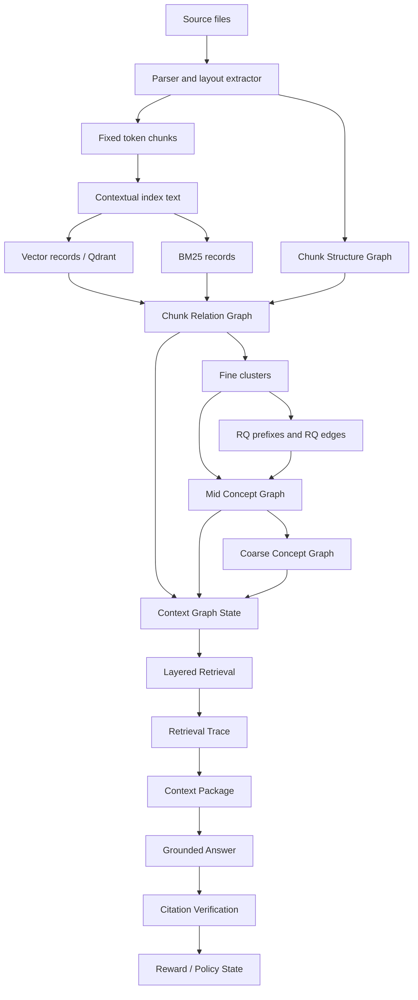

目标链路的核心约束是单调可追溯性。若 \(h_l\) 表示第 \(l\) 层 state hash，则任意一次检索 trace 必须保存：

$$
\tau(q)
=
\left(
q,\ h_{\mathrm{chunk}},h_{\mathrm{struct}},h_{\mathrm{rel}},
h_{\mathrm{fine}},h_{\mathrm{mid}},h_{\mathrm{coarse}},
h_{\mathrm{runtime}},h_{\mathrm{agent}}
\right)
$$


**架构影响：**
- 影响对象：解析、固定 chunk、结构图、contextual index、chunk relation graph、fine clusters、mid concepts、coarse concepts、layered retrieval、Agent、context package、citation verification 和 policy update。
- 影响方式：端到端链路定义状态传播顺序；任一上游状态 hash 变化都会改变下游候选集合、concept packet、检索路径、证据包和回答审计。
- 传播字段：`knowledge_base_id`、`document_version_id`、`chunk_version`、`chunk_scope_hash`、`structure_graph_hash`、`chunk_relation_hash`、`fine_cluster_hash`、`mid_concept_hash`、`coarse_concept_hash`、`runtime_settings_hash`。
- 触发条件：active chunk scope、embedding text、关系边、concept definition、runtime settings 或 policy state 改变时，相关 trace、cache、context package 和 graph freshness 需要重新计算。
- 验收观察点：`context_graph_states`、`context_graph_freshness`、`retrieval_traces`、`graph_retrieval_steps`、`context_packages` 与 `citation_verifications` 必须形成连续审计链。

## 四层上下文图谱

目标四层图谱是异构多层图：

$$
\mathcal{G}
=
\left(
G_0,G_1,G_2,G_3,\Pi
\right)
$$

其中 \(G_0=(V_0,E_0)\) 是结构图，\(G_1=(V_C\cup V_F,E_{CC}\cup E_{CF}\cup E_{FF})\) 是 chunk relation graph 与 fine clusters，\(G_2=(V_M,E_M)\) 是 mid concept graph，\(G_3=(V_K,E_K)\) 是 coarse concept graph，\(\Pi\) 是跨层 membership 与 trace 投影。

跨层投影的目标性质是保守性：

$$
\forall v\in V_2\cup V_3,\quad
support(v)\subseteq V_C
$$

即概念层节点不能成为事实源，必须能回到 chunk support。

### 第 0 层：Chunk Structure Graph

目标 \(G_0\) 保存原文地图，包含 document、section、page、region、paragraph、table、formula、caption 等结构对象。结构边的目标集合为：

$$
E_0
=
E_{\mathrm{parent}}
\cup E_{\mathrm{prev}}
\cup E_{\mathrm{page}}
\cup E_{\mathrm{region}}
\cup E_{\mathrm{closure}}
$$

chunk 到结构节点的映射权重定义为：

$$
w_{c,s}^{(0)}
=
\alpha_1\operatorname{SpanOverlap}(c,s)
+\alpha_2\operatorname{BBoxIoU}(c,s)
+\alpha_3\operatorname{PathMatch}(c,s)
$$


**架构影响：**
- 影响对象：contextual index、chunk relation graph、layered retrieval、context package、citation verification 和前端结构上下文展示。
- 影响方式：结构图决定 chunk 的 parent section、previous/next、same page 和 section path；检索命中后由它恢复上下文，并为结构邻接边提供输入。
- 传播字段：`chunk_structure_nodes`、`chunk_structure_edges`、`chunk_structure_mappings`、`chunk_coordinates`、`section_path`、`page_range`、`bbox`。
- 触发条件：parser output、section offsets、chunk span、page/region metadata 或 structure mapping coverage 变化时，structure hash、context package 和相关 retrieval cache 需要刷新。
- 验收观察点：structure mapping coverage、parent section 命中率、previous/next 恢复数量、same page 邻居数量和 citation span 可回溯性。

### 第 1 层：Chunk Relation Graph

目标 \(G_1\) 是可复算底层关系网络。候选边来自：

$$
E_{\mathrm{cand}}
=
E_{\mathrm{dense}}
\cup E_{\mathrm{bm25}}
\cup E_{\mathrm{struct}}
\cup E_{\mathrm{cohit}}
\cup E_{\mathrm{rq}}
\cup E_{\mathrm{bridge}}
$$

每条边具有特征：

$$
\phi_{ij}
=
\left[
\cos(e_i,e_j),
\operatorname{BM25}(i,j),
\operatorname{Struct}(i,j),
\operatorname{CoHit}(i,j),
\operatorname{RQ}(i,j),
\operatorname{Bridge}(i,j)
\right]
$$

边强度与距离目标形式为：

$$
s_{ij}
=
\sigma(\theta^\top\phi_{ij})
$$

$$
d_{ij}
=
-\log(\max(\epsilon,s_{ij}))
$$

其中 \(s_{ij}\in(0,1]\) 表示同类算法内可审计的关系强度，\(d_{ij}\) 表示图导航距离；关联越大，距离越小。兼容字段 `weight` 在迁移期必须通过 `protocol_version` 标明语义，active traversal 使用 `distance/raw_strength` 或等价字段。


**架构影响：**
- 影响对象：fine clusters、mid concept packet、coarse community diagnostics、layered retrieval、bridge expansion、Agent repair 和 graph visualization。
- 影响方式：关系边把固定 chunk 变成可遍历网络；fine cluster、bridge chunk、concept candidate 和 priority-queue path traversal 都依赖这些边。
- 传播字段：`chunk_relation_graph_states`、`chunk_relation_edges.edge_type`、`weight`、`distance`、`raw_strength`、`features_json`、`source_algorithm`、`protocol_version`、`rq_path`。
- 触发条件：embedding text version、vector records、BM25 records、structure hash、RQ settings 或 edge keep policy 变化时，relation state hash 与下游 fine/mid/coarse hash 需要重算。
- 验收观察点：edge count by type、bridge edge count、degree distribution、distance distribution、RQ edge diagnostics、graph expansion steps 和 traversal contribution。

### 第 2 层：Mid Concept Graph

目标 \(G_2\) 将 fine graph communities、meet/join/bridge fine nodes 和底层 support chunks 提升成可解释概念。一个 mid concept \(m\) 的定义由 concept packet \(P_m\)、底层 fine edge projection 和 LLM function \(f_{\mathrm{LLM}}\) 给出：

$$
m
=
f_{\mathrm{LLM}}(P_m)
$$

grounded gate 定义为：

$$
\operatorname{accept}(m)
=
\mathbf{1}\left[
|S_C(m)|>0
\land
|S_F(m)|>0
\land
\operatorname{SpanValid}(S_C(m))
\right]
$$

其中 \(S_C(m)\) 是 support chunks，\(S_F(m)\) 是 support fine clusters，且 \(S_E(m)\) 必须包含形成该概念的 support fine edges 或等价底层 relation evidence。


**架构影响：**
- 影响对象：coarse concept graph、concept routing、Layered P&E Agent、context package packing、answer grounding 和前端概念路径展示。
- 影响方式：mid concept 将 fine graph community 提升为可解释语义地址；mid edge 由 fine edge 投影而来；检索通过 entry selection 和 priority-queue drilldown 从 mid path 回落到 fine nodes 与 support chunks。
- 传播字段：`mid_concepts`、`mid_concept_memberships`、`mid_concept_edges`、`mid_concept_definitions.support_spans_json`、`support_chunk_ids`、`support_fine_cluster_ids`、`support_fine_edge_ids`、`distance`、`raw_strength_summary`。
- 触发条件：fine community、fine edge distance、bridge/meet/join nodes、concept packet、LLM definition、grounded gate 或 prompt protocol 变化时，mid concept hash、coarse hash、retrieval trace 和 cache 需要刷新。
- 验收观察点：concept grounded rate、support span coverage、fine community coverage、membership role 分布、concept edge projection 支撑率和 concept path accuracy。

### 第 3 层：Coarse Concept Graph

目标 \(G_3\) 是 mid concept distance graph 上的高层主题区域。coarse concept 由 mid graph community、boundary/bridge mid concepts、cross-community weak ties 和 LLM grounded definition 共同生成。目标上可使用社区目标函数：

$$
Q
=
\frac{1}{2m}
\sum_{i,j}
\left[
A_{ij}
-\gamma\frac{k_i k_j}{2m}
\right]
\mathbf{1}[g_i=g_j]
$$

同时保留桥接概念：

$$
B(v)
=
\sum_{s\ne t}
\frac{\sigma_{st}(v)}{\sigma_{st}}
$$

其中 \(B(v)\) 是 betweenness，\(\sigma_{st}\) 是从 \(s\) 到 \(t\) 的最短路径数。

coarse edge 不是 LLM 直接生成，而是由跨 coarse community 的 mid edges 投影，并保存 support mid edge ids、support fine edge ids、support chunks 与距离聚合结果。


**架构影响：**
- 影响对象：coarse entry selection、mid concept drilldown、cross-document synthesis、Agent coarse jump、graph overview 和 retrieval cache。
- 影响方式：coarse concept 作为高层入口收缩查询空间；coarse edge 由 mid edge projection 支撑，同时保留 weak ties 与 bridge concepts，避免主题社区切断跨域推理路径。
- 传播字段：`coarse_concepts`、`coarse_concept_memberships`、`coarse_concept_edges`、`coarse_concept_definitions`、`support_mid_edge_ids`、`support_fine_edge_ids`、`distance`、`bridge_density`、`community_stability`、`coarse_concept_hash`。
- 触发条件：mid concept hash、mid edge distance、community grouping、coarse definition、bridge diagnostics 或 edge projection protocol 变化时，coarse entry、retrieval trace 和 cache key 需要刷新。
- 验收观察点：community count、singleton rate、bridge density、coarse-to-mid drilldown path、coarse edge projection support 和 traversal contribution。

## 跨层对象协议

### 架构图

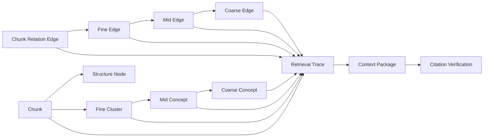

### 关系

跨层对象协议将每层关系表示为稀疏 membership 矩阵：

$$
M^{C\to F}_{cf}\in[0,1],\quad
M^{F\to M}_{fm}\in[0,1],\quad
M^{M\to K}_{mk}\in[0,1]
$$

从 chunk 到 coarse concept 的派生支撑强度为：

$$
M^{C\to K}
=
M^{C\to F}M^{F\to M}M^{M\to K}
$$

但该乘积只作为路由和解释信号，不能替代 citation span。事实约束为：

$$
\operatorname{Fact}(x)
\Rightarrow
\exists c\in V_C,\ \exists s=(char\_start,char\_end): x\leftarrow(c,s)
$$


### Edge evidence projection

新版四层图还需要边证据投影协议。上层边必须能回到下层边集合：

$$
E_F(f_a,f_b)
\Leftarrow
\{e_{cc}\in E_C: c_i\in f_a,\ c_j\in f_b\}
$$

$$
E_M(m_a,m_b)
\Leftarrow
\{e_f\in E_F: f_i\in m_a,\ f_j\in m_b\}
$$

$$
E_K(k_a,k_b)
\Leftarrow
\{e_m\in E_M: m_i\in k_a,\ m_j\in k_b\}
$$

任意上层边 \(e^l\) 必须保存：

```text
distance
raw_strength_summary
support_child_edge_ids
support_chunk_ids
edge_type
source_algorithm
protocol_version
diagnostics_json
```

投影不允许断链：

$$
e_K
\Rightarrow
\exists e_M,\exists e_F,\exists e_C,\exists c_i,c_j
$$

其中最终 evidence chunk 必须能回到 raw span、page range、bbox 或 structure path。

### 关联字段

跨层协议要求每个可审计对象携带主键、state id 与 hash：

$$
id(o)
=
\left(
pk,\ state\_id,\ protocol\_version,\ state\_hash
\right)
$$

核心字段：

```text
chunk_id
document_version_id
structure_node_id
fine_cluster_id
mid_concept_id
coarse_concept_id
chunk_relation_edge_id
fine_cluster_edge_id
mid_concept_edge_id
coarse_concept_edge_id
chunk_relation_graph_state_id
mid_concept_state_id
coarse_concept_state_id
context_graph_state_id
retrieval_trace_id
context_package_id
answer_session_id
citation_verification_id
runtime_settings_hash
agent_operating_envelope_hash
edge_distance_protocol_hash
edge_projection_protocol_hash
traversal_protocol_hash
```

### 代码中的 state hash

目标上，任意 active context graph 的 hash 为：

$$
h_{\mathcal{G}}
=
H\left(
h_C,h_0,h_1,h_F,h_2,h_3,h_{\mathrm{runtime}},h_{\mathrm{agent}}
\right)
$$


**架构影响：**
- 影响对象：所有跨层跳转、边证据投影、检索 trace、context package、answer audit、前端图谱 payload 和运维对账脚本。
- 影响方式：跨层协议提供 id、state、edge support 与 hash 的共同坐标系，使 chunk、fine cluster、mid concept、coarse concept、edge projection、context package 与 citation verification 能在同一审计链中互相定位。
- 传播字段：`chunk_id`、`fine_cluster_id`、`mid_concept_id`、`coarse_concept_id`、`chunk_relation_edge_id`、`fine_cluster_edge_id`、`mid_concept_edge_id`、`coarse_concept_edge_id`、`context_graph_state_id`、`retrieval_trace_id`、`context_package_id`、`state_hash`。
- 触发条件：任一层 state id、protocol version、edge distance protocol 或 hash 变化时，下游 API payload、cache key、retrieval trace 和 UI graph view 都应使用新协议坐标。
- 验收观察点：跨层 id 不悬空、edge projection 不断链、trace step 可回放、context package 可回到 raw chunk span、answer session 可回到 citation verification。

## 事实源与派生状态

### 架构图

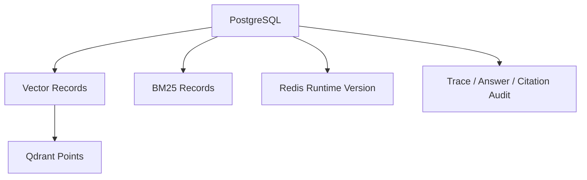

目标系统采用事实源与派生状态分离。设 \(S_P\) 为 PostgreSQL 持久状态，\(S_D\) 为派生状态，则一致性定义为：

$$
\operatorname{Consistent}(S_P,S_D)
=
\mathbf{1}
\left[
H(\operatorname{rebuild}(S_P))=H(S_D)
\right]
$$


### PostgreSQL

PostgreSQL 保存不可丢失事实、生命周期与审计记录。目标上它是唯一可恢复源：

$$
S_{\mathrm{recover}}
=
F_{\mathrm{rebuild}}(S_{\mathrm{postgres}})
$$

PostgreSQL 必须保存 knowledge bases、documents、chunks、structure graph、relation graph、concept graphs、context graph state、retrieval traces、context packages、answer sessions、citation verifications、reward events、policy states 和 runtime settings versions。

### Qdrant

向量索引目标函数是近似最近邻：

$$
\operatorname{ANN}(q)
=
\operatorname*{arg\,topk}_{c\in C}
\cos(e_q,e_c)
$$

Qdrant 是派生索引。collection 命名规则：

$$
collection
=
\operatorname{sanitize}
\left(
symbograph,\ embedding\_model,\ embedding\_text\_version,\ chunk\_schema\_version
\right)
$$

本地检索路径必须在 `VectorRecord.diagnostics_json` 保存 embedding vector，以便本地 layered retrieval 直接计算 dense score。

### BM25

BM25 的理论打分为：

$$
\operatorname{BM25}(q,d)
=
\sum_{t\in q}
IDF(t)
\cdot
\frac{f(t,d)(k_1+1)}
{f(t,d)+k_1(1-b+b\frac{|d|}{avgdl})}
$$

`BM25Record` 必须保存 contextual text token frequencies；检索时用 `BM25Okapi` 从 ready records 构造 corpus。

### Redis

Redis 承担 runtime version broadcast。理论上，热加载事件为：

$$
event
=
\left(h_{\mathrm{runtime}},\Delta keys,source,timestamp\right)
$$

`publish_runtime_settings_version()` 必须写入 `runtime_settings_versions`，设置 Redis key，发布 channel message，并清理 settings、cache manager 与 reranker cache。

**架构影响：**
- 影响对象：导入、索引、图构建、检索、QA、Agent、runtime settings、缓存、对账脚本和测试验收。
- 影响方式：PostgreSQL 决定可恢复事实；Qdrant、BM25 与 Redis 只能改变召回效率、运行态协调和热加载，不改变事实来源。
- 传播字段：`vector_records`、`bm25_records`、`runtime_settings_versions`、`payload_hash`、`collection_name`、`status`、`diagnostics_json`。
- 触发条件：派生索引缺失、payload hash 不一致、runtime version 更新或 Redis broadcast 失败时，相关检索路径应进入重建、刷新或阻断。
- 验收观察点：Qdrant/BM25 对账通过、runtime publish 可观测、cache miss 行为正确、派生状态能从 PostgreSQL 重建。

## 解析、固定 Chunk 与结构图

### 架构图

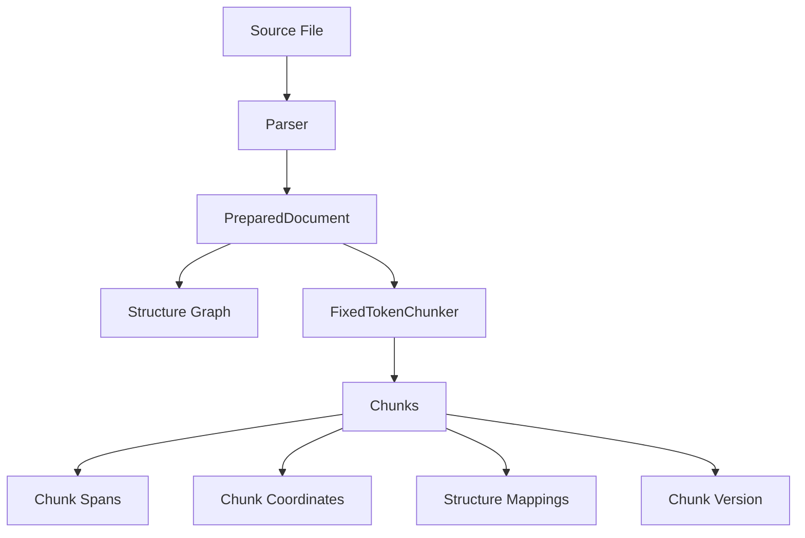

### PreparedDocument

目标解析产物定义为：

$$
D
=
(T,L,S,M)
$$

其中 \(T\) 是文本序列，\(L\) 是布局坐标，\(S\) 是结构对象集合，\(M\) 是 parser metadata。解析目标不是创造语义事实，而是为 chunk 和结构恢复提供可定位地址。


### 固定 Token Chunk

目标固定切块函数：

$$
C
=
\operatorname{FixedChunk}(D;B,O,\Omega)
$$

其中 \(B\) 是 chunk token budget，\(O\) 是 overlap，\(\Omega\) 是保护对象集合。chunk 边界满足：

$$
|c_i|\le B+\epsilon_{\Omega}
$$

相邻 chunk 的覆盖关系为：

$$
c_i\cap c_{i+1}
\approx
O
$$


### 结构图写入

目标结构映射权重：

$$
w(c,s)
=
\alpha
\frac{|span(c)\cap span(s)|}{|span(c)|}
+(1-\alpha)\operatorname{LayoutOverlap}(c,s)
$$

结构映射的基础可复算项为 char overlap：

$$
overlap(c,s)
=
\max
\left(
0,\min(c_e,s_e)-\max(c_b,s_b)
\right)
$$

coverage ratio：

$$
coverage(c,s)
=
\frac{overlap(c,s)}
{\max(1,c_e-c_b)}
$$


### 版本与取消边界

目标版本语义用知识库内最高 chunk version 表示：

$$
v_{\mathrm{target}}
=
\begin{cases}
1,& v_{\max}=0\\
v_{\max}+1,& full\ rebuild\\
v_{\max},& selected\ parse
\end{cases}
$$

取消恢复不能使用 \(v-1\) 推断，应使用解析前记录的 active version：

$$
rollback\_version
=
v_{\mathrm{before\_batch}}
$$


**架构影响：**
- 影响对象：contextual index、Qdrant、BM25、chunk relation graph、fine clusters、concept graphs、retrieval trace、context package 和 citation verification。
- 影响方式：固定 chunk 定义全系统最小地址单位；结构图定义上下文恢复路径；版本策略决定下游索引、图状态与引用审计是否仍然有效。
- 传播字段：`chunk_id`、`chunk_version`、`chunk_index`、`char_start`、`char_end`、`token_start`、`token_end`、`text_hash`、`section_path`、`page_range`。
- 触发条件：chunk size、overlap、tokenizer、parser output、chunk span、document version 或 active chunk scope 变化时，contextual index、relation graph、concept graph 和 cache 都需要刷新或重建。
- 验收观察点：active chunk 版本一致、span 不越界、结构映射覆盖率达标、取消恢复回到 batch 前版本、citation 能回到 raw chunk。

## Contextual Index Text

### 架构图

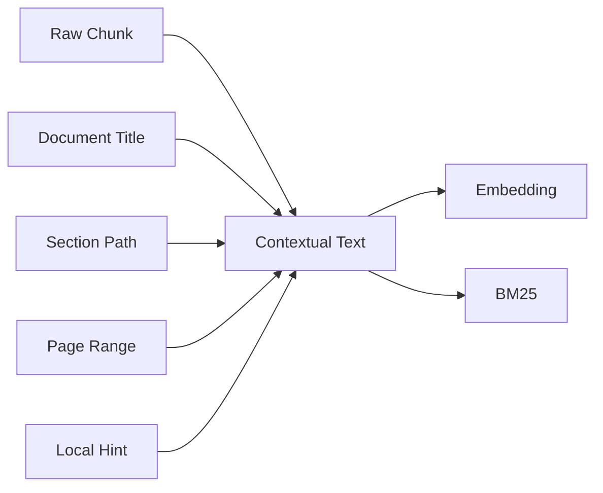

目标是分离“索引用文本”和“引用用文本”。定义：

$$
x_c^{ctx}
=
\operatorname{concat}
\left(
title(d),
section(c),
page(c),
hint(c),
x_c
\right)
$$

raw citation 仍然是：

$$
cite(c)
=
(document\_version\_id,chunk\_id,char\_start,char\_end,page\_range)
$$

### Context text

目标上，contextual text 改变必须改变：

$$
h_{\mathrm{ctx}}(c)
=
H(x_c^{ctx},embedding\_text\_version)
$$


### Vector records

目标 embedding：

$$
e_c
=
f_{\mathrm{emb}}(x_c^{ctx};\theta_{\mathrm{emb}})
$$

vector payload hash：

$$
h_{\mathrm{vec}}
=
H(e_c,chunk\_id,embedding\_model,embedding\_text\_version)
$$


### BM25 records

目标 lexical index：

$$
tf_{c,t}
=
\sum_{u\in tokenize(x_c^{ctx})}
\mathbf{1}[u=t]
$$

`BM25Record` 必须保存 term frequencies、document length、token count、text hash 和 tokenizer version，并可由 chunks 与 chunk context texts 重建。

**架构影响：**
- 影响对象：dense recall、BM25 recall、chunk relation graph、RQ path、layered retrieval、rerank、context package packing 和 cache key。
- 影响方式：contextual text 是 embedding 与 lexical index 的输入；它改变召回分布和关系边候选，但 citation 仍必须指向 raw chunk span。
- 传播字段：`chunk_context_texts.context_hash`、`embedding_text_version`、`vector_records.payload_hash`、`bm25_records.text_hash`、`tokenizer_version`。
- 触发条件：contextual prompt、embedding text version、embedding model、BM25 tokenizer 或 context hash 变化时，Qdrant、BM25、relation graph 和 retrieval cache 必须刷新。
- 验收观察点：vector record ready 率、BM25 record ready 率、embedding dimension 一致、context hash 与 payload hash 对齐、raw span citation 不受 contextual text 改写影响。

## Chunk Relation Graph

### 架构图

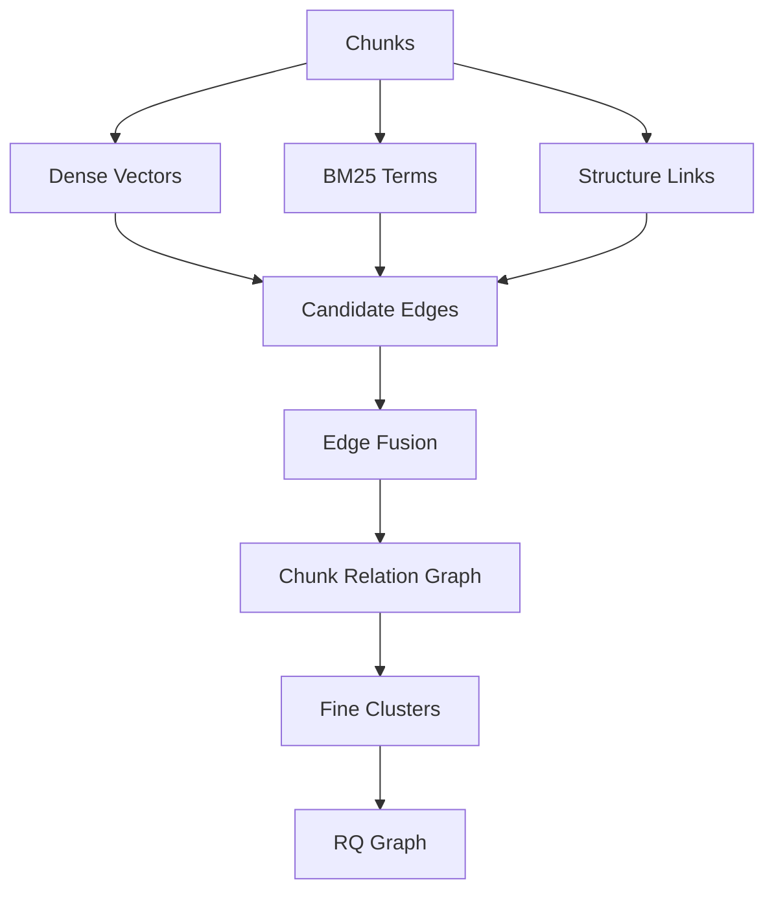

### State

目标 relation graph state：

$$
S_1
=
(V_C,V_F,E_{CC},E_{CF},E_{FF},h_1,p_1)
$$

其中 \(h_1\) 是 state hash，\(p_1\) 是 protocol version。protocol 是 `chunk_relation_graph_rq_v2`。

目标 state hash：

$$
h_1
=
H(scope(C),stats(E),clusters(F),p_1)
$$


### Edge builder

目标候选边：

$$
E_{\mathrm{cand}}
=
E_{\mathrm{prevnext}}
\cup E_{\mathrm{section}}
\cup E_{\mathrm{page}}
\cup E_{\mathrm{dense}}
\cup E_{\mathrm{lexical}}
\cup E_{\mathrm{rq}}
$$

目标边特征：

$$
\phi_{ij}
=
\left[
\operatorname{Adj}(i,j),
\operatorname{SameSec}(i,j),
\operatorname{SamePage}(i,j),
\cos(e_i,e_j),
J(T_i,T_j),
\operatorname{RQ}(i,j)
\right]
$$

其中 \(J(T_i,T_j)\) 是 term set Jaccard：

$$
J(T_i,T_j)
=
\frac{|T_i\cap T_j|}{|T_i\cup T_j|}
$$


### Graph distance and traversal support

目标关系图不输出孤立图分数，而输出可遍历距离边和路径证据。chunk relation edge 的 active distance：

$$
d_e
=
-\log(\max(\epsilon,s_e))
$$

候选路径距离：

$$
D(P)
=
\sum_{e\in P}d_e
+\operatorname{Penalty}(P)
$$

路径贡献由覆盖面、证据独立性、桥接性和 bounded cycle reward 产生：

$$
R(P)
=
G_{\mathrm{facet}}
+G_{\mathrm{support}}
+G_{\mathrm{bridge}}
+G_{\mathrm{cycle}}
$$

active traversal 使用 \(D(P)-R(P)\) 作为优先队列排序的一部分，topological metrics 只作为入口选择和 tie-break prior，不再把 degree 或 PageRank 直接当最终 chunk 分。


**架构影响：**
- 影响对象：fine clusters、RQ prefix clusters、mid concept packet、priority-queue traversal、bridge repair、context package bridge chunks 和 graph diagnostics。
- 影响方式：relation graph 把 dense、BM25、结构和 RQ 信号统一成可遍历距离边；下游不直接使用孤立 cluster label，而是使用边、membership、path labels 和 convergence diagnostics。
- 传播字段：`chunk_relation_graph_state_id`、`chunk_relation_edges`、`fine_cluster_memberships`、`fine_cluster_edges`、`edge_type`、`distance`、`raw_strength`、`features_json`、`state_hash`。
- 触发条件：embedding、BM25、structure mapping、chunk scope、RQ settings 或 relation protocol 变化时，fine clusters、mid concepts、coarse concepts、retrieval trace 和 cache 需要刷新。
- 验收观察点：relation state ready、edge type 分布、bridge ratio、distance distribution、trace 中 frontier expansion steps、cycle reward 和 diagnostics hash。

## Fine Clusters 与 RQ-KMeans

### 目标架构

Fine layer 是第 1 层关系图的可遍历语义地址层，不承担原文结构职责。原文层次、坐标、previous/next、表格、公式和图注闭包由 Chunk Structure Graph 负责；Fine layer 只表达可复算语义邻域、簇间距离、桥接路径和 chunk membership。

目标架构受 [ContextRAG](https://arxiv.org/abs/2605.19735) 的 extraction-free graph construction 启发：底层拓扑不由 LLM 抽实体和关系，而由 embedding、RQ-KMeans、fuzzy FCA / meet-join 节点和共激活边构建。[KG2RAG](https://aclanthology.org/2025.naacl-long.449/) 的 seed expansion / graph organization 思路用于检索阶段：先定位图入口，再沿关系图扩展和组织证据。

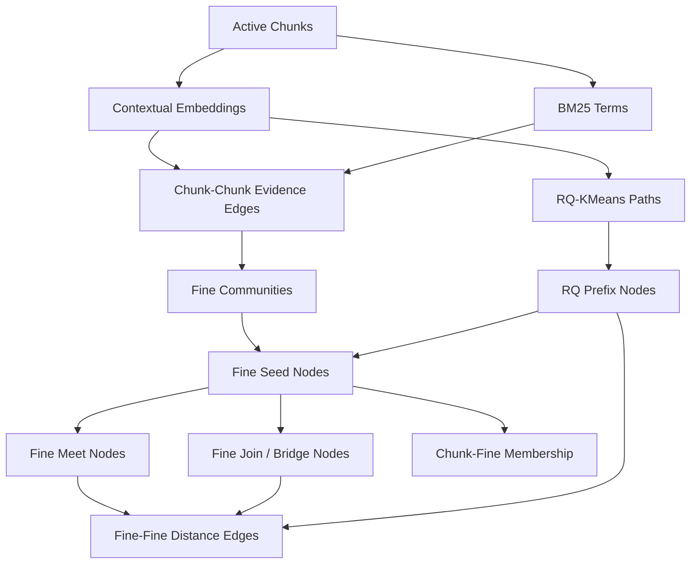

### Chunk evidence graph

目标第一步是构建 chunk-chunk evidence graph：

$$
G_C=(V_C,E_C)
$$

其中：

$$
E_C
=
E_{\mathrm{dense}}
\cup E_{\mathrm{bm25}}
\cup E_{\mathrm{cohit}}
\cup E_{\mathrm{rq}}
\cup E_{\mathrm{bridge}}
$$

结构边可以作为 evidence feature 或 restoration hint，但不再用于粗糙分词分桶形成主 fine cluster。每条边保存关系强度 \(s_e\in(0,1]\) 与距离 \(d_e\)：

$$
d_e
=
-\log(\max(\epsilon,s_e))
$$

关联越强，\(s_e\) 越大，\(d_e\) 越小。不同 edge type 的 \(s_e\) 只在同类算法内可比较；跨类型导航使用 typed edge、预算、路径证据和 LLM 灰区裁决，不做全局拍脑袋加权。

### Fine communities

目标 fine nodes 来自底层 evidence graph 的社区和语义地址，而不是 section/text 词频桶。社区目标为：

$$
\max_{\mathcal{F}}
\sum_{f\in\mathcal{F}}
\left[
\sum_{i,j\in f}w_{ij}
-\gamma
\sum_{i\in f,j\notin f}w_{ij}
\right]
$$

其中 \(w_{ij}\) 是同类型或归一化后可审计的 chunk evidence strength。可选算法包括 Leiden、HDBSCAN、kNN components、RQ prefix grouping 与 co-retrieval communities。

chunk 到 fine node 的 fuzzy membership：

$$
\mu_{c,f}
=
\frac{\exp(-d(e_c,\mu_f)/\tau)}
{\sum_{f'}\exp(-d(e_c,\mu_{f'})/\tau)}
$$

目标 fine node 类型：

```text
fine_seed:
  稳定图社区、RQ prefix 或高密度 kNN component。

fine_meet:
  多个 fine seed / RQ prefix 的高密度交集，表示更窄语义区。

fine_join:
  多个 fine seed / RQ prefix 的并集或桥接区，表示跨主题通道。

fine_bridge:
  跨社区弱边集中经过的连接区。
```


### Fine cluster edges

目标保留所有有证据的簇间边，边字段使用距离语义：关联越强，距离越小。Fine edge schema：

```text
source_fine_id
target_fine_id
edge_type
distance
raw_strength
support_chunk_ids
support_chunk_edge_ids
source_algorithm
protocol_version
diagnostics_json
```

基础强度：

$$
s_{fg}
=
\operatorname{Norm}
\left(
\cos(\mu_f,\mu_g),
\frac{|S_f\cap S_g|}{|S_f\cup S_g|},
\operatorname{BridgeSupport}(f,g),
\operatorname{CoActivation}(f,g)
\right)
$$

距离：

$$
d_{fg}
=
-\log(\max(\epsilon,s_{fg}))
$$

保留的 fine-fine edge types：

```text
parent_child
sibling
meet_of
join_of
overlap_bridge
co_activated
centroid_near
rq_parent_child
rq_sibling
rq_centroid_near
rq_overlap_bridge
```


### RQ-KMeans

目标 RQ-KMeans 将 embedding 递归量化为语义地址。对 chunk embedding \(e_c\)：

$$
r_c^{(0)}=e_c
$$

第 \(l\) 层：

$$
q_c^{(l)}
=
\operatorname*{arg\,min}_{k}
\left\|r_c^{(l-1)}-\mu_{l,k}\right\|_2
$$

$$
r_c^{(l)}
=
r_c^{(l-1)}-\mu_{l,q_c^{(l)}}
$$

RQ path：

$$
path(c)
=
\left(q_c^{(1)},q_c^{(2)},\ldots,q_c^{(L)}\right)
$$

residual norm：

$$
\rho_c
=
\left\|r_c^{(L)}\right\|_2
$$


### RQ prefix clusters

目标上，每个 prefix 是层级地址节点：

$$
prefix_l(c)
=
(q_c^{(1)},\ldots,q_c^{(l)})
$$

prefix membership：

$$
\mu_{c,p}
=
\max
\left(
0.2,\min(1,e^{-\rho_c/\tau_r})
\right)
$$


### RQ cluster edges

目标 RQ cluster graph 包含 parent-child、sibling、centroid-near、overlap-bridge：

$$
E_F^{rq}
=
E_{\mathrm{parent}}
\cup E_{\mathrm{sibling}}
\cup E_{\mathrm{centroid}}
\cup E_{\mathrm{overlap}}
$$

目标边类型：

```text
rq_parent_child
rq_sibling
rq_centroid_near
rq_overlap_bridge
```

### RQ chunk edges

两个 chunk 的最长公共前缀：

$$
LCP(c_i,c_j)
=
\max
\left\{
l:\ prefix_l(c_i)=prefix_l(c_j)
\right\}
$$

RQ edge weight：

$$
w_{ij}^{rq}
=
\frac{LCP(c_i,c_j)}{L}
\cdot
\exp
\left(
-\frac{\|r_i-r_j\|_2}{\tau_r}
\right)
$$

目标边类型：

```text
rq_hierarchy_near
rq_prefix_sibling
rq_residual_near
```

并在 edge features 中保存 `lcp_depth`、`residual_distance`、`rq_weight`、source/target rq path。若某类 RQ edge 没自然产生，会选择 residual 最近 pair 写入 fallback pair，保证 trace 和 UI 中可诊断。

**架构影响：**
- 影响对象：mid concept aggregation、coarse community、priority-queue graph traversal、context package bridge restoration、retrieval trace 和前端 fine/RQ 诊断。
- 影响方式：fine layer 提供可遍历语义地址、距离边、meet/join/bridge 节点和 chunk membership；中粒度节点由 fine communities 聚合；检索从 fine path 回落到 chunks，并由结构图恢复上下文。
- 传播字段：`fine_clusters`、`fine_cluster_memberships`、`fine_cluster_edges`、`rq_path`、`rq_level`、`rq_path_prefix`、`residual_norm`、`raw_strength`、`distance`、`support_chunk_edge_ids`、`lcp_depth`、`residual_distance`。
- 触发条件：relation graph hash、embedding vectors、RQ level/codebook、fine community、meet/join induction、bridge support 或 residual diagnostics 变化时，mid concept hash、coarse hash、retrieval trace 和 cache 必须刷新。
- 验收观察点：fine cluster singleton rate、fine community coverage、meet/join node count、fuzzy membership 数量、RQ path availability、fine edge distance distribution、LCP depth 分布、bridge path coverage 和 traversal frontier diagnostics。

## Mid Concept Graph

### 架构图

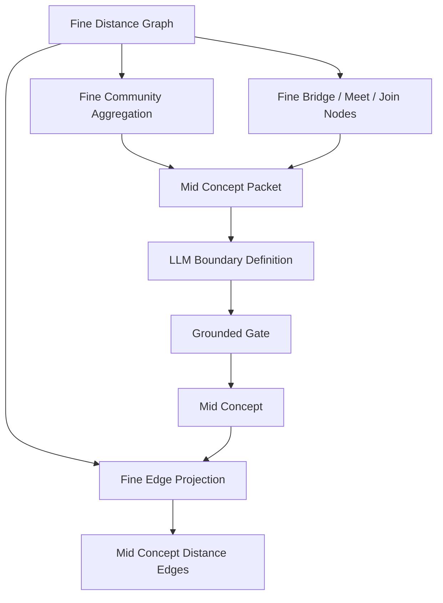

### Community aggregation

目标 mid concept 不再从单个高分 fine cluster 直接生成，而是由 fine graph 中的社区、meet/join 节点和 bridge 区域聚合。设 \(G_F=(V_F,E_F)\)，中粒度候选社区为：

$$
\mathcal{M}^{cand}
=
\operatorname{Community}
\left(
G_F,
d_F,
\operatorname{typed\_edges},
\operatorname{bridge\_protection}
\right)
$$

每个候选 \(M_k^{cand}\subseteq V_F\) 必须保留：

```text
support_fine_node_ids
support_fine_edge_ids
bridge_fine_node_ids
boundary_fine_node_ids
representative_chunk_ids
support_chunk_ids
structure_paths
rq_path_coverage
```

聚合目标不是删除弱边，而是形成上层语义节点，同时保留跨社区弱边和桥接路径。可用社区算法包括 Leiden、HDBSCAN over graph embeddings、k-core constrained community、RQ prefix merging 和 fuzzy FCA meet/join folding。


### Concept packet

目标 concept packet：

$$
P_m
=
\left(
F_m,E_m,B_m,\partial F_m,R_m,S_m,Q_m,X_m
\right)
$$

其中 \(F_m\) 是聚合 fine nodes，\(E_m\) 是社区内 fine edges，\(B_m\) 是 bridge fine nodes，\(\partial F_m\) 是 boundary fine nodes，\(R_m\) 是代表 chunks，\(S_m\) 是 support chunks，\(Q_m\) 是 RQ / meet-join diagnostics，\(X_m\) 是 chunk excerpts 和 source spans。

packet 字段包括 packet id、fine cluster ids、candidate labels、representative chunk ids、support/bridge counts、support/bridge chunk ids、RQ sampling、chunk excerpts 和 grounding hash。

### LLM 定义

目标 LLM 输出：

$$
y_m
=
f_{\mathrm{LLM}}
\left(
P_f,\ prompt_{\mathrm{mid}}
\right)
$$

输出必须可解析为：

```text
canonical_label
aliases
definition
scope_note
inclusion_criteria
exclusion_criteria
representative_chunk_ids
support_chunk_ids
confidence
why_this_concept_exists
```

LLM 只负责命名、定义、范围、包含/排除标准和证据充分性解释，不负责创建底层边，也不负责决定 chunk 事实。


### 写入规则

目标 grounded gate：

$$
\operatorname{accept}(m)
=
\mathbf{1}
\left[
S_C(m)\ne \varnothing
\land
S_C(m)\subseteq support(f)
\land
\forall c\in S_C(m),\ Span(c)\ne\varnothing
\right]
$$


### Concept edges

目标 mid concept edge 由 fine-fine edges 投影而来。若 \(m_a\) 与 \(m_b\) 的 support fine node 集合之间存在至少一条 \(E_F\) 边，则写入 mid edge：

$$
E_M
=
\left\{
(m_a,m_b):
\exists f_i\in F_a,f_j\in F_b,\ (f_i,f_j)\in E_F
\right\}
$$

中粒度边距离从底层 fine edge 距离聚合：

$$
d_M(m_a,m_b)
=
\frac{
Q_{0.15}\left(\{d_F(f_i,f_j):(f_i,f_j)\in E_F,F_a\leftrightarrow F_b\}\right)
}{
1+\log(1+n_{ab})
}
$$

其中 \(Q_{0.15}\) 是低分位距离，避免被单条最小噪声边完全支配；\(n_{ab}\) 是独立 support fine edges 数量，支持越多距离越短。边必须保存：

```text
support_fine_edge_ids
support_fine_node_ids
support_chunk_ids
distance
raw_strength_summary
edge_type
diagnostics_json
```

边类型由底层主导证据决定：

```text
co_occurs_with
depends_on
contrasts_with
bridge_to
same_method_family
same_evidence_region
```

LLM 可以解释边语义，但不能在没有底层 fine edge evidence 时创建 active mid edge。


**架构影响：**
- 影响对象：coarse community grouping、coarse concept definition、concept routing、Agent planning、context package coverage、citation grounding 和 answer synthesis。
- 影响方式：mid concepts 把 fine graph communities 提升为可解释语义路由；mid edges 是 fine edges 的证据投影；support spans 决定概念能否参与检索、回答和引用验证。
- 传播字段：`mid_concept_state_id`、`mid_concepts`、`mid_concept_memberships`、`mid_concept_edges`、`mid_concept_definitions`、`support_fine_cluster_ids`、`support_fine_edge_ids`、`support_chunk_ids`、`support_spans_json`、`distance`、`grounding_hash`。
- 触发条件：fine cluster hash、fine edge distance、bridge nodes、LLM prompt protocol、concept packet、support span 或 grounded gate 变化时，coarse graph、graph traversal trace、context package 和 cache 需要刷新。
- 验收观察点：mid concept grounded rate、fine community coverage、support chunk coverage、edge support density、distance distribution、concept path accuracy 和 unsupported concept diagnostics。

## Coarse Concept Graph

### 架构图

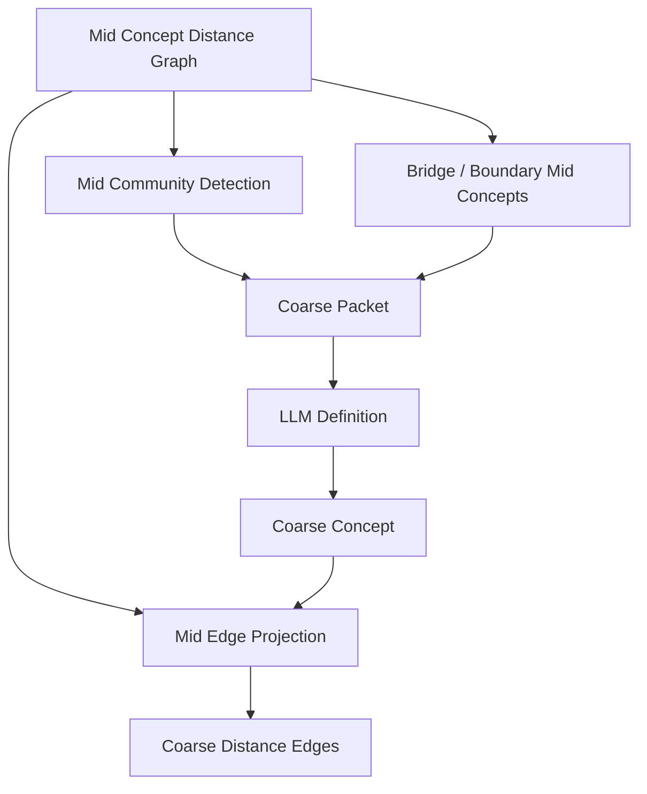

### Community grouping

目标 coarse graph 由 mid concept graph 的社区结构、桥接概念、边界概念和弱边共同生成。社区算法必须保留跨社区边，不得把 connected components 直接当 coarse concepts。

$$
\max_{\mathcal{K}}
Q(\mathcal{K})
-\lambda_1 Conductance(\mathcal{K})
-\lambda_2 SingletonRate(\mathcal{K})
+\lambda_3 BridgeRetention(\mathcal{K})
$$

Conductance：

$$
\phi(S)
=
\frac{cut(S,\bar{S})}
{\min(vol(S),vol(\bar{S}))}
$$

Bridge retention：

$$
BridgeRetention(\mathcal{K})
=
\frac{
|\{e=(u,v)\in E_M:\ community(u)\ne community(v),\ e.type\in B\}|
}{
|E_M|
}
$$

目标 coarse candidate：

```text
included_mid_concept_ids
boundary_mid_concept_ids
bridge_mid_concept_ids
support_mid_edge_ids
cross_community_weak_ties
support_chunk_ids
community_diagnostics
```


### Coarse packet

目标 coarse packet：

$$
P_k
=
\left(
M_k,E_k,B_k,W_k
\right)
$$

其中 \(M_k\) 是 mid concepts，\(E_k\) 是 mid edges，\(B_k\) 是 bridge concepts，\(W_k\) 是 weak ties。

packet 包含 community id、mid concept id/label/definition/support chunks、bridge concepts 和 grounding hash。

### 写入规则

目标 grounded definition：

$$
k
=
f_{\mathrm{LLM}}(P_k,prompt_{\mathrm{coarse}})
$$

并满足：

$$
support(k)
=
\bigcup_{m\in M_k} support(m)
$$

写入要求 `CoarseConcept`、`CoarseConceptMembership`、`CoarseConceptDefinition`。membership role 为 `bridge` 或 `included`。

### Coarse edges

目标 coarse edge 由 mid-mid edges 投影而来。若两个 coarse communities 之间存在 mid edge，则建立 coarse edge：

$$
E_K
=
\left\{
(k_a,k_b):
\exists m_i\in M_a,m_j\in M_b,\ (m_i,m_j)\in E_M
\right\}
$$

距离聚合：

$$
d_K(k_a,k_b)
=
\frac{
Q_{0.15}\left(\{d_M(m_i,m_j):(m_i,m_j)\in E_M,M_a\leftrightarrow M_b\}\right)
}{
1+\log(1+n_{ab}^{M})
}
$$

其中 \(n_{ab}^{M}\) 是跨 coarse community 的独立 mid edges 数量。粗粒度边必须保存：

```text
support_mid_concept_ids
support_mid_edge_ids
support_fine_edge_ids
support_chunk_ids
distance
raw_strength_summary
edge_type
cross_community_weak_ties
```

粗粒度边可以很弱，但不能丢弃。图导航时弱边会因距离大而排在队列后方；若问题需要跨主题或 LLM 判定临界边有价值，仍可被探索。


### Diagnostics

目标 diagnostics：

$$
D_k
=
\left(
Q,\phi,B,stability,singleton\_rate,bridge\_density
\right)
$$

coarse diagnostics 必须保存 modularity、conductance、betweenness、bridge density、community stability、singleton rate、cross edge count、internal edge count 和 community count。

**架构影响：**
- 影响对象：coarse entry selection、mid concept drilldown、cross-document synthesis、Agent coarse jump、retrieval cache、graph overview 和质量诊断。
- 影响方式：coarse concepts 决定查询先进入哪些高层主题区域；coarse edges 是 mid edges 的投影，保留跨主题弱边和桥接概念，供优先队列图导航探索。
- 传播字段：`coarse_concept_state_id`、`coarse_concepts`、`coarse_concept_memberships`、`coarse_concept_edges`、`coarse_concept_definitions`、`community_id`、`bridge_mid_concept_ids`、`support_mid_edge_ids`、`distance`、`freshness_hash`。
- 触发条件：mid concept state、mid edges、community grouping、coarse definition、bridge diagnostics 或 traversal edge protocol 改变时，coarse hash、retrieval trace 和 graph payload 需要刷新。
- 验收观察点：community diagnostics、bridge density、coarse entry hit rate、coarse-to-mid drilldown path、cross edge count、coarse edge distance distribution 和 traversal frontier contribution。

## Layered Retrieval

### 目标检索链路

目标检索不是全局加权排序，而是分层图导航。系统先选择每层入口节点，再用有预算的多标签优先队列 walk search 在图上探索，最后把收敛路径映射到去重后的 chunk evidence package。

目标链路：

```text
query
-> query intent and facets
-> choose coarse entry nodes
-> priority-queue walk on coarse graph
-> drill down to mid graph
-> priority-queue walk on mid graph
-> drill down to fine graph
-> priority-queue walk on fine graph
-> fine membership to chunks
-> bounded chunk relation expansion
-> structure restoration
-> context package
```

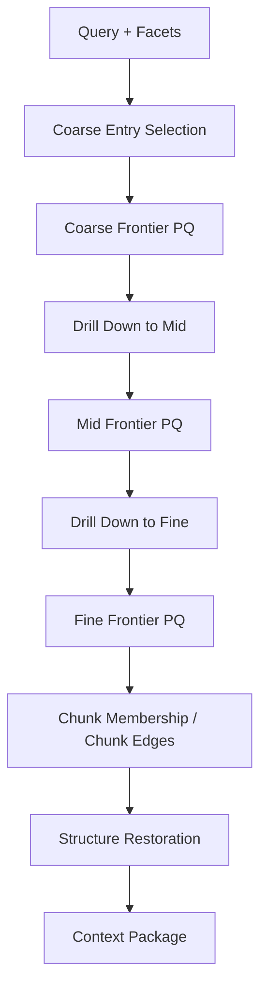


### Entry selection

每层起点选择使用三类信号：语义候选、拓扑先验和 LLM 语义判定。拓扑指标是 prior，不是事实源，也不单独决定入口。

节点候选卡片：

```text
node_id
layer
label
definition_or_summary
support_count
centrality
betweenness
k_core
pagerank_or_closeness
boundary_or_bridge_role
matched_query_facets
```

语义候选：

$$
Sem(v,q)
=
\operatorname{Match}
\left(
facets(q),label(v),definition(v),aliases(v)
\right)
$$

拓扑先验：

$$
Topo(v)
=
\left(
kcore(v),betweenness(v),pagerank(v),bridge(v),boundary(v)
\right)
$$

入口策略按 query intent 选择：

```text
definition / local lookup:
  semantic anchors first; topology only breaks ties.

overview / survey:
  high k-core / PageRank nodes plus semantic anchors.

comparison / relation:
  multiple semantic anchors plus high-betweenness bridge nodes.

multi-hop / synthesis:
  anchors, boundary nodes and bridge nodes are all admitted.
```

LLM 只在入口候选灰区或 query facet 难以映射时裁决，输出 typed action：

```text
select_entry_nodes(layer, node_ids, reason, expected_evidence, budget)
```

### Multi-label priority queue walk

搜索状态是一条路径标签，而不是单个节点：

```text
state = {
  layer,
  node_id,
  path,
  distance_so_far,
  reward_so_far,
  covered_facets,
  evidence_roles,
  depth,
  visit_counts,
  support_refs
}
```

边扩展：

$$
D(P')
=
D(P)+d_e+\operatorname{Penalty}(P,e)
$$

奖励：

$$
R(P')
=
R(P)
+G_{\mathrm{facet}}(P',q)
+G_{\mathrm{evidence}}(P')
+G_{\mathrm{bridge}}(P')
+G_{\mathrm{cycle}}(P')
$$

优先队列排序使用词典序 key，而不是跨信号线性加权：

$$
Key(P)
=
\left(
|Facets(q)\setminus Covered(P)|,
D(P)-R(P),
depth(P),
-|EvidenceRoles(P)|
\right)
$$

队列每次弹出 lexicographic minimum state。这样边字段仍保留为距离，环和桥接路径可以通过 bounded reward 提升，但不会出现全局拍脑袋系数混排。

### Cycle handling and convergence

不使用节点级 visited 禁止环。环可能表示多条路径收敛到同一概念或证据区域，应转化为贡献。系统使用路径级 / label 级 visited 与 dominance pruning。

状态签名：

```text
state_signature =
  (layer, node_id, covered_facets, evidence_roles, depth_bucket, path_edge_type_multiset)
```

同一节点保留 top \(M\) 个非支配 label。若已有 label \(L_a\) 满足：

$$
D(L_a)\le D(L_b),\quad
Covered(L_a)\supseteq Covered(L_b),\quad
Roles(L_a)\supseteq Roles(L_b),\quad
depth(L_a)\le depth(L_b)
$$

则 \(L_b\) 被支配并剪枝。

环奖励递减：

$$
G_{\mathrm{cycle}}(P')
=
\frac{
\log(1+\Delta support(P'))
\cdot
|\Delta edge\_types(P')|
}{
(1+visit(node(P')))^2
}
$$

硬预算保证必停：

```text
max_expansions
max_depth_per_layer
max_labels_per_node
max_edge_reuse
max_cycle_reward_per_path
max_candidate_chunks
max_time_ms
context_package_token_budget
```

算法收敛条件：

```text
frontier_empty
hard_budget_hit
marginal_gain_recent < epsilon
all_required_facets_covered
independent_support_paths >= threshold
evidence_roles_saturated
frontier_best_key worse than accepted evidence margin
context_budget_pressure
```

LLM evaluator 不负责保证终止，只判断 evidence 是否足够回答：

```text
sufficient
need_more_same_node
need_bridge_jump
need_mid_expansion
need_fine_drilldown
need_structure_closure
insufficient_corpus
```

### Duplicate contribution and context de-duplication

重复到达同一节点不重复喂给 LLM，而是增加路径贡献：

```text
node_visit_count
distinct_parent_count
distinct_path_count
distinct_edge_type_count
covered_facets
support_chunk_union
cycle_convergence_score
```

最终 context package 去重粒度：

```text
chunk_id
citation_span
same table / formula / caption closure
same parent section adjacent chunk merge
```

但保留 path summary：

```text
why_selected:
  reached_by_paths
  query_facets
  evidence_roles
  graph_paths
  convergence_score
```

### Retrieval trace

目标 trace 是每层入口、frontier、路径、收敛和去重的审计记录：

$$
\tau_q
=
\left(
Entry_3,Frontier_3,Path_3,
Entry_2,Frontier_2,Path_2,
Entry_1,Frontier_1,Path_1,
C,\mathbf{h},D_{\mathrm{conv}}
\right)
$$

`RetrievalTrace` 保存 query、filters、retrieval mode、各层 hash、runtime settings hash、agent envelope hash、prompt protocol hash、result chunks、concept path、scores 和 diagnostics。

目标 `GraphRetrievalStep` 写入：

```text
coarse / select_entry_nodes
coarse / priority_queue_walk
mid / drill_down_from_coarse
mid / priority_queue_walk
fine / drill_down_from_mid
fine / priority_queue_walk
chunk / recall_chunks_from_membership
chunk / bounded_chunk_edge_expansion
structure / restore_context_package
```

RQ diagnostics 仍保留为 fine entry 和 path evidence：

$$
D_{\mathrm{rq}}(q,c)
=
\left(
path(q),path(c),LCP(q,c),\|r_q-r_c\|,s_{\mathrm{rq}}
\right)
$$

result metadata 与 trace steps 保存 query/candidate RQ path、LCP depth、residual distance、RQ score 和 drift penalty。


**架构影响：**
- 影响对象：搜索页结果、QA/Agent retrieval step、context package、citation payload、reward metrics、policy update 和前端检索轨迹。
- 影响方式：layered retrieval 从加权融合排名改为 coarse/mid/fine/chunk/structure 的路径搜索；trace 必须可回放每个 entry、frontier pop、edge expansion、cycle reward、dominance pruning、收敛判断和 context 去重。
- 传播字段：`retrieval_trace_id`、`graph_retrieval_steps`、`result_chunk_ids`、`concept_path_json`、`frontier_json`、`path_labels_json`、`convergence_json`、`diagnostics_json`、`runtime_settings_hash`。
- 触发条件：query facets、relation/fine/mid/coarse hash、edge distance protocol、traversal budget、agent envelope 或 conversation scope 变化时，graph traversal trace 与 cache key 需要刷新。
- 验收观察点：entry node 选择可解释、frontier expansion count、path convergence score、cycle reward bounded、dominance pruning count、structure restore step、RQ diagnostics、cache hit audit 和 evidence package de-duplication。

## Layered P&E Agent

### 架构图

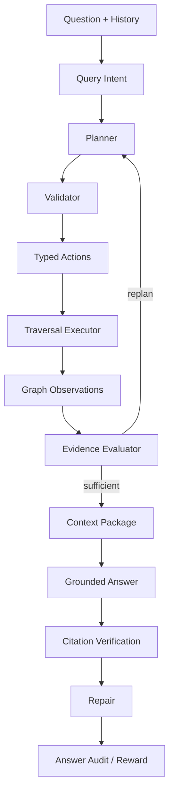

目标上，Agent 可建模为受约束的部分可观测决策过程：

$$
\pi^\star
=
\operatorname*{arg\,max}_{\pi}
\mathbb{E}_{a_t\sim\pi}
\left[
\sum_t r(o_t,a_t)
\right]
$$

约束：

$$
a_t\in\mathcal{A}_{typed},\quad
cost(a_t)\le budget_t,\quad
evidence(a_t)\subseteq \mathcal{G}\cup E
$$

### Query intent

目标 query intent：

$$
z_q
=
g(q,H)
=
(intent,entities,subqueries,needs\_graph)
$$


### Typed action space

action space：

```text
activate_coarse_concepts
route_mid_concepts
route_fine_clusters
select_entry_nodes
walk_graph_frontier
drill_down_layer
follow_ambiguous_edge
recall_chunks
restore_context_package
build_context_package
verify_citations
repair_missing_citation
repair_concept_gap
repair_bridge_gap
repair_formula_context
```

目标 action schema：

$$
a
=
\left(
type,target\_ids,reason,budget,expected\_evidence,stop
\right)
$$

必需 action 集合：

$$
\mathcal{A}_{req}
=
\{select\_entry\_nodes,walk\_graph\_frontier,recall\_chunks,restore\_context\_package,verify\_citations\}
$$

LLM 允许裁决的动作只包括语义入口、临界边和证据充分性：

```text
select_entry_nodes
follow_edge
defer_edge
skip_edge
drill_down
jump_bridge
stop_and_collect_chunks
need_more_evidence
```

LLM 不直接写底层边，不执行数据库检索，不修改边的距离字段。

### Validator

目标 validator：

$$
\operatorname{valid}(a)
=
\mathbf{1}
\left[
type(a)\in\mathcal{A}_{typed}
\land
budget(a)\le B
\land
target(a)\subseteq IDs(\mathcal{G})
\right]
$$


### Operating envelope

目标 envelope：

$$
B
=
\left(
B_{entry},B_{frontier},B_{depth},B_{labels},B_{edge\_reuse},
B_{cycle},B_{drilldown},B_{chunk},B_{restore},
B_{context},B_{plan},B_{repair},B_{verify}
\right)
$$

目标字段：

```text
coarse_entry_budget
mid_entry_budget
fine_entry_budget
frontier_expansion_budget
max_depth_per_layer
max_labels_per_node
max_edge_reuse
max_cycle_reward_per_path
ambiguous_edge_distance_low
ambiguous_edge_distance_high
drilldown_budget_per_layer
chunk_candidate_budget
structure_restore_budget
context_package_token_budget
planning_round_budget
max_typed_actions_per_round
repair_round_budget
verification_budget
allowed_relation_types
required_restore_modes
```


### Execution

目标 P&E loop：

$$
o_t=\operatorname{Execute}(a_t,\mathcal{G},E_t),\quad
a_{t+1}=\pi(q,H,o_{\le t})
$$

目标执行器由 deterministic traversal executor 负责图搜索：

```text
perceive intent and query facets
planner selects layer entry policy
validator checks ids, schema, budget and allowed edge types
executor runs multi-label priority queue walk
executor returns bounded graph observations
LLM evaluator judges evidence sufficiency
if insufficient, planner emits typed repair / expansion action
context package builder deduplicates chunks and restores structure
answer generator uses context package only
citation verifier checks raw spans
```

灰区边裁决：

$$
Ambiguous(e)
=
\mathbf{1}
\left[
d_e\in[\tau_{strong},\tau_{weak}]
\lor edge\_type(e)\in E_{semantic\_uncertain}
\lor crossing\_community(e)
\right]
$$

当 \(Ambiguous(e)=1\) 时，executor 生成 edge packet：

```text
current_query_facet
current_node_card
candidate_neighbor_card
edge_evidence_summary
distance
support_refs
remaining_budget
```

LLM 只能返回 typed edge decision，executor 再执行。


Repair 触发：

$$
\exists v\in V_{\mathrm{verify}}:\ verdict(v)\ne supported
\quad\land\quad
B_{repair}>0
$$

**架构影响：**
- 影响对象：QA 链路、layered retrieval、context package、answer session、citation verification、repair loop、reward event 和 policy state。
- 影响方式：Agent 将用户问题、conversation state 和 graph state 转换为 typed traversal actions；validator 决定哪些动作可执行；executor 用优先队列图搜索返回 observations；LLM evaluator 只判断证据是否足够和灰区边是否值得走。
- 传播字段：`agent_runs`、`agent_plans`、`agent_actions`、`agent_observations`、`retrieval_traces`、`graph_retrieval_steps`、`context_packages`、`answer_sessions`、`citation_verifications`、`reward_events`、`policy_states`。
- 触发条件：intent、operating envelope、typed action schema、edge distance protocol、planner prompt、graph convergence failure、citation failure 或 repair budget 变化时，Agent trace 与 answer audit 需要重新生成。
- 验收观察点：typed action validation pass rate、entry selection accuracy、ambiguous edge decision audit、frontier budget usage、repair success rate、unsupported claim rate 和 reward update 写入。

## Context Package 与引用验证

### Context Package

目标 context package 是受 token budget 约束的证据选择问题：

$$
E^\star
=
\operatorname*{arg\,max}_{E\subseteq \mathcal{N}(P_{\mathrm{accepted}})}
\left[
Rel(E,q)
+Cov(E)
+Struct(E)
+Bridge(E)
-Redundancy(E)
\right]
$$

约束：

$$
\sum_{e\in E} tokens(e)\le B_{ctx}
$$

其中 \(P_{\mathrm{accepted}}\) 是 traversal executor 接受的 coarse/mid/fine/chunk path labels。context package 必须去重 chunk 与 citation span，但保留重复路径带来的贡献摘要：

```text
selected_chunk_ids
citation_spans
structure_closures
graph_path_ids
reached_by_paths
distinct_parent_count
distinct_edge_type_count
cycle_convergence_score
covered_facets
why_selected
```

restoration protocol 是 `previous_next_structure_bridge_v1`。对每个 hit chunk，目标恢复：

```text
hit chunk
previous chunk
next chunk
parent structure node ids
up to 2 bridge-neighbor chunks
```

### Structure context

目标结构上下文：

$$
SC(c)
=
\left(
path(c),parent(c),siblings(c),page(c),region(c)
\right)
$$

`structure_context()` 通过 chunk mappings join structure nodes，按 coverage ratio 与 depth 排序，生成 structure path、node ids、nodes 和 parent section。

### Citation payload

目标 citation：

$$
cite_i
=
\left(
chunk\_id,document\_id,document\_version\_id,
char\_span,page\_range,section\_path
\right)
$$

citation payload 还带 document title、source path、snippet、context package id、retrieval trace id、verification id 和 verification 结果。

### Citation verification

目标上，引用验证近似自然语言蕴含：

$$
verdict(claim,e)
=
\operatorname{NLI}(claim,e)
\in
\{supported,contradicted,insufficient\}
$$

citation verification protocol 使用 `structure_plus_llm_entailment_v1`。结构规则先验证 raw span、document version、chunk id、char span、page range、section path、bbox、context package id、retrieval trace id、formula/table closure 和 bridge/context package 归属；LLM entailment judge 只在 context package 内判断 claim 是否被证据蕴含。verdict：

```text
supported
unsupported
missing_citation
formula_table_context_missing
```


**架构影响：**
- 影响对象：answer generation、citation verification、repair loop、reward metrics、policy update、QA audit 和前端证据包展示。
- 影响方式：context package 是回答生成的唯一证据输入；引用验证把 claim 重新绑定到 raw chunk span，失败时反向触发 repair search、mid expansion、bridge jump 或 formula/table closure。
- 传播字段：`context_package_id`、`retrieval_trace_id`、`chunk_id`、`char_span`、`page_range`、`structure_path`、`citation_verification_id`、`verification_result`。
- 触发条件：hit chunks、structure context、bridge chunks、token budget、answer claim 或 citation span 变化时，context package 与 verification 必须重新生成。
- 验收观察点：restored chunk count、previous/next 覆盖、bridge chunk 覆盖、citation pass rate、missing citation 数量和 formula/table context failure 数量。

## Conversation State

目标 conversation state 是任务约束与历史证据引用的状态：

$$
S_t
=
U(S_{t-1},u_t,a_t,E_t)
$$

其中 \(u_t\) 是用户输入，\(a_t\) 是答案，\(E_t\) 是 context package 引用。它不替代证据：

$$
S_t\not\models fact,\quad E_t\models fact
$$


**架构影响：**
- 影响对象：Query Router、Agent Planner、retrieval filters、context package scope、answer session、prompt protocol 和前端多轮 QA。
- 影响方式：conversation state 保存用户约束、任务状态和历史证据引用，影响下一轮意图识别和检索范围；事实仍只能来自 context package。
- 传播字段：`qa_session_id`、`transcript`、`answer_session_id`、`context_package_id`、`citation_ids`、`conversation_state_scope_hash`、`prompt_protocol_hash`。
- 触发条件：用户新增约束、任务状态变化、引用历史变化、profile prompt preference 变化或 prompt protocol 变化时，planner input 与 cache key 需要更新。
- 验收观察点：active constraints 可见、历史 context package 引用可追溯、自然对话未被硬截断、planner prompt budget 可审计。

## Runtime Settings、Profile 与策略

### Runtime settings

目标运行参数分为三类：

$$
\Theta
=
\Theta_{\mathrm{hot}}
\cup
\Theta_{\mathrm{rebuild}}
\cup
\Theta_{\mathrm{service}}
$$

`Settings` 包含数据库、Qdrant、Redis、ingestion、模型、embedding、worker、chunk、context package、reranker、mid concept、RQ、Agent budget 和 fallback 参数。目标 settings 还必须显式覆盖：

```text
edge_distance_protocol
fine_community_protocol
edge_projection_protocol
entry_selection_budget
frontier_expansion_budget
label_dominance_budget
cycle_reward_cap
ambiguous_edge_thresholds
traversal_observation_budget
context_path_summary_budget
```

其中改变 chunking、embedding、relation graph、fine community、edge projection 或 concept graph 的参数属于 `rebuild_required`；改变 entry/frontier/label/cycle/灰区边预算但不改变 active graph 的参数属于 `hot_reloadable`，需要失效检索与 QA cache。

### Hot refresh

目标 runtime version：

$$
h_{\Theta}
=
H(\Theta,t,\Delta keys)
$$

`publish_runtime_settings_version()` 写 `RuntimeSettingsVersion`，把 hash 写入 Redis，并发布消息：

$$
msg
=
(h_{\Theta},\Delta keys,source,created\_at)
$$

本地刷新会清理 settings cache、cache manager 和 reranker cache。

### Profile

目标 profile 只影响交互层：

$$
profile
\to
(prompt,ui,conversation\ preference)
$$

且：

$$
\frac{\partial G_l}{\partial profile}=0,\quad l\in\{0,1,2,3\}
$$

context package 保存 profile hash，answer prompt 可读取 active profile JSON。Profile 不参与 graph construction 参数。

### Policy

目标策略更新可写作 bandit posterior 更新：

$$
p_{t+1}(a)
=
p_t(a)\cdot
\exp(\eta r_t(a))
$$

策略更新为 proxy update，基于 citation pass、context recall、concept path 和 repair actions 更新 arm prior。Reward metrics：

$$
r
=
\left(
retrieval\_hit,
context\_precision,
context\_recall,
concept\_path,
citation\_pass,
groundedness,
completeness,
repair\_success
\right)
$$

Policy state 不替代 planner，只提供 traversal priors、constraints、safe arms、灰区阈值和 reward summary。


**架构影响：**
- 影响对象：chunking、embedding、BM25、graph build、graph traversal、Agent envelope、verification/repair budget、cache、prompt protocol 和 UI interaction。
- 影响方式：runtime settings 改变工程运行点；profile 只改变交互层；policy 改变动作先验、safe arms、frontier budgets 和灰区阈值，但不替代 planner。
- 传播字段：`runtime_settings_hash`、`agent_operating_envelope_hash`、`policy_state_hash`、`prompt_protocol_hash`、`profile_hash`、Redis runtime version message。
- 触发条件：hot reloadable 参数触发 cache/singleton 刷新；rebuild required 参数触发 candidate settings、dry-run、shadow rebuild 与 promotion；profile 变化只刷新 prompt/UI/conversation cache。
- 验收观察点：runtime version publish、Redis broadcast、settings cache clear、profile 不触发 graph rebuild、policy reward history 与 safe arms 可审计。

## Freshness、缓存与热加载

### Hashes

目标 freshness 由 hash 等式判断：

$$
fresh(layer)
=
\mathbf{1}
\left[
h_{layer}^{stored}=h_{layer}^{current}
\right]
$$

Context graph state 保存 chunk scope、structure、relation、fine、mid、coarse、runtime、agent、policy、prompt protocol、edge distance protocol、edge projection protocol 和 traversal protocol hashes。

### Freshness

目标 stale reasons：

$$
R_{\mathrm{stale}}
=
\{r_i: h_i^{stored}\ne h_i^{current}\}
$$

`ContextGraphFreshness` 保存 layer、state hash、is stale、stale reasons、checked at 和 diagnostics。`context_graph_stats()` 返回 counts、freshness、grounding 和 traversal contribution。

### Cache key

目标 cache key：

$$
key
=
H(
kb,q,filters,h_{emb},h_{chunk},h_0,h_1,h_F,h_2,h_3,
h_{\mathrm{edge}},h_{\mathrm{proj}},h_{\mathrm{trav}},
h_{\Theta},h_{\pi},h_{\mathrm{conv}},h_{prompt},mode
)
$$

其中 \(h_{\mathrm{edge}}\) 是距离协议 hash，\(h_{\mathrm{proj}}\) 是边投影协议 hash，\(h_{\mathrm{trav}}\) 是 traversal executor 与预算 hash，\(h_{\mathrm{conv}}\) 是 conversation state scope hash。retrieval trace 必须保存关键 hash；缓存层必须以 trace 中同源字段构造 key，并补齐 traversal/projection/conversation 维度。


**架构影响：**
- 影响对象：graph stats、search cache、QA cache、context package reuse、front-end freshness display、runtime hot reload 和运维诊断。
- 影响方式：freshness 用 hash 等式判断状态是否可用；cache key 把 query、filters、graph hashes、runtime hashes 与 prompt hashes 合并，防止跨状态误命中。
- 传播字段：`context_graph_freshness`、`chunk_scope_hash`、`structure_graph_hash`、`chunk_relation_hash`、`fine_cluster_hash`、`mid_concept_hash`、`coarse_concept_hash`、`edge_distance_protocol_hash`、`edge_projection_protocol_hash`、`traversal_protocol_hash`、`runtime_settings_hash`、`conversation_state_scope_hash`。
- 触发条件：任何 graph state、edge distance protocol、edge projection protocol、traversal budget、runtime settings、policy state、conversation scope 或 prompt protocol 变化时，相关 cache entry 必须失效或重新标注 stale。
- 验收观察点：stale reasons 完整、hash mismatch 可见、cache hit 带审计信息、hot reload 后检索结果使用新 runtime hash。

## 数据模型

### Chunk 与结构

关系不变量可写作函数依赖：

$$
(document\_version\_id,chunk\_version,chunk\_index)
\to
chunk\_id
$$

目标表：

```text
chunk_versions
chunks
chunk_spans
chunk_coordinates
chunk_context_texts
chunk_structure_nodes
chunk_structure_edges
chunk_structure_mappings
```

### Relation 与 fine cluster

目标关系不变量：

$$
edge\in E_{CC}
\Rightarrow
source,target\in chunks
$$

$$
membership(c,f)
\Rightarrow
c\in chunks,\ f\in fine\_clusters
$$

目标表：

```text
chunk_relation_graph_states
chunk_relation_edges
fine_clusters
fine_cluster_memberships
fine_cluster_edges
```

目标字段闭环：

```text
chunk_relation_edges:
  edge_type
  distance
  raw_strength
  features_json
  source_algorithm
  protocol_version

fine_clusters:
  node_type = fine_seed | fine_meet | fine_join | fine_bridge | rq_prefix
  rq_level
  rq_path_prefix
  diagnostics_json

fine_cluster_memberships:
  membership_score
  membership_role
  residual_norm
  support_chunk_edge_ids

fine_cluster_edges:
  edge_type
  distance
  raw_strength
  support_chunk_ids
  support_chunk_edge_ids
  diagnostics_json
```

目标 relation/fine 不变量：

$$
edge_F(f_a,f_b)
\Rightarrow
|support\_chunk\_edge\_ids(edge_F)|>0
$$

$$
distance(edge)>0,\quad raw\_strength(edge)\in(0,1]
$$

### Concepts

目标 concept 支撑不变量：

$$
\forall m\in V_M,\quad |support(m)|>0
$$

$$
\forall k\in V_K,\quad support(k)=\bigcup_{m\in M_k}support(m)
$$

目标表：

```text
mid_concept_states
mid_concepts
mid_concept_memberships
mid_concept_edges
mid_concept_definitions
coarse_concept_states
coarse_concepts
coarse_concept_memberships
coarse_concept_edges
coarse_concept_definitions
```

目标字段闭环：

```text
mid_concepts:
  support_fine_cluster_ids
  support_chunk_ids
  representative_chunk_ids
  grounding_hash

mid_concept_edges:
  edge_type
  distance
  raw_strength_summary
  support_fine_edge_ids
  support_fine_node_ids
  support_chunk_ids
  diagnostics_json

coarse_concepts:
  included_mid_concept_ids
  bridge_mid_concept_ids
  boundary_mid_concept_ids
  grounding_hash

coarse_concept_edges:
  edge_type
  distance
  raw_strength_summary
  support_mid_edge_ids
  support_fine_edge_ids
  support_chunk_ids
  cross_community_weak_ties
  diagnostics_json
```

目标 concept edge 不变量：

$$
edge_M(m_a,m_b)
\Rightarrow
|support\_fine\_edge\_ids(edge_M)|>0
$$

$$
edge_K(k_a,k_b)
\Rightarrow
|support\_mid\_edge\_ids(edge_K)|>0
$$

### Retrieval、QA、Agent、策略

目标审计链：

$$
retrieval\_trace
\to
context\_package
\to
answer\_session
\to
citation\_verification
\to
reward\_event
\to
policy\_state
$$

目标表：

```text
context_graph_states
context_graph_freshness
vector_records
bm25_records
retrieval_traces
graph_retrieval_steps
context_packages
qa_sessions
answer_sessions
citation_verifications
policy_states
reward_events
prompt_protocol_versions
runtime_settings_versions
agent_runs
agent_trace_events
agent_plans
agent_actions
agent_observations
```

目标 trace 与 package 字段闭环：

```text
retrieval_traces:
  query_facets_json
  entry_nodes_json
  frontier_json
  path_labels_json
  convergence_json
  edge_distance_protocol_hash
  edge_projection_protocol_hash
  traversal_protocol_hash
  conversation_state_scope_hash

graph_retrieval_steps:
  layer
  action_type
  target_ids
  popped_frontier_state
  expanded_edge_ids
  dominance_pruned_count
  cycle_reward
  ambiguous_edge_decisions
  stop_reason

context_packages:
  selected_chunk_ids
  citation_spans
  graph_path_ids
  why_selected_json
  cycle_convergence_score
  dedupe_keys

agent_actions:
  action_type
  target_ids
  expected_evidence
  stop_condition
  budget_request

agent_observations:
  frontier_summary
  evidence_roles
  remaining_budget
  evaluator_verdict
```

目标 retrieval audit 不变量：

$$
context\_package
\Rightarrow
\exists retrieval\_trace:
path\_labels\ne\emptyset
$$

$$
answer\_session
\Rightarrow
\exists context\_package,\exists citation\_verification
$$


**架构影响：**
- 影响对象：所有服务逻辑、API contract、前端类型、脚本输出、测试 fixture、trace audit 和数据迁移。
- 影响方式：数据模型定义跨表不变量；任何链路变更最终都必须落到 id、state、membership、edge projection、trace、frontier、package、verification 或 reward 的可审计记录。
- 传播字段：目标表中的主键、外键、state id、version、hash、status、diagnostics、support edge ids、support chunk ids、span payload、frontier payload 和 trace ids。
- 触发条件：schema migration、字段语义变化、state hash 变化、API response shape 变化或脚本输出变化时，测试、前端类型和验收脚本需要同步更新。
- 验收观察点：外键不悬空、派生状态可重建、trace 可回放、answer audit 可回到 raw span、reward/policy 可回到 verification。

## API、前端与脚本

### API

目标 API 契约是后端状态到前端视图的保真映射：

$$
view
=
F_{\mathrm{api}}(state,trace,package)
$$

并要求：

$$
ids(view)\subseteq ids(database)
$$

routers 覆盖 health、knowledge、ingestion、search、sessions/QA、settings 和 maintenance。Layered search 返回 results、audit 和 trace id；context package 和 retrieval steps 可单独读取。

目标 API 必须能表达新版图导航 payload：

```text
graph payload:
  node counts / sampled counts / freshness / hashes
  fine node_type and membership
  edge distance / raw_strength / support edge ids
  mid/coarse edge projection support

search trace payload:
  query facets
  selected entry nodes
  frontier pops
  expanded edges
  dominance pruning
  cycle reward
  ambiguous edge decisions
  drilldown path
  convergence reason

context package payload:
  selected chunks
  citation spans
  structure closures
  graph path summaries
  why_selected
  dedupe keys
```

### 前端

目标前端展示四类信息：

$$
UI
=
\{Graph,SearchTrace,ContextPackage,AnswerAudit\}
$$

图谱层包括 chunk-structure、chunk-relation、fine/relation communities、mid-concepts、coarse-concepts。每层 payload 需要 counts、sampled counts、freshness、hash、grounding、edge distance distribution、projection support 和 traversal contribution。

搜索页必须展示：

```text
entry node candidates and selected entries
frontier expansion timeline
edge distance and support evidence
dominance pruning count
cycle reward and convergence score
drilldown path coarse -> mid -> fine -> chunk
context package de-duplication result
```

QA/Agent 页必须展示：

```text
typed actions
ambiguous edge decisions
observations
evaluator verdicts
budget usage
repair actions
citation verification
```

### 脚本

脚本目标是可重复运维函数：

$$
S'=
\operatorname{script}(S;\ flags)
$$

若脚本写数据，则必须满足：

$$
write(S')\Rightarrow execute=true
$$

脚本验收必须覆盖 rebuild、reconcile、diagnose、evaluate、quality check 和 docker smoke。输出写入 `output/`。

目标脚本必须补齐新版验收工件：

```text
four_layer_graph_diagnose:
  edge distance distribution
  fine community coverage
  meet/join/bridge node counts
  edge projection support density
  weak tie preservation

retrieval_trace_evaluate:
  entry selection hit
  frontier expansion count
  dominance pruning count
  cycle reward bounded
  convergence reason
  context dedupe rate

agent_trace_evaluate:
  typed action validation
  ambiguous edge decision audit
  evaluator verdict consistency
  repair path coverage
```


**架构影响：**
- 影响对象：后端编排、前端图谱/搜索/QA 页面、运维脚本、smoke check、preproduction check 和用户可见诊断。
- 影响方式：API 把持久状态、edge projection、frontier trace 与 context package 转成前端视图；脚本把同一批状态转成可重复验收报告；前端展示决定问题是否能被定位。
- 传播字段：API response schema、shared types、`retrieval_trace_id`、`context_package_id`、`frontier_json`、`path_labels_json`、`convergence_json`、graph stats payload、script JSON/report fields。
- 触发条件：后端 schema、trace shape、edge projection payload、graph stats、context package payload、settings contract 或脚本参数变化时，前端类型、脚本和测试必须同步更新。
- 验收观察点：typecheck/lint 通过、API contract fixture 对齐、脚本可从仓库根目录执行、报告写入 `output/`、前端能展示四层路径、frontier、edge projection 和证据包。

## 事务、并发与安全

### 事务

目标 ACID 约束：

$$
\operatorname{commit}(T)
\Rightarrow
\operatorname{valid}(I(S_T))
$$

其中 \(I\) 是跨表不变量集合。外部副作用前应先写入意图：

$$
external\_write
\Rightarrow
intent\_logged
$$

恢复链路必须通过 batch/job state、heartbeat、diagnostics、compensation logs 和 reconcile scripts 管理恢复。

### 并发

目标并发控制：

$$
\sum_{i=1}^{n} active_i
\le
B_{\mathrm{resource}}
$$

配置项包括 worker concurrency、model request concurrency、timeout 和 ingestion memory watermarks。长任务应在关键阶段刷新 runtime settings。

### 安全

目标风险函数：

$$
Risk
=
Risk_{\mathrm{path}}
+Risk_{\mathrm{secret}}
+Risk_{\mathrm{fallback}}
+Risk_{\mathrm{payload}}
$$

安全策略是最小化：

$$
\min Risk
\quad
s.t.\quad
fallback=false,\ secret\notin logs,\ path\subset storage\_root
$$

product path 默认 `ENABLE_MODEL_FALLBACK=false`、`ENABLE_DATABASE_FALLBACK=false`。Settings payload 只暴露 key 是否存在，不输出密钥。


**架构影响：**
- 影响对象：ingestion、indexing、graph rebuild、runtime settings publish、QA reward write、Qdrant/BM25/Redis side effects 和 destructive scripts。
- 影响方式：事务边界决定 PostgreSQL 状态是否可提交；补偿记录决定外部副作用失败后如何恢复；并发上限决定导入、检索和模型调用是否稳定。
- 传播字段：job state、batch id、compensation logs、status fields、diagnostics_json、runtime settings version、side-effect payload hash。
- 触发条件：长任务取消、外部写入失败、并发资源耗尽、fallback 开关变化、路径校验失败或密钥状态变化时，流程必须阻断、补偿或降级为可审计错误。
- 验收观察点：半提交状态不存在、补偿记录可重试、destructive flag 明确、fallback 默认关闭、日志不含密钥、路径限制在 storage root 内。

## 测试、诊断与验收

### 测试命令

```powershell
cd apps/api
python -m pytest tests

cd ../..
npm run typecheck --workspace web
npm run lint --workspace web
npm run test --workspace web
python scripts/docker_smoke.py --base-url http://127.0.0.1:8000/api
```

### 代码覆盖重点

测试目标可写作覆盖率约束：

$$
\forall p\in CriticalPaths,\quad
\exists test:\ test(p)=pass
$$

测试重点必须包括 fixed chunking、context graph pipeline、routes and maintenance、db migrations、agent graph、embeddings、ingestion logs 和 runtime settings contract。

### 验收指标

目标验收函数：

$$
Accept
=
\mathbf{1}
\left[
M_{\mathrm{graph}}\ge\tau_g
\land
M_{\mathrm{retrieval}}\ge\tau_r
\land
M_{\mathrm{citation}}\ge\tau_c
\land
M_{\mathrm{runtime}}\ge\tau_s
\right]
$$

指标包括：

```text
chunk count and chunk version
structure mapping coverage
relation edge count by edge_type
relation edge distance distribution
bridge edge count
fine cluster singleton rate
fine community coverage
fine meet / join / bridge node counts
RQ path availability
RQ cluster edge types
edge projection support density
mid concept grounded rate
mid edge support_fine_edge_ids coverage
coarse diagnostics
coarse edge support_mid_edge_ids coverage
context graph freshness
retrieval trace graph steps
entry selection hit rate
frontier expansion count
dominance pruning count
cycle reward boundedness
ambiguous edge decision audit
convergence stop reason distribution
context package restore counts
context package dedupe rate
citation verification pass rate
reward event and policy state write
runtime settings version publish
```

所有生成性验收报告写入 `output/`。


**架构影响：**
- 影响对象：工程交付门禁、CI、本地 Docker 栈、前端类型检查、脚本诊断、benchmark 和真实资料验收。
- 影响方式：测试把架构不变量转成可执行断言；诊断把 graph quality、edge projection quality、traversal quality、citation quality 和 runtime behavior 转成可比较输出。
- 传播字段：pytest result、Vitest result、docker smoke output、diagnostics JSON、benchmark logs、retrieval evaluation report、agent trace report、runtime probe report。
- 触发条件：任何代码、schema、脚本、API、运行参数、edge protocol、traversal protocol 或文档验收边界变化时，对应测试与 `output/` 报告需要更新。
- 验收观察点：关键路径测试通过、edge projection 不断链、frontier trace 可回放、cycle reward 有界、报告时间戳可追踪、失败项有可行动上下文、真实资料采样不进入仓库、`output/` 不提交。

## 核心原则

目标原则可以压缩为一个约束优化问题：

$$
\max_{\pi,E,A}
\left[
Grounded(E)+Coverage(E)+Traceability(E)+AnswerQuality(A)
-Cost(\pi)-Drift(E)
\right]
$$

约束为：

$$
\forall claim\in A,\quad
\exists span\in RawChunks:
support(claim,span)\ge\tau
$$

$$
\forall action\in \pi,\quad
action\in \mathcal{A}_{typed}
\land
budget(action)\le B
$$


**架构影响：**
- 影响对象：技术白皮书、工程计划、代码实现、测试、脚本、前端展示、运行配置和运维验收。
- 影响方式：核心原则约束所有设计取舍；当局部实现与原则冲突时，以可回溯 evidence、typed action、context package、citation verification 和 state hash 为优先边界。
- 传播字段：`chunk_id`、`span`、`state_hash`、`trace_id`、`context_package_id`、`verification_id`、`runtime_settings_hash`、`policy_state_hash`。
- 触发条件：新增检索信号、概念构建方式、Agent 动作、fallback、cache 或 profile/runtime 边界时，必须回到这些原则校验。
- 验收观察点：事实可回源、策略可审计、证据包可验证、设置边界清晰、派生状态可重建。

1. 技术白皮书以目标架构和目标算法为主，任何实现偏差必须进入诊断脚本或执行计划阻断项，不能作为 active 链路的长期例外。
2. Chunk 是稳定地址、索引单位和引用单位，不承担完整语义单元假设。
3. 结构图负责原文地图和上下文恢复。
4. Contextual text 服务 embedding 与 BM25，citation 指向 raw chunk span。
5. Relation graph 由可复算信号构建。
6. Fine clusters 是路由区域，不是事实源。
7. RQ-KMeans 提供残差语义地址、prefix clusters 和 RQ edges。
8. Mid concept 必须由 concept packet、support chunks 和 grounded gate 支撑。
9. Coarse concept 必须由 mid concept community、bridge concepts 和 weak ties 支撑。
10. Layered retrieval 通过入口选择、距离边、优先队列路径搜索、层级下钻和结构恢复完成图导航。
11. Agent 只能在 typed action space 内规划。
12. Validator 必须检查 action、预算和 required actions。
13. Context package 是答案生成的唯一证据包。
14. Citation verification 必须回到 raw source span。
15. Repair loop 由 verification failure 和 repair budget 触发。
16. Conversation state 记录对话和任务状态，不替代证据。
17. Runtime settings 管工程参数，Profile 管交互偏好。
18. Policy 提供 traversal budget、safe arms、动作先验和灰区阈值，不替代 planner。
19. PostgreSQL 是事实源，Qdrant、BM25、Redis 是派生或运行态。
20. 每次检索、回答、验证和 reward 都必须能由 trace、hash 与 id 链路审计。
