## 1. 系统架构

SymboGraph 是一个本地通用智能知识库系统。系统的核心原则是 evidence-first：任何进入持久状态、检索上下文、问答答案、引用验证、质量评价或策略奖励的内容，都必须能追溯到 document version、source span、evidence atom 或 active chunk。LLM 在系统中是测量器、路由辅助器和 grounded answer generator，不是默认事实源或本体构建器。

### 1.1 总体分层

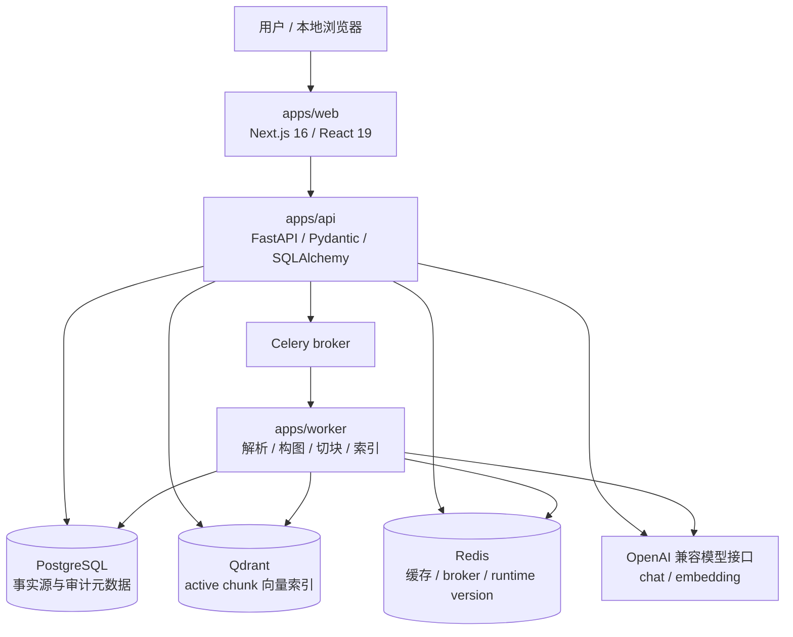

| 层级 | 模块 | 状态属性 | 主要职责 |
| --- | --- | --- | --- |
| Web | 本地知识库 UI、上传、图谱、检索、问答、设置页 | 派生视图 | 发起导入、检索、问答与设置更新，展示证据链和诊断 |
| API | routers、services、schemas、runtime settings | 编排层 | 校验请求、创建任务、同步检索、问答、聚合 dashboard |
| Worker | Celery task、ingestion、evidence graph、vector write | 执行层 | 执行解析、构图、切块、质量门禁、向量写入等长任务 |
| PostgreSQL | SQLAlchemy models、Alembic migrations | 事实源 | 保存证据、版本、质量决策、策略、trace、引用验证 |
| Qdrant | vector collection、point payload | 派生索引 | 提供 active chunk dense recall |
| Redis | broker、runtime version、cache | 运行态派生 | 任务协调、热加载广播、检索缓存 |
| 模型接口 | chat、embedding、measurement prompt | 外部测量器 | 生成 embedding、感知查询、grounded answer、反思诊断 |

### 1.2 主链路

```text
文件解析
-> EvidenceAtom
-> EvidenceEdge
-> EvidenceGraphState
-> ChunkCandidate
-> QualityDecision
-> ChunkDecision
-> ActiveChunk
-> VectorRecord
-> RetrievalTrace
-> AnswerSession
-> CitationVerification
-> RewardEvent
-> PolicyState
```

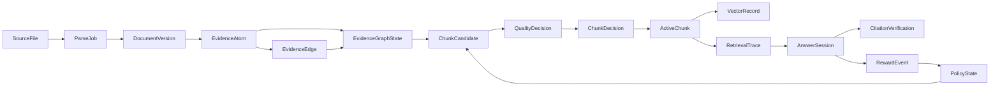

### 1.3 控制面与数据面

数据面负责从文件到问答的证据链路；控制面负责运行时设置、策略状态、prompt 协议、并发预算和缓存失效。两者通过版本 hash 和 Redis 广播连接。

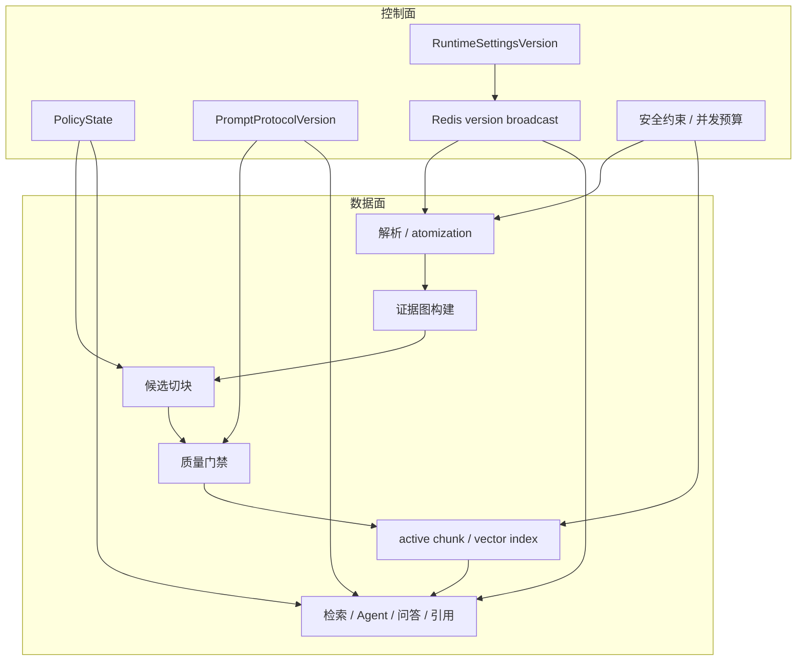

## 2. 数据模型

### 2.1 核心实体关系

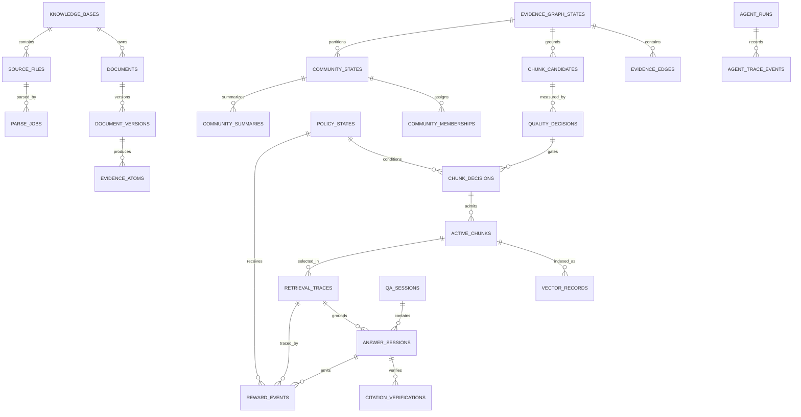

### 2.2 表族

| 表族 | 代表表 | 语义 |
| --- | --- | --- |
| 知识库与文件 | `knowledge_bases`、`source_files`、`documents`、`document_versions`、`parse_jobs` | 文件生命周期、解析版本、来源路径、checksum、解析协议 |
| 证据图 | `evidence_atoms`、`evidence_edges`、`evidence_graph_states` | 最小证据单元、观测边、图状态 hash、active atom scope |
| 信号层 | `signal_schema_states`、`signal_candidates`、`signal_nodes`、`signal_edges` | 从证据中派生的可检索 signal 视图，不替代证据 |
| 切块质量 | `chunk_candidates`、`quality_decisions`、`chunk_decisions`、`active_chunks`、`quality_observations` | 图基座候选、质量门禁、active chunk 提交与质量观测 |
| 社区层 | `community_states`、`community_memberships`、`community_summaries` | evidence graph region layer，用于边界、扩展、摘要和诊断 |
| 检索问答 | `vector_records`、`retrieval_traces`、`answer_sessions`、`citation_verifications` | 向量索引审计、检索轨迹、问答会话、引用验证 |
| Agent | `agent_runs`、`agent_trace_events`、`qa_sessions` | Agent 运行状态、节点轨迹、会话转录 |
| 策略 | `policy_states`、`policy_observations`、`reward_events` | contextual bandit 状态、动作、奖励、漂移诊断 |
| 协议设置 | `prompt_protocol_versions`、`runtime_settings_versions` | prompt pack、运行时设置版本和热加载审计 |

### 2.3 关键不变量

| 不变量 | 形式 | 工程含义 |
| --- | --- | --- |
| active chunk 来源 | `active_chunks.chunk_decision_id` 指向 `chunk_decisions.id` | active chunk 不能绕过候选和质量决策直接写入 |
| 切块绑定图状态 | `chunk_decisions.graph_state_id` 指向 `evidence_graph_states.id` | 切块必须说明基于哪个 evidence graph snapshot |
| 切块绑定质量 | `chunk_decisions.quality_decision_id` 指向 `quality_decisions.id` | 候选进入 active path 必须有 gate 记录 |
| 证据可追溯 | `active_chunks.atom_ids_json` 与 `source_span_union_json` 非空 | 检索和问答必须能定位原文 |
| 向量可修复 | `vector_records.active_chunk_id` 指向 `active_chunks.id` | Qdrant point 可由 PostgreSQL 重建 |
| 引用可验证 | `citation_verifications` 绑定 active chunk、source span 或 evidence atom | answer claim 不能只有自然语言引用 |
| Agent 可审计 | 每次 Agent run 写 `agent_runs` 和 `agent_trace_events` | 节点输入、输出、耗时、路由和错误可回放 |
| 策略闭环 | `reward_events` 绑定 retrieval trace、answer session、active chunks、policy state | 策略更新必须有可审计上下文 |

### 2.4 版本语义

版本号只表示 active chunk 版本范围。知识库保存当前最高 chunk 版本，空库为 0。首次成功解析空库文件创建 v1；全量重解析在已有 active chunks 时创建 current + 1；普通选中解析同步到当前最高版本，不创建新全局版本。

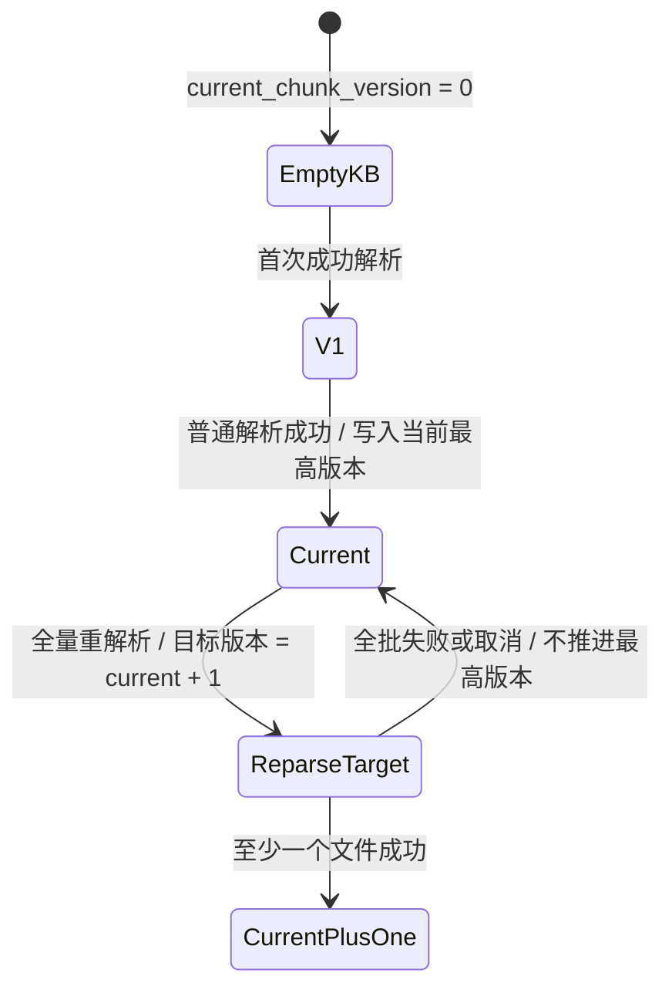

取消不能用 “version minus one” 推断回滚目标。解析阶段取消只回滚解析写入；证据图、切块、向量阶段取消只恢复进入该阶段前的派生状态，并在必要时写补偿记录。

## 3. 解析、构图与切块架构

### 3.1 文件接入与解析

文件接入模块负责后缀 allowlist、路径规范化、storage root containment、checksum、source file 状态与 parse job 状态。解析器把不同类型文件统一转成保守粒度的 evidence atoms。

| atom 类型 | 产生条件 | 追溯字段 |
| --- | --- | --- |
| `heading` | 标题、分节、Markdown heading | source path、line range、page、heading level |
| `paragraph` | 连续正文段落 | char span、line range、page |
| `list_item` | 列表项 | list index、parent heading |
| `table_block` | 表格或近似表格区域 | row span、column span、caption、page |
| `code_block` | fenced code 或缩进代码 | language、line range |
| `formula` | 数学公式或公式段 | source span、display mode |
| `caption` | 图片、表格或图注 | referenced object、page |
| `page_block` | PDF 或幻灯片页级块 | page number、layout box |

EvidenceAtom 的最低字段要求：

```text
EvidenceAtom =
  knowledge_base_id
  document_id
  document_version_id
  atom_index
  atom_type
  text
  text_hash
  source_span_json
  layout_json
  parser_confidence
  metadata_json
  state
```

### 3.2 Evidence Graph

Evidence graph 是观测图，不是本体图。节点是 evidence atom、active chunk、community region 或派生 signal view；边只能表达相邻、包含、布局连续、引用依赖、语义相似、模态连接和话题转折等观测关系。

公式 3.2.1，图状态定义：

$$
G_t=(V_t,E_t,\phi_t,\psi_t)
$$

其中，$V_t$ 表示当前 active evidence atom 集合；$E_t$ 表示观测边集合，边的形式为 $(v_i,v_j,r)$；$\phi_t(v)$ 是 atom 特征函数，包含 atom type、text length、source span、layout box、heading path 和 embedding audit；$\psi_t(e)$ 是边特征函数，包含 edge type、weight、confidence、evidence source 和 protocol version。

允许的边类型：

| 边类型 | 解释 |
| --- | --- |
| `adjacency` | 文档顺序相邻 |
| `contains` | 标题、页面或布局块包含子 atom |
| `layout_continuity` | PDF、PPT 或页面布局连续 |
| `citation_dependency` | 某段文本依赖表格、公式、图注或引用 |
| `semantic_similarity` | embedding 或测量模型支持的相似性 |
| `modality_link` | 文本与表格、图像、代码等跨模态连接 |
| `discourse_shift` | 话题切换、反例、转折或新小节 |

公式 3.2.2，边权组合：

$$
w_{ij}^{(r)}
=\alpha_r s_{\mathrm{order}}(i,j)
+\beta_r s_{\mathrm{layout}}(i,j)
+\gamma_r s_{\mathrm{semantic}}(i,j)
+\delta_r s_{\mathrm{dependency}}(i,j)
$$

权重系数由 edge protocol version 和 policy state 管理。系数不是领域知识，也不能把课程、章节或作业之类语义写成系统事实。

公式 3.2.3，图状态 hash：

$$
h(G_t)=H\!\left(
\operatorname{sort}(\mathcal{D}_t),
\operatorname{sort}(V_t),
\nu_{\mathrm{edge}},
\nu_{\mathrm{parser}},
\nu_{\mathrm{embed}},
h_{\mathrm{community}},
h_{\mathrm{policy}},
h_{\mathrm{prompt}}
\right)
$$

其中，$\mathcal{D}_t$ 是 active document versions，$V_t$ 是 active atom scope，$\nu$ 表示对应协议版本，$h_{\mathrm{community}}$、$h_{\mathrm{policy}}$ 和 $h_{\mathrm{prompt}}$ 分别表示社区、策略和 prompt 协议状态 hash。

该 hash 用于缓存失效、freshness 检查、检索 trace 和问答审计。

### 3.3 图基座切块

SymboGraph 不采用“先固定长度切块，再补图”的主链路。系统先形成 evidence graph，再从图结构、社区边界、依赖闭包、布局完整性和策略状态共同产生 chunk candidates。

公式 3.3.1，候选生成器集合：

$$
\mathcal{C}
=\mathcal{C}_{\mathrm{layout}}
\cup\mathcal{C}_{\mathrm{heading}}
\cup\mathcal{C}_{\mathrm{semantic}}
\cup\mathcal{C}_{\mathrm{dependency}}
\cup\mathcal{C}_{\mathrm{community}}
\cup\mathcal{C}_{\mathrm{parent}}
\cup\mathcal{C}_{\mathrm{repair}}
\cup\mathcal{C}_{\mathrm{structure}}
$$

每个候选包含：

```text
ChunkCandidate =
  graph_state_id
  atom_ids
  source_span_union
  candidate_text
  generator_name
  generator_version
  graph_features_json
  cost_estimate_json
```

公式 3.3.2，候选效用：

$$
U(c\mid G_t,p_t)
=\lambda_1\operatorname{Coh}(c)
+\lambda_2\operatorname{Cov}(c)
+\lambda_3\operatorname{Dep}(c)
+\lambda_4\operatorname{Com}(c)
-\lambda_5\operatorname{Cost}(c)
-\lambda_6\operatorname{Risk}(c)
$$

公式 3.3.3，硬约束：

$$
\begin{aligned}
\operatorname{Tokens}(c)&\le B_{\mathrm{token}}(p_t)\\
\operatorname{Span}(c)&\ne\varnothing\\
\operatorname{Atoms}(c)&\subseteq V_t\\
\operatorname{Closure}_{\mathrm{dep}}(c)&\subseteq c\cup\operatorname{Context}(c)\\
\operatorname{Integrity}_{\mathrm{structure}}(c)&=1
\end{aligned}
$$

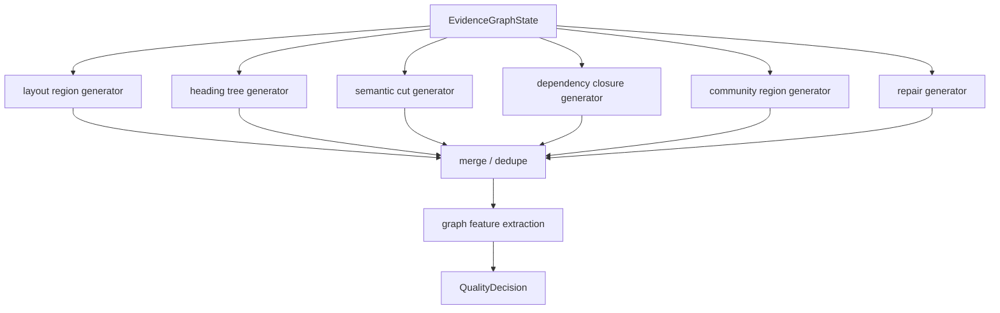

### 3.4 质量门禁

`QualityDecision` 不只是分数。它同时输出 gate、reward 和 feedback。

| 职责 | 字段 | 说明 |
| --- | --- | --- |
| gate | `gate_passed`、`decision_action`、`risk_flags_json` | 决定候选是否能进入 active chunks |
| reward | `diagnostics_json` 或 reward features | 为 policy update 提供反馈 |
| feedback | `feedback_json` | 指导下一轮候选生成、上下文补全、社区扩展或预算调整 |

公式 3.4.1，硬门禁：

$$
\operatorname{admit}(c)=
I_{\mathrm{span}}(c)
\land I_{\mathrm{docver}}(c)
\land I_{\mathrm{atom}}(c)
\land I_{\mathrm{structure}}(c)
\land I_{\mathrm{closure}}(c)
\land I_{\mathrm{budget}}(c)
\land I_{\mathrm{trace}}(c)
$$

公式 3.4.2，软质量分：

$$
Q(c)=
\theta_1 q_{\mathrm{coherence}}
+\theta_2 q_{\mathrm{coverage}}
+\theta_3 q_{\mathrm{grounding}}
+\theta_4 q_{\mathrm{retrievability}}
+\theta_5 q_{\mathrm{community}}
-\theta_6 q_{\mathrm{latency}}
-\theta_7 q_{\mathrm{token}}
-\theta_8 q_{\mathrm{risk}}
$$

公式 3.4.3，动作选择：

$$
\operatorname{action}(c)=
\begin{cases}
\mathrm{admit}, & \operatorname{admit}(c)=1\land Q(c)\ge\tau_{\mathrm{admit}}\\
\mathrm{repair}, & \operatorname{admit}(c)=0\land \operatorname{repairable}(c)=1\\
\mathrm{reject}, & \mathrm{otherwise}
\end{cases}
$$

### 3.5 Active Chunk 与向量索引

Active chunk 是检索和问答的最小持久上下文单位。它必须来自 `ChunkDecision`，并且必须保存 atom ids、source span union、graph state hash、quality decision id、policy state id、boundary policy version 和 community ids。

| 字段 | 作用 |
| --- | --- |
| `chunk_decision_id` | 回溯候选采纳决策 |
| `atom_ids_json` | 回溯 evidence atoms |
| `source_span_union_json` | 定位原文 |
| `graph_state_hash` | 对齐图状态 |
| `boundary_policy_version` | 对齐切块策略版本 |
| `quality_decision_id` | 对齐质量门禁 |
| `policy_state_id` | 对齐策略状态 |
| `community_ids_json` | 对齐社区区域 |
| `metadata_json` | 保存 document、partition、section、page、chunk_version 等派生元数据 |

Qdrant point payload 是派生索引。`VectorRecord` 记录 point id、embedding model、embedding text version、payload hash 和状态，因此索引丢失时可由 PostgreSQL 修复。

### 3.6 社区层

社区层是 evidence graph 的 region layer，不是本体层。它用于切块边界、上下文补全、检索扩展、摘要视图和诊断。

公式 3.6.1，模块度直观定义：

$$
Q_{\mathrm{mod}}
=\frac{1}{2m}
\sum_{i,j}
\left(
A_{ij}-\frac{k_i k_j}{2m}
\right)
\mathbf{1}[g_i=g_j]
$$

其中，$A_{ij}$ 是节点 $i$ 与 $j$ 的边权，$k_i$ 与 $k_j$ 是加权度，$m$ 是总边权的一半，$g_i$ 是节点 $i$ 所属社区。

模块度只衡量 region quality，不产生事实。`CommunitySummary` 必须带 citations，且不能作为问答事实源。问答引用必须回到 active chunk、evidence atom 或 source span。

## 4. 检索与问答架构

### 4.1 Evidence-first 检索

检索不只做 top-k 向量相似度。系统同时使用 dense recall、lexical recall、graph neighborhood expansion、community expansion、signal expansion、rerank 和 context assembly。

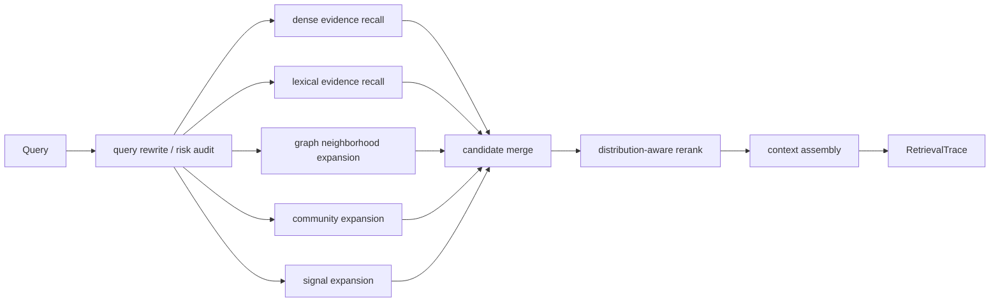

公式 4.1.1，检索候选分：

$$
S(q,c)=
\omega_d\operatorname{sim}_{\mathrm{embed}}(q,c)
+\omega_l\operatorname{Lex}(q,c)
+\omega_g\operatorname{GraphProx}(q,c)
+\omega_c\operatorname{Community}(q,c)
+\omega_s\operatorname{Signal}(q,c)
-\omega_r\operatorname{Risk}(q,c)
-\omega_b\operatorname{BudgetCost}(c)
$$

`top_k` 只表示显示偏好。真正候选预算由 policy state、query uncertainty、语料规模、延迟预算、token 预算和 profile objective 共同决定。

### 4.2 Context Assembly

检索上下文是 active chunks 的有序集合。上下文组装目标不是最大化相似度，而是在 token 预算内最大化证据覆盖、引用闭包、上下文多样性和回答可用性。

公式 4.2.1，上下文效用：

$$
U(K_q\mid q)=
\sum_{c_i\in K_q}S(q,c_i)
+\rho\,\operatorname{Diversity}(K_q)
+\mu\,\operatorname{Closure}(K_q)
-\nu\,\operatorname{Tokens}(K_q)
-\xi\,\operatorname{Redundancy}(K_q)
$$

硬约束：

$$
\begin{aligned}
\operatorname{Tokens}(K_q)&\le B_{\mathrm{answer}}\\
\forall c_i\in K_q,\quad c_i&\in\mathcal{A}_{\mathrm{chunk}}\\
\operatorname{CitationClosure}(K_q)&=1\\
\forall c_i\in K_q,\quad \operatorname{Traceable}(c_i)&=1
\end{aligned}
$$

### 4.3 问答与引用验证

问答模块只允许 grounded answer。Prompt 必须保留 active chunk id、atom ids、source span 和 document metadata。答案中的 claim 必须绑定 citations。

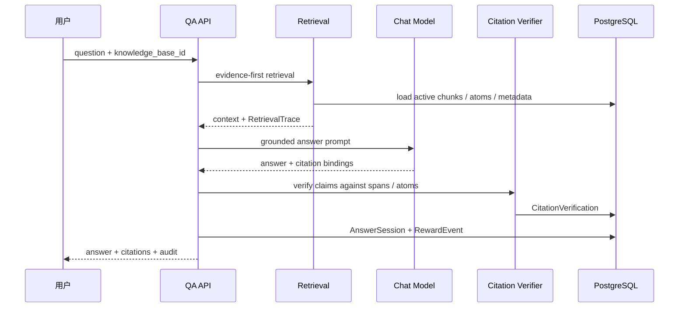

公式 4.3.1，引用验证：

$$
\operatorname{verify}(a_k,e_j)=
\mathbf{1}\!\left[
\operatorname{Entail}(e_j,a_k)\ge\tau_e
\land \operatorname{Span}(e_j)\ne\varnothing
\land e_j\in\mathcal{E}_{\mathrm{active}}
\right]
$$

公式 4.3.2，答案 groundedness：

$$
\operatorname{Groundedness}(A)=
\frac{1}{|\operatorname{Claims}(A)|}
\sum_{a_k\in\operatorname{Claims}(A)}
\max_{e_j\in\operatorname{Evidence}(A)}
\operatorname{verify}(a_k,e_j)
$$

当 groundedness 低于阈值时，系统应触发反思、纠错、更保守回答或证据不足提示，而不是输出无引用结论。

## 5. Agent 链路架构

### 5.1 Agent 的定位

Agent 链路是检索问答的控制器。它不替代 evidence-first retrieval，也不绕过质量门禁。Agent 负责：

1. 感知用户意图、语言、实体和是否需要多跳检索。
2. 选择路由：直接回答、澄清、检索来源、检索任务、混合检索或多跳研究。
3. 规划检索参数和图扩展深度。
4. 选择 evidence anchors，规划 evidence chain。
5. 受控地调用 graph、signal、community 扩展。
6. 评估证据充分性，必要时重试。
7. 生成 grounded answer。
8. 检查引用、执行反思、纠错并写入审计和奖励。

### 5.2 Agent 状态

Agent 运行状态由 `AgentState` 承载，并通过 `AgentRun` 与 `AgentTraceEvent` 持久化关键节点。

| 状态字段 | 含义 |
| --- | --- |
| `run_id`、`session_id`、`knowledge_base_id` | 运行、会话和知识库标识 |
| `question`、`history`、`filters`、`top_k` | 用户输入与检索偏好 |
| `route` | 当前路由 |
| `perception_result` | 意图、实体、子问题、seed atoms、社区提示 |
| `retrieval_strategy`、`retrieval_params` | 检索策略和预算 |
| `base_documents` | 初始 evidence-first 检索结果 |
| `evidence_anchors` | 被选中的证据锚点 |
| `evidence_chain_plan` | 多跳证据链规划 |
| `signal_projection_plan` | signal layer 路径规划 |
| `graph_enhanced_documents` | 图扩展后的文档候选 |
| `evidence_assembly` | 证据组装诊断 |
| `graded_documents` | 评分后的上下文文档 |
| `evidence_evaluation` | 证据充分性判断 |
| `context` | 生成答案前的上下文 |
| `answer`、`citations` | 输出答案和引用 |
| `reflection_result` | 反思发现的问题 |
| `retry_count` | 重试次数 |

### 5.3 Agent 节点图

当前实现使用 LangGraph 的 `StateGraph`。主路径如下：

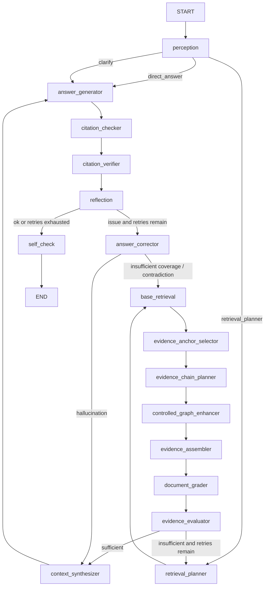

兼容节点仍存在，例如 `query_analyzer`、`router`、`query_rewriter`、`retrieval_decision`、`retry_planner`，但 active 新路径以 perception、retrieval planner、evidence anchor、chain planner、controlled enhancer、evidence evaluator 为核心。

### 5.4 路由策略

Agent route 是对用户意图的可审计分类，而不是对事实的判断。

| route | 触发条件 | 行为 |
| --- | --- | --- |
| `direct_answer` | 问候、能力询问、帮助类问题 | 不检索或最小检索，返回系统能力说明 |
| `clarify` | 指代不明、信息不足 | 请求用户补充来源、分区、对象或比较目标 |
| `retrieve_sources` | 定义、来源、资料、分区等证据查询 | 偏向原文证据和 source path |
| `retrieve_tasks` | 任务、练习、问题、操作类查询 | 偏向任务型片段和过程性证据 |
| `retrieve_both` | 默认混合查询 | 同时保留来源证据和任务证据 |
| `multi_hop_research` | 比较、关系、推导、证明、连接类问题 | 启用 evidence chain 和 graph expansion |

公式 5.4.1，路由选择的可解释形式：

$$
r(q)=
\begin{cases}
r_{\mathrm{direct}}, & g_{\mathrm{greeting}}(q)=1\\
r_{\mathrm{clarify}}, & g_{\mathrm{ambiguous}}(q)=1\\
r_{\mathrm{multi}}, & g_{\mathrm{multihop}}(q)=1\\
r_{\mathrm{task}}, & g_{\mathrm{task}}(q,p)=1\\
r_{\mathrm{source}}, & g_{\mathrm{source}}(q,p)=1\\
r_{\mathrm{both}}, & \mathrm{otherwise}
\end{cases}
$$

### 5.5 Agent 节点职责

| 节点 | 输入 | 输出 | 不变量 |
| --- | --- | --- | --- |
| `perception` | question、history、knowledge base | intent、entities、sub queries、seed atoms、route | LLM 感知结果只能作为诊断和检索提示，不能成为事实 |
| `retrieval_planner` | perception、route、policy hints | retrieval strategy、params、query uncertainty | 预算必须有上限 |
| `base_retrieval` | query、filters、route、params | base documents、retrieval audit | 只返回 active chunk 派生结果 |
| `evidence_anchor_selector` | base documents | anchors | anchors 必须绑定 active chunk 或 evidence atom |
| `evidence_chain_planner` | anchors、query | evidence chain plan、signal path plan | 多跳路径必须可回溯 |
| `controlled_graph_enhancer` | chain plan、base docs | graph enhanced documents | 图扩展受预算和风险约束 |
| `evidence_assembler` | base + graph docs | evidence assembly | 上下文必须保留 citation metadata |
| `document_grader` | assembled docs | graded documents | 分数进入 diagnostics，不替代引用 |
| `evidence_evaluator` | graded docs、question | sufficient、coverage、risk | 不足时优先重试或保守回答 |
| `context_synthesizer` | graded docs | context | 上下文不能丢失 source span |
| `answer_generator` | context、route、question | answer、citations、model audit | 答案必须 grounded |
| `citation_checker` | answer、citations | citation diagnostics | 缺 citation 不能伪造通过 |
| `citation_verifier` | citations、chunks、atoms | verification verdicts | 写入 `CitationVerification` |
| `reflection` | answer、citations、graded docs | issue type、suggestion | 反思只能产生诊断或纠错动作 |
| `answer_corrector` | issue、state | updated docs 或 updated context | 纠错仍必须回到 evidence |
| `self_check` | final state | completed run | 写终态和 trace |

### 5.6 Agent 审计链路

每个节点通过 `AgentTraceEvent` 记录：

```text
AgentTraceEvent =
  run_id
  node
  status
  input_summary
  output_summary
  document_ids
  scores
  duration_ms
  error_message
  created_at
```

最终答案通过 `record_answer_audit` 进入：

```text
AnswerSession
CitationVerification
RewardEvent
PolicyState update
```

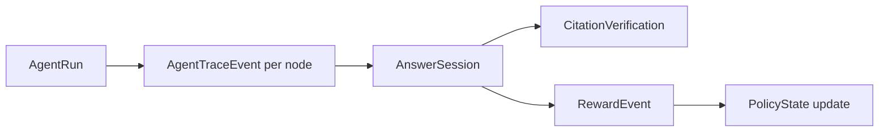

## 6. Agent 理论基础

### 6.1 Agent 是证据约束下的有限状态控制器

Agent 可以建模为一个带审计的有限状态控制器。它在每个节点读取当前状态，执行一个受约束动作，并写回新的状态。

公式 6.1.1，Agent 状态转移：

$$
s_{t+1}=f_n(s_t,\mathcal{E}_t,\rho_t,p_t)
$$

约束：

$$
\operatorname{DurableWrites}(f_n)
\subseteq
\operatorname{BoundedBy}(\mathcal{E}_{\mathrm{active}})
\cup
\operatorname{Diagnostics}
$$

### 6.2 Perception 的理论角色

Perception 不是实体抽取事实库，而是意图测量器。它的输出只影响检索路径、预算、子问题拆分和 seed evidence 搜索。

公式 6.2.1，感知结果：

$$
\operatorname{Perception}(q,h)
=\left(
i,\mathcal{M},\mathcal{Q}_{\mathrm{sub}},
g_{\mathrm{graph}},\sigma
\right)
$$

其中，$i$ 是意图，$\mathcal{M}$ 是提及对象集合，$\mathcal{Q}_{\mathrm{sub}}$ 是子问题集合，$g_{\mathrm{graph}}$ 表示是否需要图扩展，$\sigma$ 是建议检索策略。

采用该设计的原因是：LLM 对实体和意图的判断可能错误，但只要它不直接进入事实层，错误会被 retrieval、evidence evaluator、citation verifier 和 reflection 后续节点拦截。

### 6.3 Evidence Anchor 与 Chain Planning

多跳问题的核心不是让 LLM 自由推理，而是先选择证据锚点，再在 evidence graph 上规划受控路径。

公式 6.3.1，锚点选择：

$$
A(a\mid q)=
\lambda_q\operatorname{Match}(q,a)
+\lambda_c\operatorname{CitationQuality}(a)
+\lambda_g\operatorname{Centrality}(a)
+\lambda_m\operatorname{CommunityRel}(q,a)
-\lambda_r\operatorname{Risk}(a)
$$

公式 6.3.2，证据链效用：

$$
U(P\mid q)=
\sum_{e\in P}w(e)
+\eta_1\operatorname{AspectCoverage}(P,q)
+\eta_2\operatorname{CitationClosure}(P)
-\eta_3|P|
-\eta_4\operatorname{Uncertainty}(P)
$$

硬约束：

$$
\begin{aligned}
\operatorname{start}(P)&\in\mathcal{A}_{\mathrm{anchor}}\\
\operatorname{nodes}(P)&\subseteq\mathcal{E}_{\mathrm{active}}\cup\mathcal{D}_{\mathrm{derived}}\\
|P|&\le L_{\max}\\
\operatorname{CommunityBudget}(P)&\le B_{\mathrm{community}}\\
\operatorname{Traceable}(P)&=1
\end{aligned}
$$

### 6.4 Evidence Evaluator

Evidence evaluator 在生成答案前判断上下文是否足够。它避免系统在证据不足时直接生成答案。

公式 6.4.1，证据充分性：

$$
\operatorname{Sufficient}(K_q)=
\mathbf{1}\!\left[
\operatorname{Coverage}(K_q)\ge\tau_{\mathrm{cov}}
\land \operatorname{Grounding}(K_q)\ge\tau_{\mathrm{ground}}
\land \operatorname{ContradictionRisk}(K_q)\le\tau_{\mathrm{contra}}
\land \operatorname{CitationClosure}(K_q)=1
\right]
$$

当 `evidence_sufficient` 为 false 且 `retry_count` 未超过上限时，Agent 回到 retrieval planner；否则进入 context synthesizer，但 answer generator 必须更保守地表达证据不足。

### 6.5 Reflection 与 Answer Correction

Reflection 是生成后的风险测量，不是自由改写器。它识别三类主要问题：

| issue type | 含义 | 纠错路径 |
| --- | --- | --- |
| `hallucination` | 答案包含证据未支持的 claim | 回到 context synthesizer，基于已有证据重写 |
| `insufficient_coverage` | 上下文覆盖不足 | 回到 base retrieval 或 retrieval planner |
| `contradiction` | 上下文或答案存在冲突 | 回到 base retrieval，寻找更多证据或保守回答 |

公式 6.5.1，反思路由：

$$
\operatorname{next}(z,r)=
\begin{cases}
\mathrm{self\_check}, & z_{\mathrm{issue}}=0\\
\mathrm{self\_check}, & r\ge r_{\max}\\
\mathrm{context\_synthesizer}, & z_{\mathrm{type}}=\mathrm{hallucination}\\
\mathrm{base\_retrieval}, & \mathrm{otherwise}
\end{cases}
$$

### 6.6 Agent Reward

Agent 的最终输出会写入 `RewardEvent`，用于策略更新。奖励不是用户满意度单项指标，而是检索、引用、答案和成本的组合。

公式 6.6.1，Agent reward：

$$
r_t=
\eta_1\operatorname{Hit}
+\eta_2\operatorname{Precision}_{\mathrm{ctx}}
+\eta_3\operatorname{Recall}_{\mathrm{ctx}}
+\eta_4\operatorname{CitationUse}
+\eta_5\operatorname{Groundedness}
+\eta_6\operatorname{Completeness}
+\eta_7\operatorname{RerankGain}
-\eta_8\operatorname{LatencyCost}
-\eta_9\operatorname{TokenCost}
-\eta_{10}\operatorname{RechunkRate}
+\eta_{11}\operatorname{UserAcceptance}
$$

该 reward 绑定 retrieval trace、answer session、active chunks 和 policy state，因此可用于 contextual bandit 更新和离线回放。

## 7. 策略与概率算法

### 7.1 Policy State

在线策略不使用固定 HPO 最优参数作为 active path。系统使用 policy state 表示可解释 operating point。

| arm | 行为 |
| --- | --- |
| `atomic_parent_context` | 保留 atom 的父级上下文 |
| `community_region` | 优先社区区域边界 |
| `heading_preserving` | 保持标题树完整 |
| `semantic_cut` | 根据语义转折切分 |
| `high_recall_overlap` | 增大重叠以提升 recall |
| `low_overlap_precise` | 降低重叠以提升 precision 和延迟 |
| `table_code_preserving` | 强制保持表格、代码、公式完整 |

公式 7.1.1，策略上下文：

$$
x_t=
\left[
n_{\mathrm{kb}},
d_{\mathrm{type}},
\rho_{\mathrm{graph}},
Q_{\mathrm{mod}},
\rho_{\mathrm{cite}},
\mu_{\mathrm{query}},
\epsilon_{\mathrm{retrieval}},
\pi_{\mathrm{cite}},
B_{\mathrm{latency}},
B_{\mathrm{token}},
h_{\mathrm{profile}}
\right]
$$

### 7.2 Constrained LinUCB

公式 7.2.1，arm 分数：

$$
p_{t,a}
=\hat{\theta}_a^\top x_t
+\alpha\sqrt{x_t^\top A_a^{-1}x_t}
$$

公式 7.2.2，安全选择：

$$
a_t=
\arg\max_{a\in\mathcal{A}_{\mathrm{safe}}}
p_{t,a}
$$

公式 7.2.3，线性估计更新：

$$
\begin{aligned}
A_a&\leftarrow A_a+x_t x_t^\top\\
b_a&\leftarrow b_a+r_t x_t\\
\hat{\theta}_a&\leftarrow A_a^{-1}b_a
\end{aligned}
$$

安全约束来自 runtime settings、质量门禁、延迟预算、token 预算和 fallback policy。任何 arm 都不能绕过 evidence-first gate。

### 7.3 离线回放

在线探索有风险，因此新策略进入 active path 前应经过 offline replay。

公式 7.3.1，逆倾向估计：

$$
\hat{V}_{\mathrm{IPS}}(\pi)=
\frac{1}{N}
\sum_{t=1}^{N}
\frac{\pi(a_t\mid x_t)}
{\pi_0(a_t\mid x_t)}
r_t
$$

公式 7.3.2，裁剪逆倾向估计：

$$
\hat{V}_{\mathrm{CIPS}}(\pi)=
\frac{1}{N}
\sum_{t=1}^{N}
\min\!\left(
\frac{\pi(a_t\mid x_t)}
{\pi_0(a_t\mid x_t)},
M
\right)
r_t
$$

只有当离线回放同时满足检索质量、引用质量、延迟、资源占用、失败率和奖励分布约束时，新策略才可进入 safe arms。

## 8. Prompt Protocol 与模型边界

Prompt pack 至少覆盖：

| prompt pack | 用途 | 持久化要求 |
| --- | --- | --- |
| atom context | 描述 atom 局部上下文 | 输出必须引用 atom ids |
| edge observation | 评估观测关系 | 输出必须绑定 source atom 和 target atom |
| chunk quality measurement | 质量测量 | 输出进入 diagnostics 或 quality decision |
| community summary | 社区摘要 | 必须带 citations |
| answer grounding | 生成答案 | 必须返回 citation bindings |
| citation verification | 验证 claim | 必须返回 verdict 和 source span |
| query rewrite | 改写查询 | 不得改变 evidence scope |
| reflection | 反思答案风险 | 不得创建无证据事实 |

公式 8.1，LLM 输出采纳条件：

$$
\operatorname{adopt}(y)=
\mathbf{1}\!\left[
B(y)\ne\varnothing
\land B(y)\subseteq\mathcal{E}_{\mathrm{active}}
\land \nu_{\mathrm{prompt}}(y)\ne\varnothing
\right]
$$

未绑定证据的 LLM 输出只能作为 diagnostics，不能进入 durable state。

## 9. 缓存、热加载与一致性

### 9.1 检索缓存

公式 9.1.1，检索缓存 key：

$$
\operatorname{CacheKey}
=H\!\left(
k_{\mathrm{kb}},
q,
F,
m_{\mathrm{embed}},
\nu_{\mathrm{embed}},
h_{\mathrm{chunk}},
h_{\mathrm{graph}},
h_{\mathrm{community}},
h_{\mathrm{policy}},
h_{\mathrm{prompt}},
\mu_{\mathrm{retrieval}}
\right)
$$

active chunk scope、evidence graph state、community state、policy state 或 prompt protocol 任一变化都必须导致缓存失效。

### 9.2 运行时设置热加载

设置页保存后，API 写共享 `.env`，清理进程内单例，并通过 Redis 发布 runtime settings version。API 和 Worker 在任务边界刷新配置；长任务进入关键阶段前也检查版本。

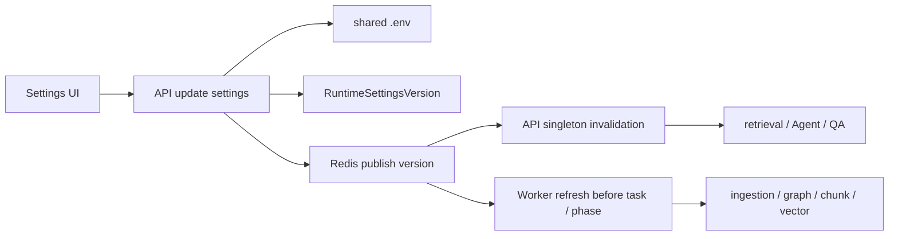

不得缓存 API key、Authorization header 或 provider 原始响应。runtime check 只能报告凭据是否存在、是否同步和阻断项。

### 9.3 ACID 与外部副作用

PostgreSQL 是事实源。外部副作用之前应先保存可恢复意图或状态。Qdrant upsert 失败不能被吞掉，必须写 diagnostics 或 compensation log。

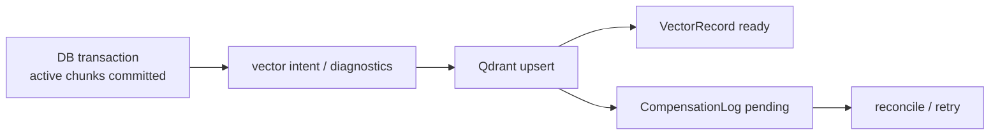

Freshness 必须发现 active atom 集合变化、edge 指向 inactive atom、community state 与 graph state 不一致、policy state 与 active graph 不一致、vector payload hash 过期、prompt protocol 变化和 embedding text version 变化。

## 10. 端到端工作机制

### 10.1 导入到 active chunk

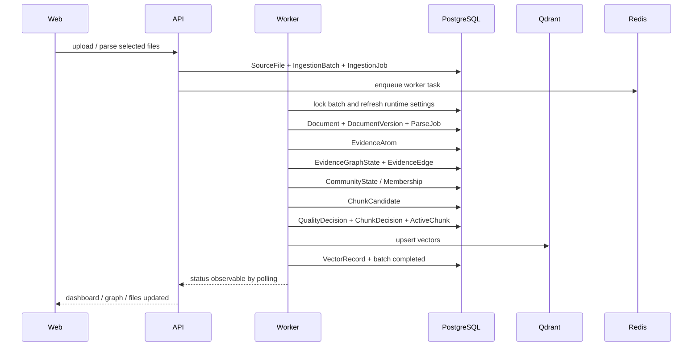

| 阶段 | 原子写入 | 外部副作用 | 补偿 |
| --- | --- | --- | --- |
| 解析提交 | document、version、atoms、parse job | 无 | 取消时恢复解析前 active scope |
| 图构建提交 | graph state、edges、community state | 无 | graph state 置 inactive 或重建 |
| 切块提交 | candidates、quality、decisions、active chunks | 无 | active chunks 状态回滚 |
| 向量索引 | vector records、diagnostics | Qdrant upsert | compensation log + reconcile |

### 10.2 Agent 检索问答

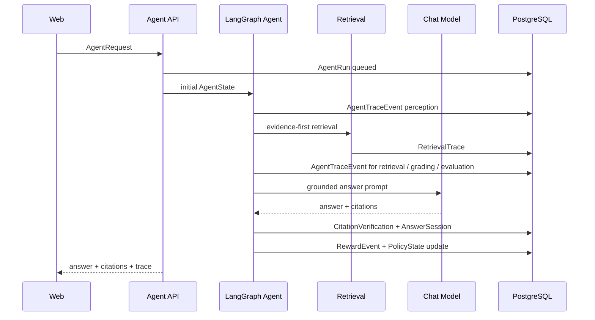

## 11. 并发、恢复与失败语义

### 11.1 并发模型

| 资源 | 控制方式 |
| --- | --- |
| 文件解析 | `INGESTION_FILE_CONCURRENCY` |
| 模型请求 | `MODEL_REQUEST_CONCURRENCY` semaphore |
| Worker | Celery worker concurrency |
| 向量 upsert | 批大小和超时 |
| 社区检测 | 任务级限流 |
| Agent stream | bounded async queue and trace replay |
| 策略更新 | policy state 行锁或等价互斥 |

禁止无界 gather、无界线程池或无限 Celery fan-out。

### 11.2 默认禁用 fallback

默认配置：

```text
ENABLE_MODEL_FALLBACK=false
ENABLE_DATABASE_FALLBACK=false
```

关键依赖不可用时应快速失败，并给出可行动错误上下文。正常运行路径禁止零向量、fake embedding、JSON 检索 fallback 和抽取式回答 fallback。

### 11.3 安全约束

| 检查 | 原因 |
| --- | --- |
| 后缀 allowlist | 防止非预期解析器路径 |
| 文件大小 | 防止资源耗尽 |
| 路径规范化 | 防止路径穿越 |
| storage root containment | 防止写出知识库目录 |
| metadata 不信任 | 防止客户端伪造 source span 或 payload |
| 密钥不落日志 | 防止 `.env`、API key、Authorization header 泄漏 |

## 12. 验证指标

| 维度 | 指标 |
| --- | --- |
| 解析质量 | atom 数、parser confidence、source span 覆盖、失败率 |
| 图质量 | edge 数、孤立 atom 比率、freshness、社区模块度 |
| 切块质量 | gate pass rate、repair rate、token 分布、结构完整率 |
| 检索质量 | hit rate、context precision、context recall、rerank gain |
| Agent 质量 | route accuracy、retry rate、trace completeness、reflection issue rate |
| 问答质量 | groundedness、citation utilization、citation verification pass rate |
| 策略质量 | reward 分布、exploration rate、drift status、safe arm violation |
| 性能 | 导入耗时、embedding 批耗时、检索延迟、Agent 节点耗时、问答延迟 |
| 稳定性 | worker 失败率、补偿队列长度、Qdrant/Redis/PostgreSQL 健康 |

验收输出统一写入 `output/`。真实资料轻量测试可放在被 `.gitignore` 忽略的 `local_light_tests/` 下；正式回归测试仍放入仓库测试目录。

## 13. 边界与演进方向

必须保持的边界：

- Evidence-first gate 不能被 profile、prompt、Agent 或策略绕过。
- Signal layer、community summary、Agent perception 和 LLM reflection 都是派生视图或诊断，不是事实源。
- HPO 只保留为 experiment 或 offline replay 对照，不作为 active path 的核心调参机制。
- `top_k` 只是显示偏好，不能成为候选预算的唯一来源。
- Qdrant 和 Redis 必须可由 PostgreSQL 记录修复。
- Agent 的 direct answer 和 clarify route 不能伪造证据型回答。
- 任何新增缓存层都必须有 stale read、防误命中和失效策略测试。
- 任何破坏性脚本都必须有显式 flag、目标对象打印和 dry-run 或清晰影响说明。

后续工程优先级：

1. 完善 graph-grounded candidate generator 的多策略并存和离线回放评估。
2. 扩展 `QualityDecision` 的 reward 与 feedback 字段，使其直接服务 policy update。
3. 将 community region 更深入纳入 context assembly 和 citation closure。
4. 把 Agent route、reflection、citation verification 与 reward event 建成稳定训练和回放数据集。
5. 强化 runtime hot reload 在 worker 长任务和 Agent 长链路关键阶段的刷新与诊断。
