# SymboGraph Four-Layer Context Graph RAG 技术白皮书

## 目录

- [摘要](#摘要)
- [阻断项与收敛要求](#阻断项与收敛要求)
- [端到端链路](#端到端链路)
- [四层上下文图谱](#四层上下文图谱)
- [跨层对象协议](#跨层对象协议)
- [事实源与派生状态](#事实源与派生状态)
- [解析、固定 Chunk 与结构图](#解析固定-chunk-与结构图)
- [Contextual Index Text](#contextual-index-text)
- [Chunk Relation Graph](#chunk-relation-graph)
- [RQ Membership 与 RQ-KMeans](#rq-membership-与-rq-kmeans)
- [Mid Concept Graph](#mid-concept-graph)
- [Coarse Concept Graph](#coarse-concept-graph)
- [Layered Retrieval](#layered-retrieval)
- [Layered P&E Agent](#layered-pe-agent)
- [Context Package 与引用验证](#context-package-与引用验证)
- [Conversation State](#conversation-state)
- [Runtime Settings、Profile 与策略](#runtime-settingsprofile-与策略)
- [Freshness、缓存与热加载](#freshness缓存与热加载)
- [数据模型](#数据模型)
- [API、前端与脚本](#api前端与脚本)
- [事务、并发与安全](#事务并发与安全)
- [测试、诊断与验收](#测试诊断与验收)
- [核心原则](#核心原则)

## 摘要

传统 RAG 的第一道难题是切块。切得太短，语义被撕裂，表格、公式、图注、上下文指代和跨段推理会丢失；切得太长，召回噪声、embedding 稀释、token 成本和引用定位都会恶化。语义切块、递归切块和按标题切块都试图让 chunk 更像一个完整语义单元，但真实资料往往混合了页面布局、代码、表格、公式、标题层级和跨页连续区域，单靠切块算法很难同时满足检索、引用、上下文恢复和工程稳定性。

图 RAG 试图用图结构弥补纯向量召回的缺陷，但主流做法通常仍然先切块、再从 chunk 中抽取实体、关系或社区摘要。这个顺序让图谱质量继续受 chunk 边界制约：切块已经丢失的上下文，后续实体边、社区摘要和全局检索很难可靠补回；LLM 抽取的概念关系如果缺少 raw span 和结构路径支撑，也容易变成不可验证的解释层。学术界的图基座 RAG 探索了更彻底的图式底座，但通常依赖复杂的抽取、训练、动态图学习或大规模推理基础设施，对本地知识库的生产环境还不够轻、稳、可恢复。

SymboGraph 的判断是：瓶颈不一定是“切出完美 chunk”，而是“命中证据后能否恢复正确语义关联与原文上下文”。本项目以 ContextRAG 的上下文恢复思想为灵感，采用最简单、最稳定的固定长度 token chunk，把 chunk 视为地址和引用单位，而不是语义理解结果。系统不要求单个 chunk 自身完整表达知识，而是在 chunk 周围构建可复算关系网络、原文结构地图、概念路由层和 Agent 规划执行层。

因此，SymboGraph 采用 Four-Layer Context Graph RAG：第 0 层保存 Chunk Structure Graph，第 1 层保存独立 Chunk Relation Graph 与 RQ membership/address protocol，第 2 层保存由 RQ L3 prefix packet 定义的 Mid Concept Graph，第 3 层保存由 RQ L2 prefix packet 定义的 Coarse Concept Graph。结构图承担完整结构信息存储和上下文恢复；chunk relation graph 只表达由内容语义证据支持的 chunk 间关系；RQ 提供残差语义地址、模糊归属、低置信诊断和路由先验；mid/coarse 边完全由底层 chunk relation edges 投影配权。LLM 负责概念命名、节点摘要、查询路由、typed action 规划、灰区路径价值判断、证据充分性判断和修复方向；事实证据只能来自 context package 和 raw chunk citation span。

总体目标可以写成约束优化问题：

$$
\max_{\pi,\mathcal{G},\mathcal{C}}
\ \mathbb{E}\left[
Q_{\mathrm{ground}}(a, E)
+Q_{\mathrm{complete}}(a, q)
+Q_{\mathrm{trace}}(E)
-\lambda_1 C_{\mathrm{latency}}
-\lambda_2 C_{\mathrm{token}}
-\lambda_3 R_{\mathrm{drift}}
\right]
$$

其中 \(q\) 是用户查询，\(a\) 是答案，\(E\) 是 context package 中的证据集合，\(\mathcal{G}\) 是四层上下文图谱，\(\mathcal{C}\) 是固定 chunk 地址空间，\(\pi\) 是 Agent 在 typed action space 内的策略。约束条件是：

$$
\forall \mathrm{claim}\in a,\quad
\exists e\in E:\ e=(document\_version\_id,chunk\_id,char\_span,page\_range)
$$

这个架构解决的问题是：固定 chunk 的语义破碎由结构恢复和图扩展补足，纯 top-k 召回的短视由四层寻址缓解，图 RAG 的不可验证概念边由 support chunks 和 grounded gate 约束，长对话中的上下文延续由 conversation state 管理，Agent 的策略漂移由 typed action schema、预算、trace 和 citation verification 控制。自然对话长度不设置固定硬上限；预算只约束单次任务内部的规划、检索、上下文打包、验证和修复。

本文只描述目标架构、目标算法、落地约束和验收门禁。工程状态不进入模块正文；若实现无法满足强不变量，必须作为阻断项进入本节、诊断脚本和执行计划，而不是作为可接受的文字残留。工程依据主要包括 `apps/api/app/services/context_graph.py`、`apps/api/app/services/agent_graph.py`、`apps/api/app/services/retrieval.py`、`apps/api/app/models.py`、`apps/api/app/core/config.py` 和 `apps/api/app/services/runtime_settings.py`。

## 阻断项与收敛要求

本节只汇总会影响 Four-Layer Context Graph RAG 目标闭环的阻断项。固定 chunk、结构图 closure、独立 chunk relation graph、RQ membership/address、RQ L3/L2 concept projection、全层 traversal、context package、citation verification、reward/policy observation、runtime hash、cache key 和 compensation log 是 active 主链路的强约束。

阻断项只允许记录在以下收敛表中：

| 收敛项 | 缺口 | 影响模块 | 门禁 | 收敛方向 |
| --- | --- | --- | --- | --- |
| 派生状态自动修复 | Qdrant、Redis 的强一致性主要依赖 compensation logs、reconcile scripts、diagnostics 和 smoke check；legacy BM25 artifacts 只允许清理或历史诊断。 | `apps/api/app/services/maintenance.py`, `scripts/*reconcile*`, Docker smoke | 外部副作用失败必须写 compensation log 并抛错；对账脚本必须可重复修复；legacy BM25 不影响 active path。 | 增加可恢复调度器和失败队列消费，不改变 PostgreSQL 事实源边界。 |
| Agent 多轮 P&E | QA 是 single planner round + deterministic traversal + verification-triggered repair；还不是完整多轮 Planner/Evaluator/Replan 闭环。 | `agent_graph.py`, `context_graph.py`, `answer_sessions`, `agent_*` tables | typed action validator、repair budget、citation verification 必须通过；repair budget 耗尽不得无支撑补齐。 | 引入多轮 evaluator/replan 状态机，继续使用同一 typed action schema 和 deterministic executor。 |
| Policy 优化深度 | policy 是 proxy reward 驱动的 lightweight arm prior，不是完整在线 bandit 或因果评估框架。 | `policy_states`, `reward_events`, runtime settings | policy 不得替代 LLM planner；只能提供 safe arms、预算先验和灰区阈值。 | 增加 posterior 更新、离线评估和安全探索控制，保持 planner 决策边界。 |
| 会话审计边界 | `qa_sessions` 用于前端对话记忆，`answer_sessions` 用于回答审计，两者仍并存。 | QA API、conversation state、answer audit、前端会话 | 每个 answer 必须能回到 context package、retrieval trace、citation verification 和 reward event。 | 继续收敛到 answer session、context package、citation verification、reward event 的统一审计链，同时保留 conversation transcript 的交互用途。 |

除上表外，若发现某模块无法满足白皮书强不变量，应先更新诊断脚本和执行计划并标记为阻断项；不得在技术白皮书中写成“可接受的缺口”。

## 端到端链路

目标链路将本地资料库问答定义为从原始文件到可验证答案的复合映射：

$$
\mathcal{P}
=
V
\circ A
\circ K
\circ R
\circ G_3
\circ G_2
\circ G_1
\circ G_0
\circ I
\circ P_s
$$

其中 \(P_s\) 是 parser 与 layout extractor，\(I\) 是 contextual indexing，\(G_0\) 到 \(G_3\) 是四层上下文图谱，\(R\) 是 layered retrieval，\(K\) 是 context package builder，\(A\) 是 grounded answer generator，\(V\) 是 citation verification。

目标流程：

```text
source files
-> parser and layout extractor
-> fixed token chunks
-> chunk structure graph
-> contextual dense embedding
-> independent chunk relation graph
-> RQ-KMeans residual address and fuzzy membership
-> RQ L3 mid concept graph
-> mid edge projection calibration
-> RQ L2 coarse concept graph
-> coarse edge projection calibration
-> active context graph state
-> layered context graph retrieval
-> context package
-> grounded answer
-> citation verification
-> reward event
-> policy state update
```

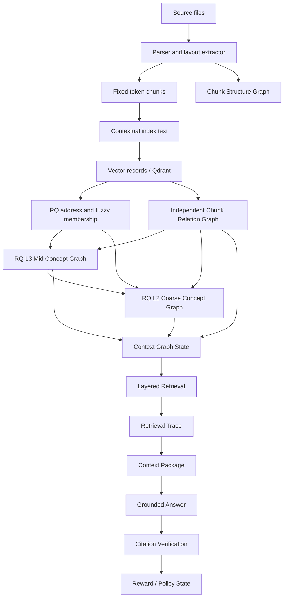

目标链路的核心约束是单调可追溯性。若 \(h_l\) 表示第 \(l\) 层 state hash，则任意一次检索 trace 必须保存：

$$
\tau(q)
=
\left(
q,\ h_{\mathrm{chunk}},h_{\mathrm{struct}},h_{\mathrm{rel}},
h_{\mathrm{rq}},h_{\mathrm{mid}},h_{\mathrm{coarse}},
h_{\mathrm{runtime}},h_{\mathrm{agent}}
\right)
$$


**架构影响：**
- 影响对象：解析、固定 chunk、结构图、contextual index、RQ membership/address、chunk relation graph、mid concepts、coarse concepts、layered retrieval、Agent、context package、citation verification 和 policy update。
- 影响方式：端到端链路定义状态传播顺序；任一上游状态 hash 变化都会改变下游候选集合、concept packet、检索路径、证据包和回答审计。
- 传播字段：`knowledge_base_id`、`document_version_id`、`chunk_version`、`chunk_scope_hash`、`structure_graph_hash`、`chunk_relation_hash`、`rq_membership_hash`、`mid_concept_hash`、`coarse_concept_hash`、`runtime_settings_hash`。
- 触发条件：active chunk scope、embedding text、关系边、concept definition、runtime settings 或 policy state 改变时，相关 trace、cache、context package 和 graph freshness 需要重新计算。
- 验收观察点：`context_graph_states`、`context_graph_freshness`、`retrieval_traces`、`graph_retrieval_steps`、`context_packages` 与 `citation_verifications` 必须形成连续审计链。

## 四层上下文图谱

目标四层图谱是异构多层图：

$$
\mathcal{G}
=
\left(
G_0,G_1,G_2,G_3,\Pi
\right)
$$

其中 \(G_0=(V_0,E_0)\) 是结构图，\(G_1=(V_C,E_C,\mathcal{R},\mathcal{M}_R)\) 是独立 chunk relation graph、RQ prefix address space 与 fuzzy membership，\(G_2=(V_M,E_M)\) 是由 RQ L3 prefix packet 定义的 mid concept graph，\(G_3=(V_K,E_K)\) 是由 RQ L2 prefix packet 定义的 coarse concept graph，\(\Pi\) 是跨层 membership、edge projection 与 trace 投影。

跨层投影的目标性质是保守性：

$$
\forall v\in V_2\cup V_3,\quad
support(v)\subseteq V_C
$$

即概念层节点不能成为事实源，必须能回到 chunk support。

### 第 0 层：Chunk Structure Graph

目标 \(G_0\) 保存原文地图，包含 document、section、page、region、paragraph、table、formula、caption 等结构对象。结构边的目标集合为：

$$
E_0
=
E_{\mathrm{parent}}
\cup E_{\mathrm{prev}}
\cup E_{\mathrm{page}}
\cup E_{\mathrm{region}}
\cup E_{\mathrm{closure}}
$$

chunk 到结构节点的映射权重定义为：

$$
w_{c,s}^{(0)}
=
\alpha_1\operatorname{SpanOverlap}(c,s)
+\alpha_2\operatorname{BBoxIoU}(c,s)
+\alpha_3\operatorname{PathMatch}(c,s)
$$


**架构影响：**
- 影响对象：contextual index、layered retrieval、context package、citation verification 和前端结构上下文展示。
- 影响方式：结构图决定 chunk 的 parent section、previous/next、same page、page region、section path 和原文闭包；检索命中后由它恢复上下文。结构图不决定 chunk relation graph 的语义边去留，也不作为高层概念边的直接事实来源。
- 传播字段：`chunk_structure_nodes`、`chunk_structure_edges`、`chunk_structure_mappings`、`chunk_coordinates`、`section_path`、`page_range`、`bbox`。
- 触发条件：parser output、section offsets、chunk span、page/region metadata 或 structure mapping coverage 变化时，structure hash、context package 和相关 retrieval cache 需要刷新。
- 验收观察点：structure mapping coverage、parent section 命中率、previous/next 恢复数量、same page 邻居数量和 citation span 可回溯性。

### 第 1 层：Chunk Relation Graph

目标 \(G_1\) 是可复算底层语义关系网络与 RQ 地址归属协议：

$$
G_1=(V_C,E_C,\mathcal{R},\mathcal{M}_R)
$$

其中 \(V_C\) 是 active chunks，\(E_C\) 是 chunk relation edges，\(\mathcal{R}\) 是 RQ prefix address tree，\(\mathcal{M}_R\) 是 chunk 到 RQ prefixes 的稀疏模糊归属矩阵。底层关系图只接受内容语义证据：

$$
E_{\mathrm{cand}}
=
E_{\mathrm{dense\_base}}
\cup E_{\mathrm{dense\_cross\_doc}}
\cup E_{\mathrm{dense\_cross\_lang}}
$$

结构图 \(G_0\) 不进入 \(E_{\mathrm{cand}}\)。previous/next、same section、same page、layout region、table/formula/caption closure 只在 context restoration 阶段使用。RQ prefix adjacency、membership overlap、LCP 与 residual distance 只进入 diagnostics、seed prior 和 high-layer projection context，不创建、删除或强制保留底层 active chunk edge。BM25、term overlap、lexical co-hit 和 dense+BM25 co-retrieval 不进入 active 构图、active 检索、entry selection、priority key、edge feature、edge calibration 或 active retrieval cache key。

底层候选边由多语言 dense embedding 生成。每个 chunk \(i\) 先在全库向量空间中产生动态出边候选，再额外保留跨文档与跨语言候选通道：

$$
K_i
=
\operatorname{clamp}
\left(
K_{\min}+\left\lfloor\log_2(1+m_i)\right\rfloor,
K_{\min},
K_{\max}
\right)
$$

$$
Q_i^{doc}
=
\operatorname{clamp}
\left(
Q^{doc}_{\min}+\left\lfloor\log_2(1+m_i)\right\rfloor,
Q^{doc}_{\min},
Q^{doc}_{\max}
\right)
$$

$$
Q_i^{lang}
=
\operatorname{clamp}
\left(
Q^{lang}_{\min}+\left\lfloor\log_2(1+m_i)\right\rfloor,
Q^{lang}_{\min},
Q^{lang}_{\max}
\right)
$$

其中 \(K_i\) 是普通 dense 候选出边数，\(Q_i^{doc}\) 是跨文档候选出边数，\(Q_i^{lang}\) 是跨语言候选出边数，\(m_i\) 是由 chunk 质量、语义密度、span 可引用性、node quality 和结构覆盖组成的同层归一化节点证据量。跨文档候选要求 \(document(i)\ne document(j)\)，跨语言候选要求 \(language(i)\ne language(j)\)。bridge quota 只决定候选进入机会，不提升边权，不降低阈值。

每个目标 chunk \(j\) 对不同候选通道分别限制反向入边：

$$
B_j^{t}
=
\operatorname{clamp}
\left(
B_{\min}^{t}+\left\lfloor\log_2(1+r_j)\right\rfloor,
B_{\min}^{t},
B_{\max}^{t}
\right),
\quad
t\in\{base,doc,lang\}
$$

其中 \(r_j\) 是由结构覆盖、RQ membership 覆盖、bridge 覆盖、边界稳定度和节点质量组成的同层归一化接纳容量。普通入边、跨文档入边和跨语言入边分开计数，防止热门 chunk 吞掉 bridge 入边。候选边接受条件为：

$$
\operatorname{accept}_t(i,j)
=
\mathbf{1}
\left[
\cos(e_i,e_j)\ge\tau_t
\land
\left(
\operatorname{mutual}_t(i,j)
\lor
\operatorname{reverseAccepted}_t(i,j)
\lor
\cos(e_i,e_j)\ge\tau_{\mathrm{strong}}
\right)
\right]
$$

其中 \(\tau_t\) 按 edge type 设置，\(\tau_{\mathrm{strong}}\) 是强 dense 语义阈值。`dense_cross_language_bridge` 与 `dense_cross_document_bridge` 不要求同 RQ prefix、同 mid 或同 coarse；只要满足 dense 语义与接纳规则，就可以成为跨 prefix 底层 bridge support。若一条边同时跨文档和跨语言，edge type 使用 `dense_cross_language_bridge`，并在 features 中保留 `is_cross_document=true`。

目标 edge types：

```text
dense_semantic
dense_cross_document_bridge
dense_cross_language_bridge
```

每条候选边的特征为：

$$
\phi_{ij}
=
\left[
\cos(e_i,e_j),
\operatorname{RankScore}_t(i,j),
\operatorname{Reciprocity}_t(i,j),
\operatorname{NodeQualityPair}(i,j),
\operatorname{BridgeFlags}(i,j)
\right]
$$

边强度由 dense 语义、互近邻/反向接纳、候选排名和节点质量组成。quota 是候选通道，不进入边权：

$$
\operatorname{semantic}_{ij}^{t}
=
\operatorname{clip}
\left(
\frac{\cos(e_i,e_j)-\tau_t}{\tau_{\mathrm{strong}}-\tau_t},
0,
1
\right)
$$

$$
\operatorname{raw\_strength}_{ij}
=
0.75\operatorname{semantic}_{ij}^{t}
+0.15\operatorname{reciprocity}_{ij}^{t}
+0.07\operatorname{rank}_{ij}^{t}
+0.03\operatorname{nodeQualityPair}_{ij}
$$

跨语言和跨文档 edge 不因 bridge 身份降权；噪声控制由 \(\tau_t\)、互近邻/反向接纳、独立入边 quota 和 edge-type calibration 完成。

边强度必须先按 edge type 做类型内归一化，再进入统一距离协议。设边类型为 \(t=edge\_type(i,j)\)，原始候选信号为 \(a_{ij}^{(t)}\)，类型内校准函数为 \(\operatorname{Calib}_t\)，则：

$$
\tilde{s}_{ij}^{(t)}
=
\operatorname{Calib}_t
\left(
a_{ij}^{(t)};
\operatorname{Stats}_t,
\operatorname{Protocol}_t
\right)
\in(0,1]
$$

其中 \(\operatorname{Stats}_t\) 包含该 edge type 的分位数、均值/方差、min/max、截断区间或单调校准参数。类型内归一化只保证同一类边的 raw evidence 被压到稳定强度区间，不把不同 edge type 融成全局语义分数。

统一距离目标形式为：

$$
d_{ij}
=
-\log(\max(\epsilon,\tilde{s}_{ij}^{(t)}))
$$

其中 \(\tilde{s}_{ij}^{(t)}\in(0,1]\) 表示类型内归一化后的可审计关系强度，\(d_{ij}\) 表示图导航距离；关联越大，距离越小。所有 green / gray / hard stop path distance threshold 都只作用于该统一 distance 语义。兼容字段 `weight` 在迁移期必须通过 `protocol_version` 标明语义，active traversal 使用 `distance/raw_strength` 或等价字段；`edge_type`、原始特征、归一化统计和 support diagnostics 必须保留，禁止退回全局加权混排。


**架构影响：**
- 影响对象：RQ membership diagnostics、mid concept packet、coarse concept packet、layered retrieval、bridge expansion、Agent repair 和 graph visualization。
- 影响方式：底层关系边把固定 chunk 变成可遍历网络；RQ 提供地址和模糊归属；mid/coarse 节点和边只能从 RQ membership 与底层 chunk relation edge support 投影获得。
- 传播字段：`chunk_relation_graph_states`、`chunk_relation_edges.edge_type`、`weight`、`distance`、`raw_strength`、`features_json`、`normalization_stats_json`、`source_algorithm`、`protocol_version`、`edge_distance_protocol_hash`、`rq_path`、`rq_membership_score`。
- 触发条件：embedding text version、vector records、chunk scope、dynamic KNN operating point、bridge quota protocol、RQ codebook、RQ membership protocol 或 edge keep policy 变化时，relation state hash 与下游 mid/coarse hash 需要重算。
- 验收观察点：edge count by type、bridge edge count、degree distribution、raw strength distribution by edge type、normalized distance distribution、RQ membership diagnostics、graph expansion steps、path threshold hit distribution 和 traversal contribution。

### 第 2 层：Mid Concept Graph

目标 \(G_2\) 将 RQ L3 prefix packet 投影为可解释 mid concept。设 \(\mathcal{P}_3\) 为 active RQ L3 prefixes，中粒度节点集合为：

$$
V_M
=
\{m_p:p\in\mathcal{P}_3,\ \operatorname{mass}(p)>0\}
$$

chunk 对 mid node 的归属来自 RQ fuzzy membership：

$$
\mu_{c,m_p}=\mu_{c,p}
$$

LLM 不决定 \(V_M\)、\(\mu_{c,m}\) 或 \(E_M\)。LLM 只读取 RQ L3 packet、support chunks、membership diagnostics、底层边分布和结构路径，输出展示短语与面向 LLM 的节点摘要：

```text
display_terms_json
summary
scope_note
inclusion_criteria_json
exclusion_criteria_json
internal_state_json
support_chunk_ids
representative_chunk_ids
boundary_chunk_ids
outlier_chunk_ids
bridge_chunk_ids
grounding_hash
```

grounded gate 定义为：

$$
\operatorname{accept}(m)
=
\mathbf{1}\left[
|S_C(m)|>0
\land
\operatorname{SpanValid}(S_C(m))
\land
\operatorname{PacketGrounded}(m)
\right]
$$

mid edge 由底层 chunk relation edges 通过 membership 投影：

$$
S_{ab}^{C}
=
\{(i,j,e)\in E_C:\mu_{i,m_a}>0,\ \mu_{j,m_b}>0,\ e=(i,j)\}
$$

$$
\operatorname{support\_strength}(m_a,m_b)
=
\sum_{(i,j,e)\in S_{ab}^{C}}
\mu_{i,m_a}\mu_{j,m_b}s_e
$$

若 \(S_{ab}^{C}=\varnothing\)，则 active mid edge 不存在。mid edge 的 raw projected distance、calibrated distance、support edge ids 和 normalization diagnostics 必须保存。RQ L3 邻近、共享父前缀或 membership overlap 可以作为投影诊断和入口先验，不能在没有底层 chunk edge support 时创建 active edge。


**架构影响：**
- 影响对象：coarse concept graph、concept routing、Layered P&E Agent、context package packing、answer grounding 和前端概念路径展示。
- 影响方式：mid concept 与 RQ L3 prefix packet 对齐；mid edge 完全由底层 chunk relation edge support 投影并按 `layer=mid + edge_type` 校准 distance；检索通过 staged traversal 从所有保留的 coarse 父节点逐个下钻收集 mid candidates，合并去重后取 mid top-k，再从选中的 mid 节点逐个下钻到 RQ membership 支撑的 chunk seeds 与 chunk relation graph。
- 传播字段：`mid_concepts`、`mid_concept_memberships`、`mid_concept_edges`、`mid_concept_definitions.support_spans_json`、`display_terms_json`、`summary`、`internal_state_json`、`support_chunk_ids`、`support_rq_prefix`、`support_chunk_edge_ids`、`node_weight`、`projected_distance_raw`、`projected_strength_raw`、`projection_normalization_stats_json`、`edge_projection_protocol_hash`、`distance`、`raw_strength_summary`。
- 触发条件：RQ L3 prefix membership、bottom chunk edge distance、concept packet、LLM summary protocol、grounded gate 或 prompt protocol 变化时，mid concept hash、coarse hash、retrieval trace 和 cache 需要刷新。
- 验收观察点：concept grounded rate、support span coverage、RQ L3-to-mid projection coverage、membership role 分布、node summary grounding、node weight diagnostics、concept edge projection 支撑率、projection calibration diagnostics 和 concept path accuracy。

### 第 3 层：Coarse Concept Graph

目标 \(G_3\) 将 RQ L2 prefix packet 投影为高层主题区域。设 \(\mathcal{P}_2\) 为 active RQ L2 prefixes，粗粒度节点集合为：

$$
V_K
=
\{k_p:p\in\mathcal{P}_2,\ \operatorname{mass}(p)>0\}
$$

RQ prefix tree 是硬层级：L3 prefix 只有一个 L2 parent，L2 prefix 只有一个 L1 parent；模糊性存在于 membership 上，而不是把一个 prefix node 切成多个父节点。chunk 可以同时对多个 L3/L2/L1 prefixes 具有非零归属分数。coarse membership 由 chunk membership 和 child L3 membership 聚合：

$$
\mu_{c,k_p}
=
\mu_{c,p}
$$

coarse packet 由 child L3 summaries、support chunk membership、底层 chunk edge projection、boundary/bridge diagnostics、noise/outlier diagnostics 和 structure paths 组成。LLM 输出 `display_terms_json`、`summary`、`scope_note`、`inclusion_criteria_json`、`exclusion_criteria_json` 与 `internal_state_json`，不决定 coarse membership 或 coarse edge。

coarse edge 由底层 chunk relation edges 经 coarse membership 投影：

$$
S_{ab}^{C}
=
\{(i,j,e)\in E_C:\mu_{i,k_a}>0,\ \mu_{j,k_b}>0,\ e=(i,j)\}
$$

若 \(S_{ab}^{C}=\varnothing\)，则 active coarse edge 不存在。mid edges 可以作为派生诊断和 UI drilldown，不是 coarse edge 的事实源。coarse edge 必须保存 support chunk edge ids、support mid concept ids、raw projected distance、projection calibration diagnostics 与校准后的 active distance。

coarse concept 同样保存同层归一化的 `node_weight`。该权重来自 included mid 数量、support chunk coverage、内部底层边密度、membership stability、bridge state 和 boundary diagnostics，只在 coarse layer 内可比较，用于入口候选辅助、下钻配额和同等路径下的 tie-break，不表示查询相关性。


**架构影响：**
- 影响对象：coarse entry selection、mid concept drilldown、cross-document synthesis、Agent coarse jump、graph overview 和 retrieval cache。
- 影响方式：coarse concept 与 RQ L2 prefix packet 对齐，作为高层入口收缩查询空间；coarse edge 由底层 chunk relation edge support 经 membership 投影并按 `layer=coarse + edge_type` 校准 distance；cross-prefix weak support 与 bridge states 作为诊断保留，避免硬切断跨主题路径；coarse node weight 只提供主题区证据规模和稳定性的同层预算/入口辅助，coarse 层不设置 top-k 截断。
- 传播字段：`coarse_concepts`、`coarse_concept_memberships`、`coarse_concept_edges`、`coarse_concept_definitions`、`display_terms_json`、`summary`、`internal_state_json`、`support_mid_concept_ids`、`support_chunk_edge_ids`、`raw_node_weight`、`node_weight`、`node_weight_diagnostics_json`、`projected_distance_raw`、`projected_strength_raw`、`projection_normalization_stats_json`、`edge_projection_protocol_hash`、`distance`、`bridge_density`、`coarse_concept_hash`。
- 触发条件：RQ L2 prefix membership、child L3 summaries、bottom chunk edge distance、coarse summary protocol、bridge diagnostics 或 edge projection protocol 变化时，coarse entry、retrieval trace 和 cache key 需要刷新。
- 验收观察点：RQ L2-to-coarse projection coverage、child L3 coverage、bridge density、coarse node summary grounding、coarse node weight diagnostics、coarse-to-mid drilldown path、coarse edge projection support、projection calibration diagnostics 和 traversal contribution。

## 跨层对象协议

### 架构图

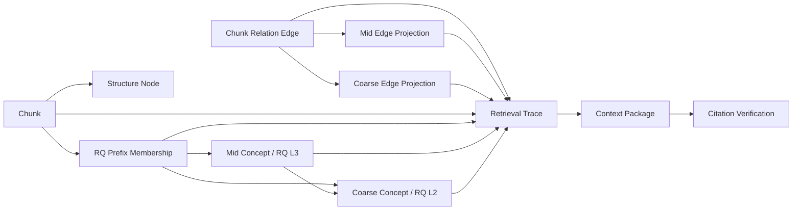

### 关系

跨层对象协议将每层关系表示为稀疏 membership 矩阵：

$$
M^{C\to R_3}_{cp}\in[0,1],\quad
M^{C\to R_2}_{cp}\in[0,1],\quad
M^{R_3\to M}_{pm}\in\{0,1\},\quad
M^{R_2\to K}_{pk}\in\{0,1\}
$$

从 chunk 到 coarse concept 的派生支撑强度为：

$$
M^{C\to K}
=
M^{C\to R_2}M^{R_2\to K}
$$

从 chunk 到 mid concept 的派生支撑强度为：

$$
M^{C\to M}
=
M^{C\to R_3}M^{R_3\to M}
$$

这些 membership 只作为路由、投影和解释信号，不能替代 citation span。事实约束为：

$$
\operatorname{Fact}(x)
\Rightarrow
\exists c\in V_C,\ \exists s=(char\_start,char\_end): x\leftarrow(c,s)
$$


### Edge evidence projection

四层图需要边证据投影协议。上层边必须能回到底层 chunk relation edge 集合：

$$
E_M(m_a,m_b)
\Leftarrow
\{e_{cc}\in E_C:\mu_{c_i,m_a}>0,\ \mu_{c_j,m_b}>0\}
$$

$$
E_K(k_a,k_b)
\Leftarrow
\{e_{cc}\in E_C:\mu_{c_i,k_a}>0,\ \mu_{c_j,k_b}>0\}
$$

mid edge、coarse edge 的存在性由底层 edge support 决定。RQ prefix adjacency、membership overlap、child concept adjacency 和 LLM edge explanation 只能进入 projection diagnostics，不能在没有底层 support chunk edge 时创建 active edge。

$$
\operatorname{ExistsEdge}(u,v)
\Rightarrow
|support\_chunk\_edge\_ids(u,v)|>0
$$

任意上层边 \(e^l\) 必须保存：

```text
distance
projected_distance_raw
projected_strength_raw
raw_strength_summary
projection_normalization_stats_json
support_child_edge_ids
support_chunk_edge_ids
support_chunk_ids
edge_type
source_algorithm
protocol_version
edge_projection_protocol_hash
diagnostics_json
```

投影聚合会改变距离分布，因此 mid/coarse edge 不能只保存下层距离聚合值后直接套用阈值。目标协议必须先从下层 normalized distance 聚合得到 raw projected distance，再按 `layer + edge_type` 做投影校准：

$$
d_{\mathrm{proj}}^{raw}(e^l)
=
\operatorname{Agg}_l
\left(
\{d(e):e\in support(e^l)\},
\{support(e)\},
protocol_l
\right)
$$

$$
s_{\mathrm{proj}}^{raw}(e^l)
=
\exp(-d_{\mathrm{proj}}^{raw}(e^l))
$$

$$
s_{\mathrm{proj}}(e^l)
=
\operatorname{Calib}_{l,t}
\left(
s_{\mathrm{proj}}^{raw}(e^l);
\operatorname{ProjectionStats}_{l,t},
\operatorname{ProjectionProtocol}_{l,t}
\right)
\in(0,1]
$$

$$
d(e^l)
=
-\log(\max(\epsilon,s_{\mathrm{proj}}(e^l)))
$$

其中 \(l\in\{mid,coarse\}\)，\(t=edge\_type(e^l)\)。`projected_distance_raw` 和 `projected_strength_raw` 用于诊断；active traversal、green/gray/hard threshold 和 cycle distance reward 使用校准后的 `distance`。该校准不是全局 weighted fusion，也不允许丢弃下层 support ids；它只解决投影聚合后 mid/coarse layer 的距离分布漂移问题，使阈值可按层稳定设置。

投影不允许断链：

$$
e_K
\Rightarrow
\exists e_C,\exists c_i,c_j
$$

其中最终 evidence chunk 必须能回到 raw span、page range、bbox 或 structure path。

### 关联字段

跨层协议要求每个可审计对象携带主键、state id 与 hash：

$$
id(o)
=
\left(
pk,\ state\_id,\ protocol\_version,\ state\_hash
\right)
$$

核心字段：

```text
chunk_id
document_version_id
structure_node_id
rq_prefix_id
mid_concept_id
coarse_concept_id
chunk_relation_edge_id
mid_concept_edge_id
coarse_concept_edge_id
chunk_relation_graph_state_id
mid_concept_state_id
coarse_concept_state_id
context_graph_state_id
retrieval_trace_id
context_package_id
answer_session_id
citation_verification_id
runtime_settings_hash
agent_operating_envelope_hash
edge_distance_protocol_hash
edge_projection_protocol_hash
traversal_protocol_hash
```

### 代码中的 state hash

目标上，任意 active context graph 的 hash 为：

$$
h_{\mathcal{G}}
=
H\left(
h_C,h_0,h_1,h_R,h_2,h_3,h_{\mathrm{runtime}},h_{\mathrm{agent}}
\right)
$$


**架构影响：**
- 影响对象：所有跨层跳转、边证据投影、检索 trace、context package、answer audit、前端图谱 payload 和运维对账脚本。
- 影响方式：跨层协议提供 id、state、edge support 与 hash 的共同坐标系，使 chunk、RQ prefix membership、mid concept、coarse concept、edge projection、context package 与 citation verification 能在同一审计链中互相定位。
- 传播字段：`chunk_id`、`rq_prefix_id`、`mid_concept_id`、`coarse_concept_id`、`chunk_relation_edge_id`、`mid_concept_edge_id`、`coarse_concept_edge_id`、`context_graph_state_id`、`retrieval_trace_id`、`context_package_id`、`state_hash`。
- 触发条件：任一层 state id、protocol version、edge distance protocol 或 hash 变化时，下游 API payload、cache key、retrieval trace 和 UI graph view 都应使用该协议坐标。
- 验收观察点：跨层 id 不悬空、edge projection 不断链、trace step 可回放、context package 可回到 raw chunk span、answer session 可回到 citation verification。

## 事实源与派生状态

### 架构图

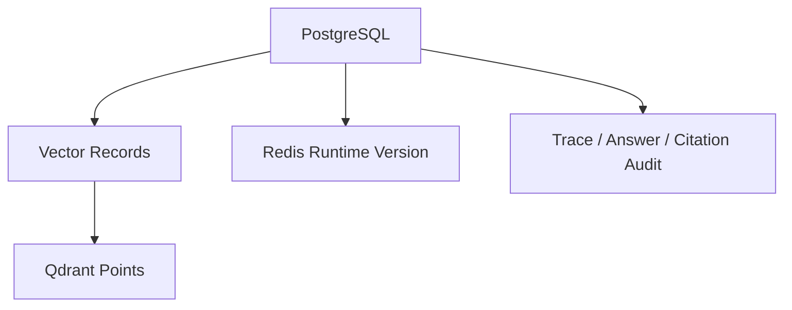

目标系统采用事实源与派生状态分离。设 \(S_P\) 为 PostgreSQL 持久状态，\(S_D\) 为派生状态，则一致性定义为：

$$
\operatorname{Consistent}(S_P,S_D)
=
\mathbf{1}
\left[
H(\operatorname{rebuild}(S_P))=H(S_D)
\right]
$$


### PostgreSQL

PostgreSQL 保存不可丢失事实、生命周期与审计记录。目标上它是唯一可恢复源：

$$
S_{\mathrm{recover}}
=
F_{\mathrm{rebuild}}(S_{\mathrm{postgres}})
$$

PostgreSQL 必须保存 knowledge bases、documents、chunks、structure graph、relation graph、concept graphs、context graph state、retrieval traces、context packages、answer sessions、citation verifications、reward events、policy states 和 runtime settings versions。

### Qdrant

向量索引目标函数是近似最近邻：

$$
\operatorname{ANN}(q)
=
\operatorname*{arg\,topk}_{c\in C}
\cos(e_q,e_c)
$$

Qdrant 是派生索引。collection 命名规则：

$$
collection
=
\operatorname{sanitize}
\left(
symbograph,\ embedding\_model,\ embedding\_text\_version,\ chunk\_schema\_version
\right)
$$

本地检索路径必须在 `VectorRecord.diagnostics_json` 保存 embedding vector，以便本地 layered retrieval 直接计算 dense score。

### Legacy lexical artifacts

BM25 artifacts 只允许作为 legacy cleanup 或 historical diagnostics。它们不进入 active graph build、active retrieval、entry selection、priority key、edge feature、edge calibration 或 active retrieval cache key。若 legacy BM25 rows 仍存在，维护脚本只能通过 dry-run 和显式 destructive flag 对账或删除；任何产品路径都不得依赖它们保证正确性。

### Redis

Redis 承担 runtime version broadcast。理论上，热加载事件为：

$$
event
=
\left(h_{\mathrm{runtime}},\Delta keys,source,timestamp\right)
$$

`publish_runtime_settings_version()` 必须写入 `runtime_settings_versions`，设置 Redis key，发布 channel message，并清理 settings、cache manager、retriever 与 policy reader 等运行时单例。

**架构影响：**
- 影响对象：导入、索引、图构建、检索、QA、Agent、runtime settings、缓存、对账脚本和测试验收。
- 影响方式：PostgreSQL 决定可恢复事实；Qdrant 与 Redis 只能改变向量召回效率、运行态协调和热加载，不改变事实来源。legacy BM25 artifacts 不属于 active 可恢复状态。
- 传播字段：`vector_records`、`runtime_settings_versions`、`payload_hash`、`collection_name`、`status`、`diagnostics_json`。
- 触发条件：派生索引缺失、payload hash 不一致、runtime version 更新或 Redis broadcast 失败时，相关检索路径应进入重建、刷新或阻断。
- 验收观察点：Qdrant 对账通过、runtime publish 可观测、cache miss 行为正确、active 派生状态能从 PostgreSQL 重建，legacy BM25 artifacts 不影响 active 检索结果。

## 解析、固定 Chunk 与结构图

### 架构图

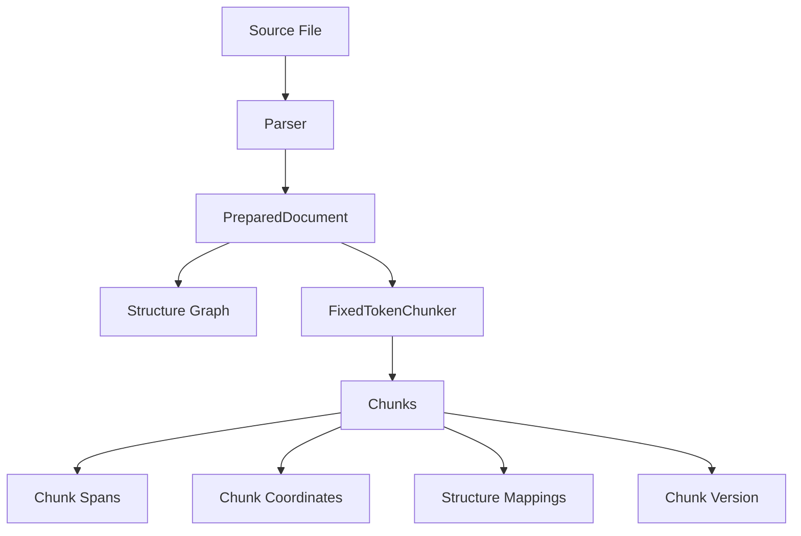

### PreparedDocument

目标解析产物定义为：

$$
D
=
(T,L,S,M)
$$

其中 \(T\) 是文本序列，\(L\) 是布局坐标，\(S\) 是结构对象集合，\(M\) 是 parser metadata。解析目标不是创造语义事实，而是为 chunk 和结构恢复提供可定位地址。


### 固定 Token Chunk

目标固定切块函数：

$$
C
=
\operatorname{FixedChunk}(D;B,O,\Omega)
$$

其中 \(B\) 是 chunk token budget，\(O\) 是 overlap，\(\Omega\) 是保护对象集合。chunk 边界满足：

$$
|c_i|\le B+\epsilon_{\Omega}
$$

相邻 chunk 的覆盖关系为：

$$
c_i\cap c_{i+1}
\approx
O
$$


### 结构图写入

目标结构映射权重：

$$
w(c,s)
=
\alpha
\frac{|span(c)\cap span(s)|}{|span(c)|}
+(1-\alpha)\operatorname{LayoutOverlap}(c,s)
$$

结构映射的基础可复算项为 char overlap：

$$
overlap(c,s)
=
\max
\left(
0,\min(c_e,s_e)-\max(c_b,s_b)
\right)
$$

coverage ratio：

$$
coverage(c,s)
=
\frac{overlap(c,s)}
{\max(1,c_e-c_b)}
$$


### 版本与取消边界

目标版本语义用知识库内最高 chunk version 表示：

$$
v_{\mathrm{target}}
=
\begin{cases}
1,& v_{\max}=0\\
v_{\max}+1,& full\ rebuild\\
v_{\max},& selected\ parse
\end{cases}
$$

取消恢复不能使用 \(v-1\) 推断，应使用解析前记录的 active version：

$$
rollback\_version
=
v_{\mathrm{before\_batch}}
$$


**架构影响：**
- 影响对象：contextual index、Qdrant、chunk relation graph、RQ membership、concept graphs、retrieval trace、context package 和 citation verification。
- 影响方式：固定 chunk 定义全系统最小地址单位；结构图定义上下文恢复路径；版本策略决定下游索引、图状态与引用审计是否仍然有效。
- 传播字段：`chunk_id`、`chunk_version`、`chunk_index`、`char_start`、`char_end`、`token_start`、`token_end`、`text_hash`、`section_path`、`page_range`。
- 触发条件：chunk size、overlap、tokenizer、parser output、chunk span、document version 或 active chunk scope 变化时，contextual index、relation graph、concept graph 和 cache 都需要刷新或重建。
- 验收观察点：active chunk 版本一致、span 不越界、结构映射覆盖率达标、取消恢复回到 batch 前版本、citation 能回到 raw chunk。

## Contextual Index Text

### 架构图

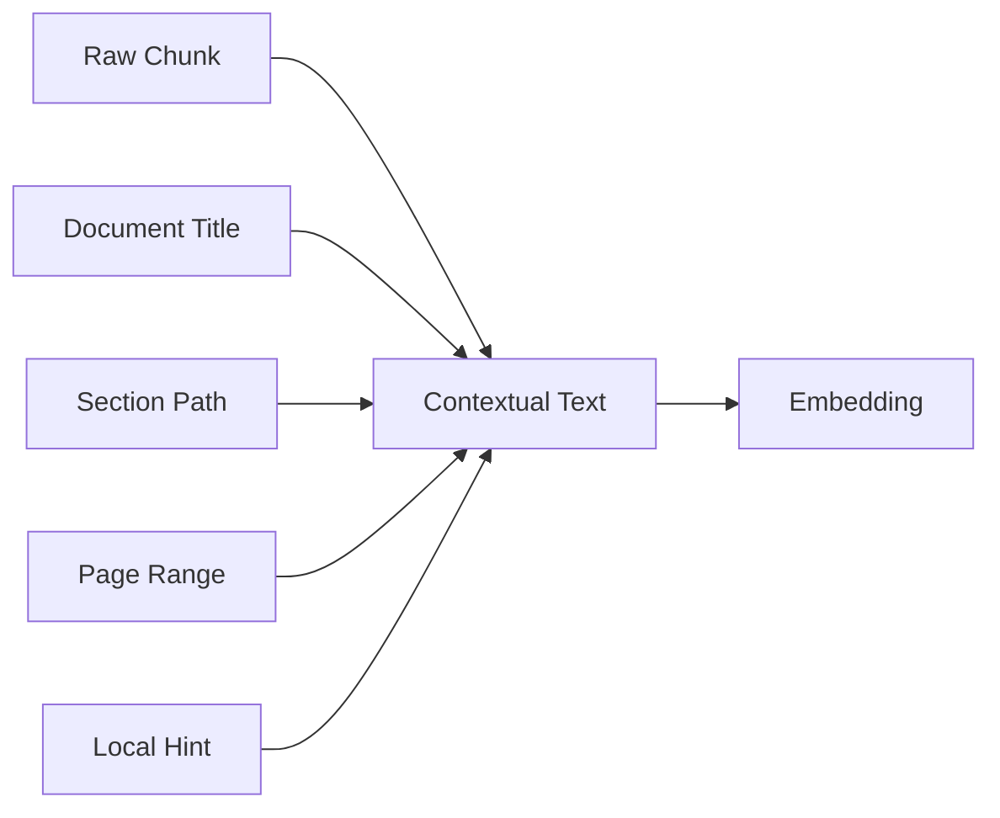

目标是分离“索引用文本”和“引用用文本”。定义：

$$
x_c^{ctx}
=
\operatorname{concat}
\left(
title(d),
section(c),
page(c),
hint(c),
x_c
\right)
$$

raw citation 仍然是：

$$
cite(c)
=
(document\_version\_id,chunk\_id,char\_start,char\_end,page\_range)
$$

### Context text

目标上，contextual text 改变必须改变：

$$
h_{\mathrm{ctx}}(c)
=
H(x_c^{ctx},embedding\_text\_version)
$$


### Vector records

目标 embedding：

$$
e_c
=
f_{\mathrm{emb}}(x_c^{ctx};\theta_{\mathrm{emb}})
$$

vector payload hash：

$$
h_{\mathrm{vec}}
=
H(e_c,chunk\_id,embedding\_model,embedding\_text\_version)
$$


### Legacy lexical records

目标 active path 不创建、不读取、不校准 BM25 records。历史 lexical records 只允许作为 cleanup、migration input 或 historical diagnostics；它们不能进入 active graph hash、retrieval cache key、candidate generation 或 answer evidence。

**架构影响：**
- 影响对象：dense recall、chunk relation graph、RQ path、layered retrieval、context package packing 和 cache key。
- 影响方式：contextual text 是 embedding 输入；它改变 dense recall 分布和关系边候选，但 citation 仍必须指向 raw chunk span。
- 传播字段：`chunk_context_texts.context_hash`、`embedding_text_version`、`vector_records.payload_hash`。
- 触发条件：contextual prompt、embedding text version、embedding model 或 context hash 变化时，Qdrant、relation graph 和 retrieval cache 必须刷新。
- 验收观察点：vector record ready 率、embedding dimension 一致、context hash 与 payload hash 对齐、raw span citation 不受 contextual text 改写影响。

## Chunk Relation Graph

### 架构图

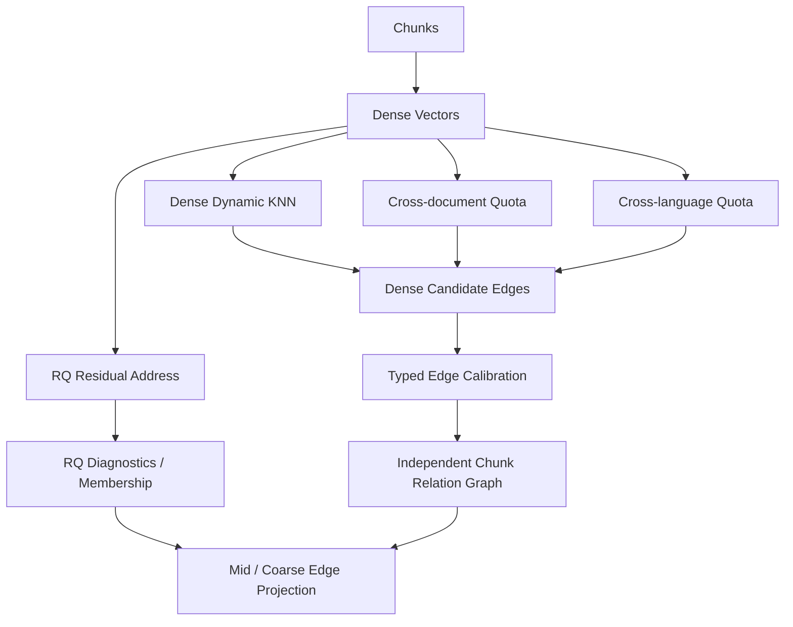

### State

目标 relation graph state：

$$
S_1
=
(V_C,E_C,\mathcal{R},\mathcal{M}_R,h_1,p_1)
$$

其中 \(E_C\) 是底层 chunk relation edges，\(\mathcal{R}\) 是 RQ prefix address tree，\(\mathcal{M}_R\) 是 chunk 到 RQ prefixes 的 fuzzy membership。\(h_1\) 是 state hash，\(p_1\) 是 protocol version。protocol 是 `chunk_relation_rq_membership_v3`。

目标 state hash：

$$
h_1
=
H(scope(C),stats(E_C),codebook(RQ),stats(\mathcal{M}_R),graph\_operating\_point,\ edge\_calibration,\ p_1)
$$


### Edge builder

目标候选边只来自多语言 dense semantic evidence：

$$
E_{\mathrm{cand}}
=
E_{\mathrm{dense\_base}}
\cup E_{\mathrm{dense\_cross\_doc}}
\cup E_{\mathrm{dense\_cross\_lang}}
$$

结构邻接、同页、同标题、表格闭包、公式闭包和图注闭包属于 Chunk Structure Graph，不进入 relation edge 的创建和保留。它们在 context package 阶段根据 hit chunk 恢复，保证信息不丢失，同时避免把版面关系误写成语义关系。BM25、term overlap、lexical co-hit、dense+BM25 co-retrieval 和 RQ pair adjacency 不创建 active chunk relation edge。

目标候选通道：

```text
base_dense_candidates: top K_i dense neighbors over active chunks
cross_document_candidates: top Q_i_doc dense neighbors with different document_id
cross_language_candidates: top Q_i_lang dense neighbors with different language
```

目标 edge types：

```text
dense_semantic
dense_cross_document_bridge
dense_cross_language_bridge
```

动态出边配额：

$$
\begin{aligned}
K_i
&=
\operatorname{clamp}(K_{\min}+\lfloor\log_2(1+m_i)\rfloor,K_{\min},K_{\max})\\
Q_i^{doc}
&=
\operatorname{clamp}(Q^{doc}_{\min}+\lfloor\log_2(1+m_i)\rfloor,Q^{doc}_{\min},Q^{doc}_{\max})\\
Q_i^{lang}
&=
\operatorname{clamp}(Q^{lang}_{\min}+\lfloor\log_2(1+m_i)\rfloor,Q^{lang}_{\min},Q^{lang}_{\max})
\end{aligned}
$$

动态反向入边配额：

$$
\begin{aligned}
B_j^{base}
&=
\operatorname{clamp}(B_{\min}^{base}+\lfloor\log_2(1+r_j)\rfloor,B_{\min}^{base},B_{\max}^{base})\\
B_j^{doc}
&=
\operatorname{clamp}(B_{\min}^{doc}+\lfloor\log_2(1+r_j)\rfloor,B_{\min}^{doc},B_{\max}^{doc})\\
B_j^{lang}
&=
\operatorname{clamp}(B_{\min}^{lang}+\lfloor\log_2(1+r_j)\rfloor,B_{\min}^{lang},B_{\max}^{lang})
\end{aligned}
$$

其中 \(m_i\) 表示同层归一化节点证据量，\(r_j\) 表示同层归一化入边接纳容量。二者只参与配额计算和 tie-break diagnostics，不表示 query relevance。普通入边、跨文档入边和跨语言入边分开计数，避免同语言、同文档密集区域挤掉 bridge 候选。

edge-type 接受规则：

$$
\operatorname{accept}_t(i,j)
=
\mathbf{1}
\left[
\cos(e_i,e_j)\ge\tau_t
\land
\left(
\operatorname{mutual}_t(i,j)
\lor
\operatorname{reverseAccepted}_t(i,j)
\lor
\cos(e_i,e_j)\ge\tau_{\mathrm{strong}}
\right)
\right]
$$

目标边特征：

$$
\phi_{ij}
=
\left[
\cos(e_i,e_j),
\operatorname{RankScore}_t(i,j),
\operatorname{Reciprocity}_t(i,j),
\operatorname{NodeQualityPair}(i,j),
\operatorname{BridgeFlags}(i,j)
\right]
$$

raw strength：

$$
\operatorname{raw\_strength}_{ij}
=
0.75\operatorname{semantic}_{ij}^{t}
+0.15\operatorname{reciprocity}_{ij}^{t}
+0.07\operatorname{rank}_{ij}^{t}
+0.03\operatorname{nodeQualityPair}_{ij}
$$

其中：

$$
\operatorname{semantic}_{ij}^{t}
=
\operatorname{clip}
\left(
\frac{\cos(e_i,e_j)-\tau_t}{\tau_{\mathrm{strong}}-\tau_t},
0,
1
\right)
$$

cross-language 和 cross-document edge 不因 bridge 身份额外降权；它们通过独立阈值、独立入边配额、mutual/reverse gate 与 edge-type calibration 控噪。quota 只负责候选召回机会，不进入 raw strength。

### Graph operating point calibration

Dynamic KNN、reverse quota、bridge quota、semantic threshold 与 edge calibration 参数通过自动 TPE Bayesian Optimization 选择 active bottom relation graph 的 operating point。TPE 是构图阶段的轻量数值优化器，不是独立产品入口；它不调用 LLM，不重新 embedding，不构建 mid concepts，不构建 coarse concepts，也不生成任何临时候选持久图谱。

TPE 的触发只由运行环境和构图批次决定：

```text
ENABLE_AUTO_TPE=true:
  仅当本批次推进知识库最高 chunk version 时，在 chunk/vector ready 后、写 active chunk relation graph 前自动运行轻量 TPE。

ENABLE_AUTO_TPE=false:
  使用当前 active operating point；若不存在，则使用版本化默认 operating point。
```

触发锁定为 chunk 最高版本号递增：空库首次成功解析产生 v1 时可以运行；全量重建成功推进到 vN+1 时可以运行；普通选中文件重解析、同版本补解析、普通搜索、QA、Agent、导入页/设置页保存和日志抽屉打开都不得触发 TPE。前端导入页提供全局热加载开关、envelope 参数和最近一次 auto TPE run 只读状态；开启开关本身不 retroactive 触发当前版本调参，必须等待下一次最高 chunk version 递增。

TPE 只在底层关系图参数空间 \(\Theta_G\) 中选择构图常数：

```text
K_min, K_max
B_min_base, B_max_base
B_min_doc, B_max_doc
B_min_lang, B_max_lang
dense_min_cosine
dense_strong_cosine
cross_doc_out_quota_min, cross_doc_out_quota_max
cross_doc_min_cosine
cross_language_out_quota_min, cross_language_out_quota_max
cross_language_min_cosine
edge_type_calibration_protocol
```

一个 operating point 记为：

```text
θ = {
  graph_operating_point_protocol,
  edge_distance_protocol,
  edge_type_calibration_protocol,
  dense_knn,
  reverse_quota,
  bridge_quota,
  type_thresholds,
  calibration_params
}
```

`θ` 的每个字段必须可序列化、可 hash、可落库、可回放。`dense_knn` 控制 base dense candidate fan-out；`reverse_quota` 控制按 edge type 分桶的入边接受上限；`bridge_quota` 只控制 cross-document 和 cross-language candidate 进入机会；`type_thresholds` 控制不同 edge type 的最小 cosine 与 strong cosine gate；`calibration_params` 控制 raw feature 到 typed strength/distance 的单调校准。任何 sampled `θ` 若违反 `min <= max`、阈值区间、quota 上限、protocol version 或 settings lifecycle 约束，必须在 trial preflight 阶段判为 invalid，不得进入 candidate adjacency simulation。

TPE 使用已完成 trial 的目标值把参数样本切分为 good set 与 bad set。设 \(y=J(\theta)\)，\(y^\*\) 为前 \(\gamma\) 分位的目标值，目标越大越好：

$$
l(\theta)=p(\theta\mid y\ge y^\*),\quad
g(\theta)=p(\theta\mid y<y^\*)
$$

采样阶段优先选择最大化 \(\frac{l(\theta)}{g(\theta)}\) 的候选点；当 trial 数不足 `tpe_startup_random_trials` 时使用有界随机采样填充初始观测。TPE 只优化 bottom relation graph operating point，不参与在线 query scoring，不替代 staged traversal priority queue，也不改变 node weight 语义。

每个 trial 执行：

```text
sample θ from TPE
-> theta preflight
-> in-memory candidate adjacency simulation
-> bottom graph diagnostics
-> lightweight probe metrics
-> hard gate
-> objective score
-> update TPE observations
```

trial 的输入只能来自当前构图批次已经确定的事实源：

```text
active chunk scope
current chunk embeddings
chunk structure graph
document/language metadata
RQ codebook inputs if already available for this build stage
previous active operating point or versioned default theta
```

trial 不写 `chunk_relation_graph_states`，不写 `chunk_relation_edges`，不写 RQ prefix，不写 mid/coarse，不写 Qdrant，不写 Redis active cache。trial 只能产生内存邻接表和可审计指标；批次失败或取消时不会留下可被 active retrieval 读取的半成品图。

自动 TPE 架构图：

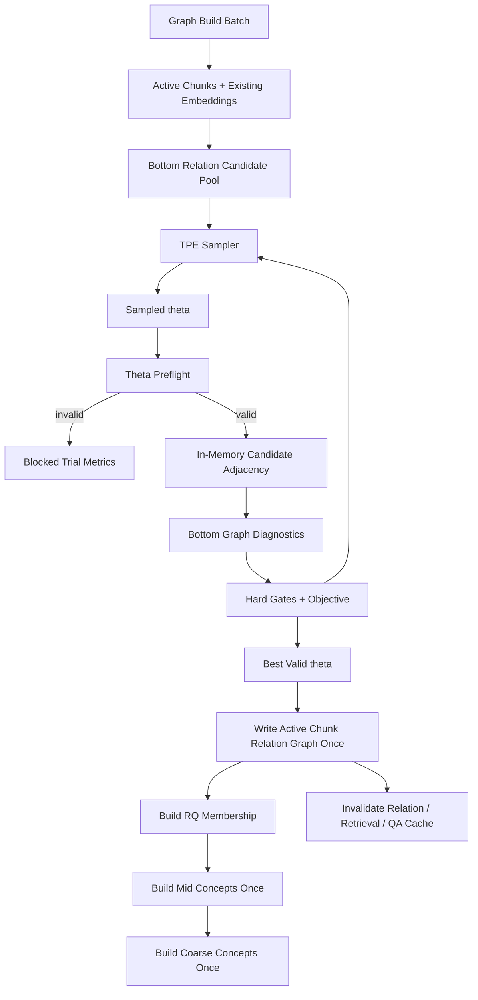

trial 必须形成可审计记录，但记录的是轻量仿真结果，不是持久候选图状态：

```text
tpe_trials:
  trial_id
  knowledge_base_id
  build_batch_id
  chunk_scope_hash
  embedding_model
  embedding_text_version
  sampled_theta_json
  theta_hash
  sampler_state_hash
  probe_set_hash
  candidate_adjacency_hash
  diagnostics_json
  hard_gate_json
  objective_components_json
  objective_score
  status
  failure_code
  started_at
  finished_at
```

`candidate_adjacency_hash` 由 candidate edge ids、edge type、raw strength、typed gate decision 和 θ hash 计算。trial 失败、取消或超时必须保留 failure code、blocking reason 和可重试边界；不得静默退回固定参数并标记成功。若所有 trial 均失败，构图批次必须使用上一版 active operating point 或版本化默认 theta，并在 batch diagnostics 中记录 `auto_tpe_status=failed_or_skipped`，不得把失败 trial 写成成功优化。

自动 TPE 由 graph build worker 在 bottom relation graph 阶段执行。worker 必须在 TPE 开始前和每个 trial 边界刷新 runtime settings version；长 trial 内不得继续读取已经撤销的开关。取消批次时，TPE 必须在当前 trial 边界停止；如果单个 trial 内部执行时间超过 `tpe_trial_timeout_seconds`，该 trial 失败并进入下一 trial 或终止批次。

日志流必须把 TPE 作为构图阶段子事件展示，而不是伪装成文件解析进度：

```text
auto_tpe_started
auto_tpe_trial_started
auto_tpe_trial_completed
auto_tpe_trial_blocked
auto_tpe_best_theta_selected
auto_tpe_skipped
auto_tpe_failed
```

这些事件只描述自动 operating point 选择，不表示 mid/coarse 已完成。前端只在导入页提供自动 TPE 开关、envelope 参数和最近 run 状态；设置页不得提供 TPE 开关、参数入口、独立运行优化器或单独切换图谱参数的按钮。

硬约束：

$$
\frac{|E_C|}{|V_C|}\le \eta_E,\quad
isolated\_ratio\le \eta_I,\quad
\frac{degree_{p95}}{\max(degree_{median},1)}\le \eta_H
$$

$$
structure\_recovery\_rate\ge \eta_S,\quad
candidate\_latency_{p95}\le \eta_L
$$

硬约束的阈值来自 active evaluation policy 或 runtime settings 中的 versioned gate profile。任一 hard gate 失败时，trial 的 `status=blocked`，可记录 objective components 供诊断，但不得成为 best theta。`candidate_latency_p95` 是 candidate adjacency 构造、probe expansion 和指标计算的本地耗时，不包括 LLM latency；如果 embedding model、embedding text version 或 chunk scope 变化，旧 trial 只能作为 historical diagnostics，不能跨 scope 复用。

软目标函数：

$$
\begin{aligned}
J(\theta)
=&
0.26\cdot evidence\_recall\_proxy
+0.18\cdot structure\_recovery\_rate\\
&+0.16\cdot component\_coverage
+0.12\cdot edge\_precision\_proxy\\
&+0.10\cdot bridge\_opportunity\_coverage
+0.08\cdot path\_diversity\\
&-0.12\cdot hubness\_penalty
-0.10\cdot density\_penalty\\
&-0.06\cdot latency\_penalty
\end{aligned}
$$

目标函数组件定义如下：

```text
evidence_recall_proxy:
  probe chunk 或 expected support chunk 在 candidate adjacency 中可被 1-2 跳触达的比例。
  expected support 可以来自人工 probe、上一版 verified citation spans、
  或结构邻近的 positive support set；不得来自 LLM 无支撑猜测。

structure_recovery_rate:
  candidate adjacency 能恢复 previous/next、same section、same page、
  table/formula/caption/code closure 周边证据的比例。
  这些结构边不进入 active relation graph，只作为恢复能力评估。

component_coverage:
  active chunks、document ids、语言桶和候选 RQ prefix 输入被非孤立覆盖的加权比例。

edge_precision_proxy:
  抽样 candidate relation edges 中 mutual/reverse/strong gate、typed threshold、
  support feature 和结构可回溯性均通过的比例。

bridge_opportunity_coverage:
  cross-document 与 cross-language candidate 在独立 quota 内获得候选机会的比例。
  它只评估机会覆盖，不奖励 bridge 边无约束增多。

path_diversity:
  probe expansion 在 document、language、edge type 和 candidate RQ prefix 上的归一化熵。
  它奖励多证据覆盖，不奖励无支撑跳边。

hubness_penalty:
  degree_p95、degree_median、top hub share 与 edge type imbalance 的归一化惩罚。

density_penalty:
  |E_C|/|V_C| 超过目标密度区间后的惩罚。

latency_penalty:
  candidate adjacency simulation p95 和 probe expansion p95 超过预算后的惩罚。
```

所有组件必须保存原始分子、分母、采样数量、probe set hash 和计算协议版本。没有足够 probe 时，自动 TPE 必须标记为 `insufficient_evaluation` 并回退到上一版 active/default theta；不得调用 LLM 临时补 probe。

跨语言质量在当前 operating point 中作为 lightweight diagnostics 和 bridge opportunity 组件的一部分，不作为单独 hard gate：

```text
cross_language_edge_count
cross_language_edge_ratio
cross_document_edge_count
cross_document_edge_ratio
prefix_language_entropy
prefix_language_purity
```

TPE 结束后只选择 best valid theta；真正写入 active 图谱发生一次，且只写 bottom relation graph。随后 RQ、mid concepts 和 coarse concepts 基于最终 active bottom relation graph 派生一次。mid/coarse 的 LLM 生成、双语派生、摘要和 projection calibration 不进入 TPE trial，也不参与 TPE objective。

最终 active relation graph 写入必须原子保存：

```text
graph_operating_point_hash
graph_operating_point_json
edge_distance_protocol_hash
edge_type_calibration_protocol_hash
runtime_settings_hash
auto_tpe_run_id
auto_tpe_best_trial_id
diagnostics_json
```

如果 active relation graph 写入失败，当前批次失败并保持上一版 active graph state 不变；TPE run 保留为 failed diagnostics。成功写入后必须失效 relation graph、mid/coarse graph、retrieval trace、context package、QA 和 Agent 相关 cache；下游 mid/coarse projection 必须基于最终 active relation graph 重新计算。


### Graph distance and traversal support

目标关系图不输出孤立图分数，而输出可遍历距离边和路径证据。所有进入 active traversal 的边都必须先经过 edge-type normalization。设边 \(e\) 的类型为 \(t\)，原始强度或原始特征摘要为 \(a_e^{(t)}\)，则：

$$
s_e
=
\operatorname{Calib}_t
\left(
a_e^{(t)};
\operatorname{Stats}_t,
\operatorname{Protocol}_t
\right)
\in(0,1]
$$

类型内校准函数必须单调：原始证据越强，\(s_e\) 越大。可选实现包括 quantile calibration、min/max clipping、z-score sigmoid、isotonic calibration 或 rank-to-strength mapping。chunk relation edge 的 active distance：

$$
d_e
=
-\log(\max(\epsilon,s_e))
$$

硬路径阈值使用归一化后的累计 distance，而不是 raw score。不同 edge type 不直接相加 raw score；跨类型路径只累计统一 distance，同时保留 `edge_type`、support ids 与 normalization diagnostics 供 LLM gray-zone evaluator 判断路径价值。

候选路径距离：

$$
D(P)
=
\sum_{e\in P}d_e
+\operatorname{Penalty}(P)
$$

路径贡献由覆盖面、证据独立性、桥接性和 bounded cycle distance reward 产生：

$$
R(P)
=
G_{\mathrm{facet}}
+G_{\mathrm{support}}
+G_{\mathrm{bridge}}
+G_{\mathrm{cycle}}
$$

active traversal 使用 \(D(P)-R(P)\) 作为优先队列排序的一部分，topological metrics 只作为入口选择和 tie-break prior，不再把 degree 或 PageRank 直接当最终 chunk 分。

底层边写入不接受无 support 的 LLM 推断：

$$
e_{ij}\in E_C
\Rightarrow
\left(
support\_features(e_{ij})\ne\varnothing
\land
protocol(e_{ij})=p_1
\land
d_e<\infty
\right)
$$

所有边必须保存 typed features、raw strength、calibration stats、support ids、distance、source algorithm、protocol version 和 diagnostics。任意特殊文本形态的局部闭包由 \(G_0\) 恢复；底层关系图只判断两个 chunk 是否存在内容语义近邻关系。


**架构影响：**
- 影响对象：RQ membership diagnostics、mid concept packet、coarse concept packet、staged priority-queue traversal、bridge repair、context package bridge chunks 和 graph diagnostics。
- 影响方式：relation graph 把 base dense、cross-document dense bridge 和 cross-language dense bridge 统一成可遍历距离边；结构信息只在命中后恢复上下文；RQ membership 只提供地址、seed prior 和 diagnostics；mid/coarse 节点和边完全根据底层 chunk edges 与 membership 投影。
- 传播字段：`chunk_relation_graph_state_id`、`chunk_relation_edges`、`rq_path`、`rq_prefix_memberships`、`edge_type`、`distance`、`raw_strength`、`features_json`、`normalization_stats_json`、`edge_distance_protocol_hash`、`state_hash`。
- 触发条件：embedding、chunk scope、dynamic KNN operating point、bridge quota protocol、TPE calibrated active parameters、RQ codebook、RQ membership protocol 或 relation protocol 变化时，mid concepts、coarse concepts、retrieval trace 和 cache 需要刷新。
- 验收观察点：relation state ready、edge type 分布、bridge ratio、cross-language edge ratio、cross-document edge ratio、raw strength distribution by edge type、normalized distance distribution、hubness diagnostics、path threshold hit distribution、trace 中 staged frontier expansion steps、cycle distance reward 和 diagnostics hash。

## RQ Membership 与 RQ-KMeans

### 目标架构

RQ membership layer 表示 RQ residual address 与 fuzzy membership protocol。它不是独立 active traversal layer，不承担原文结构职责，不通过社区检测决定底层边。原文层次、坐标、previous/next、表格、公式和图注闭包由 Chunk Structure Graph 负责；底层关系由 Chunk Relation Graph 负责；RQ 只定义语义地址、模糊归属、边界/低置信诊断、chunk seed prior 和高层节点投影基础。

RQ 层级的工程语义固定为：

```text
RQ L3 prefix -> Mid Concept node
RQ L2 prefix -> Coarse Concept node
RQ L1 prefix -> parent prior, route prior, diagnostics
```

RQ prefix tree 是硬树：每个 L3 prefix 只有一个 L2 parent，每个 L2 prefix 只有一个 L1 parent。模糊性只存在于 membership score：一个 chunk 可以同时归属多个 L3/L2/L1 prefixes；一个 L3 prefix 不会被拆成多个 L2 parent，一个 L2 prefix 不会被拆成多个 L1 parent。

目标架构受 [ContextRAG](https://arxiv.org/abs/2605.19735) 的 extraction-free graph construction 启发：底层拓扑不由 LLM 抽实体和关系，而由可复算 multilingual dense embedding、dynamic KNN、bridge quota 和 typed edge calibration 构建。RQ 提供语义地址、membership、seed prior 和 diagnostics，不创建 active bottom edge。[KG2RAG](https://aclanthology.org/2025.naacl-long.449/) 的 seed expansion / graph organization 思路用于检索阶段：先定位图入口，再沿关系图扩展和组织证据。

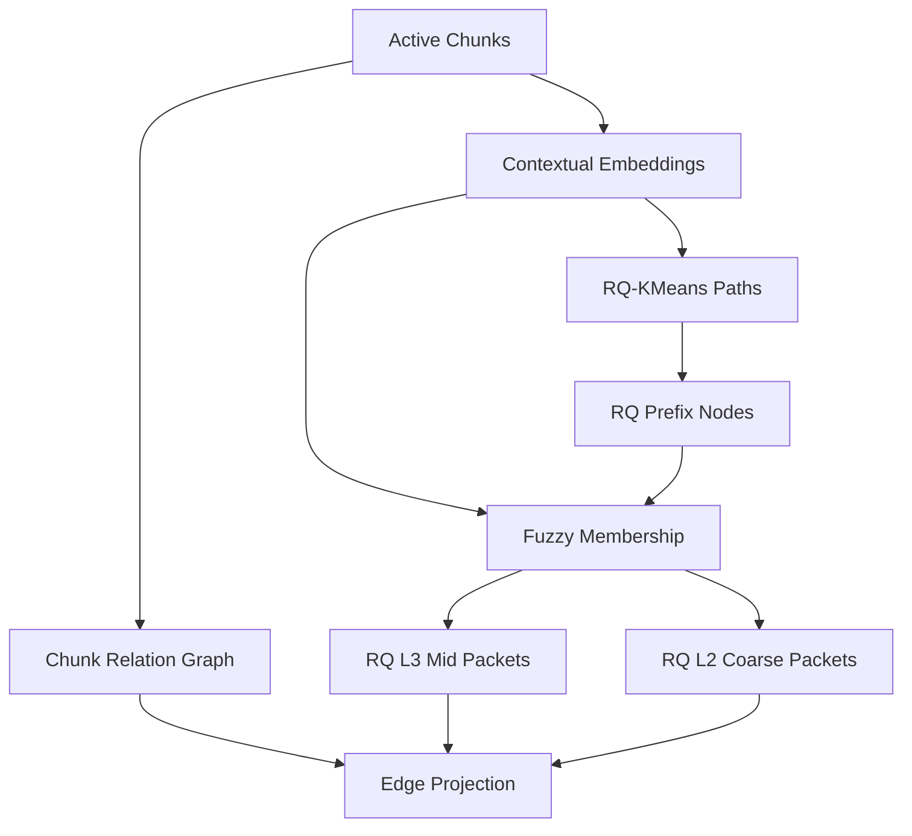

### Chunk evidence graph

chunk evidence graph 等同于上一节定义的独立 Chunk Relation Graph：

$$
G_C=(V_C,E_C)
$$

其中：

$$
E_C
=
E_{\mathrm{dense\_base}}
\cup E_{\mathrm{dense\_cross\_doc}}
\cup E_{\mathrm{dense\_cross\_lang}}
$$

结构边不作为 evidence feature。每条 chunk relation edge 先保存原始 evidence feature \(a_e^{(t)}\)，再按 edge type \(t\) 归一化为关系强度 \(s_e\in(0,1]\)：

$$
s_e
=
\operatorname{Calib}_t
\left(
a_e^{(t)};
\operatorname{Stats}_t,
\operatorname{Protocol}_t
\right)
$$

再写入距离 \(d_e\)：

$$
d_e
=
-\log(\max(\epsilon,s_e))
$$

关联越强，\(s_e\) 越大，\(d_e\) 越小。不同 edge type 的 raw feature 不直接比较；只有归一化后的 distance 可进入累计路径距离、green/gray/hard stop 阈值和 cycle distance reward。跨类型导航仍保留 typed edge、support ids、路径证据和 LLM 灰区裁决，不做全局拍脑袋加权。

### RQ fuzzy memberships

RQ fuzzy membership 是 active 归属协议。可视化或诊断层可以报告辅助分组，但不能把分组结果作为 mid/coarse 节点事实源，也不能用分组边反向决定底层 chunk edge。

对第 \(l\) 层 codebook，chunk \(c\) 到 code \(k\) 的距离为：

$$
d_{c,l,k}
=
\left\|r_c^{(l-1)}-\mu_{l,k}\right\|_2
$$

soft assignment：

$$
p_{c,l,k}
=
\frac{\exp(-d_{c,l,k}/\tau_l)}
{\sum_h\exp(-d_{c,l,h}/\tau_l)}
$$

residual confidence：

$$
\gamma_c
=
\exp(-\rho_c/\tau_r)
$$

prefix membership：

$$
\mu_{c,p}
=
\gamma_c
\prod_{l\le depth(p)}
p_{c,l,q_p^{(l)}}
$$

membership role 由 \(\mu_{c,p}\)、rank、entropy、residual norm 和边界距离决定：

```text
primary_member
fuzzy_member
boundary_member
bridge_member
low_confidence_member
outlier_member
noise_candidate
```

低置信 chunk 不被丢弃；它以低 membership、边界角色或 outlier/noise diagnostics 进入 packet 和 trace。模糊归属改变簇生成和高层投影权重，不额外增加图层。

### RQ prefix diagnostics

RQ prefix diagnostics 在 active 架构中不是独立导航边。RQ prefix 之间的 parent-child、sibling、centroid-near 和 overlap diagnostics 只服务于地址解释、entry prior、packet diagnostics 和 UI 展示；active mid/coarse edge 仍必须由底层 chunk relation edge support 投影。

RQ prefix adjacency diagnostics schema：

```text
source_rq_prefix_id
target_rq_prefix_id
edge_type
diagnostic_strength
support_membership_mass
support_chunk_ids_sample
source_algorithm
protocol_version
diagnostics_json
```

diagnostic strength：

$$
d^{diag}_{pq}
=
\operatorname{Diag}
\left(
\operatorname{PrefixRelation}(p,q),
\operatorname{CentroidDistance}(p,q),
\operatorname{MembershipOverlap}(p,q),
\operatorname{ProjectedChunkSupport}(p,q)
\right)
$$

diagnostic edge types：

```text
parent_child
sibling
centroid_near
membership_overlap
projected_chunk_support
```

这些 diagnostics 不进入 \(D(P)\)，不参与 active graph threshold，不替代 support_chunk_edge_ids。


### RQ-KMeans

目标 RQ-KMeans 将 embedding 递归量化为语义地址。对 chunk embedding \(e_c\)：

$$
r_c^{(0)}=e_c
$$

第 \(l\) 层：

$$
q_c^{(l)}
=
\operatorname*{arg\,min}_{k}
\left\|r_c^{(l-1)}-\mu_{l,k}\right\|_2
$$

$$
r_c^{(l)}
=
r_c^{(l-1)}-\mu_{l,q_c^{(l)}}
$$

RQ path：

$$
path(c)
=
\left(q_c^{(1)},q_c^{(2)},\ldots,q_c^{(L)}\right)
$$

residual norm：

$$
\rho_c
=
\left\|r_c^{(L)}\right\|_2
$$


### RQ prefix clusters

目标上，每个 prefix 是层级地址节点：

$$
prefix_l(c)
=
(q_c^{(1)},\ldots,q_c^{(l)})
$$

prefix membership：

$$
\mu_{c,p}
=
\gamma_c
\prod_{l\le depth(p)}
p_{c,l,q_p^{(l)}}
$$

其中 \(\gamma_c=\exp(-\rho_c/\tau_r)\)。membership 不设置人工下限；低 membership 进入 boundary、outlier 或 noise diagnostics。


### RQ cluster edges

RQ cluster graph 不作为 active traversal layer。prefix 关系保存在 address tree 与 diagnostics 中：

$$
E_R^{diag}
=
E_{\mathrm{parent}}
\cup E_{\mathrm{sibling}}
\cup E_{\mathrm{centroid}}
\cup E_{\mathrm{overlap}}
\cup E_{\mathrm{projected\_support}}
$$

diagnostic edge types：

```text
rq_parent_child
rq_sibling
rq_centroid_near
rq_overlap_bridge
rq_projected_chunk_support
```

其中 `rq_parent_child` 来自 prefix tree，`rq_projected_chunk_support` 来自底层 chunk relation edge support 的投影统计。诊断边不作为 mid/coarse active edge 的存在性条件。

### RQ chunk diagnostics

两个 chunk 的最长公共前缀：

$$
LCP(c_i,c_j)
=
\max
\left\{
l:\ prefix_l(c_i)=prefix_l(c_j)
\right\}
$$

RQ diagnostic weight：

$$
w_{ij}^{rq}
=
\frac{LCP(c_i,c_j)}{L}
\cdot
\exp
\left(
-\frac{\|r_i-r_j\|_2}{\tau_r}
\right)
$$

RQ pair diagnostics 可生成诊断类型：

```text
rq_hierarchy_near
rq_prefix_sibling
rq_residual_near
```

并在 diagnostics 中保存 `lcp_depth`、`residual_distance`、`rq_weight`、source/target rq path。RQ pair diagnostics 不写入 active relation graph，不参与 active edge calibration，不作为 bottom edge existence gate。诊断缺口写入 graph diagnostics，不使用 fallback pair 补边。

**架构影响：**
- 影响对象：mid concept aggregation、coarse concept aggregation、staged priority-queue graph traversal、context package bridge restoration、retrieval trace 和前端 RQ 诊断。
- 影响方式：RQ layer 提供 L3/L2/L1 地址、chunk membership、边界/低置信/outlier 诊断和 chunk seed prior；active mid concept 与 RQ L3 prefix packet 对齐，active coarse concept 与 RQ L2 prefix packet 对齐；检索在 selected mid queue 中逐父节点使用 RQ membership 选择 chunk seeds，再进入独立 chunk relation graph 并由结构图恢复上下文。
- 传播字段：`rq_prefixes`、`rq_prefix_memberships`、`rq_path`、`rq_level`、`rq_path_prefix`、`residual_norm`、`membership_score`、`membership_role`、`lcp_depth`、`residual_distance`、`rq_weight`、`support_chunk_edge_ids`。
- 触发条件：relation graph hash、embedding vectors、RQ level/codebook、RQ membership protocol、bridge support 或 residual diagnostics 变化时，mid concept hash、coarse hash、retrieval trace 和 cache 必须刷新。
- 验收观察点：RQ path availability、RQ L3-to-mid projection coverage、RQ L2-to-coarse projection coverage、fuzzy membership 数量、membership role 分布、LCP depth 分布、bridge path coverage、chunk seed quality 和 staged traversal diagnostics。

## Mid Concept Graph

### 架构图

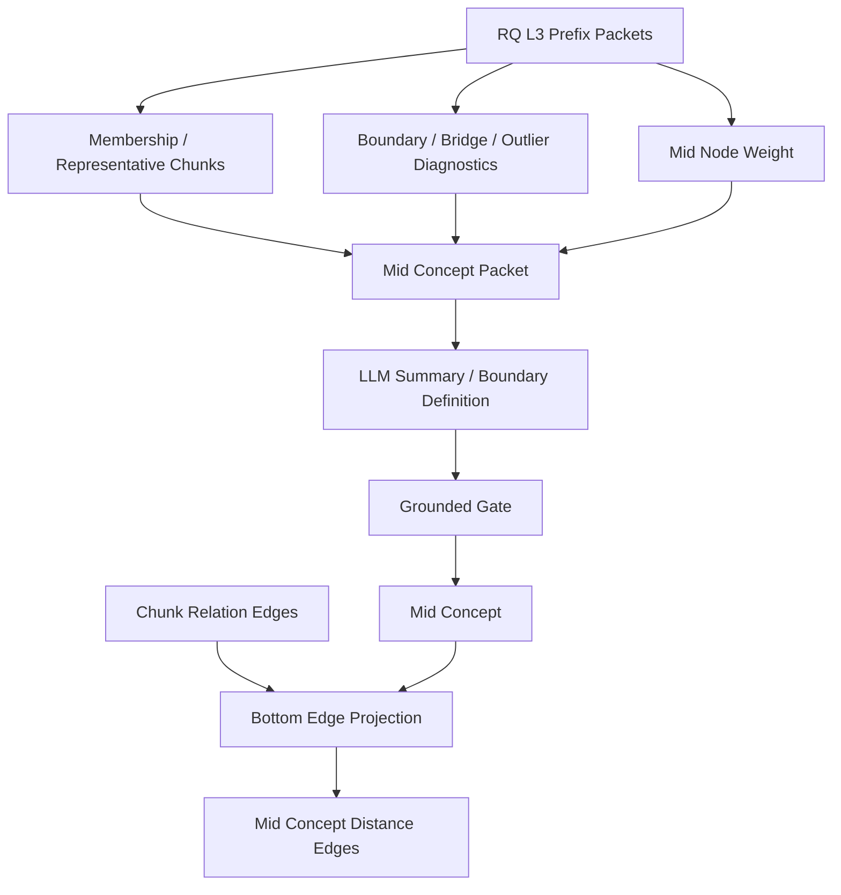

### RQ L3 aggregation

目标 active mid concept 由 RQ L3 prefix packet 生成。设 \(\mathcal{P}_3\) 为 active RQ L3 prefixes，中粒度候选集合为：

$$
\mathcal{M}^{cand}
=
\{m_p:\ p\in\mathcal{P}_3,\ \operatorname{mass}(p)>0\}
$$

每个候选 \(m_p\) 必须保留：

```text
support_rq_prefix = rq_l3_prefix
parent_rq_l2_prefix
parent_rq_l1_prefix
representative_chunk_ids
support_chunk_ids
core_chunk_ids
boundary_chunk_ids
bridge_chunk_ids
outlier_chunk_ids
structure_paths
membership_mass
membership_entropy
residual_norm_stats
raw_node_weight
node_weight
node_weight_normalization_scope
display_terms_json
summary
internal_state_json
```

中粒度节点权重来自 RQ L3 packet 的证据规模、归属清晰度、内部底层边密度、边界比例和摘要置信度：

$$
w_M^{raw}(m_p)
=
\operatorname{Score}
\left(
\log(1+|S_C(p)|),
\operatorname{mass}(p),
\operatorname{core\_ratio}(p),
\operatorname{density}_{E_C}(p),
1-\operatorname{boundary\_ratio}(p),
1-\operatorname{outlier\_ratio}(p),
\operatorname{summary\_confidence}(p)
\right)
$$

每个 mid state 内做同层归一化：

$$
w_M(m_f)
=
\operatorname{LayerNorm}_M
\left(
w_M^{raw}(m_f);
\{w_M^{raw}(m'):m'\in V_M\}
\right)
\in[0,1]
$$

其中 `node_weight` 只在 mid layer 内可比较，用于预算控制、展示、入口候选辅助和同等路径下的 tie-break，不表示用户问题相关性，不与 coarse 或 chunk 权重跨层比较，不替代路径搜索，也不能形成“大节点优先”的 active retrieval 规则。


### Concept packet

目标 concept packet：

$$
P_m
=
\left(
p_3,S_c,S_{core},S_{boundary},S_{bridge},S_{outlier},E_C^{in},E_C^{cross},D_R,W_m,X_m
\right)
$$

其中 \(p_3\) 是 RQ L3 prefix，\(S_c\) 是 membership 支撑 chunk 集合，\(S_{core}\)、\(S_{boundary}\)、\(S_{bridge}\)、\(S_{outlier}\) 是按 membership role 切分的支撑集合，\(E_C^{in}\) 是 L3 内部底层边，\(E_C^{cross}\) 是跨 L3 底层边，\(D_R\) 是 RQ residual 与 membership diagnostics，\(W_m\) 是 node weight diagnostics，\(X_m\) 是 chunk excerpts、source spans 与 structure paths。

packet 字段包括 packet id、RQ L3 prefix、candidate labels、display terms、node summary、node weight、representative chunk ids、support/core/boundary/bridge/outlier counts、membership role distribution、residual diagnostics、chunk excerpts、structure paths 和 grounding hash。

### LLM 定义

目标 LLM 输出：

$$
y_m
=
f_{\mathrm{LLM}}
\left(
P_f,\ prompt_{\mathrm{mid}}
\right)
$$

输出必须可解析为：

```text
canonical_label
aliases
display_terms_json
summary
definition
scope_note
inclusion_criteria
exclusion_criteria
internal_state_json
representative_chunk_ids
support_chunk_ids
confidence
why_this_concept_exists
```

LLM 只负责命名、展示短语、摘要、范围、包含/排除标准、内部状态解释和证据充分性解释，不负责创建底层边，不负责决定 chunk membership，不负责决定 chunk 事实，也不能把多个 RQ L3 prefixes 合并成一个 active mid concept。


### 写入规则

目标 grounded gate：

$$
\operatorname{accept}(m)
=
\mathbf{1}
\left[
S_C(m)\ne \varnothing
\land
\operatorname{RQPrefixLevel}(m)=3
\land
S_C(m)\subseteq support(prefix_3(m))
\land
\forall c\in S_C(m),\ Span(c)\ne\varnothing
\land
\operatorname{SummaryGrounded}(m)
\right]
$$


### Concept edges

目标 mid concept edge 由跨 RQ L3 membership 的底层 chunk relation edges 投影而来。若两侧 support chunks 之间存在可审计 \(E_C\) 边，则写入 mid edge：

$$
E_M
=
\left\{
(m_a,m_b):
\exists c_i,c_j,\ (c_i,c_j)\in E_C
\land
\mu_{c_i,m_a}>0
\land
\mu_{c_j,m_b}>0
\right\}
$$

中粒度边距离先从底层 chunk relation edge 的 normalized distance 与 membership support 聚合，得到 raw projected distance：

$$
d_{M}^{raw}(m_a,m_b)
=
\frac{
Q_{0.15}\left(\{d_e:(i,j,e)\in S_{ab}^{C}\}\right)
}{
1+\log(1+n_{ab})
}
$$

其中：

$$
S_{ab}^{C}
=
\{(i,j,e)\in E_C:\mu_{i,m_a}>0,\ \mu_{j,m_b}>0\}
$$

$$
n_{ab}
=
\sum_{(i,j,e)\in S_{ab}^{C}}
\mu_{i,m_a}\mu_{j,m_b}
$$

\(Q_{0.15}\) 是低分位距离，避免被单条最小噪声边完全支配；\(n_{ab}\) 是 membership 加权 support mass，支持越多 raw projected distance 越短。

由于该投影聚合会改变距离分布，active mid edge distance 必须再按 `layer=mid` 与 `edge_type` 做投影校准：

$$
s_M^{raw}(m_a,m_b)
=
\exp(-d_M^{raw}(m_a,m_b))
$$

$$
s_M(m_a,m_b)
=
\operatorname{Calib}_{mid,t}
\left(
s_M^{raw}(m_a,m_b);
\operatorname{ProjectionStats}_{mid,t},
\operatorname{ProjectionProtocol}_{mid,t}
\right)
$$

$$
d_M(m_a,m_b)
=
-\log(\max(\epsilon,s_M(m_a,m_b)))
$$

active traversal 使用 \(d_M\)，不是 \(d_M^{raw}\)。边必须保存：

```text
support_rq_prefix_ids
support_chunk_edge_ids
support_chunk_ids
distance
projected_distance_raw
projected_strength_raw
raw_strength_summary
projection_normalization_stats_json
edge_projection_protocol_hash
edge_type
diagnostics_json
```

边类型由底层主导证据决定：

```text
co_occurs_with
depends_on
contrasts_with
bridge_to
same_method_family
same_evidence_region
```

LLM 可以解释边语义，但不能在没有底层 chunk relation edge evidence 时创建 active mid edge。RQ prefix sibling、centroid-near、membership overlap 和 L1/L2 parent relation 只进入 diagnostics，不进入 edge existence gate。


**架构影响：**
- 影响对象：coarse concept aggregation、coarse concept definition、concept routing、Agent planning、context package coverage、citation grounding 和 answer synthesis。
- 影响方式：mid concepts 与 RQ L3 prefixes 对齐，提供用户可读语义节点、LLM 可读摘要和稳定 chunk seed 集合；mid edges 是底层 chunk relation edges 的 membership 加权投影；support spans 决定概念能否参与检索、回答和引用验证。
- 传播字段：`mid_concept_state_id`、`mid_concepts`、`mid_concept_memberships`、`mid_concept_edges`、`mid_concept_definitions`、`display_terms_json`、`summary`、`internal_state_json`、`support_rq_prefix_ids`、`support_chunk_edge_ids`、`support_chunk_ids`、`representative_chunk_ids`、`node_weight`、`support_spans_json`、`projected_distance_raw`、`projection_normalization_stats_json`、`edge_projection_protocol_hash`、`distance`、`grounding_hash`。
- 触发条件：RQ L3 membership hash、bottom chunk edge distance、LLM prompt protocol、concept packet、support span 或 grounded gate 变化时，coarse graph、graph traversal trace、context package 和 cache 需要刷新。
- 验收观察点：RQ L3-to-mid projection coverage、mid concept grounded rate、node summary grounded rate、support chunk coverage、node weight diagnostics、edge support density、raw projected distance distribution、calibrated mid distance distribution、projection calibration diagnostics、concept path accuracy 和 unsupported concept diagnostics。

## Coarse Concept Graph

### 架构图

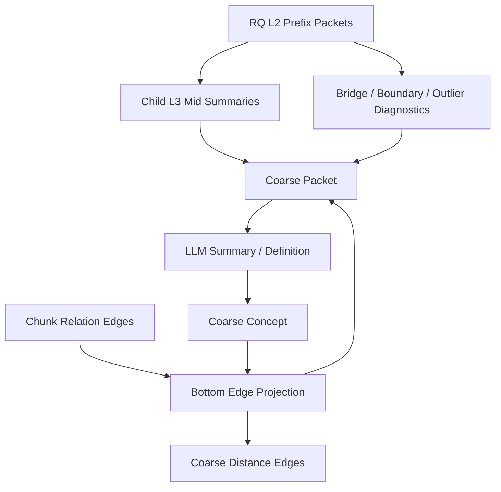

### RQ L2 grouping

目标 coarse graph 由 RQ L2 prefix packets 生成。辅助分组只作为诊断和可视化参考，不决定 active coarse node。设 \(\mathcal{P}_2\) 为 active RQ L2 prefixes：

$$
\mathcal{K}^{cand}
=
\{k_p:p\in\mathcal{P}_2,\operatorname{mass}(p)>0\}
$$

每个 coarse candidate 聚合其 child L3 mid summaries、chunk membership、底层边投影、边界/桥接/outlier 诊断和结构路径：

```text
support_rq_l2_prefix
parent_rq_l1_prefix
child_rq_l3_prefix_ids
included_mid_concept_ids
boundary_mid_concept_ids
bridge_mid_concept_ids
outlier_mid_concept_ids
support_chunk_edge_ids
cross_prefix_weak_support
support_chunk_ids
membership_mass
membership_entropy
residual_norm_stats
raw_node_weight
node_weight
node_weight_normalization_scope
display_terms_json
summary
internal_state_json
```

粗粒度节点权重来自 RQ L2 packet 的证据覆盖、child L3 质量、内部底层边密度、桥接状态、边界比例和摘要置信度：

$$
w_K^{raw}(k)
=
\operatorname{Score}
\left(
\log(1+|L3_k|),
\log(1+|support(k)|),
\operatorname{density}_{E_C}(k),
\operatorname{child\_quality}(k),
\operatorname{bridge\_state}(k),
1-\operatorname{boundary\_ratio}(k),
1-\operatorname{outlier\_ratio}(k),
\operatorname{summary\_confidence}(k)
\right)
$$

每个 coarse state 内做同层归一化：

$$
w_K(k)
=
\operatorname{LayerNorm}_K
\left(
w_K^{raw}(k);
\{w_K^{raw}(k'):k'\in V_K\}
\right)
\in[0,1]
$$

其中 `node_weight` 只在 coarse layer 内可比较，用于 coarse entry 候选辅助、coarse 层 hard interrupt 上限的局部分配、coarse -> mid 下钻配额、overview/survey 类问题的主题覆盖提示和同等路径下的 tie-break；它不表示查询相关性，不与 mid/chunk 权重跨层比较，也不能替代 query-entry 匹配、累计路径距离或 LLM gray-zone decision。


### Coarse packet

目标 coarse packet：

$$
P_k
=
\left(
p_2,M_{child},S_c,E_C^{in},E_C^{cross},B_k,O_k,W_k,N_k
\right)
$$

其中 \(p_2\) 是 RQ L2 prefix，\(M_{child}\) 是 child RQ L3 mid summaries，\(S_c\) 是 support chunks，\(E_C^{in}\) 是 L2 内部底层边，\(E_C^{cross}\) 是跨 L2 底层边，\(B_k\) 是 bridge diagnostics，\(O_k\) 是 outlier/noise diagnostics，\(W_k\) 是 cross-prefix weak support，\(N_k\) 是 coarse node weight diagnostics。

packet 包含 RQ L2 prefix、child L3 ids、child mid display terms、child summaries、support chunks、bridge concepts、outlier states、raw node weight、normalized node weight、normalization scope、display terms、summary、internal state 和 grounding hash。

### 写入规则

目标 grounded definition：

$$
k
=
f_{\mathrm{LLM}}(P_k,prompt_{\mathrm{coarse}})
$$

并满足：

$$
support(k)
=
\{c:\mu_{c,p_2(k)}>0\}
$$

LLM 输出必须包含 `display_terms_json`、`summary`、`scope_note`、`inclusion_criteria_json`、`exclusion_criteria_json` 和 `internal_state_json`。写入要求 `CoarseConcept`、`CoarseConceptMembership`、`CoarseConceptDefinition`。membership role 至少区分 `included`、`boundary`、`bridge`、`outlier` 和 `low_confidence`。

### Coarse edges

目标 coarse edge 由跨 RQ L2 membership 的底层 chunk relation edges 投影而来。若两个 coarse nodes 之间存在底层 support chunk edge，则建立 coarse edge：

$$
E_K
=
\left\{
(k_a,k_b):
\exists c_i,c_j,\ (c_i,c_j)\in E_C
\land
\mu_{c_i,k_a}>0
\land
\mu_{c_j,k_b}>0
\right\}
$$

距离先从 support chunk relation edges 聚合为 raw projected distance：

$$
d_K^{raw}(k_a,k_b)
=
\frac{
Q_{0.15}\left(\{d_e:(i,j,e)\in S_{ab}^{C,K}\}\right)
}{
1+\log(1+n_{ab}^{C})
}
$$

其中：

$$
S_{ab}^{C,K}
=
\{(i,j,e)\in E_C:\mu_{i,k_a}>0,\ \mu_{j,k_b}>0\}
$$

$$
n_{ab}^{C}
=
\sum_{(i,j,e)\in S_{ab}^{C,K}}
\mu_{i,k_a}\mu_{j,k_b}
$$

由于 coarse projection 会改变距离分布，active coarse edge distance 必须按 `layer=coarse` 与 `edge_type` 做投影校准：

$$
s_K^{raw}(k_a,k_b)
=
\exp(-d_K^{raw}(k_a,k_b))
$$

$$
s_K(k_a,k_b)
=
\operatorname{Calib}_{coarse,t}
\left(
s_K^{raw}(k_a,k_b);
\operatorname{ProjectionStats}_{coarse,t},
\operatorname{ProjectionProtocol}_{coarse,t}
\right)
$$

$$
d_K(k_a,k_b)
=
-\log(\max(\epsilon,s_K(k_a,k_b)))
$$

active traversal 使用 \(d_K\)，不是 \(d_K^{raw}\)。粗粒度边必须保存：

```text
support_mid_concept_ids
support_child_mid_edge_ids
support_chunk_edge_ids
support_chunk_ids
distance
projected_distance_raw
projected_strength_raw
raw_strength_summary
projection_normalization_stats_json
edge_projection_protocol_hash
edge_type
cross_prefix_weak_support
```

粗粒度边可以很弱，但不能丢弃。图导航时弱边会因距离大而排在队列后方；若问题需要跨主题或 LLM 判定临界边有价值，仍可被探索。RQ L2 sibling、shared L1 parent、child mid adjacency 和 membership overlap 只进入 diagnostics；没有底层 support chunk edge 时不能创建 active coarse edge。


### Diagnostics

目标 diagnostics：

$$
D_k
=
\left(
Q,\phi,B,stability,singleton\_rate,bridge\_density
\right)
$$

coarse diagnostics 必须保存 RQ L2 coverage、child L3 coverage、membership entropy、residual norm distribution、bridge density、boundary ratio、outlier ratio、cross prefix edge count、internal edge count、raw projected distance distribution 和 projection calibration diagnostics。

**架构影响：**
- 影响对象：coarse entry selection、mid concept drilldown、cross-document synthesis、Agent coarse jump、retrieval cache、graph overview 和质量诊断。
- 影响方式：coarse concepts 决定查询先进入哪些 RQ L2 高层主题区域；coarse edges 是底层 chunk relation edges 的 membership 加权投影，保留跨主题弱边和桥接状态，供优先队列图导航探索。
- 传播字段：`coarse_concept_state_id`、`coarse_concepts`、`coarse_concept_memberships`、`coarse_concept_edges`、`coarse_concept_definitions`、`support_rq_l2_prefix`、`child_rq_l3_prefix_ids`、`bridge_mid_concept_ids`、`support_chunk_edge_ids`、`display_terms_json`、`summary`、`internal_state_json`、`raw_node_weight`、`node_weight`、`node_weight_diagnostics_json`、`projected_distance_raw`、`projection_normalization_stats_json`、`edge_projection_protocol_hash`、`distance`、`freshness_hash`。
- 触发条件：RQ L2 membership state、child L3 summaries、bottom chunk edges、coarse summary protocol、bridge diagnostics 或 traversal edge protocol 改变时，coarse hash、retrieval trace 和 graph payload 需要刷新。
- 验收观察点：RQ L2 coverage、child L3 coverage、bridge density、coarse node summary grounding、coarse node weight diagnostics、coarse entry hit rate、coarse-to-mid drilldown path、cross prefix edge count、raw projected coarse distance distribution、calibrated coarse edge distance distribution、projection calibration diagnostics 和 staged traversal contribution。

## Layered Retrieval

### 目标检索链路

目标检索不是全局加权排序，也不是单个全局 frontier 从 coarse、mid、chunk 连续抢占预算，而是分层暂存的图导航。系统先在 coarse graph 内完成粗粒度探索，形成 coarse node queue，暂不下钻 mid；随后逐个 coarse 父节点下钻探索 mid candidates，合并去重后按层内 priority key 取 mid top-k 形成 mid node queue；最后逐个 mid 父节点下钻探索 chunk candidates，合并去重后按层内 priority key 取 chunk top-k 进入 structure restoration 与 context package。RQ membership/address 不作为额外 active traversal layer，而是作为节点归属、chunk seed selector、模糊边界诊断和灰区路径判断上下文。

目标链路：

```text
query
-> query intent and facets
-> choose coarse entry nodes
-> priority-queue walk on coarse graph
-> collect coarse node queue
-> for each coarse node: drill down to mid graph with per-coarse budget
-> merge and dedupe all mid candidates
-> rank all mid candidates and keep mid top-k
-> use RQ L3 membership to select chunk seeds
-> for each selected mid node: walk chunk relation graph with per-mid budget
-> merge and dedupe all chunk candidates
-> rank all chunk candidates and keep chunk top-k
-> structure restoration
-> context package
```

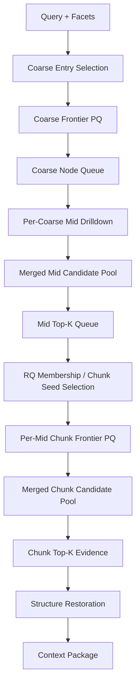


### Entry selection

入口选择使用三类信号：语义候选、拓扑先验和 LLM 语义判定。active traversal layer 包括 coarse、mid 和 chunk relation graph；coarse entry selection 只决定粗粒度探索起点，mid 与 chunk entry 由上一层保留队列逐父节点下钻生成。RQ membership/address 作为 mid 节点归属、chunk seed selection 和边界诊断输入。拓扑指标是 prior，不是事实源，也不单独决定入口。

节点候选卡片：

```text
node_id
layer
label
definition_or_summary
support_count
centrality
betweenness
k_core
pagerank_or_closeness
boundary_or_bridge_role
matched_query_facets
```

语义候选：

$$
Sem(v,q)
=
\operatorname{Match}
\left(
facets(q),label(v),definition(v),aliases(v)
\right)
$$

拓扑先验：

$$
Topo(v)
=
\left(
kcore(v),betweenness(v),pagerank(v),bridge(v),boundary(v)
\right)
$$

入口策略按 query intent 选择：

```text
definition / local lookup:
  semantic anchors first; topology only breaks ties.

overview / survey:
  high k-core / PageRank nodes plus semantic anchors.

comparison / relation:
  multiple semantic anchors plus high-betweenness bridge nodes.

multi-hop / synthesis:
  anchors, boundary nodes and bridge nodes are all admitted.
```

LLM 只在入口候选灰区或 query facet 难以映射时裁决，输出 typed action：

```text
select_entry_nodes(layer, node_ids, reason, expected_evidence, budget)
```

coarse 下钻到 mid graph 时，系统对每个 coarse 父节点独立执行局部探索，收集该父节点覆盖的 mid candidates；所有 coarse 父节点完成后，mid candidates 合并去重并按层内 priority key、路径证据和贡献摘要排序，保留 `agent_mid_top_k` 个 mid 节点进入下一层队列。coarse 层不设置 top-k；coarse queue 中的所有保留父节点都获得各自的 mid 下钻预算。

mid 下钻到 chunk relation graph 时，RQ L3 membership 负责选择入口 chunk seeds，而不是把 mid 节点下所有 chunks 全量送入 frontier。系统对每个 selected mid 父节点独立执行局部 chunk 探索；所有 mid 父节点完成后，chunk candidates 合并去重并按层内 priority key、路径证据、citation span 可用性和结构恢复需求排序，保留 `agent_chunk_top_k` 个 chunk 进入 context package：

```text
core_member_chunks
representative_chunks
boundary_chunks
bridge_chunks
query_matched_chunks
structure_restoration_required_chunks
```

seed card 必须携带 RQ membership diagnostics：

```text
rq_l3_prefix_id
membership_score
membership_role
rq_path
rq_lcp_depth
bridge_or_boundary_role
node_weight
support_edge_ids
```

节点权重必须按层归一化：

```text
coarse_node_weight:
  在 coarse state 内归一化，只比较 coarse nodes。

mid_node_weight:
  在 mid state 内归一化，只比较 mid nodes。

chunk_seed_weight:
  在当前候选 seed set 内归一化，只比较同一批 chunk seeds。
```

权重只能影响 seed quota、局部 expansion cap、context package soft quota、展示大小和同等路径下的 tie-break；不能跨层比较，不能代表查询相关性，不能替代累计路径距离、edge support 或 LLM gray-zone decision。

### Multi-label priority queue walk

搜索状态是一条路径标签，而不是单个节点：

```text
state = {
  traversal_stage,
  layer,
  parent_layer,
  parent_node_id,
  node_id,
  path,
  distance_so_far,
  reward_so_far,
  covered_facets,
  evidence_roles,
  depth,
  visit_counts,
  support_refs
}
```

边扩展：

$$
D(P')
=
D(P)+d_e+\operatorname{Penalty}(P,e)
$$

其中 \(D(P')\) 是从当前 active layer 的当前父节点入口到待探索节点的累计路径距离。导航判断以路径是否有知识价值为核心，预算不参与路径价值排序，只作为硬熔断器。

路径距离分区：

$$
Zone(P)
=
\begin{cases}
green,&D(P)\le\tau_{\mathrm{green}}\\
gray,&\tau_{\mathrm{green}}<D(P)\le\tau_{\mathrm{gray}}\\
hard\_stop,&D(P)>\tau_{\mathrm{hard}}
\end{cases}
$$

`green` 路径由 executor 自动继续；`gray` 路径生成 observation packet 交给 LLM evaluator 判断是否仍有探索价值；`hard_stop` 路径直接剪枝，不再展开。

奖励：

$$
R(P')
=
R(P)
+G_{\mathrm{facet}}(P',q)
+G_{\mathrm{evidence}}(P')
+G_{\mathrm{bridge}}(P')
+G_{\mathrm{cycle}}(P')
$$

优先队列排序使用词典序 key，而不是跨信号线性加权：

$$
Key(P)
=
\left(
|Facets(q)\setminus Covered(P)|,
D(P)-R(P),
depth(P),
-|EvidenceRoles(P)|
\right)
$$

队列每次弹出 lexicographic minimum state。这样边字段仍保留为距离，环和桥接路径可以通过 bounded reward 提升，但不会出现全局拍脑袋系数混排。

优先队列只在当前层或当前父节点的局部探索中决定弹出顺序；不同 coarse 父节点和不同 mid 父节点之间不共享一个会耗尽全局预算的 frontier。层间 candidate pool 的排序也使用同一类 key 与 contribution summary，但排序发生在该层所有父节点探索完成之后。若某层无 hard cap 且所有候选都被完整枚举，优先队列与普通 FIFO 队列得到的最终集合相同；只要存在 per-parent budget、top-k、gray-zone stop、distance threshold 或时间上限，优先队列决定哪些路径先被探索、哪些候选进入层间 top-k。

LLM gray-zone evaluator 只处理临界路径，不接管队列排序。输入 observation 必须包含：

```text
current_layer
path_distance
covered_facets
missing_facets
new_evidence_roles
rq_membership_diagnostics
bridge_or_boundary_reason
candidate_chunk_span_summary
drift_risk
```

LLM 输出 typed decision：

```text
continue_path
stop_path_irrelevant
follow_as_bridge
drill_down_layer
request_structure_closure
```

### Cycle handling and convergence

不使用节点级 visited 禁止环。环可能表示多条路径收敛到同一概念或证据区域，应转化为贡献。系统使用路径级 / label 级 visited 与 dominance pruning。

状态签名：

```text
state_signature =
  (layer, node_id, covered_facets, evidence_roles, depth_bucket, path_edge_type_multiset)
```

同一节点保留 top \(M\) 个非支配 label。若已有 label \(L_a\) 满足：

$$
D(L_a)\le D(L_b),\quad
Covered(L_a)\supseteq Covered(L_b),\quad
Roles(L_a)\supseteq Roles(L_b),\quad
depth(L_a)\le depth(L_b)
$$

则 \(L_b\) 被支配并剪枝。

环奖励按环上累计距离递减。若路径重新到达已访问节点 \(v\)，取从上一次 \(v\) 到当前 \(v\) 的闭环边集合 \(C(P')\)，其距离和为：

$$
L_{\mathrm{cycle}}(P')
=
\sum_{e\in C(P')}d_e
$$

环奖励：

$$
G_{\mathrm{cycle}}(P')
=
\mathbf{1}[L_{\mathrm{cycle}}(P')\le\tau_{\mathrm{cycle}}]
\cdot
\min
\left(
B_{\mathrm{cycle}}-R_{\mathrm{cycle}}(P),
\alpha\log(1+\Delta support(P'))\exp\left(-\frac{L_{\mathrm{cycle}}(P')}{\tau_c}\right)
\right)
$$

短而强的环表示多条路径收敛到同一证据区，允许有限奖励；长而弱的环不给奖励。环奖励总量仍受 `max_cycle_reward_per_path` 限制。

staged traversal 使用分层预算作为硬打断，预算不参与导航价值判断。预算的计数单位是当前目标层的 accepted labels / popped states；edge expansion count、time 和 depth 作为附加安全熔断记录在 diagnostics 中：

```text
agent_coarse_total_budget
agent_mid_per_coarse_budget
agent_mid_top_k
agent_chunk_per_mid_budget
agent_chunk_top_k
max_depth_per_layer
max_labels_per_node
max_edge_reuse
max_cycle_reward_per_path
max_time_ms
context_package_token_budget
```

粗粒度层使用 `agent_coarse_total_budget` 探索 coarse nodes，生成 coarse node queue，不设置 coarse top-k。中粒度层对 coarse node queue 中的每个父节点分别使用 `agent_mid_per_coarse_budget` 探索 mid candidates；所有 mid candidates 汇总、去重、排序后，使用 `agent_mid_top_k` 形成 mid node queue。底层对 mid node queue 中的每个父节点分别使用 `agent_chunk_per_mid_budget` 探索 chunk candidates；所有 chunk candidates 汇总、去重、排序后，使用 `agent_chunk_top_k` 形成进入 context package 的 hit chunks。`agent_mid_top_k` 与 `agent_chunk_top_k` 是层间输出上限，不是裸向量召回结果，也不能绕过 trace、structure restoration 或 citation verification。

中粗层派生双语路由文本：`concept_i18n_enabled` 是热加载 Runtime Settings，环境键为 `CONCEPT_I18N_ENABLED`，默认关闭。关闭时 mid/coarse concept graph 不执行 `concept_i18n_bilingual_v1`，不调用模型、不写成功翻译 metadata，只在 diagnostics/log 中记录 `status=disabled`；开启后，mid/coarse concept graph 在节点和边写入后执行 `concept_i18n_bilingual_v1` 派生翻译，覆盖 concept label、aliases、definition、summary、scope note 以及高层概念边 explanation。翻译结果只作为可重建的派生 metadata 保存；只有开关开启且翻译 `status=ok` 时，才用于 coarse/mid entry selection 的 searchable text 扩展。翻译结果不能覆盖 `canonical_label`、`definition`、`summary`、`scope_note`、edge `explanation`、support ids、distance、projection stats 或 citation payload。前端图谱页默认继续展示 canonical source fields；回答生成和引用验证仍只能依赖 context package 与 raw chunk span。

派生双语路由文本必须进入 concept state diagnostics/hash：当 `concept_i18n_enabled`、`concept_i18n_bilingual_v1` 输出、失败状态或协议版本变化时，mid/coarse concept hash、context graph hash、retrieval trace 和相关 cache key 必须随之变化。若翻译模型不可用，只能记录 `status=unavailable` 或 fallback 状态；fallback 原文不得伪装为成功翻译，也不得作为事实证据或 citation 来源。

算法收敛条件：

```text
frontier_empty
hard_budget_hit
per_parent_budget_hit
layer_top_k_cut
path_distance_hard_stop
llm_stop_layer_irrelevant
llm_stop_layer_sufficient
llm_drilldown_ready
all_required_facets_covered
independent_support_paths >= threshold
evidence_roles_saturated
frontier_best_key worse than accepted evidence margin
context_budget_pressure
```

LLM evaluator 可以提前停止灰区路径或当前层，但不负责保证终止；硬预算、硬距离阈值、深度和 label 上限保证必停。LLM 判断围绕“继续探索是否还会带来与用户问题有关的新证据”，而不是围绕剩余预算：

```text
sufficient
need_more_same_node
need_bridge_jump
need_mid_expansion
need_chunk_expansion
need_structure_closure
insufficient_corpus
```

### Duplicate contribution and context de-duplication

重复到达同一节点不重复喂给 LLM，而是增加路径贡献：

```text
node_visit_count
distinct_parent_count
distinct_path_count
distinct_edge_type_count
covered_facets
support_chunk_union
cycle_convergence_score
```

最终 context package 使用基础去重粒度：

```text
chunk_id
citation_span
document_version_id + char_span
```

相同 chunk 只进入 context package 一次；多条路径、多个 RQ membership 或多个概念命中只合并到 contribution summary。结构闭包可以追加上下文窗口，但不把不同 raw spans 做语义合并。

但保留 path summary：

```text
why_selected:
  reached_by_paths
  query_facets
  evidence_roles
  graph_paths
  convergence_score
```

### Retrieval trace

目标 trace 是每层入口、局部 frontier、父节点下钻、candidate pool、top-k 截断、路径、收敛和去重的审计记录：

$$
\tau_q
=
\left(
Entry_3,Frontier_3,Queue_3,Path_3,
Drilldown_{3\to2},Pool_2,TopK_2,Path_2,
Drilldown_{2\to C},Pool_C,TopK_C,Path_C,
D_{\mathrm{rq}},\mathbf{h},D_{\mathrm{conv}}
\right)
$$

`RetrievalTrace` 保存 query、filters、retrieval mode、各层 hash、runtime settings hash、agent envelope hash、prompt protocol hash、result chunks、concept path、scores 和 diagnostics。

目标 `GraphRetrievalStep` 写入：

```text
coarse / select_entry_nodes
coarse / staged_priority_queue_walk
coarse / collect_node_queue
mid / drill_down_each_coarse
mid / merge_dedupe_rank_top_k
chunk / select_seeds_from_mid_rq_membership
chunk / drill_down_each_mid
chunk / merge_dedupe_rank_top_k
chunk / gray_zone_llm_decision
structure / restore_context_package
```

RQ diagnostics 保留为 semantic address、membership diagnostics 和 chunk path evidence：

$$
D_{\mathrm{rq}}(q,c)
=
\left(
path(q),path(c),LCP(q,c),\|r_q-r_c\|,s_{\mathrm{rq}}
\right)
$$

result metadata 与 trace steps 保存 query/candidate RQ path、LCP depth、residual distance、RQ score 和 drift penalty。


**架构影响：**
- 影响对象：搜索页结果、QA/Agent retrieval step、context package、citation payload、reward metrics、policy update 和前端检索轨迹。
- 影响方式：layered retrieval 从加权融合排名改为 coarse/mid/chunk/structure 的 staged path search；RQ membership/address 作为语义地址贯穿 mid candidate collection、chunk seed selection、桥接路径解释和灰区 LLM 判停；trace 必须可回放每个 entry、局部 frontier pop、父节点下钻、candidate pool 合并、top-k 截断、edge expansion、cycle distance reward、gray-zone decision、dominance pruning、收敛判断和 context 去重。
- 传播字段：`retrieval_trace_id`、`graph_retrieval_steps`、`result_chunk_ids`、`concept_path_json`、`frontier_json`、`stage_queues_json`、`candidate_pools_json`、`topk_selection_json`、`path_labels_json`、`convergence_json`、`diagnostics_json`、`runtime_settings_hash`。
- 触发条件：query facets、relation/RQ/mid/coarse hash、edge distance protocol、traversal budget、agent envelope 或 conversation scope 变化时，graph traversal trace 与 cache key 需要刷新。
- 验收观察点：entry node 选择可解释、coarse queue 覆盖、per-coarse mid candidate coverage、mid top-k selection audit、per-mid chunk candidate coverage、chunk top-k selection audit、chunk seed quality、frontier expansion count、path convergence score、gray-zone LLM decision audit、cycle distance reward bounded、dominance pruning count、structure restore step、RQ diagnostics、cache hit audit 和 evidence package de-duplication。

## Layered P&E Agent

### 架构图

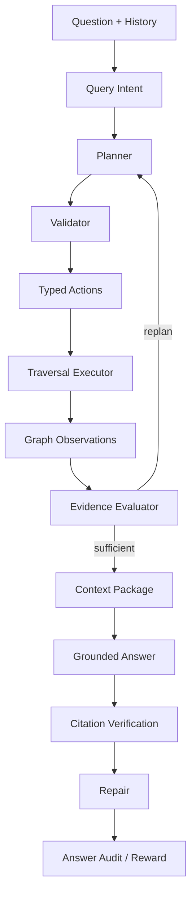

目标上，Agent 可建模为受约束的部分可观测决策过程：

$$
\pi^\star
=
\operatorname*{arg\,max}_{\pi}
\mathbb{E}_{a_t\sim\pi}
\left[
\sum_t r(o_t,a_t)
\right]
$$

约束：

$$
a_t\in\mathcal{A}_{typed},\quad
cost(a_t)\le budget_t,\quad
evidence(a_t)\subseteq \mathcal{G}\cup E
$$

### Query intent

目标 query intent：

$$
z_q
=
g(q,H)
=
(intent,entities,subqueries,needs\_graph)
$$


### Typed action space

action space：

```text
activate_coarse_concepts
route_mid_concepts
route_rq_addresses
select_entry_nodes
walk_graph_frontier
drill_down_layer
evaluate_gray_zone_path
recall_chunks
restore_context_package
build_context_package
verify_citations
repair_missing_citation
repair_concept_gap
repair_bridge_gap
repair_structure_context
```

目标 action schema：

$$
a
=
\left(
type,target\_ids,reason,budget,expected\_evidence,stop
\right)
$$

必需 action 集合：

$$
\mathcal{A}_{req}
=
\{select\_entry\_nodes,walk\_graph\_frontier,recall\_chunks,restore\_context\_package,verify\_citations\}
$$

LLM 允许裁决的动作只包括语义入口、灰区路径、桥接价值、下钻时机和证据充分性：

```text
select_entry_nodes
continue_path
stop_path_irrelevant
follow_as_bridge
drill_down
jump_bridge
stop_and_collect_chunks
need_more_evidence
```

LLM 不直接写底层边，不执行数据库检索，不修改边的距离字段。

### Validator

目标 validator：

$$
\operatorname{valid}(a)
=
\mathbf{1}
\left[
type(a)\in\mathcal{A}_{typed}
\land
budget(a)\le B
\land
target(a)\subseteq IDs(\mathcal{G})
\right]
$$


### Operating envelope

目标 envelope：

$$
B
=
\left(
B_{coarse},B_{mid|coarse},K_{mid},B_{chunk|mid},K_{chunk},
B_{depth},B_{labels},B_{edge\_reuse},B_{cycle},B_{restore},
B_{context},B_{plan},B_{repair},B_{verify}
\right)
$$

目标字段：

```text
agent_coarse_total_budget
agent_mid_per_coarse_budget
agent_mid_top_k
agent_chunk_per_mid_budget
agent_chunk_top_k
max_depth_per_layer
max_labels_per_node
max_edge_reuse
max_cycle_reward_per_path
path_distance_green_threshold
path_distance_gray_threshold
path_distance_hard_threshold
cycle_reward_distance_threshold
candidate_pool_dedupe_budget
structure_restore_budget
context_package_token_budget
planning_round_budget
max_typed_actions_per_round
repair_round_budget
verification_budget
allowed_relation_types
required_restore_modes
```


### Execution

目标 P&E loop：

$$
o_t=\operatorname{Execute}(a_t,\mathcal{G},E_t),\quad
a_{t+1}=\pi(q,H,o_{\le t})
$$

目标执行器由 deterministic traversal executor 负责图搜索：

```text
perceive intent and query facets
planner selects coarse entry policy
validator checks ids, schema, budget and allowed edge types
executor runs staged multi-label priority queue walk
executor returns bounded graph observations
LLM evaluator judges evidence sufficiency
if insufficient, planner emits typed repair / expansion action
context package builder deduplicates chunks and restores structure
answer generator uses context package only
citation verifier checks raw spans
```

灰区路径裁决：

$$
Gray(P)
=
\mathbf{1}
\left[
D(P)\in(\tau_{\mathrm{green}},\tau_{\mathrm{gray}}]
\lor \exists e\in tail(P): edge\_type(e)\in E_{semantic\_uncertain}
\lor crossing\_rq\_boundary(P)
\right]
$$

其中 \(tail(P)\) 是当前路径最近一次扩展涉及的候选边集合。当 \(Gray(P)=1\) 时，executor 生成 path packet：

```text
current_query_facet
current_node_card
candidate_neighbor_card
edge_evidence_summary
path_distance
distance_zone
rq_membership_diagnostics
bridge_or_boundary_reason
support_refs
```

LLM 只能返回 typed path decision，executor 再执行。若 \(D(P)>\tau_{\mathrm{hard}}\)，executor 直接剪枝，不询问 LLM。预算只作为 staged traversal 的层内或逐父节点 hard interrupt，不进入路径价值判断。


Repair 触发：

$$
\exists v\in V_{\mathrm{verify}}:\ verdict(v)\ne supported
\quad\land\quad
B_{repair}>0
$$

**架构影响：**
- 影响对象：QA 链路、layered retrieval、context package、answer session、citation verification、repair loop、reward event 和 policy state。
- 影响方式：Agent 将用户问题、conversation state 和 graph state 转换为 typed traversal actions；validator 决定哪些动作可执行；executor 用 staged priority queue traversal 返回 observations；LLM evaluator 判断证据是否足够、灰区路径是否仍有知识价值以及是否应继续当前父节点、进入下一层 top-k 队列、执行结构恢复或走桥。
- 传播字段：`agent_runs`、`agent_plans`、`agent_actions`、`agent_observations`、`retrieval_traces`、`graph_retrieval_steps`、`context_packages`、`answer_sessions`、`citation_verifications`、`reward_events`、`policy_states`。
- 触发条件：intent、operating envelope、typed action schema、edge distance protocol、planner prompt、graph convergence failure、citation failure 或 repair budget 变化时，Agent trace 与 answer audit 需要重新生成。
- 验收观察点：typed action validation pass rate、entry selection accuracy、gray-zone path decision audit、per-parent hard interrupt usage、mid/chunk top-k audit、repair success rate、unsupported claim rate 和 reward update 写入。

## Context Package 与引用验证

### Context Package

目标 context package 是受 token budget 约束的证据选择问题：

$$
E^\star
=
\operatorname*{arg\,max}_{E\subseteq \mathcal{N}(P_{\mathrm{accepted}})}
\left[
Rel(E,q)
+Cov(E)
+Structure(E)
+Bridge(E)
-Redundancy(E)
\right]
$$

约束：

$$
\sum_{e\in E} tokens(e)\le B_{ctx}
$$

其中 \(P_{\mathrm{accepted}}\) 是 traversal executor 接受的 coarse/mid/chunk path labels。RQ membership diagnostics 作为 seed selection、bridge explanation 和 gray-zone path decision 的支撑信息进入 path summary。context package 必须去重 chunk 与 citation span，但保留重复路径带来的贡献摘要：

```text
selected_chunk_ids
citation_spans
structure_closures
graph_path_ids
reached_by_paths
distinct_parent_count
distinct_edge_type_count
cycle_convergence_score
covered_facets
why_selected
```

restoration protocol 是 `previous_next_structure_bridge_v1`。对每个 hit chunk，目标恢复：

```text
hit chunk
previous chunk
next chunk
parent structure node ids
up to 2 bridge-neighbor chunks
```

### Structure context

目标结构上下文：

$$
SC(c)
=
\left(
path(c),parent(c),siblings(c),page(c),region(c)
\right)
$$

`structure_context()` 通过 chunk mappings join structure nodes，按 coverage ratio 与 depth 排序，生成 structure path、node ids、nodes 和 parent section。

### Citation payload

目标 citation：

$$
cite_i
=
\left(
chunk\_id,document\_id,document\_version\_id,
char\_span,page\_range,section\_path
\right)
$$

citation payload 还带 document title、source path、snippet、context package id、retrieval trace id、verification id 和 verification 结果。

### Citation verification

目标上，引用验证近似自然语言蕴含：

$$
verdict(claim,e)
=
\operatorname{NLI}(claim,e)
\in
\{supported,contradicted,insufficient\}
$$

citation verification protocol 使用 `structure_plus_llm_entailment_v1`。结构规则先验证 raw span、document version、chunk id、char span、page range、section path、bbox、context package id、retrieval trace id、structure closure 和 bridge/context package 归属；LLM entailment judge 只在 context package 内判断 claim 是否被证据蕴含。verdict：

```text
supported
unsupported
missing_citation
structure_context_missing
```


**架构影响：**
- 影响对象：answer generation、citation verification、repair loop、reward metrics、policy update、QA audit 和前端证据包展示。
- 影响方式：context package 是回答生成的唯一证据输入；引用验证把 claim 重新绑定到 raw chunk span，失败时反向触发 repair search、mid expansion、bridge jump 或 structure closure。
- 传播字段：`context_package_id`、`retrieval_trace_id`、`chunk_id`、`char_span`、`page_range`、`structure_path`、`citation_verification_id`、`verification_result`。
- 触发条件：hit chunks、structure context、bridge chunks、token budget、answer claim 或 citation span 变化时，context package 与 verification 必须重新生成。
- 验收观察点：restored chunk count、previous/next 覆盖、bridge chunk 覆盖、citation pass rate、missing citation 数量和 structure context failure 数量。

## Conversation State

目标 conversation state 是任务约束与历史证据引用的状态：

$$
S_t
=
U(S_{t-1},u_t,a_t,E_t)
$$

其中 \(u_t\) 是用户输入，\(a_t\) 是答案，\(E_t\) 是 context package 引用。它不替代证据：

$$
S_t\not\models fact,\quad E_t\models fact
$$


**架构影响：**
- 影响对象：Query Router、Agent Planner、retrieval filters、context package scope、answer session、prompt protocol 和前端多轮 QA。
- 影响方式：conversation state 保存用户约束、任务状态和历史证据引用，影响下一轮意图识别和检索范围；事实仍只能来自 context package。
- 传播字段：`qa_session_id`、`transcript`、`answer_session_id`、`context_package_id`、`citation_ids`、`conversation_state_scope_hash`、`prompt_protocol_hash`。
- 触发条件：用户新增约束、任务状态变化、引用历史变化、profile prompt preference 变化或 prompt protocol 变化时，planner input 与 cache key 需要更新。
- 验收观察点：active constraints 可见、历史 context package 引用可追溯、自然对话未被硬截断、planner prompt budget 可审计。

## Runtime Settings、Profile 与策略

### Runtime settings

目标运行参数分为三类：

$$
\Theta
=
\Theta_{\mathrm{hot}}
\cup
\Theta_{\mathrm{rebuild}}
\cup
\Theta_{\mathrm{service}}
$$

`Settings` 包含数据库、Qdrant、Redis、ingestion、模型、embedding、worker、chunk、context package、mid concept、RQ、Agent budget 和 fallback 参数。目标 settings 还必须显式覆盖：

```text
edge_distance_protocol
rq_membership_protocol
edge_projection_protocol
graph_operating_point_protocol
graph_operating_point_optimizer = tpe
enable_auto_tpe
tpe_trial_budget
tpe_startup_random_trials
tpe_good_quantile_gamma
tpe_probe_query_budget
tpe_trial_timeout_seconds
tpe_candidate_pool_size
operating_point_hard_gate_max_edge_density
operating_point_hard_gate_max_isolated_ratio
operating_point_hard_gate_max_hubness_ratio
operating_point_hard_gate_min_structure_recovery_rate
operating_point_hard_gate_max_candidate_latency_p95_ms
dense_knn_k_min
dense_knn_k_max
dense_reverse_b_min_base
dense_reverse_b_max_base
dense_reverse_b_min_doc
dense_reverse_b_max_doc
dense_reverse_b_min_lang
dense_reverse_b_max_lang
dense_min_cosine
dense_strong_cosine
cross_doc_out_quota_min
cross_doc_out_quota_max
cross_doc_min_cosine
cross_language_out_quota_min
cross_language_out_quota_max
cross_language_min_cosine
edge_type_calibration_protocol
agent_coarse_total_budget
agent_mid_per_coarse_budget
agent_mid_top_k
agent_chunk_per_mid_budget
agent_chunk_top_k
label_dominance_budget
cycle_reward_cap
cycle_reward_distance_threshold
path_distance_thresholds
traversal_observation_budget
context_path_summary_budget
```

其中改变 chunking、embedding、dynamic dense KNN、bridge quota、edge type calibration、relation graph、RQ codebook、RQ membership protocol、edge projection 或 concept graph 的参数属于 `rebuild_required`；改变 staged traversal budget、layer top-k、label/cycle/path distance threshold/gray-zone observation cadence 等不改变 active graph 的参数属于 `hot_reloadable`，需要失效检索与 QA cache。`concept_i18n_enabled` 是热加载功能开关：保存后立即控制检索是否使用已有成功翻译文本，并控制下一次构图是否执行双语派生；它不会自动改写已有 active graph。预算类参数只作为 hard interrupt 或层间输出上限，不参与路径价值排序。

TPE settings 分两层处理。`enable_auto_tpe`、`tpe_trial_budget`、`tpe_startup_random_trials`、`tpe_good_quantile_gamma`、`tpe_probe_query_budget`、`tpe_trial_timeout_seconds` 和 `tpe_candidate_pool_size` 是 automatic optimizer envelope，保存后热加载到下一次 graph build 或下一 trial 边界；它们不直接改写 active graph。dense KNN、bridge quota、threshold 和 edge calibration 改变 active graph 语义，必须只在 graph build 阶段由自动 TPE 或版本化默认 theta 选择，并在最终 active bottom relation graph 写入时一次性落库。前端导入页在清理数据库/文件数量附近提供自动 TPE 开关、可折叠 envelope 参数和最近一次 auto TPE run/blocking reason；设置页不提供启动、取消、手动切换或独立手动调参入口。

### Hot refresh

目标 runtime version：

$$
h_{\Theta}
=
H(\Theta,t,\Delta keys)
$$

`publish_runtime_settings_version()` 写 `RuntimeSettingsVersion`，把 hash 写入 Redis，并发布消息：

$$
msg
=
(h_{\Theta},\Delta keys,source,created\_at)
$$

本地刷新会清理 settings cache、cache manager、retriever 与 policy reader 等运行时单例。

### Profile

目标 profile 只影响交互层：

$$
profile
\to
(prompt,ui,conversation\ preference)
$$

且：

$$
\frac{\partial G_l}{\partial profile}=0,\quad l\in\{0,1,2,3\}
$$

context package 保存 profile hash，answer prompt 可读取 active profile JSON。Profile 不参与 graph construction 参数。

### Policy

目标策略更新可写作 bandit posterior 更新：

$$
p_{t+1}(a)
=
p_t(a)\cdot
\exp(\eta r_t(a))
$$

策略更新为 proxy update，基于 citation pass、context recall、concept path 和 repair actions 更新 arm prior。Reward metrics：

$$
r
=
\left(
retrieval\_hit,
context\_precision,
context\_recall,
concept\_path,
citation\_pass,
groundedness,
completeness,
repair\_success
\right)
$$

Policy state 不替代 planner，只提供 traversal priors、constraints、safe arms、路径灰区阈值建议和 reward summary。


**架构影响：**
- 影响对象：chunking、embedding、graph build、graph traversal、Agent envelope、verification/repair budget、cache、prompt protocol 和 UI interaction。
- 影响方式：runtime settings 改变工程运行点；profile 只改变交互层；policy 改变动作先验、safe arms、staged traversal budget 先验和路径灰区阈值建议，但不替代 planner。
- 传播字段：`runtime_settings_hash`、`agent_operating_envelope_hash`、`policy_state_hash`、`prompt_protocol_hash`、`profile_hash`、Redis runtime version message。
- 触发条件：hot reloadable 参数触发 cache/singleton 刷新；rebuild required 参数只在 graph build 阶段通过 automatic TPE simulation 或版本化默认 theta 进入 active relation graph 一次性写入；profile 变化只刷新 prompt/UI/conversation cache。
- 验收观察点：runtime version publish、Redis broadcast、settings cache clear、profile 不触发 graph rebuild、policy reward history 与 safe arms 可审计。

## Freshness、缓存与热加载

### Hashes

目标 freshness 由 hash 等式判断：

$$
fresh(layer)
=
\mathbf{1}
\left[
h_{layer}^{stored}=h_{layer}^{current}
\right]
$$

Context graph state 保存 chunk scope、structure、relation、RQ membership/address、mid、coarse、runtime、agent、policy、prompt protocol、edge distance protocol、edge projection protocol 和 traversal protocol hashes。

### Freshness

目标 stale reasons：

$$
R_{\mathrm{stale}}
=
\{r_i: h_i^{stored}\ne h_i^{current}\}
$$

`ContextGraphFreshness` 保存 layer、state hash、is stale、stale reasons、checked at 和 diagnostics。`context_graph_stats()` 返回 counts、freshness、grounding 和 traversal contribution。

### Cache key

目标 cache key：

$$
key
=
H(
kb,q,filters,h_{emb},h_{chunk},h_0,h_1,h_F,h_2,h_3,
h_{\mathrm{edge}},h_{\mathrm{proj}},h_{\mathrm{trav}},
h_{\Theta},h_{\pi},h_{\mathrm{conv}},h_{prompt},mode
)
$$

其中 \(h_{\mathrm{edge}}\) 是距离协议 hash，\(h_{\mathrm{proj}}\) 是边投影协议 hash，\(h_{\mathrm{trav}}\) 是 traversal executor 与预算 hash，\(h_{\mathrm{conv}}\) 是 conversation state scope hash。retrieval trace 必须保存关键 hash；缓存层必须以 trace 中同源字段构造 key，并补齐 traversal/projection/conversation 维度。


**架构影响：**
- 影响对象：graph stats、search cache、QA cache、context package reuse、front-end freshness display、runtime hot reload 和运维诊断。
- 影响方式：freshness 用 hash 等式判断状态是否可用；cache key 把 query、filters、graph hashes、runtime hashes 与 prompt hashes 合并，防止跨状态误命中。
- 传播字段：`context_graph_freshness`、`chunk_scope_hash`、`structure_graph_hash`、`chunk_relation_hash`、`rq_membership_hash`、`mid_concept_hash`、`coarse_concept_hash`、`edge_distance_protocol_hash`、`edge_projection_protocol_hash`、`traversal_protocol_hash`、`runtime_settings_hash`、`conversation_state_scope_hash`。
- 触发条件：任何 graph state、edge distance protocol、edge projection protocol、traversal budget、runtime settings、policy state、conversation scope 或 prompt protocol 变化时，相关 cache entry 必须失效或重新标注 stale。
- 验收观察点：stale reasons 完整、hash mismatch 可见、cache hit 带审计信息、hot reload 后检索结果使用新 runtime hash。

## 数据模型

### Chunk 与结构

关系不变量可写作函数依赖：

$$
(document\_version\_id,chunk\_version,chunk\_index)
\to
chunk\_id
$$

目标表：

```text
chunk_versions
chunks
chunk_spans
chunk_coordinates
chunk_context_texts
chunk_structure_nodes
chunk_structure_edges
chunk_structure_mappings
```

### Relation 与 RQ membership

目标关系不变量：

$$
edge\in E_{CC}
\Rightarrow
source,target\in chunks
$$

$$
membership(c,p)
\Rightarrow
c\in chunks,\ p\in rq\_prefixes
$$

目标表：

```text
chunk_relation_graph_states
chunk_relation_edges
rq_prefixes
rq_prefix_memberships
rq_prefix_diagnostics
```

目标字段闭环：

```text
chunk_relation_graph_states:
  state_hash
  graph_operating_point_hash
  graph_operating_point_json
  edge_distance_protocol_hash
  edge_type_calibration_protocol_hash
  diagnostics_json

chunk_relation_edges:
  edge_type
  distance
  raw_strength
  features_json
  normalization_stats_json
  source_algorithm
  protocol_version
  edge_distance_protocol_hash
  source_language
  target_language
  is_cross_document
  is_cross_language
  bridge_quota_reason

rq_prefixes:
  rq_level = 1 | 2 | 3
  rq_path_prefix
  parent_rq_prefix_id
  codebook_version
  diagnostics_json

rq_prefix_memberships:
  membership_score
  membership_role
  residual_norm
  membership_entropy
  rank
  top_alternative_prefix_ids
  diagnostics_json

rq_prefix_diagnostics:
  diagnostic_type
  diagnostic_strength
  support_membership_mass
  support_chunk_ids_sample
  protocol_version
```

目标 relation/RQ 不变量：

$$
membership(c,p)
\Rightarrow
\mu_{c,p}\in[0,1]
$$

$$
distance(edge)>0,\quad raw\_strength(edge)\in(0,1]
$$

### Concepts

目标 concept 支撑不变量：

$$
\forall m\in V_M,\quad |support(m)|>0
$$

$$
\forall m\in V_M,\quad RQPrefixLevel(m)=3
$$

$$
\forall k\in V_K,\quad RQPrefixLevel(k)=2
$$

目标表：

```text
mid_concept_states
mid_concepts
mid_concept_memberships
mid_concept_edges
mid_concept_definitions
coarse_concept_states
coarse_concepts
coarse_concept_memberships
coarse_concept_edges
coarse_concept_definitions
```

目标字段闭环：

```text
mid_concepts:
  support_rq_l3_prefix_id
  parent_rq_l2_prefix_id
  parent_rq_l1_prefix_id
  support_chunk_ids
  support_chunk_edge_ids
  representative_chunk_ids
  core_chunk_ids
  boundary_chunk_ids
  bridge_chunk_ids
  outlier_chunk_ids
  display_terms_json
  summary
  internal_state_json
  raw_node_weight
  node_weight
  node_weight_normalization_scope
  node_weight_diagnostics_json
  grounding_hash

mid_concept_edges:
  edge_type
  distance
  projected_distance_raw
  projected_strength_raw
  raw_strength_summary
  projection_normalization_stats_json
  edge_projection_protocol_hash
  support_rq_prefix_ids
  support_chunk_edge_ids
  support_chunk_ids
  diagnostics_json

coarse_concepts:
  support_rq_l2_prefix_id
  parent_rq_l1_prefix_id
  child_rq_l3_prefix_ids
  included_mid_concept_ids
  bridge_mid_concept_ids
  boundary_mid_concept_ids
  outlier_mid_concept_ids
  display_terms_json
  summary
  internal_state_json
  raw_node_weight
  node_weight
  node_weight_normalization_scope
  node_weight_diagnostics_json
  grounding_hash

coarse_concept_edges:
  edge_type
  distance
  projected_distance_raw
  projected_strength_raw
  raw_strength_summary
  projection_normalization_stats_json
  edge_projection_protocol_hash
  support_child_mid_edge_ids
  support_chunk_edge_ids
  support_chunk_ids
  cross_prefix_weak_support
  diagnostics_json
```

目标 concept edge 不变量：

$$
edge_M(m_a,m_b)
\Rightarrow
|support\_chunk\_edge\_ids(edge_M)|>0
$$

$$
edge_K(k_a,k_b)
\Rightarrow
|support\_chunk\_edge\_ids(edge_K)|>0
$$

### Retrieval、QA、Agent、策略

目标审计链：

$$
retrieval\_trace
\to
context\_package
\to
answer\_session
\to
citation\_verification
\to
reward\_event
\to
policy\_state
$$

目标表：

```text
context_graph_states
context_graph_freshness
vector_records
retrieval_traces
graph_retrieval_steps
context_packages
qa_sessions
answer_sessions
citation_verifications
policy_states
reward_events
prompt_protocol_versions
runtime_settings_versions
agent_runs
agent_trace_events
agent_plans
agent_actions
agent_observations
```

目标 trace 与 package 字段闭环：

```text
retrieval_traces:
  query_facets_json
  entry_nodes_json
  frontier_json
  stage_queues_json
  candidate_pools_json
  topk_selection_json
  path_labels_json
  convergence_json
  edge_distance_protocol_hash
  edge_projection_protocol_hash
  traversal_protocol_hash
  conversation_state_scope_hash

graph_retrieval_steps:
  layer
  action_type
  parent_layer
  parent_node_id
  target_ids
  popped_frontier_state
  expanded_edge_ids
  candidate_pool_ids
  selected_topk_ids
  dominance_pruned_count
  cycle_distance_reward
  gray_zone_path_decisions
  per_parent_budget_status
  stop_reason

context_packages:
  selected_chunk_ids
  citation_spans
  graph_path_ids
  why_selected_json
  cycle_convergence_score
  dedupe_keys

agent_actions:
  action_type
  target_ids
  expected_evidence
  stop_condition
  budget_request

agent_observations:
  frontier_summary
  evidence_roles
  hard_interrupt_budget_status
  evaluator_verdict
```

目标 retrieval audit 不变量：

$$
context\_package
\Rightarrow
\exists retrieval\_trace:
path\_labels\ne\emptyset
$$

$$
answer\_session
\Rightarrow
\exists context\_package,\exists citation\_verification
$$


**架构影响：**
- 影响对象：所有服务逻辑、API contract、前端类型、脚本输出、测试 fixture、trace audit 和数据迁移。
- 影响方式：数据模型定义跨表不变量；任何链路变更最终都必须落到 id、state、membership、edge projection、trace、frontier、package、verification 或 reward 的可审计记录。
- 传播字段：目标表中的主键、外键、state id、version、hash、status、diagnostics、support edge ids、support chunk ids、span payload、frontier payload 和 trace ids。
- 触发条件：schema migration、字段语义变化、state hash 变化、API response shape 变化或脚本输出变化时，测试、前端类型和验收脚本需要同步更新。
- 验收观察点：外键不悬空、派生状态可重建、trace 可回放、answer audit 可回到 raw span、reward/policy 可回到 verification。

## API、前端与脚本

### API

目标 API 契约是后端状态到前端视图的保真映射：

$$
view
=
F_{\mathrm{api}}(state,trace,package)
$$

并要求：

$$
ids(view)\subseteq ids(database)
$$

routers 覆盖 health、knowledge、ingestion、search、sessions/QA、settings 和 maintenance。Layered search 返回 results、audit 和 trace id；context package 和 retrieval steps 可单独读取。

目标 API 必须能表达图导航 payload：

```text
graph payload:
  node counts / sampled counts / freshness / hashes
  RQ prefix level and membership
  edge distance / raw_strength / support edge ids
  mid/coarse edge projection support
  mid/coarse projected_distance_raw and projection calibration stats

search trace payload:
  query facets
  selected entry nodes
  frontier pops
  stage queues
  per-parent drilldown
  candidate pools
  top-k selections
  expanded edges
  dominance pruning
  cycle distance reward
  gray-zone path decisions
  drilldown path
  convergence reason

context package payload:
  selected chunks
  citation spans
  structure closures
  graph path summaries
  why_selected
  dedupe keys
```

### 前端

目标前端展示四类信息：

$$
UI
=
\{Graph,SearchTrace,ContextPackage,AnswerAudit\}
$$

图谱层包括 chunk-structure、chunk-relation、RQ membership/address、mid-concepts、coarse-concepts。每层 payload 需要 counts、sampled counts、freshness、hash、grounding、edge distance distribution、projection support、projection calibration diagnostics 和 traversal contribution。

搜索页必须展示：

```text
entry node candidates and selected entries
frontier expansion timeline
stage queues
per-parent drilldown budget usage
candidate pool merge and top-k selection
edge distance and support evidence
dominance pruning count
cycle distance reward and convergence score
drilldown path coarse -> mid -> chunk
context package de-duplication result
```

QA/Agent 页必须展示：

```text
typed actions
gray-zone path decisions
observations
evaluator verdicts
budget usage
repair actions
citation verification
```

### 脚本

脚本目标是可重复运维函数：

$$
S'=
\operatorname{script}(S;\ flags)
$$

若脚本写数据，则必须满足：

$$
write(S')\Rightarrow execute=true
$$

脚本验收必须覆盖 rebuild、reconcile、diagnose、evaluate、quality check 和 docker smoke。输出写入 `output/`。

目标脚本必须补齐验收工件：

```text
four_layer_graph_diagnose:
  edge distance distribution
  raw strength distribution by edge type
  normalization stats by edge type
  path threshold hit distribution
  RQ L3-to-mid projection coverage
  RQ L2-to-coarse projection coverage
  membership role distribution
  edge projection support density
  projection calibration stats by layer and edge type
  raw projected distance distribution for mid/coarse edges
  calibrated projected distance distribution for mid/coarse edges
  weak tie preservation
  mid node weight diagnostics
  coarse node weight diagnostics
  node weight layer-local normalization

retrieval_trace_evaluate:
  entry selection hit
  chunk seed quality
  coarse queue coverage
  per-coarse mid candidate coverage
  mid top-k selection audit
  per-mid chunk candidate coverage
  chunk top-k selection audit
  frontier expansion count
  dominance pruning count
  gray-zone path decision audit
  cycle distance reward bounded
  convergence reason
  context dedupe rate

agent_trace_evaluate:
  typed action validation
  gray-zone path decision audit
  evaluator verdict consistency
  repair path coverage
```


**架构影响：**
- 影响对象：后端编排、前端图谱/搜索/QA 页面、运维脚本、smoke check、preproduction check 和用户可见诊断。
- 影响方式：API 把持久状态、edge projection、staged frontier trace 与 context package 转成前端视图；脚本把同一批状态转成可重复验收报告；前端展示决定问题是否能被定位。
- 传播字段：API response schema、shared types、`retrieval_trace_id`、`context_package_id`、`frontier_json`、`path_labels_json`、`convergence_json`、graph stats payload、script JSON/report fields。
- 触发条件：后端 schema、trace shape、edge projection payload、graph stats、context package payload、settings contract 或脚本参数变化时，前端类型、脚本和测试必须同步更新。
- 验收观察点：typecheck/lint 通过、API contract fixture 对齐、脚本可从仓库根目录执行、报告写入 `output/`、前端能展示四层路径、frontier、edge projection 和证据包。

## 事务、并发与安全

### 事务

目标 ACID 约束：

$$
\operatorname{commit}(T)
\Rightarrow
\operatorname{valid}(I(S_T))
$$

其中 \(I\) 是跨表不变量集合。外部副作用前应先写入意图：

$$
external\_write
\Rightarrow
intent\_logged
$$

恢复链路必须通过 batch/job state、heartbeat、diagnostics、compensation logs 和 reconcile scripts 管理恢复。

### 并发

目标并发控制：

$$
\sum_{i=1}^{n} active_i
\le
B_{\mathrm{resource}}
$$

配置项包括 worker concurrency、model request concurrency、timeout 和 ingestion memory watermarks。长任务应在关键阶段刷新 runtime settings。

### 安全

目标风险函数：

$$
Risk
=
Risk_{\mathrm{path}}
+Risk_{\mathrm{secret}}
+Risk_{\mathrm{fallback}}
+Risk_{\mathrm{payload}}
$$

安全策略是最小化：

$$
\min Risk
\quad
s.t.\quad
fallback=false,\ secret\notin logs,\ path\subset storage\_root
$$

product path 默认 `ENABLE_MODEL_FALLBACK=false`、`ENABLE_DATABASE_FALLBACK=false`。Settings payload 只暴露 key 是否存在，不输出密钥。


**架构影响：**
- 影响对象：ingestion、indexing、graph rebuild、runtime settings publish、QA reward write、Qdrant/Redis side effects、legacy BM25 cleanup 和 destructive scripts。
- 影响方式：事务边界决定 PostgreSQL 状态是否可提交；补偿记录决定外部副作用失败后如何恢复；并发上限决定导入、检索和模型调用是否稳定。
- 传播字段：job state、batch id、compensation logs、status fields、diagnostics_json、runtime settings version、side-effect payload hash。
- 触发条件：长任务取消、外部写入失败、并发资源耗尽、fallback 开关变化、路径校验失败或密钥状态变化时，流程必须阻断、补偿或降级为可审计错误。
- 验收观察点：半提交状态不存在、补偿记录可重试、destructive flag 明确、fallback 默认关闭、日志不含密钥、路径限制在 storage root 内。

## 测试、诊断与验收

### 测试命令

```powershell
cd apps/api
python -m pytest tests

cd ../..
npm run typecheck --workspace web
npm run lint --workspace web
npm run test --workspace web
python scripts/docker_smoke.py --base-url http://127.0.0.1:8000/api
```

### 代码覆盖重点

测试目标可写作覆盖率约束：

$$
\forall p\in CriticalPaths,\quad
\exists test:\ test(p)=pass
$$

测试重点必须包括 fixed chunking、context graph pipeline、routes and maintenance、db migrations、agent graph、embeddings、ingestion logs 和 runtime settings contract。

### 验收指标

目标验收函数：

$$
Accept
=
\mathbf{1}
\left[
M_{\mathrm{graph}}\ge\tau_g
\land
M_{\mathrm{retrieval}}\ge\tau_r
\land
M_{\mathrm{citation}}\ge\tau_c
\land
M_{\mathrm{runtime}}\ge\tau_s
\right]
$$

指标包括：

```text
chunk count and chunk version
structure mapping coverage
relation edge count by edge_type
relation edge distance distribution
bridge edge count
RQ membership coverage
RQ L3-to-mid projection coverage
RQ L2-to-coarse projection coverage
RQ path availability
RQ prefix diagnostics
edge projection support density
mid concept grounded rate
mid node weight diagnostics
coarse node weight diagnostics
node weight layer-local normalization
mid edge support_chunk_edge_ids coverage
coarse diagnostics
coarse edge support_chunk_edge_ids coverage
context graph freshness
retrieval trace graph steps
chunk seed quality
entry selection hit rate
coarse queue coverage
per-coarse mid candidate coverage
mid top-k selection audit
per-mid chunk candidate coverage
chunk top-k selection audit
frontier expansion count
dominance pruning count
gray-zone path decision audit
cycle distance reward boundedness
convergence stop reason distribution
context package restore counts
context package dedupe rate
citation verification pass rate
reward event and policy state write
runtime settings version publish
```

所有生成性验收报告写入 `output/`。


**架构影响：**
- 影响对象：工程交付门禁、CI、本地 Docker 栈、前端类型检查、脚本诊断、benchmark 和真实资料验收。
- 影响方式：测试把架构不变量转成可执行断言；诊断把 graph quality、edge projection quality、traversal quality、citation quality 和 runtime behavior 转成可比较输出。
- 传播字段：pytest result、Vitest result、docker smoke output、diagnostics JSON、benchmark logs、retrieval evaluation report、agent trace report、runtime probe report。
- 触发条件：任何代码、schema、脚本、API、运行参数、edge protocol、traversal protocol 或文档验收边界变化时，对应测试与 `output/` 报告需要更新。
- 验收观察点：关键路径测试通过、edge projection 不断链、staged frontier trace 可回放、cycle distance reward 有界、报告时间戳可追踪、失败项有可行动上下文、真实资料采样不进入仓库、`output/` 不提交。

## 核心原则

目标原则可以压缩为一个约束优化问题：

$$
\max_{\pi,E,A}
\left[
Grounded(E)+Coverage(E)+Traceability(E)+AnswerQuality(A)
-Cost(\pi)-Drift(E)
\right]
$$

约束为：

$$
\forall claim\in A,\quad
\exists span\in RawChunks:
support(claim,span)\ge\tau
$$

$$
\forall action\in \pi,\quad
action\in \mathcal{A}_{typed}
\land
budget(action)\le B
$$


**架构影响：**
- 影响对象：技术白皮书、工程计划、代码实现、测试、脚本、前端展示、运行配置和运维验收。
- 影响方式：核心原则约束所有设计取舍；当局部实现与原则冲突时，以可回溯 evidence、typed action、context package、citation verification 和 state hash 为优先边界。
- 传播字段：`chunk_id`、`span`、`state_hash`、`trace_id`、`context_package_id`、`verification_id`、`runtime_settings_hash`、`policy_state_hash`。
- 触发条件：新增检索信号、概念构建方式、Agent 动作、fallback、cache 或 profile/runtime 边界时，必须回到这些原则校验。
- 验收观察点：事实可回源、策略可审计、证据包可验证、设置边界清晰、派生状态可重建。

1. 技术白皮书以目标架构和目标算法为主，任何实现偏差必须进入诊断脚本或执行计划阻断项，不能作为 active 链路的长期例外。
2. Chunk 是稳定地址、索引单位和引用单位，不承担完整语义单元假设。
3. 结构图负责原文地图和上下文恢复。
4. Contextual text 服务 embedding，citation 指向 raw chunk span。
5. Relation graph 由可复算信号构建。
6. RQ membership/address 是路由、归属和诊断协议，不是事实源。
7. RQ-KMeans 提供残差语义地址、L3/L2/L1 prefix membership、chunk seed prior 和 diagnostics。
8. Mid concept 必须由 concept packet、support chunks 和 grounded gate 支撑。
9. Coarse concept 必须由 RQ L2 packet、child L3 summaries、support chunks 和底层 chunk edge projection 支撑。
10. Layered retrieval 通过入口选择、距离边、staged priority queue path search、逐父节点下钻、层间合并去重 top-k 和结构恢复完成图导航。
11. Agent 只能在 typed action space 内规划。
12. Validator 必须检查 action、预算和 required actions。
13. Context package 是答案生成的唯一证据包。
14. Citation verification 必须回到 raw source span。
15. Repair loop 由 verification failure 和 repair budget 触发。
16. Conversation state 记录对话和任务状态，不替代证据。
17. Runtime settings 管工程参数，Profile 管交互偏好。
18. Policy 提供 staged traversal budget 先验、safe arms、动作先验和灰区阈值，不替代 planner。
19. PostgreSQL 是事实源，Qdrant 与 Redis 是 active 派生或运行态；legacy BM25 artifacts 不属于 active path。
20. 每次检索、回答、验证和 reward 都必须能由 trace、hash 与 id 链路审计。
