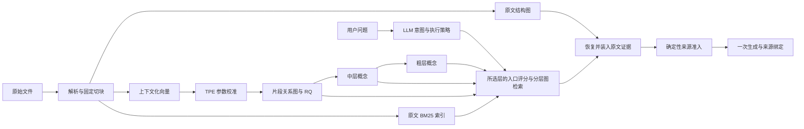
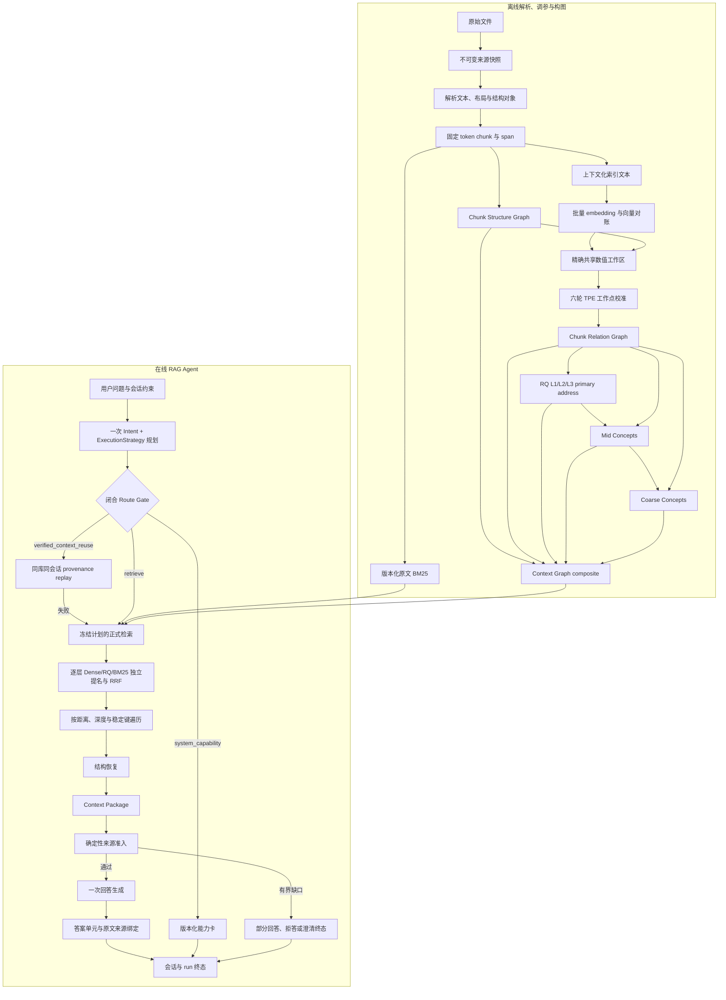
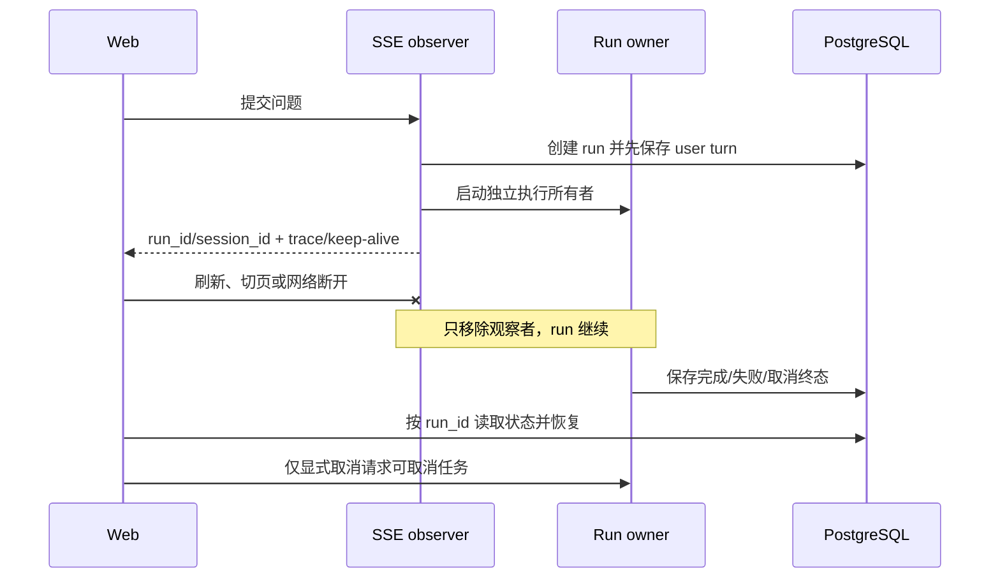

# SymboGraph 技术白皮书

SymboGraph 是本地知识库系统。它把文档转换成可追溯的图和向量索引，再沿图寻找证据、恢复上下文并回答问题。每条回答引用都应回到具体文档版本和原文跨度。

本文定义 `intent_execution_retrieval_v1` 架构、算法和工程边界。当前 serving 主链已切换到该协议；精确字段、公式及协议细节见文末参考文档，验证方法见[开发与测试](development.md)。文档只定义机制，不能替代具体版本的测试证据。

## 目录

1. [系统结构](#系统结构)
2. [数据与生命周期](#数据与生命周期)
3. [从文件到四层图](#从文件到四层图)
4. [沿图检索](#沿图检索)
5. [入口评分与策略执行](#入口评分与策略执行)
6. [原文证据与一次回答](#原文证据与一次回答)
7. [身份、事务与缓存](#身份事务与缓存)
8. [配置与运行](#配置与运行)
9. [复杂度与性能口径](#复杂度与性能口径)
10. [验收与历史兼容](#验收与历史兼容)
11. [实现导航与协议参考](#实现导航与协议参考)

## 系统结构

系统有四层图。RQ 是第 1 层中的聚类地址和成员关系，不是第五层。

| 层 | 内容 | 作用 |
|---|---|---|
| 0：原文结构图 | 文档、章节、段落、表格、公式、代码及其位置关系 | 找到原文地址，恢复被切块分开的上下文 |
| 1：片段关系图 | chunk 之间有内容支撑的语义关系，以及 RQ 三层主地址链 | 在片段间移动，为高层概念提供证据 |
| 2：中层概念图 | 从 RQ L3 前缀组织出的有证据概念 | 概括局部主题，连接相关片段 |
| 3：粗层概念图 | 从 RQ L2 分组形成的更高层主题 | 缩小检索范围，连接较远的主题 |



完整构建与 serving 数据流如下。构建链只在版本化事实和显式 promotion 上前进；在线链只消费已经准入的 active 图、索引与配置身份。



chunk 是稳定的索引和引用单位，不保证包含一个完整语义。结构图负责把上下文接回来；它不直接生成片段语义边，也不把“同章节”当成语义相似。

LLM 负责解释、命名、理解问题、选择受约束的计划和生成答案。数据库、原文及图支撑才是事实来源。图路径的灰区判断由本地规则执行，LLM 无权补判。

## 数据与生命周期

### 哪些数据是事实源

| 存储 | 保存什么 | 恢复原则 |
|---|---|---|
| PostgreSQL | 文档版本、chunk、图状态、任务、审计、写入意图与补偿记录 | 生命周期和持久审计的事实源 |
| 不可变原文快照 | 原始文件和可重放的原文地址 | 生成新版本，不就地覆盖旧快照 |
| Qdrant | 与持久向量记录对应的索引 | 可由 PostgreSQL 中的记录修复或重建 |
| Redis | 队列、缓存、运行时版本和协调状态 | 缓存丢失不应改变正确结果 |
| 根 `.env` | 秘密、连接、路径、端口和进程/服务启动参数 | 每个部署键的唯一事实；不保存检索/构建调参 |
| 根 `settings.json` | 非秘密产品、检索、预算和构建参数 | 每个运行参数的唯一事实；数据库只记录变更审计 |

原始 PDF 保持完整。清洗用于解析结果和展示字段，不改写原文件。应用数据与数据库位于 Docker named volume；部署细节见 [infra](../infra/README.md)。

### 版本与取消

版本号指 `chunks.chunk_version`。空库最高版本为 0，首次成功解析得到 v1。普通选中解析把成功文件同步到现有最高版本；全量重建才将目标版本设为当前最高版本加一。

失败文件恢复解析前记录的 active 版本，不能用 `version - 1` 推断。全批失败不推进资料库最高版本。

取消边界随阶段变化：

- 解析、结构和索引阶段按已保存的 before-image 回滚本阶段写入。
- 已进入概念图阶段后，取消只补偿概念图及相关派生状态，不退回已提交的 chunk、结构图、向量或最高版本。
- Qdrant、缓存发布等外部副作用通过持久化 intent/outbox 对账，失败记录保留到恢复完成。

并发解析、重建、删除和维护必须按资料库、文档或批次隔离。内存锁不能替代跨进程的持久状态与数据库约束。

## 从文件到四层图

### 1. 解析与结构地址

解析器产出正文、结构对象、页面坐标和来源信息。正文、结构标题与展示路径使用一致的控制字符清洗规则；正文长度变化时同步更新跨度映射。

PDF 表格优先使用原生几何和文字位置，保留行列、跨页及解析完整性信息。正文提到某张表，不等于已经解析出该表。图片或不完整对象应标为未确定，不伪装成完整文本。

写库前检查 NUL 等非法文本。错误只记录安全的类型、阶段和字段名。数据库 flush 失败先回滚，再处理错误链，避免回滚状态异常遮住最初原因。

固定 token 切块可以跨语义边界，但必须保持原文地址、结构映射与快照验证。映射索引可以预筛候选，最终仍执行完整的地址和歧义检查。

设清洗前字符位置为 $u$、清洗后位置为 $v$，解析器保存单调 span 映射 $M(u)=v$。任一 chunk $c_i=[b_i,e_i)$ 必须满足：

$$
0\le b_i<e_i\le |T|,\qquad
\operatorname{text}(c_i)=T[b_i:e_i],\qquad
M^{-1}([b_i,e_i))\subseteq [0,|T_{raw}|].
$$

token 窗口大小为 $W$、重叠为 $O$ 时，下一窗口起点为 $b_{i+1}=e_i-O$，且 $0\le O<W$。页面、表格单元格、标题路径和 bounding box 只是同一原文 span 的结构地址，不改变 chunk 文本或事实身份。

### 2. 上下文化索引与向量

用于 embedding 的文本可包含有界的标题、结构路径和上下文提示。索引文本与引用正文分开：检索得到线索后，引用仍指向原始 chunk span。

向量记录绑定模型、维度、文本版本、chunk 版本和内容身份。请求按现有并发上限排队并批处理，返回顺序与输入一致。正常路径不使用零向量、假 embedding 或本地检索 fallback。

对原文 $t_i$、结构路径 $p_i$ 和有界上下文 $h_i$，索引文本由版本化函数 $C$ 构造，向量为：

$$
x_i=\operatorname{norm}\!\left(E(C(t_i,p_i,h_i))\right),\qquad
s_D(q,i)=\frac{x_q^\top x_i}{\|x_q\|_2\|x_i\|_2}.
$$

$C$、embedding 模型、维度、归一化及输入 hash 都进入向量身份；引用仍回到 $t_i$ 的原始地址，而不是把 $C(\cdot)$ 当作可引用事实。

原文同时建立版本化 BM25 倒排索引，使用 active chunk 及 KB 内统计。该索引支持请求时的分层入口，不用于构造或加权片段语义边。分词、索引快照、更新与失效契约见[检索协议](reference/retrieval-and-qa.md#bm25-通道)和[数据协议](reference/data-and-lifecycle.md#bm25-索引生命周期)。

$$
s_B(q,d)=\sum_{t\in Q}
\log\!\left(1+\frac{N-df_t+0.5}{df_t+0.5}\right)
\frac{tf_{t,d}(k_1+1)}{tf_{t,d}+k_1\left(1-b+b\frac{|d|}{\overline L}\right)}.
$$

这里的 $N$、$df_t$、$\overline L$、$k_1$ 和 $b$ 都属于同一 KB 的 active 索引身份；过滤只改变候选资格，不重新计算统计量。

### 3. 片段关系与 TPE

关系图以完整候选域中的向量相似度为基础，再应用动态近邻配额、反向入边约束、跨文档/语言通道及内容支撑。配额决定谁有机会入选，不直接增加边强度。

原始强度、类型内校准和路径距离分开计算。不同边类型先按自己的统计口径校准，再转换成可累加距离。强度的来源、阈值、校准统计和支撑都进入审计。

对候选边 $e=(i,j,r)$，原始强度只由已冻结的向量与本地支撑特征决定。以类型 $r$ 的稳健位置与尺度 $m_r,a_r>0$ 校准后：

$$
z_e=\frac{s_e-m_r}{a_r},\qquad
p_e=\sigma(z_e),\qquad
d_e=-\log(\max(\varepsilon,p_e))\ge 0.
$$

动态配额、跨文档/语言保留和反向入边约束只决定 $e$ 是否进入候选/保留集合；不把配额值加进 $s_e$。路径距离是保留边距离与非负规则惩罚之和，因此循环不能产生负成本或提升优先级。

TPE 顺序尝试 6 轮参数，质量门禁决定哪些候选有效。无效试验是正常筛选结果，不能靠跳过试验或降低门禁获得通过。

每轮参数 $\theta$ 先通过闭合门禁 $g_k(\theta)\le0$，再比较构图工作点损失：

$$
\theta^*=\arg\min_{\theta\in\Theta_{valid}}L_{graph}(\theta),\qquad
\Theta_{valid}=\{\theta\mid g_k(\theta)\le0,\ \forall k\}.
$$

$L_{graph}$ 只由边预算、连通/孤立、跨域保留、度压力、校准稳定性和构建资源等版本化构图指标组成；不使用问答答案、在线奖励或验收题得分。TPE 选择的是离线图工作点，不是在线 Agent 策略。

同一次构建使用 `GraphBuildWorkspace` 共享不随参数变化的计算：

1. 冻结 chunk 顺序、向量、结构/语言事实、数值协议与配置。
2. 使用连续 `float64` 数组，分块计算两两相似度；模长和邻居排序各做一次。
3. 每轮独立计算阈值相关的候选数量、入边压力、桥接机会、配额、原始强度和校准。
4. 选中参数后核对输入、参数、校准与候选摘要，再复用已验证结果写库。

共享准备只计算一次实际墙钟；单轮门禁保守计入“共享准备加本轮计算”。工作区默认 256 MiB，超限使用本构建专属临时映射文件，取消、失败或结束后清理。预算外继续分配应明确失败。

工作区可以丢弃，不是恢复事实源。重启或身份变化后重新计算。接近阈值、排序同分或最近中心边界时，使用原标量规则复核并记录数量。

### 4. RQ 三层主链

RQ 把向量依次量化为三层残差地址。第 1 层选择最近中心，后续层对前一层未解释的残差继续选择中心：

$$
r_i^{(0)}=x_i,\qquad
z_i^{(\ell)}=\arg\min_k\|r_i^{(\ell-1)}-c_k^{(\ell)}\|^2,\qquad
r_i^{(\ell)}=r_i^{(\ell-1)}-c_{z_i^{(\ell)}}^{(\ell)}.
$$

初始化、同分、空簇和收敛规则保持确定性。当前协议固定 3 层，每层最多 6 个中心、最多 8 次迭代。距离、分组求和、残差更新和编码由分块数值内核计算。

每个 active chunk 只持久化唯一 L1/L2/L3 primary chain 及其置信度，成员数应为 `3 × active chunks`。完整 softmax 用于诊断，不持久化多条主链，也不把 RQ 地址当成概念身份或物理图边。

支撑边按业务顺序排序一次，再建立 `chunk → 有序支撑边` 索引，返回与原规则相同的前 16 条。前缀成员、质心、同层距离和底层边事实共用索引；完整贡献、前缀诊断和支撑校验仍执行。

### 5. 中层和粗层概念

RQ L3 前缀为中层概念组织材料，L2 分组为粗层概念组织材料。是否有资格成为概念，由版本化本地规则决定；LLM 只对合格、有原文支撑的材料命名和解释。

层级必须形成压缩：`Mid ≤ chunks`，`Coarse ≤ Mid`。概念不能仅因为模型给出了一个名字就写入。定义、跨语言表达和边解释都需要 grounding 与来源跨度。

高层边从底层关系支撑投影。去重单位、成员权重、支撑计数、类型校准和贡献路径保持可重放；模型不能凭概念相似另造一条无支撑边。

若概念 $v$ 的合格成员为 $S_v$，其表示和任意概念边 $v\to u$ 必须从成员贡献投影：

$$
\mu_v=\frac{\sum_{i\in S_v}\alpha_{iv}x_i}{\sum_{i\in S_v}\alpha_{iv}},\quad
\alpha_{iv}\ge0,\qquad
W_{vu}=\operatorname{Calibrate}_r\!\left(
\operatorname{Aggregate}\{w_{ij}\mid i\in S_v,j\in S_u\}
\right).
$$

分母为零、支撑集合为空或贡献无法回放时不创建概念/概念边。完整贡献列表保留，不能只保存聚合值后丢失 grounding。

### 6. 提交与发布

构建按有界批次写入，显式维护事务、外键和业务 hash。完成条件包括四层图一致性、主链/压缩、原文支撑、向量对账、最终提交、缓存失效和 freshness。

计算结束不等于构建完成。缓存发布失败、对账未完成或补偿尚未收敛，都应保留可恢复状态。

## 沿图检索

### 意图与执行策略

取消普通模式和摘要模式；用户不再通过界面模式决定粗层或中层入口。LLM 在一次规划中识别意图并给出执行策略，执行器校验后行动。

意图包括总结、全局浏览、定义、事实查询、列举、比较、解释、步骤、分析、关系查询和来源定位，也包括能力卡与澄清。意图描述“要完成什么”，执行策略描述“怎样检索”；总结可以从中层开始，事实问题也可以先从粗层定位，不能用意图枚举重新硬编码两种模式。

执行策略选择 `entry_layer=coarse|mid|chunk`、是否生成词面、是否混合、逐层 Dense/RQ/BM25 权重、focused/broad 范围分配及受限预算。可用图层和索引状态由服务器提供，模型不能选择不存在的层或改变用户过滤域。RQ 是地址/评分信号，结构图用于来源恢复，不作为新增语义入口层。

任务独立保存完整原问题、实体、属性、数值/单位、时间、否定、比较对象、来源责任与回答约束。用户给定的指代约定不另增取证义务；实际身份核实、比较与来源政策仍需证据。来源声明区分文档族和具体文档。

### 当前 Agent 的双语词面

双语词面属于同一次 Intent/ExecutionStrategy 规划，不是第二个 query-facet 模型步骤。active 协议 `bilingual_lexical_groups_v1` 将词面组织为有界 group：每组绑定 requirement ids、`concept|identifier|number_unit|quoted_literal` 类型，并携带至多四个 `{text, language, provenance}` surface；所有 group 展平后仍不超过 24 个词面。

开启双语开关时，`concept` 组必须同时包含经本地 Unicode/script 门禁核验的中文和英文 surface。标识符、编号、数值单位和用户逐字引用可标为 language-neutral，不强造不存在的翻译。关闭开关时模型仍可提出标准技术别名，但不承担双语成对责任。模型提出的翻译只是检索表达，不成为实体事实、文档别名、图边或回答证据。

本地执行器核验 group id、requirement 归属、语言、类型、数量、重复项和总预算，再按稳定 group/surface 顺序展平给版本化 tokenizer 与 BM25。计划只调用一次模型；不得调用遗留 query-facet 链补齐翻译。任何 bilingual 计划字段进入计划 hash、检索 cache、trace 与审计。若模型选择不生成词面，则下面的空词面规则优先，不能因为开关开启而补造词面。

### 合法的空词面

全局问题不一定有适合 BM25 的检索词。模型可返回 `generate_lexical=false` 和空词面数组，使用完整问题及已授权范围构造语义查询。此时执行纯向量入口策略，Dense 权重为1，RQ/BM25 评分关闭；后续仍沿图探索并核验 primary 归属。

不生成词面不等于没有任务、无需检索或可以凭模型知识回答。空词面不会触发缺词拒绝，也不会被执行器补造词面。模型可生成词面而选择纯向量；只有启用混合时才运行 BM25。

### 分层入口与展开

从粗层开始时依次探索粗层、中层和片段层；从中层开始时进入中层和片段层；从片段层开始时直接进行片段关系遍历。逐父节点提名下层候选，完成同层合并去重后才应用输出预算。

`top_k` 是最终 hit chunk 预算，不是每个父节点的探索配额，也不能替代结构恢复与路径审计。模型权重仅决定各层入口，不改写物理边和路径阈值。节点固有权重不表示当前问题相关性。

同一 chunk 可能经不同根入口或关系路径被遍历多次。结果层在 `top_k` 前按稳定遍历顺序以 chunk id 去重，保留距离、深度和路径稳定键更优的首条路径；其他路径仍计入路径候选与重复路径审计，但不能重复占用结果位或生成重复引用。

全局浏览可采用 broad 父节点预算分配，记录已观察主题、文档和截断范围。向量 top-k 仍可能遗漏主题，粗层入口不能作为全库穷尽证明。所有最终事实仍须下钻到实际原文。

## 入口评分与策略执行

### 三通道及融合

| 通道 | 原始分数 | 来源与边界 |
|---|---|---|
| Dense | 查询与同层候选的 cosine | 同 embedding 和索引身份 |
| RQ | 查询到关联前缀重构向量的负平方距离 | 使用完整前缀重构，不单独比较末层残差中心 |
| BM25 | 查询词项与 active chunk 原文的 BM25 | KB 内版本化 df、平均长度及分词；上层通过有支撑归属投影 |

混合策略让各通道独立提名，再合并候选；不得先用 Dense top-k 排除 BM25 独有命中。三个原始分数不直接相加。首版采用版本化加权 RRF，将通道内名次转换成可融合贡献：

$$
S(v)=\sum_j w_j\frac{k+1}{k+rank_j(v)},\qquad\sum_jw_j=1,\quad w_j\ge0.
$$

LLM 可逐请求、逐层选择权重；执行器按固定排名/融合协议计算，保存模型权重、生效权重和每个通道的贡献。`k=60` 是工程起点，不是已经证明最优的参数。相同原始分数共享竞争秩，稳定业务键处理最终同分。

混合要求 Dense 与 BM25 权重为正，RQ 可为零。健康 BM25 索引零命中保留零贡献；索引故障保持技术终态，不能静默改权重。无词面时完全使用纯向量起点策略。精确公式、组合约束与候选投影见[检索协议](reference/retrieval-and-qa.md)。

BM25 只建词面索引，不创建新的图层；词面共现与混合召回不成为语义边支撑。新索引有独立协议和生命周期，不复活缺少身份核验的历史产物。Dense 与 RQ 具有相关性，融合分不表示独立证据累积或答案概率。

### 路径距离与灰区

检索入口评分和沿图距离分别记录。边经过类型内校准后转换为非负距离，路径按真实边累加。当前层同父节点的队列按累计距离、深度和稳定路径键排序。

| 区间 | 处理 |
|---|---|
| green | 依据支撑继续；语义不确定或跨 RQ 边界时进入本地灰区规则 |
| gray | 确定性规则决定继续、桥接、下钻、结构恢复或停止 |
| red | 停止展开并保留原因 |
| hard stop | 无条件遵守硬中断与来源边界 |

LLM 不能通过入口权重修改距离、支撑、阈值或灰区结果。本地规则必须支持空词面：以已验证语义入口和连续支撑路径保留锚点，而不是要求不存在的词面命中。

循环、路径贡献和原文去重分开处理；重复绕行不能提高优先级。每路径 edge reuse、深度、标签数、逐父节点预算和总时限保证有界停止。邻接缓存只对已完整读取的节点标记 complete。

## 原文证据与一次回答

### 实际证据包

Context Package 是 QA 唯一事实输入，保存实际原文、chunk/版本/跨度、来源范围、结构恢复和真实路径支撑。概念摘要和索引文本用于定位，不能直接代替原文。

指定范围通过版本化交并/all/any 代数验证。比较两侧、单位和版本分开保留；完整物理范围不等于语义充分。装包优先满足明确来源及父节点分配，再按完整 chunk、来源顺序和预算选择，记录未装入范围。

输入容量包含 system/schema、问题、来源指引、标签、正文与有界历史摘要，并预留输出。正文估算 token 和 provider 实际 input token 分列；范围超出预算时明确报告，不裁剪必要信息后宣称完整。

$$
B_{system}+B_{schema}+B_{task}+B_{history}+B_{evidence}+B_{output}
\le B_{window}.
$$

装包在上述约束下按来源责任、稳定遍历优先级和结构恢复单元选择证据；同一 chunk 只计一次正文预算，多条合法到达路径保留在审计中。若完整责任无法在预算内满足，终态必须显示截断或不足，不能把 $B_{evidence}$ 的局部子集宣称为全库穷尽。

### 来源准入与生成

本地准入协议 `source_integrity_admission_v1` 核验原文、版本、过滤域、结构表示、支撑路径、实际 manifest 与预算。它不使用向量/RQ/BM25 融合分或旧覆盖阈值证明能回答；通过后的来源绑定使用 `answer_source_binding_public_v3` 对外投影，并保留底层 `answer_source_binding_v2` 地址协议的历史兼容。

通过来源准入后生成一次。模型只根据实际包回答支持的内容，明确部分完成或证据不足；不能把提案当定案、几个例子当全集，也不能把未检索到写成全库不存在。Search 在返回来源结果后结束。

回答的事实单位引用当前 source handle，执行器确定性绑定答案跨度、chunk、文档版本和原文跨度。无效 handle、来源漂移、输出截断、超时和取消保持各自终态。来源绑定证明出处与身份，不声称已经证明每句话的语义。

`answer_units[].text` 保存模型实际生成的 GFM。多步骤、比较和结构化回答按需使用标题、列表、表格或代码块；数学表达使用 `$...$` 行内或 `$$...$$` 块 LaTeX。生成契约禁止在外层 JSON 周围添加 Markdown fence；传输解析器只允许确定性剥离“完整响应恰好是一层 `json` fence”的兼容包装，带额外 prose、嵌套内容或非对象根仍失败关闭。模型返回普通段落时，执行器可在完整 schema 校验后只增加列表标记作为展示投影，不改写事实文字、source handle 或答案 hash 的事实输入。前端不得根据普通字符模式把既有纯文本猜测改写为公式。

SSE 与同步 QA 使用同一 run 和终态。SSE 连接只观察执行，不拥有执行任务：run 接纳、用户消息和执行所有权先持久化，执行任务自己持有数据库会话、并发租约、硬时限和终态责任；观察者只订阅持久 trace 与当前传输事件。生成阶段直接消费 provider 的文本 delta，从尚未完成的闭合 JSON 中只投影 `answer_units[].text`；source handle、provider 原始响应和其他控制字段不进入浏览器。投影保持 append-only，完整响应通过 JSON、Pydantic 和来源校验后才允许最终 `answer_replace` 归一化；服务端不在生成完成后把整段答案伪切成固定长度。`first_response_ms` 与 `first_token_ms` 记录首个可见回答增量的单调时钟延迟。长阶段通过纯传输 `keep-alive` 注释维持连接，该注释不进入 Agent 事件、图检索、Context Package 或模型上下文。



浏览器刷新、路由切换和普通网络 EOF 只关闭观察者，不取消已接纳 run。只有用户显式取消、硬时限、租约丢失或服务停机收敛可以结束执行。收到 run id 后客户端按 PostgreSQL 状态恢复；失败/取消只在该 run 仍是会话最新运行时写回会话 task state，避免界面停留在旧的 `active/answering`。

### 直接回答与会话

同一次规划识别直接路由，闭合 Route Gate 授权：系统能力只读版本化服务端能力卡，零检索与引用；历史证据复用只限同 KB、同会话且 provenance replay 通过的完整包。本轮重新检查任务范围、来源和预算，失败在正式检索开始前回到同一计划。

历史回答、摘要和旧判决都不是事实来源。会话摘要仅帮助理解，当前用户要求优先。真实歧义返回澄清。

服务端接纳问答并创建 run 后，必须在检索和模型调用前把本轮用户问题写入 PostgreSQL 会话。成功回答追加 assistant 消息；失败或取消追加可读的安全终态，使每个已接纳问题都能在历史中恢复。用于模型 prompt 的历史只取完整 user/assistant 对，尚未终结的尾部 user 不重复注入。

会话结构、交替角色和 state hash 决定历史是否可列出与阅读。旧 Context Package 或来源绑定无法再完成物理重放时，该轮历史仍然可见，也允许用户发起新的正式图检索；只有 `verified_context_reuse` 被拒绝。复用候选仍逐项执行完整 provenance replay、来源准入和预算校验，不能因放宽历史展示而获得事实授权。

会话列表按元素而非整批建立兼容边界。每个 summary 独立通过当前公共 schema 后才进入响应；旧 trace 节点、旧判别联合或损坏 state 只排除所属会话，并以不含内容、id 或指纹的计数/错误类型记录。未知数据库或服务错误仍上抛，不能被泛化的 `except` 伪装为不兼容。被排除记录保持 PostgreSQL 原样，按 id 读取返回 409 冲突；列表不得因一个拜占庭项返回 500，也不得通过删除、补造字段或改写历史换取通过。

用户显式删除会话时只删除 transcript/state 容器；Agent run、AnswerSession、来源绑定和观察记录作为审计事实保留，并把可空的 session 外键置空。PostgreSQL 通过一条 `DELETE ... RETURNING` 及既有 `ON DELETE SET NULL` 完成解绑，不能先删除 run/observation，因为 v2 来源绑定以 `RESTRICT` 保护其来源准入 authority。前端先从规范会话缓存乐观移除该项，失败再恢复；服务端列表重取在后台执行，不能阻塞用户可见删除。

前端会话列表是可失效缓存。手动选择必须先成功读取目标消息，再写 activeSessionId；删除与选择互斥。目标在读取前被其他请求删除时，404 收敛为缓存移除、列表刷新和可读提示，不改变当前有效会话，也不形成未处理异步异常。

会话消息、当前 run 和终态投影是 React Query 的服务端状态；同一 App 生命周期内重入问答页优先立即显示现有 cache，再按明确失效规则刷新。浏览器持久化只保存版本化的小型指针、草稿和视图选择，不复制完整回答、引用或 trace。完整刷新使用 active session/run 指针从 PostgreSQL 一次有界水合消息、引用、终态和最近 trace，禁止逐 turn 串行形成状态请求瀑布。

答案与会话联合提交使用同一份 canonical 引用对象：多来源 binding ID 先按协议规范化，再进行重放和落库。随机 UUID 创建顺序不属于引用身份，不能因原始顺序与 canonical 顺序不同而拒绝合法回答。

## 身份、事务与缓存

### 身份与提交

构建身份绑定原文、版本、模型、索引文本、数值/关系/RQ/概念协议。检索身份增加 Task、Intent、ExecutionStrategy、逐层权重、词面生成开关、语义查询、BM25 快照、分词/统计、RQ 评分、候选投影和融合版本。

业务 hash 使用规范排序、引用替换和有限浮点规则，不用随机 UUID 或局部抽样替代。一次逻辑提交保持原子性，外部副作用前保存意图，崩溃后依据 PostgreSQL 恢复。

```text
接纳 → 意图与执行策略 → 校验/来源定位 → 分层检索
    → 结构恢复/装包 → 确定性来源准入 → 一次生成 → 来源绑定 → 完成
```

调用前保存 prepared 意图，completed 只在实际返回并验证后写入。临界阶段检查取消、剩余总时限和运行版本。生成结束后不会返回检索。

### 缓存与 freshness

缓存绑定资料库、会话、问题/过滤条件、Task/Intent/Strategy、所有启用索引及图状态、排名/融合/遍历协议、模型、Profile、运行配置和实际证据身份。词面开关、入口层或权重变化均使相应缓存失效。

纯向量请求不依赖未启用 BM25 的可用性；混合请求必须校验 active BM25 快照。计划缓存还要绑定能力清单，不能复用已不存在的入口。来源状态变化使依赖包不可复用，不能用旧统计或旧缓存掩盖。

freshness 核对版本、依赖 hash、完成与发布状态，而非只看时间戳。候选索引不能静默覆盖 active 指针；cache miss 仍执行同一正确路径。

在线请求使用 `active_graph_online_admission_v1`：核对 active 四层状态、向量指针、协议 hash、九类 freshness 记录，以及 chunk、边、RQ 前缀/成员、概念与映射的有界精确计数。它不在每次问答中重新解码所有边、向量和支撑 payload。构建、promotion、reconcile 与质量验收继续使用深度准入，逐项重放内容 hash 和完整支撑；在线快速门禁不能替代深度校验，也不能在 freshness 或计数漂移时降级放行。

## 配置与运行

Profile 管提示词、文案和对话偏好；Runtime Settings 管预算、分词/BM25、融合协议、模型和服务参数。LLM 给出的执行策略是请求数据，不能反写配置文件。根 `.env` 只保存秘密、连接、路径、端口和进程/服务启动参数；根 `settings.json` 只保存非秘密产品、检索、预算和构建参数。两份文件的键集合不相交，重复键或未知键 fail closed；本机实际文件被 Git 忽略，仓库只保留脱敏 example。

设置界面按字段归属写入 `.env` 或 `settings.json`；一次完整表单可以包含两个 authority 的字段，但每个键只有一个落点。服务在同一跨进程锁下冻结两文件身份，分别使用同目录临时文件、fsync 与原子替换，任一校验、热应用或审计失败都按冻结 before-image 回滚已经替换的文件。读取形成包含两个文件 hash 的组合配置身份。数据库只记录文件/组合版本、changed keys、生命周期、状态和错误，Redis 只广播组合版本，不保存参数值。概念提示词变化标记重建需求；普通问答提示词变化不触发 chunk 或图重建。

| 生命周期 | 行为 |
|---|---|
| `hot_reloadable` | 原子更新该键所属根文件，清理单例，通过 Redis 广播，在请求边界刷新组合配置 |
| `rebuild_required` | 生成候选索引或图，经验证与显式 promotion 后发布 |
| `service_recreate_required` | 经显式 recreate 读取同一权威文件集合 |

数据库只记录配置版本、changed keys、生命周期、状态和错误，不保存第二套 active/desired 参数。BM25 tokenizer、索引文本、统计或映射变化的重建范围见[数据协议](reference/data-and-lifecycle.md)。

模型、向量和 I/O 并发有上限，规划、来源定位与一次生成共享总请求时限；不通过扩大预算掩盖失败。构建至少每五秒或阶段切换保存进度。数值分块、数据库批写及模型边界检查取消，补偿耗时单列。

## 复杂度与性能口径

设 n 为 chunk 数、d 为向量维度、T 为 TPE 轮数、E 为底层边数、P 为 RQ 前缀数，M 为某层通道候选并集大小。

| 部分 | 主要成本 |
|---|---|
| 共享准备后的 TPE | 完整两两相似度与排序仍为二次规模，参数相关计算逐轮执行 |
| RQ | 训练/编码、支撑索引、前缀对、完整持久化和 hash 均计量 |
| BM25 | 索引构建扫描实际 token/postings；查询包括命中 postings、过滤、上层投影及候选排序 |
| 入口融合 | 有界候选合并及 `O(M log M)` 排序，通道计算另列 |
| 图检索 | 实际父节点、路径标签和边探索，受预算及阈值限制 |
| 问答 | 规划、定位、检索、结构恢复、装包、一次生成、绑定与排队 |

数值内核优化不能代替端到端测量。总墙钟包含排队、模型等待、写库和发布；嵌套耗时不重复相加。P50/P95/P99 注明样本数；成功事实答案、部分回答、拒答、失败、取消和未执行分列。

在线 QA 的可归因阶段至少覆盖：接纳排队、会话准备、能力清单与 freshness、一次规划、来源定位、查询 embedding、每层 Dense/RQ/BM25 提名、融合、边读取、图遍历、结构恢复、Context Package、来源准入、一次生成、来源绑定和数据库提交。每个 span 保存单调时钟区间、parent、状态及有界计数；模型/网络、数据库 I/O 与 CPU 分开标识。

若同一阶段有区间集合 \(I_s\)，active wall 使用区间并集而不是简单求和：

$$
T_s^{active}=\left|\bigcup_{i\in I_s}[t_i^{start},t_i^{end})\right|.
$$

父阶段 exclusive 时间扣除直接子区间的并集：

$$
T_p^{exclusive}=|I_p|-\left|I_p\cap\bigcup_{c\in Children(p)}I_c\right|.
$$

非模型墙钟按整次请求区间减去 provider roundtrip 区间并集报告，不能把嵌套 span 重复相加：

$$
T_{nonmodel}=T_{request}-\left|I_{request}\cap\bigcup I_{provider}\right|.
$$

十例或更大样本按终态、route、入口层、缓存状态、语言和表示类型分层；nearest-rank 分位数同时注明 \(n\)。单一快样本或总体均值不能证明泛化性能。

审计尽可能区分本地队列、连接、首响应、首 token 与完整响应；未观测的服务端时间保留未知。模型缓存只在服务提供实际证据时记命中。初始融合参数和模型权重都没有预设的质量保证。

工程对标采用生产 RAG/Agent 的通用原则，不把不同模型、硬件和数据集的公开数字冒充本项目 SLA：[OpenAI latency optimization](https://developers.openai.com/api/docs/guides/latency-optimization) 强调减少串行模型请求、并行可独立步骤、流式展示进度以及让确定性工作不默认依赖 LLM；本系统据此把意图、路由和双语词面合并为一次规划，来源准入/灰区使用本地规则，Dense/RQ/BM25 独立提名在有界域内共享准备，并通过 SSE 暴露进度。检索质量按 [Microsoft RAG evaluators](https://learn.microsoft.com/en-us/azure/foundry/concepts/evaluation-evaluators/rag-evaluators) 所述的独立 ground truth、排名和覆盖维度验证；延迟优化不能跳过 Context Package、来源准入或引用绑定来换取表面速度。

## 验收与历史兼容

冷构建核对文件、三条 primary 成员关系、压缩、grounding、向量对账、freshness，以及新增 lexical 索引的版本和计数。新检索验收覆盖各意图、三个根入口、空词面、不同混合权重、跨语言与跨表示、来源过滤、全局广度和失败状态。

质量测量与工程不变量分开：完整路径、来源绑定和健康索引不等于完整答案。采用独立原文 gold，比较各通道、固定权重与 LLM 权重；只记录可解释指标，不把指标合成为尚未确定的优化目标。

暂时退出的控制机制不在本白皮书中展开。旧数据只保留必要的读取、重放与迁移边界，见[历史兼容](reference/compatibility.md)。不能因模块名包含历史词汇就删除仍被原文恢复和来源绑定依赖的代码。

## 实现导航与协议参考

| 范围 | 入口或对应文档 |
|---|---|
| 数据与请求 | `apps/api/app/models.py`、`schemas.py`、`packages/shared/src/index.ts` |
| 解析/构建 | `services/ingestion.py`、`context_graph.py`、`auto_tpe.py`、RQ/数值模块 |
| 规划/检索 | `intent_contracts.py`、`intent_planning.py`、`layered_execution_v1.py`、`intent_execution_agent.py`；旧 `retrieval_agent.py`/`retrieval_fsm.py` 仅作兼容读取 |
| 原文与回答 | `evidence_scope.py`、`source_location.py`、`answer_sources.py`、`citation_provenance.py` |
| 验证与运维 | [开发与测试](development.md)、[脚本说明](../scripts/README.md) |

协议参考是白皮书组成部分：

- [构建协议](reference/graph-construction.md)：结构、向量、BM25、TPE、RQ、概念与投影。
- [检索与问答协议](reference/retrieval-and-qa.md)：意图、执行策略、入口评分、图遍历、原文和回答。
- [数据与生命周期协议](reference/data-and-lifecycle.md)：字段、hash、索引、配置、事务和缓存。
- [历史兼容边界](reference/compatibility.md)：旧字段、记录和读取隔离。
- [检索架构调研](reference/retrieval-research.md)：原始论文、官方文档、方案比较及尚待验证的判断。

新增协议先定义语义，再同步 schema、service、API、共享类型、前端、脚本及测试。各阶段实现和真实验收状态见交接。当前目标同时要求后端保留 Docker、Web 迁移为宿主 Node.js/node_modules；Web 主导航不提供独立 Search 页面，问答仍通过同一后端图检索契约取证。界面保留原底色、嵌入式问答布局、Markdown/KaTeX 富文本和全站圆角，并独立验证 Web/Redis 性能。
