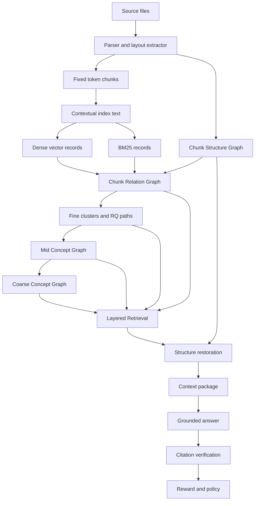
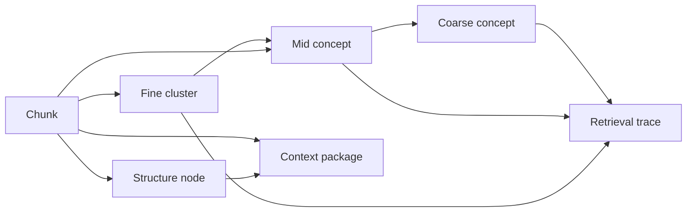
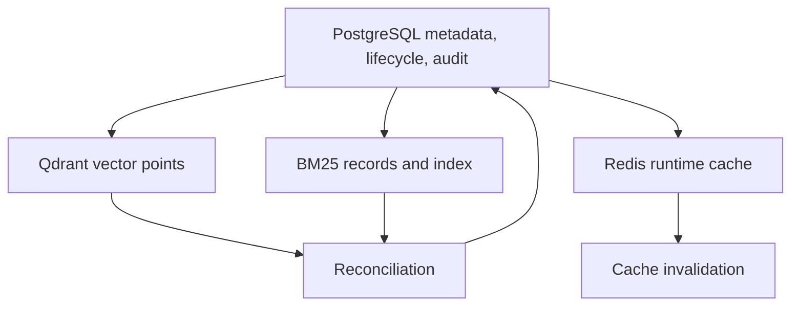
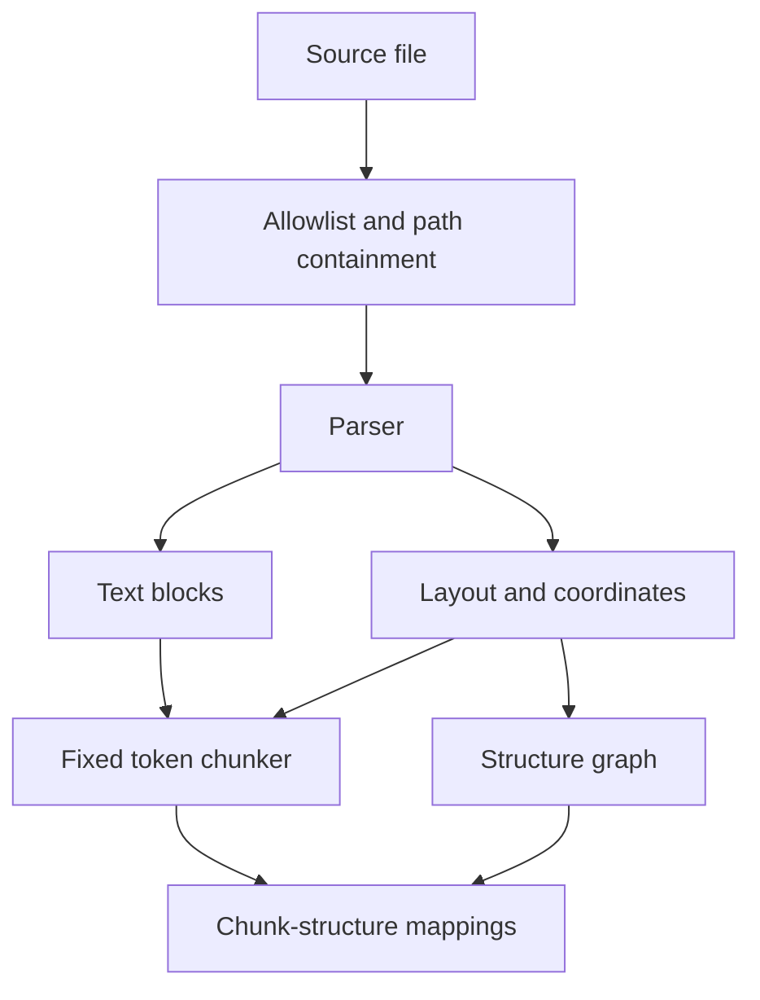
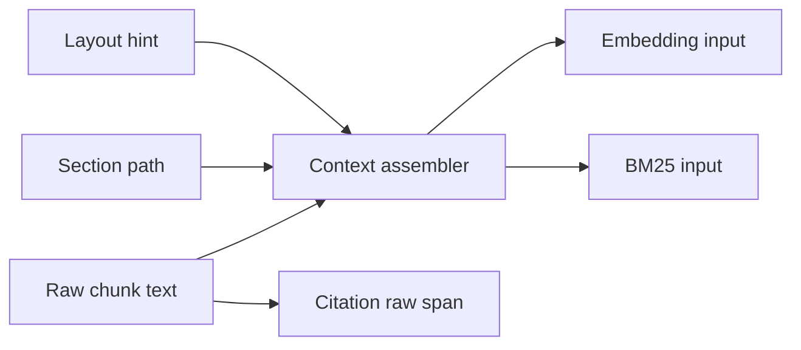
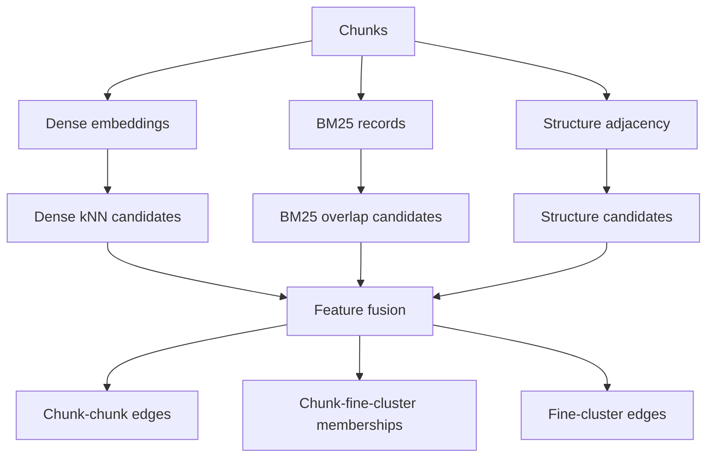
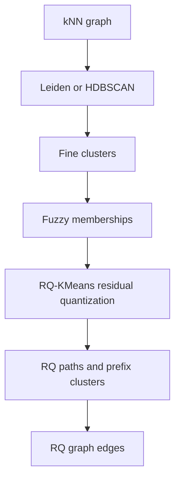
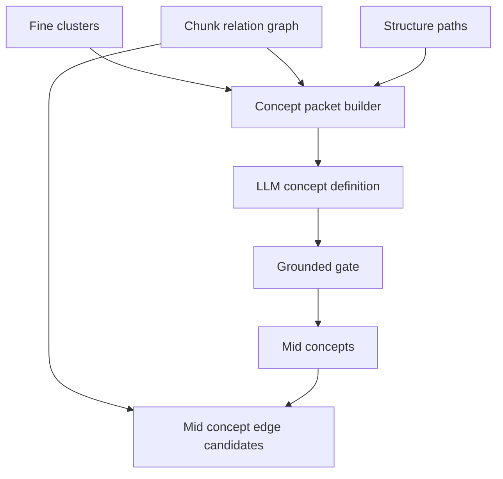
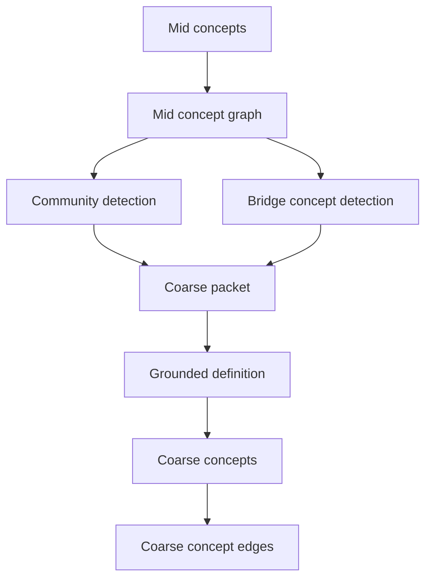
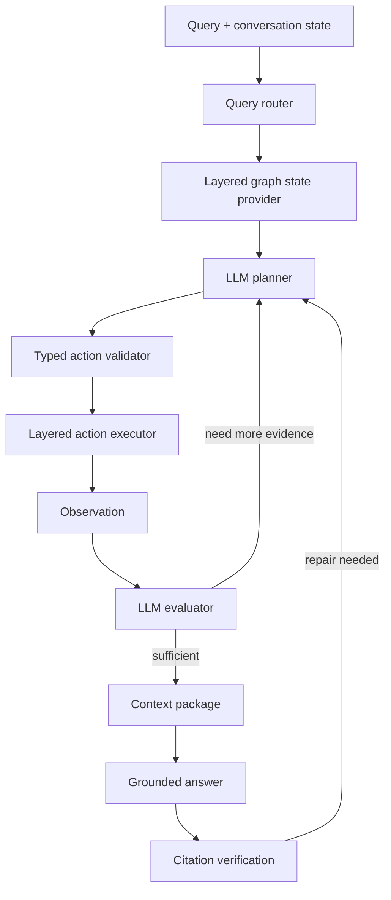

# SymboGraph Four-Layer Context Graph RAG 技术白皮书

## 目录

- [摘要](#摘要)
- [端到端链路](#端到端链路)
- [四层上下文图谱](#四层上下文图谱)
- [跨层对象协议](#跨层对象协议)
- [事实源与派生状态](#事实源与派生状态)
- [解析、固定 Chunk 与结构图](#解析固定-chunk-与结构图)
- [Contextual Index Text](#contextual-index-text)
- [Chunk Relation Graph](#chunk-relation-graph)
- [Fine Clusters 与 RQ-KMeans](#fine-clusters-与-rq-kmeans)
- [Mid Concept Graph](#mid-concept-graph)
- [Coarse Concept Graph](#coarse-concept-graph)
- [Layered Retrieval](#layered-retrieval)
- [Layered P&E Agent](#layered-pe-agent)
- [Context Package 与引用验证](#context-package-与引用验证)
- [Conversation State](#conversation-state)
- [Runtime Settings、Profile 与策略](#runtime-settingsprofile-与策略)
- [Freshness、缓存与热加载](#freshness缓存与热加载)
- [数据模型](#数据模型)
- [API、前端与脚本](#api前端与脚本)
- [事务、并发与安全](#事务并发与安全)
- [测试、诊断与验收](#测试诊断与验收)
- [核心原则](#核心原则)

## 摘要

传统 RAG 的第一道难题是切块。切得太短，语义被撕裂，表格、公式、图注、上下文指代和跨段推理会丢失；切得太长，召回噪声、embedding 稀释、token 成本和引用定位都会恶化。语义切块、递归切块和按标题切块都试图让 chunk 更像一个完整语义单元，但真实资料往往混合了页面布局、代码、表格、公式、标题层级和跨页连续区域，单靠切块算法很难同时满足检索、引用、上下文恢复和工程稳定性。

图 RAG 试图用图结构弥补纯向量召回的缺陷，但主流做法通常仍然先切块、再从 chunk 中抽取实体、关系或社区摘要。这个顺序让图谱质量继续受 chunk 边界制约：切块已经丢失的上下文，后续实体边、社区摘要和全局检索很难可靠补回；LLM 抽取的概念关系如果缺少 raw span 和结构路径支撑，也容易变成不可验证的解释层。学术界的图基座 RAG 探索了更彻底的图式底座，但通常依赖复杂的抽取、训练、动态图学习或大规模推理基础设施，对本地知识库的生产环境还不够轻、稳、可恢复。

SymboGraph 的判断是：瓶颈不一定是“切出完美 chunk”，而是“命中证据后能否恢复正确语义关联与原文上下文”。本项目以 ContextRAG 的上下文恢复思想为灵感，采用最简单、最稳定的固定长度 token chunk，把 chunk 视为地址和引用单位，而不是语义理解结果。系统不要求单个 chunk 自身完整表达知识，而是在 chunk 周围构建可复算关系网络、原文结构地图、概念路由层和 Agent 规划执行层。

因此，SymboGraph 采用 Four-Layer Context Graph RAG：第 0 层保存 Chunk Structure Graph，第 1 层保存 Chunk Relation Graph 与 Fine Clusters，第 2 层保存 Mid Concept Graph，第 3 层保存 Coarse Concept Graph。检索时系统按 coarse、mid、fine、chunk、structure restoration 逐层寻址，再打包 context package，最后执行 grounded answer 与 citation verification。LLM 负责概念定义、查询路由、typed action 规划、证据充分性判断和修复方向；事实证据只能来自 context package 和 raw chunk citation span。

这个架构解决的问题是：固定 chunk 的语义破碎由结构恢复和图扩展补足，纯 top-k 召回的短视由四层寻址缓解，图 RAG 的不可验证概念边由 support chunks 和 grounded gate 约束，长对话中的上下文延续由 conversation state 管理，Agent 的策略漂移由 typed action schema、预算、trace 和 citation verification 控制。自然对话长度不设置固定硬上限；预算只约束单次任务内部的规划、检索、上下文打包、验证和修复。

## 端到端链路

```text
source files
-> parser and layout extractor
-> fixed token chunks
-> chunk structure graph
-> contextual embedding and BM25
-> chunk relation graph and fine clusters
-> mid concept graph
-> coarse concept graph
-> conversation state and query intent
-> Layered P&E Agent typed strategy
-> layered graph retrieval
-> context package
-> grounded answer and citation verification
-> reward and policy update
```



## 四层上下文图谱

### 第 0 层：Chunk Structure Graph

保存原文地图，不改变固定 chunk 边界。节点覆盖标题、页面、region、段落、列表、表格、公式、图注和连续区域。边覆盖 parent-child、previous-next、same-page、same-section、contains-region、caption-of、formula-context、table-continuation。

### 第 1 层：Chunk Relation Graph

保存可复算的底层关系网络。边来自 dense kNN、BM25 overlap、结构邻接、同页/同节、同表格/公式/图注、共检索、fine cluster bridge、centroid near、RQ hierarchy near、RQ prefix sibling、RQ residual near。聚类结果必须转成可遍历节点、membership 边、chunk-chunk 边或 cluster-cluster 边。

### 第 2 层：Mid Concept Graph

LLM 在 concept packet 支撑下定义中粒度概念。每个概念保存名称、范围、包含标准、排除标准、support chunks、support fine clusters、representative chunks、bridge chunks、source spans、grounded gate 结果和 LLM audit。

### 第 3 层：Coarse Concept Graph

粗粒度概念来自 mid graph 社区结构、桥接概念和 LLM grounded definition。社区检测使用 complex-network diagnostics，包括 `modularity`、conductance、betweenness、bridge density、community stability、singleton rate。弱边和桥接概念必须保留。

## 跨层对象协议

### 架构图



### 规则

跨层图谱定义为：

$$
\mathcal{G}
=
(
G_{\mathrm{struct}},
G_{\mathrm{chunk}},
G_{\mathrm{mid}},
G_{\mathrm{coarse}},
\Pi
)
$$

其中 \(G_{\mathrm{struct}}\) 保存原文结构，\(G_{\mathrm{chunk}}\) 保存 chunk 和 fine cluster 的可遍历网络，\(G_{\mathrm{mid}}\) 保存中粒度概念，\(G_{\mathrm{coarse}}\) 保存粗粒度概念，\(\Pi\) 保存跨层 membership 和 trace 投影。

显式投影关系：

```text
chunk -> structure node
chunk -> fine cluster
fine cluster -> mid concept
chunk -> mid concept
mid concept -> coarse concept
retrieval trace -> activated layers
context package -> restored source spans
```

membership 允许重叠：

```text
chunk -> mid concept: core | representative | support | boundary | bridge | formula | table | counterexample
fine cluster -> mid concept: seed | support | bridge | boundary
mid concept -> coarse concept: core | boundary | bridge | weak_tie
```

### 关联方式

跨层关联使用稳定 id、hash、role、score 和 trace，不使用自然语言推断：

```text
chunk_id
structure_node_id
fine_cluster_id
mid_concept_id
coarse_concept_id
membership_score
membership_role
context_package_id
retrieval_trace_id
chunk_scope_hash
structure_graph_hash
chunk_relation_graph_hash
fine_cluster_hash
mid_concept_hash
coarse_concept_hash
runtime_settings_hash
policy_state_hash
```

## 事实源与派生状态

### 架构图



### 规则

PostgreSQL 是元数据、生命周期状态、审计事实、版本和补偿记录的事实源。Qdrant、BM25、Redis 是派生或运行态存储，必须能从 PostgreSQL 重建。

派生状态满足：

$$
\operatorname{derived\_ready}
=
\mathbf{1}
[
\operatorname{db\_state}=\mathrm{committed}
\land
\operatorname{external\_state}=\mathrm{ready}
\land
\operatorname{hash}_{db}=\operatorname{hash}_{external}
]
$$

外部副作用顺序：

```text
1. PostgreSQL 写入状态、意图、hash 和补偿入口。
2. 执行 Qdrant / BM25 / Redis 副作用。
3. PostgreSQL 标记 ready。
4. 失败写 compensation log。
5. reconcile 脚本按 PostgreSQL 事实修复派生状态。
```

## 解析、固定 Chunk 与结构图

### 架构图



### 解析产物

解析输出：

$$
D=(T,L,S,M)
$$

\(T\) 是文本块，\(L\) 是布局和 bbox，\(S\) 是标题树、页面、段落、表格、公式、图注等结构对象，\(M\) 是 checksum、parser version、source path、content type 等元数据。

解析记录必须包含：

```text
source_file_id
document_id
document_version_id
content_hash
parser_version
source_path
page_range
char_span
layout_json
```

### 固定 Token Chunk

固定 chunk 是索引和引用主单位。切块函数：

$$
C=\operatorname{FixedChunk}(D;B,O,\Omega)
$$

\(B\) 是 token budget，\(O\) 是 overlap，\(\Omega\) 是保护对象集合，包括表格、代码块、公式、标题锚点、图注和跨页连续区域。

每个 chunk 必须保存：

```text
chunk_id
knowledge_base_id
document_version_id
chunk_version
chunk_index
token_start
token_end
char_start
char_end
token_count
text
text_hash
state
protected_object_refs_json
```

### 结构图

结构图：

$$
G_{\mathrm{struct}}=(V_S,E_S)
$$

允许的结构边：

```text
parent_child
prev_next
same_page
same_section
contains_region
caption_of
formula_context
table_continuation
```

chunk 与结构节点的映射权重：

$$
w_{c,s}^{struct}
=
\lambda_1 \operatorname{SpanOverlap}(c,s)
+\lambda_2 \operatorname{BBoxIoU}(c,s)
+\lambda_3 \operatorname{PathDepthMatch}(c,s)
$$

映射记录：

```text
chunk_id
structure_node_id
overlap_type
span_overlap
bbox_overlap
section_path
page_range
mapping_weight
```

## Contextual Index Text

### 架构图



### 规则

embedding 和 BM25 使用 contextual text，citation 指向 raw chunk span：

$$
x_c^{ctx}
=
\operatorname{concat}
(
\operatorname{doc\_title}(c),
\operatorname{section\_path}(c),
\operatorname{layout\_hint}(c),
\operatorname{local\_hint}(c),
x_c
)
$$

记录字段：

```text
chunk_id
embedding_text_version
contextual_text
contextual_text_hash
embedding_model
embedding_dimensions
bm25_index_version
```

`embedding_text_version` 改变时，vector_records、bm25_records、retrieval cache 和相关 graph state freshness 必须失效。

## Chunk Relation Graph

### 架构图



### 候选边

候选边集合：

$$
E_{\mathrm{cand}}
=
E_{\mathrm{knn}}
\cup E_{\mathrm{bm25}}
\cup E_{\mathrm{struct}}
\cup E_{\mathrm{cohit}}
$$

特征向量：

$$
\phi_{ij}
=
[
\cos(e_i,e_j),
\operatorname{BM25Overlap}(i,j),
\operatorname{StructProx}(i,j),
\operatorname{CoHit}(i,j)
]
$$

### 关系图

Chunk relation graph 是异构底图：

$$
G_{\mathrm{chunk}}
=
(
V_C \cup V_F,
E_{CC} \cup E_{CF} \cup E_{FF}
)
$$

边权：

$$
w_{ij}
=
\operatorname{clip}
(
\theta^\top \phi_{ij},
0,
1
)
$$

边类型：

```text
dense_knn
bm25_overlap
structure_adjacent
same_section
same_page_region
same_table_formula_context
co_retrieved
fine_cluster_bridge
centroid_near
rq_hierarchy_near
rq_prefix_sibling
rq_residual_near
```

每条边保存：

```text
edge_id
source_chunk_id
target_chunk_id
source_cluster_id
target_cluster_id
edge_type
weight
features_json
source_algorithm
protocol_version
graph_state_hash
```

## Fine Clusters 与 RQ-KMeans

### 架构图



### Fine Clusters

Fine cluster 是细粒度语义地址和候选组织层，不替代 chunk。fuzzy membership：

$$
\mu_{c,k}
=
\frac{\exp(-d(e_c,\mu_k)/\tau)}
{\sum_{k'}\exp(-d(e_c,\mu_{k'})/\tau)}
$$

membership 边权：

$$
w_{c\rightarrow f}
=
\mu_{c,f}
\cdot
\exp
(
-\operatorname{residual\_norm}(c,f)/\tau_f
)
$$

### RQ-KMeans

RQ-KMeans 给 chunk 编残差量化路径：

$$
r_0=e_c,\quad
q_l=\arg\min_{k}\|r_{l-1}-\mu_{l,k}\|_2,\quad
r_l=r_{l-1}-\mu_{l,q_l}
$$

RQ path：

```text
rq_path = [q_1, q_2, ..., q_L]
rq_path_prefix = [q_1, ..., q_l]
```

必须落库：

```text
chunks.rq_path
fine_clusters.rq_level
fine_clusters.rq_path_prefix
fine_cluster_memberships.residual_norm
chunk_relation_edges.edge_type = rq_hierarchy_near | rq_prefix_sibling | rq_residual_near
graph_retrieval_steps.query_rq_path
graph_retrieval_steps.candidate_rq_path
graph_retrieval_steps.lcp_depth
graph_retrieval_steps.residual_distance
```

RQ path 仅用于细粒度候选收缩、路径解释和多样性补偿。召回仍融合 cosine、BM25、结构图、bridge edges、mid/coarse concept activation。

## Mid Concept Graph

### 架构图



### Concept Packet

Concept packet 包含：

```text
centroid-nearest chunks
BM25 representative chunks
structure representative chunks
RQ prefix coverage
bridge chunks
section paths
source spans
counterexample candidates
cluster diagnostics
```

packet 选择目标：

$$
\max_{P}
\alpha_1 \operatorname{Coverage}(P)
+\alpha_2 \operatorname{Diversity}(P)
+\alpha_3 \operatorname{BridgeValue}(P)
-\alpha_4 \operatorname{Redundancy}(P)
$$

### 概念定义

LLM 输出必须包含：

```text
name
definition
scope
inclusion_criteria
exclusion_criteria
representative_chunk_ids
support_chunk_ids
support_fine_cluster_ids
boundary_chunk_ids
bridge_chunk_ids
confidence
audit_json
```

Grounded gate 检查：

```text
support chunk 覆盖
support span 可定位
fine cluster 支撑
bridge chunk 支撑
定义与排除标准一致
无支撑内容被拒绝为 active concept
```

### 概念边

中粒度概念边先由底层网络生成候选，再由 LLM 给出关系类型和解释。允许类型：

```text
prerequisite
part_of
contrasts_with
causes
co_occurs_with
method_of
example_of
bridge_to
```

边记录：

```text
source_mid_concept_id
target_mid_concept_id
edge_type
weight
network_evidence_json
llm_explanation
support_chunk_ids
support_span_json
protocol_version
```

## Coarse Concept Graph

### 架构图



### 社区与桥接

社区检测在 mid concept graph 上运行。诊断指标：

```text
modularity
conductance
betweenness
bridge_density
community_stability
singleton_rate
weak_edge_keep_ratio
```

粗概念必须保留：

```text
mid_concept_ids
bridge_mid_concept_ids
weak_tie_edge_ids
community_protocol_version
definition
scope
support_chunk_ids
freshness_hash
```

粗概念 hash 改变时，相关 retrieval cache、context package cache、graph stats 和前端缓存失效。

## Layered Retrieval

### 常规搜索链路

```text
query
-> coarse concept activation
-> mid concept routing
-> fine cluster routing
-> chunk recall
-> structure context restoration
-> context package
-> result ranking and retrieval trace
```

常规搜索展示四层路径和结构上下文，不执行完整多轮 P&E、answer claim verification 或 repair loop。

### 信号融合

检索信号：

```text
dense cosine
BM25
fine cluster activation
RQ route score
mid concept activation
coarse concept activation
chunk relation graph path score
structure proximity
bridge edge bonus
redundancy penalty
drift penalty
```

打分：

$$
s(c,q)
=
\beta_d s_d
+\beta_b s_b
+\beta_f s_f
+\beta_m s_m
+\beta_k s_k
+\beta_g s_g
+\beta_s s_s
+\beta_{br} s_{br}
-\beta_r p_r
-\beta_{\Delta} p_{\Delta}
$$

retrieval trace 必须记录：

```text
activated coarse concepts
activated mid concepts
activated fine clusters
RQ query path and candidate paths
chunk candidates
score components
graph expansion steps
excluded candidate reasons
structure restoration steps
cache and freshness metadata
```

## Layered P&E Agent

### 架构图



### Typed Action

LLM 只能输出结构化 action：

```json
{
  "action_type": "activate_mid_concepts",
  "target_ids": ["mid_..."],
  "reason": "expected support for query facet",
  "budget_request": {
    "chunk_candidates": 20,
    "structure_restore": 4
  },
  "expected_evidence": ["definition", "table", "formula"],
  "stop_condition": "enough cited support for all claims"
}
```

允许动作：

```text
activate_coarse_concepts
jump_coarse_bridge
activate_mid_concepts
expand_mid_neighbors
activate_fine_clusters
expand_chunk_relations
recall_chunks
restore_structure_context
close_table_formula_context
repack_context
verify_citations
repair_missing_support
reduce_drift
stop_with_insufficient_evidence
```

校验：

```text
schema validity
budget bounds
target id existence
allowed relation types
required restore modes
bridge protection
support span availability
fallback disabled constraints
```

### Operating Envelope

```text
coarse_activation_budget
coarse_jump_budget
mid_activation_budget
mid_expansion_radius_cap
fine_cluster_budget
chunk_candidate_budget
structure_restore_budget
context_package_token_budget
planning_round_budget
max_typed_actions_per_round
repair_round_budget
verification_budget
allowed_relation_types
required_restore_modes
```

## Context Package 与引用验证

### Context Package

Context package 是 grounded answer 的证据包，不能用裸 search results 替代。必须包含：

```text
matched chunks
previous chunks
next chunks
parent section headings
structure paths
page ranges
bbox neighborhoods
table/formula/caption closure
selected bridge chunks
graph expansion paths
token budget ledger
citation spans
```

### 引用验证

Citation 指向 raw chunk span，不指向 contextual text 摘要。验证项：

```text
claim support
contradiction
missing citation
unsupported claim
span existence
table/formula closure
drift against selected evidence
```

失败处理：

```text
missing support -> chunk recall / mid expansion
contradiction -> reduce-drift repack
missing table/formula closure -> close table/formula context
bridge gap -> coarse or mid bridge jump
insufficient evidence with budget exhausted -> return verified parts and insufficiency note
```

## Conversation State

Conversation state 保存：

```text
natural dialogue
active user constraints
task state
referenced context_package_id
referenced answer_session_id
profile hash
prompt protocol hash
conversation state scope hash
```

Conversation state 可以延续约束、引用和任务进度，不能替代 context package 或 citation span 作为事实证据。

## Runtime Settings、Profile 与策略

### Profile

Profile 只保存用户语义层和交互层：

```text
ui_labels
prompt_pack
conversation_preferences
library_type
profile_name
```

Profile 可以影响系统提示词、回答风格、UI 文案和澄清方式。Profile hash 只进入 prompt protocol、conversation state、answer session audit 和 UI cache。

### Runtime Settings

工程运行参数进入 `.env`、`runtime_settings_versions` 或数据库运行时设置：

```text
chunking
embedding
BM25
graph build
clustering
RQ-KMeans
retrieval
context package
Agent envelope
quality/policy
cache/concurrency/model/fallback
```

生命周期：

```text
hot_reloadable:
  不改变 active graph 或派生索引；写共享 .env，写 active runtime_settings_versions，
  清理进程内单例，通过 Redis 发布版本；影响结果时失效 cache。

rebuild_required:
  改变 chunk、contextual index、embedding/BM25、relation graph、fine/RQ、
  mid/coarse graph 或 graph build operating point；先写 candidate settings，
  经过 dry-run、shadow rebuild、evaluation 和 promotion 后生效。

service_recreate_required:
  改变 Docker Compose、端口、镜像依赖、Celery pool/fork 规模等容器级参数；
  返回 requires_service_recreate。
```

### 策略优化

策略优化对象是 Agent operating envelope、四层检索和上下文恢复 operating point。可选 arms：

```text
high_precision_direct_chunk
structure_context_heavy
fine_cluster_expansion
mid_concept_expansion
coarse_to_mid_drilldown
bridge_edge_exploration
formula_table_closure
cross_document_synthesis
low_latency_minimal_context
```

奖励：

```text
retrieval hit
context precision
context recall
concept path accuracy
citation pass rate
answer groundedness
answer completeness
repair success rate
agent typed action validation pass rate
latency cost
task token cost
drift rate
user acceptance
```

自然对话长度不进入惩罚项。

## Freshness、缓存与热加载

### Cache Key

检索缓存 key 必须包含：

```text
knowledge_base_id
query
filters
embedding_model
embedding_text_version
chunk_scope_hash
structure_graph_hash
chunk_relation_graph_hash
fine_cluster_hash
mid_concept_hash
coarse_concept_hash
runtime_settings_hash
policy_state_hash
agent_operating_envelope_hash
conversation_state_scope_hash
prompt_protocol_hash
retrieval_mode
```

### 失效

以下变化必须失效相关缓存：

```text
chunk scope
structure graph
chunk relation graph
fine clusters
mid concepts
coarse concepts
policy state
Agent operating envelope
conversation state scope
prompt protocol
runtime settings
```

Worker 在任务开始前刷新 `.env` 和 Redis runtime settings version；长任务进入关键阶段前再次检查版本。

## 数据模型

目标核心表：

```text
knowledge_bases
documents
document_versions
source_files
parse_jobs
chunks
chunk_versions
chunk_spans
chunk_coordinates
chunk_context_texts
chunk_structure_nodes
chunk_structure_edges
chunk_structure_mappings
chunk_relation_graph_states
chunk_relation_edges
fine_clusters
fine_cluster_memberships
fine_cluster_edges
mid_concept_states
mid_concepts
mid_concept_memberships
mid_concept_edges
mid_concept_definitions
coarse_concept_states
coarse_concepts
coarse_concept_memberships
coarse_concept_edges
coarse_concept_definitions
context_graph_states
context_graph_freshness
vector_records
bm25_records
retrieval_traces
graph_retrieval_steps
context_packages
answer_sessions
conversation_states
agent_plans
agent_actions
agent_observations
citation_verifications
quality_decisions
quality_observations
reward_events
policy_states
policy_observations
prompt_protocol_versions
runtime_settings_versions
compensation_logs
```

不变量：

```text
chunks 是索引和引用主单位。
每个 chunk 有 document_version_id、chunk_version、token span、char span、text hash、chunk index 和 state。
每个 chunk 有结构映射，至少能回到 section path 或 page/region。
每个 contextual embedding 保存 embedding_text_version。
每条 relation edge 保存 edge_type、weight、features_json、source_algorithm、protocol_version 和可重建输入摘要。
mid concept 有 support chunk ids、support fine cluster ids、representative chunk ids、定义、范围、采纳/排除标准和 LLM audit。
coarse concept 有 mid concepts、社区检测协议、桥接概念、LLM 定义和 freshness hash。
context package 记录命中 chunk、前后文 chunk、结构路径、图扩展路径、token budget 和 citation spans。
retrieval trace 记录 coarse、mid、fine、chunk、structure restoration 的完整路径。
Agent plan/action/observation 结构化落库。
```

## API、前端与脚本

### API

核心 API：

```text
GET  /api/health
GET  /api/knowledge-bases
POST /api/ingestion/upload
POST /api/ingestion/rebuild-context-graph
GET  /api/knowledge-bases/{id}/context-graph/stats
GET  /api/knowledge-bases/{id}/graph/chunk-structure
GET  /api/knowledge-bases/{id}/graph/chunk-relation
GET  /api/knowledge-bases/{id}/graph/mid-concepts
GET  /api/knowledge-bases/{id}/graph/coarse-concepts
POST /api/search/layered
POST /api/qa/context-graph
GET  /api/retrieval-traces/{id}
GET  /api/context-packages/{id}
GET  /api/settings/runtime
PATCH /api/settings/runtime
GET  /api/settings/profiles
POST /api/settings/profiles
```

### 前端

前端必须展示：

```text
Chunk Structure
Chunk Relations
Mid Concepts
Coarse Concepts
full counts
sampled counts
freshness
hash
stale reason
grounding
retrieval contribution
layered route
concept path
score components
graph expansion steps
context package
agent plan
typed actions
observations
budget usage
citations
verification
repair actions
conversation state active constraints
```

`apps/web` 使用 Next.js 16.2.4。修改前端前优先查看本地文档：

```text
apps/web/node_modules/next/dist/docs/
```

### 脚本

脚本从仓库根目录运行，并适配容器路径 `/app/scripts`。写数据脚本提供 dry-run 或显式执行 flag。报告、日志、benchmark、截图、smoke 输出写入 `output/`。

## 事务、并发与安全

### ACID

```text
Atomicity:
  相关 PostgreSQL 写入放进明确事务；外部副作用失败写 compensation log。

Consistency:
  维护 documents、document_versions、chunks、structure graph、relation graph、
  concepts、vector_records、bm25_records、retrieval_traces、answer_sessions、
  reward_events、policy_states 之间的不变量。

Isolation:
  并发导入、上传、重建、重嵌入、删除触碰同一知识库、文档、源路径或批次时，
  使用行锁、资源级 async lock、队列或等价机制。

Durability:
  外部副作用前提交状态流转、写入意图或补偿记录。
```

### 并发

模型调用、向量操作、BM25 操作、文件解析编排、HTTP 外部等待路径优先 async I/O。并发必须有上限，使用 semaphore、队列、批大小、worker 限流等机制。禁止无界 gather、无界线程池和无界 Celery fan-out。

### 安全

```text
上传校验后缀、解析行为、大小、路径规范化和 storage root containment。
文件类型、API 路由、脚本操作优先 allowlist。
不记录 .env 密钥、API key、Authorization header 或可能含凭据的 provider 响应。
CORS、API keys、模型 endpoint 显式配置。
破坏性脚本要求显式 flag、目标对象打印和 dry-run。
```

## 测试、诊断与验收

### 测试命令

```powershell
cd apps/api
python -m pytest tests

cd ../..
npm run typecheck --workspace web
npm run lint --workspace web
npm run test --workspace web
python scripts/docker_smoke.py --base-url http://127.0.0.1:8000/api
```

### 验收指标

```text
chunk token distribution
structure mapping coverage
relation graph connectivity
bridge edge coverage
fine cluster singleton rate
RQ path availability
RQ candidate coverage
document and section candidate coverage
candidate redundancy and MMR diversity
mid concept grounded rate
chunk-mid overlapping membership coverage
coarse community conductance
mid-coarse overlapping membership coverage
bridge duplication and weak tie preservation
layered retrieval hit rate
typed action validation pass rate
plan and observation trace completeness
repair success rate
conversation continuity without natural dialogue hard truncation
context precision and recall
citation verification pass rate
latency and token cost
cache freshness correctness
runtime settings shadow evaluation
promotion gate pass/fail reason
```

不能只证明代码能 import。行为变化必须验证相关用户路径，并同步维护 tests、scripts 和 `output/` 验收记录。

## 核心原则

1. 固定 chunk 是稳定地址、索引单位和引用单位。
2. 结构图保存原文地图和上下文恢复路径。
3. Chunk relation graph 保存可复算的底层可遍历关系。
4. 聚类输出必须转成节点、membership 边、chunk-chunk 边或 cluster-cluster 边。
5. RQ-KMeans 提供细粒度语义地址和候选收缩机制。
6. Mid concept 由 concept packet、底层网络证据、support span 和 grounded gate 支撑。
7. Coarse concept 由 mid graph 社区、桥接概念、弱边保护和 grounded definition 支撑。
8. 检索是层层寻址，不是孤立 top_k chunk 召回。
9. 命中 chunk 必须恢复 previous/next chunk、父级结构、坐标邻域、表格/公式/图注闭包和必要 bridge chunks。
10. Layered P&E Agent 只能执行通过校验的 typed actions。
11. Policy、bandit 和 runtime settings 提供操作边界和先验，不替代 LLM Planner。
12. QA prompt 使用 context package，不直接使用裸 search results。
13. Citation 指向 raw chunk span。
14. Citation verification 失败进入 repair loop。
15. Repair budget 耗尽时只返回已验证部分、证据不足说明或澄清请求。
16. Qdrant、BM25、Redis 必须能从 PostgreSQL 重建。
17. Profile 只影响 prompt、UI 和对话偏好。
18. Runtime settings 管理工程运行参数，并按生命周期处理。
19. 每层都有 hash、freshness、trace 和可重建路径。
20. 任何算法理论必须写在对应标题下，并说明产物、影响范围和关联字段。
