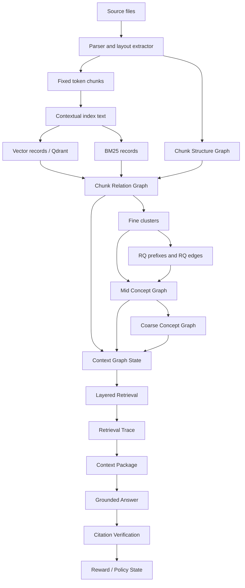
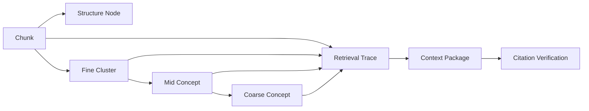
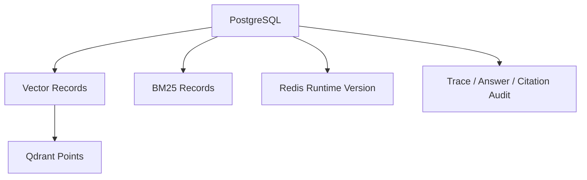
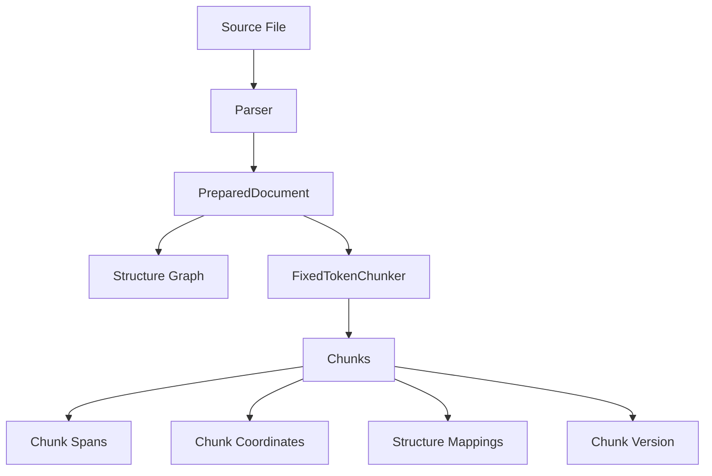
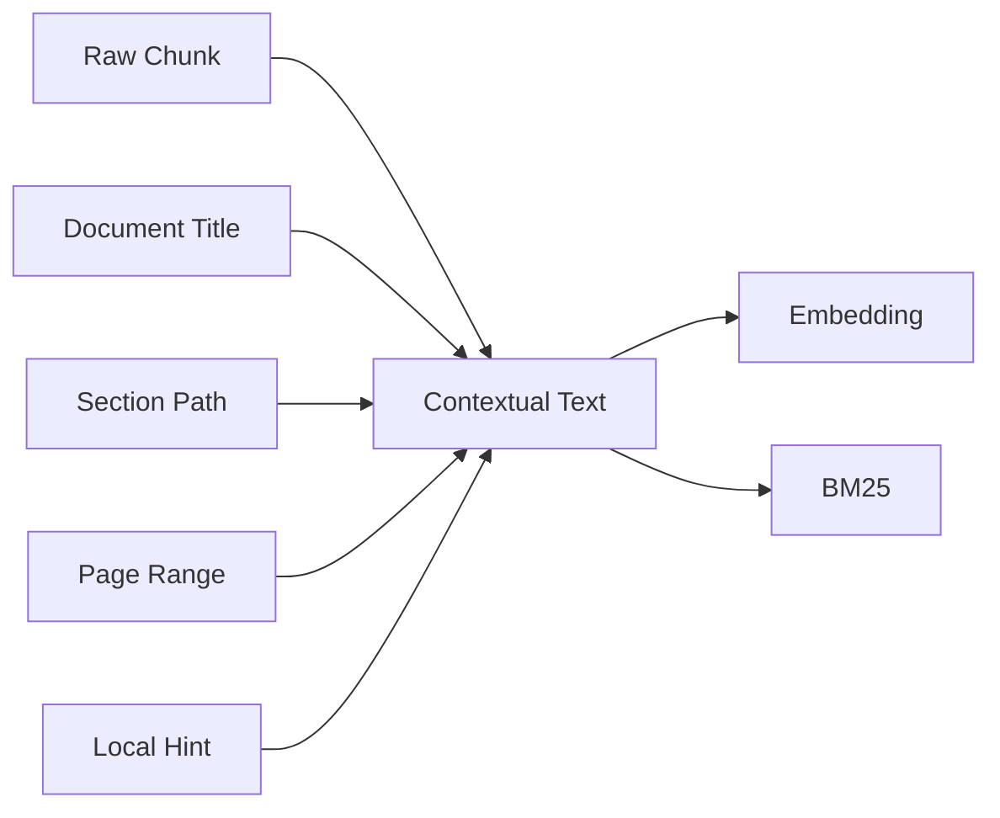
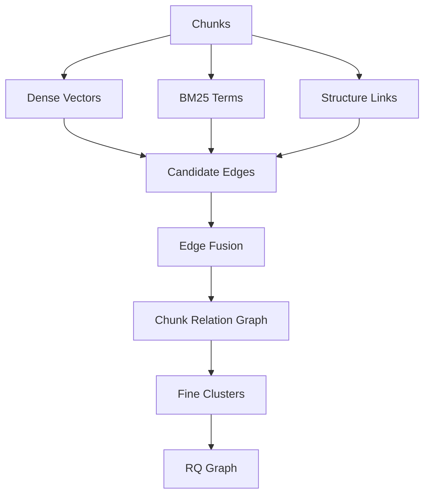
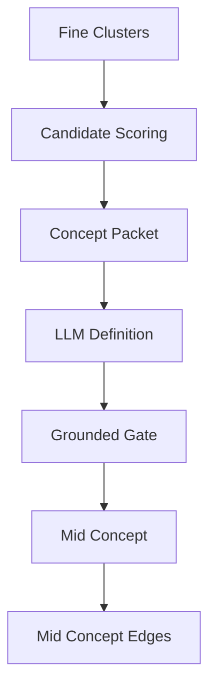
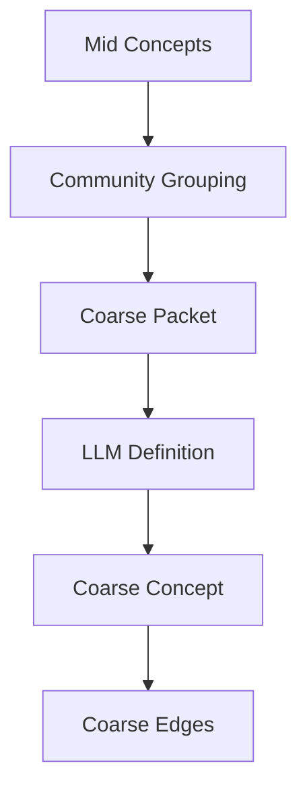
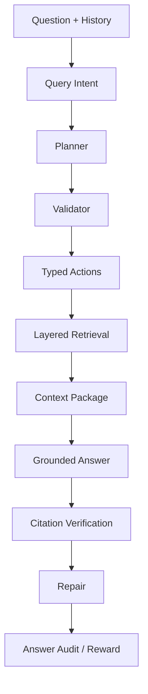

# SymboGraph Four-Layer Context Graph RAG 技术白皮书

## 目录

- [摘要](#摘要)
- [端到端链路](#端到端链路)
- [四层上下文图谱](#四层上下文图谱)
- [跨层对象协议](#跨层对象协议)
- [事实源与派生状态](#事实源与派生状态)
- [解析、固定 Chunk 与结构图](#解析固定-chunk-与结构图)
- [Contextual Index Text](#contextual-index-text)
- [Chunk Relation Graph](#chunk-relation-graph)
- [Fine Clusters 与 RQ-KMeans](#fine-clusters-与-rq-kmeans)
- [Mid Concept Graph](#mid-concept-graph)
- [Coarse Concept Graph](#coarse-concept-graph)
- [Layered Retrieval](#layered-retrieval)
- [Layered P&E Agent](#layered-pe-agent)
- [Context Package 与引用验证](#context-package-与引用验证)
- [Conversation State](#conversation-state)
- [Runtime Settings、Profile 与策略](#runtime-settingsprofile-与策略)
- [Freshness、缓存与热加载](#freshness缓存与热加载)
- [数据模型](#数据模型)
- [API、前端与脚本](#api前端与脚本)
- [事务、并发与安全](#事务并发与安全)
- [测试、诊断与验收](#测试诊断与验收)
- [核心原则](#核心原则)

## 摘要

传统 RAG 的第一道难题是切块。切得太短，语义被撕裂，表格、公式、图注、上下文指代和跨段推理会丢失；切得太长，召回噪声、embedding 稀释、token 成本和引用定位都会恶化。语义切块、递归切块和按标题切块都试图让 chunk 更像一个完整语义单元，但真实资料往往混合了页面布局、代码、表格、公式、标题层级和跨页连续区域，单靠切块算法很难同时满足检索、引用、上下文恢复和工程稳定性。

图 RAG 试图用图结构弥补纯向量召回的缺陷，但主流做法通常仍然先切块、再从 chunk 中抽取实体、关系或社区摘要。这个顺序让图谱质量继续受 chunk 边界制约：切块已经丢失的上下文，后续实体边、社区摘要和全局检索很难可靠补回；LLM 抽取的概念关系如果缺少 raw span 和结构路径支撑，也容易变成不可验证的解释层。学术界的图基座 RAG 探索了更彻底的图式底座，但通常依赖复杂的抽取、训练、动态图学习或大规模推理基础设施，对本地知识库的生产环境还不够轻、稳、可恢复。

SymboGraph 的判断是：瓶颈不一定是“切出完美 chunk”，而是“命中证据后能否恢复正确语义关联与原文上下文”。本项目以 ContextRAG 的上下文恢复思想为灵感，采用最简单、最稳定的固定长度 token chunk，把 chunk 视为地址和引用单位，而不是语义理解结果。系统不要求单个 chunk 自身完整表达知识，而是在 chunk 周围构建可复算关系网络、原文结构地图、概念路由层和 Agent 规划执行层。

因此，SymboGraph 采用 Four-Layer Context Graph RAG：第 0 层保存 Chunk Structure Graph，第 1 层保存 Chunk Relation Graph 与 Fine Clusters，第 2 层保存 Mid Concept Graph，第 3 层保存 Coarse Concept Graph。检索时系统按 coarse、mid、fine、chunk、structure restoration 逐层寻址，再打包 context package，最后执行 grounded answer 与 citation verification。LLM 负责概念定义、查询路由、typed action 规划、证据充分性判断和修复方向；事实证据只能来自 context package 和 raw chunk citation span。

总体目标可以写成约束优化问题：

$$
\max_{\pi,\mathcal{G},\mathcal{C}}
\ \mathbb{E}\left[
Q_{\mathrm{ground}}(a, E)
+Q_{\mathrm{complete}}(a, q)
+Q_{\mathrm{trace}}(E)
-\lambda_1 C_{\mathrm{latency}}
-\lambda_2 C_{\mathrm{token}}
-\lambda_3 R_{\mathrm{drift}}
\right]
$$

其中 \(q\) 是用户查询，\(a\) 是答案，\(E\) 是 context package 中的证据集合，\(\mathcal{G}\) 是四层上下文图谱，\(\mathcal{C}\) 是固定 chunk 地址空间，\(\pi\) 是 Agent 在 typed action space 内的策略。约束条件是：

$$
\forall \mathrm{claim}\in a,\quad
\exists e\in E:\ e=(document\_version\_id,chunk\_id,char\_span,page\_range)
$$

这个架构解决的问题是：固定 chunk 的语义破碎由结构恢复和图扩展补足，纯 top-k 召回的短视由四层寻址缓解，图 RAG 的不可验证概念边由 support chunks 和 grounded gate 约束，长对话中的上下文延续由 conversation state 管理，Agent 的策略漂移由 typed action schema、预算、trace 和 citation verification 控制。自然对话长度不设置固定硬上限；预算只约束单次任务内部的规划、检索、上下文打包、验证和修复。

本文以目标架构和目标算法为主线，同时在每节说明当前实现差异。当前代码依据主要包括 `apps/api/app/services/context_graph.py`、`apps/api/app/services/agent_graph.py`、`apps/api/app/services/retrieval.py`、`apps/api/app/models.py`、`apps/api/app/core/config.py` 和 `apps/api/app/services/runtime_settings.py`。

## 端到端链路

目标链路将本地资料库问答定义为从原始文件到可验证答案的复合映射：

$$
\mathcal{P}
=
V
\circ A
\circ K
\circ R
\circ G_3
\circ G_2
\circ G_1
\circ G_0
\circ I
\circ P_s
$$

其中 \(P_s\) 是 parser 与 layout extractor，\(I\) 是 contextual indexing，\(G_0\) 到 \(G_3\) 是四层上下文图谱，\(R\) 是 layered retrieval，\(K\) 是 context package builder，\(A\) 是 grounded answer generator，\(V\) 是 citation verification。

目标流程：

```text
source files
-> parser and layout extractor
-> fixed token chunks
-> chunk structure graph
-> contextual embedding and BM25
-> chunk relation graph and fine clusters
-> RQ prefix clusters and RQ relation edges
-> mid concept graph
-> coarse concept graph
-> active context graph state
-> layered context graph retrieval
-> context package
-> grounded answer
-> citation verification
-> reward event
-> policy state update
```



目标链路的核心约束是单调可追溯性。若 \(h_l\) 表示第 \(l\) 层 state hash，则任意一次检索 trace 必须保存：

$$
\tau(q)
=
\left(
q,\ h_{\mathrm{chunk}},h_{\mathrm{struct}},h_{\mathrm{rel}},
h_{\mathrm{fine}},h_{\mathrm{mid}},h_{\mathrm{coarse}},
h_{\mathrm{runtime}},h_{\mathrm{agent}}
\right)
$$

**当前实现差异：** 当前代码中四层构建入口是 `rebuild_context_graph()`，实际执行：

```text
build_chunk_relation_graph()
-> build_mid_concept_graph()
-> build_coarse_concept_graph()
-> write_context_graph_state()
```

`write_context_graph_state()` 已保存 relation、mid、coarse state 及多类 hash；structure graph hash 当前由 active chunks 的 `section_path`、page 与相邻关系组合计算，而不是独立 structure state 表。

**架构影响：**
- 影响对象：解析、固定 chunk、结构图、contextual index、chunk relation graph、fine clusters、mid concepts、coarse concepts、layered retrieval、Agent、context package、citation verification 和 policy update。
- 影响方式：端到端链路定义状态传播顺序；任一上游状态 hash 变化都会改变下游候选集合、concept packet、检索路径、证据包和回答审计。
- 传播字段：`knowledge_base_id`、`document_version_id`、`chunk_version`、`chunk_scope_hash`、`structure_graph_hash`、`chunk_relation_hash`、`fine_cluster_hash`、`mid_concept_hash`、`coarse_concept_hash`、`runtime_settings_hash`。
- 触发条件：active chunk scope、embedding text、关系边、concept definition、runtime settings 或 policy state 改变时，相关 trace、cache、context package 和 graph freshness 需要重新计算。
- 验收观察点：`context_graph_states`、`context_graph_freshness`、`retrieval_traces`、`graph_retrieval_steps`、`context_packages` 与 `citation_verifications` 必须形成连续审计链。

## 四层上下文图谱

目标四层图谱是异构多层图：

$$
\mathcal{G}
=
\left(
G_0,G_1,G_2,G_3,\Pi
\right)
$$

其中 \(G_0=(V_0,E_0)\) 是结构图，\(G_1=(V_C\cup V_F,E_{CC}\cup E_{CF}\cup E_{FF})\) 是 chunk relation graph 与 fine clusters，\(G_2=(V_M,E_M)\) 是 mid concept graph，\(G_3=(V_K,E_K)\) 是 coarse concept graph，\(\Pi\) 是跨层 membership 与 trace 投影。

跨层投影的目标性质是保守性：

$$
\forall v\in V_2\cup V_3,\quad
support(v)\subseteq V_C
$$

即概念层节点不能成为事实源，必须能回到 chunk support。

### 第 0 层：Chunk Structure Graph

目标 \(G_0\) 保存原文地图，包含 document、section、page、region、paragraph、table、formula、caption 等结构对象。结构边的目标集合为：

$$
E_0
=
E_{\mathrm{parent}}
\cup E_{\mathrm{prev}}
\cup E_{\mathrm{page}}
\cup E_{\mathrm{region}}
\cup E_{\mathrm{closure}}
$$

chunk 到结构节点的映射权重定义为：

$$
w_{c,s}^{(0)}
=
\alpha_1\operatorname{SpanOverlap}(c,s)
+\alpha_2\operatorname{BBoxIoU}(c,s)
+\alpha_3\operatorname{PathMatch}(c,s)
$$

**当前实现差异：** 当前落库实现写入 document 与 section 节点，边类型为 `parent_child`、`prev_next`、`same_page`。bbox 与 region 能通过 `chunk_coordinates` 和 metadata 承载，但 table/formula/caption 级 closure 还没有独立结构节点类型。

**架构影响：**
- 影响对象：contextual index、chunk relation graph、layered retrieval、context package、citation verification 和前端结构上下文展示。
- 影响方式：结构图决定 chunk 的 parent section、previous/next、same page 和 section path；检索命中后由它恢复上下文，并为结构邻接边提供输入。
- 传播字段：`chunk_structure_nodes`、`chunk_structure_edges`、`chunk_structure_mappings`、`chunk_coordinates`、`section_path`、`page_range`、`bbox`。
- 触发条件：parser output、section offsets、chunk span、page/region metadata 或 structure mapping coverage 变化时，structure hash、context package 和相关 retrieval cache 需要刷新。
- 验收观察点：structure mapping coverage、parent section 命中率、previous/next 恢复数量、same page 邻居数量和 citation span 可回溯性。

### 第 1 层：Chunk Relation Graph

目标 \(G_1\) 是可复算底层关系网络。候选边来自：

$$
E_{\mathrm{cand}}
=
E_{\mathrm{dense}}
\cup E_{\mathrm{bm25}}
\cup E_{\mathrm{struct}}
\cup E_{\mathrm{cohit}}
\cup E_{\mathrm{rq}}
\cup E_{\mathrm{bridge}}
$$

每条边具有特征：

$$
\phi_{ij}
=
\left[
\cos(e_i,e_j),
\operatorname{BM25}(i,j),
\operatorname{Struct}(i,j),
\operatorname{CoHit}(i,j),
\operatorname{RQ}(i,j),
\operatorname{Bridge}(i,j)
\right]
$$

边权目标形式为：

$$
w_{ij}
=
\sigma(\theta^\top\phi_{ij})
$$

**当前实现差异：** 当前已落地 `structure_adjacent`、`same_section`、`same_page_region`、`dense_knn`、`bm25_overlap`、`rq_hierarchy_near`、`rq_prefix_sibling`、`rq_residual_near`。`co_retrieved` 作为目标边类型保留在 operating envelope 中，但当前 relation builder 尚未写入共检索边。

**架构影响：**
- 影响对象：fine clusters、mid concept packet、coarse community diagnostics、layered retrieval、bridge expansion、Agent repair 和 graph visualization。
- 影响方式：关系边把固定 chunk 变成可遍历网络；fine cluster、bridge chunk、concept candidate 和 graph path score 都依赖这些边。
- 传播字段：`chunk_relation_graph_states`、`chunk_relation_edges.edge_type`、`weight`、`features_json`、`source_algorithm`、`protocol_version`、`rq_path`。
- 触发条件：embedding text version、vector records、BM25 records、structure hash、RQ settings 或 edge keep policy 变化时，relation state hash 与下游 fine/mid/coarse hash 需要重算。
- 验收观察点：edge count by type、bridge edge count、degree distribution、RQ edge diagnostics、graph expansion steps 和 retrieval contribution。

### 第 2 层：Mid Concept Graph

目标 \(G_2\) 将 fine clusters 与 bridge chunks 压缩成可解释概念。一个 mid concept \(m\) 的定义由 concept packet \(P_m\) 和 LLM function \(f_{\mathrm{LLM}}\) 给出：

$$
m
=
f_{\mathrm{LLM}}(P_m)
$$

grounded gate 定义为：

$$
\operatorname{accept}(m)
=
\mathbf{1}\left[
|S_C(m)|>0
\land
|S_F(m)|>0
\land
\operatorname{SpanValid}(S_C(m))
\right]
$$

其中 \(S_C(m)\) 是 support chunks，\(S_F(m)\) 是 support fine clusters。

**当前实现差异：** 当前代码对 support chunks 做 cluster 内过滤；如果 LLM 未返回有效 support chunks，则使用 fine cluster 的 support chunks 前若干项，保证概念不会无支撑落库。

**架构影响：**
- 影响对象：coarse concept graph、concept routing、Layered P&E Agent、context package packing、answer grounding 和前端概念路径展示。
- 影响方式：mid concept 将 fine cluster 与 bridge chunk 组织成可解释语义地址；检索先激活概念，再回落到 support chunks 和 fine clusters。
- 传播字段：`mid_concepts`、`mid_concept_memberships`、`mid_concept_edges`、`mid_concept_definitions.support_spans_json`、`support_chunk_ids`、`support_fine_cluster_ids`。
- 触发条件：fine cluster support、bridge chunks、concept packet、LLM definition、grounded gate 或 prompt protocol 变化时，mid concept hash、coarse hash 和 retrieval cache 需要刷新。
- 验收观察点：concept grounded rate、support span coverage、membership role 分布、concept edge 支撑率和 concept path accuracy。

### 第 3 层：Coarse Concept Graph

目标 \(G_3\) 是 mid concept graph 上的高层主题区域。目标上可使用社区目标函数：

$$
Q
=
\frac{1}{2m}
\sum_{i,j}
\left[
A_{ij}
-\gamma\frac{k_i k_j}{2m}
\right]
\mathbf{1}[g_i=g_j]
$$

同时保留桥接概念：

$$
B(v)
=
\sum_{s\ne t}
\frac{\sigma_{st}(v)}{\sigma_{st}}
$$

其中 \(B(v)\) 是 betweenness，\(\sigma_{st}\) 是从 \(s\) 到 \(t\) 的最短路径数。

**当前实现差异：** 当前实现使用 `bridge_aware_label_bucket_v1`，按 mid concept label 的检索 token 分桶；过碎时按 3 个一组回退。代码保存 modularity、conductance、bridge density、community stability、singleton rate 等 diagnostics，但没有依赖外部社区检测库。

**架构影响：**
- 影响对象：coarse activation、mid concept drilldown、cross-document synthesis、Agent coarse jump、graph overview 和 retrieval cache。
- 影响方式：coarse concept 作为高层入口收缩查询空间，同时保留 weak ties 与 bridge concepts，避免主题社区切断跨域推理路径。
- 传播字段：`coarse_concepts`、`coarse_concept_memberships`、`coarse_concept_edges`、`coarse_concept_definitions`、`bridge_density`、`community_stability`、`coarse_concept_hash`。
- 触发条件：mid concept hash、mid edge、community grouping、coarse definition 或 bridge diagnostics 变化时，coarse activation、retrieval trace 和 cache key 需要刷新。
- 验收观察点：community count、singleton rate、bridge density、coarse-to-mid drilldown 命中率和 coarse retrieval contribution。

## 跨层对象协议

### 架构图



### 关系

跨层对象协议将每层关系表示为稀疏 membership 矩阵：

$$
M^{C\to F}_{cf}\in[0,1],\quad
M^{F\to M}_{fm}\in[0,1],\quad
M^{M\to K}_{mk}\in[0,1]
$$

从 chunk 到 coarse concept 的派生支撑强度为：

$$
M^{C\to K}
=
M^{C\to F}M^{F\to M}M^{M\to K}
$$

但该乘积只作为路由和解释信号，不能替代 citation span。事实约束为：

$$
\operatorname{Fact}(x)
\Rightarrow
\exists c\in V_C,\ \exists s=(char\_start,char\_end): x\leftarrow(c,s)
$$

**当前实现差异：** 当前代码中跨层关系分别由 `chunk_structure_mappings`、`fine_cluster_memberships`、`mid_concept_memberships`、`coarse_concept_memberships` 表达。没有显式物化 \(M^{C\to K}\)，而是在 retrieval 和 graph payload 中按需展开。

### 关联字段

跨层协议要求每个可审计对象携带主键、state id 与 hash：

$$
id(o)
=
\left(
pk,\ state\_id,\ protocol\_version,\ state\_hash
\right)
$$

核心字段：

```text
chunk_id
document_version_id
structure_node_id
fine_cluster_id
mid_concept_id
coarse_concept_id
chunk_relation_graph_state_id
mid_concept_state_id
coarse_concept_state_id
context_graph_state_id
retrieval_trace_id
context_package_id
answer_session_id
citation_verification_id
runtime_settings_hash
agent_operating_envelope_hash
```

### 代码中的 state hash

目标上，任意 active context graph 的 hash 为：

$$
h_{\mathcal{G}}
=
H\left(
h_C,h_0,h_1,h_F,h_2,h_3,h_{\mathrm{runtime}},h_{\mathrm{agent}}
\right)
$$

**当前实现差异：** 当前 `ContextGraphState` 保存上述 hash。`ChunkRelationGraphState` 使用 `chunk_relation_graph_rq_v2`，mid/coarse prompt protocol 分别是 `mid_concept_definition_v1` 与 `coarse_concept_definition_v1`，answer prompt protocol 是 `context_graph_answer_v1`。

**架构影响：**
- 影响对象：所有跨层跳转、检索 trace、context package、answer audit、前端图谱 payload 和运维对账脚本。
- 影响方式：跨层协议提供 id、state 与 hash 的共同坐标系，使 chunk、fine cluster、mid concept、coarse concept、context package 与 citation verification 能在同一审计链中互相定位。
- 传播字段：`chunk_id`、`fine_cluster_id`、`mid_concept_id`、`coarse_concept_id`、`context_graph_state_id`、`retrieval_trace_id`、`context_package_id`、`state_hash`。
- 触发条件：任一层 state id、protocol version 或 hash 变化时，下游 API payload、cache key、retrieval trace 和 UI graph view 都应使用新协议坐标。
- 验收观察点：跨层 id 不悬空、trace step 可回放、context package 可回到 raw chunk span、answer session 可回到 citation verification。

## 事实源与派生状态

### 架构图



目标系统采用事实源与派生状态分离。设 \(S_P\) 为 PostgreSQL 持久状态，\(S_D\) 为派生状态，则一致性定义为：

$$
\operatorname{Consistent}(S_P,S_D)
=
\mathbf{1}
\left[
H(\operatorname{rebuild}(S_P))=H(S_D)
\right]
$$

**当前实现差异：** 当前代码已经把 PostgreSQL 作为主事实源，并把 Qdrant、BM25 与 Redis 放在可重建或可刷新位置；但派生状态的强一致性仍主要依赖 reconcile、diagnostics 与 smoke check，而不是完整的自动闭环修复调度。

### PostgreSQL

PostgreSQL 保存不可丢失事实、生命周期与审计记录。目标上它是唯一可恢复源：

$$
S_{\mathrm{recover}}
=
F_{\mathrm{rebuild}}(S_{\mathrm{postgres}})
$$

当前实现保存 knowledge bases、documents、chunks、structure graph、relation graph、concept graphs、context graph state、retrieval traces、context packages、answer sessions、citation verifications、reward events、policy states 和 runtime settings versions。

### Qdrant

向量索引目标函数是近似最近邻：

$$
\operatorname{ANN}(q)
=
\operatorname*{arg\,topk}_{c\in C}
\cos(e_q,e_c)
$$

Qdrant 是派生索引。当前代码使用：

$$
collection
=
\operatorname{sanitize}
\left(
symbograph,\ embedding\_model,\ embedding\_text\_version,\ chunk\_schema\_version
\right)
$$

当前实现还在 `VectorRecord.diagnostics_json` 保存 embedding vector，以便本地 layered retrieval 直接计算 dense score。

### BM25

BM25 的理论打分为：

$$
\operatorname{BM25}(q,d)
=
\sum_{t\in q}
IDF(t)
\cdot
\frac{f(t,d)(k_1+1)}
{f(t,d)+k_1(1-b+b\frac{|d|}{avgdl})}
$$

当前实现将 contextual text token frequencies 写入 `BM25Record`，检索时用 `BM25Okapi` 从 ready records 构造 corpus。

### Redis

Redis 承担 runtime version broadcast。理论上，热加载事件为：

$$
event
=
\left(h_{\mathrm{runtime}},\Delta keys,source,timestamp\right)
$$

当前实现 `publish_runtime_settings_version()` 写入 `runtime_settings_versions`，设置 Redis key，发布 channel message，并清理 settings、cache manager 与 reranker cache。

**架构影响：**
- 影响对象：导入、索引、图构建、检索、QA、Agent、runtime settings、缓存、对账脚本和测试验收。
- 影响方式：PostgreSQL 决定可恢复事实；Qdrant、BM25 与 Redis 只能改变召回效率、运行态协调和热加载，不改变事实来源。
- 传播字段：`vector_records`、`bm25_records`、`runtime_settings_versions`、`payload_hash`、`collection_name`、`status`、`diagnostics_json`。
- 触发条件：派生索引缺失、payload hash 不一致、runtime version 更新或 Redis broadcast 失败时，相关检索路径应进入重建、刷新或阻断。
- 验收观察点：Qdrant/BM25 对账通过、runtime publish 可观测、cache miss 行为正确、派生状态能从 PostgreSQL 重建。

## 解析、固定 Chunk 与结构图

### 架构图



### PreparedDocument

目标解析产物定义为：

$$
D
=
(T,L,S,M)
$$

其中 \(T\) 是文本序列，\(L\) 是布局坐标，\(S\) 是结构对象集合，\(M\) 是 parser metadata。解析目标不是创造语义事实，而是为 chunk 和结构恢复提供可定位地址。

**当前实现差异：** 当前 `PreparedDocument` 主要提供 text、section offsets 与 metadata。`write_structure_graph()` 根据 section offsets 创建 document/section 结构节点。

### 固定 Token Chunk

目标固定切块函数：

$$
C
=
\operatorname{FixedChunk}(D;B,O,\Omega)
$$

其中 \(B\) 是 chunk token budget，\(O\) 是 overlap，\(\Omega\) 是保护对象集合。chunk 边界满足：

$$
|c_i|\le B+\epsilon_{\Omega}
$$

相邻 chunk 的覆盖关系为：

$$
c_i\cap c_{i+1}
\approx
O
$$

**当前实现差异：** 当前参数来自 `Settings`：`fixed_chunk_size_tokens=512`，`fixed_chunk_overlap_tokens=80`。`ChunkVersion` 保存 chunk schema、tokenizer version、size、overlap、state hash 与 diagnostics。

每个 `Chunk` 保存 token span、char span、text hash、section path、page range、previous/next chunk、RQ path 与 residual norm。Chunk 的主要语义是地址，而不是完整知识单元。

### 结构图写入

目标结构映射权重：

$$
w(c,s)
=
\alpha
\frac{|span(c)\cap span(s)|}{|span(c)|}
+(1-\alpha)\operatorname{LayoutOverlap}(c,s)
$$

当前实现以 char overlap 为主：

$$
overlap(c,s)
=
\max
\left(
0,\min(c_e,s_e)-\max(c_b,s_b)
\right)
$$

coverage ratio：

$$
coverage(c,s)
=
\frac{overlap(c,s)}
{\max(1,c_e-c_b)}
$$

**当前实现差异：** 当前 structure node 类型是 document/section；document mapping role 为 `parent`，section mapping role 为 `overlap`。page 信息保存在 section node 和 chunk coordinates 中。

### 版本与取消边界

目标版本语义用知识库内最高 chunk version 表示：

$$
v_{\mathrm{target}}
=
\begin{cases}
1,& v_{\max}=0\\
v_{\max}+1,& full\ rebuild\\
v_{\max},& selected\ parse
\end{cases}
$$

取消恢复不能使用 \(v-1\) 推断，应使用解析前记录的 active version：

$$
rollback\_version
=
v_{\mathrm{before\_batch}}
$$

**当前实现差异：** 当前导入与重建通过 ingestion batch/job stats、heartbeat、state 和 compensation 记录追踪。进入向量、BM25 或图谱阶段后，外部副作用由对账脚本修复。

**架构影响：**
- 影响对象：contextual index、Qdrant、BM25、chunk relation graph、fine clusters、concept graphs、retrieval trace、context package 和 citation verification。
- 影响方式：固定 chunk 定义全系统最小地址单位；结构图定义上下文恢复路径；版本策略决定下游索引、图状态与引用审计是否仍然有效。
- 传播字段：`chunk_id`、`chunk_version`、`chunk_index`、`char_start`、`char_end`、`token_start`、`token_end`、`text_hash`、`section_path`、`page_range`。
- 触发条件：chunk size、overlap、tokenizer、parser output、chunk span、document version 或 active chunk scope 变化时，contextual index、relation graph、concept graph 和 cache 都需要刷新或重建。
- 验收观察点：active chunk 版本一致、span 不越界、结构映射覆盖率达标、取消恢复回到 batch 前版本、citation 能回到 raw chunk。

## Contextual Index Text

### 架构图



目标是分离“索引用文本”和“引用用文本”。定义：

$$
x_c^{ctx}
=
\operatorname{concat}
\left(
title(d),
section(c),
page(c),
hint(c),
x_c
\right)
$$

raw citation 仍然是：

$$
cite(c)
=
(document\_version\_id,chunk\_id,char\_start,char\_end,page\_range)
$$

### Context text

目标上，contextual text 改变必须改变：

$$
h_{\mathrm{ctx}}(c)
=
H(x_c^{ctx},embedding\_text\_version)
$$

**当前实现差异：** 当前 `ChunkContextText` 保存 raw text、contextual text、`contextual_text_v1`、context hash、prompt protocol version 与 metadata。

### Vector records

目标 embedding：

$$
e_c
=
f_{\mathrm{emb}}(x_c^{ctx};\theta_{\mathrm{emb}})
$$

vector payload hash：

$$
h_{\mathrm{vec}}
=
H(e_c,chunk\_id,embedding\_model,embedding\_text\_version)
$$

**当前实现差异：** 当前写入 Qdrant，并在 `vector_records` 中保存 qdrant point、collection、model、dimension、text version、payload hash、status 与 diagnostics。

### BM25 records

目标 lexical index：

$$
tf_{c,t}
=
\sum_{u\in tokenize(x_c^{ctx})}
\mathbf{1}[u=t]
$$

当前实现保存 term frequencies、document length、token count、text hash 和 tokenizer version。BM25 records 可由 chunks 与 chunk context texts 重建。

**架构影响：**
- 影响对象：dense recall、BM25 recall、chunk relation graph、RQ path、layered retrieval、rerank、context package packing 和 cache key。
- 影响方式：contextual text 是 embedding 与 lexical index 的输入；它改变召回分布和关系边候选，但 citation 仍必须指向 raw chunk span。
- 传播字段：`chunk_context_texts.context_hash`、`embedding_text_version`、`vector_records.payload_hash`、`bm25_records.text_hash`、`tokenizer_version`。
- 触发条件：contextual prompt、embedding text version、embedding model、BM25 tokenizer 或 context hash 变化时，Qdrant、BM25、relation graph 和 retrieval cache 必须刷新。
- 验收观察点：vector record ready 率、BM25 record ready 率、embedding dimension 一致、context hash 与 payload hash 对齐、raw span citation 不受 contextual text 改写影响。

## Chunk Relation Graph

### 架构图



### State

目标 relation graph state：

$$
S_1
=
(V_C,V_F,E_{CC},E_{CF},E_{FF},h_1,p_1)
$$

其中 \(h_1\) 是 state hash，\(p_1\) 是 protocol version。当前 protocol 是 `chunk_relation_graph_rq_v2`。

目标 state hash：

$$
h_1
=
H(scope(C),stats(E),clusters(F),p_1)
$$

**当前实现差异：** 当前 `ChunkRelationGraphState` 保存 scope hash、embedding text version、active chunk ids、stats 和 diagnostics。state hash 在构建结束后更新，并回写到每条 relation edge。

### Edge builder

目标候选边：

$$
E_{\mathrm{cand}}
=
E_{\mathrm{prevnext}}
\cup E_{\mathrm{section}}
\cup E_{\mathrm{page}}
\cup E_{\mathrm{dense}}
\cup E_{\mathrm{lexical}}
\cup E_{\mathrm{rq}}
$$

目标边特征：

$$
\phi_{ij}
=
\left[
\operatorname{Adj}(i,j),
\operatorname{SameSec}(i,j),
\operatorname{SamePage}(i,j),
\cos(e_i,e_j),
J(T_i,T_j),
\operatorname{RQ}(i,j)
\right]
$$

其中 \(J(T_i,T_j)\) 是 term set Jaccard：

$$
J(T_i,T_j)
=
\frac{|T_i\cap T_j|}{|T_i\cup T_j|}
$$

**当前实现差异：** 当前基础边规则是确定性的：

```text
structure_adjacent: previous/next chunk，weight = 1.0
same_section: same section sliding pairs，weight = 0.72
same_page_region: same page sliding pairs，weight = 0.68
dense_knn: cosine top 5 and score > 0.3
bm25_overlap: term Jaccard top 5 and score > 0.08
```

Bridge 标记：

$$
bridge(i,j)
=
\mathbf{1}
\left[
section_i\ne section_j
\land
\left(
\cos(e_i,e_j)>0.52
\lor
J(T_i,T_j)>0.18
\right)
\right]
$$

### Graph score

目标 graph path score 可由 Personalized PageRank、degree、path reliability 或 relation-type weighted walk 表示：

$$
s_{\mathrm{graph}}(c)
=
\sum_{p:q\leadsto c}
\prod_{e\in p} w_e\cdot \eta_{\operatorname{type}(e)}
$$

**当前实现差异：** 当前实现用 degree proxy：

$$
s_{\mathrm{graph}}(c)
=
\min\left(1,\frac{deg(c)}{8}\right)
$$

Bridge bonus：

$$
s_{\mathrm{bridge}}(c)
=
\min\left(1,\frac{deg_{\mathrm{bridge}}(c)}{4}\right)
$$

**架构影响：**
- 影响对象：fine clusters、RQ prefix clusters、mid concept packet、layered retrieval score、bridge repair、context package bridge chunks 和 graph diagnostics。
- 影响方式：relation graph 把 dense、BM25、结构和 RQ 信号统一成可遍历边；下游不直接使用孤立 cluster label，而是使用边、membership 和 path score。
- 传播字段：`chunk_relation_graph_state_id`、`chunk_relation_edges`、`fine_cluster_memberships`、`fine_cluster_edges`、`edge_type`、`features_json`、`state_hash`。
- 触发条件：embedding、BM25、structure mapping、chunk scope、RQ settings 或 relation protocol 变化时，fine clusters、mid concepts、coarse concepts、retrieval trace 和 cache 需要刷新。
- 验收观察点：relation state ready、edge type 分布、bridge ratio、graph score contribution、trace 中 graph expansion steps 和 diagnostics hash。

## Fine Clusters 与 RQ-KMeans

### Fine clusters

目标 fine clustering 在 \(G_1\) 上形成局部语义区域。可以定义为图聚类目标：

$$
\max_{\mathcal{F}}
\sum_{f\in\mathcal{F}}
\left[
\sum_{i,j\in f}w_{ij}
-\gamma
\sum_{i\in f,j\notin f}w_{ij}
\right]
$$

fuzzy membership：

$$
\mu_{c,f}
=
\frac{\exp(-d(e_c,\mu_f)/\tau)}
{\sum_{f'}\exp(-d(e_c,\mu_{f'})/\tau)}
$$

**当前实现差异：** 当前 `build_fine_clusters()` 按 section/term label 分桶；若每个 chunk 都独立且 chunk 数大于 4，则按每 4 个 chunk 一个 local cluster 回退。基础 membership 分数为 \(1.0\)，bridge chunk 加入其他 cluster 的分数为 \(0.35\)。

### Fine cluster edges

目标 cluster edge：

$$
w_{fg}
=
\beta_1\cos(\mu_f,\mu_g)
+\beta_2\frac{|S_f\cap S_g|}{|S_f\cup S_g|}
+\beta_3\operatorname{BridgeOverlap}(f,g)
$$

**当前实现差异：** 当前写入 `centroid_near` 与 `overlap_bridge`，并保存 support chunk ids 与 diagnostics。

### RQ-KMeans

目标 RQ-KMeans 将 embedding 递归量化为语义地址。对 chunk embedding \(e_c\)：

$$
r_c^{(0)}=e_c
$$

第 \(l\) 层：

$$
q_c^{(l)}
=
\operatorname*{arg\,min}_{k}
\left\|r_c^{(l-1)}-\mu_{l,k}\right\|_2
$$

$$
r_c^{(l)}
=
r_c^{(l-1)}-\mu_{l,q_c^{(l)}}
$$

RQ path：

$$
path(c)
=
\left(q_c^{(1)},q_c^{(2)},\ldots,q_c^{(L)}\right)
$$

residual norm：

$$
\rho_c
=
\left\|r_c^{(L)}\right\|_2
$$

**当前实现差异：** 当前 `train_rq_kmeans()` 每层 codebook 大小为：

$$
k
=
\min\left(k_{\max},\lfloor\sqrt{n}\rfloor+1,n\right)
$$

每层最多迭代 8 次。训练结果写入 relation state diagnostics，protocol 为 `residual_quantized_kmeans_v1`。

### RQ prefix clusters

目标上，每个 prefix 是层级地址节点：

$$
prefix_l(c)
=
(q_c^{(1)},\ldots,q_c^{(l)})
$$

prefix membership：

$$
\mu_{c,p}
=
\max
\left(
0.2,\min(1,e^{-\rho_c/\tau_r})
\right)
$$

**当前实现差异：** 当前为每个 RQ prefix 创建 `FineCluster`，保存 `rq_level`、`rq_path_prefix`、centroid vector ref、support chunks、bridge chunks、residual norm mean/max 和 residual mean vector。

### RQ cluster edges

目标 RQ cluster graph 包含 parent-child、sibling、centroid-near、overlap-bridge：

$$
E_F^{rq}
=
E_{\mathrm{parent}}
\cup E_{\mathrm{sibling}}
\cup E_{\mathrm{centroid}}
\cup E_{\mathrm{overlap}}
$$

当前实现写入：

```text
rq_parent_child
rq_sibling
rq_centroid_near
rq_overlap_bridge
```

### RQ chunk edges

两个 chunk 的最长公共前缀：

$$
LCP(c_i,c_j)
=
\max
\left\{
l:\ prefix_l(c_i)=prefix_l(c_j)
\right\}
$$

RQ edge weight：

$$
w_{ij}^{rq}
=
\frac{LCP(c_i,c_j)}{L}
\cdot
\exp
\left(
-\frac{\|r_i-r_j\|_2}{\tau_r}
\right)
$$

当前实现写入：

```text
rq_hierarchy_near
rq_prefix_sibling
rq_residual_near
```

并在 edge features 中保存 `lcp_depth`、`residual_distance`、`rq_weight`、source/target rq path。若某类 RQ edge 没自然产生，会选择 residual 最近 pair 写入 fallback pair，保证 trace 和 UI 中可诊断。

**架构影响：**
- 影响对象：mid concept candidate selection、concept packet、fine routing、RQ route score、bridge expansion、retrieval trace 和前端 fine/RQ 诊断。
- 影响方式：fine clusters 提供细粒度候选组织，RQ path 提供残差语义地址；二者共同收缩候选空间，但不删除跨 cluster bridge edges。
- 传播字段：`fine_clusters`、`fine_cluster_memberships`、`fine_cluster_edges`、`rq_path`、`rq_level`、`rq_path_prefix`、`residual_norm`、`lcp_depth`、`residual_distance`。
- 触发条件：relation graph hash、embedding vectors、RQ level/codebook、cluster grouping、bridge support 或 residual diagnostics 变化时，mid concept hash 和 retrieval cache 必须刷新。
- 验收观察点：fine cluster singleton rate、fuzzy membership 数量、RQ path availability、RQ edge type coverage、LCP depth 分布和 RQ route score 贡献。

## Mid Concept Graph

### 架构图



### Candidate selection

目标候选选择是覆盖率、桥接性、RQ 多样性和 token budget 的约束优化：

$$
\max_{\mathcal{S}}
\sum_{f\in\mathcal{S}}
\left(
\alpha_1 Coverage(f)
+\alpha_2 Bridge(f)
+\alpha_3 RQ(f)
\right)
$$

约束：

$$
|\mathcal{S}|\le B_{\mathrm{concept}},\quad
\sum_{f\in\mathcal{S}} tokens(P_f)\le B_{\mathrm{token}}
$$

**当前实现差异：** 当前候选分数是：

$$
s(f)
=
0.75\cdot support(f)
+0.10\cdot bridge(f)
+rq(f)
$$

其中 \(rq(f)=0.15\) 当 fine cluster 是 RQ prefix cluster，否则为 \(0\)。

### Concept packet

目标 concept packet：

$$
P_f
=
\left(
R_f,S_f,B_f,Q_f,X_f
\right)
$$

其中 \(R_f\) 是代表 chunks，\(S_f\) 是 support chunks，\(B_f\) 是 bridge chunks，\(Q_f\) 是 RQ diagnostics，\(X_f\) 是 chunk excerpts 和 source spans。

当前 packet 字段包括 packet id、fine cluster ids、candidate labels、representative chunk ids、support/bridge counts、support/bridge chunk ids、RQ sampling、chunk excerpts 和 grounding hash。

### LLM 定义

目标 LLM 输出：

$$
y_m
=
f_{\mathrm{LLM}}
\left(
P_f,\ prompt_{\mathrm{mid}}
\right)
$$

输出必须可解析为：

```text
canonical_label
aliases
definition
scope_note
inclusion_criteria
exclusion_criteria
representative_chunk_ids
support_chunk_ids
confidence
why_this_concept_exists
```

**当前实现差异：** 当前 prompt 要求 strict JSON。若 provider 返回不可用结构，则使用 `mid_concept_fallback()` 生成保守概念。

### 写入规则

目标 grounded gate：

$$
\operatorname{accept}(m)
=
\mathbf{1}
\left[
S_C(m)\ne \varnothing
\land
S_C(m)\subseteq support(f)
\land
\forall c\in S_C(m),\ Span(c)\ne\varnothing
\right]
$$

**当前实现差异：** 当前代码强制 `support_chunk_ids` 必须属于 cluster support；为空则使用 cluster support 前 5 个。`MidConceptDefinition.support_spans_json` 保存 chunk id、document version id、char span、page range 和 section path。

### Concept edges

目标 mid concept edge 应由底层网络证据先生成候选：

$$
s(m_i,m_j)
=
\eta_1\operatorname{ChunkOverlap}
+\eta_2\operatorname{EdgeDensity}
+\eta_3\operatorname{BridgeScore}
+\eta_4\operatorname{LexicalOverlap}
$$

当前实现使用 support chunk overlap 和 definition lexical overlap：

$$
s(m_i,m_j)
=
\min
\left(
1,
0.3|S_i\cap S_j|
+0.05|\operatorname{tok}(d_i)\cap\operatorname{tok}(d_j)|
\right)
$$

当 \(s\ge 0.1\) 写入 edge。有 shared support chunks 时 edge type 为 `co_occurs_with`，否则为 `bridge_to`。

**架构影响：**
- 影响对象：coarse community grouping、coarse concept definition、concept routing、Agent planning、context package coverage、citation grounding 和 answer synthesis。
- 影响方式：mid concepts 把底层 chunk/fine cluster 网络提升为可解释语义路由；它们的 support spans 决定概念能否参与检索、回答和引用验证。
- 传播字段：`mid_concept_state_id`、`mid_concepts`、`mid_concept_memberships`、`mid_concept_edges`、`mid_concept_definitions`、`support_chunk_ids`、`support_spans_json`、`grounding_hash`。
- 触发条件：fine cluster hash、bridge chunks、LLM prompt protocol、concept packet、support span 或 grounded gate 变化时，coarse graph、retrieval trace、context package 和 cache 需要刷新。
- 验收观察点：mid concept grounded rate、support chunk coverage、definition confidence、edge support density、concept path accuracy 和 unsupported concept diagnostics。

## Coarse Concept Graph

### 架构图



### Community grouping

目标 coarse graph 可基于社区优化和桥接保护：

$$
\max_{\mathcal{K}}
Q(\mathcal{K})
-\lambda_1 Conductance(\mathcal{K})
-\lambda_2 SingletonRate(\mathcal{K})
+\lambda_3 BridgeRetention(\mathcal{K})
$$

Conductance：

$$
\phi(S)
=
\frac{cut(S,\bar{S})}
{\min(vol(S),vol(\bar{S}))}
$$

**当前实现差异：** 当前 community grouping 是 `bridge_aware_label_bucket_v1`：mid concepts 数量不超过 3 时合为一个 community；否则按 canonical label 的第一个检索 token 首字符分桶；若全部 singleton，则按 3 个一组回退。

### Coarse packet

目标 coarse packet：

$$
P_k
=
\left(
M_k,E_k,B_k,W_k
\right)
$$

其中 \(M_k\) 是 mid concepts，\(E_k\) 是 mid edges，\(B_k\) 是 bridge concepts，\(W_k\) 是 weak ties。

当前 packet 包含 community id、mid concept id/label/definition/support chunks、bridge concepts 和 grounding hash。

### 写入规则

目标 grounded definition：

$$
k
=
f_{\mathrm{LLM}}(P_k,prompt_{\mathrm{coarse}})
$$

并满足：

$$
support(k)
=
\bigcup_{m\in M_k} support(m)
$$

当前写入 `CoarseConcept`、`CoarseConceptMembership`、`CoarseConceptDefinition`。membership role 为 `bridge` 或 `included`。

### Diagnostics

目标 diagnostics：

$$
D_k
=
\left(
Q,\phi,B,stability,singleton\_rate,bridge\_density
\right)
$$

当前实现保存 modularity、conductance、betweenness、bridge density、community stability、singleton rate、cross edge count、internal edge count 和 community count。Coarse concepts 之间当前写入 `bridge_to` 弱边，weight 为 \(0.35\)。

**架构影响：**
- 影响对象：coarse activation、mid concept drilldown、cross-document synthesis、Agent coarse jump、retrieval cache、graph overview 和质量诊断。
- 影响方式：coarse concepts 决定查询先进入哪些高层主题区域，并通过 bridge concepts 与 weak ties 保留跨主题跳转能力。
- 传播字段：`coarse_concept_state_id`、`coarse_concepts`、`coarse_concept_memberships`、`coarse_concept_edges`、`coarse_concept_definitions`、`community_id`、`bridge_concepts`、`freshness_hash`。
- 触发条件：mid concept state、mid edges、community grouping、coarse definition、bridge diagnostics 或 runtime graph weights 改变时，coarse hash、retrieval cache 和 graph payload 需要刷新。
- 验收观察点：community diagnostics、bridge density、coarse activation hit rate、coarse-to-mid drilldown 路径、cross edge count 和 coarse retrieval contribution。

## Layered Retrieval

### 常规搜索链路

目标检索定义为多层激活与候选融合：

$$
R(q)
=
\operatorname{Rank}
\left(
C_{\mathrm{dense}}
\cup C_{\mathrm{bm25}}
\cup C_{\mathrm{fine}}
\cup C_{\mathrm{mid}}
\cup C_{\mathrm{coarse}}
\cup C_{\mathrm{graph}}
\right)
$$

目标链路：

```text
query
-> coarse activation
-> mid activation
-> fine activation
-> dense / BM25 recall
-> graph score and bridge bonus
-> structure restoration
-> context package
```

**当前实现差异：** 当前 `layered_search()` 先计算 query embedding 和 query RQ path，再并行获取 coarse、mid、fine、vector、lexical hits，最后对候选 chunk 融合打分。

### Activation

目标 coarse/mid 文本激活：

$$
a_l(v,q)
=
\frac{|tok(q)\cap tok(label(v),definition(v))|}
{|tok(q)|}
$$

fine centroid 激活：

$$
a_F(f,q)
=
\max
\left(
\cos(e_q,\mu_f),
a_{\mathrm{RQ}}(f,q),
\max_{m\to f}a_M(m,q)\mu_{mf}
\right)
$$

RQ 激活：

$$
a_{\mathrm{RQ}}(f,q)
=
0.7\frac{LCP(path(q),prefix(f))}{L}
+0.3\exp\left(-\frac{\|r_q-\bar{r}_f\|}{\tau_r}\right)
$$

**当前实现差异：** 当前 coarse top \(8\)，mid top \(16\)，fine top \(16\)，vector top \(80\)，lexical top \(80\)。Coarse hits 会把 included mid concepts boost 到至少 \(0.45\)。

### Score fusion

当前实现的总分就是目标初版 operating point：

$$
\begin{aligned}
s(c,q)
=&
0.30s_{\mathrm{dense}}
+0.22s_{\mathrm{bm25}}
+0.12s_{\mathrm{fine}}
+0.13s_{\mathrm{mid}}\\
&+0.08s_{\mathrm{coarse}}
+0.07s_{\mathrm{graph}}
+0.07s_{\mathrm{rq}}
+0.03s_{\mathrm{structure}}\\
&+0.04s_{\mathrm{bridge}}
-0.02p_{\mathrm{drift}}
\end{aligned}
$$

其中：

$$
s_{\mathrm{structure}}
=
0.12\cdot
\mathbf{1}[prev(c)\lor next(c)]
$$

$$
p_{\mathrm{drift}}
=
0.08\cdot\mathbf{1}[\neg context\_state]
+p_{\mathrm{rq\_drift}}
$$

### Retrieval trace

目标 trace 是每层激活和打分的审计记录：

$$
\tau_q
=
\left(
A_3,A_2,A_1,C,\mathbf{s},\mathbf{h},D_{\mathrm{rq}}
\right)
$$

当前 `RetrievalTrace` 保存 query、filters、retrieval mode、各层 hash、runtime settings hash、agent envelope hash、prompt protocol hash、result chunks、concept path、scores 和 diagnostics。

当前 `GraphRetrievalStep` 写入：

```text
coarse / activate_coarse_concepts
mid / route_mid_concepts
fine / route_fine_clusters
chunk / recall_chunks
structure / restore_context_package
```

### RQ candidate diagnostics

目标 RQ diagnostics：

$$
D_{\mathrm{rq}}(q,c)
=
\left(
path(q),path(c),LCP(q,c),\|r_q-r_c\|,s_{\mathrm{rq}}
\right)
$$

当前 result metadata 与 trace steps 保存 query/candidate RQ path、LCP depth、residual distance、RQ score 和 drift penalty。

**架构影响：**
- 影响对象：搜索页结果、QA/Agent retrieval step、context package、citation payload、reward metrics、policy update 和前端检索轨迹。
- 影响方式：layered retrieval 把 coarse、mid、fine、chunk、structure 五段寻址压缩为 ranked chunks，并把每层激活、扩展和排除原因写入 trace。
- 传播字段：`retrieval_trace_id`、`graph_retrieval_steps`、`result_chunk_ids`、`concept_path_json`、`scores_json`、`diagnostics_json`、`runtime_settings_hash`。
- 触发条件：query embedding、BM25 corpus、relation/fine/mid/coarse hash、runtime weights、agent envelope 或 conversation scope 变化时，result ranking 与 cache key 需要刷新。
- 验收观察点：各层 activation count、score components、graph expansion steps、structure restore step、RQ diagnostics、cache hit audit 和 retrieval contribution。

## Layered P&E Agent

### 架构图



目标上，Agent 可建模为受约束的部分可观测决策过程：

$$
\pi^\star
=
\operatorname*{arg\,max}_{\pi}
\mathbb{E}_{a_t\sim\pi}
\left[
\sum_t r(o_t,a_t)
\right]
$$

约束：

$$
a_t\in\mathcal{A}_{typed},\quad
cost(a_t)\le budget_t,\quad
evidence(a_t)\subseteq \mathcal{G}\cup E
$$

### Query intent

目标 query intent：

$$
z_q
=
g(q,H)
=
(intent,entities,subqueries,needs\_graph)
$$

**当前实现差异：** 当前启发式识别 comparison、formula_table_lookup、analysis、definition。若 provider 实现 `perceive_question()`，则可用模型结果覆盖或补充启发式结果。

### Typed action space

当前 action space：

```text
activate_coarse_concepts
route_mid_concepts
route_fine_clusters
recall_chunks
restore_context_package
build_context_package
verify_citations
repair_missing_citation
repair_concept_gap
repair_bridge_gap
repair_formula_context
```

目标 action schema：

$$
a
=
\left(
type,target\_ids,reason,budget,expected\_evidence,stop
\right)
$$

必需 action 集合：

$$
\mathcal{A}_{req}
=
\{recall\_chunks,restore\_context\_package,verify\_citations\}
$$

### Validator

目标 validator：

$$
\operatorname{valid}(a)
=
\mathbf{1}
\left[
type(a)\in\mathcal{A}_{typed}
\land
budget(a)\le B
\land
target(a)\subseteq IDs(\mathcal{G})
\right]
$$

**当前实现差异：** 当前 validator 检查 action type、budget、max action count，并自动插入缺失的 required actions。target id 是否存在的深度校验还不是当前执行路径的强制项。

### Operating envelope

目标 envelope：

$$
B
=
\left(
B_{coarse},B_{mid},B_{fine},B_{chunk},B_{restore},
B_{context},B_{plan},B_{repair},B_{verify}
\right)
$$

当前字段包括 coarse activation/jump、mid activation/radius、fine cluster、chunk candidate、structure restore、context package token、planning round、typed action count、repair round 和 verification budget。

### Execution

目标 P&E loop：

$$
o_t=\operatorname{Execute}(a_t,\mathcal{G},E_t),\quad
a_{t+1}=\pi(q,H,o_{\le t})
$$

当前实现是单轮 planner + optional repair：

```text
perceive intent
propose typed actions
validate typed actions
record plan/actions
layered_search
build_context_package
answer
provisional verification
optional repair search and repack
record answer audit
update reward/policy
```

Repair 触发：

$$
\exists v\in V_{\mathrm{verify}}:\ verdict(v)\ne supported
\quad\land\quad
B_{repair}>0
$$

**架构影响：**
- 影响对象：QA 链路、layered retrieval、context package、answer session、citation verification、repair loop、reward event 和 policy state。
- 影响方式：Agent 将用户问题、conversation state 和 graph state 转换为 typed actions；validator 决定哪些动作可执行，executor 决定实际检索与修复路径。
- 传播字段：`agent_runs`、`agent_plans`、`agent_actions`、`agent_observations`、`answer_sessions`、`citation_verifications`、`reward_events`、`policy_states`。
- 触发条件：intent、operating envelope、typed action schema、planner prompt、retrieval failure、citation failure 或 repair budget 变化时，Agent trace 与 answer audit 需要重新生成。
- 验收观察点：typed action validation pass rate、required action coverage、budget usage、repair success rate、unsupported claim rate 和 reward update 写入。

## Context Package 与引用验证

### Context Package

目标 context package 是受 token budget 约束的证据选择问题：

$$
E^\star
=
\operatorname*{arg\,max}_{E\subseteq \mathcal{N}(C)}
\left[
Rel(E,q)
+Cov(E)
+Struct(E)
+Bridge(E)
-Redundancy(E)
\right]
$$

约束：

$$
\sum_{e\in E} tokens(e)\le B_{ctx}
$$

当前 restoration protocol 是 `previous_next_structure_bridge_v1`。对每个 hit chunk，当前恢复：

```text
hit chunk
previous chunk
next chunk
parent structure node ids
up to 2 bridge-neighbor chunks
```

### Structure context

目标结构上下文：

$$
SC(c)
=
\left(
path(c),parent(c),siblings(c),page(c),region(c)
\right)
$$

当前 `structure_context()` 通过 chunk mappings join structure nodes，按 coverage ratio 与 depth 排序，生成 structure path、node ids、nodes 和 parent section。

### Citation payload

目标 citation：

$$
cite_i
=
\left(
chunk\_id,document\_id,document\_version\_id,
char\_span,page\_range,section\_path
\right)
$$

当前 citation payload 还带 document title、source path、snippet、context package id、retrieval trace id、verification id 和 verification 结果。

### Citation verification

目标上，引用验证近似自然语言蕴含：

$$
verdict(claim,e)
=
\operatorname{NLI}(claim,e)
\in
\{supported,contradicted,insufficient\}
$$

当前实现使用 `adaptive_context_idf_claim_overlap_v1`：

$$
support(claim,e)
=
\sum_{t\in claim\cap e}
\frac{1}{1+df(t)}
$$

判断逻辑包含 source span 存在性、weighted overlap、formula/table claim 与 formula/table context 检查。当前 verdict：

```text
supported
unsupported
missing_citation
formula_table_context_missing
```

**当前实现差异：** 目标引用验证应逐步接入 NLI 或等价 entailment judge；当前实现采用 IDF 加权词项重叠、source span 检查和 formula/table 特征检查，属于可解释的工程近似。Repair loop 已按缺失引用、概念缺口、桥接缺口和公式/表格上下文缺口分类，但验证器本身还不是完整语义蕴含模型。

**架构影响：**
- 影响对象：answer generation、citation verification、repair loop、reward metrics、policy update、QA audit 和前端证据包展示。
- 影响方式：context package 是回答生成的唯一证据输入；引用验证把 claim 重新绑定到 raw chunk span，失败时反向触发 repair search、mid expansion、bridge jump 或 formula/table closure。
- 传播字段：`context_package_id`、`retrieval_trace_id`、`chunk_id`、`char_span`、`page_range`、`structure_path`、`citation_verification_id`、`verification_result`。
- 触发条件：hit chunks、structure context、bridge chunks、token budget、answer claim 或 citation span 变化时，context package 与 verification 必须重新生成。
- 验收观察点：restored chunk count、previous/next 覆盖、bridge chunk 覆盖、citation pass rate、missing citation 数量和 formula/table context failure 数量。

## Conversation State

目标 conversation state 是任务约束与历史证据引用的状态：

$$
S_t
=
U(S_{t-1},u_t,a_t,E_t)
$$

其中 \(u_t\) 是用户输入，\(a_t\) 是答案，\(E_t\) 是 context package 引用。它不替代证据：

$$
S_t\not\models fact,\quad E_t\models fact
$$

**当前实现差异：** 当前持久对话主要由 `QASession.transcript` 承载。每轮追加 user message、assistant answer、run id 和 citations。Planner prompt 只取最近 6 条 history，这是单次模型调用预算控制，不是对 transcript 的硬截断。

**架构影响：**
- 影响对象：Query Router、Agent Planner、retrieval filters、context package scope、answer session、prompt protocol 和前端多轮 QA。
- 影响方式：conversation state 保存用户约束、任务状态和历史证据引用，影响下一轮意图识别和检索范围；事实仍只能来自 context package。
- 传播字段：`qa_session_id`、`transcript`、`answer_session_id`、`context_package_id`、`citation_ids`、`conversation_state_scope_hash`、`prompt_protocol_hash`。
- 触发条件：用户新增约束、任务状态变化、引用历史变化、profile prompt preference 变化或 prompt protocol 变化时，planner input 与 cache key 需要更新。
- 验收观察点：active constraints 可见、历史 context package 引用可追溯、自然对话未被硬截断、planner prompt budget 可审计。

## Runtime Settings、Profile 与策略

### Runtime settings

目标运行参数分为三类：

$$
\Theta
=
\Theta_{\mathrm{hot}}
\cup
\Theta_{\mathrm{rebuild}}
\cup
\Theta_{\mathrm{service}}
$$

当前 `Settings` 包含数据库、Qdrant、Redis、ingestion、模型、embedding、worker、chunk、context package、reranker、mid concept、RQ、Agent budget 和 fallback 参数。

### Hot refresh

目标 runtime version：

$$
h_{\Theta}
=
H(\Theta,t,\Delta keys)
$$

当前 `publish_runtime_settings_version()` 写 `RuntimeSettingsVersion`，把 hash 写入 Redis，并发布消息：

$$
msg
=
(h_{\Theta},\Delta keys,source,created\_at)
$$

本地刷新会清理 settings cache、cache manager 和 reranker cache。

### Profile

目标 profile 只影响交互层：

$$
profile
\to
(prompt,ui,conversation\ preference)
$$

且：

$$
\frac{\partial G_l}{\partial profile}=0,\quad l\in\{0,1,2,3\}
$$

当前 context package 保存 profile hash，answer prompt 可读取 active profile JSON。Profile 不参与 graph construction 参数。

### Policy

目标策略更新可写作 bandit posterior 更新：

$$
w_{t+1}(a)
=
w_t(a)\cdot
\exp(\eta r_t(a))
$$

当前实现是 proxy update，基于 citation pass、context recall、concept path 和 repair actions 更新 arms 权重。Reward metrics：

$$
r
=
\left(
retrieval\_hit,
context\_precision,
context\_recall,
concept\_path,
citation\_pass,
groundedness,
completeness,
repair\_success
\right)
$$

Policy state 不替代 planner，只提供权重、constraints、safe arms 和 reward summary。

**当前实现差异：** 目标上 runtime settings、profile 与 policy 三者分别对应工程参数、交互偏好和 operating point 先验；当前实现已经分离 profile 与 graph construction 参数，并支持 runtime version publish，但 policy 仍是 proxy reward 驱动的轻量权重更新，不是完整在线 bandit 或因果评估框架。

**架构影响：**
- 影响对象：chunking、embedding、BM25、graph build、retrieval scoring、Agent envelope、verification/repair budget、cache、prompt protocol 和 UI interaction。
- 影响方式：runtime settings 改变工程运行点；profile 只改变交互层；policy 改变动作先验和 operating envelope 权重，但不替代 planner。
- 传播字段：`runtime_settings_hash`、`agent_operating_envelope_hash`、`policy_state_hash`、`prompt_protocol_hash`、`profile_hash`、Redis runtime version message。
- 触发条件：hot reloadable 参数触发 cache/singleton 刷新；rebuild required 参数触发 candidate settings、dry-run、shadow rebuild 与 promotion；profile 变化只刷新 prompt/UI/conversation cache。
- 验收观察点：runtime version publish、Redis broadcast、settings cache clear、profile 不触发 graph rebuild、policy reward history 与 safe arms 可审计。

## Freshness、缓存与热加载

### Hashes

目标 freshness 由 hash 等式判断：

$$
fresh(layer)
=
\mathbf{1}
\left[
h_{layer}^{stored}=h_{layer}^{current}
\right]
$$

Context graph state 保存 chunk scope、structure、relation、fine、mid、coarse、runtime、agent、policy 和 prompt protocol hashes。

### Freshness

目标 stale reasons：

$$
R_{\mathrm{stale}}
=
\{r_i: h_i^{stored}\ne h_i^{current}\}
$$

当前 `ContextGraphFreshness` 保存 layer、state hash、is stale、stale reasons、checked at 和 diagnostics。`context_graph_stats()` 返回 counts、freshness、grounding 和 retrieval contribution。

### Cache key

目标 cache key：

$$
key
=
H(
kb,q,filters,h_{emb},h_{chunk},h_0,h_1,h_F,h_2,h_3,h_{\Theta},h_{\pi},h_{prompt},mode
)
$$

当前 retrieval trace 已保存这些关键 hash；缓存层应以 trace 中同源字段构造 key。

**当前实现差异：** 目标缓存应由上述 key 统一控制 stale read；当前实现已经在 context graph state、freshness 和 retrieval trace 中保存同源 hash，但不同调用路径的缓存失效仍需要继续向统一 cache key 收敛。

**架构影响：**
- 影响对象：graph stats、search cache、QA cache、context package reuse、front-end freshness display、runtime hot reload 和运维诊断。
- 影响方式：freshness 用 hash 等式判断状态是否可用；cache key 把 query、filters、graph hashes、runtime hashes 与 prompt hashes 合并，防止跨状态误命中。
- 传播字段：`context_graph_freshness`、`chunk_scope_hash`、`structure_graph_hash`、`chunk_relation_hash`、`fine_cluster_hash`、`mid_concept_hash`、`coarse_concept_hash`、`runtime_settings_hash`。
- 触发条件：任何 graph state、runtime settings、policy state、conversation scope 或 prompt protocol 变化时，相关 cache entry 必须失效或重新标注 stale。
- 验收观察点：stale reasons 完整、hash mismatch 可见、cache hit 带审计信息、hot reload 后检索结果使用新 runtime hash。

## 数据模型

### Chunk 与结构

关系不变量可写作函数依赖：

$$
(document\_version\_id,chunk\_version,chunk\_index)
\to
chunk\_id
$$

当前表：

```text
chunk_versions
chunks
chunk_spans
chunk_coordinates
chunk_context_texts
chunk_structure_nodes
chunk_structure_edges
chunk_structure_mappings
```

### Relation 与 fine cluster

目标关系不变量：

$$
edge\in E_{CC}
\Rightarrow
source,target\in chunks
$$

$$
membership(c,f)
\Rightarrow
c\in chunks,\ f\in fine\_clusters
$$

当前表：

```text
chunk_relation_graph_states
chunk_relation_edges
fine_clusters
fine_cluster_memberships
fine_cluster_edges
```

### Concepts

目标 concept 支撑不变量：

$$
\forall m\in V_M,\quad |support(m)|>0
$$

$$
\forall k\in V_K,\quad support(k)=\bigcup_{m\in M_k}support(m)
$$

当前表：

```text
mid_concept_states
mid_concepts
mid_concept_memberships
mid_concept_edges
mid_concept_definitions
coarse_concept_states
coarse_concepts
coarse_concept_memberships
coarse_concept_edges
coarse_concept_definitions
```

### Retrieval、QA、Agent、策略

目标审计链：

$$
retrieval\_trace
\to
context\_package
\to
answer\_session
\to
citation\_verification
\to
reward\_event
\to
policy\_state
$$

当前表：

```text
context_graph_states
context_graph_freshness
vector_records
bm25_records
retrieval_traces
graph_retrieval_steps
context_packages
qa_sessions
answer_sessions
citation_verifications
policy_states
reward_events
prompt_protocol_versions
runtime_settings_versions
agent_runs
agent_trace_events
agent_plans
agent_actions
agent_observations
```

**当前实现差异：** 目标数据模型要求每条检索、回答、验证和策略记录都能完整追溯到 chunk span 与 graph path；当前 schema 已覆盖核心链路，但 `qa_sessions` 与 `answer_sessions` 的边界仍处于并存状态，后续应继续收敛到 answer session、context package、citation verification 和 reward event 的统一审计链。

**架构影响：**
- 影响对象：所有服务逻辑、API contract、前端类型、脚本输出、测试 fixture、trace audit 和数据迁移。
- 影响方式：数据模型定义跨表不变量；任何链路变更最终都必须落到 id、state、membership、edge、trace、package、verification 或 reward 的可审计记录。
- 传播字段：目标表中的主键、外键、state id、version、hash、status、diagnostics、support ids、span payload 和 trace ids。
- 触发条件：schema migration、字段语义变化、state hash 变化、API response shape 变化或脚本输出变化时，测试、前端类型和验收脚本需要同步更新。
- 验收观察点：外键不悬空、派生状态可重建、trace 可回放、answer audit 可回到 raw span、reward/policy 可回到 verification。

## API、前端与脚本

### API

目标 API 契约是后端状态到前端视图的保真映射：

$$
view
=
F_{\mathrm{api}}(state,trace,package)
$$

并要求：

$$
ids(view)\subseteq ids(database)
$$

当前 routers 覆盖 health、knowledge、ingestion、search、sessions/QA、settings 和 maintenance。Layered search 返回 results、audit 和 trace id；context package 和 retrieval steps 可单独读取。

### 前端

目标前端展示四类信息：

$$
UI
=
\{Graph,SearchTrace,ContextPackage,AnswerAudit\}
$$

图谱层包括 chunk-structure、chunk-relation、mid-concepts、coarse-concepts。每层 payload 需要 counts、sampled counts、freshness、hash、grounding 和 retrieval contribution。

### 脚本

脚本目标是可重复运维函数：

$$
S'=
\operatorname{script}(S;\ flags)
$$

若脚本写数据，则必须满足：

$$
write(S')\Rightarrow execute=true
$$

当前脚本覆盖 rebuild、reconcile、diagnose、evaluate、quality check 和 docker smoke。输出写入 `output/`。

**当前实现差异：** 目标前后端契约应完全由强类型 schema 驱动，并让脚本输出成为可比较的验收工件；当前 API、前端与脚本已经围绕 layered search、context package 和 graph stats 建立入口，但前端展示与脚本验收的覆盖度仍应跟随四层图、Agent trace 和 citation verification 继续扩展。

**架构影响：**
- 影响对象：后端编排、前端图谱/搜索/QA 页面、运维脚本、smoke check、preproduction check 和用户可见诊断。
- 影响方式：API 把持久状态与 trace 转成前端视图；脚本把同一批状态转成可重复验收报告；前端展示决定问题是否能被定位。
- 传播字段：API response schema、shared types、`retrieval_trace_id`、`context_package_id`、graph stats payload、script JSON/report fields。
- 触发条件：后端 schema、trace shape、graph stats、context package payload、settings contract 或脚本参数变化时，前端类型、脚本和测试必须同步更新。
- 验收观察点：typecheck/lint 通过、API contract fixture 对齐、脚本可从仓库根目录执行、报告写入 `output/`、前端能展示四层路径和证据包。

## 事务、并发与安全

### 事务

目标 ACID 约束：

$$
\operatorname{commit}(T)
\Rightarrow
\operatorname{valid}(I(S_T))
$$

其中 \(I\) 是跨表不变量集合。外部副作用前应先写入意图：

$$
external\_write
\Rightarrow
intent\_logged
$$

当前实现通过 batch/job state、heartbeat、diagnostics、compensation logs 和 reconcile scripts 管理恢复。

### 并发

目标并发控制：

$$
\sum_{i=1}^{n} active_i
\le
B_{\mathrm{resource}}
$$

配置项包括 worker concurrency、model request concurrency、timeout 和 ingestion memory watermarks。长任务应在关键阶段刷新 runtime settings。

### 安全

目标风险函数：

$$
Risk
=
Risk_{\mathrm{path}}
+Risk_{\mathrm{secret}}
+Risk_{\mathrm{fallback}}
+Risk_{\mathrm{payload}}
$$

安全策略是最小化：

$$
\min Risk
\quad
s.t.\quad
fallback=false,\ secret\notin logs,\ path\subset storage\_root
$$

当前 product path 默认 `ENABLE_MODEL_FALLBACK=false`、`ENABLE_DATABASE_FALLBACK=false`。Settings payload 只暴露 key 是否存在，不输出密钥。

**当前实现差异：** 目标系统要求 ACID、外部副作用补偿、并发上限和安全边界在所有关键路径统一生效；当前实现已具备 job state、compensation logs、fallback 默认关闭和密钥脱敏，但跨 Qdrant、BM25、Redis 与 PostgreSQL 的自动补偿仍以运维脚本和对账入口为主。

**架构影响：**
- 影响对象：ingestion、indexing、graph rebuild、runtime settings publish、QA reward write、Qdrant/BM25/Redis side effects 和 destructive scripts。
- 影响方式：事务边界决定 PostgreSQL 状态是否可提交；补偿记录决定外部副作用失败后如何恢复；并发上限决定导入、检索和模型调用是否稳定。
- 传播字段：job state、batch id、compensation logs、status fields、diagnostics_json、runtime settings version、side-effect payload hash。
- 触发条件：长任务取消、外部写入失败、并发资源耗尽、fallback 开关变化、路径校验失败或密钥状态变化时，流程必须阻断、补偿或降级为可审计错误。
- 验收观察点：半提交状态不存在、补偿记录可重试、destructive flag 明确、fallback 默认关闭、日志不含密钥、路径限制在 storage root 内。

## 测试、诊断与验收

### 测试命令

```powershell
cd apps/api
python -m pytest tests

cd ../..
npm run typecheck --workspace web
npm run lint --workspace web
npm run test --workspace web
python scripts/docker_smoke.py --base-url http://127.0.0.1:8000/api
```

### 代码覆盖重点

测试目标可写作覆盖率约束：

$$
\forall p\in CriticalPaths,\quad
\exists test:\ test(p)=pass
$$

当前重点包括 fixed chunking、context graph pipeline、routes and maintenance、db migrations、agent graph、embeddings、ingestion logs 和 runtime settings contract。

### 验收指标

目标验收函数：

$$
Accept
=
\mathbf{1}
\left[
M_{\mathrm{graph}}\ge\tau_g
\land
M_{\mathrm{retrieval}}\ge\tau_r
\land
M_{\mathrm{citation}}\ge\tau_c
\land
M_{\mathrm{runtime}}\ge\tau_s
\right]
$$

指标包括：

```text
chunk count and chunk version
structure mapping coverage
relation edge count by edge_type
bridge edge count
fine cluster singleton rate
RQ path availability
RQ cluster edge types
mid concept grounded rate
coarse diagnostics
context graph freshness
retrieval trace graph steps
context package restore counts
citation verification pass rate
reward event and policy state write
runtime settings version publish
```

所有生成性验收报告写入 `output/`。

**当前实现差异：** 目标验收应覆盖质量、延迟、资源、失败率与可观测性；当前测试和诊断已经覆盖 pipeline、API、runtime settings 与 smoke，但真实资料采样、引用质量评估和多轮 Agent repair 的基准仍需要持续补齐。

**架构影响：**
- 影响对象：工程交付门禁、CI、本地 Docker 栈、前端类型检查、脚本诊断、benchmark 和真实资料验收。
- 影响方式：测试把架构不变量转成可执行断言；诊断把 graph quality、retrieval quality、citation quality 和 runtime behavior 转成可比较输出。
- 传播字段：pytest result、Vitest result、docker smoke output、diagnostics JSON、benchmark logs、retrieval evaluation report、runtime probe report。
- 触发条件：任何代码、schema、脚本、API、运行参数或文档验收边界变化时，对应测试与 `output/` 报告需要更新。
- 验收观察点：关键路径测试通过、报告时间戳可追踪、失败项有可行动上下文、真实资料采样不进入仓库、`output/` 不提交。

## 核心原则

目标原则可以压缩为一个约束优化问题：

$$
\max_{\pi,E,A}
\left[
Grounded(E)+Coverage(E)+Traceability(E)+AnswerQuality(A)
-Cost(\pi)-Drift(E)
\right]
$$

约束为：

$$
\forall claim\in A,\quad
\exists span\in RawChunks:
support(claim,span)\ge\tau
$$

$$
\forall action\in \pi,\quad
action\in \mathcal{A}_{typed}
\land
budget(action)\le B
$$

**当前实现差异：** 当前代码已经落实 fixed chunk、structure restoration、layered retrieval、typed actions、context package、citation verification、reward event 与 runtime settings hash；与目标原则相比，复杂网络社区、语义蕴含验证、自动补偿和完整在线策略优化仍是后续增强方向。

**架构影响：**
- 影响对象：技术白皮书、工程计划、代码实现、测试、脚本、前端展示、运行配置和运维验收。
- 影响方式：核心原则约束所有设计取舍；当局部实现与原则冲突时，以可回溯 evidence、typed action、context package、citation verification 和 state hash 为优先边界。
- 传播字段：`chunk_id`、`span`、`state_hash`、`trace_id`、`context_package_id`、`verification_id`、`runtime_settings_hash`、`policy_state_hash`。
- 触发条件：新增检索信号、概念构建方式、Agent 动作、fallback、cache 或 profile/runtime 边界时，必须回到这些原则校验。
- 验收观察点：事实可回源、策略可审计、证据包可验证、设置边界清晰、派生状态可重建。

1. 技术白皮书以目标架构和目标算法为主，当前实现差异必须明确标注。
2. Chunk 是稳定地址、索引单位和引用单位，不承担完整语义单元假设。
3. 结构图负责原文地图和上下文恢复。
4. Contextual text 服务 embedding 与 BM25，citation 指向 raw chunk span。
5. Relation graph 由可复算信号构建。
6. Fine clusters 是路由区域，不是事实源。
7. RQ-KMeans 提供残差语义地址、prefix clusters 和 RQ edges。
8. Mid concept 必须由 concept packet、support chunks 和 grounded gate 支撑。
9. Coarse concept 必须由 mid concept community、bridge concepts 和 weak ties 支撑。
10. Layered retrieval 融合 dense、BM25、fine、mid、coarse、graph、RQ、structure、bridge 和 drift。
11. Agent 只能在 typed action space 内规划。
12. Validator 必须检查 action、预算和 required actions。
13. Context package 是答案生成的唯一证据包。
14. Citation verification 必须回到 raw source span。
15. Repair loop 由 verification failure 和 repair budget 触发。
16. Conversation state 记录对话和任务状态，不替代证据。
17. Runtime settings 管工程参数，Profile 管交互偏好。
18. Policy 提供 operating point 权重，不替代 planner。
19. PostgreSQL 是事实源，Qdrant、BM25、Redis 是派生或运行态。
20. 每次检索、回答、验证和 reward 都必须能由 trace、hash 与 id 链路审计。
