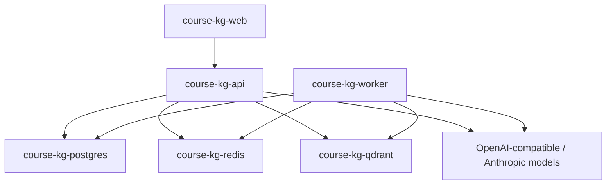

# Infra

## Default recovery scheduler

The default stack runs `course-kg-beat` as a separate Celery Beat process. It
publishes `reconcile_interrupted_ingestion_batches` every 60 seconds; the
`course-kg-worker` process only consumes tasks and never embeds Beat. The Beat
health check verifies both the PID 1 command and the persistent schedule file.

```powershell
docker compose -f infra/docker-compose.yml ps beat
docker logs --tail 100 course-kg-beat
```

## Application data volume

The default API and worker `DATA_ROOT=/app/data` is a shared Docker managed
volume (`symbograph-data`), not a host bind mount. Source documents enter the
system through the Upload API/frontend or the guarded rebuild workflow; the
Compose stack does not mount a repository-specific sample directory.

## 项目简介

`infra` 保存 SymboGraph 默认 Docker Compose 运行环境，包含 API、Worker、Web、PostgreSQL、Redis 和 Qdrant。

## 目录

| 路径 | 职责 |
| --- | --- |
| `docker-compose.yml` | 默认本地 Docker 栈：API、Worker、Web dev server、PostgreSQL、Redis、Qdrant。 |
| `README.md` | Compose 运行说明。 |

## 产品定位

默认运行路径是 Docker Compose。涉及 PostgreSQL、Qdrant、Redis、模型接口和无 fallback 的集成路径必须在该栈内验证。

## 技术栈

| 服务 | 技术 |
| --- | --- |
| API | FastAPI container |
| Worker | Celery container |
| Web | Next.js container |
| Metadata | PostgreSQL 16 |
| Cache / broker | Redis 7 |
| Vector index | Qdrant 1.17.1 |

## 主链路



## 环境配置

首次启动前创建 `.env`：

```powershell
Copy-Item .env.example .env
```

关键模型配置：

```env
CHAT_API_KEY=...
CHAT_API_PROTOCOL=openai
CHAT_BASE_URL=https://your-chat-endpoint/v1
CHAT_MODEL=your-chat-model
GRAPH_API_KEY=...
GRAPH_API_PROTOCOL=openai
GRAPH_BASE_URL=https://your-graph-endpoint/v1
GRAPH_MODEL=your-graph-model
EMBEDDING_API_KEY=...
EMBEDDING_API_PROTOCOL=openai
EMBEDDING_BASE_URL=https://your-embedding-endpoint/v1
EMBEDDING_MODEL=your-embedding-model
EMBEDDING_DIMENSIONS=1024
ENABLE_MODEL_FALLBACK=false
ENABLE_DATABASE_FALLBACK=false
```

`CHAT_API_PROTOCOL`, `GRAPH_API_PROTOCOL`, and `EMBEDDING_API_PROTOCOL` are independent. For Anthropic chat/graph, use the provider root/path prefix and do not end the base URL in `/v1` or `/v1/messages`; the client and bridge append `/v1/messages`. OpenAI-compatible chat/graph append `/chat/completions`. Embedding currently accepts only `EMBEDDING_API_PROTOCOL=openai`, appends `/embeddings`, and is rebuild-required; Anthropic Messages is not an embedding protocol.

### Single root runtime env

The repository-root `.env` is the only configuration authority. Compose uses
it for initial process injection and bind-mounts the repository at `/workspace`;
API, Worker and Beat all set `RUNTIME_ENV_FILE=/workspace/.env`. The API mount
is writable so the Settings endpoint can atomically replace that exact file;
Worker and Beat mounts are read-only. No runtime-config volume, `desired.env`,
service-local env file or database value snapshot exists.

The Settings endpoint validates the complete prospective configuration before
an atomic root-file replacement. Hot-reloadable keys are applied to the current
API process and broadcast through Redis. Rebuild-required keys remain pending
until the candidate/shadow/evaluation/promotion lifecycle completes. Service-
recreate-required keys are visible in `.env` immediately but the running
process keeps its startup value until explicit Compose recreation.

An in-process version refresh reverse-applies only keys declared by the
runtime-settings lifecycle. Deployment settings such as `DATA_ROOT`,
`DATABASE_URL`, and `REDIS_URL` are never overwritten from this file during a
refresh. A process-local value changed explicitly after the preceding managed
refresh is preserved only when it is outside that lifecycle set. Runtime keys
remain root-file authoritative, and sibling API/Worker processes consume
the same file independently at their own task/request refresh boundary.

The local settings cache token binds the normalized source path, strong file
identity (`device`/`inode`/size/mtime/ctime), and a process-keyed content
digest. Consequently an equal-size atomic replacement with a preserved mtime
still invalidates `get_settings()`. The keyed digest is used only in process
and never exposes an env value or a reusable unkeyed secret hash.

When the API mirrors its own successful runtime-settings save into
`os.environ`, it updates the same managed-value tracker used by later version
refreshes. A subsequent Worker/API writer can therefore advance that process
again; the process does not mistake its own previous save for an operator
override.

The writer lock lives in the operating-system temporary directory and contains
no settings. Atomic-write temporaries exist only for the duration of a same-
directory replace; no persistent sibling copy or recovery file is created.

容器内固定覆盖：

```text
POSTGRES_USER=symbograph
POSTGRES_PASSWORD=<local-random-password>
POSTGRES_DB=symbograph
DATABASE_URL=postgresql+psycopg://symbograph:<local-random-password>@postgres:5432/symbograph
QDRANT_URL=http://qdrant:6333
REDIS_URL=redis://redis:6379/0
DATA_ROOT=/app/data
```

## 快速启动

启动完整栈：

```powershell
docker compose -f infra/docker-compose.yml up -d --build
```

查看服务：

```powershell
docker compose -f infra/docker-compose.yml ps
```

## 参数列表

| 分类 | 参数 |
| --- | --- |
| 镜像与端口 | `API_IMAGE`, `WEB_IMAGE`, `API_HOST_PORT`, `WEB_HOST_PORT` |
| 数据服务 | `DATABASE_URL`, `QDRANT_URL`, `QDRANT_COLLECTION`, `REDIS_URL` |
| 数据目录 | `DATA_ROOT`, `STORAGE_ROOT`, `INGESTION_ROOT` |
| 模型 | `MODEL_BRIDGE_ENABLED`, `MODEL_BRIDGE_PORT`, `MODEL_BRIDGE_ADMIN_TOKEN`, `CHAT_*`, `EMBEDDING_*` |
| Auto TPE | `ENABLE_AUTO_TPE`, `TPE_TRIAL_BUDGET`, `TPE_STARTUP_RANDOM_TRIALS`, `TPE_GOOD_QUANTILE_GAMMA`, `TPE_PROBE_QUERY_BUDGET`, `TPE_TRIAL_TIMEOUT_SECONDS`, `TPE_CANDIDATE_POOL_SIZE`, `OPERATING_POINT_HARD_GATE_*` |
| Worker | `WORKER_CONCURRENCY`, `INGESTION_TASK_QUEUE` |
| Fallback | `ENABLE_MODEL_FALLBACK`, `ENABLE_DATABASE_FALLBACK` |

## 验证

```powershell
Invoke-WebRequest -UseBasicParsing http://127.0.0.1:8000/api/health
Invoke-WebRequest -UseBasicParsing http://127.0.0.1:3000
docker exec -w /app/apps/api course-kg-api python -m pytest tests
```

## 运维测试

```powershell
docker compose -f infra/docker-compose.yml logs -f api
docker compose -f infra/docker-compose.yml logs -f worker
docker compose -f infra/docker-compose.yml logs -f beat
docker compose -f infra/docker-compose.yml restart api worker beat
python scripts/docker_smoke.py --base-url http://127.0.0.1:8000/api
python scripts/docker_smoke.py --base-url http://127.0.0.1:8000/api --execute
```

不带 `--execute` 的 smoke 只做 GET 预检并输出精确 POST 计划；确认 KB、query、
`/search`、`/qa` 和持久化影响后，才运行第二条完整验收命令。

## 文档

- [../README.md](../README.md)：仓库总览。
- [../apps/api/README.md](../apps/api/README.md)：API 后端。
- [../apps/worker/README.md](../apps/worker/README.md)：Worker。
- [../scripts/README.md](../scripts/README.md)：运维脚本。

## 边界

- 不绕过 Docker 直接修改生产形态 PostgreSQL、Redis 或 Qdrant。
- Compose 默认服务名保持 `course-kg-*`。
- API 容器工作目录是 `/app/apps/api`，脚本挂载到 `/app/scripts`，数据目录挂载到 `/app/data`。
- 模型桥启用时，容器内客户端地址使用 `host.docker.internal`，宿主机脚本使用 `127.0.0.1`，真实对话和向量 endpoint 保存在 `CHAT_BASE_URL`/`EMBEDDING_BASE_URL`；图谱构建 endpoint 独立保存在 `GRAPH_BASE_URL`。
- 诊断与 smoke 输出写入被 Git 忽略的 `output/`，核验后可清空；不得写入凭据或 provider 原文。
- 改动端口、镜像依赖、Celery pool/fork 规模等需要 service recreate 或 rebuild。
