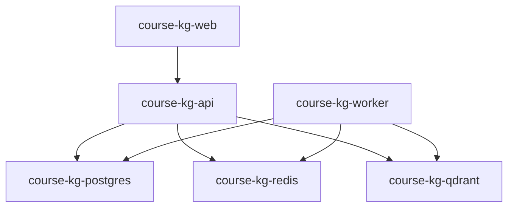

# Infra 使用指南

`infra` 保存 SymboGraph 的默认 Docker Compose 运行环境。默认栈包括 API、worker、web、PostgreSQL、Redis 和 Qdrant。

## 启动完整栈

```powershell
docker compose -f infra/docker-compose.yml up -d --build
```

启动前建议从根模板创建配置：

```powershell
Copy-Item .env.example .env
```

至少配置 chat 和 embedding 端点：

```env
OPENAI_API_KEY=...
CHAT_BASE_URL=https://your-chat-endpoint/v1
CHAT_MODEL=your-chat-model
EMBEDDING_BASE_URL=https://your-embedding-endpoint/v1
EMBEDDING_MODEL=your-embedding-model
EMBEDDING_DIMENSIONS=1024
```

## 默认服务

| 服务 | 容器名 | 用途 |
| --- | --- | --- |
| `api` | `course-kg-api` | FastAPI 后端 |
| `worker` | `course-kg-worker` | Celery 长任务 |
| `web` | `course-kg-web` | Next.js 前端 |
| `postgres` | `course-kg-postgres` | 元数据事实源 |
| `redis` | `course-kg-redis` | Celery broker、缓存、运行时广播 |
| `qdrant` | `course-kg-qdrant` | active chunk 向量索引 |



## 常用命令

```powershell
docker compose -f infra/docker-compose.yml ps
docker compose -f infra/docker-compose.yml logs -f api
docker compose -f infra/docker-compose.yml restart api worker
docker compose -f infra/docker-compose.yml down
```

## 健康检查

```powershell
Invoke-WebRequest -UseBasicParsing http://127.0.0.1:8000/api/health
Invoke-WebRequest -UseBasicParsing http://127.0.0.1:3000
```

## 验收

```powershell
python scripts\docker_smoke.py --base-url http://127.0.0.1:8000/api --worker-container course-kg-worker
```

## Cross-Encoder reranker 可选配置

默认关闭：

```env
RERANKER_ENABLED=false
```

启用 CPU rerank：

```env
RERANKER_ENABLED=true
RERANKER_MODEL=cross-encoder/ms-marco-MiniLM-L-6-v2
RERANKER_MAX_LENGTH=512
RERANKER_DEVICE=cpu
```

如需把默认模型预热进 API 镜像：

```powershell
docker build -f apps/api/Dockerfile -t course-kg-api:local --build-arg PRELOAD_RERANK_MODEL=true .
```

## 注意事项

- 不要绕过 Docker 直接修改生产形态的 PostgreSQL、Redis 或 Qdrant 状态。
- 服务名重命名属于基础设施变更，应单独处理。
- `experiment` profile 不是默认运行路径。
- 运行日志、smoke 输出和临时报告写入仓库根目录 `output/`。
- 完整环境参数说明见根目录 [README.md](../README.md)。
